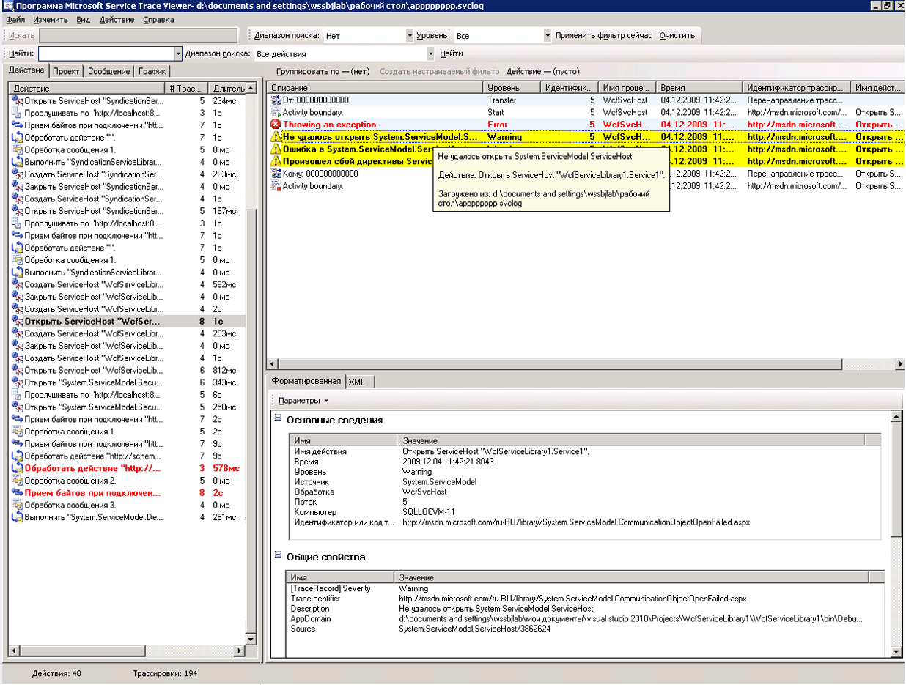
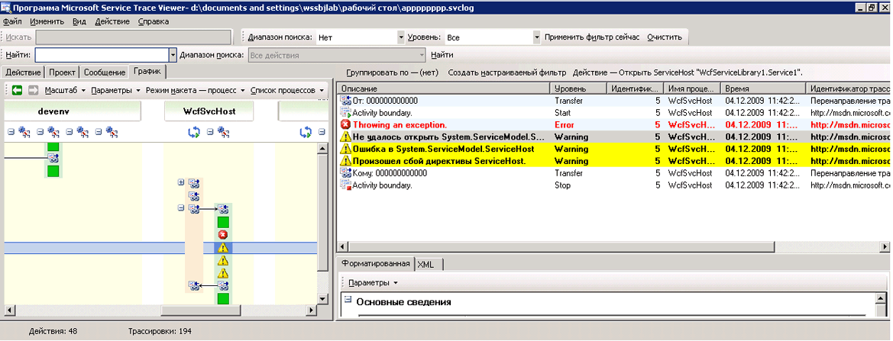

# <a name="emitting-user-code-traces"></a>Создание трассировки пользовательского кода
Помимо возможности включения трассировки в конфигурации для сбора данных инструментирования, созданный Windows Communication Foundation (WCF), можно также создавать трассировки программно в пользовательском коде. Таким образом можно заранее создавать данные инструментирования для их последующего использования в диагностических целях. В этом разделе описывается, как это сделать.  
  
 Кроме того [расширение трассировки](../../../../../docs/framework/wcf/samples/extending-tracing.md) пример включает весь код, показанный в следующих разделах.  
  
## <a name="creating-a-trace-source"></a>Создание источника трассировки  
 Можно использовать следующий код для создания пользовательского источника трассировки.  
  
```  
TraceSource ts = new TraceSource("myUserTraceSource");  
```  
  
## <a name="creating-activities"></a>Создание действий  
 Действия являются логическим блоком обработки. Для каждого основного блока обработки, в котором требуется сгруппировать трассировки, можно создать одно действие. Например, для каждого запроса к службе можно создать одно действие. Для этого выполните следующие действия.  
  
1.  Сохраните идентификатор действия в области.  
  
2.  Создайте новый идентификатор действия.  
  
3.  Выполните перенаправление от действия в области к новому действию, настройте новое действие в области и создайте трассировку запуска действий для данного действия.  
  
 В следующем коде показано, как это сделать.  
  
```  
Guid oldID = Trace.CorrelationManager.ActivityId;  
Guid traceID = Guid.NewGuid();  
ts.TraceTransfer(0, "transfer", traceID);  
Trace.CorrelationManager.ActivityId = traceID; // Trace is static  
ts.TraceEvent(TraceEventType.Start, 0, "Add request");  
```  
  
## <a name="emitting-traces-within-a-user-activity"></a>Создание трассировок в действии пользователя  
 В следующем коде показано создание трассировок в действии пользователя.  
  
```  
double value1 = 100.00D;  
double value2 = 15.99D;  
ts.TraceInformation("Client sends message to Add " + value1 + ", " + value2);  
double result = client.Add(value1, value2);  
ts.TraceInformation("Client receives Add response '" + result + "'");  
```  
  
## <a name="stopping-the-activities"></a>Остановка действий  
 Чтобы остановить действия, выполните перенаправление к прежнему действию, остановите текущее действие и сбросьте идентификатор прежнего действия в области.  
  
 В следующем коде показано, как это сделать.  
  
```  
ts.TraceTransfer(0, "transfer", oldID);  
ts.TraceEvent(TraceEventType.Stop, 0, "Add request");  
Trace.CorrelationManager.ActivityId = oldID;  
```  
  
## <a name="propagating-the-activity-id-to-a-service"></a>Распространение идентификатора действия на службу  
 Если задать атрибуту `propagateActivity` значение `true` для источника трассировки `System.ServiceModel` и в файле конфигурации клиента, и в файле конфигурации службы, служба обработки запроса на добавление будет присутствовать в том же действии, что и определено в клиенте. Если служба определяет собственные действия и перенаправления, трассировки службы не содержатся в распространенном клиентом действии. Вместо этого они содержатся в действии, связанном трассировками перенаправления с действием, идентификатор которого распространяется клиентом.  
  
> [!NOTE]
>  Если `propagateActivity` атрибута задано значение `true` клиента и службы, внешнее действие в область определения операции службы задается WCF.  
  
 Чтобы проверить, задано ли в области действия в WCF можно использовать следующий код.  
  
```  
// Check if an activity was set in scope by WCF, if it was   
// propagated from the client. If not, ( ambient activity is   
// equal to Guid.Empty), create a new one.  
if(Trace.CorrelationManager.ActivityId == Guid.Empty)  
{  
    Guid newGuid = Guid.NewGuid();  
    Trace.CorrelationManager.ActivityId = newGuid;  
}  
// Emit your Start trace.  
ts.TraceEvent(TraceEventType.Start, 0, "Add Activity");  
  
// Emit the processing traces for that request.  
serviceTs.TraceInformation("Service receives Add "   
                            + n1 + ", " + n2);  
// double result = n1 + n2;  
serviceTs.TraceInformation("Service sends Add result" + result);  
  
// Emit the Stop trace and exit the method scope.  
ts.TraceEvent(TraceEventType.Stop, 0, "Add Activity");  
// return result;  
```  
  
## <a name="tracing-exceptions-thrown-in-code"></a>Трассировка вызванных в коде исключений  
 При вызове исключения в коде можно также выполнить трассировку исключения на пороге предупреждений или следующем уровне посредством следующего кода.  
  
```  
ts.TraceEvent(TraceEventType.Warning, 0, "Throwing exception " + "exceptionMessage");  
```  
  
## <a name="viewing-user-traces-in-the-service-trace-viewer-tool"></a>Просмотр пользовательских трассировок в программе Service Trace Viewer  
 В этом разделе содержатся снимки экранов трассировок, созданные при выполнении [расширение трассировки](../../../../../docs/framework/wcf/samples/extending-tracing.md) выборки, при просмотре с помощью [программы Service Trace Viewer (SvcTraceViewer.exe)](../../../../../docs/framework/wcf/service-trace-viewer-tool-svctraceviewer-exe.md).  
  
 На следующей схеме созданное ранее действие «Добавить запрос» выбрано на левой панели. Это действие входит в список с тремя другими математическими действиями ("Вычесть", "Умножить" и "Разделить"), образующими клиентское приложение. Во избежание потенциального появления ошибок в разных запросах в пользовательском коде для каждой операции определяется одно новое действие.  
  
 Чтобы продемонстрировать использование передач [расширение трассировки](../../../../../docs/framework/wcf/samples/extending-tracing.md) образца, также создается действие Calculator, включающий в себя четыре операции запросов. Для каждого запроса существует перенаправление в прямом и обратном направлениях от действия "Калькулятор" к действию запроса (на рисунке трассировка выделена на верхней правой панели).  
  
 Когда на левой панели выбирается действие, на верхней правой панели отображаются трассировки, включаемые этим действием. Если `propagateActivity` — `true` во всех конечных точках пути запроса, трассировки в действии запроса создаются из всех процессов, участвующих в запросе. В этом примере в четвертом столбце панели представлены и трассировки, происходящие из клиента, и трассировки, происходящие из службы.  
  
 В этом действии следующий порядок обработки.  
  
1.  Клиент отправляет сообщение, которое требуется "Добавить".  
  
2.  Служба получает сообщение запроса "Добавить".  
  
3.  Служба отправляет ответ "Добавить".  
  
4.  Клиент получает ответ "Добавить".  
  
 Все эти шаги выполнены на уровне "Данные". При выборе трассировки в верхней правой панели в нижней правой панели отображаются сведения об этой трассировке.  
  
 На следующей схеме представлены трассировки перенаправлений из и в действие "Калькулятор", а также две пары трассировок "Запуск" и "Остановка" для действий запроса - одна для клиента и одна для службы (по одной для каждого источника трассировки).  
  
   
Действия, перечисленные по времени создания (левая панель), и связанные с ними вложенные действия (верхняя правая панель)  
  
 Если код службы создает исключение, по причине которого клиент также создает исключение (например, когда клиент не получает ответ на запрос), для непосредственной корреляции предупреждения службы и клиента или сообщения об ошибке появляются в одном и том же действии. На следующей схеме служба вызывает исключение, сформулированное «служба отказывается обрабатывать этот запрос в пользовательском коде». Клиент также создает исключение, сформулированное «серверу не удалось обработать запрос из-за внутренней ошибки.»  
  
   
Если идентификатор действия запроса был распространен, ошибки, вызванные данным запросом в конечных точках, отображаются в том же действии.  
  
 При двойном нажатии на действии "Умножить" на левой панели отображается следующий граф, содержащий трассировки действия "Умножить" для каждого задействованного процесса. Видно, что сперва предупреждение возникло в службе (создано исключение), затем последовали предупреждения и ошибки в клиенте вызванные тем, что запрос не может быть обработан. Таким образом можно сделать вывод о причинной взаимосвязи ошибок между конечными точками и выявить первопричину ошибки.  
  
   
Графическое представление корреляции ошибок  
  
 Для получения предыдущих трассировок мы задаем значение `ActivityTracing` пользовательским источникам трассировки и значение `propagateActivity=true` источнику трассировки `System.ServiceModel`. Мы не задали значение `ActivityTracing` источнику трассировки `System.ServiceModel`, чтобы включить пользовательский код в распространение действий пользовательского кода. (Если трассировка действия ServiceModel включена, определенный в клиенте идентификатор действия не распространяется до пользовательский код службы; Перенаправления, тем не менее, коррелируют клиентом и службой действия пользовательского кода промежуточные действия WCF.)  
  
 Определение действий и распространение идентификатора действия позволяет осуществить непосредственную корреляцию ошибок в конечных точках. Это ускоряет выявление первопричины ошибки.  
  
## <a name="see-also"></a>См. также  
 [Расширение трассировки](../../../../../docs/framework/wcf/samples/extending-tracing.md)
