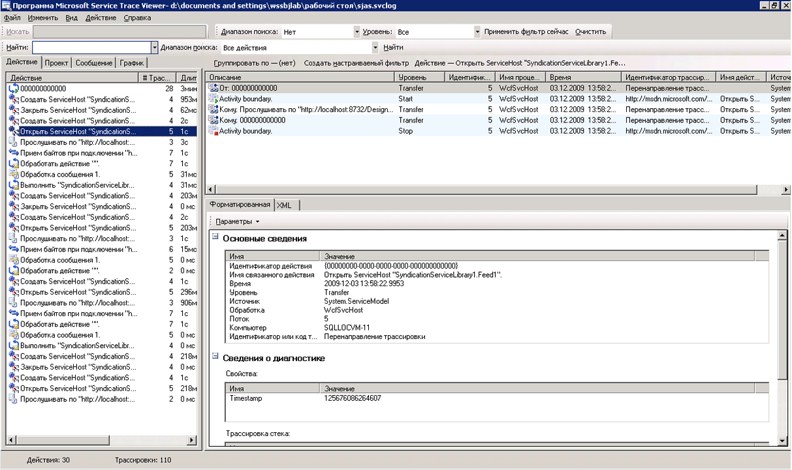

# <a name="emitting-user-code-traces"></a><span data-ttu-id="bfd9f-102">Создание трассировки пользовательского кода</span><span class="sxs-lookup"><span data-stu-id="bfd9f-102">Emitting User-Code Traces</span></span>

<span data-ttu-id="bfd9f-103">Помимо возможности включения трассировки в конфигурации для сбора данных инструментирования, созданный Windows Communication Foundation (WCF), вы также существует возможность создавать трассировки программно в пользовательском коде.</span><span class="sxs-lookup"><span data-stu-id="bfd9f-103">In addition to enabling tracing in configuration to collect instrumentation data generated by Windows Communication Foundation (WCF), you can also emit traces programmatically in user code.</span></span> <span data-ttu-id="bfd9f-104">Таким образом можно заранее создавать данные инструментирования для их последующего использования в диагностических целях.</span><span class="sxs-lookup"><span data-stu-id="bfd9f-104">In this way, you can proactively create instrumentation data that you can peruse later for diagnostic purpose.</span></span> <span data-ttu-id="bfd9f-105">В этом разделе описывается, как это сделать.</span><span class="sxs-lookup"><span data-stu-id="bfd9f-105">This topic discusses how you can do this.</span></span>

<span data-ttu-id="bfd9f-106">Кроме того [расширение трассировки](../../../../../docs/framework/wcf/samples/extending-tracing.md) пример включает все сегменты кода, в следующих разделах.</span><span class="sxs-lookup"><span data-stu-id="bfd9f-106">In addition, the [Extending Tracing](../../../../../docs/framework/wcf/samples/extending-tracing.md) sample includes all the code demonstrated in the following sections.</span></span>

## <a name="creating-a-trace-source"></a><span data-ttu-id="bfd9f-107">Создание источника трассировки</span><span class="sxs-lookup"><span data-stu-id="bfd9f-107">Creating a Trace Source</span></span>

<span data-ttu-id="bfd9f-108">Можно использовать следующий код для создания пользовательского источника трассировки.</span><span class="sxs-lookup"><span data-stu-id="bfd9f-108">You can use the following code to create a user trace source.</span></span>

```csharp
TraceSource ts = new TraceSource("myUserTraceSource");
```

## <a name="creating-activities"></a><span data-ttu-id="bfd9f-109">Создание действий</span><span class="sxs-lookup"><span data-stu-id="bfd9f-109">Creating Activities</span></span>

<span data-ttu-id="bfd9f-110">Действия являются логическим блоком обработки.</span><span class="sxs-lookup"><span data-stu-id="bfd9f-110">Activities are logical unit of processing.</span></span> <span data-ttu-id="bfd9f-111">Для каждого основного блока обработки, в котором требуется сгруппировать трассировки, можно создать одно действие.</span><span class="sxs-lookup"><span data-stu-id="bfd9f-111">You can create one activity for each major processing unit in which you want traces to be grouped together.</span></span> <span data-ttu-id="bfd9f-112">Например, для каждого запроса к службе можно создать одно действие.</span><span class="sxs-lookup"><span data-stu-id="bfd9f-112">For example, you can create one activity for each request to the service.</span></span> <span data-ttu-id="bfd9f-113">Для этого выполните следующие действия.</span><span class="sxs-lookup"><span data-stu-id="bfd9f-113">To do so, perform the following steps.</span></span>

1. <span data-ttu-id="bfd9f-114">Сохраните идентификатор действия в области.</span><span class="sxs-lookup"><span data-stu-id="bfd9f-114">Save the activity ID in scope.</span></span>

2. <span data-ttu-id="bfd9f-115">Создайте новый идентификатор действия.</span><span class="sxs-lookup"><span data-stu-id="bfd9f-115">Create a new activity ID.</span></span>

3. <span data-ttu-id="bfd9f-116">Выполните перенаправление от действия в области к новому действию, настройте новое действие в области и создайте трассировку запуска действий для данного действия.</span><span class="sxs-lookup"><span data-stu-id="bfd9f-116">Transfer from the activity in scope to the new one, set the new activity in scope and emit a start trace for that activity.</span></span>

<span data-ttu-id="bfd9f-117">В следующем коде показано, как это сделать.</span><span class="sxs-lookup"><span data-stu-id="bfd9f-117">The following code demonstrates how to do this.</span></span>

```csharp
Guid oldID = Trace.CorrelationManager.ActivityId;
Guid traceID = Guid.NewGuid();
ts.TraceTransfer(0, "transfer", traceID);
Trace.CorrelationManager.ActivityId = traceID; // Trace is static
ts.TraceEvent(TraceEventType.Start, 0, "Add request");
```

## <a name="emitting-traces-within-a-user-activity"></a><span data-ttu-id="bfd9f-118">Создание трассировок в действии пользователя</span><span class="sxs-lookup"><span data-stu-id="bfd9f-118">Emitting Traces within a User Activity</span></span>

<span data-ttu-id="bfd9f-119">В следующем коде показано создание трассировок в действии пользователя.</span><span class="sxs-lookup"><span data-stu-id="bfd9f-119">The following code emits traces within a user activity.</span></span>

```csharp
double value1 = 100.00D;
double value2 = 15.99D;
ts.TraceInformation("Client sends message to Add " + value1 + ", " + value2);
double result = client.Add(value1, value2);
ts.TraceInformation("Client receives Add response '" + result + "'");
```

## <a name="stopping-the-activities"></a><span data-ttu-id="bfd9f-120">Остановка действий</span><span class="sxs-lookup"><span data-stu-id="bfd9f-120">Stopping the Activities</span></span>

<span data-ttu-id="bfd9f-121">Чтобы остановить действия, выполните перенаправление к прежнему действию, остановите текущее действие и сбросьте идентификатор прежнего действия в области.</span><span class="sxs-lookup"><span data-stu-id="bfd9f-121">To stop the activities, transfer back to the old activity, stop the current activity id, and reset the old activity id in scope.</span></span>

<span data-ttu-id="bfd9f-122">В следующем коде показано, как это сделать.</span><span class="sxs-lookup"><span data-stu-id="bfd9f-122">The following code demonstrates how to do this.</span></span>

```csharp
ts.TraceTransfer(0, "transfer", oldID);
ts.TraceEvent(TraceEventType.Stop, 0, "Add request");
Trace.CorrelationManager.ActivityId = oldID;
```

## <a name="propagating-the-activity-id-to-a-service"></a><span data-ttu-id="bfd9f-123">Распространение идентификатора действия на службу</span><span class="sxs-lookup"><span data-stu-id="bfd9f-123">Propagating the Activity ID to A Service</span></span>

<span data-ttu-id="bfd9f-124">Если задать атрибуту `propagateActivity` значение `true` для источника трассировки `System.ServiceModel` и в файле конфигурации клиента, и в файле конфигурации службы, служба обработки запроса на добавление будет присутствовать в том же действии, что и определено в клиенте.</span><span class="sxs-lookup"><span data-stu-id="bfd9f-124">If you set the `propagateActivity` attribute to `true` for the `System.ServiceModel` trace source in both the client and service configuration files, the service processing for the Add request occurs in the same activity as the one defined in the client.</span></span> <span data-ttu-id="bfd9f-125">Если служба определяет собственные действия и перенаправления, трассировки службы не содержатся в распространенном клиентом действии.</span><span class="sxs-lookup"><span data-stu-id="bfd9f-125">If the service defines its own activities and transfers, the service traces do not appear in the client-propagated activity.</span></span> <span data-ttu-id="bfd9f-126">Вместо этого они содержатся в действии, связанном трассировками перенаправления с действием, идентификатор которого распространяется клиентом.</span><span class="sxs-lookup"><span data-stu-id="bfd9f-126">Instead, they appear in an activity correlated by transfer traces to the activity whose ID is propagated by the client.</span></span>

> [!NOTE]
> <span data-ttu-id="bfd9f-127">Если `propagateActivity` атрибуту присваивается `true` на клиента и службы, внешнее действие в области операции службы задается с WCF.</span><span class="sxs-lookup"><span data-stu-id="bfd9f-127">If the `propagateActivity` attribute is set to `true` on both the client and service, the ambient activity in the operation scope of the service is set by WCF.</span></span>

<span data-ttu-id="bfd9f-128">Чтобы проверить, задано ли в области действия с WCF можно использовать следующий код.</span><span class="sxs-lookup"><span data-stu-id="bfd9f-128">You can use the following code to check whether an activity was set in scope by WCF.</span></span>

```csharp
// Check if an activity was set in scope by WCF, if it was
// propagated from the client. If not, ( ambient activity is
// equal to Guid.Empty), create a new one.
if(Trace.CorrelationManager.ActivityId == Guid.Empty)
{
    Guid newGuid = Guid.NewGuid();
    Trace.CorrelationManager.ActivityId = newGuid;
}
// Emit your Start trace.
ts.TraceEvent(TraceEventType.Start, 0, "Add Activity");

// Emit the processing traces for that request.
serviceTs.TraceInformation("Service receives Add "
                            + n1 + ", " + n2);
// double result = n1 + n2;
serviceTs.TraceInformation("Service sends Add result" + result);

// Emit the Stop trace and exit the method scope.
ts.TraceEvent(TraceEventType.Stop, 0, "Add Activity");
// return result;
```

## <a name="tracing-exceptions-thrown-in-code"></a><span data-ttu-id="bfd9f-129">Трассировка вызванных в коде исключений</span><span class="sxs-lookup"><span data-stu-id="bfd9f-129">Tracing Exceptions Thrown in Code</span></span>

<span data-ttu-id="bfd9f-130">При вызове исключения в коде можно также выполнить трассировку исключения на пороге предупреждений или следующем уровне посредством следующего кода.</span><span class="sxs-lookup"><span data-stu-id="bfd9f-130">When you throw an exception in code, you can also trace the exception at Warning level or up using the following code.</span></span>

```csharp
ts.TraceEvent(TraceEventType.Warning, 0, "Throwing exception " + "exceptionMessage");
```

## <a name="viewing-user-traces-in-the-service-trace-viewer-tool"></a><span data-ttu-id="bfd9f-131">Просмотр пользовательских трассировок в программе Service Trace Viewer</span><span class="sxs-lookup"><span data-stu-id="bfd9f-131">Viewing User Traces in the Service Trace Viewer Tool</span></span>

<span data-ttu-id="bfd9f-132">В этом разделе содержатся снимки экранов трассировок, при выполнении [расширение трассировки](../../../../../docs/framework/wcf/samples/extending-tracing.md) пример, при просмотре с помощью [программа Service Trace Viewer (SvcTraceViewer.exe)](../../../../../docs/framework/wcf/service-trace-viewer-tool-svctraceviewer-exe.md).</span><span class="sxs-lookup"><span data-stu-id="bfd9f-132">This section contains screenshots of traces generated by running the [Extending Tracing](../../../../../docs/framework/wcf/samples/extending-tracing.md) sample, when viewed using the [Service Trace Viewer Tool (SvcTraceViewer.exe)](../../../../../docs/framework/wcf/service-trace-viewer-tool-svctraceviewer-exe.md).</span></span>

<span data-ttu-id="bfd9f-133">На следующей схеме созданное ранее действие «Добавить запрос» выбрано на левой панели.</span><span class="sxs-lookup"><span data-stu-id="bfd9f-133">In the following diagram, the "Add request" activity created previously is selected on the left panel.</span></span> <span data-ttu-id="bfd9f-134">Это действие входит в список с тремя другими математическими действиями ("Вычесть", "Умножить" и "Разделить"), образующими клиентское приложение.</span><span class="sxs-lookup"><span data-stu-id="bfd9f-134">It is listed with three other Math operation activities (Divide, Subtract, Multiply) that constitute the application client program.</span></span> <span data-ttu-id="bfd9f-135">Во избежание потенциального появления ошибок в разных запросах в пользовательском коде для каждой операции определяется одно новое действие.</span><span class="sxs-lookup"><span data-stu-id="bfd9f-135">The user code has defined one new activity for each operation to isolate potential error occurrences in different requests.</span></span>

<span data-ttu-id="bfd9f-136">Чтобы продемонстрировать использование перенаправлений, в [расширение трассировки](../../../../../docs/framework/wcf/samples/extending-tracing.md) образец, также создается действие калькулятора, который инкапсулирует запросы с четырьмя операциями.</span><span class="sxs-lookup"><span data-stu-id="bfd9f-136">To demonstrate the use of transfers in the [Extending Tracing](../../../../../docs/framework/wcf/samples/extending-tracing.md) sample, a Calculator activity that encapsulates the four operation requests is also created.</span></span> <span data-ttu-id="bfd9f-137">Для каждого запроса существует перенаправление в прямом и обратном направлениях от действия "Калькулятор" к действию запроса (на рисунке трассировка выделена на верхней правой панели).</span><span class="sxs-lookup"><span data-stu-id="bfd9f-137">For each request, there is a transfer back and forth from the Calculator activity to the request activity (trace is highlighted in the upper right panel in the figure).</span></span>

<span data-ttu-id="bfd9f-138">Когда на левой панели выбирается действие, на верхней правой панели отображаются трассировки, включаемые этим действием.</span><span class="sxs-lookup"><span data-stu-id="bfd9f-138">When you select an activity on the left panel, the traces included by this activity are shown on the upper right panel.</span></span> <span data-ttu-id="bfd9f-139">Если `propagateActivity` — `true` во всех конечных точках пути запроса, трассировки в действии запроса, из всех процессов, участвующих в запросе.</span><span class="sxs-lookup"><span data-stu-id="bfd9f-139">If `propagateActivity` is `true` at every endpoint in the request path, traces in the request activity are from all processes that participate in the request.</span></span> <span data-ttu-id="bfd9f-140">В этом примере в четвертом столбце панели представлены и трассировки, происходящие из клиента, и трассировки, происходящие из службы.</span><span class="sxs-lookup"><span data-stu-id="bfd9f-140">In this example, you can see traces from both the client and service in the 4th column in the panel.</span></span>

<span data-ttu-id="bfd9f-141">В этом действии следующий порядок обработки.</span><span class="sxs-lookup"><span data-stu-id="bfd9f-141">This activity shows the following order of processing:</span></span>

1. <span data-ttu-id="bfd9f-142">Клиент отправляет сообщение, которое требуется "Добавить".</span><span class="sxs-lookup"><span data-stu-id="bfd9f-142">Client sends message to Add.</span></span>

2. <span data-ttu-id="bfd9f-143">Служба получает сообщение запроса "Добавить".</span><span class="sxs-lookup"><span data-stu-id="bfd9f-143">Service receives Add request message.</span></span>

3. <span data-ttu-id="bfd9f-144">Служба отправляет ответ "Добавить".</span><span class="sxs-lookup"><span data-stu-id="bfd9f-144">Service sends Add response.</span></span>

4. <span data-ttu-id="bfd9f-145">Клиент получает ответ "Добавить".</span><span class="sxs-lookup"><span data-stu-id="bfd9f-145">Client receives Add response.</span></span>

<span data-ttu-id="bfd9f-146">Все эти шаги выполнены на уровне "Данные".</span><span class="sxs-lookup"><span data-stu-id="bfd9f-146">All these traces were emitted at Information level.</span></span> <span data-ttu-id="bfd9f-147">При выборе трассировки в верхней правой панели в нижней правой панели отображаются сведения об этой трассировке.</span><span class="sxs-lookup"><span data-stu-id="bfd9f-147">Clicking a trace in the upper-right panel shows the details of that trace in the lower-right panel.</span></span>

<span data-ttu-id="bfd9f-148">На следующей схеме представлены трассировки перенаправлений из и в действие "Калькулятор", а также две пары трассировок "Запуск" и "Остановка" для действий запроса - одна для клиента и одна для службы (по одной для каждого источника трассировки).</span><span class="sxs-lookup"><span data-stu-id="bfd9f-148">In the following diagram, we also see transfer traces from and to the Calculator activity, as well as two pairs of Start and Stop traces per request activity, one for the client and one for the service (one for each trace source).</span></span>

<span data-ttu-id="bfd9f-149"> список действий по дате создания (левая панель) и их вложенных действий (в верхней правой панели)</span><span class="sxs-lookup"><span data-stu-id="bfd9f-149"> List of activities by creation time (left panel) and their nested activities (upper-right panel)</span></span>

<span data-ttu-id="bfd9f-150">Если код службы создает исключение, по причине которого клиент также создает исключение (например, когда клиент не получает ответ на запрос), для непосредственной корреляции предупреждения службы и клиента или сообщения об ошибке появляются в одном и том же действии.</span><span class="sxs-lookup"><span data-stu-id="bfd9f-150">If the service code throws an exception that causes the client to throw as well (for example, when the client did not get the response to its request), both the service and client warning or error messages occur in the same activity for direct correlation.</span></span> <span data-ttu-id="bfd9f-151">На следующем рисунке служба вызывает исключение с сообщением «служба отказывается обрабатывать этот запрос в пользовательском коде».</span><span class="sxs-lookup"><span data-stu-id="bfd9f-151">In the following image, the service throws an exception that states "The service refuses to process this request in user code."</span></span> <span data-ttu-id="bfd9f-152">Клиент также создает исключение с сообщением «серверу не удалось обработать запрос из-за внутренней ошибки.»</span><span class="sxs-lookup"><span data-stu-id="bfd9f-152">The client also throws an exception that states "The server was unable to process the request due to an internal error."</span></span>

<span data-ttu-id="bfd9f-153">Ниже представлены ошибки между конечными точками для данного запроса отображаются в одном действии, если идентификатор действия запроса был распространен:</span><span class="sxs-lookup"><span data-stu-id="bfd9f-153">The following images shows that errors across endpoints for a given request appear in the same activity if the request activity id was propagated:</span></span>


<span data-ttu-id="bfd9f-155">При двойном нажатии на действии "Умножить" на левой панели отображается следующий граф, содержащий трассировки действия "Умножить" для каждого задействованного процесса.</span><span class="sxs-lookup"><span data-stu-id="bfd9f-155">Double-clicking the Multiply activity on the left panel shows the following graph, with the traces for the Multiply activity for each process involved.</span></span> <span data-ttu-id="bfd9f-156">Видно, что сперва предупреждение возникло в службе (создано исключение), затем последовали предупреждения и ошибки в клиенте вызванные тем, что запрос не может быть обработан.</span><span class="sxs-lookup"><span data-stu-id="bfd9f-156">We can see a warning first occurred at the service (exception thrown), which is followed by warnings and errors on the client because the request could not be processed.</span></span> <span data-ttu-id="bfd9f-157">Таким образом можно сделать вывод о причинной взаимосвязи ошибок между конечными точками и выявить основную причину ошибки.</span><span class="sxs-lookup"><span data-stu-id="bfd9f-157">Therefore, we can imply the causal error relationship between endpoints and derive the root cause of the error.</span></span>

<span data-ttu-id="bfd9f-158">На следующем рисунке показано графическое представление корреляции ошибок:</span><span class="sxs-lookup"><span data-stu-id="bfd9f-158">The following image shows a graph view of error correlation:</span></span>


<span data-ttu-id="bfd9f-160">Для получения предыдущих трассировок мы задаем значение `ActivityTracing` пользовательским источникам трассировки и значение `propagateActivity=true` источнику трассировки `System.ServiceModel`.</span><span class="sxs-lookup"><span data-stu-id="bfd9f-160">To obtain the previous traces, we set `ActivityTracing` for the user trace sources and `propagateActivity=true` for the `System.ServiceModel` trace source.</span></span> <span data-ttu-id="bfd9f-161">Мы не задали значение `ActivityTracing` источнику трассировки `System.ServiceModel`, чтобы включить пользовательский код в распространение действий пользовательского кода.</span><span class="sxs-lookup"><span data-stu-id="bfd9f-161">We did not set `ActivityTracing` for the `System.ServiceModel` trace source to enable user code to user code activity propagation.</span></span> <span data-ttu-id="bfd9f-162">(Если включена трассировка действий ServiceModel, идентификатор действия, определенный в клиенте не распространяется вплоть до пользовательский код службы; Передача, тем не менее, корреляции действий кода пользователя клиента и службы промежуточного действиям WCF.)</span><span class="sxs-lookup"><span data-stu-id="bfd9f-162">(When ServiceModel activity tracing is on, the activity ID defined in the client is not propagated all the way to the service user code; Transfers, however, correlate the client and service user code activities to the intermediate WCF activities.)</span></span>

<span data-ttu-id="bfd9f-163">Определение действий и распространение идентификатора действия позволяет осуществить непосредственную корреляцию ошибок в конечных точках.</span><span class="sxs-lookup"><span data-stu-id="bfd9f-163">Defining activities and propagating the activity ID enables us to perform direct error correlation across endpoints.</span></span> <span data-ttu-id="bfd9f-164">Это ускоряет выявление основной причины ошибки.</span><span class="sxs-lookup"><span data-stu-id="bfd9f-164">In this way, we can locate the root cause of an error more quickly.</span></span>

## <a name="see-also"></a><span data-ttu-id="bfd9f-165">См. также</span><span class="sxs-lookup"><span data-stu-id="bfd9f-165">See also</span></span>

- [<span data-ttu-id="bfd9f-166">Расширение трассировки</span><span class="sxs-lookup"><span data-stu-id="bfd9f-166">Extending Tracing</span></span>](../../../../../docs/framework/wcf/samples/extending-tracing.md)
