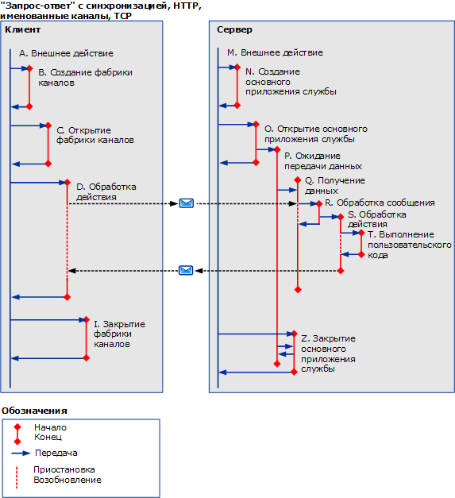

# Синхронные сценарии с использованием HTTP, TCP или именованного каналаSynchronous Scenarios using HTTP, TCP or Named-Pipe
В этом разделе описываются действия и перенаправления для различных сценариев синхронных запросов/ответов (с однопотоковым клиентом, с использованием HTTP, TCP или именованного канала).This topic describes the activities and transfers for different synchronous request/reply scenarios, with a single-threaded client, using HTTP, TCP or named pipe. В разделе [асинхронные сценарии с использованием HTTP, TCP или именованного канала](../../../../../docs/framework/wcf/diagnostics/tracing/asynchronous-scenarios-using-http-tcp-or-named-pipe.md) Дополнительные сведения о многопоточных запросов.See [Asynchronous Scenarios using HTTP, TCP, or Named-Pipe](../../../../../docs/framework/wcf/diagnostics/tracing/asynchronous-scenarios-using-http-tcp-or-named-pipe.md) for more information on multi-threaded requests.  
  
## Синхронный запрос/ответ без ошибокSynchronous Request/Reply without Errors  
 В этом разделе описываются действия и перенаправления для реального сценария синхронных запросов/ответов (с однопотоковым клиентом).This section describes the activities and transfers for a valid synchronous request/reply scenario, with single-threaded client.  
  
### "Клиент";Client  
  
#### Установка связи с конечной точкой службыEstablishing Communication with Service Endpoint  
 Создается и открывается клиент.A client is constructed and opened. Для каждого из этих действий, внешнее действие (A) перенаправляется действию «Создать клиент» (B) и «Открыть клиент» (C) соответственно.For each of these steps, the ambient activity (A) is transferred to a "Construct Client" (B) and "Open Client" (C) activity respectively. Для каждого действия, которому оно перенаправляется, внешнее действие приостанавливается до момента обратного перенаправления (т. е. до выполнения кода ServiceModel).For each activity being transferred to, the ambient activity is suspended until there is a transfer back, that is, until ServiceModel code is executed.  
  
#### Создание запроса для конечной точки службыMaking a Request to Service Endpoint  
 Внешнее действие перенаправляется действию «ProcessAction» (D).The ambient activity is transferred to a "ProcessAction" (D) activity. В рамках этого действия отправляется сообщение запроса и принимается сообщение ответа.Within this activity, a request message is sent, and a response message is received. Действие прекращается, когда управление возвращается пользовательскому коду.The activity ends when control returns to user code. Поскольку этот запрос является синхронным, внешнее действие приостанавливается до возврата управления.Because this is a synchronous request, the ambient activity suspends until control returns.  
  
#### Закрытие связи с конечной точкой службыClosing Communication with Service Endpoint  
 Действие «закрыть» (I) клиента создается из внешнего действия.The client's close activity (I) is created from the ambient activity. Оно идентично действиям "создать" и "открыть".This is identical to new and open.  
  
### СерверServer  
  
#### Настройка узла службыSetting up a Service Host  
 Действия «создать» и «открыть» (N и O) узла ServiceHost создаются из внешнего действия (M).The ServiceHost’s new and open activities (N and O) are created from the ambient activity (M).  
  
 Действие прослушивания (P) создается при открывании узла ServiceHost для каждого прослушивателя.A listener activity (P) is created from opening a ServiceHost for each listener. Действие прослушивания ожидает получения и обработки данных.The listener activity waits to receive and process data.  
  
#### Получение данных по сетиReceiving Data on the Wire  
 При получении данных по сети, действие «ReceiveBytes» создается в том случае, если он еще не существует (Q) для обработки полученных данных.When data arrives on the wire, a "ReceiveBytes" activity is created if it does not already exist (Q) to process the received data. Это действие можно использовать повторно для нескольких сообщений в пределах одного соединения или очереди.This activity can be reused for multiple messages within a connection or queue.  
  
 Действие ReceiveBytes запускает действие ProcessMessage (R) при наличии достаточной информации для формирования сообщения действия SOAP.The ReceiveBytes activity launches a ProcessMessage activity (R) if it has enough data to form a SOAP action message.  
  
 При действии R обрабатываются заголовки сообщений и проверяется заголовок activityID.In activity R, the message headers are processed, and the activityID header is verified. Если этот заголовок имеется, идентификатору действия присваивается значение ProcessAction. В противном случае создается новый идентификатор.If this header is present, the activity ID is set to the ProcessAction activity; otherwise, a new ID is created.  
  
 При обработке вызова создается действие ProcessAction (S), и выполняется перенаправление на это действие.ProcessAction activity (S) is created and being transferred to, when the call is processed. Данное действие завершается при полном завершении обработки, связанной с входящим сообщением, включая выполнение пользовательского кода (T) и отправку ответного сообщения (если она предусмотрена).This activity ends when all processing related to the incoming message is completed, including executing user code (T) and sending the response message if applicable.  
  
#### Закрытие узла службыClosing a Service Host  
 Действие "закрыть" (Z) узла ServiceHost создается из внешнего действия.The ServiceHost’s close activity (Z) is created from the ambient activity.  
  
   
  
 В \<A: name >, `A` содержится ссылочный символ, описывающий действие в приведенном выше тексте и в таблице 3.In \<A: name>, `A` is a shortcut symbol that describes the activity in the previous text and in table 3. `Name` представляет собой сокращенное имя действия.`Name` is a shortened name of the activity.  
  
 Если `propagateActivity` = `true`, Process Action на клиент и служба имеют одинаковый идентификатор действия.If `propagateActivity`=`true`, Process Action on both the client and service have the same activity ID.  
  
## Синхронный запрос/ответ с ошибкамиSynchronous Request/Reply with Errors  
 Единственное отличие от предыдущего сценария заключается в том, что в качестве ответного сообщения возвращается сообщение об ошибке SOAP.The only difference with the previous scenario is that a SOAP fault message is returned as a response message. Если `propagateActivity` = `true`, идентификатор действия сообщения запроса добавляется к сообщению об ошибке SOAP.If `propagateActivity`=`true`, the activity ID of the request message is added to the SOAP fault message.  
  
## Синхронная односторонняя связь без ошибокSynchronous One-Way without Errors  
 Единственное отличие от первого сценария заключается в том, что на сервер не возвращается сообщение.The only difference with the first scenario is that no message is returned to the server. Для протоколов, основанных на HTTP, на клиент все же возвращается состояние (допустимое или ошибка).For HTTP-based protocols, a status (valid or error) is still returned to the client. Это, так как единственный протокол с семантикой запроса ответа, который является частью стека протокола WCF HTTP.This is because HTTP is the only protocol with a request-response semantics that is part of the WCF protocol stack. Поскольку обработка TCP скрыта от WCF, не отправляется подтверждение клиенту.Because TCP processing is hidden from WCF, no acknowledgement is sent to the client.  
  
## Синхронная односторонняя связь с ошибкамиSynchronous One-Way with Errors  
 Если произошла ошибка при обработке сообщения (Q или далее), клиенту не возвращается уведомление.If an error occurs while processing the message (Q or beyond), no notification is returned to the client. Эта логика идентична сценарию «Синхронная односторонняя связь без ошибок».This is identical to the "Synchronous One-Way without Errors" scenario. Если требуется получить сообщение об ошибке, использовать сценарий с односторонней связью не рекомендуется.You should not use a One-Way scenario if you want to receive an error message.  
  
## ДуплексDuplex  
 Отличие от предыдущих сценариев заключается в том, что клиент выполняет роль службы, создавая действия ReceiveBytes и ProcessMessage, подобно сценариям для асинхронной связи.The difference with the previous scenarios is that the client acts as a service, in which it creates the ReceiveBytes and ProcessMessage activities, similar to the Asynchronous scenarios.
