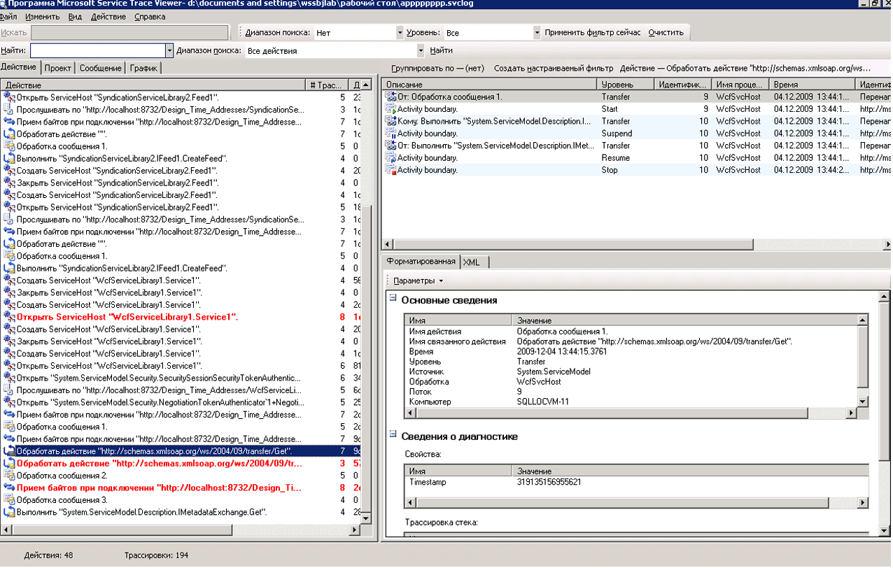
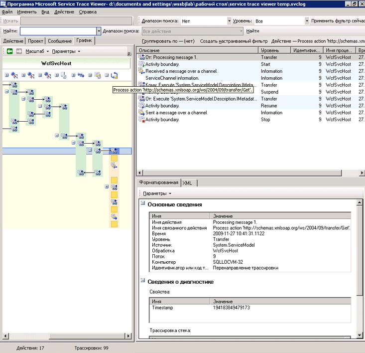
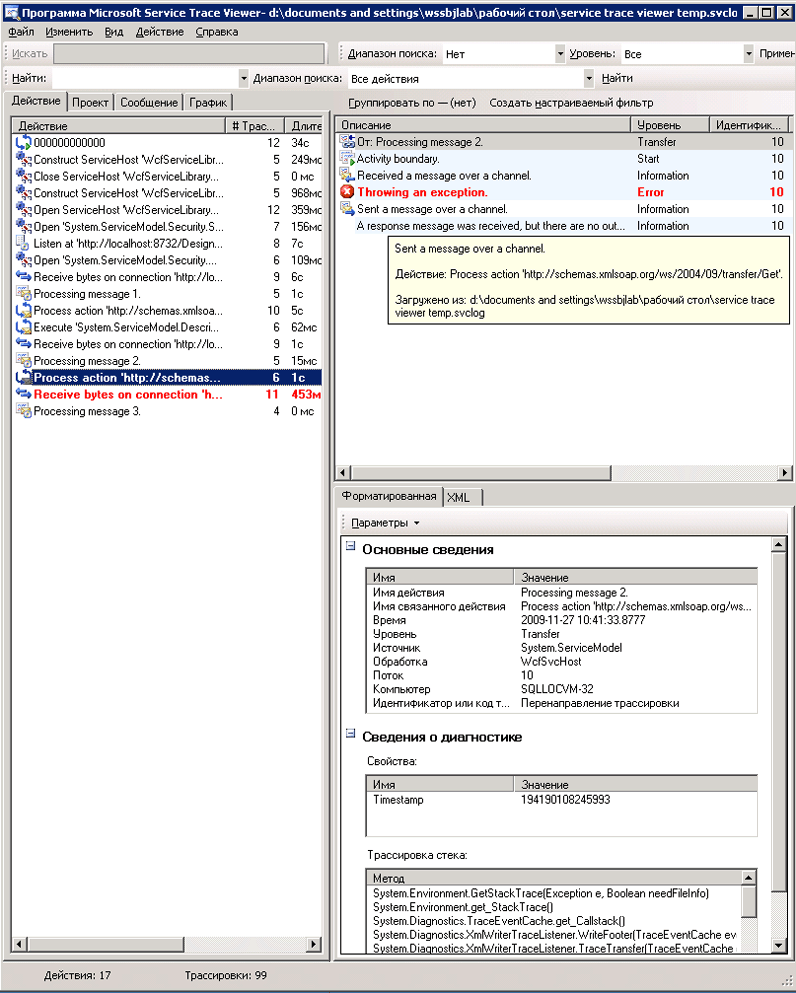
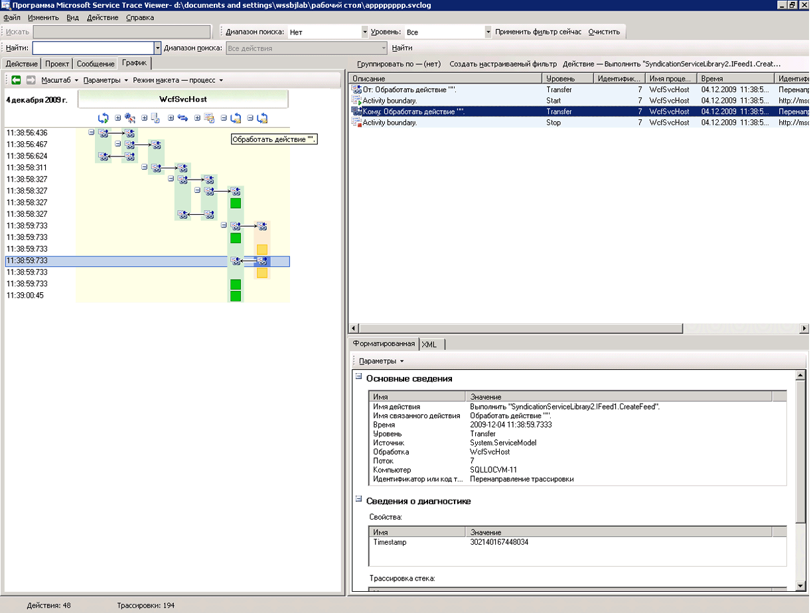
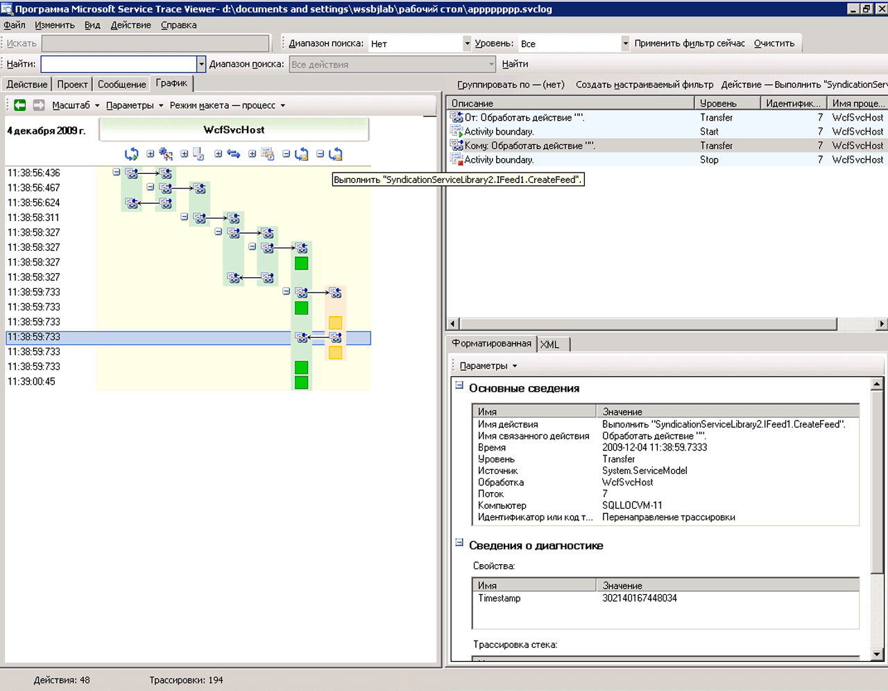
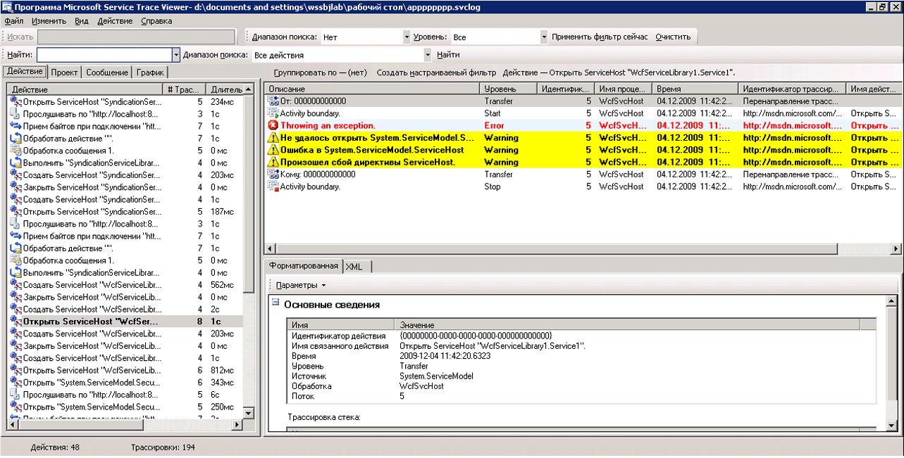
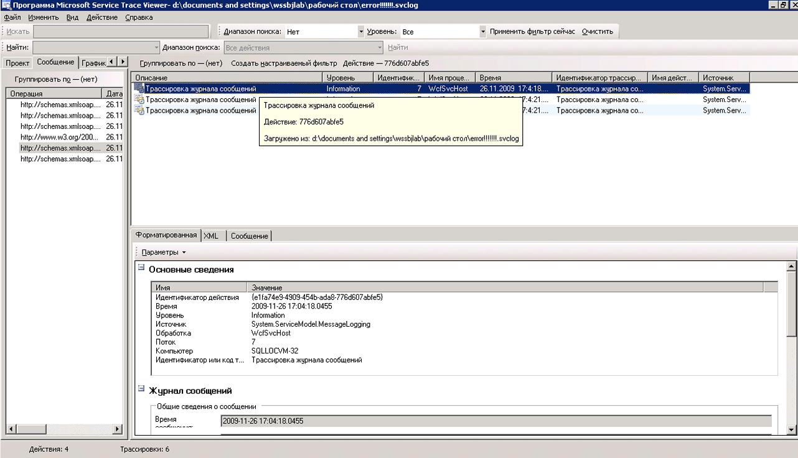

# <a name="using-service-trace-viewer-for-viewing-correlated-traces-and-troubleshooting"></a>Использование программы Service Trace Viewer для просмотра скоррелированных трассировок и устранения неполадок
В этом разделе описываются формат данных трассировки, способ просмотра этих данных, а также подходы, в которых используется программа Service Trace Viewer для устранения неполадок приложения.  
  
## <a name="using-the-service-trace-viewer-tool"></a>Использование программы Service Trace Viewer  
 Средство просмотра трассировки службы Windows Communication Foundation (WCF) помогает сопоставлять диагностические трассировки, создаваемые [!INCLUDE[indigo2](../../../../../includes/indigo2-md.md)] прослушиватели для выявления основной причины ошибки. Эта программа позволяет легко просматривать, группировать и фильтровать трассировки в целях диагностики, устранения и проверки неисправностей, связанных со службами [!INCLUDE[indigo2](../../../../../includes/indigo2-md.md)]. Дополнительные сведения об использовании этого инструмента см. в разделе [программы Service Trace Viewer (SvcTraceViewer.exe)](../../../../../docs/framework/wcf/service-trace-viewer-tool-svctraceviewer-exe.md).  
  
 В этом разделе содержатся снимки экранов трассировок, созданные при выполнении [трассировка и ведение журнала сообщений](../../../../../docs/framework/wcf/samples/tracing-and-message-logging.md) выборки, при просмотре с помощью [программы Service Trace Viewer (SvcTraceViewer.exe)](../../../../../docs/framework/wcf/service-trace-viewer-tool-svctraceviewer-exe.md). Показывается, как интерпретировать содержимое трассировки, действия и взаимосвязь между ними, а также как анализировать большое количество трассировок при устранении неполадок.  
  
## <a name="viewing-trace-content"></a>Просмотр содержимого трассировки  
 Событие трассировки содержит следующие наиболее важные сведения:  
  
-   имя действия, если задано;  
  
-   время создания;  
  
-   уровень трассировки;  
  
-   имя источника трассировки;  
  
-   имя процесса;  
  
-   идентификатор потока;  
  
-   Уникальный идентификатор трассировки, который является URL-адрес, указывающий целевой объект в документы Microsoft, из которого можно получить дополнительные сведения, связанные с трассировкой.  
  
 Все это можно увидеть в верхней правой панели в программе Service Trace Viewer или в **основные сведения** раздела форматированного представления нижней правой панели при выборе трассировки.  
  
> [!NOTE]
>  Если клиент и служба установлены на одном и том же компьютере, то будут присутствовать трассировки для обоих приложений. Их можно отфильтровать с помощью **имя процесса** столбца.  
  
 Кроме того, в форматированном представлении отображаются также описание трассировки и дополнительные подробные сведения, если они доступны. Дополнительные подробные сведения могут включать тип и сообщение исключения, стеки вызовов, действие сообщения, поля "от/к" и другую информацию об исключении.  
  
 В представлении XML имеются следующие важные теги xml:  
  
-   \<Подтип > (уровень трассировки).  
  
-   \<TimeCreated >.  
  
-   \<Источник > (имя источника трассировки).  
  
-   \<Корреляция > (идентификатор действия, заданный при создании трассировки).  
  
-   \<Выполнение > (идентификатор процесса и потока).  
  
-   \<Компьютер >.  
  
-   \<ExtendedData >, в том числе \<действия >, \<MessageID > и \<ActivityId > сформулированных в заголовке сообщения при отправке сообщения.  
  
 При анализе трассировки "Передано сообщение по каналу" отображаются следующие сведения.  
  
```xml  
<E2ETraceEvent xmlns="http://schemas.microsoft.com/2004/06/E2ETraceEvent">  
   <System xmlns="http://schemas.microsoft.com/2004/06/windows/eventlog/system">  
      <EventID>262163</EventID>  
      <Type>3</Type>  
      <SubType Name="Information">0</SubType>  
      <Level>8</Level>  
      <TimeCreated SystemTime="2006-08-04T18:45:30.8491051Z" />  
      <Source Name="System.ServiceModel" />  
       <Correlation ActivityID="{27c6331d-8998-43aa-a382-03239013a6bd}"/>  
       <Execution ProcessName="client" ProcessID="1808" ThreadID="1" />  
       <Channel />  
       <Computer>TEST1</Computer>  
   </System>  
   <ApplicationData>  
       <TraceData>  
          <DataItem>  
             <TraceRecord xmlns="http://schemas.microsoft.com/2004/10/E2ETraceEvent/TraceRecord" Severity="Information">  
                 <TraceIdentifier>http://msdn.microsoft.com/library/System.ServiceModel.Channels.MessageSent.aspx</TraceIdentifier>  
                 <Description>Sent a message over a channel.</Description>  
                 <AppDomain>client.exe</AppDomain>  
                 <Source>System.ServiceModel.Channels.ClientFramingDuplexSessionChannel/35191196</Source>  
                <ExtendedData xmlns="http://schemas.microsoft.com/2006/08/ServiceModel/MessageTransmitTraceRecord">  
  
                  <MessageProperties>  
                     <AllowOutputBatching>False</AllowOutputBatching>  
                  </MessageProperties>  
                  <MessageHeaders>  
                     <Action d4p1:mustUnderstand="1" xmlns:d4p1="http://www.w3.org/2003/05/soap-envelope" xmlns="http://www.w3.org/2005/08/addressing">http://Microsoft.ServiceModel.Samples/ICalculator/Multiply</Action>  
                     <MessageID xmlns="http://www.w3.org/2005/08/addressing">urn:uuid:7c6670d8-4c9c-496e-b6a0-2ceb6db35338</MessageID>  
                     <ActivityId CorrelationId="b02e2189-0816-4387-980c-dd8e306440f5" xmlns="http://schemas.microsoft.com/2004/09/ServiceModel/Diagnostics">27c6331d-8998-43aa-a382-03239013a6bd</ActivityId>  
                     <ReplyTo xmlns="http://www.w3.org/2005/08/addressing">  
                        <Address>http://www.w3.org/2005/08/addressing/anonymous</Address>  
                    </ReplyTo>  
                    <To d4p1:mustUnderstand="1" xmlns:d4p1="http://www.w3.org/2003/05/soap-envelope" xmlns="http://www.w3.org/2005/08/addressing">net.tcp://localhost/servicemodelsamples/service</To>  
                  </MessageHeaders>  
                  <RemoteAddress>net.tcp://localhost/servicemodelsamples/service</RemoteAddress>  
                </ExtendedData>  
            </TraceRecord>  
          </DataItem>  
       </TraceData>  
   </ApplicationData>  
</E2ETraceEvent>  
```  
  
## <a name="servicemodel-e2e-tracing"></a>Трассировка ServiceModel E2E  
 Когда для источника трассировки `System.ServiceModel` задано значение `switchValue`, отличное от Off и `ActivityTracing`, [!INCLUDE[indigo2](../../../../../includes/indigo2-md.md)] создает действия и перенаправления для обработки [!INCLUDE[indigo2](../../../../../includes/indigo2-md.md)].  
  
 Действие - это логический блок обработки, объединяющий все связанные с ним трассировки. Например, для каждого запроса можно определить одно действие. Перенаправления создают причинно-следственную связь между действиями внутри конечных точек. Распространение идентификатора действия позволяет соотносить действия в разных конечных точках. Это можно сделать, задав `propagateActivity` = `true` в конфигурации во всех конечных точках. Действия, перенаправления и распространение позволяют выполнить корреляцию ошибок. Это ускоряет выявление основной причины ошибки.  
  
 На клиенте для каждого вызова объектной модели создается одно действие [!INCLUDE[indigo2](../../../../../includes/indigo2-md.md)] (например, Open ChannelFactory, Add, Divide и т. д.). Каждый вызов операции обрабатывается в действии «Обработать действие».  
  
 На следующем снимке экрана, извлеченных из [трассировка и ведение журнала сообщений](../../../../../docs/framework/wcf/samples/tracing-and-message-logging.md) примера левой панели отображается список действий, созданных в клиентском процессе, отсортированных по дате создания. Ниже приведен хронологический список действий.  
  
-   Создана фабрика каналов (ClientBase).  
  
-   Открыта фабрика каналов.  
  
-   Обработано действие Add.  
  
-   Установлен безопасный сеанс (это ПРОИЗОШЛО по первому запросу) и обработаны три ответных сообщения инфраструктуры безопасности: RST, RSTR, SCT (Process message 1, 2, 3).  
  
-   Обработаны запросы "Вычесть", "Умножить" и "Разделить".  
  
-   Закрыта фабрика каналов, в результате чего закрыт безопасный сеанс и обработана отмена ответа на сообщение безопасности.  
  
 Сообщения инфраструктуры безопасности видны из-за привязки wsHttpBinding.  
  
> [!NOTE]
>  В [!INCLUDE[indigo2](../../../../../includes/indigo2-md.md)] показываются ответные сообщения, первоначально обрабатываемые в отдельном действии (Process message) до их корреляции посредством перенаправления с соответствующим действием Process Action, которое включает сообщение запроса. Это происходит для сообщений инфраструктуры и асинхронных запросов из-за необходимости проверки сообщения, чтения заголовка с идентификатором activityId и идентификации существующего действия Process Action с помощью этого идентификатора для корреляции с ним. Для синхронных запросов ответ блокируется и поэтому известно, к какому действию Process Action относится ответ.  
  
   
Действия клиента WCF, перечисленные по времени создания (левая панель), и связанные с ними вложенные действия и трассировки (верхняя правая панель)  
  
 Когда на левой панели выбирается действие, на верхней правой панели отображаются вложенные действия и трассировки, т. е. это уменьшенное иерархическое представление списка действий слева на основе выбранного родительского действия. Поскольку первым сделанным запросом является выбранное действие Process action Add, это действие содержит действие Set Up Secure Session (перенаправление в, перенаправление назад от) и трассировки фактической обработки действия Add.  
  
 Если в левой панели дважды щелкнуть действие Process action Add отобразится графическое представление клиентских действий [!INCLUDE[indigo2](../../../../../includes/indigo2-md.md)], связанных с действием Add. Первое действие слева - корневое действие (0000), являющееся действием по умолчанию. [!INCLUDE[indigo2](../../../../../includes/indigo2-md.md)] выполняет перенаправление из внешнего действия. Если оно не определено, [!INCLUDE[indigo2](../../../../../includes/indigo2-md.md)] выполняет перенаправление из 0000. В данном случае второе действие, Process Action Add, выполняет перенаправление из действия 0. Затем следует действие Setup Secure Session.  
  
   
Графическое представление действий клиента WCF: Ambient Activity (здесь 0), Process action и Set Up Secure Session  
  
 На верхней правой панели отображаются все трассировки, связанные с действием Process Action Add. В частности, передано сообщение запроса ("Передано сообщение по каналу") и в том же действии принят ответ ("Получено сообщение по каналу"). Это показано на следующей диаграмме. Для ясности действие Set up Secure Session на диаграмме свернуто.  
  
   
Список трассировок для действия Process Action: передача запроса и получение ответа в одном действии.  
  
 Здесь мы можем загрузить трассировки клиента только для ясности, но трассировки службы (полученного сообщения запроса и переданное ответное сообщение) отображаются в том же действии, если они также могут быть загружены в программе и `propagateActivity` было задано значение `true.` это показано далее рисунке.  
  
 Для службы модель действий сопоставляется с концепциями [!INCLUDE[indigo2](../../../../../includes/indigo2-md.md)] следующим образом.  
  
1.  Создается и открывается ServiceHost (при этом может создаваться несколько действий, связанных с основным приложением, например, в случае использования средств обеспечения безопасности).  
  
2.  Создается действие Listen At для каждого прослушивателя в ServiceHost (с перенаправлениями в действие Open ServiceHost и из этого действия).  
  
3.  Когда прослушиватель обнаруживает запрос взаимодействия, инициированный клиентом, он передает действие «Receive Bytes», в котором обрабатываются все байты, отправленные клиентом. В этом действии можно увидеть любые ошибки соединения, которые произошли во время взаимодействия между клиентом и службой.  
  
4.  Для каждого набора байтов, получаемые, соответствующее сообщение, мы можем обработать эти байты в действии сообщение «процесс», где создается [!INCLUDE[indigo2](../../../../../includes/indigo2-md.md)] объект сообщения. В этом действии отображаются ошибки, связанные с неправильным конвертом или неверно сформированным сообщением.  
  
5.  Когда сообщение сформировано, выполняется перенаправление в действие Process Action. Если для `propagateActivity` задано значение `true` и на клиенте, и в службе, это действие имеет тот же идентификатор, что определен в клиенте и описан ранее. Начиная с этого момента, извлекается выгода благодаря непосредственной корреляции через конечные точки, поскольку все созданные в [!INCLUDE[indigo2](../../../../../includes/indigo2-md.md)] трассировки, которые связаны с запросом, находятся в одном и том же действии, включая обработку ответного сообщения.  
  
6.  Для действия out of process создается действие «Execute user code», чтобы изолировать трассировки, созданные в пользовательском коде, от трассировок, созданных в [!INCLUDE[indigo2](../../../../../includes/indigo2-md.md)]. В предыдущем примере трассировка «Служба передает ответ Add» создается в действии «Execute User code» не в действии, распространяемом клиентом, если это применимо.  
  
 На приведенной ниже иллюстрации первое действие слева - корневое действие (0000), являющееся действием по умолчанию. Следующие три действия предназначены для того, чтобы открыть ServiceHost. Действие в столбце 5 - прослушиватель, а остальные действия (6 – 8) описывают обработку сообщения системой WCF - от обработки байтов до активации пользовательского кода.  
  
   
Список действий службы WCF  
  
 На следующем снимке экрана показаны действия для клиента и службы и выделено действие Process Action Add во всех процессах (оранжевым цветом). Стрелки связывают сообщения запроса и ответа, отправленные и полученные клиентом и службой. Трассировки действия Process Action разделены в процессах на диаграмме, но в верхней правой панели показаны как часть одного действия. В этой панели отображаются трассировки клиента для отправленных сообщений, после которых следуют трассировки службы для полученных и обработанных сообщений.  
  
   
Графическое представление действий клиента и службы WCF  
  
 В следующем сценарии с ошибками соотносятся трассировки ошибок и предупреждений в службе и на клиенте. Сначала вызывается исключение в пользовательском коде службы (крайнее правое зеленое действие, которое включает трассировку предупреждений для исключения "Служба не может обработать этот запрос в пользовательском коде"). Когда клиенту отправляется ответ, снова создается трассировка предупреждений, чтобы указать на наличие сообщения о сбое (розовое действие слева). Затем клиент закрывает свой клиент WCF (желтое действие внизу слева), в результате чего соединение со службой прерывается. Служба вызывает ошибку (самое длинное розовое действие справа).  
  
   
Корреляция ошибок в службе и на клиенте  
  
 Образец, использованный для создания этих трассировок, представляет собой последовательность синхронных запросов, использующих привязку wsHttpBinding. Для сценариев без обеспечения безопасности или с асинхронными запросами, где действие Process Action выполняет операции начала и окончания, составляющие асинхронный вызов, и показывает перенаправления в действие обратного вызова, диаграмма будет несколько иной. Дополнительные сведения о дополнительных сценариях см. в разделе [сценарии трассировки конца в конец](../../../../../docs/framework/wcf/diagnostics/tracing/end-to-end-tracing-scenarios.md).  
  
## <a name="troubleshooting-using-the-service-trace-viewer"></a>Выявление неполадок с помощью программы Service Trace Viewer  
 При загрузке файлов трассировки в программу Service Trace Viewer можно выбрать любое красное или желтое действие на левой панели, чтобы выявить причину неполадки в приложении. Действие 000 обычно имеет необработанные исключения, которые достигают пользователя.  
  
   
Выбор красного или желтого действия для выявления основной причины неполадки  
  
 На верхней правой панели можно проанализировать трассировки, связанные с действием, выбранным на левой панели. Затем можно просмотреть красные или желтые трассировки в этой панели и увидеть, как они коррелируются. На приведенной выше диаграмме видны трассировки предупреждений для клиента и службы в одном действии Process Action.  
  
 Если эти трассировки не позволяют выяснить основную причину ошибки, можно использовать диаграмму, дважды щелкнув выбранное действие на левой панели (здесь Process Action). При этом отображается диаграмма со связанными действиями. Затем можно развернуть связанные действия (щелкнув символы «+»), чтобы найти первую созданную трассировку красным или желтым цветом в связанном действии. Сохраняйте развернутыми действия, которые произошли непосредственно перед представляющей интерес красной или желтой трассировкой, следя за перенаправлениями в связанные действия или потоками сообщений через конечные точки, пока не выясните первопричину неполадки.  
  
   
Развертывание действий для выяснения первопричины неполадки  
  
 Если трассировка `ActivityTracing` ServiceModel отключена, а трассировка ServiceModel включена, можно увидеть трассировки ServiceModel, созданные в действии 0000. Однако в этом случае требуется больше усилий, чтобы понять корреляцию этих трассировок.  
  
 Если включено ведение журнала сообщений, можно использовать вкладку сообщений, чтобы увидеть, на какое сообщение повлияла ошибка. При двойном щелчке красного или желтого сообщения появляется графическое представление связанных действий. Эти действия наиболее тесно связаны с запросом, где произошла ошибка.  
  
   
Чтобы начать поиск неполадок, можно также выбрать красную или желтую трассировку сообщений и дважды щелкнуть ее для отслеживания первопричины  
  
## <a name="see-also"></a>См. также  
 [Сценарии сквозной трассировки](../../../../../docs/framework/wcf/diagnostics/tracing/end-to-end-tracing-scenarios.md)  
 [Средство просмотра трассировки служб (SvcTraceViewer.exe)](../../../../../docs/framework/wcf/service-trace-viewer-tool-svctraceviewer-exe.md)  
 [Трассировка](../../../../../docs/framework/wcf/diagnostics/tracing/index.md)
