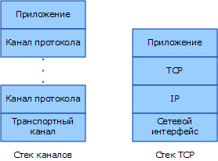
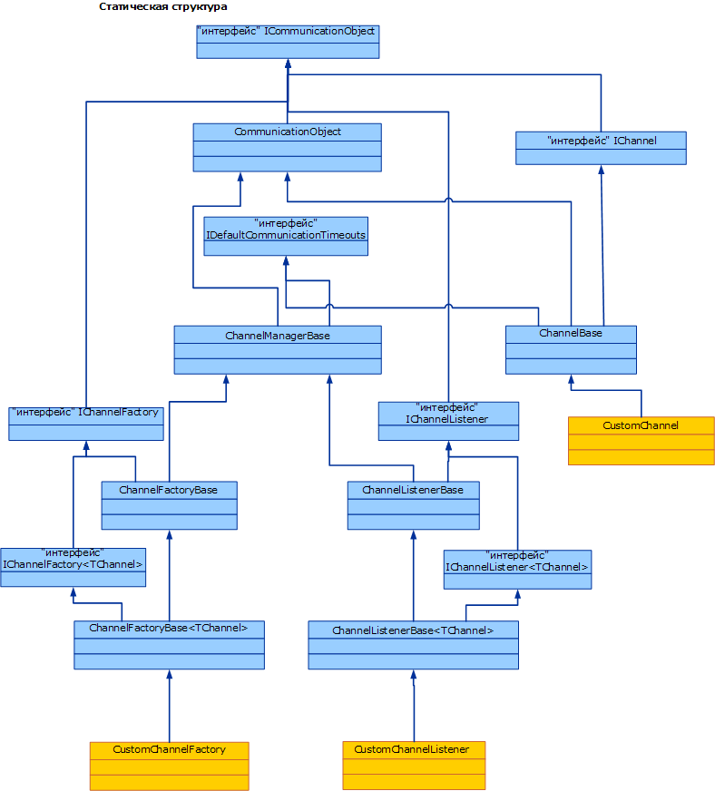

# Общие сведения о модели каналовChannel Model Overview
Стек каналов [!INCLUDE[indigo1](../../../../includes/indigo1-md.md)] - это многоуровневый стек связи с одним или несколькими каналами, которые обрабатывают сообщения.The [!INCLUDE[indigo1](../../../../includes/indigo1-md.md)] channel stack is a layered communication stack with one or more channels that process messages. В нижней части стека находится канал транспорта, отвечающий за адаптацию стека каналов к используемому транспорту (например, TCP, HTTP, SMTP и другим типам транспорта).At the bottom of the stack is a transport channel that is responsible for adapting the channel stack to the underlying transport (for example, TCP, HTTP, SMTP and other types of transport.). Каналы обеспечивают модель низкоуровневого программирования для передачи и приема сообщений.Channels provide a low-level programming model for sending and receiving messages. Эта модель программирования основывается на нескольких интерфейсах и ресурсах других типов, в совокупности называемых моделью каналов [!INCLUDE[indigo2](../../../../includes/indigo2-md.md)].This programming model relies on several interfaces and other types collectively known as the [!INCLUDE[indigo2](../../../../includes/indigo2-md.md)] channel model. В данном разделе рассматриваются формы каналов, создание базового прослушивателя каналов (в службе) и фабрики каналов (на клиенте).This topic discusses channel shapes, the construction of a basic channel listener (on the service) and channel factory (on the client).  
  
## Стек каналовChannel Stack  
 Конечные точки [!INCLUDE[indigo2](../../../../includes/indigo2-md.md)] взаимодействуют с внешним миром, используя стек связи, называемый стеком каналов.[!INCLUDE[indigo2](../../../../includes/indigo2-md.md)] endpoints communicate with the world using a communication stack called the channel stack. На следующем рисунке стек каналов сравнивается с другими стеками связи, например TCP/IP.The following diagram compares the channel stack with other communication stacks, for example TCP/IP.  
  
   
  
 Сначала отметим сходства. В обоих случаях каждый уровень стека обеспечивает некоторое абстрактное представление среды, находящейся под ним, и предоставляет это абстрактное представление только уровню, расположенному непосредственно над ним.First, the similarities: In both cases, each layer of the stack provides some abstraction of the world below that layer and exposed that abstraction only to the layer directly above it. Каждый уровень использует абстрактное представление только уровня, расположенного непосредственно под ним.Each layer uses the abstraction of only the layer directly below it. Кроме того, в обоих случаях при взаимодействии двух стеков каждый уровень взаимодействует с соответствующим уровнем другого стека, например уровень IP взаимодействует с уровнем IP, уровень TCP - с уровнем TCP и т. д.Also in both cases, when two stacks communicate, each layer communicates with the corresponding layer in the other stack, for example, the IP layer communicates with the IP layer and the TCP layer with the TCP layer, and so on.  
  
 Теперь отметим различия. Стек TCP был разработан для обеспечения абстрактного представления физической сети, а стек каналов - для обеспечения абстрактного представления не только способа доставки сообщения, т. е. транспорта, но и других особенностей, например содержимого сообщения, протокола, используемого для взаимодействия, включая транспорт, но не только его.Now, the differences: While the TCP stack was designed to provide an abstraction of the physical network, the channel stack is designed to provide an abstraction of not only how the message is delivered, that is, the transport, but also other features such as what is in the message or what protocol is used for communication, including the transport but much more than that. Например, элемент привязки надежного сеанса является частью стека каналов, но не находится ниже транспорта и не представляет сам транспорт.For example, reliable session binding element is part of the channel stack but is not below the transport or the transport itself. Эта абстракция достигается посредством предъявления нижнему каналу в стеке требования адаптировать базовый транспортный протокол к архитектуре стека каналов и последующего расчета на то, что вышестоящие каналы в стеке должны обеспечивать такие функции связи, как предоставление гарантий надежности и безопасности.This abstraction is achieved by requiring the bottom channel in the stack to adapt the underlying transport protocol to the channel stack architecture and then relying on channels further up in the stack to provide communication features such as reliability guarantees and security.  
  
 Сообщения проходят через стек связи в виде объектов <xref:System.ServiceModel.Channels.Message>.Messages flow through the communication stack as <xref:System.ServiceModel.Channels.Message> objects. Как показано на представленном выше рисунке, нижний канал называется каналом транспорта.As shown in figure above, the bottom channel is called a transport channel. Этот канал отвечает за передачу сообщений другим участникам и прием сообщений от них,It is the channel that is responsible for sending and receiving messages to and from other parties. в том числе несет ответственность за преобразование объекта <xref:System.ServiceModel.Channels.Message> в формат, используемый для связи с другими участниками, и за обратное преобразование.This includes the responsibility of transforming the <xref:System.ServiceModel.Channels.Message> object to and from the format used to communicate with other parties. Над каналом транспорта может находиться любое число протокольных каналов, каждый из которых отвечает за обеспечение такой функции связи, как предоставление гарантий надежной доставки.Above the transport channel there can be any number of protocol channels each responsible for providing a communication function such as reliable delivery guarantees. Протокольные каналы оперируют с сообщениями, проходящими через них в виде объекта <xref:System.ServiceModel.Channels.Message>.Protocol channels operate on messages flowing through them in the form of the <xref:System.ServiceModel.Channels.Message> object. Они обычно либо преобразуют сообщение, например добавляя заголовки или шифруя тело сообщения, либо передают и принимают свои собственные управляющие сообщения протокола, например подтверждения приема.They typically either transform the message, for example, by adding headers or encrypting the body, or send and receive their own protocol control messages, for example, receipt acknowledgments.  
  
## Формы каналовChannel Shapes  
 Каждый канал реализует один или несколько интерфейсов, называемых интерфейсами форм каналов, или формами каналов.Each channel implements one or more interfaces known as channel shape interfaces or channel shapes. Эти формы каналов обеспечивают такие ориентированные на взаимодействие методы, как передача и прием или запрос и ответ, которые реализуются каналом и вызываются пользователем канала.Those channel shapes provide the communication-oriented methods such as send and receive or request and reply that the channel implements and the user of the channel calls. Основой форм каналов является <xref:System.ServiceModel.Channels.IChannel> интерфейс, который является интерфейсом, который предоставляет `GetProperty` \<T >, предусмотренный в качестве многоуровневого механизма доступа к произвольным возможностям, предоставляемым каналами в стеке.At the base of the channel shapes is the <xref:System.ServiceModel.Channels.IChannel> interface, which is an interface that provides a `GetProperty`\<T> method intended as a layered mechanism to access arbitrary features exposed by channels in the stack. Ниже перечислены пять форм каналов, расширяющих интерфейс <xref:System.ServiceModel.Channels.IChannel>.The five channel shapes that extend <xref:System.ServiceModel.Channels.IChannel> are:  
  
-   <xref:System.ServiceModel.Channels.IInputChannel>  
  
-   <xref:System.ServiceModel.Channels.IOutputChannel>  
  
-   <xref:System.ServiceModel.Channels.IRequestChannel>  
  
-   <xref:System.ServiceModel.Channels.IReplyChannel>  
  
-   <xref:System.ServiceModel.Channels.IDuplexChannel>  
  
 Каждая из этих форм имеет эквивалент, который расширяет <xref:System.ServiceModel.Channels.ISessionChannel%601?displayProperty=nameWithType> для поддержки сеансов.Further, each of these shapes has an equivalent that extends <xref:System.ServiceModel.Channels.ISessionChannel%601?displayProperty=nameWithType> to support sessions. Эти особые значения приведены ниже.These are:  
  
-   <xref:System.ServiceModel.Channels.IInputSessionChannel>  
  
-   <xref:System.ServiceModel.Channels.IOutputSessionChannel>  
  
-   <xref:System.ServiceModel.Channels.IRequestSessionChannel>  
  
-   <xref:System.ServiceModel.Channels.IReplySessionChannel>  
  
-   <xref:System.ServiceModel.Channels.IDuplexSessionChannel>  
  
 Формы каналов создаются в соответствии с некоторыми базовыми шаблонами обмена сообщениями, поддерживаемыми существующими транспортными протоколами.The channel shapes are patterned after some of the fundamental message exchange patterns supported by existing transport protocols. Например, односторонний обмен сообщениями соответствует <xref:System.ServiceModel.Channels.IInputChannel> / <xref:System.ServiceModel.Channels.IOutputChannel> пар, запрос ответ соответствует <xref:System.ServiceModel.Channels.IRequestChannel> / <xref:System.ServiceModel.Channels.IReplyChannel> пары и двусторонняя дуплексная связь соответствует <xref:System.ServiceModel.Channels.IDuplexChannel> (которая расширяет формы <xref:System.ServiceModel.Channels.IInputChannel> и <xref:System.ServiceModel.Channels.IOutputChannel>).For example, one-way messaging corresponds to an <xref:System.ServiceModel.Channels.IInputChannel>/<xref:System.ServiceModel.Channels.IOutputChannel> pair, request-reply corresponds to <xref:System.ServiceModel.Channels.IRequestChannel>/<xref:System.ServiceModel.Channels.IReplyChannel> pairs and two-way duplex communications corresponds to <xref:System.ServiceModel.Channels.IDuplexChannel> (which extends both <xref:System.ServiceModel.Channels.IInputChannel> and <xref:System.ServiceModel.Channels.IOutputChannel>).  
  
## Программирование со стеком каналовProgramming with the Channel Stack  
 Стеки каналов обычно создаются с помощью шаблона фабрики, где привязка создает стек каналов.Channel stacks are typically created using a factory pattern where a binding creates the channel stack. На стороне передачи привязка используется для создания фабрики <xref:System.ServiceModel.ChannelFactory>, которая, в свою очередь, создает стек каналов и возвращает ссылку на верхний канал в стеке.On the send side, a binding is used to build a <xref:System.ServiceModel.ChannelFactory>, which in turn builds a channel stack and returns a reference to the top channel in the stack. Затем приложение может использовать этот канал для передачи сообщений.The application can then use this channel to send messages. Дополнительные сведения см. в разделе [программирования на уровне канала клиента](../../../../docs/framework/wcf/extending/client-channel-level-programming.md).For more information, see [Client Channel-Level Programming](../../../../docs/framework/wcf/extending/client-channel-level-programming.md).  
  
 На стороне приема привязка используется для создания прослушивателя <xref:System.ServiceModel.Channels.IChannelListener>, который прослушивает входящие сообщения.On the receive side a binding is used to build a <xref:System.ServiceModel.Channels.IChannelListener>, which listens for incoming messages. <xref:System.ServiceModel.Channels.IChannelListener> предоставляет сообщения прослушивающему приложению, создавая стеки каналов и обрабатывая ссылку приложения на верхний канал.The <xref:System.ServiceModel.Channels.IChannelListener> provides messages to the listening application by creating channel stacks and handing the application reference to the top channel. Затем приложение использует этот канал для приема входящих сообщений.The application then uses this channel to receive incoming messages. Дополнительные сведения см. в разделе [программирования на уровне канала службы](../../../../docs/framework/wcf/extending/service-channel-level-programming.md).For more information, see [Service Channel-Level Programming](../../../../docs/framework/wcf/extending/service-channel-level-programming.md).  
  
## Объектная модель каналовThe Channel Object Model  
 Объектная модель каналов - это базовый набор интерфейсов, необходимых для реализации каналов, прослушивателей каналов и фабрик каналов.The channel object model is the core set of interfaces required to implement channels, channel listeners and channel factories. Существуют также некоторые базовые классы, предусмотренные для содействия в обеспечении пользовательских реализаций.There are also some base classes provided to assist in custom implementations.  
  
 Прослушиватели каналов отвечают за прослушивание входящих сообщений и их доставку вышестоящему уровню по созданным ими каналам.Channel listeners are responsible for listening for incoming messages, then delivering them to the layer above through channels created by the channel listener.  
  
 Фабрики каналов отвечают за создание каналов, используемых для передачи сообщений, и за закрытие всех созданных ими каналов, когда эти фабрики закрываются.Channel factories are responsible for creating channels that are used for sending messages and for closing all channels they created when the channel factory is closed.  
  
 <xref:System.ServiceModel.ICommunicationObject> - это базовый интерфейс, определяющий основной конечный автомат, который реализуют все объекты, обменивающиеся сообщениями.<xref:System.ServiceModel.ICommunicationObject> is the core interface that defines the basic state machine that all communication objects implement. <xref:System.ServiceModel.Channels.CommunicationObject> предоставляет реализацию этого базового интерфейса, от которого можно наследовать другие классы каналов, что позволяет избежать повторной реализации интерфейса.<xref:System.ServiceModel.Channels.CommunicationObject> provides an implementation of this core interface that other channel classes can derive from rather than re-implementing the interface. Однако это необязательно: пользовательский канал может реализовать интерфейс <xref:System.ServiceModel.ICommunicationObject> непосредственно, а не наследовать его от <xref:System.ServiceModel.Channels.CommunicationObject>.However, this is not required: a custom channel can implement <xref:System.ServiceModel.ICommunicationObject> directly and not inherit from <xref:System.ServiceModel.Channels.CommunicationObject>. Ни один из классов, показанных на рис. 3, не считается частью модели каналов; это вспомогательные классы, доступные тем, кто занимается реализацией пользовательских каналов и нуждается в средствах создания каналов.None of the classes in Figure 3 are considered part of the channel model; they are helpers available to custom channel implementers who want to build channels.  
  
   
  
 В следующих разделах описываются объектная модель каналов, а также различные области разработки, помогающие создавать пользовательские каналы.The following topics describe the channel object model as well as various development areas that help build custom channels.  
  
|РазделTopic|ОписаниеDescription|  
|-----------|-----------------|  
|[Служба: Прослушиватели каналов и каналыService: Channel Listeners and Channels](../../../../docs/framework/wcf/extending/service-channel-listeners-and-channels.md)|Описываются прослушиватели каналов, ожидающие передачи данных по входящим каналам в приложении службы.Describes channel listeners, which listen for incoming channels in a service application.|  
|[Клиент: Фабрики каналов и каналыClient: Channel Factories and Channels](../../../../docs/framework/wcf/extending/client-channel-factories-and-channels.md)|Описываются фабрики каналов, которые создают каналы для подключения к приложению службы.Describes channel factories, which create channels to connect to a service application.|  
|[Общие сведения о состоянии измененияUnderstanding State Changes](../../../../docs/framework/wcf/extending/understanding-state-changes.md)|Описывается, как модели интерфейса <xref:System.ServiceModel.ICommunicationObject?displayProperty=nameWithType> изменяют состояния в каналах.Describes how the <xref:System.ServiceModel.ICommunicationObject?displayProperty=nameWithType> interface models state changes in channels.|  
|[Выбор шаблона обмена сообщениямиChoosing a Message Exchange Pattern](../../../../docs/framework/wcf/extending/choosing-a-message-exchange-pattern.md)|Описываются шесть базовых шаблонов обмена сообщениями, которые могут поддерживаться каналами.Describes the six basic message exchange patterns that channels can support.|  
|[Обработка исключений и сбоевHandling Exceptions and Faults](../../../../docs/framework/wcf/extending/handling-exceptions-and-faults.md)|Описываются способы обработки сбоев и исключений в пользовательских каналах.Describes how to handle faults and exceptions in custom channels.|  
|[Конфигурация и поддержка метаданныхConfiguration and Metadata Support](../../../../docs/framework/wcf/extending/configuration-and-metadata-support.md)|Описываются поддержка использования пользовательских каналов из модели приложения, а также экспорт и импорт метаданных с использованием привязок и элементов привязок.Describes how to support the use of custom channels from the application model and how to export and import metadata using bindings and binding elements.|
