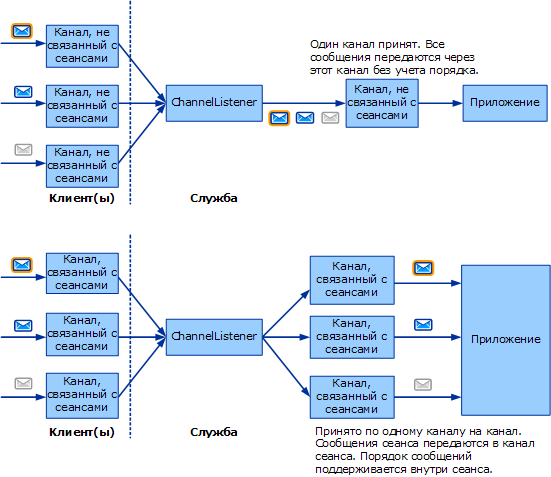

# Выбор шаблона обмена сообщениями
Первым шагом в создании пользовательского транспорта является необходимо решить, какие *шаблоны обмена сообщениями* (или шаблонов обмена сообщениями) требуются для канала, вы разрабатываете. В этом разделе описаны возможные варианты и различные требования. Это первая задача в списке задач разработки канала, описанной в [разработка каналов](../../../../docs/framework/wcf/extending/developing-channels.md).  
  
## Шесть шаблонов обмена сообщениями  
 Можно выбирать из трех шаблонов обмена сообщениями.  
  
-   Датаграмма (<xref:System.ServiceModel.Channels.IInputChannel> и <xref:System.ServiceModel.Channels.IOutputChannel>)  
  
     При использовании датаграмм шаблон обмена Сообщениями, клиент отправляет сообщение с помощью *отправить и забыть* exchange. В этом случае требуется внешнее подтверждение успешной доставки. Сообщение может быть потеряно при передаче и может не достичь службы. Если операция отправки успешно выполняется на стороне клиента, это не гарантирует, что удаленная конечная точка получит сообщение. Датаграмма - фундаментальный элемент обмена сообщениями, на основе которого можно строить собственные протоколы, в том числе надежные и безопасные. Каналы датаграмм клиентов реализуют интерфейс <xref:System.ServiceModel.Channels.IOutputChannel>, а каналы датаграмм служб - интерфейс <xref:System.ServiceModel.Channels.IInputChannel>.  
  
-   Запрос-ответ (<xref:System.ServiceModel.Channels.IRequestChannel> и <xref:System.ServiceModel.Channels.IReplyChannel>)  
  
     При использовании этого шаблона происходит отправка сообщения и получение ответа. Шаблон состоит из пар «запрос-ответ». Примерами вызовов "запрос-ответ" являются удаленные вызовы процедур (RPC) и запросы GET браузера. Этот шаблон также называют полудуплексным. При использовании этого шаблона обмена сообщениями каналы клиентов реализуют интерфейс <xref:System.ServiceModel.Channels.IRequestChannel>, а каналы служб - интерфейс <xref:System.ServiceModel.Channels.IReplyChannel>.  
  
-   Дуплексный (<xref:System.ServiceModel.Channels.IDuplexChannel>)  
  
     Дуплексный шаблон обмена сообщениями позволяет клиенту отправлять произвольное количество сообщений и принимать их в произвольном порядке. Применение дуплексного шаблона похоже на разговор по телефону, когда каждое произносимое слово является сообщением. Поскольку в данном случае принимать и отправлять сообщения могут обе стороны, каналы клиента и службы реализуют интерфейс <xref:System.ServiceModel.Channels.IDuplexChannel>.  
  
   
Три базовых шаблона обмена сообщениями. Сверху вниз: датаграмма, запрос-ответ и дуплексный.  
  
 Каждый из этих шаблонов обмена сообщениями также поддерживает *сеансы*. Сеанс (реализация интерфейса <xref:System.ServiceModel.Channels.ISessionChannel%601?displayProperty=nameWithType> типа <xref:System.ServiceModel.Channels.ISession?displayProperty=nameWithType>) согласует все сообщения, отправляемые и принимаемые через канал. Шаблон "запрос-ответ" является отдельным сеансом из двух сообщений, поскольку запрос и ответ связаны друг с другом. В отличие от него в поддерживающем сеансы дуплексном шаблоне предполагается, что все пары "запрос-ответ" в канале связаны друг с другом. Таким образом, можно выбирать из шести шаблонов обмена сообщениями:  
  
-   Datagram  
  
-   запрос-ответ;  
  
-   Дуплекс  
  
-   датаграмма с сеансами;  
  
-   запрос-ответ с сеансами;  
  
-   дуплексный с сеансами.  
  
> [!NOTE]
>  Для транспорта по протоколу UDP единственным поддерживаемым шаблоном обмена сообщения является использование датаграмм, поскольку протокол UDP предназначен только для отправки сообщений.  
  
## Сеансы и каналы, связанные с сеансами  
 Среди сетевых протоколов существуют протоколы, использующие подключения (например, TCP), и протоколы, не использующие подключения (например, UDP). WCF использует сеанс термин для обозначения абстрактного логического соединения. Протоколы WCF, связанные с сеансами, похожи на сетевые протоколы, использующие подключения, а протоколы WCF, не связанные с сеансами, похожи на сетевые протоколы, не использующие подключения.  
  
 В объектной модели канала каждый логический сеанс объявляется в качестве экземпляра канала, связанного с сеансом. Поэтому каждый новый сеанс, создаваемый клиентом и принимаемый службой, соответствует новому каналу, связанному с сеансом, на каждой из сторон. В верхней части следующей схемы показана структура каналов, связанных с сеансами, а в нижней - структура каналов, не связанных с сеансами.  
  
   
  
 Клиент создает новый канал, связанный с сеансом. На стороне службы прослушиватель канала получает сообщение и определяет, что оно принадлежит к новому сеансу, поэтому он создает новый канал, связанный с сеансом, и передает его приложению (в ответ на вызов AcceptChannel приложением в прослушивателе канала). Затем приложение получает это сообщение и все последующие сообщения, передаваемые в рамках того же сеанса через тот же канал, связанный с сеансом.  
  
 Другой клиент (или тот же клиент) создает новый канал, связанный с сеансом, и отправляет сообщение. Прослушиватель канала определяет это сообщение в новом сеансе и создает новый канал, связанный с сеансом, после чего процесс повторяется.  
  
 Без сеансов согласованности между каналами и сеансами нет. Поэтому прослушиватель канала создает только один канал, через который все получаемые сообщения передаются приложению. Сообщения не упорядочиваются, поскольку отсутствует сеанс, в котором можно было бы поддерживать порядок сообщений. В верхней части последнего рисунка показан обмен сообщениями без сеанса.  
  
## Запуск и завершение сеансов  
 Сеансы запускаются на клиенте путем простого создания канала, связанного с сеансами. Они запускаются в службе, когда служба получает сообщение, которое было отправлено в новом сеансе. Аналогично сеансы завершаются путем закрытия или прерывания канала, связанного с сеансом.  
  
 Единственным исключением является канал <xref:System.ServiceModel.Channels.IDuplexSessionChannel>, который используется для отправки и получения сообщений при дуплексном шаблоне с поддержкой сеансов. Одна сторона может прекратить отправку сообщений но продолжить их получение, поэтому при использовании канала <xref:System.ServiceModel.Channels.IDuplexSessionChannel> имеется механизм, позволяющий закрыть исходящий сеанс, чтобы показать, что новые сообщения отправляться не будут, но оставить открытым входящий сеанс, чтобы можно было и дальше получать сообщения.  
  
 В общем случае сеансы закрываются отправляющей, а не принимающей стороной. Это значит, что исходящий канал, связанный с сеансом, можно закрыть, в результате чего сеанс будет аккуратно прерван. Закрытие связанного с сеансом исходящего канала приводит к тому, что соответствующий связанный с сеансом входящий канал возвращает значение NULL приложению, которое вызывает метод <xref:System.ServiceModel.Channels.IInputChannel.Receive%2A?displayProperty=nameWithType> объекта <xref:System.ServiceModel.Channels.IDuplexSessionChannel>.  
  
 Но в большинстве случае входящие каналы не следует закрывать, пока метод <xref:System.ServiceModel.Channels.IInputChannel.Receive%2A?displayProperty=nameWithType> объекта <xref:System.ServiceModel.Channels.IDuplexSessionChannel> не вернет значение NULL, указывая на то, что сеанс уже закрыт. Если метод <xref:System.ServiceModel.Channels.IInputChannel.Receive%2A?displayProperty=nameWithType> объекта <xref:System.ServiceModel.Channels.IDuplexSessionChannel> не вернул значение NULL, закрытие связанного с сеансом входящего канала может привести к возникновению исключения, поскольку во время закрытия через канал может неожиданно прийти сообщение. Если принимающей стороне нужно завершить сеанс, прежде чем это сделает отправляющая сторона, необходимо вызвать метод <xref:System.ServiceModel.ICommunicationObject.Abort%2A> входящего канала, в результате чего сеанс будет сразу же прерван.  
  
## Разработка каналов, связанных с сеансами  
 Для реализации сеансов разработчики каналов должны помнить о нескольких моментах. На стороне отправки канал должен выполнять следующие действия.  
  
-   Для каждого нового канала необходимо создавать новый сеанс и связывать его с новым ИД сеанса, являющимся уникальной строкой. Либо необходимо получать новый сеанс из предыдущего связанного с сеансами канала в стеке.  
  
-   Для каждого сообщения, отправленного с помощью данного канала, если канал создал сеанс (а не получил его из стека), необходимо связать сообщение с сеансом. Для каналов протоколов эта задача обычно решается путем добавления заголовка SOAP. Для каналов транспорта эта задача обычно решается путем создания нового подключения транспорта или включения сведений о сеансе во внешний протокол.  
  
-   Для каждого сообщения, отправленного с помощью данного канала, необходимо реализовать описанные выше способы гарантии доставки. Если для получения сеанса используется следующий канал в стеке, этот канал также гарантирует доставку. Если создается новый сеанс, необходимо реализовать механизмы получения гарантии в протоколе. В общем случае при создании канала протокола, который предполагает использование на обеих сторонах платформы WCF, можно потребовать использования транспорта TCP или канала надежного обмена сообщениями и использовать любой из этих механизмов для создания сеанса.  
  
-   При вызове метода <xref:System.ServiceModel.ICommunicationObject.Close%2A?displayProperty=nameWithType> канала следует выполнить операции, необходимые для закрытия канала, используя заданное время ожидания или время ожидания по умолчанию. Для этого достаточно вызвать метод <xref:System.ServiceModel.ICommunicationObject.Close%2A> следующего канала в стеке (если сеанс был получен через него), отправить специальное сообщение SOAP или закрыть подключение транспорта.  
  
-   При вызове метода <xref:System.ServiceModel.ICommunicationObject.Abort%2A> для канала необходимо сразу же завершить сеанс без выполнения операций ввода-вывода. Это может означать, что ничего делать не требуется, или что нужно разорвать сетевое подключение или высвободить какие-либо другие ресурсы.  
  
 На принимающей стороне канал должен выполнять следующие действия.  
  
-   Для каждого входящего сообщения прослушиватель канала должен определить сеанс, к которому относится это сообщение. Если это первое сообщение в сеансе, прослушиватель канала должен создать новый канал и вернуть его в результате вызова метода <xref:System.ServiceModel.Channels.IChannelListener%601.AcceptChannel%2A?displayProperty=nameWithType>. В противном случае прослушиватель канала должен найти существующий канал, который относится к сеансу, и передать сообщение через этот канал.  
  
-   Если канал предоставляет сеанс (а также необходимые гарантии доставки), может потребоваться, чтобы получающая сторона выполнила определенные действия, например изменила порядок сообщений или отправила подтверждения.  
  
-   При вызове метода <xref:System.ServiceModel.ICommunicationObject.Close%2A> канала следует выполнить операции, необходимые для закрытия канала, используя заданное время ожидания или время ожидания по умолчанию. Это может привести к появлению исключений, если канал получает сообщение, пока он ожидает истечения времени закрытия канала. Такая ситуация будет обусловлена тем, что при получении сообщения канал будет находится в состоянии закрытия.  
  
-   При вызове метода <xref:System.ServiceModel.ICommunicationObject.Abort%2A> для канала необходимо сразу же завершить сеанс без выполнения операций ввода-вывода. С другой стороны, это может означать, что ничего делать не требуется, или что нужно разорвать сетевое подключение или высвободить какие-либо другие ресурсы.  
  
## См. также  
 [Общие сведения о модели каналов](../../../../docs/framework/wcf/extending/channel-model-overview.md)
