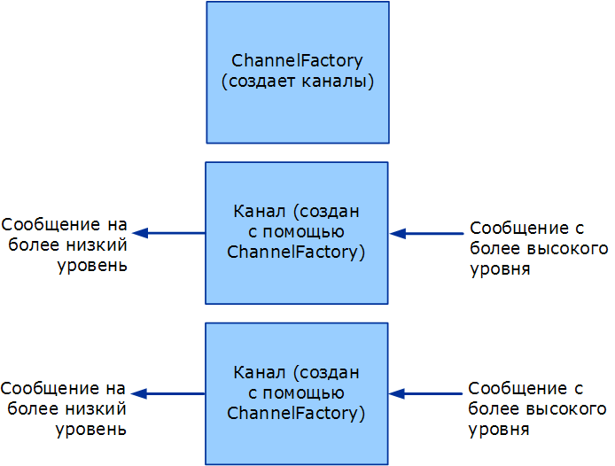

# <a name="client-channel-factories-and-channels"></a>Клиент: фабрики каналов и каналы
В этом разделе рассматривается создание фабрик каналов и каналов.  
  
## <a name="channel-factories-and-channels"></a>Фабрики каналов и каналы  
 Фабрики каналов отвечают за создание каналов. Каналы, создаваемые фабриками каналов, используются для отправки сообщений. Эти каналы отвечают за получение сообщения от вышестоящего уровня, выполнение той или иной обработки и отправку сообщения нижестоящему уровню. Следующий рисунок иллюстрирует этот процесс.  
  
   
Фабрика каналов создает каналы.  
  
 При закрытии фабрики каналов отвечают за закрытие всех созданных ими каналов, которые еще не закрыты. Обратите внимание, что модель в данном случае асимметрична: когда закрывается прослушиватель каналов, он прекращает только принимать новые каналы, однако оставляет существующие каналы открытыми, чтобы они могли продолжить получать сообщения.  
  
 WCF предоставляет помощников базового класса для этого процесса. (Для диаграммы классов помощников канала, обсуждаемых [Channel Model Overview](channel-model-overview.md)в этой теме, см.  
  
- Класс <xref:System.ServiceModel.Channels.CommunicationObject> реализует <xref:System.ServiceModel.ICommunicationObject> и применяет государственную машину, описанную в шаге 2 [Развивающихся Каналов.](developing-channels.md)  
  
- Класс <xref:System.ServiceModel.Channels.ChannelManagerBase> реализует <xref:System.ServiceModel.Channels.CommunicationObject> и обеспечивает единый <xref:System.ServiceModel.Channels.ChannelFactoryBase?displayProperty=nameWithType> базовый класс для и <xref:System.ServiceModel.Channels.ChannelListenerBase?displayProperty=nameWithType>. Класс <xref:System.ServiceModel.Channels.ChannelManagerBase> работает совместно с классом <xref:System.ServiceModel.Channels.ChannelBase> - базовым классом, реализующим интерфейс <xref:System.ServiceModel.Channels.IChannel>.
  
- Класс <xref:System.ServiceModel.Channels.ChannelFactoryBase> реализует <xref:System.ServiceModel.Channels.ChannelManagerBase> и <xref:System.ServiceModel.Channels.IChannelFactory> объединяет `CreateChannel` перегрузки в `OnCreateChannel` один абстрактный метод.
  
- Класс <xref:System.ServiceModel.Channels.ChannelListenerBase> реализует <xref:System.ServiceModel.Channels.IChannelListener>. Он отвечает за базовое управление состоянием.
  
 Следующее обсуждение основано на примере [Транспорта: UDP.](../samples/transport-udp.md)  
  
### <a name="creating-a-channel-factory"></a>Создание фабрики каналов  
 Фабрика`UdpChannelFactory` наследуется от класса <xref:System.ServiceModel.Channels.ChannelFactoryBase>. В образце переопределяется метод <xref:System.ServiceModel.Channels.ChannelFactoryBase.GetProperty%2A> для обеспечения доступа к версии сообщения кодировщика сообщений. Также переопределяется метод <xref:System.ServiceModel.Channels.ChannelFactoryBase.OnClose%2A> для уничтожения созданного экземпляра класса <xref:System.ServiceModel.Channels.BufferManager> при переходе конечного автомата в другое состояние.  
  
#### <a name="the-udp-output-channel"></a>Выходной канал UDP  
 Класс`UdpOutputChannel` реализует интерфейс <xref:System.ServiceModel.Channels.IOutputChannel>. Конструктор проверяет аргументы и создает целевой объект <xref:System.Net.EndPoint> на основании переданного ему адреса <xref:System.ServiceModel.EndpointAddress>.  
  
 Переопределение метода <xref:System.ServiceModel.Channels.CommunicationObject.OnOpen%2A> создает сокет, используемый для отправки сообщений этому объекту <xref:System.Net.EndPoint>.  
  
 ```csharp
this.socket = new Socket(  
this.remoteEndPoint.AddressFamily,
   SocketType.Dgram,
   ProtocolType.Udp
);  
```  

 Канал может быть закрыт правильно или неправильно. При верном закрытии канала сокет закрывается и вызывается метод `OnClose` базового класса. Если при этом создается исключение, инфраструктура вызывает метод `Abort`, чтоб обеспечить очистку канала.  
  
```csharp  
this.socket.Close();  
base.OnClose(timeout);  
```  
  
 Реализация `Send()` `BeginSend()` / `EndSend()`и . Реализация делится на две принципиальные части. Сначала сериализуйте сообщение в байтовый массив:  
  
```csharp  
ArraySegment<byte> messageBuffer = EncodeMessage(message);  
```  
  
 Затем отправьте получившиеся данные по сети:  
  
```csharp  
this.socket.SendTo(  
  messageBuffer.Array,
  messageBuffer.Offset,
  messageBuffer.Count,
  SocketFlags.None,
  this.remoteEndPoint  
);  
```  
  
## <a name="see-also"></a>См. также раздел

- [Разработка каналов](developing-channels.md)
