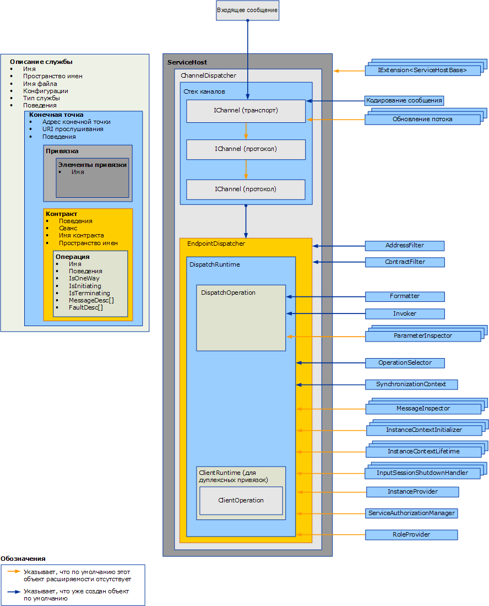

# Расширение диспетчеров
Диспетчеры отвечают за удаление входящих сообщений из базовых каналов, их перевод в вызовы метода в коде приложения и отправку результатов обратно вызывающему коду. Расширения диспетчера позволяют изменить эту процедуру.  Можно реализовать инспекторы сообщений или параметров, которые инспектируют или изменяют содержимое сообщений или параметров.  Можно изменить способ перенаправления сообщений в операции или обеспечить какие-либо другие функции.  
  
 В этом разделе описано, как использовать классы <xref:System.ServiceModel.Dispatcher.DispatchRuntime> и <xref:System.ServiceModel.Dispatcher.DispatchOperation> в приложении службы [!INCLUDE[indigo1](../../../../includes/indigo1-md.md)], чтобы изменять поведение выполнения диспетчера по умолчанию либо перехватывать или изменять сообщения, параметры или возвращаемые значения до отправки или извлечениях их из уровня канала или сразу после отправки или извлечения. Дополнительные сведения об обработке сообщений среды выполнения эквивалентные клиента см. в разделе [расширение клиентов](../../../../docs/framework/wcf/extending/extending-clients.md). Чтобы понять, какую роль, <xref:System.ServiceModel.IExtensibleObject%601> типы воспроизведение при доступе к общему состоянию между различными объектами среды выполнения настройки см. в разделе [расширяемых объектов](../../../../docs/framework/wcf/extending/extensible-objects.md).  
  
## Диспетчеры  
 Уровень модели службы осуществляет преобразование между моделью программирования разработчика и базовым обменом сообщениями, который обычно называется "уровень каналов". В [!INCLUDE[indigo2](../../../../includes/indigo2-md.md)] диспетчеры каналов и конечных точек (<xref:System.ServiceModel.Dispatcher.ChannelDispatcher> и <xref:System.ServiceModel.Dispatcher.EndpointDispatcher> соответственно) являются компонентами службы, отвечающими за принятие новых каналов, получение сообщений, перенаправление и вызов операций и обработку ответов. Объекты диспетчера - это объекты получателя, однако реализации контракта обратного вызова в дуплексных службах также предоставляют свои объекты диспетчера для проверки, изменения или расширения.  
  
 Диспетчер каналов (и сопровождающий прослушиватель <xref:System.ServiceModel.Channels.IChannelListener>) удаляет сообщения из базового канала и передает их соответствующим диспетчерам конечной точки. Каждый диспетчер конечной точки имеет среду выполнения <xref:System.ServiceModel.Dispatcher.DispatchRuntime>, направляющую сообщения в соответствующую операцию <xref:System.ServiceModel.Dispatcher.DispatchOperation>, которая отвечает за вызов метода, реализующего операцию. Одновременно с этим вызываются различные необязательные и обязательные классы расширений. В этом разделе объясняется, как взаимодействуют все эти элементы и как можно изменять их свойства и подключать собственный код для расширения их базовой функциональности.  
  
 Свойства диспетчера и измененные объекты настройки вставляются с помощью объектов службы, конечной точки, контракта или поведения операции. В этом разделе не описано, как использовать эти поведения. Дополнительные сведения о типах, используемых для вставки изменений dispatcher. в разделе [настройку и расширение среды выполнения с помощью поведений](../../../../docs/framework/wcf/extending/configuring-and-extending-the-runtime-with-behaviors.md).  
  
 На следующем изображении представлено общее описание элементов архитектуры в службе.  
  
   
  
### Диспетчеры каналов  
 Объект <xref:System.ServiceModel.Dispatcher.ChannelDispatcher> создается для связи прослушивателя <xref:System.ServiceModel.Channels.IChannelListener> по определенному URI (называемому "URI прослушивания") с экземпляром службы. Следовательно, каждый объект <xref:System.ServiceModel.ServiceHost> может иметь множество объектов <xref:System.ServiceModel.Dispatcher.ChannelDispatcher>, каждый из которых связан только с одним прослушивателем и URI прослушивания. При поступлении сообщения диспетчер каналов <xref:System.ServiceModel.Dispatcher.ChannelDispatcher> запрашивает все связанные объекты <xref:System.ServiceModel.Dispatcher.EndpointDispatcher>, может ли данная конечная точка принять это сообщение, и передает его соответствующей конечной точке.  
  
 Все свойства, которые управляют временем существования и поведением сеанса канала, доступны для проверки или изменения в объекте <xref:System.ServiceModel.Dispatcher.ChannelDispatcher>. Сюда относятся пользовательские инициализаторы канала, прослушиватель канала, узел, связанный контекст <xref:System.ServiceModel.InstanceContext> и т. д.  
  
### Диспетчеры конечных точек  
 Объект <xref:System.ServiceModel.Dispatcher.EndpointDispatcher> отвечает за обработку сообщений от <xref:System.ServiceModel.Dispatcher.ChannelDispatcher>, если адрес назначения сообщения соответствует свойству <xref:System.ServiceModel.Dispatcher.EndpointDispatcher.AddressFilter%2A> и действие сообщения соответствует свойству <xref:System.ServiceModel.Dispatcher.EndpointDispatcher.ContractFilter%2A>. Если принять сообщение могут два объекта <xref:System.ServiceModel.Dispatcher.EndpointDispatcher>, то значение свойства <xref:System.ServiceModel.Dispatcher.EndpointDispatcher.FilterPriority%2A> определяет конечную точку с более высоким приоритетом.  
  
 Используйте диспетчер конечных точек <xref:System.ServiceModel.Dispatcher.EndpointDispatcher>, чтобы получить две основные точки расширения модели службы (классы <xref:System.ServiceModel.Dispatcher.DispatchRuntime> и <xref:System.ServiceModel.Dispatcher.DispatchOperation>), которые можно использовать для настройки обработки диспетчера. Класс <xref:System.ServiceModel.Dispatcher.DispatchRuntime> позволяет пользователям перехватывать и расширять диспетчер в области контракта (т. е. для всех сообщений контракта). Класс <xref:System.ServiceModel.Dispatcher.DispatchOperation> позволяет пользователям перехватывать и расширять диспетчер в области операции (т. е. для всех сообщений операции).  
  
## Сценарии  
 Существует несколько причин для расширения диспетчера.  
  
-   Пользовательская проверка сообщений Пользователи могут принудительно указать, что сообщение допустимо для определенной схемы. Для этого нужно реализовать интерфейсы перехватчиков сообщений. Пример см. в разделе [инспекторы сообщений](../../../../docs/framework/wcf/samples/message-inspectors.md).  
  
-   Ведение пользовательского журнала сообщений Пользователи могут проверять и регистрировать некоторый набор сообщений приложения, которые проходят через конечную точку. Для этого также можно использовать интерфейсы перехватчиков сообщений.  
  
-   Пользовательские преобразования сообщений Пользователи могут применять к сообщению определенные преобразования в среде выполнения (например, для управления версиями). Для этого также можно использовать интерфейсы перехватчиков сообщений.  
  
-   Пользовательская модель данных Пользователи могут использовать модель сериализации данных, отличную от моделей, поддерживаемых в [!INCLUDE[indigo2](../../../../includes/indigo2-md.md)] по умолчанию (а именно объекты <xref:System.Runtime.Serialization.DataContractSerializer?displayProperty=nameWithType>, <xref:System.Xml.Serialization.XmlSerializer?displayProperty=nameWithType> и необработанные сообщения). Для этого также можно реализовать интерфейсы модулей форматирования сообщений. Пример см. в разделе [модуль форматирования и селектор операции](../../../../docs/framework/wcf/samples/operation-formatter-and-operation-selector.md).  
  
-   Пользовательская проверка параметров Пользователи могут проводить принудительную проверку допустимости типизированных параметров (в отличие от XML). Для этого также можно использовать интерфейсы инспекторов параметров.  
  
-   Пользовательская диспетчеризация операций Пользователи могут диспетчеризовать не только действия, но и, например, элементы тела сообщения или пользовательские свойства сообщения. Это можно сделать с помощью интерфейса <xref:System.ServiceModel.Dispatcher.IDispatchOperationSelector>. Пример см. в разделе [модуль форматирования и селектор операции](../../../../docs/framework/wcf/samples/operation-formatter-and-operation-selector.md).  
  
-   Использование пулов объектов Пользователи могут объединять экземпляры в пул, вместо того чтобы выделять новый экземпляр для каждого вызова. Это можно реализовать с помощью интерфейсов поставщика экземпляров. Пример см. в разделе [Pooling](../../../../docs/framework/wcf/samples/pooling.md).  
  
-   Аренда экземпляров Пользователи могут реализовать шаблон аренды для времени существования экземпляра, аналогичный шаблону удаленного взаимодействия .NET Framework. Это можно сделать с помощью интерфейсов времени существования контекста экземпляра.  
  
-   Пользовательская обработка ошибок Пользователи могут управлять как обработкой локальных ошибок, так и передачей ошибок обратно клиентам. Это можно реализовать с помощью интерфейсов <xref:System.ServiceModel.Dispatcher.IErrorHandler>.  
  
-   Пользовательские поведения авторизации Пользователи могут осуществлять пользовательское управление доступом, расширяя элементы среды выполнения контракта или операции и добавляя проверки безопасности на основе маркеров, присутствующих в сообщении. Это можно сделать с помощью интерфейсов перехватчиков сообщений или перехватчиков параметров. Примеры см. в разделе [расширяемости безопасности](../../../../docs/framework/wcf/samples/security-extensibility.md).  
  
    > [!CAUTION]
    >  Так как изменение свойств безопасности потенциально может угрожать безопасности приложений [!INCLUDE[indigo2](../../../../includes/indigo2-md.md)], настоятельно рекомендуется проявлять осторожность при внесении любых связанных с безопасностью изменений и проводить тщательные проверки до развертывания.  
  
-   Пользовательские проверяющие элементы управления средой выполнения WCF Можно установить пользовательские проверяющие элементы управления, которые анализируют службы, контракты и привязки для принудительного выполнения политик на уровне предприятия, относящихся к приложениям [!INCLUDE[indigo2](../../../../includes/indigo2-md.md)]. (Например, в разделе [как: блокировки работу конечных точек на предприятии](../../../../docs/framework/wcf/extending/how-to-lock-down-endpoints-in-the-enterprise.md).)  
  
### Использование класса DispatchRuntime  
 Используйте класс <xref:System.ServiceModel.Dispatcher.DispatchRuntime> либо для изменения поведения службы по умолчанию или отдельной конечной точки, либо для вставки объектов, реализующих пользовательские изменения, в один (или оба) из следующих процессов служб (или процессов клиентов, если речь идет о дуплексном клиенте).  
  
-   Преобразование входящих сообщений в объекты и выпуск этих объектов в качестве вызовов методов на объекте службы.  
  
-   Преобразование объектов, принятых от ответа на вызов операции службы, в исходящие сообщения.  
  
 Объект <xref:System.ServiceModel.Dispatcher.DispatchRuntime> разрешает перехватывать и расширять диспетчеры каналов или конечных точек для всех сообщений в конкретном контракте, даже если сообщение не распознается. При приеме сообщения, не соответствующего ни одному из заданных в контракте сообщений, оно отправляется операции, возвращаемой свойством <xref:System.ServiceModel.Dispatcher.DispatchRuntime.UnhandledDispatchOperation%2A>. Сведения о перехвате или расширении всех сообщений для конкретной операции см. в описании класса <xref:System.ServiceModel.Dispatcher.DispatchOperation>.  
  
 Класс <xref:System.ServiceModel.Dispatcher.DispatchRuntime> предоставляет четыре основных области расширяемости диспетчера.  
  
1.  Компоненты канала используют свойства объекта <xref:System.ServiceModel.Dispatcher.DispatchRuntime> и сопоставленного диспетчера каналов, возвращаемого свойством <xref:System.ServiceModel.Dispatcher.DispatchRuntime.ChannelDispatcher%2A>, для настройки приема и закрытия каналов диспетчером каналов. Эта категория содержит свойства <xref:System.ServiceModel.Dispatcher.ChannelDispatcher.ChannelInitializers%2A> и <xref:System.ServiceModel.Dispatcher.DispatchRuntime.InputSessionShutdownHandlers%2A>.  
  
2.  Компоненты сообщения настраиваются для каждого обрабатываемого сообщения. Эта категория содержит свойства <xref:System.ServiceModel.Dispatcher.DispatchRuntime.MessageInspectors%2A>, <xref:System.ServiceModel.Dispatcher.DispatchRuntime.OperationSelector%2A>, <xref:System.ServiceModel.Dispatcher.DispatchRuntime.Operations%2A> и <xref:System.ServiceModel.Dispatcher.ChannelDispatcher.ErrorHandlers%2A>.  
  
3.  Компоненты экземпляра настраивают создание, время жизни и удаление экземпляров типа службы. За дополнительными сведениями о времени жизни объектов служб обратитесь к свойству <xref:System.ServiceModel.ServiceBehaviorAttribute.InstanceContextMode%2A>. Эта категория содержит свойства <xref:System.ServiceModel.Dispatcher.DispatchRuntime.InstanceContextInitializers%2A> и <xref:System.ServiceModel.Dispatcher.DispatchRuntime.InstanceProvider%2A>.  
  
4.  Компоненты, относящиеся к безопасности, могут использовать следующие свойства:  
  
    -   Свойство <xref:System.ServiceModel.Dispatcher.DispatchRuntime.SecurityAuditLogLocation%2A> обозначает место записи событий аудита.  
  
    -   Свойство <xref:System.ServiceModel.Dispatcher.DispatchRuntime.ImpersonateCallerForAllOperations%2A> определяет, будет ли служба пытаться производить олицетворение при помощи учетных данных, предоставленных во входящем сообщении.  
  
    -   Свойство <xref:System.ServiceModel.Dispatcher.DispatchRuntime.MessageAuthenticationAuditLevel%2A> определяет, будут ли события успешной проверки подлинности сообщения записываться в журнал событий, указанный в <xref:System.ServiceModel.Dispatcher.DispatchRuntime.SecurityAuditLogLocation%2A>.  
  
    -   Свойство <xref:System.ServiceModel.Dispatcher.DispatchRuntime.PrincipalPermissionMode%2A> управляет способом задания свойства <xref:System.Threading.Thread.CurrentPrincipal%2A>.  
  
    -   Свойство <xref:System.ServiceModel.Dispatcher.DispatchRuntime.ServiceAuthorizationAuditLevel%2A> указывает каким образом производится аудит событий авторизации.  
  
    -   Свойство <xref:System.ServiceModel.Dispatcher.DispatchRuntime.SuppressAuditFailure%2A> указывает, будут ли подавляться некритические исключения, создаваемые в процессе ведения журнала.  
  
 Обычно объекты пользовательских расширений присваиваются свойству <xref:System.ServiceModel.Dispatcher.DispatchRuntime> или вставляются в коллекцию поведением службы (объект, реализующий <xref:System.ServiceModel.Description.IServiceBehavior>), поведением контракта (объект, реализующий <xref:System.ServiceModel.Description.IContractBehavior>) или поведением конечной точки (объект, реализующий <xref:System.ServiceModel.Description.IEndpointBehavior>). После этого объект устанавливающего поведения добавляется в соответствующую коллекцию поведений программно или реализацией пользовательского объекта <xref:System.ServiceModel.Configuration.BehaviorExtensionElement>, чтобы разрешить вставку поведения с помощью файла конфигурации приложения.  
  
 Дуплексные клиенты (клиенты, реализующие контракт обратного вызова, заданный дуплексной службой) также имеют объект <xref:System.ServiceModel.Dispatcher.DispatchRuntime>, доступ к которому можно получить с помощью свойства <xref:System.ServiceModel.Dispatcher.ClientRuntime.CallbackDispatchRuntime%2A>.  
  
### Использование класса DispatchOperation  
 Класс <xref:System.ServiceModel.Dispatcher.DispatchOperation> - это местоположение изменений в среде выполнения и точка вставки для пользовательских расширений, область действия которых ограничивается только одной операцией службы. (Чтобы изменить поведение среды выполнения службы для всех сообщений в контракте, используйте класс <xref:System.ServiceModel.Dispatcher.DispatchRuntime>.)  
  
 Установите изменения <xref:System.ServiceModel.Dispatcher.DispatchOperation> с помощью пользовательского объекта поведения службы.  
  
 Используйте свойство <xref:System.ServiceModel.Dispatcher.DispatchRuntime.Operations%2A>, чтобы найти объект <xref:System.ServiceModel.Dispatcher.DispatchOperation>, который представляет определенную операцию службы.  
  
 Следующие свойства управляют выполнением среды выполнения на уровне операции.  
  
-   Свойства <xref:System.ServiceModel.Dispatcher.DispatchOperation.Action%2A>, <xref:System.ServiceModel.Dispatcher.DispatchOperation.ReplyAction%2A>, <xref:System.ServiceModel.Dispatcher.DispatchOperation.FaultContractInfos%2A>, <xref:System.ServiceModel.Dispatcher.DispatchOperation.IsOneWay%2A>, <xref:System.ServiceModel.Dispatcher.DispatchOperation.IsTerminating%2A> и <xref:System.ServiceModel.Dispatcher.DispatchOperation.Name%2A> получают значения, соответствующие операции.  
  
-   Свойства <xref:System.ServiceModel.Dispatcher.DispatchOperation.TransactionAutoComplete%2A> и <xref:System.ServiceModel.Dispatcher.DispatchOperation.TransactionRequired%2A> задают поведение транзакции.  
  
-   Свойства <xref:System.ServiceModel.Dispatcher.DispatchOperation.ReleaseInstanceBeforeCall%2A> и <xref:System.ServiceModel.Dispatcher.DispatchOperation.ReleaseInstanceAfterCall%2A> управляют временем существования пользовательского объекта службы относительно <xref:System.ServiceModel.InstanceContext>.  
  
-   Свойства <xref:System.ServiceModel.Dispatcher.DispatchOperation.DeserializeRequest%2A>, <xref:System.ServiceModel.Dispatcher.DispatchOperation.SerializeReply%2A> и <xref:System.ServiceModel.Dispatcher.DispatchOperation.Formatter%2A> разрешают явное управление преобразованием сообщений в объекты и наоборот.  
  
-   Свойство <xref:System.ServiceModel.Dispatcher.DispatchOperation.Impersonation%2A> задает уровень олицетворения операции.  
  
-   Свойство <xref:System.ServiceModel.Dispatcher.DispatchOperation.CallContextInitializers%2A> вставляет пользовательские расширения контекста вызова для операции.  
  
-   Свойство <xref:System.ServiceModel.Dispatcher.DispatchOperation.AutoDisposeParameters%2A> управляет временем уничтожения объектов параметров.  
  
-   Свойство <xref:System.ServiceModel.Dispatcher.DispatchOperation.Invoker%2A> вставляет пользовательский объект средства вызова.  
  
-   Свойство <xref:System.ServiceModel.Dispatcher.DispatchOperation.ParameterInspectors%2A> позволяет вставлять пользовательский инспектор параметров, который можно использовать для проверки или изменения параметров и возвращаемых значений.  
  
## См. также  
 <xref:System.ServiceModel.Dispatcher.DispatchRuntime>  
 <xref:System.ServiceModel.Dispatcher.DispatchOperation>  
 [Как: проверять и изменять сообщений в службе](../../../../docs/framework/wcf/extending/how-to-inspect-and-modify-messages-on-the-service.md)  
 [Как: проверка или изменение параметров](../../../../docs/framework/wcf/extending/how-to-inspect-or-modify-parameters.md)  
 [Как: блокировка конечных точек на предприятии](../../../../docs/framework/wcf/extending/how-to-lock-down-endpoints-in-the-enterprise.md)
