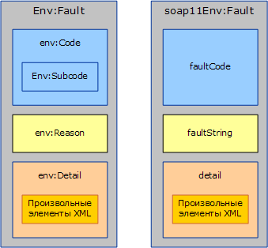
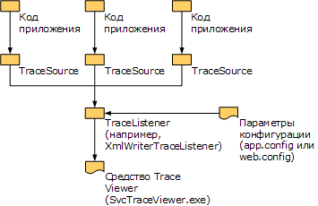

# <a name="handling-exceptions-and-faults"></a><span data-ttu-id="d5757-102">Обработка исключений и сбоев</span><span class="sxs-lookup"><span data-stu-id="d5757-102">Handling Exceptions and Faults</span></span>
<span data-ttu-id="d5757-103">Исключения используются, чтобы передать сведения об ошибках локально в службе или реализации клиента.</span><span class="sxs-lookup"><span data-stu-id="d5757-103">Exceptions are used to communicate errors locally within the service or the client implementation.</span></span> <span data-ttu-id="d5757-104">С другой стороны, сбои используются, чтобы передать ошибки за пределы службы, например, от сервера клиенту или наоборот.</span><span class="sxs-lookup"><span data-stu-id="d5757-104">Faults, on the other hand, are used to communicate errors across service boundaries, such as from the server to the client or vice versa.</span></span> <span data-ttu-id="d5757-105">Помимо сбоев каналы транспорта часто используют механизмы, связанные с транспортом, чтобы сообщить об ошибках на транспортном уровне.</span><span class="sxs-lookup"><span data-stu-id="d5757-105">In addition to faults, transport channels often use transport-specific mechanisms to communicate transport-level errors.</span></span> <span data-ttu-id="d5757-106">Например, транспорт HTTP использует коды состояния, такие как «404», чтобы сообщить о несуществующем конечном URL-адресе (отсутствует конечная точка, чтобы вернуть ошибку).</span><span class="sxs-lookup"><span data-stu-id="d5757-106">For example, HTTP transport uses status codes such as 404 to communicate a non-existing endpoint URL (there is no endpoint to send back a fault).</span></span> <span data-ttu-id="d5757-107">Этот документ состоит из трех разделов, в которых содержится руководство для разработчиков пользовательских каналов.</span><span class="sxs-lookup"><span data-stu-id="d5757-107">This document consists of three sections that provide guidance to custom channel authors.</span></span> <span data-ttu-id="d5757-108">В первом разделе содержится руководство о том, когда и как определять и выдавать исключения.</span><span class="sxs-lookup"><span data-stu-id="d5757-108">The first section provides guidance on when and how to define and throw exceptions.</span></span> <span data-ttu-id="d5757-109">Во втором разделе содержится руководство по созданию и использованию ошибок.</span><span class="sxs-lookup"><span data-stu-id="d5757-109">The second section provides guidance around generating and consuming faults.</span></span> <span data-ttu-id="d5757-110">В третьем разделе разъясняется, как предоставить данные трассировки, которые помогут пользователю созданного канала устранить неполадки в выполняемых приложениях.</span><span class="sxs-lookup"><span data-stu-id="d5757-110">The third section explains how to provide trace information to aid the user of your custom channel in troubleshooting running applications.</span></span>  
  
## <a name="exceptions"></a><span data-ttu-id="d5757-111">Исключения</span><span class="sxs-lookup"><span data-stu-id="d5757-111">Exceptions</span></span>  
 <span data-ttu-id="d5757-112">Важно учитывать два момента при создании исключения: во-первых, его тип должен позволять пользователям написать правильный программный код, который будет соответствующим образом реагировать на исключение.</span><span class="sxs-lookup"><span data-stu-id="d5757-112">There are two things to keep in mind when throwing an exception: First it has to be of a type that allows users to write correct code that can react appropriately to the exception.</span></span> <span data-ttu-id="d5757-113">Во-вторых, исключение должно содержать достаточно сведений для пользователя, чтобы понять, какой произошел сбой, его последствия и возможные способы устранения.</span><span class="sxs-lookup"><span data-stu-id="d5757-113">Second, it has to provide enough information for the user to understand what went wrong, the failure impact, and how to fix it.</span></span> <span data-ttu-id="d5757-114">Следующие разделы содержат рекомендации по типам исключений и сообщениям для каналов Windows Communication Foundation (WCF).</span><span class="sxs-lookup"><span data-stu-id="d5757-114">The following sections give guidance around exception types and messages for Windows Communication Foundation (WCF) channels.</span></span> <span data-ttu-id="d5757-115">Общие инструкции об исключениях в .NET можно также найти в документе «Правила разработки исключений».</span><span class="sxs-lookup"><span data-stu-id="d5757-115">There is also general guidance around exceptions in .NET in the Design Guidelines for Exceptions document.</span></span>  
  
### <a name="exception-types"></a><span data-ttu-id="d5757-116">Типы исключения</span><span class="sxs-lookup"><span data-stu-id="d5757-116">Exception Types</span></span>  
 <span data-ttu-id="d5757-117">Все исключения, создаваемые каналами, должны быть типа <xref:System.TimeoutException?displayProperty=nameWithType>, <xref:System.ServiceModel.CommunicationException?displayProperty=nameWithType> или типа, унаследованного от <xref:System.ServiceModel.CommunicationException>.</span><span class="sxs-lookup"><span data-stu-id="d5757-117">All exceptions thrown by channels must be either a <xref:System.TimeoutException?displayProperty=nameWithType>, <xref:System.ServiceModel.CommunicationException?displayProperty=nameWithType>, or a type derived from <xref:System.ServiceModel.CommunicationException>.</span></span> <span data-ttu-id="d5757-118">(Могут также создаваться такие исключения, как <xref:System.ObjectDisposedException>, но только для того, чтобы указать на неправильное использование канала вызывающим кодом.</span><span class="sxs-lookup"><span data-stu-id="d5757-118">(Exceptions such as <xref:System.ObjectDisposedException> may also be thrown, but only to indicate that the calling code has misused the channel.</span></span> <span data-ttu-id="d5757-119">Если канал используется правильно, он должен вызвать только указанные исключения.) WCF предоставляет семь типов исключений, которые являются производными от <xref:System.ServiceModel.CommunicationException> и предназначены для использования каналами.</span><span class="sxs-lookup"><span data-stu-id="d5757-119">If a channel is used correctly, it must only throw the given exceptions.) WCF provides seven exception types that derive from <xref:System.ServiceModel.CommunicationException> and are designed to be used by channels.</span></span> <span data-ttu-id="d5757-120">Существуют другие исключения, унаследованные от <xref:System.ServiceModel.CommunicationException>, которые созданы для использования с другими частями системы.</span><span class="sxs-lookup"><span data-stu-id="d5757-120">There are other <xref:System.ServiceModel.CommunicationException>-derived exceptions that are designed to be used by other parts of the system.</span></span> <span data-ttu-id="d5757-121">Эти типы исключений приведены в следующей таблице.</span><span class="sxs-lookup"><span data-stu-id="d5757-121">These exception types are:</span></span>  
  
|<span data-ttu-id="d5757-122">Тип исключения</span><span class="sxs-lookup"><span data-stu-id="d5757-122">Exception Type</span></span>|<span data-ttu-id="d5757-123">Смысл</span><span class="sxs-lookup"><span data-stu-id="d5757-123">Meaning</span></span>|<span data-ttu-id="d5757-124">Внутреннее содержимое исключения</span><span class="sxs-lookup"><span data-stu-id="d5757-124">Inner Exception Content</span></span>|<span data-ttu-id="d5757-125">Стратегия восстановления</span><span class="sxs-lookup"><span data-stu-id="d5757-125">Recovery Strategy</span></span>|  
|--------------------|-------------|-----------------------------|-----------------------|  
|<xref:System.ServiceModel.AddressAlreadyInUseException>|<span data-ttu-id="d5757-126">Адрес конечной точки, указанный для прослушивания, уже используется.</span><span class="sxs-lookup"><span data-stu-id="d5757-126">The endpoint address specified for listening is already in use.</span></span>|<span data-ttu-id="d5757-127">Если имеется, предоставляет дополнительные сведения об ошибке транспорта, вызвавшей это исключение.</span><span class="sxs-lookup"><span data-stu-id="d5757-127">If present, provides more details about the transport error that caused this exception.</span></span> <span data-ttu-id="d5757-128">Пример.</span><span class="sxs-lookup"><span data-stu-id="d5757-128">For example.</span></span> <span data-ttu-id="d5757-129"><xref:System.IO.PipeException>, <xref:System.Net.HttpListenerException> или <xref:System.Net.Sockets.SocketException>.</span><span class="sxs-lookup"><span data-stu-id="d5757-129"><xref:System.IO.PipeException>, <xref:System.Net.HttpListenerException>, or <xref:System.Net.Sockets.SocketException>.</span></span>|<span data-ttu-id="d5757-130">Повторите попытку с другим адресом.</span><span class="sxs-lookup"><span data-stu-id="d5757-130">Try a different address.</span></span>|  
|<xref:System.ServiceModel.AddressAccessDeniedException>|<span data-ttu-id="d5757-131">Доступ к адресу конечной точки, указанному для прослушивания, не разрешен процессом.</span><span class="sxs-lookup"><span data-stu-id="d5757-131">The process is not allowed access to the endpoint address specified for listening.</span></span>|<span data-ttu-id="d5757-132">Если имеется, предоставляет дополнительные сведения об ошибке транспорта, вызвавшей это исключение.</span><span class="sxs-lookup"><span data-stu-id="d5757-132">If present, provides more details about the transport error that caused this exception.</span></span> <span data-ttu-id="d5757-133">Например, <xref:System.IO.PipeException> или <xref:System.Net.HttpListenerException>.</span><span class="sxs-lookup"><span data-stu-id="d5757-133">For example, <xref:System.IO.PipeException>, or <xref:System.Net.HttpListenerException>.</span></span>|<span data-ttu-id="d5757-134">Повторите попытку с другими учетными данными.</span><span class="sxs-lookup"><span data-stu-id="d5757-134">Try with different credentials.</span></span>|  
|<xref:System.ServiceModel.CommunicationObjectFaultedException>|<span data-ttu-id="d5757-135">Используемое <xref:System.ServiceModel.ICommunicationObject> находится в состоянии Faulted (Дополнительные сведения см. в разделе Основные данные [об изменениях состояния](understanding-state-changes.md)).</span><span class="sxs-lookup"><span data-stu-id="d5757-135">The <xref:System.ServiceModel.ICommunicationObject> being used is in the Faulted state (for more information, see [Understanding State Changes](understanding-state-changes.md)).</span></span> <span data-ttu-id="d5757-136">Обратите внимание, когда объект с несколькими ожидающими вызовами переходит в состояние сбоя, только один вызов создает исключение, относящееся к сбою, а остальные вызовы создают исключение <xref:System.ServiceModel.CommunicationObjectFaultedException>.</span><span class="sxs-lookup"><span data-stu-id="d5757-136">Note that when an object with multiple pending calls transitions to the Faulted state, only one call throws an exception that is related to the failure and the rest of the calls throw a <xref:System.ServiceModel.CommunicationObjectFaultedException>.</span></span> <span data-ttu-id="d5757-137">Это исключение обычно создается потому, что приложение пропускает какое-либо исключение и пытается использовать объект с уже имеющимся сбоем, возможно находящимся не в том потоке, который перехватил исходное исключение.</span><span class="sxs-lookup"><span data-stu-id="d5757-137">This exception is typically thrown because an application overlooks some exception and tries to use an already faulted object, possibly on a thread other than the one that caught the original exception.</span></span>|<span data-ttu-id="d5757-138">Если имеется, предоставляет сведения о внутреннем исключении.</span><span class="sxs-lookup"><span data-stu-id="d5757-138">If present provides details about the inner exception.</span></span>|<span data-ttu-id="d5757-139">Создать новый объект.</span><span class="sxs-lookup"><span data-stu-id="d5757-139">Create a new object.</span></span> <span data-ttu-id="d5757-140">Обратите внимание, что в зависимости от причины сбоя <xref:System.ServiceModel.ICommunicationObject>, могут потребоваться другие действия для восстановления.</span><span class="sxs-lookup"><span data-stu-id="d5757-140">Note that depending on what caused the <xref:System.ServiceModel.ICommunicationObject> to fault in the first place, there may be other work required to recover.</span></span>|  
|<xref:System.ServiceModel.CommunicationObjectAbortedException>|<span data-ttu-id="d5757-141">Используемая <xref:System.ServiceModel.ICommunicationObject> была прервана (Дополнительные сведения см. в разделе [об изменениях состояния](understanding-state-changes.md)).</span><span class="sxs-lookup"><span data-stu-id="d5757-141">The <xref:System.ServiceModel.ICommunicationObject> being used has been Aborted (for more information, see [Understanding State Changes](understanding-state-changes.md)).</span></span> <span data-ttu-id="d5757-142">Аналогично исключению <xref:System.ServiceModel.CommunicationObjectFaultedException>, это исключение вызвало для объекта событие <xref:System.ServiceModel.ICommunicationObject.Abort%2A>, возможно, из другого потока, и поэтому объект больше не используется.</span><span class="sxs-lookup"><span data-stu-id="d5757-142">Similar to <xref:System.ServiceModel.CommunicationObjectFaultedException>, his exception indicates the application has called <xref:System.ServiceModel.ICommunicationObject.Abort%2A> on the object, possibly from another thread, and the object is no longer usable for that reason.</span></span>|<span data-ttu-id="d5757-143">Если имеется, предоставляет сведения о внутреннем исключении.</span><span class="sxs-lookup"><span data-stu-id="d5757-143">If present provides details about the inner exception.</span></span>|<span data-ttu-id="d5757-144">Создать новый объект.</span><span class="sxs-lookup"><span data-stu-id="d5757-144">Create a new object.</span></span> <span data-ttu-id="d5757-145">Обратите внимание, что в зависимости от причины прерывания <xref:System.ServiceModel.ICommunicationObject>, могут потребоваться другие действия для восстановления.</span><span class="sxs-lookup"><span data-stu-id="d5757-145">Note that depending on what caused the <xref:System.ServiceModel.ICommunicationObject> to abort in the first place, there may be other work required to recover.</span></span>|  
|<xref:System.ServiceModel.EndpointNotFoundException>|<span data-ttu-id="d5757-146">Удаленная целевая конечная точка не выполняет прослушивание.</span><span class="sxs-lookup"><span data-stu-id="d5757-146">The target remote endpoint is not listening.</span></span> <span data-ttu-id="d5757-147">Это может быть вызвано тем, что адреса конечной точки неверен или неразрешим, либо конечная точка недоступна.</span><span class="sxs-lookup"><span data-stu-id="d5757-147">This can result from any part of the endpoint address being incorrect, irresolvable, or the endpoint being down.</span></span> <span data-ttu-id="d5757-148">Примерами являются ошибка DNS, недоступность диспетчера очередей и незапущенная служба.</span><span class="sxs-lookup"><span data-stu-id="d5757-148">Examples include DNS error, Queue Manager not available, and service not running.</span></span>|<span data-ttu-id="d5757-149">Внутреннее исключение предоставляет сведения, как правило, из используемого транспорта.</span><span class="sxs-lookup"><span data-stu-id="d5757-149">The inner exception provides details, typically from the underlying transport.</span></span>|<span data-ttu-id="d5757-150">Повторите попытку с другим адресом.</span><span class="sxs-lookup"><span data-stu-id="d5757-150">Try a different address.</span></span> <span data-ttu-id="d5757-151">Пользователь также может повторить попытку после небольшой паузы, если служба была недоступна.</span><span class="sxs-lookup"><span data-stu-id="d5757-151">Alternatively, the sender may wait a while and try again in case the service was down</span></span>|  
|<xref:System.ServiceModel.ProtocolException>|<span data-ttu-id="d5757-152">Протоколы связи, описанные в политике конечных точек, не совпадают между конечными точками.</span><span class="sxs-lookup"><span data-stu-id="d5757-152">The communication protocols, as described by the endpoint’s policy, are mismatched between endpoints.</span></span> <span data-ttu-id="d5757-153">Например, не совпадают типы содержимого кадрирования или превышен максимальный размер сообщения.</span><span class="sxs-lookup"><span data-stu-id="d5757-153">For example, framing content type mismatch or max message size exceeded.</span></span>|<span data-ttu-id="d5757-154">Если имеется, предоставляет дополнительную информацию о конкретной ошибке протокола.</span><span class="sxs-lookup"><span data-stu-id="d5757-154">If present provides more information about the specific protocol error.</span></span> <span data-ttu-id="d5757-155">Например, <xref:System.ServiceModel.QuotaExceededException> - внутреннее исключение, создаваемое когда причина ошибки превышает MaxReceivedMessageSize.</span><span class="sxs-lookup"><span data-stu-id="d5757-155">For example, <xref:System.ServiceModel.QuotaExceededException> is the inner exception when the error cause is exceeding MaxReceivedMessageSize.</span></span>|<span data-ttu-id="d5757-156">Восстановление: убедитесь в соответствии параметров протоколов отправителя и получателя.</span><span class="sxs-lookup"><span data-stu-id="d5757-156">Recovery: Ensure sender and received protocol settings match.</span></span> <span data-ttu-id="d5757-157">Например, для этого можно повторно импортировать метаданные (политику) конечной точки службы и использовать созданную привязку, чтобы заново создать канал.</span><span class="sxs-lookup"><span data-stu-id="d5757-157">One way to do this is to re-import the service endpoint’s metadata (policy) and use the generated binding to recreate the channel.</span></span>|  
|<xref:System.ServiceModel.ServerTooBusyException>|<span data-ttu-id="d5757-158">Удаленная конечная точка выполняет прослушивание, но не готова к обработке сообщений.</span><span class="sxs-lookup"><span data-stu-id="d5757-158">The remote endpoint is listening but is not prepared to process messages.</span></span>|<span data-ttu-id="d5757-159">Если имеется, внутренне исключение предоставляет ошибку протокола SOAP или сведения об ошибке на транспортном уровне.</span><span class="sxs-lookup"><span data-stu-id="d5757-159">If present, the inner Exception provides the SOAP fault or transport-level error details.</span></span>|<span data-ttu-id="d5757-160">Восстановление: повторите операцию после небольшой паузы.</span><span class="sxs-lookup"><span data-stu-id="d5757-160">Recovery: Wait and retry the operation later.</span></span>|  
|<xref:System.TimeoutException>|<span data-ttu-id="d5757-161">Не удалось завершить операцию в течение времени ожидания.</span><span class="sxs-lookup"><span data-stu-id="d5757-161">The operation failed to complete within the timeout period.</span></span>|<span data-ttu-id="d5757-162">Может содержать сведение о времени ожидания.</span><span class="sxs-lookup"><span data-stu-id="d5757-162">May provide details about the timeout.</span></span>|<span data-ttu-id="d5757-163">Повторите операцию после небольшой паузы.</span><span class="sxs-lookup"><span data-stu-id="d5757-163">Wait and retry the operation later.</span></span>|  
  
 <span data-ttu-id="d5757-164">Определите новый тип исключения только в том случае, если данный тип соответствует конкретной стратегии восстановления, отличной от всех существующих типов исключений.</span><span class="sxs-lookup"><span data-stu-id="d5757-164">Define a new exception type only if that type corresponds to a specific recovery strategy different from all of the existing exception types.</span></span> <span data-ttu-id="d5757-165">В случае определения нового типа исключения, он должен быть унаследован от <xref:System.ServiceModel.CommunicationException> или одного из его производных классов.</span><span class="sxs-lookup"><span data-stu-id="d5757-165">If you do define a new exception type, it must derive from <xref:System.ServiceModel.CommunicationException> or one of its derived classes.</span></span>  
  
### <a name="exception-messages"></a><span data-ttu-id="d5757-166">Сообщения об исключениях</span><span class="sxs-lookup"><span data-stu-id="d5757-166">Exception Messages</span></span>  
 <span data-ttu-id="d5757-167">Сообщения об исключениях предназначены для пользователя, а не для программы, поэтому в них должно содержаться достаточно сведений, чтобы помочь пользователю понять и решить проблему.</span><span class="sxs-lookup"><span data-stu-id="d5757-167">Exception messages are targeted at the user not the program so they should provide sufficient information to help the user understand and solve the problem.</span></span> <span data-ttu-id="d5757-168">Ниже приведены три неотъемлемые части хорошего сообщения об исключении.</span><span class="sxs-lookup"><span data-stu-id="d5757-168">The three essential parts of a good exception message are:</span></span>  
  
 <span data-ttu-id="d5757-169">Что произошло.</span><span class="sxs-lookup"><span data-stu-id="d5757-169">What happened.</span></span> <span data-ttu-id="d5757-170">Предоставьте четкое описание проблемы с использованием терминов, относящихся к взаимодействию с пользователем.</span><span class="sxs-lookup"><span data-stu-id="d5757-170">Provide a clear description of the problem using terms that relate to the user’s experience.</span></span> <span data-ttu-id="d5757-171">Например, "Недопустимый раздел конфигурации" является примером неправильного сообщения об исключении.</span><span class="sxs-lookup"><span data-stu-id="d5757-171">For example, a bad exception message would be "Invalid configuration section".</span></span> <span data-ttu-id="d5757-172">В этом случае у пользователя нет сведений о том, какой раздел и почему является неправильным.</span><span class="sxs-lookup"><span data-stu-id="d5757-172">This leaves the user wondering which configuration section is incorrect and why it is incorrect.</span></span> <span data-ttu-id="d5757-173">Улучшенное сообщение будет иметь вид "Недопустимый раздел конфигурации \<customBinding >".</span><span class="sxs-lookup"><span data-stu-id="d5757-173">An improved message would be "Invalid configuration section \<customBinding>".</span></span> <span data-ttu-id="d5757-174">Примером еще более точного сообщения может быть "Не удается добавить транспорт с именем myTransport в привязку myBinding, так как в привязке уже есть транспорт с именем myTransport".</span><span class="sxs-lookup"><span data-stu-id="d5757-174">An even better message would be "Cannot add the transport named myTransport to the binding named myBinding because the binding already has a transport named myTransport".</span></span> <span data-ttu-id="d5757-175">Это очень конкретное сообщение с использованием терминов и имен, которые пользователь легко может найти в файле конфигурации приложения.</span><span class="sxs-lookup"><span data-stu-id="d5757-175">This is a very specific message using terms and names that the user can easily identify in the application’s configuration file.</span></span> <span data-ttu-id="d5757-176">Однако в сообщении по-прежнему не хватает нескольких ключевых компонентов.</span><span class="sxs-lookup"><span data-stu-id="d5757-176">However, there are still a few key components missing.</span></span>  
  
 <span data-ttu-id="d5757-177">Значимость ошибки.</span><span class="sxs-lookup"><span data-stu-id="d5757-177">The significance of the error.</span></span> <span data-ttu-id="d5757-178">Если в сообщении четко не указано значение ошибки, у пользователя может возникнуть вопрос, является ли ошибка неустранимой, либо ее можно игнорировать.</span><span class="sxs-lookup"><span data-stu-id="d5757-178">Unless the message states clearly what the error means, the user is likely to wonder whether it is a fatal error or if it can be ignored.</span></span> <span data-ttu-id="d5757-179">Как правило, в сообщениях должно выводиться значение и значимость ошибки.</span><span class="sxs-lookup"><span data-stu-id="d5757-179">In general, messages should lead with the meaning or significance of the error.</span></span> <span data-ttu-id="d5757-180">Предыдущий пример может быть улучшен следующим образом: «Не удалось открыть ServiceHost из-за ошибки конфигурации. Не удается добавить транспорт с имением myTransport в привязку myBinding, так как в привязке уже есть транспорт с именем myTransport».</span><span class="sxs-lookup"><span data-stu-id="d5757-180">To improve the previous example, the message could be "ServiceHost failed to Open due to a configuration error: Cannot add the transport named myTransport to the binding named myBinding because the binding already has a transport named myTransport".</span></span>  
  
 <span data-ttu-id="d5757-181">Способы устранения проблемы пользователем.</span><span class="sxs-lookup"><span data-stu-id="d5757-181">How the user should correct the problem.</span></span> <span data-ttu-id="d5757-182">Самая важная часть сообщения - помочь пользователю устранить проблему.</span><span class="sxs-lookup"><span data-stu-id="d5757-182">The most important part of the message is helping the user fix the problem.</span></span> <span data-ttu-id="d5757-183">В сообщении должны содержаться некоторые рекомендации или указания о том, что необходимо проверить или исправить, чтобы устранить проблему.</span><span class="sxs-lookup"><span data-stu-id="d5757-183">The message should include some guidance or hints about what to check or fix to remedy the problem.</span></span> <span data-ttu-id="d5757-184">Например, «Не удалось открыть ServiceHost из-за ошибки конфигурации. Не удается добавить транспорт с имением myTransport в привязку myBinding, так как в привязке уже есть транспорт с именем myTransport.</span><span class="sxs-lookup"><span data-stu-id="d5757-184">For example, "ServiceHost failed to Open due to a configuration error: Cannot add the transport named myTransport to the binding named myBinding because the binding already has a transport named myTransport.</span></span> <span data-ttu-id="d5757-185">Убедитесь в том, что в привязке есть только один транспорт».</span><span class="sxs-lookup"><span data-stu-id="d5757-185">Please ensure there is only one transport in the binding".</span></span>  
  
## <a name="communicating-faults"></a><span data-ttu-id="d5757-186">Информирование об ошибках</span><span class="sxs-lookup"><span data-stu-id="d5757-186">Communicating Faults</span></span>  
 <span data-ttu-id="d5757-187">Протоколы SOAP 1.1 и SOAP 1.2 определяют конкретную структуру для ошибок.</span><span class="sxs-lookup"><span data-stu-id="d5757-187">SOAP 1.1 and SOAP 1.2 both define a specific structure for faults.</span></span> <span data-ttu-id="d5757-188">Между двумя спецификациями существуют определенные отличия, но для создания и использования ошибок обычно применяются типы Message и MessageFault.</span><span class="sxs-lookup"><span data-stu-id="d5757-188">There are some differences between the two specifications but in general, the Message and MessageFault types are used to create and consume faults.</span></span>  
  
 <span data-ttu-id="d5757-189"></span><span class="sxs-lookup"><span data-stu-id="d5757-189"></span></span>  
<span data-ttu-id="d5757-190">Ошибка SOAP 1.2 (слева) и ошибка SOAP 1.1 (справа).</span><span class="sxs-lookup"><span data-stu-id="d5757-190">SOAP 1.2 Fault (left) and SOAP 1.1 Fault (right).</span></span> <span data-ttu-id="d5757-191">Обратите внимание, что только в SOAP 1.1 элемент с ошибкой перечислен в пространстве имен.</span><span class="sxs-lookup"><span data-stu-id="d5757-191">Note that in SOAP 1.1 only the Fault element is namespace qualified.</span></span>  
  
 <span data-ttu-id="d5757-192">Протокол SOAP определяет сообщение об ошибке, как сообщение, содержащее элемент с ошибкой (элемент с именем `<env:Fault>`), в качестве дочернего элемента `<env:Body>`.</span><span class="sxs-lookup"><span data-stu-id="d5757-192">SOAP defines a fault message as a message that contains only a fault element (an element whose name is `<env:Fault>`) as a child of `<env:Body>`.</span></span> <span data-ttu-id="d5757-193">Содержимое элемента с ошибкой немного отличается в протоколах SOAP 1.1 и SOAP 1.2, как показано на рисунке 1.</span><span class="sxs-lookup"><span data-stu-id="d5757-193">The contents of the fault element differ slightly between SOAP 1.1 and SOAP 1.2 as shown in figure 1.</span></span> <span data-ttu-id="d5757-194">Однако класс <xref:System.ServiceModel.Channels.MessageFault?displayProperty=nameWithType> нормализует эти различия в одной модели объекта:</span><span class="sxs-lookup"><span data-stu-id="d5757-194">However, the <xref:System.ServiceModel.Channels.MessageFault?displayProperty=nameWithType> class normalizes these differences into one object model:</span></span>  
  
```csharp
public abstract class MessageFault  
{  
    protected MessageFault();  
  
    public virtual string Actor { get; }  
    public virtual string Node { get; }  
    public static string DefaultAction { get; }  
    public abstract FaultCode Code { get; }  
    public abstract bool HasDetail { get; }  
    public abstract FaultReason Reason { get; }  
  
    public T GetDetail<T>();  
    public T GetDetail<T>( XmlObjectSerializer serializer);  
    public System.Xml.XmlDictionaryReader GetReaderAtDetailContents();  
  
    // other methods omitted  
}  
```  
  
 <span data-ttu-id="d5757-195">Свойство `Code` соответствует свойству `env:Code` (или `faultCode` в SOAP 1.1) и определяет тип ошибки.</span><span class="sxs-lookup"><span data-stu-id="d5757-195">The `Code` property corresponds to the `env:Code` (or `faultCode` in SOAP 1.1) and identifies the type of the fault.</span></span> <span data-ttu-id="d5757-196">Протокол SOAP 1.2 определяет пять допустимых значений для `faultCode` (например, отправитель и получатель), а также определяет элемент `Subcode`, который может содержать значение дополнительного кода.</span><span class="sxs-lookup"><span data-stu-id="d5757-196">SOAP 1.2 defines five allowable values for `faultCode` (for example, Sender and Receiver) and defines a `Subcode` element which can contain any subcode value.</span></span> <span data-ttu-id="d5757-197">(Список допустимых кодов ошибок и их значения см. в [спецификации SOAP 1,2](https://go.microsoft.com/fwlink/?LinkId=95176) .) Протокол SOAP 1,1 имеет немного другой механизм: он определяет четыре `faultCode` значений (например, клиент и сервер), которые можно расширить либо путем определения совершенно новых, либо с помощью точечной нотации для создания более конкретных `faultCodes`, например Client. Authentication.</span><span class="sxs-lookup"><span data-stu-id="d5757-197">(See the [SOAP 1.2 specification](https://go.microsoft.com/fwlink/?LinkId=95176) for the list of allowable fault codes and their meaning.) SOAP 1.1 has a slightly different mechanism: It defines four `faultCode` values (for example, Client and Server) that can be extended either by defining entirely new ones or by using the dot notation to create more specific `faultCodes`, for example, Client.Authentication.</span></span>  
  
 <span data-ttu-id="d5757-198">При использовании типа MessageFault для программирования ошибок, значение FaultCode.Name и FaultCode.Namespace сопоставляется с именем и пространством имен `env:Code` в SOAP 1.2 или `faultCode` в SOAP 1.1.</span><span class="sxs-lookup"><span data-stu-id="d5757-198">When you use MessageFault to program faults, the FaultCode.Name and FaultCode.Namespace maps to the name and namespace of the SOAP 1.2 `env:Code` or the SOAP 1.1 `faultCode`.</span></span> <span data-ttu-id="d5757-199">Значение FaultCode.SubCode сопоставляется со значением `env:Subcode` для протокола SOAP 1.2, а для SOAP 1.1 оно равно NULL.</span><span class="sxs-lookup"><span data-stu-id="d5757-199">The FaultCode.SubCode maps to `env:Subcode` for SOAP 1.2 and is null for SOAP 1.1.</span></span>  
  
 <span data-ttu-id="d5757-200">Если требуется различать ошибку программными средствами, необходимо создать новые дополнительные коды ошибок (или новые коды ошибок при использовании протокола SOAP 1.1).</span><span class="sxs-lookup"><span data-stu-id="d5757-200">You should create new fault subcodes (or new fault codes if using SOAP 1.1) if it is interesting to programmatically distinguish a fault.</span></span> <span data-ttu-id="d5757-201">Это аналогично созданию нового типа исключения.</span><span class="sxs-lookup"><span data-stu-id="d5757-201">This is analogous to creating a new exception type.</span></span> <span data-ttu-id="d5757-202">Не следует использовать запись через точку с кодами ошибок SOAP 1.1.</span><span class="sxs-lookup"><span data-stu-id="d5757-202">You should avoid using the dot notation with SOAP 1.1 fault codes.</span></span> <span data-ttu-id="d5757-203">( [Базовый профиль WS-I](https://go.microsoft.com/fwlink/?LinkId=95177) также не рекомендует использовать нотацию с точкой кода ошибки.)</span><span class="sxs-lookup"><span data-stu-id="d5757-203">(The [WS-I Basic Profile](https://go.microsoft.com/fwlink/?LinkId=95177) also discourages the use of the fault code dot notation.)</span></span>  
  
```csharp
public class FaultCode  
{  
    public FaultCode(string name);  
    public FaultCode(string name, FaultCode subCode);  
    public FaultCode(string name, string ns);  
    public FaultCode(string name, string ns, FaultCode subCode);  
  
    public bool IsPredefinedFault { get; }  
    public bool IsReceiverFault { get; }  
    public bool IsSenderFault { get; }  
    public string Name { get; }  
    public string Namespace { get; }  
    public FaultCode SubCode { get; }  
  
//  methods omitted  
  
}  
```  
  
 <span data-ttu-id="d5757-204">Свойство `Reason` соответствует `env:Reason` (или `faultString` в SOAP 1.1), удобному для восприятия описанию ошибки, которое аналогично сообщению исключения.</span><span class="sxs-lookup"><span data-stu-id="d5757-204">The `Reason` property corresponds to the `env:Reason` (or `faultString` in SOAP 1.1) a human-readable description of the error condition analogous to an exception’s message.</span></span> <span data-ttu-id="d5757-205">Класс `FaultReason` (и `env:Reason/faultString`в протоколе SOAP) имеет встроенную поддержку нескольких переводов для обеспечения глобализации.</span><span class="sxs-lookup"><span data-stu-id="d5757-205">The `FaultReason` class (and SOAP `env:Reason/faultString`) has built-in support for having multiple translations in the interest of globalization.</span></span>  
  
```csharp
public class FaultReason  
{  
    public FaultReason(FaultReasonText translation);  
    public FaultReason(IEnumerable<FaultReasonText> translations);  
    public FaultReason(string text);  
  
    public SynchronizedReadOnlyCollection<FaultReasonText> Translations   
    {   
       get;   
    }  
  
 }  
```  
  
 <span data-ttu-id="d5757-206">Содержимое сведений об ошибке предоставляется в MessageFault с помощью различных методов, включая `GetDetail`\<T > и `GetReaderAtDetailContents`().</span><span class="sxs-lookup"><span data-stu-id="d5757-206">The fault detail contents are exposed on MessageFault using various methods including the `GetDetail`\<T> and `GetReaderAtDetailContents`().</span></span> <span data-ttu-id="d5757-207">Сведения об ошибке — это непрозрачный элемент для передачи дополнительных данных об ошибке.</span><span class="sxs-lookup"><span data-stu-id="d5757-207">The fault detail is an opaque element for carrying additional detail about the fault.</span></span> <span data-ttu-id="d5757-208">Это полезно, если существуют произвольные структурированные сведения, которые необходимо передать с ошибкой.</span><span class="sxs-lookup"><span data-stu-id="d5757-208">This is useful if there is some arbitrary structured detail that you want to carry with the fault.</span></span>  
  
### <a name="generating-faults"></a><span data-ttu-id="d5757-209">Создание ошибок</span><span class="sxs-lookup"><span data-stu-id="d5757-209">Generating Faults</span></span>  
 <span data-ttu-id="d5757-210">В данном разделе объясняется процесс создания ошибки в ответ на условие ошибки, обнаруженное в канале или свойстве сообщения, созданном каналом.</span><span class="sxs-lookup"><span data-stu-id="d5757-210">This section explains the process of generating a fault in response to an error condition detected in a channel or in a message property created by the channel.</span></span> <span data-ttu-id="d5757-211">Типичным примером является отправка обратно ошибки в ответ на сообщение запроса, содержащее недопустимые данные.</span><span class="sxs-lookup"><span data-stu-id="d5757-211">A typical example is sending back a fault in response to a request message that contains invalid data.</span></span>  
  
 <span data-ttu-id="d5757-212">При создании ошибки пользовательский канал должен не отправлять ее напрямую, а вызвать исключение и позволить вышестоящему уровню решить, необходимо ли преобразовывать это исключение в ошибку и как ее отправлять.</span><span class="sxs-lookup"><span data-stu-id="d5757-212">When generating a fault, the custom channel should not send the fault directly, rather, it should throw an exception and let the layer above decide whether to convert that exception to a fault and how to send it.</span></span> <span data-ttu-id="d5757-213">Для облегчения данного преобразования канал должен предоставить реализацию `FaultConverter`, которая может преобразовать исключение, вызываемое пользовательским каналом, в соответствующую ошибку.</span><span class="sxs-lookup"><span data-stu-id="d5757-213">To aid in this conversion, the channel should provide a `FaultConverter` implementation that can convert the exception thrown by the custom channel to the appropriate fault.</span></span> <span data-ttu-id="d5757-214">`FaultConverter` определяется следующим образом.</span><span class="sxs-lookup"><span data-stu-id="d5757-214">`FaultConverter` is defined as:</span></span>  
  
```csharp
public class FaultConverter  
{  
    public static FaultConverter GetDefaultFaultConverter(  
                                   MessageVersion version);  
    protected abstract bool OnTryCreateFaultMessage(  
                                   Exception exception,   
                                   out Message message);  
    public bool TryCreateFaultMessage(  
                                   Exception exception,   
                                   out Message message);  
}  
```  
  
 <span data-ttu-id="d5757-215">Каждый канал, создающий пользовательские ошибки, должен реализовать преобразователь `FaultConverter` и вернуть его из вызова в `GetProperty<FaultConverter>`.</span><span class="sxs-lookup"><span data-stu-id="d5757-215">Each channel that generates custom faults must implement `FaultConverter` and return it from a call to `GetProperty<FaultConverter>`.</span></span> <span data-ttu-id="d5757-216">Пользовательская реализация `OnTryCreateFaultMessage` должна либо преобразовывать исключение в ошибку либо делегировать его в преобразователь `FaultConverter` внутреннего канала.</span><span class="sxs-lookup"><span data-stu-id="d5757-216">The custom `OnTryCreateFaultMessage` implementation must either convert the exception to a fault or delegate to the inner channel’s `FaultConverter`.</span></span> <span data-ttu-id="d5757-217">Если канал является транспортным, то необходимо либо преобразовать исключение или делегат в `FaultConverter` кодировщика, либо `FaultConverter` по умолчанию, предоставленные в WCF.</span><span class="sxs-lookup"><span data-stu-id="d5757-217">If the channel is a transport it must either convert the exception or delegate to the encoder’s `FaultConverter` or the default `FaultConverter` provided in WCF .</span></span> <span data-ttu-id="d5757-218">Преобразователь по умолчанию `FaultConverter` преобразует ошибки, соответствующие сообщениям об ошибках, которые указаны в WS-Addressing и SOAP.</span><span class="sxs-lookup"><span data-stu-id="d5757-218">The default `FaultConverter` converts errors corresponding to fault messages specified by WS-Addressing and SOAP.</span></span> <span data-ttu-id="d5757-219">Ниже приведен пример реализации `OnTryCreateFaultMessage`.</span><span class="sxs-lookup"><span data-stu-id="d5757-219">Here is an example `OnTryCreateFaultMessage` implementation.</span></span>  
  
```csharp
public override bool OnTryCreateFaultMessage(Exception exception,   
                                             out Message message)  
{  
    if (exception is ...)  
    {  
        message = ...;  
        return true;  
    }  
  
#if IMPLEMENTING_TRANSPORT_CHANNEL  
    FaultConverter encoderConverter =   
                    this.encoder.GetProperty<FaultConverter>();  
    if ((encoderConverter != null) &&               
        (encoderConverter.TryCreateFaultMessage(  
         exception, out message)))  
    {  
        return true;  
    }  
  
    FaultConverter defaultConverter =   
                   FaultConverter.GetDefaultFaultConverter(  
                   this.channel.messageVersion);  
    return defaultConverter.TryCreateFaultMessage(  
                   exception,   
                   out message);  
#else  
    FaultConverter inner =   
                   this.innerChannel.GetProperty<FaultConverter>();  
    if (inner != null)  
    {  
        return inner.TryCreateFaultMessage(exception, out message);  
    }  
    else  
    {  
        message = null;  
        return false;  
    }  
#endif  
}  
```  
  
 <span data-ttu-id="d5757-220">В этом шаблоне показано, что исключения, вызываемые между уровнями для требующих ошибок условий, должны содержать достаточно сведений для соответствующего генератора ошибок, чтобы создать правильную ошибку.</span><span class="sxs-lookup"><span data-stu-id="d5757-220">An implication of this pattern is that exceptions thrown between layers for error conditions that require faults must contain enough information for the corresponding fault generator to create the correct fault.</span></span> <span data-ttu-id="d5757-221">Разработчики пользовательских каналов могут определять типы исключений, соответствующие условиям ошибок, если такие исключения не существуют.</span><span class="sxs-lookup"><span data-stu-id="d5757-221">As a custom channel author, you may define exception types that correspond to different fault conditions if such exceptions do not already exist.</span></span> <span data-ttu-id="d5757-222">Обратите внимание, что исключения, затрагивающий разные уровни канала, должны передавать условие ошибки, а не непрозрачные данные ошибки.</span><span class="sxs-lookup"><span data-stu-id="d5757-222">Note that exceptions traversing channel layers should communicate the error condition rather than opaque fault data.</span></span>  
  
### <a name="fault-categories"></a><span data-ttu-id="d5757-223">Категории ошибок</span><span class="sxs-lookup"><span data-stu-id="d5757-223">Fault Categories</span></span>  
 <span data-ttu-id="d5757-224">Обычно существует три категории ошибок.</span><span class="sxs-lookup"><span data-stu-id="d5757-224">There are generally three categories of faults:</span></span>  
  
1. <span data-ttu-id="d5757-225">Ошибки, распространяющиеся на весь стек.</span><span class="sxs-lookup"><span data-stu-id="d5757-225">Faults that are pervasive throughout the entire stack.</span></span> <span data-ttu-id="d5757-226">Эти ошибки встречаются на любом уровне в стеке каналов, например, InvalidCardinalityAddressingException.</span><span class="sxs-lookup"><span data-stu-id="d5757-226">These faults could be encountered at any layer in the channel stack, for example InvalidCardinalityAddressingException.</span></span>  
  
2. <span data-ttu-id="d5757-227">Ошибки, встречающиеся выше определенного уровня в стеке. Например, некоторые ошибки, относящиеся к поточной транзакции или ролям безопасности.</span><span class="sxs-lookup"><span data-stu-id="d5757-227">Faults that can be encountered anywhere above a certain layer in the stack for example some errors that pertain to a flowed transaction or to security roles.</span></span>  
  
3. <span data-ttu-id="d5757-228">Ошибки, направленные на один уровень в стеке, например, ошибки номера последовательности WS-RM.</span><span class="sxs-lookup"><span data-stu-id="d5757-228">Faults that are directed at a single layer in the stack, for example errors like WS-RM sequence number faults.</span></span>  
  
 <span data-ttu-id="d5757-229">Категория 1.</span><span class="sxs-lookup"><span data-stu-id="d5757-229">Category 1.</span></span> <span data-ttu-id="d5757-230">Как правило, ошибки WS-Addressing и SOAP.</span><span class="sxs-lookup"><span data-stu-id="d5757-230">Faults are generally WS-Addressing and SOAP faults.</span></span> <span data-ttu-id="d5757-231">Базовый класс `FaultConverter`, предоставляемый WCF, преобразует ошибки, соответствующие сообщениям об ошибках, заданным WS-Addressing и SOAP, поэтому вам не нужно самостоятельно выполнять преобразование этих исключений.</span><span class="sxs-lookup"><span data-stu-id="d5757-231">The base `FaultConverter` class provided by WCF converts errors corresponding to fault messages specified by WS-Addressing and SOAP so you do not have to handle conversion of these exceptions yourself.</span></span>  
  
 <span data-ttu-id="d5757-232">Категория 2.</span><span class="sxs-lookup"><span data-stu-id="d5757-232">Category 2.</span></span> <span data-ttu-id="d5757-233">Ошибки происходят, когда уровень добавляет в сообщение свойство, которое не полностью использует сведения о сообщении, относящиеся к данному уровню.</span><span class="sxs-lookup"><span data-stu-id="d5757-233">Faults occur when a layer adds a property to the message that does not completely consume message information that pertains to that layer.</span></span> <span data-ttu-id="d5757-234">Ошибки могут быть обнаружены позже, когда расположенный выше уровень запрашивает свойство сообщения для дальнейшей обработки сведений о сообщении.</span><span class="sxs-lookup"><span data-stu-id="d5757-234">Errors may be detected later when a higher layer asks the message property to process message information further.</span></span> <span data-ttu-id="d5757-235">Такие каналы должны реализовать свойство `GetProperty`, заданное ранее, чтобы разрешить расположенному выше уровню отправлять обратно правильную ошибку.</span><span class="sxs-lookup"><span data-stu-id="d5757-235">Such channels should implement the `GetProperty` specified previously to enable the higher layer to send back the correct fault.</span></span> <span data-ttu-id="d5757-236">Примером этого может служить свойство TransactionMessageProperty.</span><span class="sxs-lookup"><span data-stu-id="d5757-236">An example of this is the TransactionMessageProperty.</span></span> <span data-ttu-id="d5757-237">Это свойство добавляется в сообщение без полной проверки всех данных в заголовке (для проверки может понадобиться обратиться к координатору распределенных транзакций (DTC).</span><span class="sxs-lookup"><span data-stu-id="d5757-237">This property is added to the message without fully validating all the data in the header (doing so may involve contacting the distributed transaction coordinator (DTC).</span></span>  
  
 <span data-ttu-id="d5757-238">Категория 3.</span><span class="sxs-lookup"><span data-stu-id="d5757-238">Category 3.</span></span> <span data-ttu-id="d5757-239">Ошибки создаются и отправляются только одним уровнем в процессоре.</span><span class="sxs-lookup"><span data-stu-id="d5757-239">Faults are only generated and sent by a single layer in the processor.</span></span> <span data-ttu-id="d5757-240">Таким образом, все исключения содержатся на одном уровне.</span><span class="sxs-lookup"><span data-stu-id="d5757-240">Therefore all the exceptions are contained within the layer.</span></span> <span data-ttu-id="d5757-241">Чтобы улучшить согласованность между каналами и упростить обслуживание, в пользовательском канале следует использовать приведенный ранее шаблон для создания сообщений об ошибках даже для внутренних ошибок.</span><span class="sxs-lookup"><span data-stu-id="d5757-241">To improve consistency among channels and ease maintenance, your custom channel should use the pattern specified previously to generate fault messages even for internal faults.</span></span>  
  
### <a name="interpreting-received-faults"></a><span data-ttu-id="d5757-242">Интерпретация полученных ошибок</span><span class="sxs-lookup"><span data-stu-id="d5757-242">Interpreting Received Faults</span></span>  
 <span data-ttu-id="d5757-243">В данном разделе содержится руководство по созданию соответствующего исключения при получении сообщения об ошибке.</span><span class="sxs-lookup"><span data-stu-id="d5757-243">This section provides guidance for generating the appropriate exception when receiving a fault message.</span></span> <span data-ttu-id="d5757-244">Ниже приведено дерево принятия решений для обработки сообщения на каждом из уровней стека.</span><span class="sxs-lookup"><span data-stu-id="d5757-244">The decision tree for processing a message at every layer in the stack is as follows:</span></span>  
  
1. <span data-ttu-id="d5757-245">Если уровень считает сообщение недействительным, он должен выполнить собственную обработку «недействительного сообщения».</span><span class="sxs-lookup"><span data-stu-id="d5757-245">If the layer considers the message to be invalid, the layer should do its ‘invalid message’ processing.</span></span> <span data-ttu-id="d5757-246">Данная обработка зависит от уровня, но она может включать удаление сообщения, трассировку или вызов исключения, преобразуемого в ошибку.</span><span class="sxs-lookup"><span data-stu-id="d5757-246">Such processing is specific to the layer but could include dropping the message, tracing, or throwing an exception that gets converted to a fault.</span></span> <span data-ttu-id="d5757-247">Примерами являются случаи, когда безопасность получает сообщение с ненадлежащей защитой, или диспетчер ресурсов получает сообщение с неправильным порядковым номером.</span><span class="sxs-lookup"><span data-stu-id="d5757-247">Examples include security receiving a message that is not secured properly, or RM receiving a message with a bad sequence number.</span></span>  
  
2. <span data-ttu-id="d5757-248">В противном случае, если сообщение представляет собой сообщение об ошибке, применимое непосредственно к уровню и не являющееся бессмысленным вне взаимодействия уровня, ошибка должна быть обработана уровнем.</span><span class="sxs-lookup"><span data-stu-id="d5757-248">Otherwise, if the message is a fault message that applies specifically to the layer, and the message is not meaningful outside the layer’s interaction, the layer should handle the error condition.</span></span> <span data-ttu-id="d5757-249">Примером этого является ошибка «отказ последовательности диспетчера ресурсов», являющаяся бессмысленной для уровней, расположенных выше канала диспетчера ресурсов. Это подразумевает сбой канала диспетчера ресурсов и вызов из незавершенных операций.</span><span class="sxs-lookup"><span data-stu-id="d5757-249">An example of this is an RM Sequence Refused fault that is meaningless to layers above the RM channel and that implies faulting the RM channel and throwing from pending operations.</span></span>  
  
3. <span data-ttu-id="d5757-250">В противном случае сообщение должно быть возвращено из запроса() или получения().</span><span class="sxs-lookup"><span data-stu-id="d5757-250">Otherwise, the message should be returned from Request() or Receive().</span></span> <span data-ttu-id="d5757-251">Сюда также входят случаи, когда уровень распознает ошибку, но ошибка указывает на сбой запроса и не подразумевает сбой канала и вызов из незавершенных операций.</span><span class="sxs-lookup"><span data-stu-id="d5757-251">This includes cases where the layer recognizes the fault, but the fault just indicates that a request failed and does not imply faulting the channel and throwing from pending operations.</span></span> <span data-ttu-id="d5757-252">Чтобы упростить использование, уровень должен реализовать `GetProperty<FaultConverter>` и возвратить производный класс `FaultConverter`, который может преобразовать исключение, переопределив `OnTryCreateException`.</span><span class="sxs-lookup"><span data-stu-id="d5757-252">To improve usability in such a case, the layer should implement `GetProperty<FaultConverter>` and return a `FaultConverter` derived class that can convert the fault to an exception by overriding `OnTryCreateException`.</span></span>  
  
 <span data-ttu-id="d5757-253">Приведенные ниже объектные модели поддерживают преобразование сообщений в исключения.</span><span class="sxs-lookup"><span data-stu-id="d5757-253">The following object model supports converting messages to exceptions:</span></span>  
  
```csharp
public class FaultConverter  
{  
    public static FaultConverter GetDefaultFaultConverter(  
                                  MessageVersion version);  
    protected abstract bool OnTryCreateException(  
                                 Message message,   
                                 MessageFault fault,   
                                 out Exception exception);  
    public bool TryCreateException(  
                                 Message message,   
                                 MessageFault fault,   
                                 out Exception exception);  
}  
```  
  
 <span data-ttu-id="d5757-254">Уровень канала может реализовать `GetProperty<FaultConverter>`, чтобы поддержать преобразование сообщений об ошибках в исключения.</span><span class="sxs-lookup"><span data-stu-id="d5757-254">A channel layer can implement `GetProperty<FaultConverter>` to support converting fault messages to exceptions.</span></span> <span data-ttu-id="d5757-255">Для этого переопределите `OnTryCreateException` и проверьте сообщение об ошибке.</span><span class="sxs-lookup"><span data-stu-id="d5757-255">To do so, override `OnTryCreateException` and inspect the fault message.</span></span> <span data-ttu-id="d5757-256">При подтверждении выполните преобразование, в противном случае запросите преобразование у внутреннего канала.</span><span class="sxs-lookup"><span data-stu-id="d5757-256">If recognized, do the conversion, otherwise ask the inner channel to convert it.</span></span> <span data-ttu-id="d5757-257">Каналы транспорта должны делегировать `FaultConverter.GetDefaultFaultConverter` получение FaultConverter для SOAP и WS-Addressing.</span><span class="sxs-lookup"><span data-stu-id="d5757-257">Transport channels should delegate to `FaultConverter.GetDefaultFaultConverter` to get the default SOAP/WS-Addressing FaultConverter.</span></span>  
  
 <span data-ttu-id="d5757-258">Типичная реализация выглядит следующим образом.</span><span class="sxs-lookup"><span data-stu-id="d5757-258">A typical implementation looks like this:</span></span>  
  
```csharp
public override bool OnTryCreateException(  
                            Message message,   
                            MessageFault fault,   
                            out Exception exception)  
{  
    if (message.Action == "...")  
    {  
        exception = ...;  
        return true;  
    }  
    // OR  
    if ((fault.Code.Name == "...") && (fault.Code.Namespace == "..."))  
    {  
        exception = ...;  
        return true;  
    }  
  
    if (fault.IsMustUnderstand)  
    {  
        if (fault.WasHeaderNotUnderstood(  
                   message.Headers, "...", "..."))  
        {  
            exception = new ProtocolException(...);  
            return true;  
        }  
    }  
  
#if IMPLEMENTING_TRANSPORT_CHANNEL  
    FaultConverter encoderConverter =   
              this.encoder.GetProperty<FaultConverter>();  
    if ((encoderConverter != null) &&   
        (encoderConverter.TryCreateException(  
                              message, fault, out exception)))  
    {  
        return true;  
    }  
  
    FaultConverter defaultConverter =  
             FaultConverter.GetDefaultFaultConverter(  
                             this.channel.messageVersion);  
    return defaultConverter.TryCreateException(  
                             message, fault, out exception);  
#else  
    FaultConverter inner =   
                    this.innerChannel.GetProperty<FaultConverter>();  
    if (inner != null)  
    {  
        return inner.TryCreateException(message, fault, out exception);  
    }  
    else  
    {  
        exception = null;  
        return false;  
    }  
#endif  
}  
```  
  
 <span data-ttu-id="d5757-259">Для конкретных условий ошибки, имеющих определенные сценарии восстановления, можно задать производный класс `ProtocolException`.</span><span class="sxs-lookup"><span data-stu-id="d5757-259">For specific fault conditions that have distinct recovery scenarios, consider defining a derived class of `ProtocolException`.</span></span>  
  
### <a name="mustunderstand-processing"></a><span data-ttu-id="d5757-260">Обработка MustUnderstand</span><span class="sxs-lookup"><span data-stu-id="d5757-260">MustUnderstand Processing</span></span>  
 <span data-ttu-id="d5757-261">Протокол SOAP определяет общую ошибку для оповещения о том, что необходимый заголовок не был понят получателем.</span><span class="sxs-lookup"><span data-stu-id="d5757-261">SOAP defines a general fault for signaling that a required header was not understood by the receiver.</span></span> <span data-ttu-id="d5757-262">Эта ошибка называется ошибкой `mustUnderstand`.</span><span class="sxs-lookup"><span data-stu-id="d5757-262">This fault is known as the `mustUnderstand` fault.</span></span> <span data-ttu-id="d5757-263">В WCF пользовательские каналы никогда не создают `mustUnderstand` ошибок.</span><span class="sxs-lookup"><span data-stu-id="d5757-263">In WCF, custom channels never generate `mustUnderstand` faults.</span></span> <span data-ttu-id="d5757-264">Вместо этого диспетчер WCF, расположенный в верхней части стека связи WCF, проверяет, что в базовом стеке были распознаны все заголовки, помеченные как MustUnderstand = true.</span><span class="sxs-lookup"><span data-stu-id="d5757-264">Instead, the WCF Dispatcher, which is located at the top of the WCF communication stack, checks to see that all headers that were marked as MustUnderstand=true were understood by the underlying stack.</span></span> <span data-ttu-id="d5757-265">Если какой-то из заголовков не был понят, в этой точке создается ошибка `mustUnderstand`.</span><span class="sxs-lookup"><span data-stu-id="d5757-265">If any were not understood, a `mustUnderstand` fault is generated at that point.</span></span> <span data-ttu-id="d5757-266">(Пользователь может отключить обработку `mustUnderstand`, и приложение будет принимать все заголовки сообщений.</span><span class="sxs-lookup"><span data-stu-id="d5757-266">(The user can choose to turn off this `mustUnderstand` processing and have the application receive all message headers.</span></span> <span data-ttu-id="d5757-267">В этом случае приложение отвечает за выполнение `mustUnderstand` обработки.) Сформированная ошибка включает заголовок Нотундерстуд, содержащий имена всех заголовков с MustUnderstand = true, которые не были распознаны.</span><span class="sxs-lookup"><span data-stu-id="d5757-267">In that case the application is responsible for performing `mustUnderstand` processing.) The generated fault includes a NotUnderstood header that contains the names of all headers with MustUnderstand=true that were not understood.</span></span>  
  
 <span data-ttu-id="d5757-268">Если канал протокола отправляет пользовательский заголовок со значением MustUnderstand=true и получает ошибку `mustUnderstand`, он должен определить, вызвана ли эта ошибка отправленным заголовком.</span><span class="sxs-lookup"><span data-stu-id="d5757-268">If your protocol channel sends a custom header with MustUnderstand=true and receives a `mustUnderstand` fault, it must figure out whether that fault is due to the header it sent.</span></span> <span data-ttu-id="d5757-269">Для этого можно использовать два члена в классе `MessageFault`:</span><span class="sxs-lookup"><span data-stu-id="d5757-269">There are two members on the `MessageFault` class that are useful for this:</span></span>  
  
```csharp
public class MessageFault  
{  
    ...  
    public bool IsMustUnderstandFault { get; }  
    public static bool WasHeaderNotUnderstood(MessageHeaders headers,   
        string name, string ns) { }  
    ...  
  
}  
```  
  
 <span data-ttu-id="d5757-270">`IsMustUnderstandFault` возвращает значение `true`, если это ошибка `mustUnderstand`.</span><span class="sxs-lookup"><span data-stu-id="d5757-270">`IsMustUnderstandFault` returns `true` if the fault is a `mustUnderstand` fault.</span></span> <span data-ttu-id="d5757-271">`WasHeaderNotUnderstood` возвращает значение `true`, если заголовок с указанным именем и пространством имен включен в ошибку в качестве заголовка NotUnderstood.</span><span class="sxs-lookup"><span data-stu-id="d5757-271">`WasHeaderNotUnderstood` returns `true` if the header with the specified name and namespace is included in the fault as a NotUnderstood header.</span></span>  <span data-ttu-id="d5757-272">В противном случае возвращает значение `false`.</span><span class="sxs-lookup"><span data-stu-id="d5757-272">Otherwise, it returns `false`.</span></span>  
  
 <span data-ttu-id="d5757-273">Если канал выдает заголовок со значением MustUnderstand = true, уровень также должен реализовать шаблон API для создания исключения и преобразовать ошибки `mustUnderstand`, вызванные этим заголовком, в более полезное исключение, описанное ранее.</span><span class="sxs-lookup"><span data-stu-id="d5757-273">If a channel emits a header that is marked MustUnderstand = true, then that layer should also implement the Exception Generation API pattern and should convert `mustUnderstand` faults caused by that header to a more useful exception as described previously.</span></span>  
  
## <a name="tracing"></a><span data-ttu-id="d5757-274">Трассировка</span><span class="sxs-lookup"><span data-stu-id="d5757-274">Tracing</span></span>  
 <span data-ttu-id="d5757-275">Платформа .NET Framework обеспечивает механизм для трассировки выполнения программы, который полезен для диагностики приложений в производственной среде или периодических проблем, когда нет возможности использовать отладчик для пошаговой проверки кода.</span><span class="sxs-lookup"><span data-stu-id="d5757-275">The .NET Framework provides a mechanism to trace program execution as a way to aid diagnosing production applications or intermittent problems where it is not possible to just attach a debugger and step through the code.</span></span> <span data-ttu-id="d5757-276">Основные компоненты этого механизма расположены в пространстве имен <xref:System.Diagnostics?displayProperty=nameWithType> и состоят из следующих элементов.</span><span class="sxs-lookup"><span data-stu-id="d5757-276">The core components of this mechanism are in the <xref:System.Diagnostics?displayProperty=nameWithType> namespace and consist of:</span></span>  
  
- <span data-ttu-id="d5757-277"><xref:System.Diagnostics.TraceSource?displayProperty=nameWithType>, являющийся источником записываемых данных трассировки, <xref:System.Diagnostics.TraceListener?displayProperty=nameWithType>, являющийся абстрактным базовым классом для конкретных прослушивателей, которые получают подлежащие трассировке сведения из <xref:System.Diagnostics.TraceSource> и выводят их в назначение, зависящее от прослушивателя.</span><span class="sxs-lookup"><span data-stu-id="d5757-277"><xref:System.Diagnostics.TraceSource?displayProperty=nameWithType>, which is the source of trace information to be written, <xref:System.Diagnostics.TraceListener?displayProperty=nameWithType>, which is an abstract base class for concrete listeners that receive the information to be traced from the <xref:System.Diagnostics.TraceSource> and output it to a listener-specific destination.</span></span> <span data-ttu-id="d5757-278">Например, <xref:System.Diagnostics.XmlWriterTraceListener> выводит данные трассировки в XML-файл.</span><span class="sxs-lookup"><span data-stu-id="d5757-278">For example, <xref:System.Diagnostics.XmlWriterTraceListener> outputs trace information to an XML file.</span></span> <span data-ttu-id="d5757-279">Наконец, класс <xref:System.Diagnostics.TraceSwitch?displayProperty=nameWithType> позволяет пользователю управлять детализацией трассировке и обычно задается в конфигурации.</span><span class="sxs-lookup"><span data-stu-id="d5757-279">Finally, <xref:System.Diagnostics.TraceSwitch?displayProperty=nameWithType>, which lets the application user control the tracing verbosity and is typically specified in configuration.</span></span>  
  
- <span data-ttu-id="d5757-280">Помимо основных компонентов можно использовать [средство Service Trace Viewer (SvcTraceViewer. exe)](../service-trace-viewer-tool-svctraceviewer-exe.md) для просмотра трассировок WCF и поиска по ним.</span><span class="sxs-lookup"><span data-stu-id="d5757-280">In addition to the core components, you can use the [Service Trace Viewer Tool (SvcTraceViewer.exe)](../service-trace-viewer-tool-svctraceviewer-exe.md) to view and search WCF traces.</span></span> <span data-ttu-id="d5757-281">Это средство предназначено специально для файлов трассировки, создаваемых WCF, и записывается с помощью <xref:System.Diagnostics.XmlWriterTraceListener>.</span><span class="sxs-lookup"><span data-stu-id="d5757-281">The tool is designed specifically for trace files generated by WCF and written out using <xref:System.Diagnostics.XmlWriterTraceListener>.</span></span> <span data-ttu-id="d5757-282">На следующем рисунке показаны различные компоненты, задействованные с трассировке.</span><span class="sxs-lookup"><span data-stu-id="d5757-282">The following figure shows the various components involved in tracing.</span></span>  
  
 <span data-ttu-id="d5757-283"></span><span class="sxs-lookup"><span data-stu-id="d5757-283"></span></span>  
  
### <a name="tracing-from-a-custom-channel"></a><span data-ttu-id="d5757-284">Трассировка из пользовательского канала</span><span class="sxs-lookup"><span data-stu-id="d5757-284">Tracing from a Custom Channel</span></span>  
 <span data-ttu-id="d5757-285">Пользовательские каналы должны записывать сообщения трассировки, чтобы помочь с диагностикой проблем, когда невозможно применить отладчик на запущенном приложении.</span><span class="sxs-lookup"><span data-stu-id="d5757-285">Custom channels should write out trace messages to assist in diagnosing problems when it is not possible to attach a debugger to the running application.</span></span> <span data-ttu-id="d5757-286">Это предполагает две высокоуровневые задачи: создание экземпляра класса <xref:System.Diagnostics.TraceSource> и вызов его методов для записи трассировок.</span><span class="sxs-lookup"><span data-stu-id="d5757-286">This involves two high level tasks: Instantiating a <xref:System.Diagnostics.TraceSource> and calling its methods to write traces.</span></span>  
  
 <span data-ttu-id="d5757-287">При создании экземпляра класса <xref:System.Diagnostics.TraceSource> указываемая строка становится именем источника.</span><span class="sxs-lookup"><span data-stu-id="d5757-287">When instantiating a <xref:System.Diagnostics.TraceSource>, the string you specify becomes the name of that source.</span></span> <span data-ttu-id="d5757-288">Данное имя используется для настройки (включения/отключения/установки уровня трассировки) источника трассировки.</span><span class="sxs-lookup"><span data-stu-id="d5757-288">This name is used to configure (enable/disable/set tracing level) the trace source.</span></span> <span data-ttu-id="d5757-289">Оно также отображается непосредственно в выводе трассировки.</span><span class="sxs-lookup"><span data-stu-id="d5757-289">It also appears in the trace output itself.</span></span> <span data-ttu-id="d5757-290">Пользовательские каналы должны использовать уникальное имя источника, чтобы при чтении вывода трассировки можно быть понять, откуда поступают данные трассировки.</span><span class="sxs-lookup"><span data-stu-id="d5757-290">Custom channels should use a unique source name to help readers of the trace output understand where the trace information comes from.</span></span> <span data-ttu-id="d5757-291">Для имени источника трассировки принято использовать имя сборки, записывающей информацию.</span><span class="sxs-lookup"><span data-stu-id="d5757-291">Using the name of the assembly that is writing the information as the name of the trace source is the common practice.</span></span> <span data-ttu-id="d5757-292">Например, WCF использует System. ServiceModel в качестве источника трассировки для информации, записываемой из сборки System. ServiceModel.</span><span class="sxs-lookup"><span data-stu-id="d5757-292">For example, WCF uses System.ServiceModel as the trace source for information written from the System.ServiceModel assembly.</span></span>  
  
 <span data-ttu-id="d5757-293">После создания источника трассировки вызываются его методы <xref:System.Diagnostics.TraceSource.TraceData%2A>, <xref:System.Diagnostics.TraceSource.TraceEvent%2A> или <xref:System.Diagnostics.TraceSource.TraceInformation%2A>, чтобы внести записи трассировки в прослушиватели трассировки.</span><span class="sxs-lookup"><span data-stu-id="d5757-293">Once you have a trace source, you call its <xref:System.Diagnostics.TraceSource.TraceData%2A>, <xref:System.Diagnostics.TraceSource.TraceEvent%2A>, or <xref:System.Diagnostics.TraceSource.TraceInformation%2A> methods to write trace entries to the trace listeners.</span></span> <span data-ttu-id="d5757-294">Для каждой внесенной записи трассировки необходимо классифицировать тип события как один из типов, определенный в <xref:System.Diagnostics.TraceEventType>.</span><span class="sxs-lookup"><span data-stu-id="d5757-294">For each trace entry you write, you need to classify the type of event as one of the event types defined in <xref:System.Diagnostics.TraceEventType>.</span></span> <span data-ttu-id="d5757-295">Данная классификация и установка уровня трассировки определяют, выводится ли запись трассировки прослушивателю.</span><span class="sxs-lookup"><span data-stu-id="d5757-295">This classification and the trace level setting in configuration determine whether the trace entry is output to the listener.</span></span> <span data-ttu-id="d5757-296">Например, установка в конфигурации уровней трассировки `Warning` позволяет записывать трассировки `Warning`, `Error` и `Critical`, но блокировать записи «Данные» и «Подробно».</span><span class="sxs-lookup"><span data-stu-id="d5757-296">For example, setting the trace level in configuration to `Warning` allows `Warning`, `Error` and `Critical` trace entries to be written but blocks Information and Verbose entries.</span></span> <span data-ttu-id="d5757-297">Ниже приведен пример создания источника трассировки и внесения записи на уровне «Данные».</span><span class="sxs-lookup"><span data-stu-id="d5757-297">Here is an example of instantiating a trace source and writing out an entry at Information level:</span></span>  
  
```csharp
using System.Diagnostics;  
//...  
TraceSource udpSource = new TraceSource("Microsoft.Samples.Udp");  
//...  
udpsource.TraceInformation("UdpInputChannel received a message");  
```  
  
> [!IMPORTANT]
> <span data-ttu-id="d5757-298">Настоятельно рекомендуется указать имя источника трассировки, являющееся уникальным для пользовательского канала, чтобы при считывании выходных данных трассировки было понятно, откуда они поступили.</span><span class="sxs-lookup"><span data-stu-id="d5757-298">It is highly recommended that you specify a trace source name that is unique to your custom channel to help trace output readers understand where the output came from.</span></span>  
  
#### <a name="integrating-with-the-trace-viewer"></a><span data-ttu-id="d5757-299">Интеграция со средством просмотра трассировки</span><span class="sxs-lookup"><span data-stu-id="d5757-299">Integrating with the Trace Viewer</span></span>  
 <span data-ttu-id="d5757-300">Трассировки, создаваемые каналом, могут быть выведены в формате, доступном для чтения [средством Service Trace Viewer (SvcTraceViewer. exe)](../service-trace-viewer-tool-svctraceviewer-exe.md) с помощью <xref:System.Diagnostics.XmlWriterTraceListener?displayProperty=nameWithType> в качестве прослушивателя трассировки.</span><span class="sxs-lookup"><span data-stu-id="d5757-300">Traces generated by your channel can be output in a format readable by the [Service Trace Viewer Tool (SvcTraceViewer.exe)](../service-trace-viewer-tool-svctraceviewer-exe.md) by using <xref:System.Diagnostics.XmlWriterTraceListener?displayProperty=nameWithType> as the trace listener.</span></span> <span data-ttu-id="d5757-301">Этим обычно не занимают разработчики каналов.</span><span class="sxs-lookup"><span data-stu-id="d5757-301">This is not something you, as the channel developer, need to do.</span></span> <span data-ttu-id="d5757-302">Этим занимаются пользователи приложения (или лица, ответственные за устранение неполадок в приложении), которые настраивают данный прослушиватель трассировки в файле конфигурации приложения.</span><span class="sxs-lookup"><span data-stu-id="d5757-302">Rather, it is the application user (or the person troubleshooting the application) that needs to configure this trace listener in the application’s configuration file.</span></span> <span data-ttu-id="d5757-303">Например, следующая конфигурация выполняет вывод данных трассировки из пространства имен <xref:System.ServiceModel?displayProperty=nameWithType> и `Microsoft.Samples.Udp` в файл с именем `TraceEventsFile.e2e`:</span><span class="sxs-lookup"><span data-stu-id="d5757-303">For example, the following configuration outputs trace information from both <xref:System.ServiceModel?displayProperty=nameWithType> and `Microsoft.Samples.Udp` to the file named `TraceEventsFile.e2e`:</span></span>  
  
```xml  
<configuration>  
  <system.diagnostics>  
    <sources>  
      <!-- configure System.ServiceModel trace source -->  
      <source name="System.ServiceModel" switchValue="Verbose"   
              propagateActivity="true">  
        <listeners>  
          <add name="e2e" />  
        </listeners>  
      </source>  
      <!-- configure Microsoft.Samples.Udp trace source -->  
      <source name="Microsoft.Samples.Udp" switchValue="Verbose" >  
        <listeners>  
          <add name="e2e" />  
        </listeners>  
      </source>  
    </sources>  
    <!--   
    Define a shared trace listener that outputs to TraceFile.e2e  
    The listener name is e2e   
    -->  
    <sharedListeners>  
      <add name="e2e" type="System.Diagnostics.XmlWriterTraceListener"  
        initializeData=".\TraceFile.e2e"/>  
    </sharedListeners>  
    <trace autoflush="true" />  
  </system.diagnostics>  
</configuration>  
```  
  
#### <a name="tracing-structured-data"></a><span data-ttu-id="d5757-304">Трассировка структурированных данных</span><span class="sxs-lookup"><span data-stu-id="d5757-304">Tracing Structured Data</span></span>  
 <span data-ttu-id="d5757-305">В классе <xref:System.Diagnostics.TraceSource?displayProperty=nameWithType> имеется метод <xref:System.Diagnostics.TraceSource.TraceData%2A>, который принимает один или несколько объектов для включения в запись трассировки.</span><span class="sxs-lookup"><span data-stu-id="d5757-305"><xref:System.Diagnostics.TraceSource?displayProperty=nameWithType> has a <xref:System.Diagnostics.TraceSource.TraceData%2A> method that takes one or more objects that are to be included in the trace entry.</span></span> <span data-ttu-id="d5757-306">Как правило, метод <xref:System.Object.ToString%2A?displayProperty=nameWithType> вызывается на каждом объекте, и результирующая строка записывается как часть записи.</span><span class="sxs-lookup"><span data-stu-id="d5757-306">In general, the <xref:System.Object.ToString%2A?displayProperty=nameWithType> method is called on each object and the resulting string is written as part of the trace entry.</span></span> <span data-ttu-id="d5757-307">При использовании <xref:System.Diagnostics.XmlWriterTraceListener?displayProperty=nameWithType> для вывода данных трассировки можно передавать класс <xref:System.Xml.XPath.IXPathNavigable?displayProperty=nameWithType> в виде объекта данных в <xref:System.Diagnostics.TraceSource.TraceData%2A>.</span><span class="sxs-lookup"><span data-stu-id="d5757-307">When using <xref:System.Diagnostics.XmlWriterTraceListener?displayProperty=nameWithType> to output traces, you can pass an <xref:System.Xml.XPath.IXPathNavigable?displayProperty=nameWithType> as the data object to <xref:System.Diagnostics.TraceSource.TraceData%2A>.</span></span> <span data-ttu-id="d5757-308">Результирующая запись трассировки содержит данные XML, предоставленные <xref:System.Xml.XPath.XPathNavigator?displayProperty=nameWithType>.</span><span class="sxs-lookup"><span data-stu-id="d5757-308">The resulting trace entry includes the XML provided by the <xref:System.Xml.XPath.XPathNavigator?displayProperty=nameWithType>.</span></span> <span data-ttu-id="d5757-309">Ниже приведен пример записи с данными приложения XML.</span><span class="sxs-lookup"><span data-stu-id="d5757-309">Here is an example entry with XML application data:</span></span>  
  
```xml  
<E2ETraceEvent xmlns="http://schemas.microsoft.com/2004/06/E2ETraceEvent">  
  <System xmlns="...">  
    <EventID>12</EventID>  
    <Type>3</Type>  
    <SubType Name="Information">0</SubType>  
    <Level>8</Level>  
    <TimeCreated SystemTime="2006-01-13T22:58:03.0654832Z" />  
    <Source Name="Microsoft.ServiceModel.Samples.Udp" />  
    <Correlation ActivityID="{00000000-0000-0000-0000-000000000000}" />  
    <Execution  ProcessName="UdpTestConsole"   
                ProcessID="3348" ThreadID="4" />  
    <Channel />  
    <Computer>COMPUTER-LT01</Computer>  
  </System>  
<!-- XML application data -->  
  <ApplicationData>  
  <TraceData>  
   <DataItem>  
   <TraceRecord   
     Severity="Information"  
     xmlns="…">  
        <TraceIdentifier>some trace id</TraceIdentifier>  
        <Description>EndReceive called</Description>  
        <AppDomain>UdpTestConsole.exe</AppDomain>  
        <Source>UdpInputChannel</Source>  
      </TraceRecord>  
    </DataItem>  
  </TraceData>  
  </ApplicationData>  
</E2ETraceEvent>  
```  
  
 <span data-ttu-id="d5757-310">Средство просмотра трассировки WCF понимает схему элемента `TraceRecord`, показанного ранее, и извлекает данные из своих дочерних элементов и отображает их в табличном формате.</span><span class="sxs-lookup"><span data-stu-id="d5757-310">The WCF trace viewer understands the schema of the `TraceRecord` element shown previously and extracts the data from its child elements and displays it in a tabular format.</span></span> <span data-ttu-id="d5757-311">Канал должен использовать эту схему при трассировке структурированных данных приложения, чтобы пользователи средства Svctraceviewer.exe могли считывать данные.</span><span class="sxs-lookup"><span data-stu-id="d5757-311">Your channel should use this schema when tracing structured application data to help Svctraceviewer.exe users read the data.</span></span>
