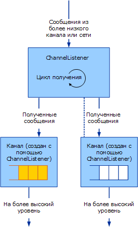

# <a name="service-channel-listeners-and-channels"></a>Служба: прослушиватели каналов и каналы
Есть три категории объектов каналов: каналы, прослушиватели каналов и фабрики каналов. Каналы - это интерфейс между приложением и стеком канала. Прослушиватели каналов отвечают за создание каналов на принимающей (ожидающей передачи данных) стороне, обычно в ответ на новое входящее сообщение или подключение. Фабрики каналов отвечают за создание каналов на передающей стороне для инициации связи с конечной точкой.  
  
## <a name="channel-listeners-and-channels"></a>Прослушиватели каналов и каналы  
 Прослушиватели каналов отвечают за создание каналов и прием сообщений с более низкого уровня или из сети. Принятые сообщения доставляются на уровень выше с помощью канала, созданного прослушивателем каналов.  
  
 Следующая схема показывает процесс приема сообщения и доставки его на уровень выше.  
  
   
Прослушиватель каналов принимает сообщения и доставляет их на уровень выше через каналы.  
  
 Процесс можно концептуально представить в виде очереди внутри каждого канала, хотя реализация может не использовать очередь. Прослушиватель канала отвечает за прием сообщений с более низкого уровня или из сети и добавление их в очередь. Канал отвечает за получение сообщений из очереди и передачу их на уровень выше, откуда приходит запрос на сообщение, например вызовом команды `Receive` для данного канала.  
  
 В [!INCLUDE[indigo2](../../../../includes/indigo2-md.md)] предусмотрены вспомогательные базовые классы для этого процесса. (Схема канала вспомогательных классов, описанных в этом разделе, см. [Общие сведения о модели каналов](../../../../docs/framework/wcf/extending/channel-model-overview.md).)  
  
-   <xref:System.ServiceModel.Channels.CommunicationObject> Класс реализует <xref:System.ServiceModel.ICommunicationObject> и вводит в действие конечного автомата, описанной на шаге 2 [разработка каналов](../../../../docs/framework/wcf/extending/developing-channels.md).  
  
-   <xref:System.ServiceModel.Channels.ChannelManagerBase> Класс реализует <xref:System.ServiceModel.Channels.CommunicationObject> и предоставляет единый базовый класс для <xref:System.ServiceModel.Channels.ChannelFactoryBase> и <xref:System.ServiceModel.Channels.ChannelListenerBase>. Класс <xref:System.ServiceModel.Channels.ChannelManagerBase> работает совместно с классом <xref:System.ServiceModel.Channels.ChannelBase> - базовым классом, реализующим интерфейс <xref:System.ServiceModel.Channels.IChannel>.  
  
-   ''<xref:System.ServiceModel.Channels.ChannelFactoryBase> Класс реализует <xref:System.ServiceModel.Channels.ChannelManagerBase> и <xref:System.ServiceModel.Channels.IChannelFactory> и объединяет `CreateChannel` в одну из перегруженных функций `OnCreateChannel` абстрактный метод.  
  
-   <xref:System.ServiceModel.Channels.ChannelListenerBase> Класс реализует <xref:System.ServiceModel.Channels.IChannelListener>. Он отвечает за базовое управление состоянием.  
  
 Следующее обсуждение создается на основе [транспорт: UDP](../../../../docs/framework/wcf/samples/transport-udp.md) образца.  
  
## <a name="creating-a-channel-listener"></a>Создание прослушивателя каналов  
 "Класс UdpChannelListener, образец реализует является производным от <xref:System.ServiceModel.Channels.ChannelListenerBase> класса. Он использует один UDP-сокет для приема датаграмм. Метод `OnOpen` принимает данные через UDP-сокет в асинхронном цикле. Затем данные преобразуются в сообщения с помощью системы кодирования:  
  
```  
message = UdpConstants.MessageEncoder.ReadMessage(  
  new ArraySegment<byte>(buffer, 0, count),   
  bufferManager  
);  
```  
  
 Поскольку один канал датаграмм представляет сообщения, приходящие из нескольких источников, `UdpChannelListener` - одноэлементный прослушиватель. В большинстве один активный <xref:System.ServiceModel.Channels.IChannel>'' связанный с данным прослушивателем одновременно. В образце создается новый экземпляр только в том случае, если канал, возвращенный методом <xref:System.ServiceModel.Channels.ChannelListenerBase%601.AcceptChannel%2A>, был впоследствии освобожден. Когда сообщение принято, оно ставится в очередь в этот одноэлементный канал.  
  
### <a name="udpinputchannel"></a>UdpInputChannel  
 `UdpInputChannel` Класс реализует <xref:System.ServiceModel.Channels.IInputChannel>. Он состоит из очереди входящих сообщений, которая заполняется сокетом прослушивателя `UdpChannelListener`. Эти сообщения будут извлечены <xref:System.ServiceModel.Channels.IInputChannel.Receive%2A> метод.
