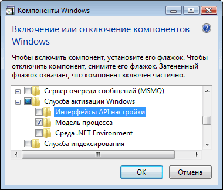
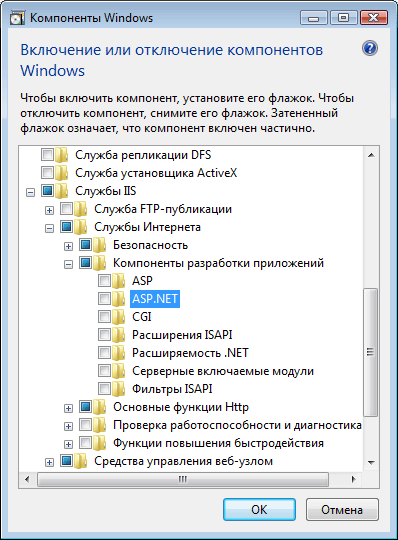
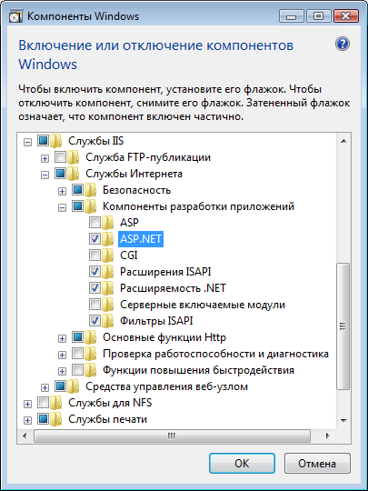
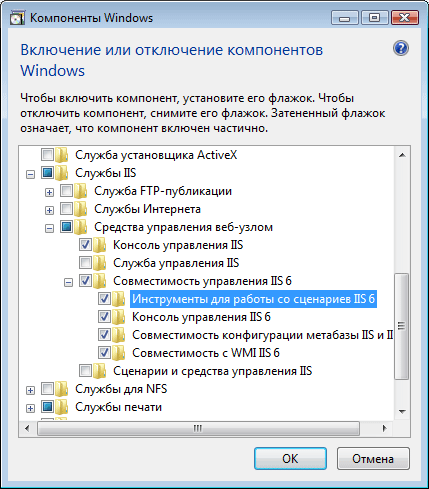

# <a name="configuring-internet-information-services-70-for-windows-communication-foundation"></a><span data-ttu-id="fec91-102">Настройка IIS 7.0 для Windows Communication Foundation</span><span class="sxs-lookup"><span data-stu-id="fec91-102">Configuring Internet Information Services 7.0 for Windows Communication Foundation</span></span>

<span data-ttu-id="fec91-103">Службы IIS 7.0 имеют модульную архитектуру, что позволяет выборочно устанавливать необходимые компоненты.</span><span class="sxs-lookup"><span data-stu-id="fec91-103">Internet Information Services (IIS) 7.0 has a modular design that allows you to selectively install components that are required.</span></span> <span data-ttu-id="fec91-104">Эта схема основана на новой технологии, управляемой манифестом, которая появилась в Windows Vista.</span><span class="sxs-lookup"><span data-stu-id="fec91-104">This design is based on the new manifest-driven componentization technology introduced in Windows Vista.</span></span> <span data-ttu-id="fec91-105">Существует более 40 отдельных компонентов служб IIS 7,0, которые могут быть установлены независимо.</span><span class="sxs-lookup"><span data-stu-id="fec91-105">There are more than 40 standalone feature components of IIS 7.0 that can be installed independently.</span></span> <span data-ttu-id="fec91-106">Это позволяет ИТ-специалистам легко настраивать службы в соответствии с конкретными требованиями.</span><span class="sxs-lookup"><span data-stu-id="fec91-106">This allows IT professionals to easily customize the installation as required.</span></span> <span data-ttu-id="fec91-107">В этом разделе описано, как настроить IIS 7,0 для использования с Windows Communication Foundation (WCF) и определить, какие компоненты требуются.</span><span class="sxs-lookup"><span data-stu-id="fec91-107">This topic discusses how to configure IIS 7.0 for use with Windows Communication Foundation (WCF) and determine which components are required.</span></span>

## <a name="minimal-installation-installing-was"></a><span data-ttu-id="fec91-108">Минимальная установка: установка службы WAS</span><span class="sxs-lookup"><span data-stu-id="fec91-108">Minimal Installation: Installing WAS</span></span>
 <span data-ttu-id="fec91-109">Минимальная установка всего пакета IIS 7,0 заключается в установке службы активации процессов Windows (WAS).</span><span class="sxs-lookup"><span data-stu-id="fec91-109">The minimal installation of the whole IIS 7.0 package is to install the Windows Process Activation Service (WAS).</span></span> <span data-ttu-id="fec91-110">WAS — это автономная функция, которая является единственной функцией IIS 7,0, доступной для всех операционных систем Windows Vista (Домашняя базовая, Домашняя расширенная, Business, максимальная и корпоративная).</span><span class="sxs-lookup"><span data-stu-id="fec91-110">WAS is a standalone feature and it is the only feature from the IIS 7.0 that is available for all Windows Vista operating systems (Home Basic, Home Premium, Business, and Ultimate and Enterprise).</span></span>

 <span data-ttu-id="fec91-111">На панели управления щелкните **программы** , а затем — **Включение или отключение компонентов Windows** , которые перечислены в разделе **программы и компоненты**, компонент WAS показан в списке, как показано на следующем рисунке.</span><span class="sxs-lookup"><span data-stu-id="fec91-111">From the Control Panel, click **Programs** and then click **Turn Windows features on or off** which is listed under **Programs and Features**, the WAS component is shown in the list as in the following illustration.</span></span>

 <span data-ttu-id="fec91-112"></span><span class="sxs-lookup"><span data-stu-id="fec91-112"></span></span>

 <span data-ttu-id="fec91-113">Этот компонент включает следующие подкомпоненты:</span><span class="sxs-lookup"><span data-stu-id="fec91-113">This feature has the following sub-components:</span></span>

- <span data-ttu-id="fec91-114">Среда .NET Environment</span><span class="sxs-lookup"><span data-stu-id="fec91-114">.NET Environment</span></span>

- <span data-ttu-id="fec91-115">API-интерфейсы конфигурации</span><span class="sxs-lookup"><span data-stu-id="fec91-115">Configuration APIs</span></span>

- <span data-ttu-id="fec91-116">модель процесса;</span><span class="sxs-lookup"><span data-stu-id="fec91-116">Process Model</span></span>

 <span data-ttu-id="fec91-117">Если выбран корневой узел WAS, по умолчанию проверяется только вложенный узел **модели процесса** .</span><span class="sxs-lookup"><span data-stu-id="fec91-117">If you select the root node of WAS, only the **Process Model** sub-node is checked by default.</span></span> <span data-ttu-id="fec91-118">Обратите внимание, что при такой установке устанавливается только служба WAS, поскольку поддержка веб-сервера отсутствует.</span><span class="sxs-lookup"><span data-stu-id="fec91-118">Please note that with this installation you are only installing WAS, because there is no support for a Web server.</span></span>

 <span data-ttu-id="fec91-119">Чтобы сделать WCF или любое приложение ASP.NET работать, установите флажок **среда .NET** .</span><span class="sxs-lookup"><span data-stu-id="fec91-119">To make WCF or any ASP.NET application work, check the **.NET Environment** checkbox.</span></span> <span data-ttu-id="fec91-120">Это означает, что все компоненты WAS необходимы для того, чтобы обеспечить хорошую работу WCF и ASP.NET.</span><span class="sxs-lookup"><span data-stu-id="fec91-120">This means that all of WAS components are required to make WCF and ASP.NET to work well.</span></span> <span data-ttu-id="fec91-121">Они автоматически выбираются при установке какого либо из этих компонентов.</span><span class="sxs-lookup"><span data-stu-id="fec91-121">These are automatically checked once you install any of those components.</span></span>

## <a name="iis-70-default-installation"></a><span data-ttu-id="fec91-122">Службы IIS 7.0: установка по умолчанию</span><span class="sxs-lookup"><span data-stu-id="fec91-122">IIS 7.0: Default Installation</span></span>
 <span data-ttu-id="fec91-123">После проверки функции **службы IIS** некоторые из подузлов автоматически проверяются, как показано на следующем рисунке.</span><span class="sxs-lookup"><span data-stu-id="fec91-123">By checking the **Internet Information Services** feature, some of the sub-nodes are automatically checked as shown in the following illustration.</span></span>

 <span data-ttu-id="fec91-124"></span><span class="sxs-lookup"><span data-stu-id="fec91-124"></span></span>

 <span data-ttu-id="fec91-125">Это установка IIS 7,0 по умолчанию.</span><span class="sxs-lookup"><span data-stu-id="fec91-125">This is the default installation of IIS 7.0.</span></span> <span data-ttu-id="fec91-126">С помощью этой установки можно использовать IIS 7,0 для обслуживания статического содержимого (например, HTML-страниц и другого содержимого).</span><span class="sxs-lookup"><span data-stu-id="fec91-126">With this installation, you can use IIS 7.0 to service static content (such as HTML pages and other content).</span></span> <span data-ttu-id="fec91-127">Однако вы не можете запускать приложения ASP.NET или CGI или размещать службы WCF.</span><span class="sxs-lookup"><span data-stu-id="fec91-127">However, you cannot run ASP.NET or CGI applications or host WCF services.</span></span>

## <a name="iis-70-installation-with-aspnet-support"></a><span data-ttu-id="fec91-128">IIS 7.0: установка с поддержкой ASP.NET</span><span class="sxs-lookup"><span data-stu-id="fec91-128">IIS 7.0: Installation with ASP.NET Support</span></span>
 <span data-ttu-id="fec91-129">Необходимо установить ASP.NET, чтобы сделать ASP.NET работу с IIS 7,0.</span><span class="sxs-lookup"><span data-stu-id="fec91-129">You must install ASP.NET to make ASP.NET work on IIS 7.0.</span></span> <span data-ttu-id="fec91-130">После проверки **ASP.NET**экран должен выглядеть, как показано на следующем рисунке.</span><span class="sxs-lookup"><span data-stu-id="fec91-130">After checking **ASP.NET**, your screen should look like the following illustration.</span></span>

 <span data-ttu-id="fec91-131"></span><span class="sxs-lookup"><span data-stu-id="fec91-131"></span></span>

 <span data-ttu-id="fec91-132">Это минимальная среда для приложений WCF и ASP.NET для работы в IIS 7,0.</span><span class="sxs-lookup"><span data-stu-id="fec91-132">This is the minimal environment for both WCF and ASP.NET applications to work in IIS 7.0.</span></span>

## <a name="iis-70-installation-with-iis-60-compatibility-components"></a><span data-ttu-id="fec91-133">IIS 7.0: установка с компонентами совместимости с IIS 6.0</span><span class="sxs-lookup"><span data-stu-id="fec91-133">IIS 7.0: Installation with IIS 6.0 Compatibility Components</span></span>
 <span data-ttu-id="fec91-134">При установке IIS 7,0 в системе с Visual Studio 2005 или некоторыми другими скриптами или инструментами автоматизации (например, Adsutil. vbs), которые настраивают виртуальные приложения, использующие API метабазы IIS 6,0, убедитесь, что вы проверите **средства создания скриптов**для служб IIS 6,0.</span><span class="sxs-lookup"><span data-stu-id="fec91-134">When installing IIS 7.0 on a system with Visual Studio 2005 or some other automation scripts or tools (such as Adsutil.vbs) that configure virtual applications that use IIS 6.0 Metabase API, ensure that you check the IIS 6.0 **Scripting Tools**.</span></span> <span data-ttu-id="fec91-135">Это автоматически проверяет другие подузлы **совместимости управления**IIS 6,0.</span><span class="sxs-lookup"><span data-stu-id="fec91-135">This automatically checks the other sub-nodes of IIS 6.0 **Management Compatibility**.</span></span> <span data-ttu-id="fec91-136">На следующем рисунке показан экран после выполнения этой задачи:</span><span class="sxs-lookup"><span data-stu-id="fec91-136">The following illustration shows the screen after this is done:</span></span>

 <span data-ttu-id="fec91-137"></span><span class="sxs-lookup"><span data-stu-id="fec91-137"></span></span>

 <span data-ttu-id="fec91-138">В этой установке все, что необходимо для использования функций и примеров IIS 7,0, ASP.NET и WCF, доступны в Интернете.</span><span class="sxs-lookup"><span data-stu-id="fec91-138">With this installation, you have everything required to use IIS 7.0, ASP.NET and WCF features and samples available on the Web.</span></span>

## <a name="request-limits"></a><span data-ttu-id="fec91-139">Пределы запроса</span><span class="sxs-lookup"><span data-stu-id="fec91-139">Request Limits</span></span>
 <span data-ttu-id="fec91-140">В Windows Vista с IIS 7 значение параметров `maxUri` и `maxQueryStringSize` изменилось по умолчанию.</span><span class="sxs-lookup"><span data-stu-id="fec91-140">On Windows Vista with IIS 7 the default value of the `maxUri` and `maxQueryStringSize` settings have been changed.</span></span> <span data-ttu-id="fec91-141">По умолчанию фильтрация запросов в IIS 7.0 допускает использование URL-адресов длиной 4096 знаков и строк запросов длиной 2048 знаков.</span><span class="sxs-lookup"><span data-stu-id="fec91-141">By default, request filtering in IIS 7.0 allows a URL length of 4096 characters and a query string length of 2048 characters.</span></span> <span data-ttu-id="fec91-142">Чтобы изменить эти значения по умолчанию, добавьте в файл App.config следующий XML-код.</span><span class="sxs-lookup"><span data-stu-id="fec91-142">To change these defaults add the following XML to your App.config file.</span></span>

```xml
 <system.webServer>
    <security>
        <requestFiltering>
            <requestLimits maxUrl="8192" maxQueryString="8192" />
        </requestFiltering>
    </security>
 </system.webServer>
 ```

## <a name="see-also"></a><span data-ttu-id="fec91-143">См. также:</span><span class="sxs-lookup"><span data-stu-id="fec91-143">See also</span></span>

- [<span data-ttu-id="fec91-144">Архитектура активации WAS</span><span class="sxs-lookup"><span data-stu-id="fec91-144">WAS Activation Architecture</span></span>](../../../../docs/framework/wcf/feature-details/was-activation-architecture.md)
- [<span data-ttu-id="fec91-145">Настройка WAS для использования с WCF</span><span class="sxs-lookup"><span data-stu-id="fec91-145">Configuring WAS for Use with WCF</span></span>](../../../../docs/framework/wcf/feature-details/configuring-the-wpa--service-for-use-with-wcf.md)
- [<span data-ttu-id="fec91-146">Практическое руководство. Установка и настройка компонентов активации WCF</span><span class="sxs-lookup"><span data-stu-id="fec91-146">How to: Install and Configure WCF Activation Components</span></span>](../../../../docs/framework/wcf/feature-details/how-to-install-and-configure-wcf-activation-components.md)
- [<span data-ttu-id="fec91-147">Функции размещения Windows Server App Fabric</span><span class="sxs-lookup"><span data-stu-id="fec91-147">Windows Server App Fabric Hosting Features</span></span>](https://go.microsoft.com/fwlink/?LinkId=201276)
