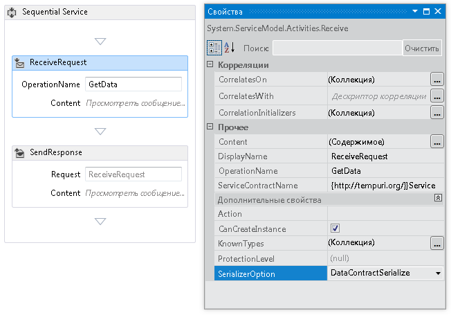
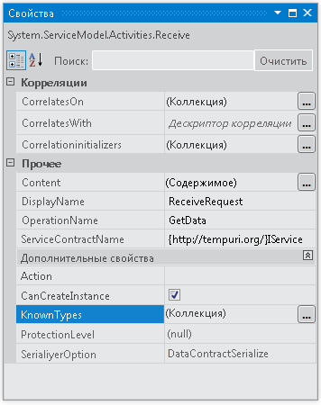
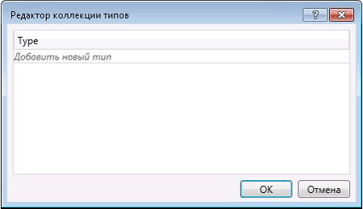

# <a name="configuring-serialization-in-a-workflow-service"></a><span data-ttu-id="8709f-102">Настройка сериализации в службе рабочего процесса</span><span class="sxs-lookup"><span data-stu-id="8709f-102">Configuring Serialization in a Workflow Service</span></span>
<span data-ttu-id="8709f-103">Службы рабочих процессов являются службами [!INCLUDE[indigo1](../../../../includes/indigo1-md.md)] и поэтому обладают возможностью использовать <xref:System.Runtime.Serialization.DataContractSerializer> (по умолчанию) или <xref:System.Xml.Serialization.XmlSerializer>.</span><span class="sxs-lookup"><span data-stu-id="8709f-103">Workflow services are [!INCLUDE[indigo1](../../../../includes/indigo1-md.md)] services and so have the option of using either the <xref:System.Runtime.Serialization.DataContractSerializer> (the default) or the <xref:System.Xml.Serialization.XmlSerializer>.</span></span> <span data-ttu-id="8709f-104">При написании кода служб, отличных от служб рабочих процессов, тип используемого сериализатора задается применительно к контракту службы или операции.</span><span class="sxs-lookup"><span data-stu-id="8709f-104">When writing non-workflow services the type of serializer to use is specified on the service or operation contract.</span></span> <span data-ttu-id="8709f-105">При создании служб Workflow Services [!INCLUDE[indigo2](../../../../includes/indigo2-md.md)] не надо указывать эти контракты в коде, вместо этого они формируются во время выполнения выводом контракта.</span><span class="sxs-lookup"><span data-stu-id="8709f-105">When creating [!INCLUDE[indigo2](../../../../includes/indigo2-md.md)] workflow services you don’t specify these contracts in code, but rather they are generated at runtime by contract inference.</span></span> [!INCLUDE[crabout](../../../../includes/crabout-md.md)]<span data-ttu-id="8709f-106">Определение контракта см. в разделе [использование контрактов в рабочем процессе](../../../../docs/framework/wcf/feature-details/using-contracts-in-workflow.md).</span><span class="sxs-lookup"><span data-stu-id="8709f-106"> contract inference, see  [Using Contracts in Workflow](../../../../docs/framework/wcf/feature-details/using-contracts-in-workflow.md).</span></span>  <span data-ttu-id="8709f-107">Сериализатор определяется с помощью свойства <xref:System.ServiceModel.Activities.Receive.SerializerOption%2A>.</span><span class="sxs-lookup"><span data-stu-id="8709f-107">The serializer is specified using the <xref:System.ServiceModel.Activities.Receive.SerializerOption%2A> property.</span></span> <span data-ttu-id="8709f-108">Оно задается в конструкторе, как показано на следующем рисунке.</span><span class="sxs-lookup"><span data-stu-id="8709f-108">This can be set in the designer as shown in the following illustration.</span></span>  
  
 <span data-ttu-id="8709f-109"></span><span class="sxs-lookup"><span data-stu-id="8709f-109"></span></span>  
  
 <span data-ttu-id="8709f-110">Сериализатор можно также задать в коде, как показано в следующем примере.</span><span class="sxs-lookup"><span data-stu-id="8709f-110">The serializer can also be set in code as shown in the following example,</span></span>  
  
```  
Receive approveExpense = new Receive  
            {  
                OperationName = "ApproveExpense",  
                CanCreateInstance = true,  
                ServiceContractName = "FinanceService",  
                SerializerOption = SerializerOption.DataContractSerializer,  
                Content = ReceiveContent.Create(new OutArgument<Expense>(expense))  
            };  
```  
  
 <span data-ttu-id="8709f-111">Для служб рабочего процесса можно также указать известные типы.</span><span class="sxs-lookup"><span data-stu-id="8709f-111">Known types can be specified on Workflow services as well.</span></span> [!INCLUDE[crabout](../../../../includes/crabout-md.md)]<span data-ttu-id="8709f-112">Известные типы в разделе [известные типы контрактов данных](../../../../docs/framework/wcf/feature-details/data-contract-known-types.md).</span><span class="sxs-lookup"><span data-stu-id="8709f-112"> Known Types see [Data Contract Known Types](../../../../docs/framework/wcf/feature-details/data-contract-known-types.md).</span></span> <span data-ttu-id="8709f-113">Известные типы можно указать в конструкторе или в коде.</span><span class="sxs-lookup"><span data-stu-id="8709f-113">Known types can be specified in the designer or in code.</span></span> <span data-ttu-id="8709f-114">Для указания известных типов в конструкторе нажмите кнопку с многоточием рядом со свойством KnownTypes в окне свойств для действия <xref:System.ServiceModel.Activities.Receive>, как показано на следующем рисунке.</span><span class="sxs-lookup"><span data-stu-id="8709f-114">To specify known types in the designer, click the ellipsis button next to the KnownTypes property in the properties window for a <xref:System.ServiceModel.Activities.Receive> activity as shown in the following illustration.</span></span>  
  
 <span data-ttu-id="8709f-115"></span><span class="sxs-lookup"><span data-stu-id="8709f-115"></span></span>  
  
 <span data-ttu-id="8709f-116">При этом отобразится редактор коллекции типов, который позволяет искать и указывать известные типы.</span><span class="sxs-lookup"><span data-stu-id="8709f-116">This will display the Type Collections Editor that will allow you to search for and specify known types.</span></span>  
  
 <span data-ttu-id="8709f-117"></span><span class="sxs-lookup"><span data-stu-id="8709f-117"></span></span>  
  
 <span data-ttu-id="8709f-118">Нажмите кнопку **добавить новый тип** ссылку и воспользуйтесь раскрывающимся списком для выбора или поиска типа, добавляемый в коллекцию известных типов.</span><span class="sxs-lookup"><span data-stu-id="8709f-118">Click the **Add new type** link and use the drop down to select or search for a type to add to the known types collection.</span></span> <span data-ttu-id="8709f-119">Для указания известных типов в коде используется свойство <xref:System.ServiceModel.Activities.Receive.KnownTypes%2A>, как показано в следующем примере:</span><span class="sxs-lookup"><span data-stu-id="8709f-119">To specify known types in code use the <xref:System.ServiceModel.Activities.Receive.KnownTypes%2A> property as shown in the following example.</span></span>  
  
```  
Receive approveExpense = new Receive  
            {  
                OperationName = "ApproveExpense",  
                CanCreateInstance = true,  
                ServiceContractName = "FinanceService",  
                SerializerOption = SerializerOption.DataContractSerializer,  
                Content = ReceiveContent.Create(new OutArgument<Expense>(expense))  
            };  
            approveExpense.KnownTypes.Add(typeof(Travel));  
            approveExpense.KnownTypes.Add(typeof(Meal));  
```  
  
 <span data-ttu-id="8709f-120">В полном примере кода показан способ настройки сериализации для службы рабочего процесса см. в разделе [форматирование сообщений в службах рабочих процессов](../../../../docs/framework/windows-workflow-foundation/samples/formatting-messages-in-workflow-services.md).</span><span class="sxs-lookup"><span data-stu-id="8709f-120">To see a complete code example showing how to configure serialization for a workflow service see [Formatting messages in Workflow Services](../../../../docs/framework/windows-workflow-foundation/samples/formatting-messages-in-workflow-services.md).</span></span>
