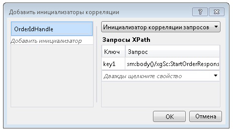

# Корреляция по содержимомуContent Based Correlation
Когда службы рабочего процесса обмениваются данными с клиентами и другими службами, в сообщениях часто встречаются данные, уникальным образом направляющие сообщение в определенный экземпляр.When workflow services communicate with clients and other services, often there is some data in the exchanged messages that uniquely relates a message to a particular instance. При корреляции на основе содержимого эти данные в сообщении, например номер заказчика или идентификатор заказа, используются для маршрутизации сообщения в определенный экземпляр рабочего процесса.Content-based correlation uses this data in the message, such as a customer number or order ID, to route messages to the proper workflow instance. В этом разделе описывается использование корреляции на основе содержимого в рабочих процессах.This topic explains how to use content-based correlation in workflows.  
  
## Использование корреляции на основе содержимогоUsing Content-Based Correlation  
 Корреляция на основе содержимого применяется, если служба рабочего процесса имеет несколько методов, доступных одному клиенту, и некоторые данные в сообщениях идентифицируют нужный экземпляр.Content-based correlation is used when a workflow service has multiple methods that are accessed by a single client and a piece of data in the exchanged messages identifies the desired instance.  
  
> [!NOTE]
>  Корреляция на основе содержимого полезна, если нельзя применить корреляцию на основе контекста, так как привязка не относится ни к одному поддерживаемому типу привязок для обмена контекстом.Content-based correlation is useful when context correlation cannot be used because the binding is not one of the supported context exchange bindings. Дополнительные сведения о корреляции контекста см. в разделе [обмен контекстом](../../../../docs/framework/wcf/feature-details/context-exchange-correlation.md).For more information about context correlation, see [Context Exchange](../../../../docs/framework/wcf/feature-details/context-exchange-correlation.md).  
  
 В каждом действии по обмену сообщениями при обмене данными должно быть указано расположение в сообщении данных, уникальным образом идентифицирующих экземпляр.Each messaging activity used in these communications must specify the location of the data in the message that uniquely identifies the instance. Это делается путем указания набора <xref:System.ServiceModel.MessageQuerySet> с помощью <xref:System.ServiceModel.Activities.QueryCorrelationInitializer> или <xref:System.ServiceModel.Activities.Receive.CorrelatesOn%2A>, выбирающих из сообщения данные, уникальным образом идентифицирующие экземпляр.This is done by providing a <xref:System.ServiceModel.MessageQuerySet>, using either a <xref:System.ServiceModel.Activities.QueryCorrelationInitializer> or <xref:System.ServiceModel.Activities.Receive.CorrelatesOn%2A>, that queries the message for the piece or pieces of data that uniquely identify the instance.  
  
> [!WARNING]
>  Данные, используемые для идентификации экземпляра, хэшируются в ключ корреляции.The data that is used to identify the instance is hashed into a correlation key. Необходимо убедиться, что данные, используемые для корреляции, являются уникальными. В противном случае в хэшированном ключе могут возникнуть конфликты, которые приведут к неправильной маршрутизации сообщения.Care must be taken to ensure that the data used for correlation is unique or else collisions in the hashed key could occur and cause messages to be misrouted. Например, корреляция на основе только имени заказчика может вызвать конфликт, так как могут иметься заказчики с одинаковыми именами.For example, a correlation based solely on a customer name may cause a collision because there may be multiple customers with the same name. Двоеточие (`:`) не должно встречаться в данных, используемых для корреляции сообщений, так как оно уже применяется в качестве разделителя ключа и значения в запросе к сообщению, формирующих строку, которая впоследствии хэшируется.The colon (`:`) should not be used as part of the data used to correlate the message because it is already used to delimit the message query’s key and value to form the string that is subsequently hashed.  
  
 В следующем примере первоначального <xref:System.ServiceModel.Activities.Receive> / <xref:System.ServiceModel.Activities.SendReply> в службе рабочего процесса возвращает `OrderId`, который затем передается обратно клиентом при вызове следующих <xref:System.ServiceModel.Activities.Receive> действия в службе рабочего процесса.In the following example, the initial <xref:System.ServiceModel.Activities.Receive>/<xref:System.ServiceModel.Activities.SendReply> in a workflow service returns an `OrderId`, which is then passed back by the client on the call to the following <xref:System.ServiceModel.Activities.Receive> activity in the workflow service.  
  
 [!code-csharp[CFX_ContentCorrelation#1](../../../../samples/snippets/csharp/VS_Snippets_CFX/cfx_contentcorrelation/cs/program.cs#1)]  
  
 В предыдущем примере показана корреляция на основе содержимого, инициализированная действием <xref:System.ServiceModel.Activities.SendReply>.The previous example shows a content-based correlation that is initialized by the <xref:System.ServiceModel.Activities.SendReply>. Набор <xref:System.ServiceModel.MessageQuerySet> указывает, что в качестве данных, применяемых для идентификации последующих сообщений для этой службы, используется `OrderId`.The <xref:System.ServiceModel.MessageQuerySet> specifies that the data used to identify subsequent messages to this service is the `OrderId`.  
  
 [!code-csharp[CFX_ContentCorrelation#2](../../../../samples/snippets/csharp/VS_Snippets_CFX/cfx_contentcorrelation/cs/program.cs#2)]  
  
 Действие <xref:System.ServiceModel.Activities.Receive>, следующее за действием <xref:System.ServiceModel.Activities.SendReply> в рабочем процессе, соответствует корреляции, инициализированной действием <xref:System.ServiceModel.Activities.SendReply>.The <xref:System.ServiceModel.Activities.Receive> activity that follows the <xref:System.ServiceModel.Activities.SendReply> in the workflow follows the correlation that was initialized by the <xref:System.ServiceModel.Activities.SendReply>. Оба действия используют один и тот же дескриптор <xref:System.ServiceModel.Activities.CorrelationHandle>, но для каждого из них используются отдельные <xref:System.ServiceModel.MessageQuerySet> и <xref:System.ServiceModel.XPathMessageQuery>, указывающие, где расположены идентифицирующие данные в определенном сообщении.Both activities share the same <xref:System.ServiceModel.Activities.CorrelationHandle>, but each one has its own <xref:System.ServiceModel.MessageQuerySet> and <xref:System.ServiceModel.XPathMessageQuery> that specifies where the identifying data is in that particular message. Для действия, инициализирующего корреляцию, <xref:System.ServiceModel.MessageQuerySet> указывается в свойстве <xref:System.ServiceModel.Activities.Receive.CorrelationInitializers%2A>, а для любого следующего действия <xref:System.ServiceModel.Activities.Receive> - в свойстве <xref:System.ServiceModel.Activities.Receive.CorrelatesOn%2A>.On the activity that initializes the correlation, this <xref:System.ServiceModel.MessageQuerySet> is specified in the <xref:System.ServiceModel.Activities.Receive.CorrelationInitializers%2A> property, and for any following <xref:System.ServiceModel.Activities.Receive> activities, it is specified using the <xref:System.ServiceModel.Activities.Receive.CorrelatesOn%2A> property.  
  
 [!code-csharp[CFX_ContentCorrelation#3](../../../../samples/snippets/csharp/VS_Snippets_CFX/cfx_contentcorrelation/cs/program.cs#3)]  
  
 Корреляция на основе содержимого может инициализироваться любым действием по обмену сообщениями (<xref:System.ServiceModel.Activities.Send>, <xref:System.ServiceModel.Activities.Receive>, <xref:System.ServiceModel.Activities.SendReply>, <xref:System.ServiceModel.Activities.ReceiveReply>), если данные передаются в составе сообщения.A content-based correlation can be initialized by any messaging activity (<xref:System.ServiceModel.Activities.Send>, <xref:System.ServiceModel.Activities.Receive>, <xref:System.ServiceModel.Activities.SendReply>, <xref:System.ServiceModel.Activities.ReceiveReply>) when the data flows as part of a message. Если определенные данные не являются частью сообщения, то корреляция может быть инициализирована явно с помощью действия <xref:System.ServiceModel.Activities.InitializeCorrelation>.If the particular piece of data does not flow as part of a message, then it can be initialized explicitly by using the <xref:System.ServiceModel.Activities.InitializeCorrelation> activity. Если для уникальной идентификации сообщения требуется несколько блоков данных, то в набор <xref:System.ServiceModel.MessageQuerySet> можно добавить несколько запросов.If multiple pieces of data are required to uniquely identify the message, then multiple queries can be added to the <xref:System.ServiceModel.MessageQuerySet>. В этих примерах <xref:System.ServiceModel.Activities.CorrelationHandle> был явно указан для каждого действия с помощью свойств `CorrelatesWith` или `CorrelationHandle`, но, если для всего рабочего процесса требуется только одна корреляция, как в примере с корреляцией на основе `OrderId`, достаточно неявного управления дескриптором взаимосвязи с помощью <xref:System.ServiceModel.Activities.WorkflowServiceHost>.In these examples, a <xref:System.ServiceModel.Activities.CorrelationHandle> was explicitly provided to each of the activities using the `CorrelatesWith` or `CorrelationHandle` properties, but if there is only one correlation required for the entire workflow, such as in this example where everything correlates on `OrderId`, the implicit correlation handle management provided by <xref:System.ServiceModel.Activities.WorkflowServiceHost> is sufficient.  
  
## Использование действия InitializeCorrelationUsing the InitializeCorrelation Activity  
 В предыдущем примере `OrderId` направлялся вызывающему объекту с помощью действия <xref:System.ServiceModel.Activities.SendReply>, которое служило для инициализации корреляции.In the previous example, the `OrderId` flowed to the caller through the <xref:System.ServiceModel.Activities.SendReply> activity and this is where the correlation was initialized. Это поведение может выполняться с помощью действия <xref:System.ServiceModel.Activities.InitializeCorrelation>.The same behavior can be accomplished by using the <xref:System.ServiceModel.Activities.InitializeCorrelation> activity. Действие <xref:System.ServiceModel.Activities.InitializeCorrelation> использует дескриптор <xref:System.ServiceModel.Activities.CorrelationHandle> и словарь элементов, представляющий данные для сопоставления сообщения с правильным экземпляром.The <xref:System.ServiceModel.Activities.InitializeCorrelation> activity takes the <xref:System.ServiceModel.Activities.CorrelationHandle> and a dictionary of items that represent the data used to map the message to the correct instance. Чтобы использовать действие <xref:System.ServiceModel.Activities.InitializeCorrelation>, описанное в предыдущем образце, удалите <xref:System.ServiceModel.Activities.SendReply.CorrelationInitializers%2A> из действия <xref:System.ServiceModel.Activities.SendReply> и инициализируйте корреляцию с помощью действия <xref:System.ServiceModel.Activities.InitializeCorrelation>.To use the <xref:System.ServiceModel.Activities.InitializeCorrelation> activity in the preceding sample, remove the <xref:System.ServiceModel.Activities.SendReply.CorrelationInitializers%2A> from the <xref:System.ServiceModel.Activities.SendReply> activity and initialize the correlation using the <xref:System.ServiceModel.Activities.InitializeCorrelation> activity.  
  
 [!code-csharp[CFX_ContentCorrelation#4](../../../../samples/snippets/csharp/VS_Snippets_CFX/cfx_contentcorrelation/cs/program.cs#4)]  
  
 Затем действие <xref:System.ServiceModel.Activities.InitializeCorrelation> используется в рабочем процессе, после того как заполняются переменные, содержащие данные, но перед действием <xref:System.ServiceModel.Activities.Receive>, связанным с инициализированным <xref:System.ServiceModel.Activities.CorrelationHandle>.The <xref:System.ServiceModel.Activities.InitializeCorrelation> activity is then used in the workflow, after the variables that hold the data are populated but before the <xref:System.ServiceModel.Activities.Receive> activity that correlates with the initialized <xref:System.ServiceModel.Activities.CorrelationHandle>.  
  
 [!code-csharp[CFX_ContentCorrelation#5](../../../../samples/snippets/csharp/VS_Snippets_CFX/cfx_contentcorrelation/cs/program.cs#5)]  
  
## Настройка запросов XPath с помощью конструктора рабочих процессовConfiguring XPath Queries Using the Workflow Designer  
 В предыдущих примерах действия и запросы XPath, используемые в запросах к сообщениям, были определены в коде.In the previous examples, the activities and the XPath queries used in the message queries were specified in code. Конструктор рабочих процессов в среде [!INCLUDE[vs_current_long](../../../../includes/vs-current-long-md.md)] также предоставляет возможность создавать выражения XPath из типов `DataContract` для корреляции на основе содержимого.The workflow designer in [!INCLUDE[vs_current_long](../../../../includes/vs-current-long-md.md)] also provides the ability to generate XPaths from `DataContract` types for content-based correlation. Первый запрос Xpath, настроенный в предыдущем примере, был настроен для действия <xref:System.ServiceModel.Activities.SendReply>.The first XPath configured in the previous example was configured for the <xref:System.ServiceModel.Activities.SendReply>.  
  
 [!code-csharp[CFX_ContentCorrelation#2](../../../../samples/snippets/csharp/VS_Snippets_CFX/cfx_contentcorrelation/cs/program.cs#2)]  
  
 Чтобы настроить выражение XPath для действия по обмену сообщениями в конструкторе рабочих процессов, выберите действие в конструкторе рабочих процессов.To configure the XPath for a messaging activity in the workflow designer, select the activity in the workflow designer. Если действие вызывает корреляцию, как в предыдущем примере, нажмите кнопку с многоточием для **CorrelationInitializers** свойство в **свойства** окна.If the activity is initializing the correlation, as in the previous example, click the ellipsis button for the **CorrelationInitializers** property in the **Properties** window. При этом отображаются **Добавление инициализаторов корреляции** диалоговое окно.This displays the **Add Correlation Initializers** dialog window. В этом диалоговом окне можно указать тип корреляции и выбрать содержимое, применяемое для корреляции.From this dialog you can specify the correlation type and select the content that is used for the correlation. <xref:System.ServiceModel.Activities.CorrelationHandle> Переменная, указанная в **добавить инициализатор** поле, а тип корреляции и данные, используемые для корреляции выбирается из **запросы XPath** раздел диалогового окна.The <xref:System.ServiceModel.Activities.CorrelationHandle> variable is specified in the **Add initializer** box, and the correlation type and data used for the correlation is selected from the **XPath Queries** section of the dialog box.  
  
   
  
 Второй запрос XPath в предыдущем примере был настроен в действии <xref:System.ServiceModel.Activities.Receive>.The second XPath query in the previous example was configured in the <xref:System.ServiceModel.Activities.Receive> activity.  
  
 [!code-csharp[CFX_ContentCorrelation#3](../../../../samples/snippets/csharp/VS_Snippets_CFX/cfx_contentcorrelation/cs/program.cs#3)]  
  
 Чтобы настроить запрос XPath для действия по обмену сообщениями, не инициализирующего корреляцию, выберите действие в конструкторе рабочих процессов и нажмите кнопку с многоточием для **CorrelatesOn** свойство в  **Свойства** окна.To configure the XPath query for a messaging activity that does not initialize the correlation, select the activity in the workflow designer and then click the ellipsis button for the **CorrelatesOn** property in the **Properties** window. При этом отображаются **корреляция по определению** диалоговое окно.This displays the **CorrelatesOn Definition** dialog window.  
  
   
  
 В этом диалоговом окне укажите <xref:System.ServiceModel.Activities.CorrelationHandle> и выбрать элементы в **запросы XPath** списка, чтобы создать запрос XPath.From this dialog you specify the <xref:System.ServiceModel.Activities.CorrelationHandle> and choose items in the **XPath Queries** list to build the XPath query.
