# <a name="creating-a-long-running-workflow-service"></a>Создание службы долго выполняющегося рабочего процесса
В данном разделе описывается, как создать службу длительных рабочих процессов. Службы длительных рабочих процессов могут работать в течение долгого времени. В определенные моменты рабочий процесс может переходить в состояние бездействия в ожидании дополнительных данных. В этом случае рабочий процесс сохраняется в базе данных SQL и удаляется из памяти. При поступлении дополнительных данных экземпляр рабочего процесса снова загружается в память и его выполнение продолжается.  В этом сценарии реализуется очень упрощенная система обработки заказов.  Клиент отправляет первоначальное сообщение службе рабочего процесса с указанием начать заказ. Служба возвращает клиенту идентификатор заказа. С этого момента в ожидании нового сообщения от клиента служба рабочего процесса переходит в состояние бездействия и сохраняется в базе данных SQL Server.  Когда клиент отправит следующее сообщение, чтобы заказать товар, служба рабочего процесса будет снова загружена в память, после чего она завершит обработку заказа. В приведенном образце кода служба возвращает строку, указывающую на то, что товар добавлен в заказ. Этот образец кода не предполагает реализацию такого приложения в реальности, скорее это простой образец, иллюстрирующий работу служб длительных рабочих процессов. Предполагается, что читатели этого раздела знают, как создавать проекты и решения [!INCLUDE[vs_current_long](../../../../includes/vs-current-long-md.md)].  
  
## <a name="prerequisites"></a>Предварительные требования  
 Чтобы воспользоваться этим пошаговым руководством, необходимо установить следующее программное обеспечение:  
  
1.  Microsoft SQL Server 2008  
  
2.  [!INCLUDE[vs_current_long](../../../../includes/vs-current-long-md.md)]  
  
3.  Microsoft [!INCLUDE[netfx_current_long](../../../../includes/netfx-current-long-md.md)]  
  
4.  Требуются знания служб WCF, среды [!INCLUDE[vs_current_long](../../../../includes/vs-current-long-md.md)] и навыки создания проектов и решений.  
  
### <a name="to-setup-the-sql-database"></a>Настройка базы данных SQL  
  
1.  Для сохранения экземпляров служб рабочих процессов требуется установленный Microsoft SQL Server, на котором необходимо настроить базу данных для хранения выгруженных из памяти экземпляров рабочих процессов. Запустите Microsoft SQL Management Studio, нажав **запустить** кнопку выбора **все программы**, **Microsoft SQL Server 2008**, и **Microsoft SQL Среда Management Studio**.  
  
2.  Нажмите кнопку **Connect** кнопку, чтобы войти в экземпляр SQL Server  
  
3.  Щелкните правой кнопкой мыши **баз данных** в древовидном представлении и выберите **новую базу данных...** Чтобы создать новую базу данных с именем `SQLPersistenceStore`.  
  
4.  Выполните в базе данных SQLPersistenceStore файл скрипта SqlWorkflowInstanceStoreSchema.sql, расположенный в каталоге C:\Windows\Microsoft.NET\Framework\v4.0\SQL\en, чтобы настроить требуемые схемы базы данных.  
  
5.  Выполните в базе данных SQLPersistenceStore файл скрипта SqlWorkflowInstanceStoreLogic.sql, расположенный в каталоге C:\Windows\Microsoft.NET\Framework\v4.0\SQL\en, чтобы настроить требуемую логику базы данных.  
  
### <a name="to-create-the-web-hosted-workflow-service"></a>Создание размещенной на веб-узле службы рабочего процесса  
  
1.  Создайте в среде [!INCLUDE[vs_current_long](../../../../includes/vs-current-long-md.md)] пустое решение и присвойте ему имя `OrderProcessing`.  
  
2.  Добавьте в него новый проект служебного приложения рабочего процесса WCF под названием `OrderService`.  
  
3.  В диалоговом окне свойств проекта выберите **Web** вкладки.  
  
    1.  В разделе **действие при запуске** выберите **определенную страницу** и укажите `Service1.xamlx`.  
  
         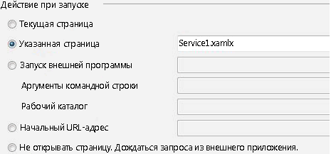  
  
    2.  В разделе **серверы** выберите **использовать локальный веб-сервер IIS**.  
  
         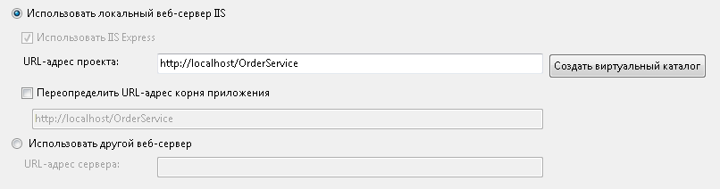  
  
        > [!WARNING]
        >  Чтобы установить этот параметр, необходимо запустить среду [!INCLUDE[vs_current_long](../../../../includes/vs-current-long-md.md)] в режиме администратора.  
  
         Эти шаги необходимы, чтобы настроить размещение проекта службы рабочего процесса в IIS.  
  
4.  Откройте `Service1.xamlx` если он не открыт и удалите существующие **ReceiveRequest** и **SendResponse** действия.  
  
5.  Выберите **последовательная служба** действие и нажмите кнопку **переменных** ссылку и добавьте переменные, показанные на следующем рисунке. Эти переменные будут в дальнейшем использоваться в службе рабочего процесса.  
  
    > [!NOTE]
    >  Если в раскрывающемся списке тип переменной отсутствует тип CorrelationHandle, выберите **поиск типов** из раскрывающегося списка. Введите CorrelationHandle в **имя типа** , выберите CorrelationHandle из списка и нажмите кнопку **ОК**.  
  
     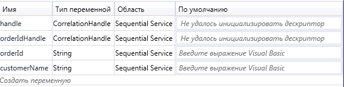  
  
6.  Перетаскивание **ReceiveAndSendReply** шаблон действия в **последовательная служба** действия. Этот набор действий будет получать сообщение от клиента и возвращать ему ответ.  
  
    1.  Выберите **Receive** и задайте свойства, отмеченные на следующем рисунке.  
  
           
  
         Свойство DisplayName задает имя, отображаемое для действия «Receive» в конструкторе. Свойства ServiceContractName и OperationName задают имя контракта службы и операции, которые реализуются действием Receive. Дополнительные сведения об использовании контрактов службы рабочего процесса в разделе [использование контрактов в рабочем процессе](../../../../docs/framework/wcf/feature-details/using-contracts-in-workflow.md).  
  
    2.  Нажмите кнопку **определить...**  ссылку в **ReceiveStartOrder** действия и задайте свойства, показанные на следующем рисунке.  Обратите внимание, что **параметры** переключателя, параметр с именем `p_customerName` привязан к `customerName` переменной. Это настраивает **Receive** действия на получение данных и привязку этих данных для локальных переменных.  
  
         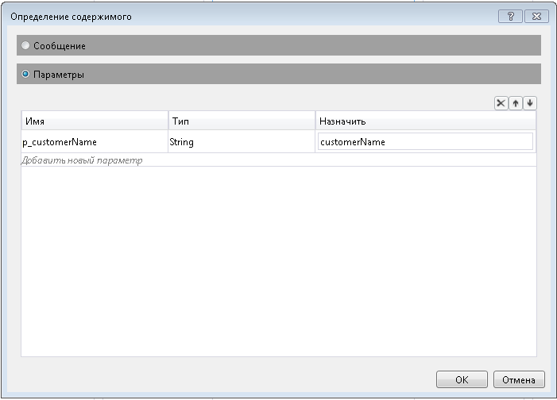  
  
    3.  Выберите **SendReplyToReceive** и задайте свойство, отмеченное на следующем рисунке.  
  
         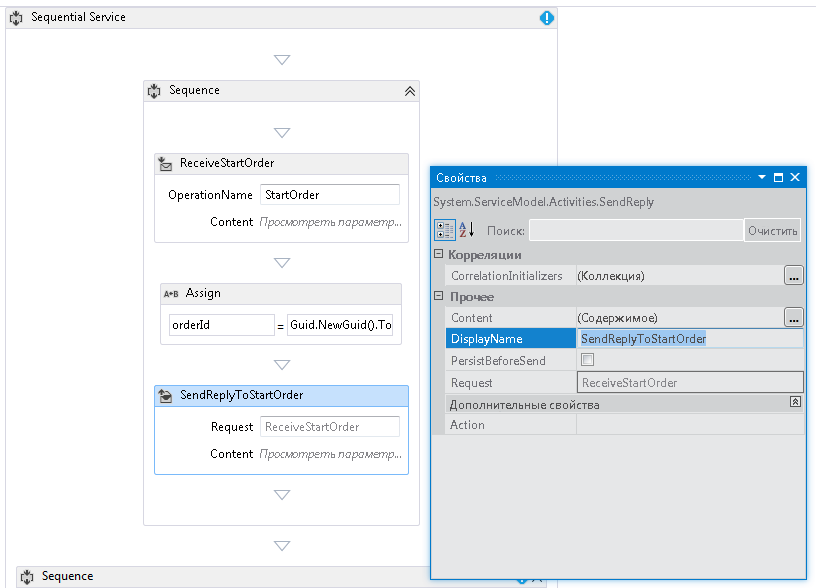  
  
    4.  Нажмите кнопку **определить...**  ссылку в **SendReplyToStartOrder** действия и задайте свойства, показанные на следующем рисунке. Обратите внимание, что **параметры** переключателя, а параметр `p_orderId` привязан к `orderId` переменной. Этот параметр указывает, что действие SendReplyToStartOrder возвратит вызывающему объекту значение типа String.  
  
         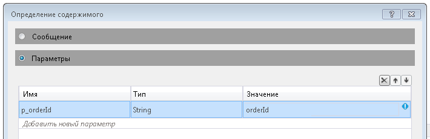  
  
    5.  Перетаскивание действия Assign между **Receive** и **SendReply** действия и задайте свойства, как показано на следующем рисунке:  
  
         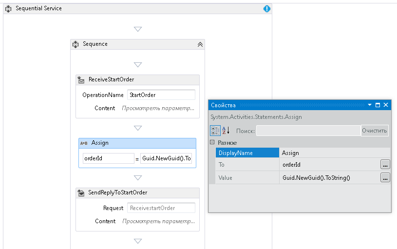  
  
         При этом будет создан новый идентификатор заказа, а его значение будет помещено в переменную orderId.  
  
    6.  Выберите **ReplyToStartOrder** действия. В окне свойств нажмите кнопку с многоточием для **CorrelationInitializers**. Выберите **добавить инициализатор** , введите `orderIdHandle` в текстовом поле инициализатор, выберите инициализатор корреляции запросов для типа Correlation, а в раскрывающемся списке «запросы XPATH» выберите p_orderId. Эти параметры показаны на следующем рисунке. Нажмите кнопку **ОК**.  При этом будет инициализирована новая корреляция между клиентом и этим экземпляром службы рабочего процесса. При получении сообщения с этим идентификатором заказа оно будет направлено этому экземпляру службы рабочего процесса.  
  
         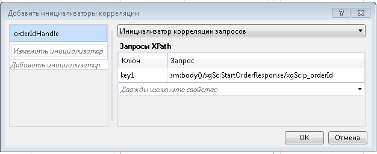  
  
7.  Перетаскивание другой **ReceiveAndSendReply** действие в конец рабочего процесса (за пределами **последовательности** содержащей первые **Receive** и  **SendReply** действий). Оно получит второе сообщение от клиента и ответит на него.  
  
    1.  Выберите **последовательности** , содержащий только что добавленном **Receive** и **SendReply** действия и нажмите кнопку **переменных** кнопки. Добавьте переменную, отмеченную на следующем рисунке.  
  
         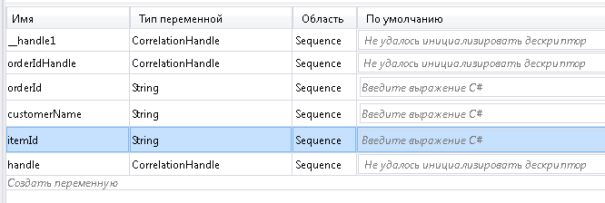  
  
    2.  Выберите **Receive** действия и задайте свойства, показанные на следующем рисунке:  
  
         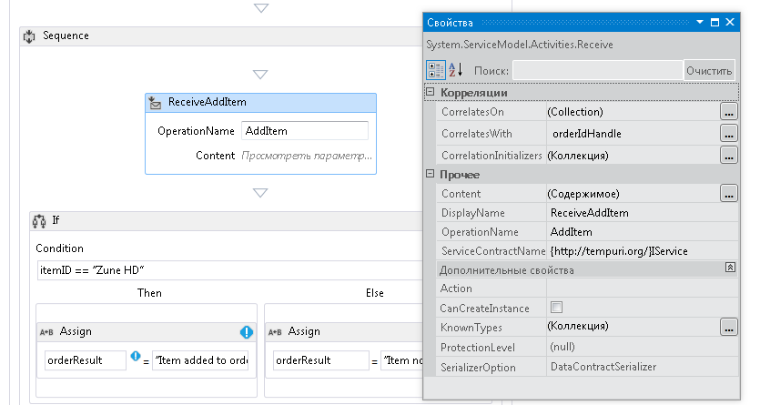  
  
    3.  Нажмите кнопку **определить...**  ссылку в **ReceiveAddItem** действия и добавьте параметры, показанные на следующем рисунке: Это настраивает действия receive и принимать два параметра, идентификатор заказа и идентификатора заказываемого товара.  
  
         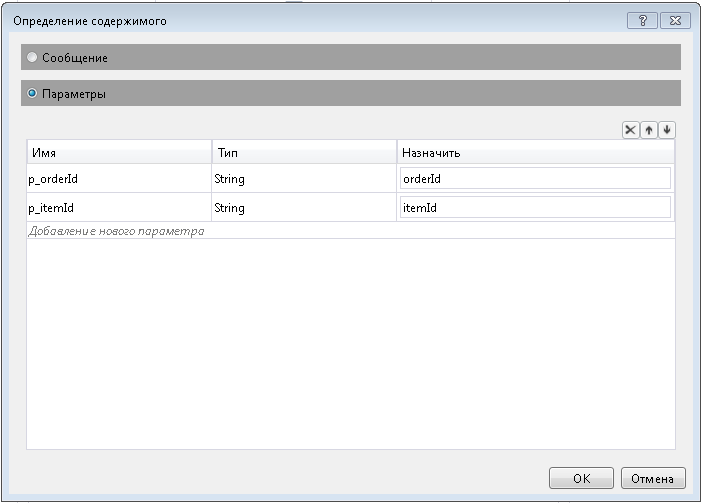  
  
    4.  Нажмите кнопку **CorrelateOn** кнопку с многоточием и ввести `orderIdHandle`. В разделе **запросы XPath**, щелкните стрелку раскрывающегося списка и выберите `p_orderId`. При этом будет настроена корреляция второго действия Receive. Дополнительные сведения о корреляции в разделе [корреляции](../../../../docs/framework/wcf/feature-details/correlation.md).  
  
         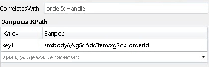  
  
    5.  Перетаскивание **Если** действие сразу же после **ReceiveAddItem** действия. Это действие работает аналогично инструкции IF.  
  
        1.  Задать **условие** свойства `itemId=="Zune HD" (itemId="Zune HD" for Visual Basic)`  
  
        2.  Перетаскивание **назначить** действие в **затем** раздела, а второе-в **Else** разделе Задание свойств **назначить** действия, как показано на следующем рисунке.  
  
               
  
             Если условие равно `true` **затем** будет выполнен раздел. Если условие равно `false` **Else** выполняется раздел.  
  
        3.  Выберите **SendReplyToReceive** и задайте **DisplayName** свойства, показанные на следующем рисунке.  
  
             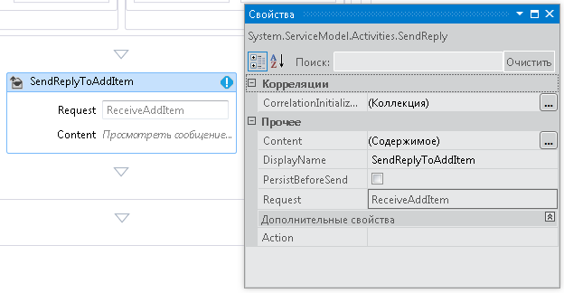  
  
        4.  Нажмите кнопку **определить...**  ссылку в **SetReplyToAddItem** действия и настройте его так, как показано на следующем рисунке. Это настраивает **SendReplyToAddItem** действие будет возвращать значение в `orderResult` переменной.  
  
               
  
8.  Откройте файл web.config и добавьте следующие элементы в \<поведение > раздел, чтобы включить сохранение рабочего процесса.  
  
    ```xml  
    <sqlWorkflowInstanceStore connectionString="Data Source=your-machine\SQLExpress;Initial Catalog=SQLPersistenceStore;Integrated Security=True;Asynchronous Processing=True" instanceEncodingOption="None" instanceCompletionAction="DeleteAll" instanceLockedExceptionAction="BasicRetry" hostLockRenewalPeriod="00:00:30" runnableInstancesDetectionPeriod="00:00:02" />  
              <workflowIdle timeToUnload="0"/>  
    ```  
  
    > [!WARNING]
    >  В приведенном выше фрагменте кода необходимо заменить имя узла и экземпляра SQL Server.  
  
9. Постройте решение.  
  
### <a name="to-create-a-client-application-to-call-the-workflow-service"></a>Создание клиентского приложения, вызывающего службу рабочего процесса  
  
1.  Добавьте в решение новый проект консольного приложения с именем `OrderClient`.  
  
2.  Добавьте в проект `OrderClient` ссылки на следующие сборки:  
  
    1.  System.ServiceModel.dll  
  
    2.  System.ServiceModel.Activities.dll  
  
3.  Добавьте ссылку на службу рабочего процесса и укажите `OrderService` в качестве пространства имен.  
  
4.  В метод `Main()` клиентского проекта добавьте следующий код:  
  
    ```  
    static void Main(string[] args)  
    {  
       // Send initial message to start the workflow service  
       Console.WriteLine("Sending start message");  
       StartOrderClient startProxy = new StartOrderClient();  
       string orderId = startProxy.StartOrder("Kim Abercrombie");  
  
       // The workflow service is now waiting for the second message to be sent  
       Console.WriteLine("Workflow service is idle...");  
       Console.WriteLine("Press [ENTER] to send an add item message to reactivate the workflow service...");  
       Console.ReadLine();  
  
       // Send the second message  
       Console.WriteLine("Sending add item message");  
       AddItemClient addProxy = new AddItemClient();  
       AddItem item = new AddItem();  
       item.p_itemId = "Zune HD";  
       item.p_orderId = orderId;  
  
       string orderResult = addProxy.AddItem(item);  
       Console.WriteLine("Service returned: " + orderResult);  
    }  
    ```  
  
5.  Выполните построение решения и запустите приложение `OrderClient`. Клиент выведет на экран следующий текст.  
  
    ```Output  
    Sending start messageWorkflow service is idle...Press [ENTER] to send an add item message to reactivate the workflow service...  
    ```  
  
6.  Чтобы проверить, сохранен в рабочем процессе, запустите SQL Server Management Studio последовательно выбрав пункты **запустить** меню, при выборе **все программы**, **Microsoft SQL Server 2008**, **SQL Server Management Studio**.  
  
    1.  На левой панели разверните узел, **баз данных**, **SQLPersistenceStore**, **представления** и щелкните правой кнопкой мыши **System.Activities.DurableInstancing.Instances**  и выберите **выделить 1000 верхних строк**. В **результатов** панели убедитесь, вы видите в списке хотя бы один экземпляр. Если во время работы возникнет исключение, в этой области могут быть указаны и другие экземпляры, оставшиеся от прошлых запусков. Удалить существующие строки, щелкните правой кнопкой мыши **System.Activities.DurableInstancing.Instances** и выбрав **изменить 200 верхних строк**, нажмите клавишу **Execute** кнопки выбрать все строки в области результатов и **удалить**.  Чтобы проверить, что в базе данных отображается экземпляр, созданный учебным приложением, перед запуском клиента удалите все записи из представления экземпляров. После запуска клиента выполните этот запрос («Выделить 1000 верхних строк») еще раз и удостоверьтесь, что новый экземпляр добавлен.  
  
7.  Нажмите клавишу ВВОД, чтобы отправить сообщение о добавлении товара службе рабочего процесса. Клиент выведет на экран следующий текст.  
  
    ```Output  
    Sending add item messageService returned: Item added to orderPress any key to continue . . .  
    ```  
  
## <a name="see-also"></a>См. также  
 [Службы рабочих процессов](../../../../docs/framework/wcf/feature-details/workflow-services.md)
