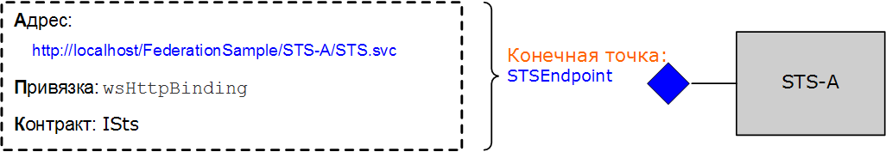

# <a name="federation"></a><span data-ttu-id="322c2-102">Федерация</span><span class="sxs-lookup"><span data-stu-id="322c2-102">Federation</span></span>
<span data-ttu-id="322c2-103">В этом разделе приведен краткий обзор концепции федеративной безопасности.</span><span class="sxs-lookup"><span data-stu-id="322c2-103">This topic provides a brief overview of the concept of federated security.</span></span> <span data-ttu-id="322c2-104">В нем также описывается поддержка Windows Communication Foundation (WCF) для развертывания федеративных архитектур безопасности.</span><span class="sxs-lookup"><span data-stu-id="322c2-104">It also describes Windows Communication Foundation (WCF) support for deploying federated security architectures.</span></span> <span data-ttu-id="322c2-105">Для примера приложения, демонстрируя [Federation Sample](../../../../docs/framework/wcf/samples/federation-sample.md)федерацию, см.</span><span class="sxs-lookup"><span data-stu-id="322c2-105">For a sample application that demonstrates federation, see [Federation Sample](../../../../docs/framework/wcf/samples/federation-sample.md).</span></span>  
  
## <a name="definition-of-federated-security"></a><span data-ttu-id="322c2-106">Определение федеративной безопасности</span><span class="sxs-lookup"><span data-stu-id="322c2-106">Definition of Federated Security</span></span>  
 <span data-ttu-id="322c2-107">Федеративная безопасность обеспечивает четкое разделение между службой, к которой обращается клиент, и связанными процедурами проверки подлинности и авторизации.</span><span class="sxs-lookup"><span data-stu-id="322c2-107">Federated security allows for clean separation between the service a client is accessing and the associated authentication and authorization procedures.</span></span> <span data-ttu-id="322c2-108">Федеративная безопасность также делает возможной совместную работу групп из нескольких систем, сетей и организаций, принадлежащих к различным областям доверия.</span><span class="sxs-lookup"><span data-stu-id="322c2-108">Federated security also enables collaboration across multiple systems, networks, and organizations in different trust realms.</span></span>  
  
 <span data-ttu-id="322c2-109">WCF оказывает поддержку в создании и развертывании распределенных систем, использующих федеративную безопасность.</span><span class="sxs-lookup"><span data-stu-id="322c2-109">WCF provides support for building and deploying distributed systems that employ federated security.</span></span>  
  
### <a name="elements-of-a-federated-security-architecture"></a><span data-ttu-id="322c2-110">Элементы архитектуры федеративной безопасности</span><span class="sxs-lookup"><span data-stu-id="322c2-110">Elements of a Federated Security Architecture</span></span>  
 <span data-ttu-id="322c2-111">Архитектура федеративной безопасности включает три основных элемента, рассмотренных в следующей таблице.</span><span class="sxs-lookup"><span data-stu-id="322c2-111">The federated security architecture has three key elements, as described in the following table.</span></span>  
  
|<span data-ttu-id="322c2-112">Элемент</span><span class="sxs-lookup"><span data-stu-id="322c2-112">Element</span></span>|<span data-ttu-id="322c2-113">Описание</span><span class="sxs-lookup"><span data-stu-id="322c2-113">Description</span></span>|  
|-------------|-----------------|  
|<span data-ttu-id="322c2-114">Домен/область</span><span class="sxs-lookup"><span data-stu-id="322c2-114">Domain/realm</span></span>|<span data-ttu-id="322c2-115">Единица администрирования безопасности или доверия.</span><span class="sxs-lookup"><span data-stu-id="322c2-115">A single unit of security administration or trust.</span></span> <span data-ttu-id="322c2-116">Типичный домен может включать одну организацию.</span><span class="sxs-lookup"><span data-stu-id="322c2-116">A typical domain might include a single organization.</span></span>|  
|<span data-ttu-id="322c2-117">Федерация</span><span class="sxs-lookup"><span data-stu-id="322c2-117">Federation</span></span>|<span data-ttu-id="322c2-118">Совокупность доменов, между которыми установлено отношение доверия.</span><span class="sxs-lookup"><span data-stu-id="322c2-118">A collection of domains that have established trust.</span></span> <span data-ttu-id="322c2-119">Уровень доверия может отличаться, но обычно предусматривает проверку подлинности и почти всегда — авторизацию.</span><span class="sxs-lookup"><span data-stu-id="322c2-119">The level of trust may vary, but typically includes authentication and almost always includes authorization.</span></span> <span data-ttu-id="322c2-120">Типичная федерация может включать ряд организаций, для которых установлено отношение доверия для общего доступа к набору ресурсов.</span><span class="sxs-lookup"><span data-stu-id="322c2-120">A typical federation might include a number of organizations that have established trust for shared access to a set of resources.</span></span>|  
|<span data-ttu-id="322c2-121">Служба маркеров безопасности (STS)</span><span class="sxs-lookup"><span data-stu-id="322c2-121">Security Token Service (STS)</span></span>|<span data-ttu-id="322c2-122">Веб-служба, выдающая маркеры безопасности, т. е. делающая утверждения на основании свидетельств, которым она доверяет, перед теми, кто доверяет ей.</span><span class="sxs-lookup"><span data-stu-id="322c2-122">A Web service that issues security tokens; that is, it makes assertions based on evidence that it trusts, to whomever trusts it.</span></span> <span data-ttu-id="322c2-123">Эти утверждения образуют основу посредничества с доверием между доменами.</span><span class="sxs-lookup"><span data-stu-id="322c2-123">This forms the basis of trust brokering between domains.</span></span>|  
  
### <a name="example-scenario"></a><span data-ttu-id="322c2-124">Пример сценария</span><span class="sxs-lookup"><span data-stu-id="322c2-124">Example Scenario</span></span>  
 <span data-ttu-id="322c2-125">На следующей иллюстрации показан пример федеративной безопасности:</span><span class="sxs-lookup"><span data-stu-id="322c2-125">The following illustration shows an example of federated security:</span></span>  
  
   
  
 <span data-ttu-id="322c2-127">В сценарии участвует две организации: A и B. Организация B имеет веб-ресурс (веб-службу), которую некоторые пользователи в организации A находят полезной.</span><span class="sxs-lookup"><span data-stu-id="322c2-127">This scenario includes two organizations: A and B. Organization B has a Web resource (a Web service) that some users in organization A find valuable.</span></span>  
  
> [!NOTE]
> <span data-ttu-id="322c2-128">В этом разделе используются *термины ресурс,* *служба*и *веб-служба* взаимозаменяемы.</span><span class="sxs-lookup"><span data-stu-id="322c2-128">This section uses the terms *resource*, *service*, and *Web service* interchangeably.</span></span>  
  
 <span data-ttu-id="322c2-129">Как правило, организация B требует, чтобы пользователь из организации A предоставил какое-либо допустимое доказательство своей подлинности, прежде чем обращаться к службе.</span><span class="sxs-lookup"><span data-stu-id="322c2-129">Typically, organization B requires that a user from organization A provide some valid form of authentication before accessing the service.</span></span> <span data-ttu-id="322c2-130">Кроме того, организация может также потребовать, чтобы пользователь был авторизован для доступа к данному ресурсу.</span><span class="sxs-lookup"><span data-stu-id="322c2-130">In addition, the organization may also require that the user be authorized to access the specific resource in question.</span></span> <span data-ttu-id="322c2-131">Один из способов решить эту проблему и дать пользователям в организации A возможность доступа к ресурсу в организации B заключается в следующем.</span><span class="sxs-lookup"><span data-stu-id="322c2-131">One way to address this problem and enable users in organization A to access the resource in organization B is as follows:</span></span>  
  
- <span data-ttu-id="322c2-132">Пользователи из организации A регистрируют свои учетные данные (имя пользователя и пароль) в организации B.</span><span class="sxs-lookup"><span data-stu-id="322c2-132">Users from organization A register their credentials (a user name and password) with organization B.</span></span>  
  
- <span data-ttu-id="322c2-133">При обращении к ресурсу пользователи из организации A предъявляют свои учетные данные организации B, т. е. подлинность пользователей проверяется, прежде чем они получают доступ к ресурсу.</span><span class="sxs-lookup"><span data-stu-id="322c2-133">During the resource access, users from organization A present their credentials to organization B and are authenticated before accessing the resource.</span></span>  
  
 <span data-ttu-id="322c2-134">Это подход имеет три существенных недостатка.</span><span class="sxs-lookup"><span data-stu-id="322c2-134">This approach has three significant drawbacks:</span></span>  
  
- <span data-ttu-id="322c2-135">Организации B приходится управлять учетными данными пользователей из организации A, помимо управления учетными данными своих локальных пользователей.</span><span class="sxs-lookup"><span data-stu-id="322c2-135">Organization B has to manage the credentials for users from organization A in addition to managing the credentials of its local users.</span></span>  
  
- <span data-ttu-id="322c2-136">Пользователям в организации A приходится иметь дополнительный набор учетных данных (т. е. помнить дополнительные имя пользователя и пароль) помимо учетных данных, которыми они пользуются для получения доступа к ресурсам в пределах организации A. В таких случаях пользователи часто используют одни и те же имя пользователя и пароль для доступа к нескольким сайтам служб, что ослабляет защиту.</span><span class="sxs-lookup"><span data-stu-id="322c2-136">Users in organization A need to maintain an additional set of credentials (that is, remember an additional user name and password) apart from the credentials they normally use to gain access to resources within organization A. This usually encourages the practice of using the same user name and password at multiple service sites, which is a weak security measure.</span></span>  
  
- <span data-ttu-id="322c2-137">Архитектура не масштабируется, если другие организации посчитают ресурс в организации B полезным для своих пользователей.</span><span class="sxs-lookup"><span data-stu-id="322c2-137">The architecture does not scale as more organizations perceive the resource at organization B as being of some value.</span></span>  
  
 <span data-ttu-id="322c2-138">Альтернативный подход, лишенный упомянутых выше недостатков - это использование федеративной безопасности.</span><span class="sxs-lookup"><span data-stu-id="322c2-138">An alternative approach, which addresses the previously mentioned drawbacks, is to employ federated security.</span></span> <span data-ttu-id="322c2-139">В соответствии с этим подходом организации A и B устанавливают отношения доверия и используют службу маркеров безопасности (Security Token Service, STS) как посредника для установленного доверия.</span><span class="sxs-lookup"><span data-stu-id="322c2-139">In this approach, organizations A and B establish a trust relationship and employ Security Token Service (STS) to enable brokering of the established trust.</span></span>  
  
 <span data-ttu-id="322c2-140">В архитектуре федеративной безопасности пользователи из организации A знают, что если им требуется обратиться к веб-службе в организации B, они должны предъявить в организации B допустимый маркер безопасности от службы STS, который используется для проверки их подлинности и авторизации их доступа к определенной службе.</span><span class="sxs-lookup"><span data-stu-id="322c2-140">In a federated security architecture, users from organization A know that if they want to access the Web service in organization B that they must present a valid security token from the STS at organization B, which authenticates and authorizes their access to the specific service.</span></span>  
  
 <span data-ttu-id="322c2-141">При обращении к службе STS B пользователи приобретают еще один уровень косвенного обращения от политики, связанной со службой STS.</span><span class="sxs-lookup"><span data-stu-id="322c2-141">On contacting the STS B, the users receive another level of indirection from the policy associated with the STS.</span></span> <span data-ttu-id="322c2-142">Прежде чем служба STS B сможет выдать им маркер безопасности, они должны предъявить допустимый маркер безопасности от службы STS A (т. е. из области доверия клиента).</span><span class="sxs-lookup"><span data-stu-id="322c2-142">They must present a valid security token from the STS A (that is, the client trust realm) before the STS B can issue them a security token.</span></span> <span data-ttu-id="322c2-143">Это логическое следствие из отношения доверия, установленного между двумя организациями, подразумевающее, что организации B не требуется управлять удостоверениями пользователей из организации A. На практике служба STS B обычно имеет пустые адреса `issuerAddress` и `issuerMetadataAddress`.</span><span class="sxs-lookup"><span data-stu-id="322c2-143">This is a corollary of the trust relationship established between the two organizations and implies that organization B does not have to manage identities for users from organization A. In practice, STS B typically has a null `issuerAddress` and `issuerMetadataAddress`.</span></span> <span data-ttu-id="322c2-144">Для получения дополнительной информации [см.](../../../../docs/framework/wcf/feature-details/how-to-configure-a-local-issuer.md)</span><span class="sxs-lookup"><span data-stu-id="322c2-144">For more information, see [How to: Configure a Local Issuer](../../../../docs/framework/wcf/feature-details/how-to-configure-a-local-issuer.md).</span></span> <span data-ttu-id="322c2-145">В этом случае клиент консультируется с локальной политикой, чтобы найти STS A. Эта конфигурация называется *домашней федерацией области,* и она масштабируется лучше, потому что STS B не обязана поддерживать информацию о STS A.</span><span class="sxs-lookup"><span data-stu-id="322c2-145">In that case, the client consults a local policy to locate STS A. This configuration is called *home realm federation* and it scales better because STS B does not have to maintain information about STS A.</span></span>  
  
 <span data-ttu-id="322c2-146">Затем пользователи связываются со службой STS в организации A и получают маркер безопасности, предъявляя для проверки подлинности учетные данные, которыми они обычно пользуются для доступа к любому другому ресурсу в пределах организации A. Это также решает проблему пользователей, которым приходится либо помнить несколько наборов учетных данных, либо использовать один и тот же набор учетных данных на нескольких сайтах служб.</span><span class="sxs-lookup"><span data-stu-id="322c2-146">The users then contact the STS at organization A and obtain a security token by presenting authentication credentials that they normally use to gain access to any other resource within organization A. This also alleviates the problem of users having to maintain multiple sets of credentials or using the same set of credentials at multiple service sites.</span></span>  
  
 <span data-ttu-id="322c2-147">Получив маркер безопасности от службы STS A, пользователи предъявляют маркер службе STS B. Далее организация B авторизует запросы пользователей и выдает пользователям маркер безопасности из собственного набора маркеров безопасности.</span><span class="sxs-lookup"><span data-stu-id="322c2-147">Once the users obtain a security token from the STS A, they present the token to the STS B. Organization B proceeds to perform authorization of the users' requests and issues a security token to the users from its own set of security tokens.</span></span> <span data-ttu-id="322c2-148">Пользователи затем могут предъявить свой маркер ресурсу в организации B и получить доступ к службе.</span><span class="sxs-lookup"><span data-stu-id="322c2-148">The users can then present their token to the resource at organization B and access the service.</span></span>  
  
## <a name="support-for-federated-security-in-wcf"></a><span data-ttu-id="322c2-149">Поддержка федеративной безопасности в WCF</span><span class="sxs-lookup"><span data-stu-id="322c2-149">Support for Federated Security in WCF</span></span>  
 <span data-ttu-id="322c2-150">WCF обеспечивает поддержку под ключ для развертывания федеративной архитектуры безопасности через [ \<wsFederationHttpBinding>. ](../../../../docs/framework/configure-apps/file-schema/wcf/wsfederationhttpbinding.md)</span><span class="sxs-lookup"><span data-stu-id="322c2-150">WCF provides turnkey support for deploying federated security architectures through the [\<wsFederationHttpBinding>](../../../../docs/framework/configure-apps/file-schema/wcf/wsfederationhttpbinding.md).</span></span>  
  
 <span data-ttu-id="322c2-151">Элемент [ \<wsFederationHttpBinding>](../../../../docs/framework/configure-apps/file-schema/wcf/wsfederationhttpbinding.md) обеспечивает безопасную, надежную, совместимую привязку, которая влечет за собой использование HTTP в качестве базового транспортного механизма для стиля связи запроса-ответа, используя текст и XML в качестве формата кодирования проводов.</span><span class="sxs-lookup"><span data-stu-id="322c2-151">The [\<wsFederationHttpBinding>](../../../../docs/framework/configure-apps/file-schema/wcf/wsfederationhttpbinding.md) element provides for a secure, reliable, interoperable binding that entails the use of HTTP as the underlying transport mechanism for request-reply communication style, employing text and XML as the wire format for encoding.</span></span>  
  
 <span data-ttu-id="322c2-152">Использование [ \<wsFederationHttpBinding>](../../../../docs/framework/configure-apps/file-schema/wcf/wsfederationhttpbinding.md) в сценарии federated безопасности может быть разделено на две логически независимых фазы, как описано в следующих разделах.</span><span class="sxs-lookup"><span data-stu-id="322c2-152">The use of [\<wsFederationHttpBinding>](../../../../docs/framework/configure-apps/file-schema/wcf/wsfederationhttpbinding.md) in a federated security scenario can be decoupled into two logically independent phases, as described in the following sections.</span></span>  
  
### <a name="phase-1-design-phase"></a><span data-ttu-id="322c2-153">Фаза 1: фаза проектирования</span><span class="sxs-lookup"><span data-stu-id="322c2-153">Phase 1: Design Phase</span></span>  
 <span data-ttu-id="322c2-154">На этапе проектирования клиент использует [инструмент ServiceModel Metadata Utility Tool (Svcutil.exe)](../../../../docs/framework/wcf/servicemodel-metadata-utility-tool-svcutil-exe.md) для чтения политики, которая предоставляется в конечном поле службы, и для сбора требований к аутентификации и авторизации службы.</span><span class="sxs-lookup"><span data-stu-id="322c2-154">During the design phase, the client uses the [ServiceModel Metadata Utility Tool (Svcutil.exe)](../../../../docs/framework/wcf/servicemodel-metadata-utility-tool-svcutil-exe.md) to read the policy the service endpoint exposes and to collect the service's authentication and authorization requirements.</span></span> <span data-ttu-id="322c2-155">Строятся соответствующие прокси-объекты для создания следующей схемы обмена данными федеративной безопасности на стороне клиента:</span><span class="sxs-lookup"><span data-stu-id="322c2-155">The appropriate proxies are constructed to create the following federated security communication pattern at the client:</span></span>  
  
- <span data-ttu-id="322c2-156">получение маркера безопасности от службы STS в области доверия клиента;</span><span class="sxs-lookup"><span data-stu-id="322c2-156">Obtain a security token from the STS in the client trust realm.</span></span>  
  
- <span data-ttu-id="322c2-157">предъявление маркера службе STS в области доверия службы;</span><span class="sxs-lookup"><span data-stu-id="322c2-157">Present the token to the STS in the service trust realm.</span></span>  
  
- <span data-ttu-id="322c2-158">получение маркера безопасности от службы STS в области доверия службы;</span><span class="sxs-lookup"><span data-stu-id="322c2-158">Obtain a security token from the STS in the service trust realm.</span></span>  
  
- <span data-ttu-id="322c2-159">предъявление маркера службе для доступа к службе.</span><span class="sxs-lookup"><span data-stu-id="322c2-159">Present the token to the service to access the service.</span></span>  
  
### <a name="phase-2-run-time-phase"></a><span data-ttu-id="322c2-160">Фаза 2: фаза времени выполнения</span><span class="sxs-lookup"><span data-stu-id="322c2-160">Phase 2: Run-Time Phase</span></span>  
 <span data-ttu-id="322c2-161">Во время фазы выполнения клиент мгновенно принимает объект класса клиентов WCF и делает звонок с помощью клиента WCF.</span><span class="sxs-lookup"><span data-stu-id="322c2-161">During the run-time phase, the client instantiates an object of the WCF client class and makes a call using the WCF client.</span></span> <span data-ttu-id="322c2-162">Базовая структура WCF обрабатывает ранее упомянутые шаги в федеративной схеме связи безопасности и позволяет клиенту беспрепятственно потреблять услугу.</span><span class="sxs-lookup"><span data-stu-id="322c2-162">The underlying framework of WCF handles the previously mentioned steps in the federated security communication pattern and enables the client to seamlessly consume the service.</span></span>  
  
## <a name="sample-implementation-using-wcf"></a><span data-ttu-id="322c2-163">Пример реализации с использованием WCF</span><span class="sxs-lookup"><span data-stu-id="322c2-163">Sample Implementation Using WCF</span></span>  
 <span data-ttu-id="322c2-164">На следующей иллюстрации показана примерреализациа архитектуры федеративной безопасности с использованием поддержки WCF.</span><span class="sxs-lookup"><span data-stu-id="322c2-164">The following illustration shows a sample implementation for a federated security architecture using native support from WCF.</span></span>  
  
   
  
### <a name="example-myservice"></a><span data-ttu-id="322c2-166">Служба MyService</span><span class="sxs-lookup"><span data-stu-id="322c2-166">Example MyService</span></span>  
 <span data-ttu-id="322c2-167">Служба `MyService` предоставляет одну конечную точку - `MyServiceEndpoint`.</span><span class="sxs-lookup"><span data-stu-id="322c2-167">The service `MyService` exposes a single endpoint through `MyServiceEndpoint`.</span></span> <span data-ttu-id="322c2-168">На следующем рисунке показаны адрес, привязка и контракт, связанные с конечной точкой.</span><span class="sxs-lookup"><span data-stu-id="322c2-168">The following illustration shows the address, binding, and contract associated with the endpoint.</span></span>  
  
   
  
 <span data-ttu-id="322c2-170">Конечная точка `MyServiceEndpoint` службы использует [ \<wsFederationHttpBinding>](../../../../docs/framework/configure-apps/file-schema/wcf/wsfederationhttpbinding.md) и требует допустимого токена `accessAuthorized` для защиты языка markup Language (SAML) с претензией, выданной STS B. Это декларативно указано в конфигурации сервиса.</span><span class="sxs-lookup"><span data-stu-id="322c2-170">The service endpoint `MyServiceEndpoint` uses the [\<wsFederationHttpBinding>](../../../../docs/framework/configure-apps/file-schema/wcf/wsfederationhttpbinding.md) and requires a valid Security Assertions Markup Language (SAML) token with an `accessAuthorized` claim issued by STS B. This is declaratively specified in the service configuration.</span></span>  
  
```xml  
<system.serviceModel>  
  <services>  
    <service type="FederationSample.MyService"
        behaviorConfiguration='MyServiceBehavior'>  
        <endpoint address=""  
            binding=" wsFederationHttpBinding"  
            bindingConfiguration='MyServiceBinding'  
            contract="Federation.IMyService" />  
   </service>  
  </services>  
  
  <bindings>  
    <wsFederationHttpBinding>  
    <!-- This is the binding used by MyService. It redirects   
    clients to STS-B. -->  
      <binding name='MyServiceBinding'>  
        <security mode="Message">  
           <message issuedTokenType=  
"http://docs.oasis-open.org/wss/oasis-wss-saml-token-profile-1.1#SAMLV1.1">  
           <issuer address="http://localhost/FederationSample/STS-B/STS.svc" />  
            <issuerMetadata
           address=  
"http://localhost/FederationSample/STS-B/STS.svc/mex" />  
         <requiredClaimTypes>  
            <add claimType="http://tempuri.org:accessAuthorized" />  
         </requiredClaimTypes>  
        </message>  
      </security>  
      </binding>  
    </wsFederationHttpBinding>  
  </bindings>  
  
  <behaviors>  
    <behavior name='MyServiceBehavior'>  
      <serviceAuthorization
operationRequirementType="FederationSample.MyServiceOperationRequirement, MyService" />  
       <serviceCredentials>  
         <serviceCertificate findValue="CN=FederationSample.com"  
         x509FindType="FindBySubjectDistinguishedName"  
         storeLocation='LocalMachine'  
         storeName='My' />  
      </serviceCredentials>  
    </behavior>  
  </behaviors>  
</system.serviceModel>  
```  
  
> [!NOTE]
> <span data-ttu-id="322c2-171">Относительно утверждений, которые требует служба `MyService`, необходимо отметить один небольшой момент.</span><span class="sxs-lookup"><span data-stu-id="322c2-171">A subtle point should be noted about the claims required by `MyService`.</span></span> <span data-ttu-id="322c2-172">Из второго рисунка видно, что служба `MyService` требует маркер SAML с утверждением `accessAuthorized`.</span><span class="sxs-lookup"><span data-stu-id="322c2-172">The second figure indicates that `MyService` requires a SAML token with the `accessAuthorized` claim.</span></span> <span data-ttu-id="322c2-173">Точнее, эта строка задает тип утверждения, которого требует служба `MyService`.</span><span class="sxs-lookup"><span data-stu-id="322c2-173">To be more precise, this specifies the claim type that `MyService` requires.</span></span> <span data-ttu-id="322c2-174">Полностью квалифицированное имя этого `http://tempuri.org:accessAuthorized` типа претензии (наряду с соответствующим пространством имен), которое используется в файле конфигурации службы.</span><span class="sxs-lookup"><span data-stu-id="322c2-174">The fully-qualified name of this claim type is `http://tempuri.org:accessAuthorized` (along with the associated namespace), which is used in the service configuration file.</span></span> <span data-ttu-id="322c2-175">Значение этого утверждения указывает на присутствие этого утверждения, и предполагается, что служба STS B установила его равным `true`.</span><span class="sxs-lookup"><span data-stu-id="322c2-175">The value of this claim indicates the presence of this claim and is assumed to be set to `true` by STS B.</span></span>  
  
 <span data-ttu-id="322c2-176">Во время выполнения эта политика применяется классом `MyServiceOperationRequirement`, реализованным в составе службы `MyService`.</span><span class="sxs-lookup"><span data-stu-id="322c2-176">At runtime, this policy is enforced by the `MyServiceOperationRequirement` class that is implemented as part of the `MyService`.</span></span>  
  
 [!code-csharp[C_Federation#0](../../../../samples/snippets/csharp/VS_Snippets_CFX/c_federation/cs/source.cs#0)]
 [!code-vb[C_Federation#0](../../../../samples/snippets/visualbasic/VS_Snippets_CFX/c_federation/vb/source.vb#0)]  
[!code-csharp[C_Federation#1](../../../../samples/snippets/csharp/VS_Snippets_CFX/c_federation/cs/source.cs#1)]
[!code-vb[C_Federation#1](../../../../samples/snippets/visualbasic/VS_Snippets_CFX/c_federation/vb/source.vb#1)]  
  
#### <a name="sts-b"></a><span data-ttu-id="322c2-177">Служба STS B</span><span class="sxs-lookup"><span data-stu-id="322c2-177">STS B</span></span>  
 <span data-ttu-id="322c2-178">На следующем рисунке показана служба STS B. Как говорилось выше, служба маркеров безопасности (STS) также представляет собой веб-службу и может иметь свои конечные точки, политику и т. д.</span><span class="sxs-lookup"><span data-stu-id="322c2-178">The following illustration shows the STS B. As stated earlier, a security token service (STS) is also a Web service and can have its associated endpoints, policy, and so on.</span></span>  
  
   
  
 <span data-ttu-id="322c2-180">Служба STS B предоставляет одну конечную точку, `STSEndpoint`, которую можно использовать для запроса маркеров безопасности.</span><span class="sxs-lookup"><span data-stu-id="322c2-180">STS B exposes a single endpoint, called `STSEndpoint` that can be use to request security tokens.</span></span> <span data-ttu-id="322c2-181">В частности, служба STS B выдает маркеры SAML с утверждением `accessAuthorized`, которые могут быть предъявлены на сайте службы `MyService` для доступа к службе.</span><span class="sxs-lookup"><span data-stu-id="322c2-181">Specifically, STS B issues SAML tokens with the `accessAuthorized` claim, which can be presented at the `MyService` service site for accessing the service.</span></span> <span data-ttu-id="322c2-182">В то же время служба STS B требует от пользователей предъявления допустимого маркера SAML, выданного службой STS A и содержащего утверждение `userAuthenticated`.</span><span class="sxs-lookup"><span data-stu-id="322c2-182">However, STS B requires users to present a valid SAML token issued by STS A that contains the `userAuthenticated` claim.</span></span> <span data-ttu-id="322c2-183">Это декларативно указано в конфигурации службы STS.</span><span class="sxs-lookup"><span data-stu-id="322c2-183">This is declaratively specified in the STS configuration.</span></span>  
  
```xml  
<system.serviceModel>  
  <services>  
    <service type="FederationSample.STS_B" behaviorConfiguration=  
     "STS-B_Behavior">  
    <endpoint address=""  
              binding="wsFederationHttpBinding"  
              bindingConfiguration='STS-B_Binding'  
      contract="FederationSample.ISts" />  
    </service>  
  </services>  
  <bindings>  
    <wsFederationHttpBinding>  
    <!-- This is the binding used by STS-B. It redirects clients to   
         STS-A. -->  
      <binding name='STS-B_Binding'>  
        <security mode='Message'>  
          <message issuedTokenType="http://docs.oasis-open.org/wss/oasis-wss-saml-token-profile-1.1#SAMLV1.1">  
          <issuer address='http://localhost/FederationSample/STS-A/STS.svc' />  
          <issuerMetadata address='http://localhost/FederationSample/STS-A/STS.svc/mex'/>  
          <requiredClaimTypes>  
            <add claimType='http://tempuri.org:userAuthenticated'/>  
          </requiredClaimTypes>  
          </message>  
        </security>  
    </binding>  
   </wsFederationHttpBinding>  
  </bindings>  
  <behaviors>  
  <behavior name='STS-B_Behavior'>  
    <serviceAuthorization   operationRequirementType='FederationSample.STS_B_OperationRequirement, STS_B' />  
    <serviceCredentials>  
      <serviceCertificate findValue='CN=FederationSample.com'  
      x509FindType='FindBySubjectDistinguishedName'  
       storeLocation='LocalMachine'  
       storeName='My' />  
     </serviceCredentials>  
   </behavior>  
  </behaviors>  
</system.serviceModel>  
```  
  
> [!NOTE]
> <span data-ttu-id="322c2-184">Опять `userAuthenticated` же, претензия является типом претензии, который требуется STS B. Полностью квалифицированное название этого `http://tempuri.org:userAuthenticated` типа претензии (наряду с соответствующим пространством имен), которое используется в файле конфигурации STS.</span><span class="sxs-lookup"><span data-stu-id="322c2-184">Again, the `userAuthenticated` claim is the claim type that is required by STS B. The fully-qualified name of this claim type is `http://tempuri.org:userAuthenticated` (along with the associated namespace), which is used in the STS configuration file.</span></span> <span data-ttu-id="322c2-185">Значение этого утверждения указывает на присутствие этого утверждения, и предполагается, что служба STS A установила его равным `true`.</span><span class="sxs-lookup"><span data-stu-id="322c2-185">The value of this claim indicates the presence of this claim and is assumed to be set to `true` by STS A.</span></span>  
  
 <span data-ttu-id="322c2-186">Во время выполнения эта политика применяется классом `STS_B_OperationRequirement`, реализованным в составе службы STS B.</span><span class="sxs-lookup"><span data-stu-id="322c2-186">At runtime, the `STS_B_OperationRequirement` class enforces this policy, which is implemented as part of STS B.</span></span>  
  
 [!code-csharp[C_Federation#2](../../../../samples/snippets/csharp/VS_Snippets_CFX/c_federation/cs/source.cs#2)]
 [!code-vb[C_Federation#2](../../../../samples/snippets/visualbasic/VS_Snippets_CFX/c_federation/vb/source.vb#2)]  
  
 <span data-ttu-id="322c2-187">Если проверка доступа пройдена, служба STS B выдает маркер SAML с утверждением `accessAuthorized`.</span><span class="sxs-lookup"><span data-stu-id="322c2-187">If the access check is clear, STS B issues a SAML token with the `accessAuthorized` claim.</span></span>  
  
 [!code-csharp[C_Federation#3](../../../../samples/snippets/csharp/VS_Snippets_CFX/c_federation/cs/source.cs#3)]
 [!code-vb[C_Federation#3](../../../../samples/snippets/visualbasic/VS_Snippets_CFX/c_federation/vb/source.vb#3)]  
  
#### <a name="sts-a"></a><span data-ttu-id="322c2-188">Служба STS A</span><span class="sxs-lookup"><span data-stu-id="322c2-188">STS A</span></span>  
 <span data-ttu-id="322c2-189">На следующем рисунке показана служба STS A.</span><span class="sxs-lookup"><span data-stu-id="322c2-189">The following illustration shows the STS A.</span></span>  
  
 <span data-ttu-id="322c2-190"></span><span class="sxs-lookup"><span data-stu-id="322c2-190"></span></span>  
  
 <span data-ttu-id="322c2-191">Как и STS B, служба STS A также представляет собой веб-службу, выдающую маркеры безопасности и предоставляющую с этой целью одну конечную точку.</span><span class="sxs-lookup"><span data-stu-id="322c2-191">Similar to the STS B, the STS A is also a Web service that issues security tokens and exposes a single endpoint for this purpose.</span></span> <span data-ttu-id="322c2-192">Тем не менее, он`wsHttpBinding`использует различные связывания ( `emailAddress` ) и требует от пользователей представить действительный CardSpace с претензией.</span><span class="sxs-lookup"><span data-stu-id="322c2-192">However, it uses a different binding (`wsHttpBinding`) and requires users to present a valid CardSpace with an `emailAddress` claim.</span></span> <span data-ttu-id="322c2-193">В ответ она выдает маркеры SAML с утверждением `userAuthenticated`.</span><span class="sxs-lookup"><span data-stu-id="322c2-193">In response, it issues SAML tokens with the `userAuthenticated` claim.</span></span> <span data-ttu-id="322c2-194">Это декларативно указано в конфигурации службы.</span><span class="sxs-lookup"><span data-stu-id="322c2-194">This is declaratively specified in the service configuration.</span></span>  
  
```xml  
<system.serviceModel>  
  <services>  
    <service type="FederationSample.STS_A" behaviorConfiguration="STS-A_Behavior">  
      <endpoint address=""  
                binding="wsHttpBinding"  
                bindingConfiguration="STS-A_Binding"  
                contract="FederationSample.ISts">  
       <identity>  
       <certificateReference findValue="CN=FederationSample.com"
                       x509FindType="FindBySubjectDistinguishedName"  
                       storeLocation="LocalMachine"
                       storeName="My" />  
       </identity>  
    <endpoint>  
  </service>  
</services>  
  
<bindings>  
  <wsHttpBinding>  
  <!-- This is the binding used by STS-A. It requires users to present  
   a CardSpace. -->  
    <binding name='STS-A_Binding'>  
      <security mode='Message'>  
        <message clientCredentialType="CardSpace" />  
      </security>  
    </binding>  
  </wsHttpBinding>  
</bindings>  
  
<behaviors>  
  <behavior name='STS-A_Behavior'>  
    <serviceAuthorization operationRequirementType=  
     "FederationSample.STS_A_OperationRequirement, STS_A" />  
      <serviceCredentials>  
  <serviceCertificate findValue="CN=FederationSample.com"  
                     x509FindType='FindBySubjectDistinguishedName'  
                     storeLocation='LocalMachine'  
                     storeName='My' />  
      </serviceCredentials>  
    </behavior>  
  </behaviors>  
</system.serviceModel>  
```  
  
 <span data-ttu-id="322c2-195">Во время выполнения эта политика применяется классом `STS_A_OperationRequirement`, реализованным в составе службы STS A.</span><span class="sxs-lookup"><span data-stu-id="322c2-195">At runtime, the `STS_A_OperationRequirement` class enforces this policy, which is implemented as part of STS A.</span></span>  
  
 [!code-csharp[C_Federation#4](../../../../samples/snippets/csharp/VS_Snippets_CFX/c_federation/cs/source.cs#4)]
 [!code-vb[C_Federation#4](../../../../samples/snippets/visualbasic/VS_Snippets_CFX/c_federation/vb/source.vb#4)]  
  
 <span data-ttu-id="322c2-196">Если проверка доступа возвратила значение `true`, служба STS A выдает маркер SAML с утверждением `userAuthenticated`.</span><span class="sxs-lookup"><span data-stu-id="322c2-196">If the access is `true`, STS A issues a SAML token with `userAuthenticated` claim.</span></span>  
  
 [!code-csharp[C_Federation#5](../../../../samples/snippets/csharp/VS_Snippets_CFX/c_federation/cs/source.cs#5)]
 [!code-vb[C_Federation#5](../../../../samples/snippets/visualbasic/VS_Snippets_CFX/c_federation/vb/source.vb#5)]  
  
### <a name="client-at-organization-a"></a><span data-ttu-id="322c2-197">Клиент в организации A</span><span class="sxs-lookup"><span data-stu-id="322c2-197">Client at Organization A</span></span>  
 <span data-ttu-id="322c2-198">На следующем рисунке показан клиент в организации A и шаги, которые включает в себя вызов функции `MyService`.</span><span class="sxs-lookup"><span data-stu-id="322c2-198">The following illustration shows the client at organization A, along with the steps involved in making a `MyService` service call.</span></span> <span data-ttu-id="322c2-199">Для полноты картины включены также другие функциональные компоненты.</span><span class="sxs-lookup"><span data-stu-id="322c2-199">The other functional components are also included for completeness.</span></span>  
  
   
  
## <a name="summary"></a><span data-ttu-id="322c2-201">Сводка</span><span class="sxs-lookup"><span data-stu-id="322c2-201">Summary</span></span>  
 <span data-ttu-id="322c2-202">Федеративная безопасность обеспечивает четкое разделение ответственности и позволяет выстраивать безопасные, масштабируемые архитектуры служб.</span><span class="sxs-lookup"><span data-stu-id="322c2-202">Federated security provides a clean division of responsibility and helps to build secure, scalable service architectures.</span></span> <span data-ttu-id="322c2-203">В качестве платформы для создания и развертывания распределенных приложений WCF предоставляет поддержку для реализации федеративной безопасности.</span><span class="sxs-lookup"><span data-stu-id="322c2-203">As a platform for building and deploying distributed applications, WCF provides native support for implementing federated security.</span></span>  
  
## <a name="see-also"></a><span data-ttu-id="322c2-204">См. также раздел</span><span class="sxs-lookup"><span data-stu-id="322c2-204">See also</span></span>

- [<span data-ttu-id="322c2-205">Безопасность</span><span class="sxs-lookup"><span data-stu-id="322c2-205">Security</span></span>](../../../../docs/framework/wcf/feature-details/security.md)
