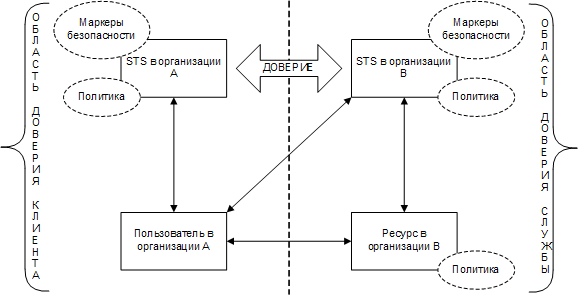
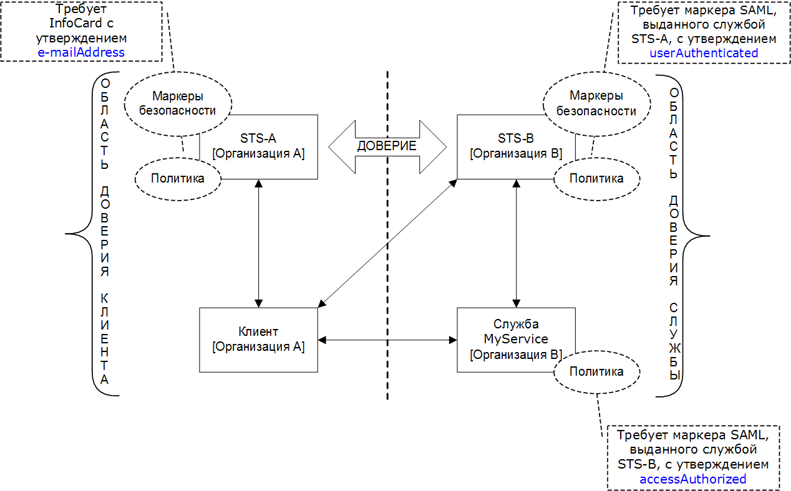
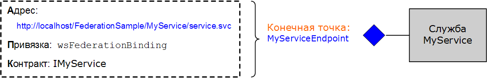
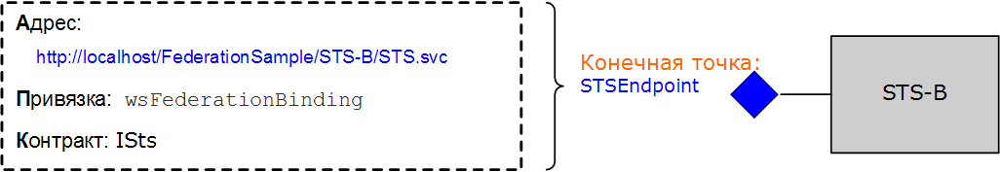
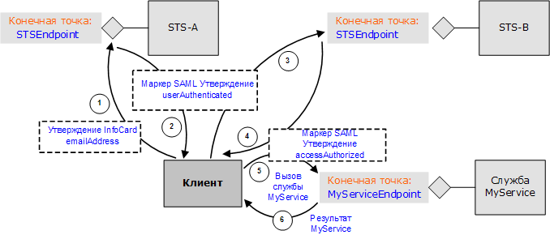

# Федерация
В этом разделе приведен краткий обзор концепции федеративной безопасности.Кроме того, описывается предусмотренная в [!INCLUDE[indigo1](../../../../includes/indigo1-md.md)] поддержка развертывания архитектур федеративной безопасности.Пример приложения, демонстрирующий федерацию, см. в разделе [Образец федерации](../../../../docs/framework/wcf/samples/federation-sample.md).  
  
## Определение федеративной безопасности  
 Федеративная безопасность обеспечивает четкое разделение между службой, к которой обращается клиент, и связанными процедурами проверки подлинности и авторизации.Федеративная безопасность также делает возможной совместную работу групп из нескольких систем, сетей и организаций, принадлежащих к различным областям доверия.  
  
 [!INCLUDE[indigo2](../../../../includes/indigo2-md.md)] обеспечивает поддержку построения и развертывания распределенных систем, в которых используется федеративная безопасность.  
  
### Элементы архитектуры федеративной безопасности  
 Архитектура федеративной безопасности включает три основных элемента, рассмотренных в следующей таблице.  
  
|Элемент|Описание|  
|-------------|--------------|  
|Домен\/область|Единица администрирования безопасности или доверия.Типичный домен может включать одну организацию.|  
|Федерация|Совокупность доменов, между которыми установлено отношение доверия.Уровень доверия может быть разным, но обычно предусматривает проверку подлинности и почти всегда предусматривает авторизацию.Типичная федерация может включать ряд организаций, между которыми установлено отношение доверия для общего доступа к некоторому набору ресурсов.|  
|Служба токенов безопасности \(STS\)|Веб\-служба, выдающая токены безопасности, т. е. делающая утверждения на основании свидетельств, которым она доверяет, перед теми, кто доверяет ей.Эти утверждения образуют основу посредничества с доверием между доменами.|  
  
### Пример сценария  
 На следующем рисунке показан пример федеративной безопасности.  
  
   
  
 В этом сценарии участвуют две организации: А и Б.Организация Б имеет веб\-ресурс \(веб\-службу\), которую некоторые пользователи из организации А находят полезной.  
  
> [!NOTE]
>  В этом разделе термины *ресурс*, *служба* и *веб\-служба* используются взаимозаменяемо.  
  
 Как правило, организация B требует, чтобы пользователь из организации A предоставил какое\-либо допустимое доказательство своей подлинности, прежде чем обращаться к службе.Кроме того, организация может также потребовать, чтобы пользователь был авторизован для доступа к данному ресурсу.Один из способов решить эту проблему и дать пользователям в организации A возможность доступа к ресурсу в организации B заключается в следующем.  
  
-   Пользователи из организации A регистрируют свои учетные данные \(имя пользователя и пароль\) в организации B.  
  
-   При обращении к ресурсу пользователи из организации A предъявляют свои учетные данные организации B, т. е. подлинность пользователей проверяется, прежде чем они получают доступ к ресурсу.  
  
 Это подход имеет три существенных недостатка.  
  
-   Организации B приходится управлять учетными данными пользователей из организации A, помимо управления учетными данными своих локальных пользователей.  
  
-   Пользователям в организации А приходится иметь дополнительный набор учетных данных \(т. е. помнить дополнительные имя пользователя и пароль\), помимо учетных данных, которыми они пользуются для получения доступа к ресурсам в пределах организации A.Обычно в таких ситуациях люди используют одни и те же имя пользователя и пароль на нескольких сайтах служб, что ослабляет безопасность.  
  
-   Архитектура не масштабируется, если другие организации посчитают ресурс в организации B полезным для своих пользователей.  
  
 Альтернативный подход, лишенный упомянутых выше недостатков — это использование федеративной безопасности.В соответствии с этим подходом организации A и B устанавливают отношения доверия и используют службу токенов безопасности \(Security Token Service, STS\) как посредника для установленного доверия.  
  
 В архитектуре федеративной безопасности пользователи из организации A знают, что если им требуется обратиться к веб\-службе в организации B, они должны предъявить в организации B допустимый ткен безопасности от службы STS, который используется для проверки их подлинности и авторизации их доступа к определенной службе.  
  
 При обращении к службе STS B пользователи приобретают еще один уровень косвенного обращения от политики, связанной со службой STS.Прежде чем служба STS B сможет выдать им токен безопасности, они должны предъявить допустимый токен безопасности от службы STS A \(т. е. из области доверия клиента\).Это логическое следствие из отношения доверия, установленного между двумя организациями, подразумевающее, что организации Б не требуется управлять удостоверениями пользователей из организации A.На практике служба STS Б обычно имеет значение NULL для параметров `issuerAddress` и `issuerMetadataAddress`.[!INCLUDE[crdefault](../../../../includes/crdefault-md.md)][Как настраивать локальный издатель](../../../../docs/framework/wcf/feature-details/how-to-configure-a-local-issuer.md).В этом случае клиент обращается к локальной политике, чтобы найти службу STS A.Такая конфигурация называется *федерация с домашней областью* и является более масштабируемой, поскольку службе STS Б не требуется хранить информацию о службе STS A.  
  
 Затем пользователи связываются со службой STS в организации А и получают токен безопасности, предъявляя для проверки подлинности учетные данные, которыми они обычно пользуются для доступа к любому другому ресурсу в пределах организации A.Это также устраняет для пользователей необходимость поддерживать несколько наборов учетных данных или использовать один и тот же набор учетных данных на нескольких сайтах служб.  
  
 После того как пользователи получают токен безопасности от службы STS A, они предъявляют его службе STS Б.Организация Б выполняет авторизацию запросов пользователей и выдает пользователям токен безопасности из собственного набора токенов безопасности.Пользователи затем могут предъявить свой токен ресурсу в организации B и получить доступ к службе.  
  
## Поддержка федеративной безопасности в WCF  
 В [!INCLUDE[indigo2](../../../../includes/indigo2-md.md)] предусмотрена готовая поддержка развертывания архитектур федеративной безопасности посредством [\<wsFederationHttpBinding\>](../../../../docs/framework/configure-apps/file-schema/wcf/wsfederationhttpbinding.md).  
  
 Элемент [\<wsFederationHttpBinding\>](../../../../docs/framework/configure-apps/file-schema/wcf/wsfederationhttpbinding.md) обеспечивает безопасную, надежную, поддерживающую взаимодействие привязку, предполагающую использование протокола HTTP в качестве базового транспортного механизма для связи в стиле "запрос\-ответ" и текста и XML в качестве формата кодирования при передаче по линиям связи.  
  
 Использование [\<wsFederationHttpBinding\>](../../../../docs/framework/configure-apps/file-schema/wcf/wsfederationhttpbinding.md) в сценарии федеративной безопасности можно разделить на две логически независимых фазы, как описано ниже.  
  
### Фаза 1: фаза проектирования  
 На фазе проектирования клиент использует [Служебное средство ServiceModel Metadata Utility Tool \(Svcutil.exe\)](../../../../docs/framework/wcf/servicemodel-metadata-utility-tool-svcutil-exe.md) для чтения политики, предоставляемой конечной точкой службы, и для сбора требований службы в отношении проверки подлинности и авторизации.Строятся соответствующие прокси\-объекты для создания следующей схемы обмена данными федеративной безопасности на стороне клиента:  
  
-   получение токена безопасности от службы STS в области доверия клиента;  
  
-   предъявление токена службе STS в области доверия службы;  
  
-   получение токена безопасности от службы STS в области доверия службы;  
  
-   предъявление токена службе для доступа к службе.  
  
### Фаза 2: фаза времени выполнения  
 На фазе времени выполнения клиент создает экземпляр класса клиента [!INCLUDE[indigo2](../../../../includes/indigo2-md.md)] и делает вызов с использованием клиента [!INCLUDE[indigo2](../../../../includes/indigo2-md.md)].Базовая архитектура [!INCLUDE[indigo2](../../../../includes/indigo2-md.md)] обрабатывает упомянутые выше шаги схемы обмена данными федеративной безопасности и позволяет клиенту легко воспользоваться службой.  
  
## Пример реализации с использованием WCF  
 На следующем рисунке показан пример реализации архитектуры федеративной безопасности с использованием встроенной поддержки [!INCLUDE[indigo2](../../../../includes/indigo2-md.md)].  
  
   
  
### Служба MyService  
 Служба `MyService` предоставляет одну конечную точку — `MyServiceEndpoint`.На следующем рисунке показаны адрес, привязка и контракт, связанные с конечной точкой.  
  
   
  
 Конечная точка службы `MyServiceEndpoint` использует [\<wsFederationHttpBinding\>](../../../../docs/framework/configure-apps/file-schema/wcf/wsfederationhttpbinding.md) и требует наличия допустимого токена языка SAML \(Security Assertions Markup Language\) и утверждения `accessAuthorized`, выданного службой STS Б.Это декларативно указано в конфигурации службы.  
  
```  
<system.serviceModel>  
  <services>  
    <service type="FederationSample.MyService"      
        behaviorConfiguration='MyServiceBehavior'>  
        <endpoint address=""  
            binding=" wsFederationHttpBinding"  
            bindingConfiguration='MyServiceBinding'  
            contract="Federation.IMyService" />  
   </service>  
  </services>  
  
  <bindings>  
    <wsFederationHttpBinding>  
    <!-- This is the binding used by MyService. It redirects   
    clients to STS-B. -->  
      <binding name='MyServiceBinding'>  
        <security mode="Message">  
           <message issuedTokenType=  
"http://docs.oasis-open.org/wss/oasis-wss-saml-token-profile-1.1#SAMLV1.1">  
           <issuer address="http://localhost/FederationSample/STS-B/STS.svc" />  
            <issuerMetadata   
           address=  
"http://localhost/FederationSample/STS-B/STS.svc/mex" />  
         <requiredClaimTypes>  
            <add claimType="http://tempuri.org:accessAuthorized" />  
         </requiredClaimTypes>  
        </message>  
      </security>  
      </binding>  
    </wsFederationHttpBinding>  
  </bindings>  
  
  <behaviors>  
    <behavior name='MyServiceBehavior'>  
      <serviceAuthorization   
operationRequirementType="FederationSample.MyServiceOperationRequirement, MyService" />  
       <serviceCredentials>  
         <serviceCertificate findValue="CN=FederationSample.com"  
         x509FindType="FindBySubjectDistinguishedName"  
         storeLocation='LocalMachine'  
         storeName='My' />  
      </serviceCredentials>  
    </behavior>  
  </behaviors>  
</system.serviceModel>  
```  
  
> [!NOTE]
>  Относительно утверждений, которые требует служба `MyService`, необходимо отметить один небольшой момент.Из второго рисунка видно, что служба `MyService` требует токен SAML с утверждением `accessAuthorized`.Точнее, эта строка задает тип утверждения, которого требует служба `MyService`.Полное имя этого типа утверждения — http:\/\/tempuri.org:accessAuthorized \(вместе со связанным пространством имен\); это имя используется в файле конфигурации службы.Значение этого утверждения указывает на присутствие этого утверждения, и предполагается, что служба STS B установила его равным `true`.  
  
 Во время выполнения эта политика применяется классом `MyServiceOperationRequirement`, реализованным в составе службы `MyService`.  
  
 [!code-csharp[C_Federation#0](../../../../samples/snippets/csharp/VS_Snippets_CFX/c_federation/cs/source.cs#0)]
 [!code-vb[C_Federation#0](../../../../samples/snippets/visualbasic/VS_Snippets_CFX/c_federation/vb/source.vb#0)]  
[!code-csharp[C_Federation#1](../../../../samples/snippets/csharp/VS_Snippets_CFX/c_federation/cs/source.cs#1)]
[!code-vb[C_Federation#1](../../../../samples/snippets/visualbasic/VS_Snippets_CFX/c_federation/vb/source.vb#1)]  
  
#### Служба STS B  
 На следующем рисунке показана служба STS Б.Как говорилось выше, служба токенов безопасности \(STS\) также представляет собой веб\-службу и может иметь свои конечные точки, политику и т. д.  
  
   
  
 Служба STS B предоставляет одну конечную точку, `STSEndpoint`, которую можно использовать для запроса токенов безопасности.В частности, служба STS B выдает токены SAML с утверждением `accessAuthorized`, которые могут быть предъявлены на сайте службы `MyService` для доступа к службе.В то же время служба STS B требует от пользователей предъявления допустимого токена SAML, выданного службой STS A и содержащего утверждение `userAuthenticated`.Это декларативно указано в конфигурации службы STS.  
  
```  
<system.serviceModel>  
  <services>  
    <service type="FederationSample.STS_B" behaviorConfiguration=  
     "STS-B_Behavior">  
    <endpoint address=""  
              binding="wsFederationHttpBinding"  
              bindingConfiguration='STS-B_Binding'  
      contract="FederationSample.ISts" />  
    </service>  
  </services>  
  <bindings>  
    <wsFederationHttpBinding>  
    <!-- This is the binding used by STS-B. It redirects clients to   
         STS-A. -->  
      <binding name='STS-B_Binding'>  
        <security mode='Message'>  
          <message issuedTokenType="http://docs.oasis-open.org/wss/oasis-wss-saml-token-profile-1.1#SAMLV1.1">  
          <issuer address='http://localhost/FederationSample/STS-A/STS.svc' />  
          <issuerMetadata address='http://localhost/FederationSample/STS-A/STS.svc/mex'/>  
          <requiredClaimTypes>  
            <add claimType='http://tempuri.org:userAuthenticated'/>  
          </requiredClaimTypes>  
          </message>  
        </security>  
    </binding>  
   </wsFederationHttpBinding>  
  </bindings>  
  <behaviors>  
  <behavior name='STS-B_Behavior'>  
    <serviceAuthorization   operationRequirementType='FederationSample.STS_B_OperationRequirement, STS_B' />  
    <serviceCredentials>  
      <serviceCertificate findValue='CN=FederationSample.com'  
      x509FindType='FindBySubjectDistinguishedName'  
       storeLocation='LocalMachine'  
       storeName='My' />  
     </serviceCredentials>  
   </behavior>  
  </behaviors>  
</system.serviceModel>  
```  
  
> [!NOTE]
>  Опять же утверждение `userAuthenticated` — это тип утверждения, необходимого для службы STS Б.Полное имя этого типа утверждения — http:\/\/tempuri.org:userAuthenticated \(вместе со связанным пространством имен\); это имя используется в файле конфигурации службы STS.Значение этого утверждения указывает на присутствие этого утверждения, и предполагается, что служба STS A установила его равным `true`.  
  
 Во время выполнения эта политика применяется классом `STS_B_OperationRequirement`, реализованным в составе службы STS B.  
  
 [!code-csharp[C_Federation#2](../../../../samples/snippets/csharp/VS_Snippets_CFX/c_federation/cs/source.cs#2)]
 [!code-vb[C_Federation#2](../../../../samples/snippets/visualbasic/VS_Snippets_CFX/c_federation/vb/source.vb#2)]  
  
 Если проверка доступа пройдена, служба STS B выдает токен SAML с утверждением `accessAuthorized`.  
  
 [!code-csharp[C_Federation#3](../../../../samples/snippets/csharp/VS_Snippets_CFX/c_federation/cs/source.cs#3)]
 [!code-vb[C_Federation#3](../../../../samples/snippets/visualbasic/VS_Snippets_CFX/c_federation/vb/source.vb#3)]  
  
#### Служба STS A  
 На следующем рисунке показана служба STS A.  
  
   
  
 Как и STS B, служба STS A также представляет собой веб\-службу, выдающую токены безопасности и предоставляющую с этой целью одну конечную точку.Однако она использует другую привязку \(`wsHttpBinding`\) и требует от пользователей предъявления допустимого токена [!INCLUDE[infocard](../../../../includes/infocard-md.md)] с утверждением `emailAddress`.В ответ она выдает токены SAML с утверждением `userAuthenticated`.Это декларативно указано в конфигурации службы.  
  
```  
<system.serviceModel>  
  <services>  
    <service type="FederationSample.STS_A" behaviorConfiguration="STS-A_Behavior">  
      <endpoint address=""  
                binding="wsHttpBinding"  
                bindingConfiguration="STS-A_Binding"  
                contract="FederationSample.ISts">  
       <identity>  
       <certificateReference findValue="CN=FederationSample.com"    
                       x509FindType="FindBySubjectDistinguishedName"  
                       storeLocation="LocalMachine"   
                       storeName="My" />  
       </identity>  
    <endpoint>  
  </service>  
</services>  
  
<bindings>  
  <wsHttpBinding>  
  <!-- This is the binding used by STS-A. It requires users to present  
   a CardSpace. -->  
    <binding name='STS-A_Binding'>  
      <security mode='Message'>  
        <message clientCredentialType="CardSpace" />  
      </security>  
    </binding>  
  </wsHttpBinding>  
</bindings>  
  
<behaviors>  
  <behavior name='STS-A_Behavior'>  
    <serviceAuthorization operationRequirementType=  
     "FederationSample.STS_A_OperationRequirement, STS_A" />  
      <serviceCredentials>  
  <serviceCertificate findValue="CN=FederationSample.com"  
                     x509FindType='FindBySubjectDistinguishedName'  
                     storeLocation='LocalMachine'  
                     storeName='My' />  
      </serviceCredentials>  
    </behavior>  
  </behaviors>  
</system.serviceModel>  
```  
  
 Во время выполнения эта политика применяется классом `STS_A_OperationRequirement`, реализованным в составе службы STS A.  
  
 [!code-csharp[C_Federation#4](../../../../samples/snippets/csharp/VS_Snippets_CFX/c_federation/cs/source.cs#4)]
 [!code-vb[C_Federation#4](../../../../samples/snippets/visualbasic/VS_Snippets_CFX/c_federation/vb/source.vb#4)]  
  
 Если проверка доступа возвратила значение `true`, служба STS A выдает токен SAML с утверждением `userAuthenticated`.  
  
 [!code-csharp[C_Federation#5](../../../../samples/snippets/csharp/VS_Snippets_CFX/c_federation/cs/source.cs#5)]
 [!code-vb[C_Federation#5](../../../../samples/snippets/visualbasic/VS_Snippets_CFX/c_federation/vb/source.vb#5)]  
  
### Клиент в организации A  
 На следующем рисунке показан клиент в организации A и шаги, которые включает в себя вызов функции `MyService`.Для полноты картины включены также другие функциональные компоненты.  
  
   
  
## Заключение  
 Федеративная безопасность обеспечивает четкое разделение ответственности и позволяет выстраивать безопасные, масштабируемые архитектуры служб.В качестве платформы для построения и развертывания распределенных приложений [!INCLUDE[indigo2](../../../../includes/indigo2-md.md)] предусматривает встроенную поддержку для реализации федеративной безопасности.  
  
## См. также  
 [Безопасность](../../../../docs/framework/wcf/feature-details/security.md)