# <a name="flowing-transactions-into-and-out-of-workflow-services"></a><span data-ttu-id="807d1-102">Направление транзакций в службы рабочего процесса и из них</span><span class="sxs-lookup"><span data-stu-id="807d1-102">Flowing Transactions into and out of Workflow Services</span></span>
<span data-ttu-id="807d1-103">Службы и клиенты рабочих процессов могут использоваться в транзакциях.</span><span class="sxs-lookup"><span data-stu-id="807d1-103">Workflow services and clients can participate in transactions.</span></span>  <span data-ttu-id="807d1-104">Чтобы сделать операцию службы частью внешней транзакции, поместите действие <xref:System.ServiceModel.Activities.Receive> в действие <xref:System.ServiceModel.Activities.TransactedReceiveScope>.</span><span class="sxs-lookup"><span data-stu-id="807d1-104">For a service operation to become part of an ambient transaction, place a <xref:System.ServiceModel.Activities.Receive> activity within a <xref:System.ServiceModel.Activities.TransactedReceiveScope> activity.</span></span> <span data-ttu-id="807d1-105">Все вызовы, выполненные действием <xref:System.ServiceModel.Activities.Send> или <xref:System.ServiceModel.Activities.SendReply> в области <xref:System.ServiceModel.Activities.TransactedReceiveScope>, также будут выполнены во внешней транзакции.</span><span class="sxs-lookup"><span data-stu-id="807d1-105">Any calls made by a <xref:System.ServiceModel.Activities.Send> or a <xref:System.ServiceModel.Activities.SendReply> activity within the <xref:System.ServiceModel.Activities.TransactedReceiveScope> will also be made within the ambient transaction.</span></span> <span data-ttu-id="807d1-106">Клиентское приложение рабочего процесса может создавать внешнюю транзакцию с помощью действия <xref:System.Activities.Statements.TransactionScope> и вызывать операции службы с помощью внешних транзакций.</span><span class="sxs-lookup"><span data-stu-id="807d1-106">A workflow client application can create an ambient transaction by using the <xref:System.Activities.Statements.TransactionScope> activity and call service operations using the ambient transaction.</span></span> <span data-ttu-id="807d1-107">В данном разделе описывается создание службы рабочего процесса и клиента рабочего процесса, которые участвуют в транзакции.</span><span class="sxs-lookup"><span data-stu-id="807d1-107">This topic walks you through creating a workflow service and workflow client that participate in transactions.</span></span>  
  
> [!WARNING]
>  <span data-ttu-id="807d1-108">Если экземпляр службы рабочего процесса загружается в транзакцию и рабочий процесс содержит действие <xref:System.Activities.Statements.Persist>, экземпляр рабочего процесса «зависнет» до истечения срока ожидания транзакции.</span><span class="sxs-lookup"><span data-stu-id="807d1-108">If a workflow service instance is loaded within a transaction and the workflow contains a <xref:System.Activities.Statements.Persist> activity, the workflow instance will hang until the transaction times out.</span></span>  
  
> [!IMPORTANT]
>  <span data-ttu-id="807d1-109">При использовании области <xref:System.ServiceModel.Activities.TransactedReceiveScope> рекомендуется размещать все операции получения в рабочем процессе в действиях, связанных с областью <xref:System.ServiceModel.Activities.TransactedReceiveScope>.</span><span class="sxs-lookup"><span data-stu-id="807d1-109">Whenever you use a <xref:System.ServiceModel.Activities.TransactedReceiveScope> it is recommended to place all Receives in the workflow within <xref:System.ServiceModel.Activities.TransactedReceiveScope> activities.</span></span>  
  
> [!IMPORTANT]
>  <span data-ttu-id="807d1-110">Если используется область <xref:System.ServiceModel.Activities.TransactedReceiveScope>, а сообщения поступают в неверном порядке, рабочий процесс будет прерван при попытке доставки первого сообщения, пришедшего в неправильном порядке.</span><span class="sxs-lookup"><span data-stu-id="807d1-110">When using <xref:System.ServiceModel.Activities.TransactedReceiveScope> and messages arrive in the incorrect order, the workflow will be aborted when trying to deliver the first out of order message.</span></span> <span data-ttu-id="807d1-111">Убедитесь, что рабочий процесс всегда находится в согласованном состоянии при освобождении рабочего процесса.</span><span class="sxs-lookup"><span data-stu-id="807d1-111">You must make sure your workflow is always at a consistent stopping point when the workflow idles.</span></span> <span data-ttu-id="807d1-112">Это позволит перезапустить рабочий процесс с прежней сохраненной точки в случае, если он был прерван.</span><span class="sxs-lookup"><span data-stu-id="807d1-112">This will allow you to restart the workflow from a previous persistence point should the workflow be aborted.</span></span>  
  
### <a name="create-a-shared-library"></a><span data-ttu-id="807d1-113">Создание общей библиотеки</span><span class="sxs-lookup"><span data-stu-id="807d1-113">Create a shared library</span></span>  
  
1.  <span data-ttu-id="807d1-114">Создайте новое пустое решение Visual Studio.</span><span class="sxs-lookup"><span data-stu-id="807d1-114">Create a new empty Visual Studio Solution.</span></span>  
  
2.  <span data-ttu-id="807d1-115">Добавьте новый проект библиотеки классов с именем `Common`.</span><span class="sxs-lookup"><span data-stu-id="807d1-115">Add a new class library project called `Common`.</span></span> <span data-ttu-id="807d1-116">Добавьте ссылки на следующие сборки:</span><span class="sxs-lookup"><span data-stu-id="807d1-116">Add references to the following assemblies:</span></span>  
  
    -   <span data-ttu-id="807d1-117">System.Activities.dll</span><span class="sxs-lookup"><span data-stu-id="807d1-117">System.Activities.dll</span></span>  
  
    -   <span data-ttu-id="807d1-118">System.ServiceModel.dll</span><span class="sxs-lookup"><span data-stu-id="807d1-118">System.ServiceModel.dll</span></span>  
  
    -   <span data-ttu-id="807d1-119">System.ServiceModel.Activities.dll</span><span class="sxs-lookup"><span data-stu-id="807d1-119">System.ServiceModel.Activities.dll</span></span>  
  
    -   <span data-ttu-id="807d1-120">System.Transactions.dll</span><span class="sxs-lookup"><span data-stu-id="807d1-120">System.Transactions.dll</span></span>  
  
3.  <span data-ttu-id="807d1-121">Добавьте новый класс с именем `PrintTransactionInfo` к проекту `Common`.</span><span class="sxs-lookup"><span data-stu-id="807d1-121">Add a new class called `PrintTransactionInfo` to the `Common` project.</span></span> <span data-ttu-id="807d1-122">Класс является производным от <xref:System.Activities.NativeActivity> и перегружает метод <xref:System.Activities.NativeActivity.Execute%2A>.</span><span class="sxs-lookup"><span data-stu-id="807d1-122">This class is derived from <xref:System.Activities.NativeActivity> and overloads the <xref:System.Activities.NativeActivity.Execute%2A> method.</span></span>  
  
    ```  
    using System;  
    using System;  
    using System.Activities;  
    using System.Transactions;  
  
    namespace Common  
    {  
        public class PrintTransactionInfo : NativeActivity  
        {  
            protected override void Execute(NativeActivityContext context)  
            {  
                RuntimeTransactionHandle rth = context.Properties.Find(typeof(RuntimeTransactionHandle).FullName) as RuntimeTransactionHandle;  
  
                if (rth == null)  
                {  
                    Console.WriteLine("There is no ambient RuntimeTransactionHandle");  
                }  
  
                Transaction t = rth.GetCurrentTransaction(context);  
  
                if (t == null)  
                {  
                    Console.WriteLine("There is no ambient transaction");  
                }  
                else  
                {  
                    Console.WriteLine("Transaction: {0} is {1}", t.TransactionInformation.DistributedIdentifier, t.TransactionInformation.Status);  
                }  
            }  
        }  
  
    }  
    ```  
  
     <span data-ttu-id="807d1-123">Это собственное действие, при выполнении которого отображаются данные о внешней транзакции, и оно используется в службе и клиенте рабочих процессов, описываемых в этом разделе.</span><span class="sxs-lookup"><span data-stu-id="807d1-123">This is a native activity that displays information about the ambient transaction and is used in both the service and client workflows used in this topic.</span></span> <span data-ttu-id="807d1-124">Постройте решение, чтобы обеспечить доступность в действия **Общие** раздел **элементов**.</span><span class="sxs-lookup"><span data-stu-id="807d1-124">Build the solution to make this activity available in the **Common** section of the **Toolbox**.</span></span>  
  
### <a name="implement-the-workflow-service"></a><span data-ttu-id="807d1-125">Реализация службы рабочего процесса</span><span class="sxs-lookup"><span data-stu-id="807d1-125">Implement the workflow service</span></span>  
  
1.  <span data-ttu-id="807d1-126">Добавьте новый [!INCLUDE[indigo2](../../../../includes/indigo2-md.md)] службы рабочего процесса, именуемое `WorkflowService` для `Common` проекта.</span><span class="sxs-lookup"><span data-stu-id="807d1-126">Add a new [!INCLUDE[indigo2](../../../../includes/indigo2-md.md)] Workflow Service, called `WorkflowService` to the `Common` project.</span></span> <span data-ttu-id="807d1-127">Для этого щелкните правой `Common` проекта, выберите **добавить**, **новый элемент...** Выберите **рабочего процесса** под **установленные шаблоны** и выберите **службы рабочего процесса WCF**.</span><span class="sxs-lookup"><span data-stu-id="807d1-127">To do this right click the `Common` project, select **Add**, **New Item ...**, Select **Workflow** under **Installed Templates** and select **WCF Workflow Service**.</span></span>  
  
     <span data-ttu-id="807d1-128">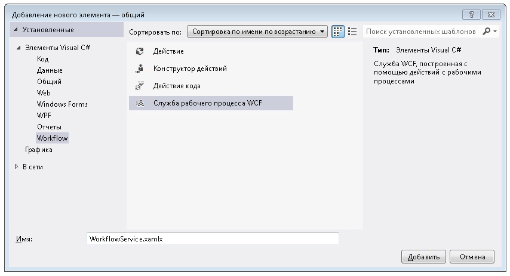</span><span class="sxs-lookup"><span data-stu-id="807d1-128"></span></span>  
  
2.  <span data-ttu-id="807d1-129">Удалите заданные по умолчанию действия `ReceiveRequest` и `SendResponse`.</span><span class="sxs-lookup"><span data-stu-id="807d1-129">Delete the default `ReceiveRequest` and `SendResponse` activities.</span></span>  
  
3.  <span data-ttu-id="807d1-130">Перетащите действие с именем <xref:System.Activities.Statements.WriteLine> в `Sequential Service`.</span><span class="sxs-lookup"><span data-stu-id="807d1-130">Drag and drop a <xref:System.Activities.Statements.WriteLine> activity into the `Sequential Service` activity.</span></span> <span data-ttu-id="807d1-131">Задайте значение для свойства текста `"Workflow Service starting ..."`, как показано в следующем примере.</span><span class="sxs-lookup"><span data-stu-id="807d1-131">Set the text property to `"Workflow Service starting ..."` as shown in the following example.</span></span>  
  
     <span data-ttu-id="807d1-132">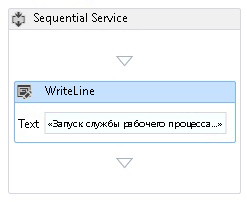</span><span class="sxs-lookup"><span data-stu-id="807d1-132"></span></span>  
  
4.  <span data-ttu-id="807d1-133">Перетащите действие <xref:System.ServiceModel.Activities.TransactedReceiveScope> и поместите его после действия <xref:System.Activities.Statements.WriteLine>.</span><span class="sxs-lookup"><span data-stu-id="807d1-133">Drag and drop a <xref:System.ServiceModel.Activities.TransactedReceiveScope> after the <xref:System.Activities.Statements.WriteLine> activity.</span></span> <span data-ttu-id="807d1-134"><xref:System.ServiceModel.Activities.TransactedReceiveScope> Действия можно найти в **обмен сообщениями** раздел **элементов**.</span><span class="sxs-lookup"><span data-stu-id="807d1-134">The <xref:System.ServiceModel.Activities.TransactedReceiveScope> activity can be found in the **Messaging** section of the **Toolbox**.</span></span> <span data-ttu-id="807d1-135"><xref:System.ServiceModel.Activities.TransactedReceiveScope> Действие состоит из двух разделов **запроса** и **текст**.</span><span class="sxs-lookup"><span data-stu-id="807d1-135">The <xref:System.ServiceModel.Activities.TransactedReceiveScope> activity is composed of two sections **Request** and **Body**.</span></span> <span data-ttu-id="807d1-136">**Запроса** раздел содержит <xref:System.ServiceModel.Activities.Receive> действия.</span><span class="sxs-lookup"><span data-stu-id="807d1-136">The **Request** section contains the <xref:System.ServiceModel.Activities.Receive> activity.</span></span> <span data-ttu-id="807d1-137">**Текст** содержит действия, которые необходимо выполнить в транзакции после получения сообщения.</span><span class="sxs-lookup"><span data-stu-id="807d1-137">The **Body** section contains the activities to execute within a transaction after a message has been received.</span></span>  
  
     <span data-ttu-id="807d1-138">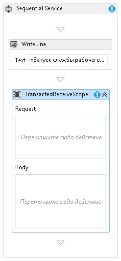</span><span class="sxs-lookup"><span data-stu-id="807d1-138"></span></span>  
  
5.  <span data-ttu-id="807d1-139">Выберите <xref:System.ServiceModel.Activities.TransactedReceiveScope> действие и нажмите кнопку **переменных** кнопки.</span><span class="sxs-lookup"><span data-stu-id="807d1-139">Select the <xref:System.ServiceModel.Activities.TransactedReceiveScope> activity and click the **Variables** button.</span></span> <span data-ttu-id="807d1-140">Добавьте следующие переменные.</span><span class="sxs-lookup"><span data-stu-id="807d1-140">Add the following variables.</span></span>  
  
     <span data-ttu-id="807d1-141">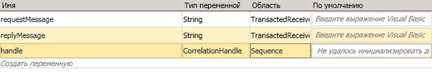</span><span class="sxs-lookup"><span data-stu-id="807d1-141"></span></span>  
  
    > [!NOTE]
    >  <span data-ttu-id="807d1-142">Можно удалить переменную данных, заданную по умолчанию.</span><span class="sxs-lookup"><span data-stu-id="807d1-142">You can delete the data variable that is there by default.</span></span> <span data-ttu-id="807d1-143">Также можно использовать существующую переменную обработки.</span><span class="sxs-lookup"><span data-stu-id="807d1-143">You can also use the existing handle variable.</span></span>  
  
6.  <span data-ttu-id="807d1-144">Перетаскивание <xref:System.ServiceModel.Activities.Receive> действия в **запроса** раздел <xref:System.ServiceModel.Activities.TransactedReceiveScope> действия.</span><span class="sxs-lookup"><span data-stu-id="807d1-144">Drag and drop a <xref:System.ServiceModel.Activities.Receive> activity within the **Request** section of the <xref:System.ServiceModel.Activities.TransactedReceiveScope> activity.</span></span> <span data-ttu-id="807d1-145">Задайте следующие свойства:</span><span class="sxs-lookup"><span data-stu-id="807d1-145">Set the following properties:</span></span>  
  
    |<span data-ttu-id="807d1-146">Свойство</span><span class="sxs-lookup"><span data-stu-id="807d1-146">Property</span></span>|<span data-ttu-id="807d1-147">Значение</span><span class="sxs-lookup"><span data-stu-id="807d1-147">Value</span></span>|  
    |--------------|-----------|  
    |<span data-ttu-id="807d1-148">CanCreateInstance</span><span class="sxs-lookup"><span data-stu-id="807d1-148">CanCreateInstance</span></span>|<span data-ttu-id="807d1-149">True (установите флажок)</span><span class="sxs-lookup"><span data-stu-id="807d1-149">True (check the checkbox)</span></span>|  
    |<span data-ttu-id="807d1-150">OperationName</span><span class="sxs-lookup"><span data-stu-id="807d1-150">OperationName</span></span>|<span data-ttu-id="807d1-151">StartSample</span><span class="sxs-lookup"><span data-stu-id="807d1-151">StartSample</span></span>|  
    |<span data-ttu-id="807d1-152">ServiceContractName</span><span class="sxs-lookup"><span data-stu-id="807d1-152">ServiceContractName</span></span>|<span data-ttu-id="807d1-153">ITransactionSample</span><span class="sxs-lookup"><span data-stu-id="807d1-153">ITransactionSample</span></span>|  
  
     <span data-ttu-id="807d1-154">Рабочий процесс должен выглядеть так:</span><span class="sxs-lookup"><span data-stu-id="807d1-154">The workflow should look like this:</span></span>  
  
     <span data-ttu-id="807d1-155">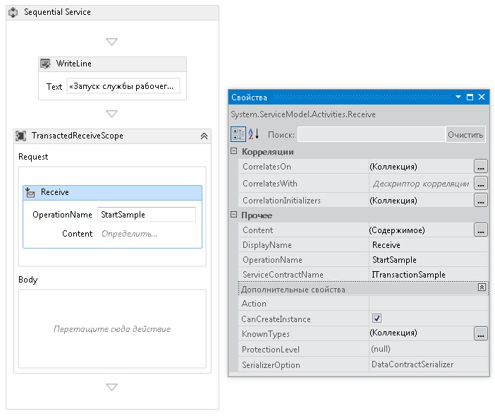</span><span class="sxs-lookup"><span data-stu-id="807d1-155"></span></span>  
  
7.  <span data-ttu-id="807d1-156">Нажмите кнопку **определить...**  ссылку в <xref:System.ServiceModel.Activities.Receive> действия и задайте следующие параметры:</span><span class="sxs-lookup"><span data-stu-id="807d1-156">Click the **Define...** link in the <xref:System.ServiceModel.Activities.Receive> activity and make the following settings:</span></span>  
  
     <span data-ttu-id="807d1-157">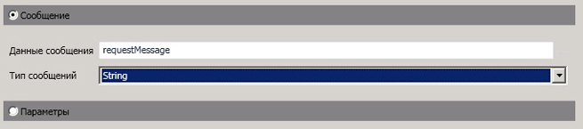</span><span class="sxs-lookup"><span data-stu-id="807d1-157"></span></span>  
  
8.  <span data-ttu-id="807d1-158">Перетащите действие <xref:System.Activities.Statements.Sequence> в разделе «Текст» <xref:System.ServiceModel.Activities.TransactedReceiveScope>.</span><span class="sxs-lookup"><span data-stu-id="807d1-158">Drag and drop a <xref:System.Activities.Statements.Sequence> activity into the Body section of the <xref:System.ServiceModel.Activities.TransactedReceiveScope>.</span></span> <span data-ttu-id="807d1-159">В действии <xref:System.Activities.Statements.Sequence> перетащите два действия <xref:System.Activities.Statements.WriteLine> и настройте свойства <xref:System.Activities.Statements.WriteLine.Text%2A>, как показано в следующей таблице.</span><span class="sxs-lookup"><span data-stu-id="807d1-159">Within the <xref:System.Activities.Statements.Sequence> activity drag and drop two <xref:System.Activities.Statements.WriteLine> activities and set the <xref:System.Activities.Statements.WriteLine.Text%2A> properties as shown in the following table.</span></span>  
  
    |<span data-ttu-id="807d1-160">Действие</span><span class="sxs-lookup"><span data-stu-id="807d1-160">Activity</span></span>|<span data-ttu-id="807d1-161">Значение</span><span class="sxs-lookup"><span data-stu-id="807d1-161">Value</span></span>|  
    |--------------|-----------|  
    |<span data-ttu-id="807d1-162">Первое действие WriteLine</span><span class="sxs-lookup"><span data-stu-id="807d1-162">1st WriteLine</span></span>|<span data-ttu-id="807d1-163">«Service: Receive Completed»</span><span class="sxs-lookup"><span data-stu-id="807d1-163">"Service: Receive Completed"</span></span>|  
    |<span data-ttu-id="807d1-164">Второе действие WriteLine</span><span class="sxs-lookup"><span data-stu-id="807d1-164">2nd WriteLine</span></span>|<span data-ttu-id="807d1-165">"Service: Received = " + requestMessage</span><span class="sxs-lookup"><span data-stu-id="807d1-165">"Service: Received = " + requestMessage</span></span>|  
  
     <span data-ttu-id="807d1-166">После этого рабочий процесс должен выглядеть так:</span><span class="sxs-lookup"><span data-stu-id="807d1-166">The workflow should now look like this:</span></span>  
  
     <span data-ttu-id="807d1-167">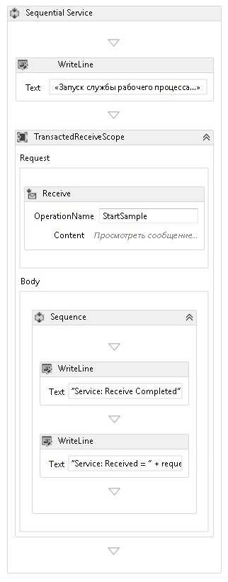</span><span class="sxs-lookup"><span data-stu-id="807d1-167"></span></span>  
  
9. <span data-ttu-id="807d1-168">Перетаскивание `PrintTransactionInfo` действия после второго <xref:System.Activities.Statements.WriteLine> действия в **текст** в <xref:System.ServiceModel.Activities.TransactedReceiveScope> действия.</span><span class="sxs-lookup"><span data-stu-id="807d1-168">Drag and drop the `PrintTransactionInfo` activity after the second <xref:System.Activities.Statements.WriteLine> activity in the **Body** in the <xref:System.ServiceModel.Activities.TransactedReceiveScope> activity.</span></span>  
  
     <span data-ttu-id="807d1-169">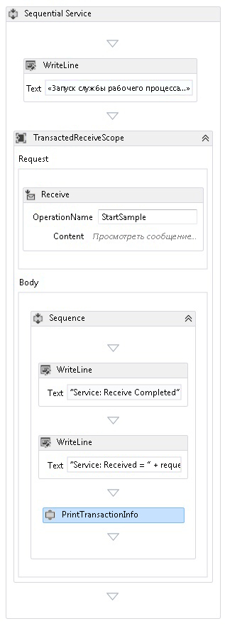</span><span class="sxs-lookup"><span data-stu-id="807d1-169"></span></span>  
  
10. <span data-ttu-id="807d1-170">Перетащите действие <xref:System.Activities.Statements.Assign>, поместите его после действия `PrintTransactionInfo` и задайте свойства в соответствии со следующей таблицей.</span><span class="sxs-lookup"><span data-stu-id="807d1-170">Drag and drop an <xref:System.Activities.Statements.Assign> activity after the `PrintTransactionInfo` activity and set its properties according to the following table.</span></span>  
  
    |<span data-ttu-id="807d1-171">Свойство</span><span class="sxs-lookup"><span data-stu-id="807d1-171">Property</span></span>|<span data-ttu-id="807d1-172">Значение</span><span class="sxs-lookup"><span data-stu-id="807d1-172">Value</span></span>|  
    |--------------|-----------|  
    |<span data-ttu-id="807d1-173">Целевой тип</span><span class="sxs-lookup"><span data-stu-id="807d1-173">To</span></span>|<span data-ttu-id="807d1-174">replyMessage</span><span class="sxs-lookup"><span data-stu-id="807d1-174">replyMessage</span></span>|  
    |<span data-ttu-id="807d1-175">Значение</span><span class="sxs-lookup"><span data-stu-id="807d1-175">Value</span></span>|<span data-ttu-id="807d1-176">"Service: Sending reply."</span><span class="sxs-lookup"><span data-stu-id="807d1-176">"Service: Sending reply."</span></span>|  
  
11. <span data-ttu-id="807d1-177">Перетащите действие <xref:System.Activities.Statements.WriteLine>, поместите его после действия <xref:System.Activities.Statements.Assign> и задайте для свойства <xref:System.Activities.Statements.WriteLine.Text%2A> значение "Service: Begin reply".</span><span class="sxs-lookup"><span data-stu-id="807d1-177">Drag and drop a <xref:System.Activities.Statements.WriteLine> activity after the <xref:System.Activities.Statements.Assign> activity and set its <xref:System.Activities.Statements.WriteLine.Text%2A> property to "Service: Begin reply."</span></span>  
  
     <span data-ttu-id="807d1-178">После этого рабочий процесс должен выглядеть так:</span><span class="sxs-lookup"><span data-stu-id="807d1-178">The workflow should now look like this:</span></span>  
  
     <span data-ttu-id="807d1-179">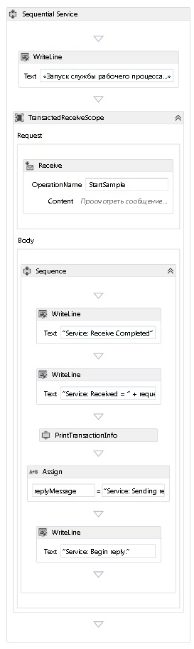</span><span class="sxs-lookup"><span data-stu-id="807d1-179"></span></span>  
  
12. <span data-ttu-id="807d1-180">Щелкните правой кнопкой мыши <xref:System.ServiceModel.Activities.Receive> действие и выберите **создать SendReply** и вставьте его после последнего <xref:System.Activities.Statements.WriteLine> действия.</span><span class="sxs-lookup"><span data-stu-id="807d1-180">Right click the <xref:System.ServiceModel.Activities.Receive> activity and select **Create SendReply** and paste it after the last <xref:System.Activities.Statements.WriteLine> activity.</span></span> <span data-ttu-id="807d1-181">Нажмите кнопку **определить...**  ссылку в `SendReplyToReceive` действия и задайте следующие параметры.</span><span class="sxs-lookup"><span data-stu-id="807d1-181">Click the **Define...** link in the `SendReplyToReceive` activity and make the following settings.</span></span>  
  
     <span data-ttu-id="807d1-182">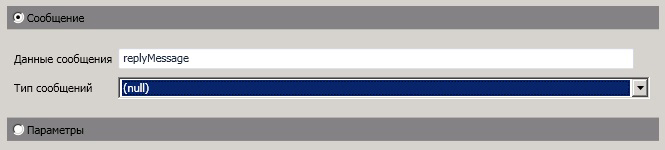</span><span class="sxs-lookup"><span data-stu-id="807d1-182"></span></span>  
  
13. <span data-ttu-id="807d1-183">Перетаскивание <xref:System.Activities.Statements.WriteLine> действия после `SendReplyToReceive` и задайте имеет <xref:System.Activities.Statements.WriteLine.Text%2A> свойства» службы: Reply sent.»</span><span class="sxs-lookup"><span data-stu-id="807d1-183">Drag and drop a <xref:System.Activities.Statements.WriteLine> activity after the `SendReplyToReceive` activity and set it’s <xref:System.Activities.Statements.WriteLine.Text%2A> property to "Service: Reply sent."</span></span>  
  
14. <span data-ttu-id="807d1-184">Перетащите действие <xref:System.Activities.Statements.WriteLine> в нижнюю область рабочего процесса и задайте для свойства <xref:System.Activities.Statements.WriteLine.Text%2A> значение "Service: Workflow ends, press ENTER to exit".</span><span class="sxs-lookup"><span data-stu-id="807d1-184">Drag and drop a <xref:System.Activities.Statements.WriteLine> activity at the bottom of the workflow and set its <xref:System.Activities.Statements.WriteLine.Text%2A> property to "Service: Workflow ends, press ENTER to exit."</span></span>  
  
     <span data-ttu-id="807d1-185">Завершенный рабочий процесс службы должен выглядеть следующим образом:</span><span class="sxs-lookup"><span data-stu-id="807d1-185">The completed service workflow should look like this:</span></span>  
  
     <span data-ttu-id="807d1-186">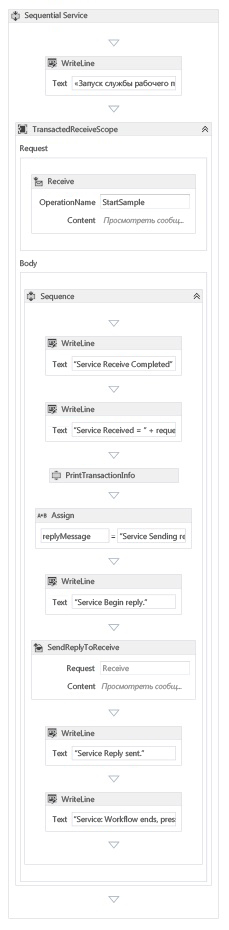</span><span class="sxs-lookup"><span data-stu-id="807d1-186"></span></span>  
  
### <a name="implement-the-workflow-client"></a><span data-ttu-id="807d1-187">Реализуйте клиент рабочего процесса</span><span class="sxs-lookup"><span data-stu-id="807d1-187">Implement the workflow client</span></span>  
  
1.  <span data-ttu-id="807d1-188">Добавьте новое приложение WCF Workflow с именем `WorkflowClient` к проекту `Common`.</span><span class="sxs-lookup"><span data-stu-id="807d1-188">Add a new WCF Workflow application, called `WorkflowClient` to the `Common` project.</span></span> <span data-ttu-id="807d1-189">Для этого щелкните правой `Common` проекта, выберите **добавить**, **новый элемент...** Выберите **рабочего процесса** под **установленные шаблоны** и выберите **действия**.</span><span class="sxs-lookup"><span data-stu-id="807d1-189">To do this right click the `Common` project, select **Add**, **New Item ...**, Select **Workflow** under **Installed Templates** and select **Activity**.</span></span>  
  
     <span data-ttu-id="807d1-190">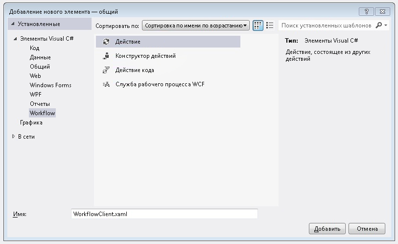</span><span class="sxs-lookup"><span data-stu-id="807d1-190"></span></span>  
  
2.  <span data-ttu-id="807d1-191">Перетащите действие <xref:System.Activities.Statements.Sequence> в область конструктора.</span><span class="sxs-lookup"><span data-stu-id="807d1-191">Drag and drop a <xref:System.Activities.Statements.Sequence> activity onto the design surface.</span></span>  
  
3.  <span data-ttu-id="807d1-192">В действии <xref:System.Activities.Statements.Sequence> перетащите действие <xref:System.Activities.Statements.WriteLine> и задайте для его свойства <xref:System.Activities.Statements.WriteLine.Text%2A> значение `"Client: Workflow starting"`.</span><span class="sxs-lookup"><span data-stu-id="807d1-192">Within the <xref:System.Activities.Statements.Sequence> activity drag and drop a <xref:System.Activities.Statements.WriteLine> activity and set its <xref:System.Activities.Statements.WriteLine.Text%2A> property to `"Client: Workflow starting"`.</span></span> <span data-ttu-id="807d1-193">После этого рабочий процесс должен выглядеть так:</span><span class="sxs-lookup"><span data-stu-id="807d1-193">The workflow should now look like this:</span></span>  
  
     <span data-ttu-id="807d1-194"></span><span class="sxs-lookup"><span data-stu-id="807d1-194"></span></span>  
  
4.  <span data-ttu-id="807d1-195">Перетащите действие <xref:System.Activities.Statements.TransactionScope> и поместите его после действия <xref:System.Activities.Statements.WriteLine>.</span><span class="sxs-lookup"><span data-stu-id="807d1-195">Drag and drop a <xref:System.Activities.Statements.TransactionScope> activity after the <xref:System.Activities.Statements.WriteLine> activity.</span></span>  <span data-ttu-id="807d1-196">Выберите действие <xref:System.Activities.Statements.TransactionScope>, нажмите кнопку «Переменные» и добавьте следующие переменные.</span><span class="sxs-lookup"><span data-stu-id="807d1-196">Select the <xref:System.Activities.Statements.TransactionScope> activity, click the Variables button and add the following variables.</span></span>  
  
     <span data-ttu-id="807d1-197">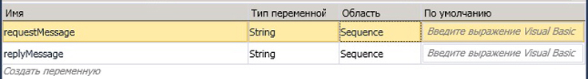</span><span class="sxs-lookup"><span data-stu-id="807d1-197"></span></span>  
  
5.  <span data-ttu-id="807d1-198">Перетащите действие <xref:System.Activities.Statements.Sequence> в текст действия <xref:System.Activities.Statements.TransactionScope>.</span><span class="sxs-lookup"><span data-stu-id="807d1-198">Drag and drop a <xref:System.Activities.Statements.Sequence> activity into the body of the <xref:System.Activities.Statements.TransactionScope> activity.</span></span>  
  
6.  <span data-ttu-id="807d1-199">Перетащите действие `PrintTransactionInfo` в <xref:System.Activities.Statements.Sequence>.</span><span class="sxs-lookup"><span data-stu-id="807d1-199">Drag and drop a `PrintTransactionInfo` activity within the <xref:System.Activities.Statements.Sequence></span></span>  
  
7.  <span data-ttu-id="807d1-200">Перетаскивание <xref:System.Activities.Statements.WriteLine> действия после `PrintTransactionInfo` и задайте его <xref:System.Activities.Statements.WriteLine.Text%2A> значение «Client: Beginning Send».</span><span class="sxs-lookup"><span data-stu-id="807d1-200">Drag and drop a <xref:System.Activities.Statements.WriteLine> activity after the `PrintTransactionInfo` activity and set its <xref:System.Activities.Statements.WriteLine.Text%2A> property to "Client: Beginning Send".</span></span> <span data-ttu-id="807d1-201">После этого рабочий процесс должен выглядеть так:</span><span class="sxs-lookup"><span data-stu-id="807d1-201">The workflow should now look like this:</span></span>  
  
     <span data-ttu-id="807d1-202"></span><span class="sxs-lookup"><span data-stu-id="807d1-202"></span></span>  
  
8.  <span data-ttu-id="807d1-203">Перетащите действие <xref:System.ServiceModel.Activities.Send>, поместите его после действия <xref:System.Activities.Statements.Assign> и задайте следующие свойства:</span><span class="sxs-lookup"><span data-stu-id="807d1-203">Drag and drop a <xref:System.ServiceModel.Activities.Send> activity after the <xref:System.Activities.Statements.Assign> activity and set the following properties:</span></span>  
  
    |<span data-ttu-id="807d1-204">Свойство</span><span class="sxs-lookup"><span data-stu-id="807d1-204">Property</span></span>|<span data-ttu-id="807d1-205">Значение</span><span class="sxs-lookup"><span data-stu-id="807d1-205">Value</span></span>|  
    |--------------|-----------|  
    |<span data-ttu-id="807d1-206">EndpointConfigurationName</span><span class="sxs-lookup"><span data-stu-id="807d1-206">EndpointConfigurationName</span></span>|<span data-ttu-id="807d1-207">workflowServiceEndpoint</span><span class="sxs-lookup"><span data-stu-id="807d1-207">workflowServiceEndpoint</span></span>|  
    |<span data-ttu-id="807d1-208">OperationName</span><span class="sxs-lookup"><span data-stu-id="807d1-208">OperationName</span></span>|<span data-ttu-id="807d1-209">StartSample</span><span class="sxs-lookup"><span data-stu-id="807d1-209">StartSample</span></span>|  
    |<span data-ttu-id="807d1-210">ServiceContractName</span><span class="sxs-lookup"><span data-stu-id="807d1-210">ServiceContractName</span></span>|<span data-ttu-id="807d1-211">ITransactionSample</span><span class="sxs-lookup"><span data-stu-id="807d1-211">ITransactionSample</span></span>|  
  
     <span data-ttu-id="807d1-212">После этого рабочий процесс должен выглядеть так:</span><span class="sxs-lookup"><span data-stu-id="807d1-212">The workflow should now look like this:</span></span>  
  
     <span data-ttu-id="807d1-213">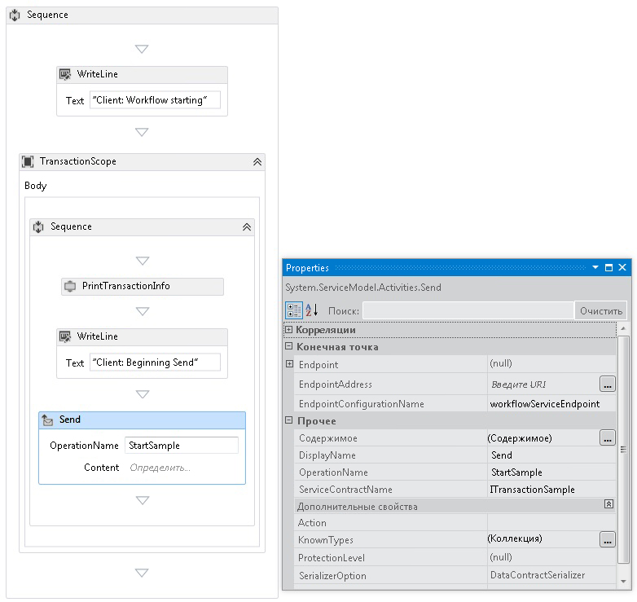</span><span class="sxs-lookup"><span data-stu-id="807d1-213"></span></span>  
  
9. <span data-ttu-id="807d1-214">Нажмите кнопку **определить...**  ссылку и задайте следующие параметры:</span><span class="sxs-lookup"><span data-stu-id="807d1-214">Click the **Define...** link and make the following settings:</span></span>  
  
     <span data-ttu-id="807d1-215"></span><span class="sxs-lookup"><span data-stu-id="807d1-215"></span></span>  
  
10. <span data-ttu-id="807d1-216">Щелкните правой кнопкой мыши <xref:System.ServiceModel.Activities.Send> действие и выберите **создать ReceiveReply**.</span><span class="sxs-lookup"><span data-stu-id="807d1-216">Right click the <xref:System.ServiceModel.Activities.Send> activity and select **Create ReceiveReply**.</span></span> <span data-ttu-id="807d1-217">Действие <xref:System.ServiceModel.Activities.ReceiveReply> будет автоматически помещено после действия <xref:System.ServiceModel.Activities.Send>.</span><span class="sxs-lookup"><span data-stu-id="807d1-217">The <xref:System.ServiceModel.Activities.ReceiveReply> activity will be automatically placed after the <xref:System.ServiceModel.Activities.Send> activity.</span></span>  
  
11. <span data-ttu-id="807d1-218">Щелкните ссылку «Определить...» в действии ReceiveReplyForSend и задайте следующие параметры:</span><span class="sxs-lookup"><span data-stu-id="807d1-218">Click the Define... link on the ReceiveReplyForSend activity and make the following settings:</span></span>  
  
     <span data-ttu-id="807d1-219">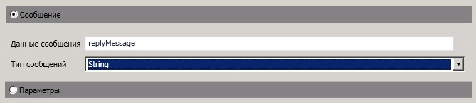</span><span class="sxs-lookup"><span data-stu-id="807d1-219"></span></span>  
  
12. <span data-ttu-id="807d1-220">Перетащите действие <xref:System.Activities.Statements.WriteLine>, поместите его между действиями <xref:System.ServiceModel.Activities.Send> и <xref:System.ServiceModel.Activities.ReceiveReply>, а также задайте для свойства <xref:System.Activities.Statements.WriteLine.Text%2A> значение "Client: Send complete".</span><span class="sxs-lookup"><span data-stu-id="807d1-220">Drag and drop a <xref:System.Activities.Statements.WriteLine> activity between the <xref:System.ServiceModel.Activities.Send> and <xref:System.ServiceModel.Activities.ReceiveReply> activities and set its <xref:System.Activities.Statements.WriteLine.Text%2A> property to "Client: Send complete."</span></span>  
  
13. <span data-ttu-id="807d1-221">Перетащите действие <xref:System.Activities.Statements.WriteLine>, поместите его после действия <xref:System.ServiceModel.Activities.ReceiveReply> и задайте для свойства <xref:System.Activities.Statements.WriteLine.Text%2A> значение "Client side: Reply received = " + replyMessage.</span><span class="sxs-lookup"><span data-stu-id="807d1-221">Drag and drop a <xref:System.Activities.Statements.WriteLine> activity after the <xref:System.ServiceModel.Activities.ReceiveReply> activity and set its <xref:System.Activities.Statements.WriteLine.Text%2A> property to "Client side: Reply received = " + replyMessage</span></span>  
  
14. <span data-ttu-id="807d1-222">Перетащите действие `PrintTransactionInfo` и поместите его после действия <xref:System.Activities.Statements.WriteLine>.</span><span class="sxs-lookup"><span data-stu-id="807d1-222">Drag and drop a `PrintTransactionInfo` activity after the <xref:System.Activities.Statements.WriteLine> activity.</span></span>  
  
15. <span data-ttu-id="807d1-223">Перетащите действие <xref:System.Activities.Statements.WriteLine> в конец рабочего процесса и задайте для свойства <xref:System.Activities.Statements.WriteLine.Text%2A> значение "Client workflow ends".</span><span class="sxs-lookup"><span data-stu-id="807d1-223">Drag and drop a <xref:System.Activities.Statements.WriteLine> activity at the end of the workflow and set its <xref:System.Activities.Statements.WriteLine.Text%2A> property to "Client workflow ends."</span></span> <span data-ttu-id="807d1-224">Завершенный рабочий процесс клиента должен выглядеть следующим образом на приведенной ниже схеме.</span><span class="sxs-lookup"><span data-stu-id="807d1-224">The completed client workflow should look like the following diagram.</span></span>  
  
     <span data-ttu-id="807d1-225">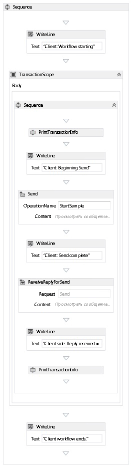</span><span class="sxs-lookup"><span data-stu-id="807d1-225"></span></span>  
  
16. <span data-ttu-id="807d1-226">Постройте решение.</span><span class="sxs-lookup"><span data-stu-id="807d1-226">Build the solution.</span></span>  
  
### <a name="create-the-service-application"></a><span data-ttu-id="807d1-227">Создание приложения службы</span><span class="sxs-lookup"><span data-stu-id="807d1-227">Create the Service application</span></span>  
  
1.  <span data-ttu-id="807d1-228">Добавьте в решение новый проект консольного приложения с именем `Service`.</span><span class="sxs-lookup"><span data-stu-id="807d1-228">Add a new Console Application project called `Service` to the solution.</span></span> <span data-ttu-id="807d1-229">Добавьте ссылки на следующие сборки:</span><span class="sxs-lookup"><span data-stu-id="807d1-229">Add references to the following assemblies:</span></span>  
  
    1.  <span data-ttu-id="807d1-230">System.Activities.dll</span><span class="sxs-lookup"><span data-stu-id="807d1-230">System.Activities.dll</span></span>  
  
    2.  <span data-ttu-id="807d1-231">System.ServiceModel.dll</span><span class="sxs-lookup"><span data-stu-id="807d1-231">System.ServiceModel.dll</span></span>  
  
    3.  <span data-ttu-id="807d1-232">System.ServiceModel.Activities.dll</span><span class="sxs-lookup"><span data-stu-id="807d1-232">System.ServiceModel.Activities.dll</span></span>  
  
2.  <span data-ttu-id="807d1-233">Откройте созданный файл Program.cs и следующий код:</span><span class="sxs-lookup"><span data-stu-id="807d1-233">Open the generated Program.cs file and the following code:</span></span>  
  
    ```  
    static void Main()  
          {  
              Console.WriteLine("Building the server.");  
              using (WorkflowServiceHost host = new WorkflowServiceHost(new DeclarativeServiceWorkflow(), new Uri("net.tcp://localhost:8000/TransactedReceiveService/Declarative")))  
              {                
                  //Start the server  
                  host.Open();  
                  Console.WriteLine("Service started.");  
  
                  Console.WriteLine();  
                  Console.ReadLine();  
                  //Shutdown  
                  host.Close();  
              };         
          }  
    ```  
  
3.  <span data-ttu-id="807d1-234">Добавьте к проекту следующий файл app.config.</span><span class="sxs-lookup"><span data-stu-id="807d1-234">Add the following app.config file to the project.</span></span>  
  
    ```xml  
    <?xml version="1.0" encoding="utf-8" ?>  
    <!-- Copyright © Microsoft Corporation.  All rights reserved. -->  
    <configuration>  
        <system.serviceModel>  
            <bindings>  
                <netTcpBinding>  
                    <binding transactionFlow="true" />  
                </netTcpBinding>  
            </bindings>  
        </system.serviceModel>  
    </configuration>  
    ```  
  
### <a name="create-the-client-application"></a><span data-ttu-id="807d1-235">Создание клиентского приложения</span><span class="sxs-lookup"><span data-stu-id="807d1-235">Create the client application</span></span>  
  
1.  <span data-ttu-id="807d1-236">Добавьте в решение новый проект консольного приложения с именем `Client`.</span><span class="sxs-lookup"><span data-stu-id="807d1-236">Add a new Console Application project called `Client` to the solution.</span></span> <span data-ttu-id="807d1-237">Добавьте ссылку на библиотеку System.Activities.dll.</span><span class="sxs-lookup"><span data-stu-id="807d1-237">Add a reference to System.Activities.dll.</span></span>  
  
2.  <span data-ttu-id="807d1-238">Откройте файл program.cs и добавьте следующий код:</span><span class="sxs-lookup"><span data-stu-id="807d1-238">Open the program.cs file and add the following code.</span></span>  
  
    ```  
    class Program  
        {  
  
            private static AutoResetEvent syncEvent = new AutoResetEvent(false);  
  
            static void Main(string[] args)  
            {  
                //Build client  
                Console.WriteLine("Building the client.");  
                WorkflowApplication client = new WorkflowApplication(new DeclarativeClientWorkflow());  
                client.Completed = Program.Completed;  
                client.Aborted = Program.Aborted;  
                client.OnUnhandledException = Program.OnUnhandledException;  
  
                //Wait for service to start  
                Console.WriteLine("Press ENTER once service is started.");  
                Console.ReadLine();  
  
                //Start the client              
                Console.WriteLine("Starting the client.");  
                client.Run();  
                syncEvent.WaitOne();  
  
                //Sample complete  
                Console.WriteLine();  
                Console.WriteLine("Client complete. Press ENTER to exit.");  
                Console.ReadLine();  
            }  
  
            private static void Completed(WorkflowApplicationCompletedEventArgs e)  
            {  
                Program.syncEvent.Set();  
            }  
  
            private static void Aborted(WorkflowApplicationAbortedEventArgs e)  
            {  
                Console.WriteLine("Client Aborted: {0}", e.Reason);  
                Program.syncEvent.Set();  
            }  
  
            private static UnhandledExceptionAction OnUnhandledException(WorkflowApplicationUnhandledExceptionEventArgs e)  
            {  
                Console.WriteLine("Client had an unhandled exception: {0}", e.UnhandledException);  
                return UnhandledExceptionAction.Cancel;  
            }  
        }  
    ```  
  
## <a name="see-also"></a><span data-ttu-id="807d1-239">См. также</span><span class="sxs-lookup"><span data-stu-id="807d1-239">See Also</span></span>  
 [<span data-ttu-id="807d1-240">Службы рабочих процессов</span><span class="sxs-lookup"><span data-stu-id="807d1-240">Workflow Services</span></span>](../../../../docs/framework/wcf/feature-details/workflow-services.md)  
 [<span data-ttu-id="807d1-241">Общие сведения о транзакциях Windows Communication Foundation</span><span class="sxs-lookup"><span data-stu-id="807d1-241">Windows Communication Foundation Transactions Overview</span></span>](../../../../docs/framework/wcf/feature-details/transactions-overview.md)  
 [<span data-ttu-id="807d1-242">Использование TransactedReceiveScope</span><span class="sxs-lookup"><span data-stu-id="807d1-242">Use of TransactedReceiveScope</span></span>](../../../../docs/framework/windows-workflow-foundation/samples/use-of-transactedreceivescope.md)
