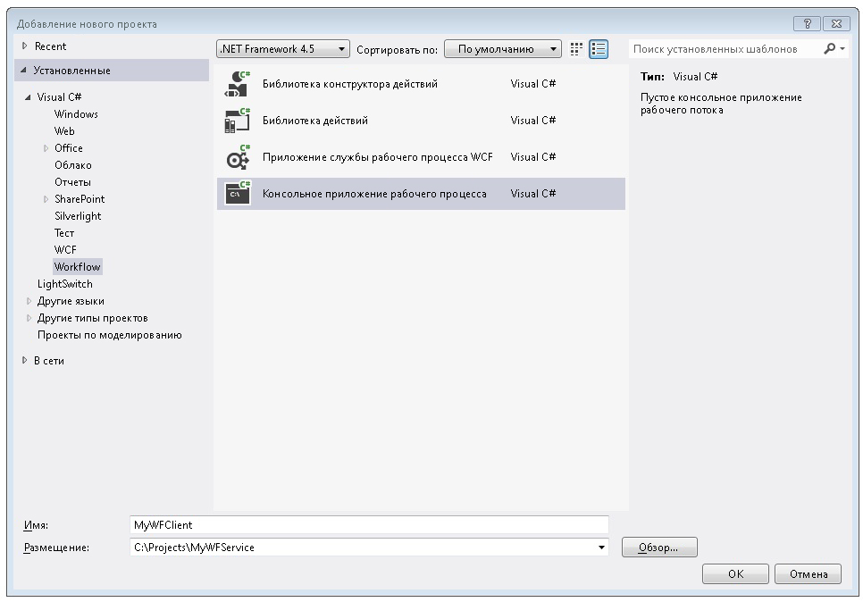
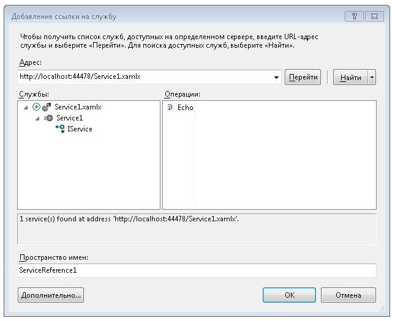
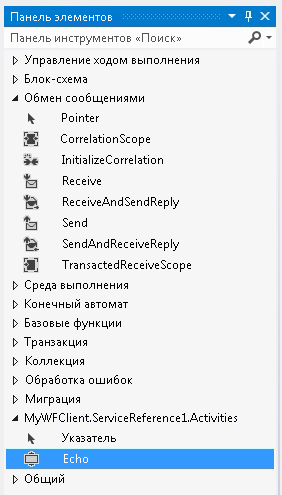
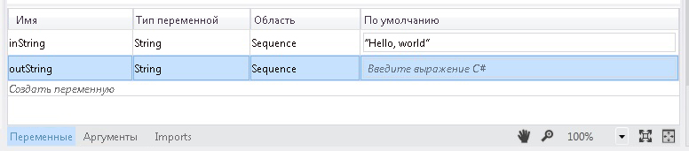
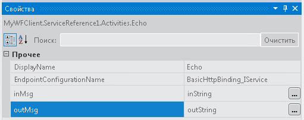
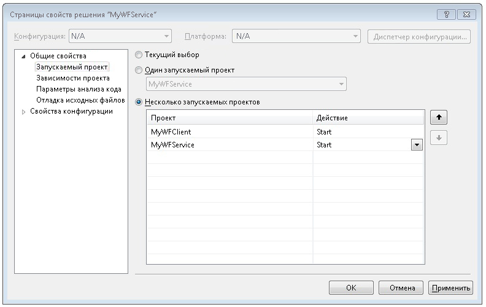

# Как получить доступ к службе из приложения рабочего процесса
В этом разделе описывается вызов службы рабочего процесса из консольного приложения рабочего процесса. Он зависит от выполнения [как: создание службы рабочего процесса с действиями обмена сообщениями](../../../../docs/framework/wcf/feature-details/how-to-create-a-workflow-service-with-messaging-activities.md) раздела. Несмотря на то, что в этом разделе описывается вызов службы рабочего процесса в приложении рабочего процесса, можно использовать те же методы для вызова любой службы Windows Communication Foundation (WCF) из приложения рабочего процесса.

### Создание проекта консольного приложения рабочего процесса

1.  Запустите [!INCLUDE[vs_current_long](../../../../includes/vs-current-long-md.md)].

2.  Загрузите проект MyWFService, созданный в [как: создание службы рабочего процесса с действиями обмена сообщениями](../../../../docs/framework/wcf/feature-details/how-to-create-a-workflow-service-with-messaging-activities.md) раздела.

3.  Щелкните правой кнопкой мыши **MyWFService** решение в **обозревателе решений** и выберите **добавить**, **новый проект**. Выберите **рабочего процесса** в **установленные шаблоны** и **консольное приложение рабочего процесса** в списке типов проектов. Назовите проект MyWFClient и используйте расположение по умолчанию, как показано на следующем рисунке.

     

     Нажмите кнопку **ОК** кнопку, чтобы закрыть **добавить диалоговое окно нового проекта**.

4.  После создания проекта в конструкторе откроется файл Workflow1.xaml. Нажмите кнопку **элементов** tab, чтобы открыть панель элементов, если это не еще открыта и щелкните вешку, чтобы не закрывайте окно панели элементов.

5.  Нажмите клавишу **Ctrl**+**F5** для построения и запуска службы. Как и раньше, будет запущен ASP.NET Development Server, а в обозревателе Internet Explorer откроется страница справки WCF. Запомните URI этой страницы, поскольку его будет необходимо использовать в следующем шаге.

     

6.  Щелкните правой кнопкой мыши **MyWFClient** в проекте **обозревателе решений** и выберите **добавить** > **ссылки на службу**. Нажмите кнопку **Discover** кнопку для поиска текущего решения для всех служб. Нажмите треугольник рядом с Service1.xamlx в списке «Службы». Нажмите треугольник рядом с Service1, чтобы открыть список контрактов, реализованных службой Service1. Разверните **Service1** узел в **служб** списка. Операцию Echo отображается в **операций** так, как показано на следующем рисунке.

     

     Оставьте пространство имен по умолчанию и нажмите кнопку **ОК** Отклонить **Add Service Reference** диалоговое окно. Отобразится следующее диалоговое окно.

     

     Нажмите кнопку **ОК** для закрытия диалога. Затем, чтобы выполнить сборку решения, нажмите сочетание клавиш CTRL+SHIFT+B. Обратите внимание, что на панели элементов был добавлен новый раздел называется **MyWFClient.ServiceReference1.Activities**. Разверните этот раздел и обратите внимание на действие с именем Echo, которое было добавлено, как показано на следующем рисунке.

     

7.  Перетащите действие <xref:System.Activities.Statements.Sequence> в область конструктора. Под **поток управления** разделе области элементов.

8.  С помощью <xref:System.Activities.Statements.Sequence> щелкните действие в фокусе, **переменных** ссылку и добавьте строковую переменную с именем `inString`. Присвойте переменной значение по умолчанию `"Hello, world"` а также строковую переменную с именем `outString` как показано на следующей схеме.

     

9. Перетаскивание **Echo** действия в <xref:System.Activities.Statements.Sequence>. В окне свойств привязки `inMsg` аргумент `inString` переменной и `outMsg` аргумент `outString` переменной, как показано на следующем рисунке. При этом операции будет передано значение переменной `inString`, а затем будет принято возвращаемое значение и помещено в переменную `outString`.

     

10. Перетаскивание **WriteLine** действия ниже **Echo** действия, чтобы отобразить строку, возвращаемую вызовом службы. **WriteLine** действие находится в **примитивы** на панели элементов. Привязать **текст** аргумент **WriteLine** действие `outString` переменных, введя `outString` в текстовое поле на **WriteLine** действия. После этого рабочий процесс должен выглядеть так, как показано на следующем рисунке.

     

11. Щелкните правой кнопкой мыши решение MyWFService и выберите **назначить запускаемые проекты...** . Выберите **несколько запускаемых проектов** "переключатель" и выберите **запустить** для каждого проекта в **действие** столбца, как показано на следующем рисунке.

     

12. Используйте сочетание клавиш Ctrl+F5 для запуска службы и клиента. ASP.NET Development Server размещает службу, Internet Explorer откроется страница справки WCF и клиентское приложение рабочего процесса запускается в окне консоли и отображает строки, возвращенные из службы («Hello, world»).

## См. также

- [Службы рабочих процессов](../../../../docs/framework/wcf/feature-details/workflow-services.md)
- [Практическое руководство. Создание службы рабочего процесса с помощью действий обмена сообщениями](../../../../docs/framework/wcf/feature-details/how-to-create-a-workflow-service-with-messaging-activities.md)
- [Использование службы WCF из рабочего процесса в веб-проекте](https://go.microsoft.com/fwlink/?LinkId=207725)