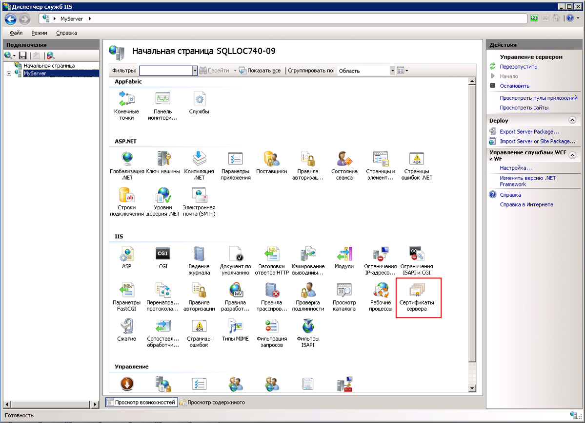
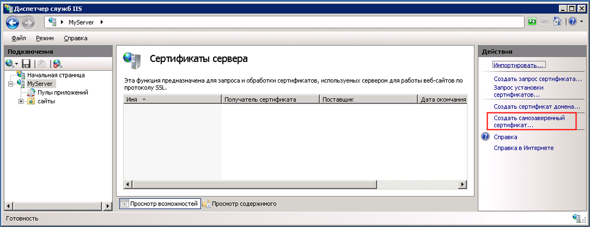
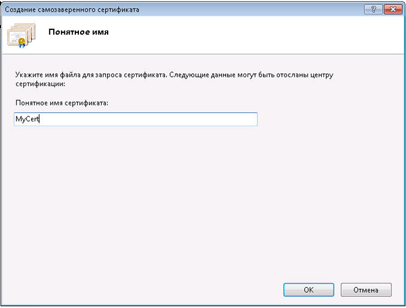
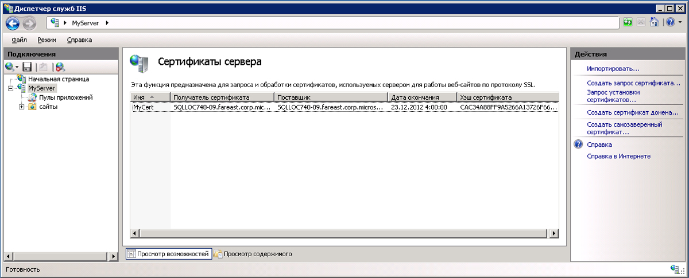
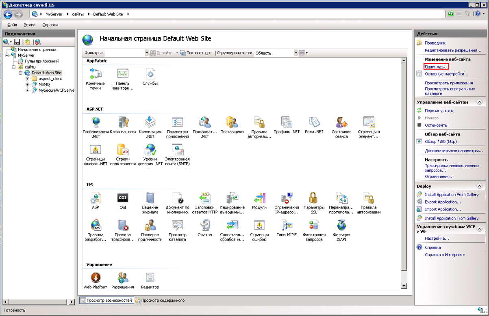
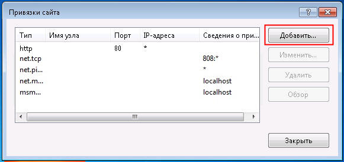
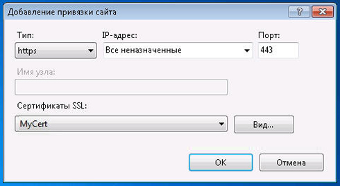
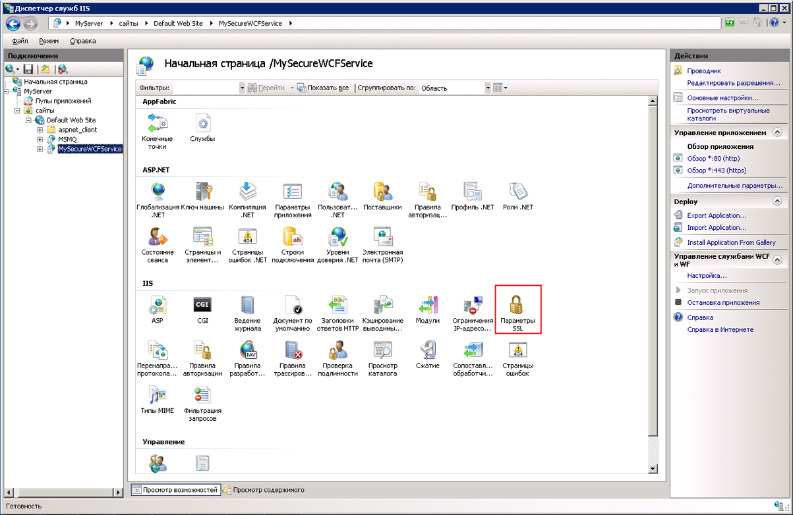
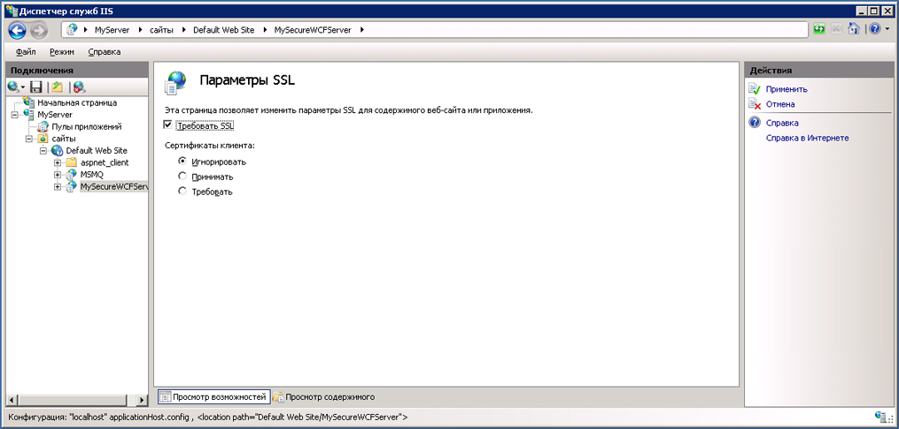

# <a name="how-to-configure-an-iis-hosted-wcf-service-with-ssl"></a><span data-ttu-id="15cc0-102">Как настраивать протокол SSL в службе WCF, размещенной в IIS</span><span class="sxs-lookup"><span data-stu-id="15cc0-102">How to: Configure an IIS-hosted WCF service with SSL</span></span>
<span data-ttu-id="15cc0-103">В этом разделе описано, как настроить размещенную в IIS службу WCF для использования безопасности транспорта HTTP.</span><span class="sxs-lookup"><span data-stu-id="15cc0-103">This topic describes how to set up an IIS-hosted WCF service to use HTTP transport security.</span></span> <span data-ttu-id="15cc0-104">Для безопасности транспорта HTTP требуется, чтобы SSL-сертификат был зарегистрирован в службах IIS.</span><span class="sxs-lookup"><span data-stu-id="15cc0-104">HTTP transport security requires an SSL certificate to be registered with IIS.</span></span> <span data-ttu-id="15cc0-105">Если SSL-сертификат не установлен, для создания тестового сертификата можно использовать службы IIS.</span><span class="sxs-lookup"><span data-stu-id="15cc0-105">If you do not have an SSL certificate you can use IIS to generate a test certificate.</span></span> <span data-ttu-id="15cc0-106">Затем необходимо добавить SSL-привязку для проекта веб-сайта и установить свойства проверки подлинности веб-сайта.</span><span class="sxs-lookup"><span data-stu-id="15cc0-106">Next you must add an SSL binding to the web site and configure the web site’s authentication properties.</span></span> <span data-ttu-id="15cc0-107">Наконец, необходимо настроить службу WCF на использование протокола HTTPS.</span><span class="sxs-lookup"><span data-stu-id="15cc0-107">Finally you need to configure the WCF service to use HTTPS.</span></span>  
  
### <a name="creating-a-self-signed-certificate"></a><span data-ttu-id="15cc0-108">Создание самозаверяющего сертификата</span><span class="sxs-lookup"><span data-stu-id="15cc0-108">Creating a Self-Signed Certificate</span></span>  
  
1.  <span data-ttu-id="15cc0-109">Откройте диспетчер служб IIS (inetmgr.exe) и выберите имя компьютера в левой части представления в виде дерева.</span><span class="sxs-lookup"><span data-stu-id="15cc0-109">Open Internet Information Services Manager (inetmgr.exe), and select your computer name in the left-hand tree view.</span></span> <span data-ttu-id="15cc0-110">В правой части экрана выберите сертификаты сервера</span><span class="sxs-lookup"><span data-stu-id="15cc0-110">On the right-hand side of the screen select Server Certificates</span></span>  
  
     <span data-ttu-id="15cc0-111"></span><span class="sxs-lookup"><span data-stu-id="15cc0-111"></span></span>  
  
2.  <span data-ttu-id="15cc0-112">В окне сертификатов сервера щелкните **создать самозаверяющий сертификат...**</span><span class="sxs-lookup"><span data-stu-id="15cc0-112">In the Server Certificates window click the **Create Self-Signed Certificate….**</span></span> <span data-ttu-id="15cc0-113">Связь.</span><span class="sxs-lookup"><span data-stu-id="15cc0-113">Link.</span></span>  
  
     <span data-ttu-id="15cc0-114"></span><span class="sxs-lookup"><span data-stu-id="15cc0-114"></span></span>  
  
3.  <span data-ttu-id="15cc0-115">Введите понятное имя самозаверяющего сертификата и нажмите кнопку **ОК**.</span><span class="sxs-lookup"><span data-stu-id="15cc0-115">Enter a friendly name for the self-signed certificate and click **OK**.</span></span>  
  
     <span data-ttu-id="15cc0-116"></span><span class="sxs-lookup"><span data-stu-id="15cc0-116"></span></span>  
  
     <span data-ttu-id="15cc0-117">Теперь созданный самозаверяющий сертификат сведения отображаются в **сертификаты сервера** окна.</span><span class="sxs-lookup"><span data-stu-id="15cc0-117">The newly created self-signed certificate details are now shown in the **Server Certificates** window.</span></span>  
  
     <span data-ttu-id="15cc0-118"></span><span class="sxs-lookup"><span data-stu-id="15cc0-118"></span></span>  
  
     <span data-ttu-id="15cc0-119">Созданный сертификат устанавливается в хранилище доверенных корневых центров сертификации.</span><span class="sxs-lookup"><span data-stu-id="15cc0-119">The generated certificate is installed in the Trusted Root Certification Authorities store.</span></span>  
  
### <a name="add-ssl-binding"></a><span data-ttu-id="15cc0-120">Добавление привязки SSL</span><span class="sxs-lookup"><span data-stu-id="15cc0-120">Add SSL Binding</span></span>  
  
1.  <span data-ttu-id="15cc0-121">В диспетчере служб IIS разверните **сайтов** папки и затем **веб-сайт по умолчанию** папки в представлении дерева в левой части экрана.</span><span class="sxs-lookup"><span data-stu-id="15cc0-121">Still in Internet Information Services Manager, expand the **Sites** folder and then the **Default Web Site** folder in the tree view on the left-hand side of the screen.</span></span>  
  
2.  <span data-ttu-id="15cc0-122">Нажмите кнопку **привязки...**</span><span class="sxs-lookup"><span data-stu-id="15cc0-122">Click the **Bindings….**</span></span> <span data-ttu-id="15cc0-123">Связать **действия** раздел в правой верхней части окна.</span><span class="sxs-lookup"><span data-stu-id="15cc0-123">Link in the **Actions** section in the upper right hand portion of the window.</span></span>  
  
     <span data-ttu-id="15cc0-124"></span><span class="sxs-lookup"><span data-stu-id="15cc0-124"></span></span>  
  
3.  <span data-ttu-id="15cc0-125">В окне «привязки сайта» выберите **добавить** кнопки.</span><span class="sxs-lookup"><span data-stu-id="15cc0-125">In the Site Bindings window click the **Add** button.</span></span>  
  
     <span data-ttu-id="15cc0-126"></span><span class="sxs-lookup"><span data-stu-id="15cc0-126"></span></span>  
  
4.  <span data-ttu-id="15cc0-127">В **Добавление привязки сайта** диалоговое окно, выберите https для типа и понятное имя самозаверяющего сертификата, только что создан.</span><span class="sxs-lookup"><span data-stu-id="15cc0-127">In the **Add Site Binding** dialog, select https for the type and the friendly name of the self-signed certificate you just created.</span></span>  
  
     <span data-ttu-id="15cc0-128"></span><span class="sxs-lookup"><span data-stu-id="15cc0-128"></span></span>  
  
### <a name="configure-virtual-directory-for-ssl"></a><span data-ttu-id="15cc0-129">Настройка виртуального каталога для SSL</span><span class="sxs-lookup"><span data-stu-id="15cc0-129">Configure Virtual Directory for SSL</span></span>  
  
1.  <span data-ttu-id="15cc0-130">В диспетчере служб IIS выберите виртуальный каталог, содержащий безопасную службу WCF.</span><span class="sxs-lookup"><span data-stu-id="15cc0-130">Still in Internet Information Services Manager, select the virtual directory that contains your WCF secure service.</span></span>  
  
2.  <span data-ttu-id="15cc0-131">В центральной области окна выберите **параметры SSL** в разделе IIS.</span><span class="sxs-lookup"><span data-stu-id="15cc0-131">In the center pane of the window, select **SSL Settings** in the IIS section.</span></span>  
  
     <span data-ttu-id="15cc0-132"></span><span class="sxs-lookup"><span data-stu-id="15cc0-132"></span></span>  
  
3.  <span data-ttu-id="15cc0-133">На панели параметров SSL установите **Требовать SSL** флажок и нажмите кнопку **применить** ссылку в **действия** раздел на правую часть экрана.</span><span class="sxs-lookup"><span data-stu-id="15cc0-133">In the SSL Settings pane, select the **Require SSL** checkbox and click the **Apply** link in the **Actions** section on the right hand side of the screen.</span></span>  
  
     <span data-ttu-id="15cc0-134"></span><span class="sxs-lookup"><span data-stu-id="15cc0-134"></span></span>  
  
### <a name="configure-wcf-service-for-http-transport-security"></a><span data-ttu-id="15cc0-135">Настройка службы WCF для безопасности транспорта HTTP</span><span class="sxs-lookup"><span data-stu-id="15cc0-135">Configure WCF Service for HTTP Transport Security</span></span>  
  
1.  <span data-ttu-id="15cc0-136">В файле web.config службы WCF настройте привязку HTTP на использование безопасности транспорта, как показано в следующем фрагменте XML.</span><span class="sxs-lookup"><span data-stu-id="15cc0-136">In the WCF service’s web.config configure the HTTP binding to use transport security as shown in the following XML.</span></span>  
  
    ```xml  
    <bindings>  
          <basicHttpBinding>  
            <binding name="secureHttpBinding">  
              <security mode="Transport">  
                <transport clientCredentialType="None"/>  
              </security>  
            </binding>  
          </basicHttpBinding>  
    </bindings>  
    ```  
  
2.  <span data-ttu-id="15cc0-137">Укажите службу и конечную точку службы, как показано в следующем фрагменте XML.</span><span class="sxs-lookup"><span data-stu-id="15cc0-137">Specify your service and service endpoint as shown in the following XML.</span></span>  
  
    ```xml  
    <services>  
          <service name="MySecureWCFService.Service1">  
            <endpoint address=""  
                      binding="basicHttpBinding"  
                      bindingConfiguration="secureHttpBinding"  
                      contract="MySecureWCFService.IService1"/>  
  
            <endpoint address="mex"  
                      binding="mexHttpsBinding"  
                      contract="IMetadataExchange" />  
          </service>  
    </services>  
    ```  
  
## <a name="example"></a><span data-ttu-id="15cc0-138">Пример</span><span class="sxs-lookup"><span data-stu-id="15cc0-138">Example</span></span>  
 <span data-ttu-id="15cc0-139">Ниже приведен полный пример файла web.config для службы WCF, использующей безопасность транспорта HTTP</span><span class="sxs-lookup"><span data-stu-id="15cc0-139">The following is a complete example of a web.config file for a WCF service using HTTP transport security</span></span>  
  
```xml  
<?xml version="1.0"?>  
<configuration>  
  
  <system.web>  
    <compilation debug="true" targetFramework="4.0" />  
  </system.web>  
  <system.serviceModel>  
    <services>  
      <service name="MySecureWCFService.Service1">  
        <endpoint address=""  
                  binding="basicHttpBinding"  
                  bindingConfiguration="secureHttpBinding"  
                  contract="MySecureWCFService.IService1"/>  
  
        <endpoint address="mex"  
                  binding="mexHttpsBinding"  
                  contract="IMetadataExchange" />  
      </service>  
    </services>  
    <bindings>  
      <basicHttpBinding>  
        <binding name="secureHttpBinding">  
          <security mode="Transport">  
            <transport clientCredentialType="None"/>  
          </security>  
        </binding>  
      </basicHttpBinding>  
    </bindings>  
    <behaviors>  
      <serviceBehaviors>  
        <behavior>  
          <!-- To avoid disclosing metadata information, set the value below to false and remove the metadata endpoint above before deployment -->  
          <serviceMetadata httpsGetEnabled="true"/>  
          <!-- To receive exception details in faults for debugging purposes, set the value below to true.  Set to false before deployment to avoid disclosing exception information -->  
          <serviceDebug includeExceptionDetailInFaults="false"/>  
        </behavior>  
      </serviceBehaviors>  
    </behaviors>  
    <serviceHostingEnvironment multipleSiteBindingsEnabled="true" />  
  </system.serviceModel>  
  <system.webServer>  
    <modules runAllManagedModulesForAllRequests="true"/>  
  </system.webServer>  
  
</configuration>  
```  
  
## <a name="see-also"></a><span data-ttu-id="15cc0-140">См. также</span><span class="sxs-lookup"><span data-stu-id="15cc0-140">See Also</span></span>  
 [<span data-ttu-id="15cc0-141">Размещение в службах IIS</span><span class="sxs-lookup"><span data-stu-id="15cc0-141">Hosting in Internet Information Services</span></span>](../../../../docs/framework/wcf/feature-details/hosting-in-internet-information-services.md)  
 [<span data-ttu-id="15cc0-142">Инструкции по размещению IIS службы Интернета</span><span class="sxs-lookup"><span data-stu-id="15cc0-142">Internet Information Service Hosting Instructions</span></span>](../../../../docs/framework/wcf/samples/internet-information-service-hosting-instructions.md)  
 [<span data-ttu-id="15cc0-143">Рекомендации по размещению в службах IIS</span><span class="sxs-lookup"><span data-stu-id="15cc0-143">Internet Information Services Hosting Best Practices</span></span>](../../../../docs/framework/wcf/feature-details/internet-information-services-hosting-best-practices.md)  
 [<span data-ttu-id="15cc0-144">Размещение в службах IIS с использованием встроенного кода</span><span class="sxs-lookup"><span data-stu-id="15cc0-144">IIS Hosting Using Inline Code</span></span>](../../../../docs/framework/wcf/samples/iis-hosting-using-inline-code.md)
