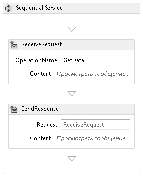
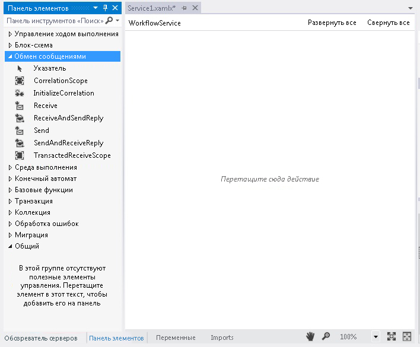
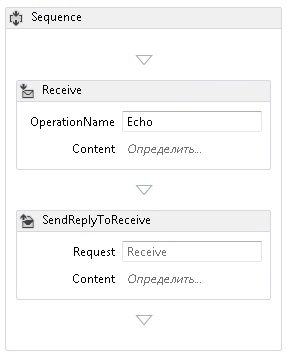
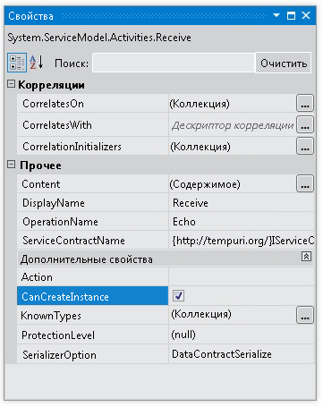
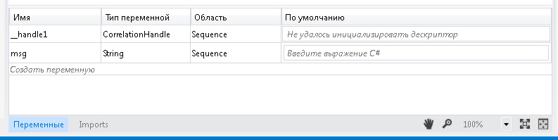
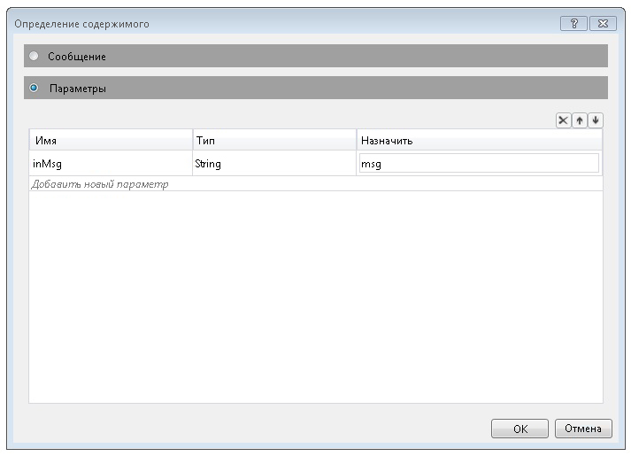
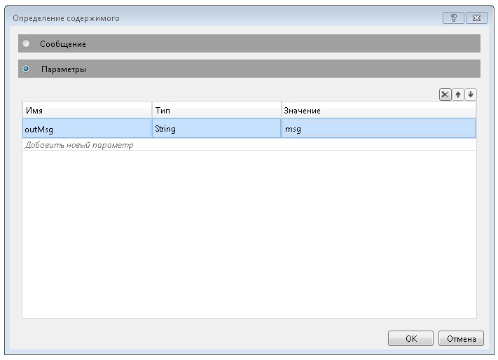
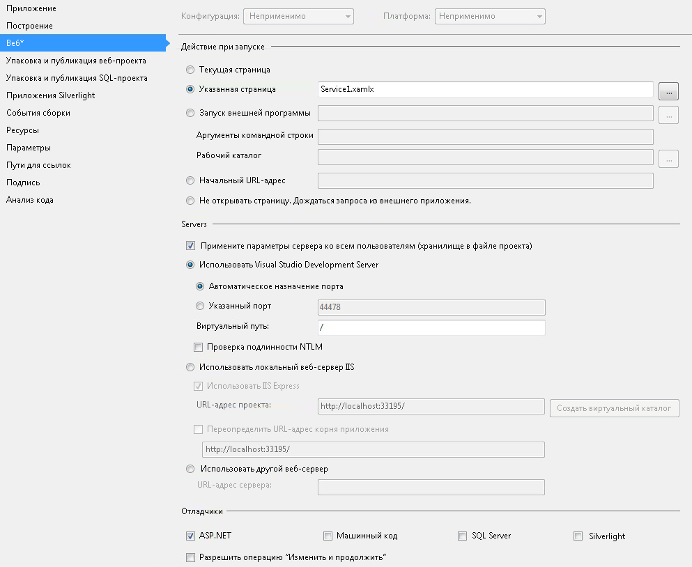

# Как создать службу рабочего процесса с помощью действий обмена сообщениями
В этом разделе приведены сведения о том, как создать простую службу рабочего процесса с помощью действий обмена сообщениями. В нем рассматривается механизм создания службы рабочего процесса, когда служба состоит только из действий обмена сообщениями. В реальных службах рабочий процесс содержит множество других действий. Служба реализует одну операцию с именем Echo, которая принимает строку и возвращает строку вызывающему коду. Это первый из двух разделов. Следующий раздел [How To: доступ к службе из рабочего процесса приложения](../../../../docs/framework/wcf/feature-details/how-to-access-a-service-from-a-workflow-application.md) рассматривается процесс создания приложения рабочего процесса, способного обращаться к службе, созданной в этом разделе.  
  
### Создание проекта службы рабочего процесса  
  
1.  Запустите [!INCLUDE[vs_current_long](../../../../includes/vs-current-long-md.md)].  
  
2.  Нажмите кнопку **файл** меню, выберите **New**, а затем **проекта** для отображения **диалоговое окно нового проекта**. Выберите **рабочего процесса** из списка установленных шаблонов и **приложение службы рабочего процесса WCF** в списке типов проектов. Присвойте проекту имя `MyWFService` и используйте расположение по умолчанию, как показано на следующем рисунке.  
  
     Нажмите кнопку **ОК** кнопку, чтобы закрыть **диалоговое окно нового проекта**.  
  
3.  После создания проекта в конструкторе открывается файл Service1.xamlx, как показано на следующем рисунке.  
  
       
  
     Щелкните правой кнопкой мыши действие **последовательная служба** и выберите **удалить**.  
  
### Реализация службы рабочего процесса  
  
1.  Выберите **элементов** вкладка в левой части экрана, чтобы открыть панель элементов и щелкните вешку, чтобы окно оставалось открытым. Разверните **Messaging** панели элементов для отображения действий обмена сообщениями и шаблоны действий обмена сообщениями, как показано на следующем рисунке.  
  
       
  
2.  Перетаскивание **ReceiveAndSendReply** шаблона в конструктор рабочих процессов. При этом создается <xref:System.Activities.Statements.Sequence> действие с **Receive** действия, за которым следует <xref:System.ServiceModel.Activities.SendReply> действия, как показано на следующем рисунке.  
  
       
  
     Обратите внимание, что у действия <xref:System.ServiceModel.Activities.SendReply> свойство <xref:System.ServiceModel.Activities.SendReply.Request%2A> имеет значение `Receive`, это имя действия <xref:System.ServiceModel.Activities.Receive>, на которое отвечает действие <xref:System.ServiceModel.Activities.SendReply>.  
  
3.  В <xref:System.ServiceModel.Activities.Receive> тип действия `Echo` в текстовое поле с меткой **Имя_операции**. Это задает имя операции, которую реализует служба.  
  
       
  
4.  С помощью <xref:System.ServiceModel.Activities.Receive> действии, выбранном, откройте окно свойств Если он еще не открыт, щелкнув **представление** меню и выбрав **окно "Свойства"**. В **окно "Свойства"** прокрутите вниз, пока не увидите **CanCreateInstance** и установите флажок, как показано на следующем рисунке. Этот параметр позволяет службе рабочего процесса создавать новый экземпляр службы при получении сообщения (если это необходимо).  
  
       
  
5.  Выберите <xref:System.Activities.Statements.Sequence> действие и нажмите кнопку **переменных** кнопку в левом нижнем углу конструктора. Откроется редактор переменных. Нажмите кнопку **Создание переменной** ссылку, чтобы добавить переменную для хранения строки, отправляемой в операции. Имя переменной `msg` и задайте его **переменной** введите строку, как показано на следующем рисунке.  
  
       
  
     Нажмите кнопку **переменных** кнопку, чтобы закрыть редактор переменных.  
  
6.  Нажмите кнопку **определить...** ссылка в **содержимого** текстовое поле в <xref:System.ServiceModel.Activities.Receive> действие, чтобы отобразить **определение содержимого** диалоговое окно. Выберите **параметры** кнопку-переключатель, нажмите кнопку **добавьте параметр** , введите `inMsg` в **имя** текстовое поле, выберите **строка**в **тип** раскрывающемся поле со списком, а также тип `msg` в **назначено** текстового поля, как показано на следующем рисунке.  
  
       
  
     Это указывает, что действие Receive получает строковый параметр, а данные будут привязаны к переменной `msg`. Нажмите кнопку **ОК** закрыть **определение содержимого** диалоговое окно.  
  
7.  Нажмите кнопку **определить...**  ссылку в **содержимого** поле <xref:System.ServiceModel.Activities.SendReply> действие, чтобы отобразить **определение содержимого** диалоговое окно. Выберите **параметры** кнопку-переключатель, нажмите кнопку **добавьте параметр** , введите `outMsg` в **имя** текстовом поле выберите **строка**в **тип** раскрывающегося списка и `msg` в **значение** текстового поля, как показано на следующем рисунке.  
  
       
  
     Это указывает, что действие <xref:System.ServiceModel.Activities.SendReply> отправляет сообщение или тип контракта сообщения, а данные привязаны к переменной `msg`. Поскольку это действие <xref:System.ServiceModel.Activities.SendReply>, данные в `msg` используются для заполнения сообщения, которое действие возвращает клиенту. Нажмите кнопку **ОК** закрыть **определение содержимого** диалоговое окно.  
  
8.  Сохраните и выполните сборку решения, нажав кнопку **построения** меню и выбрав **построить решение**.  
  
## Настройка проекта службы рабочего процесса  
 Служба рабочего процесса создана. В этом разделе приведены сведения о конфигурации решения службы рабочего процесса, чтобы упростить ее размещение и выполнение. Для размещения службы в этом решении используется сервер разработки ASP.NET.  
  
#### Задание параметров запуска проекта  
  
1.  В **обозревателе решений**, щелкните правой кнопкой мыши **MyWFService** и выберите **свойства** для отображения **свойства проекта** диалоговое окно.  
  
2.  Выберите **Web** и выберите **определенную страницу** под **действие при запуске** и тип `Service1.xamlx` в текстовом поле, как показано на следующем рисунке.  
  
       
  
     Служба, которая определена в Service1.xamlx, будет размещена на сервере разработки ASP.NET.  
  
3.  Чтобы запустить службу, нажмите сочетание клавиш CTRL+F5. В нижней правой области рабочего стола появится значок сервера разработки ASP.NET, как показано на следующем рисунке.  
  
       
  
     Кроме того, в Internet Explorer для службы откроется справочная страница службы WCF.  
  
       
  
4.  Перейдите к [How To: доступ к службе из рабочего процесса приложения](../../../../docs/framework/wcf/feature-details/how-to-access-a-service-from-a-workflow-application.md) раздела, чтобы создать клиент рабочего процесса, вызывающего эту службу.  
  
## См. также  
 [Службы рабочих процессов](../../../../docs/framework/wcf/feature-details/workflow-services.md)  
 [Общие сведения о размещении служб рабочих процессов](../../../../docs/framework/wcf/feature-details/hosting-workflow-services-overview.md)  
 [Действия обмена сообщениями](../../../../docs/framework/wcf/feature-details/messaging-activities.md)
