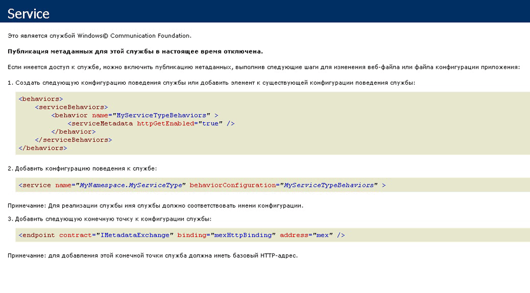

# <a name="how-to-host-a-non-service-workflow-in-iis"></a><span data-ttu-id="85342-102">Как разместить не являющийся службой рабочий процесс в службах IIS</span><span class="sxs-lookup"><span data-stu-id="85342-102">How to: Host a non-service workflow in IIS</span></span>
<span data-ttu-id="85342-103">Рабочие процессы, которые не являются службами рабочих процессов, должны быть размещены в службах IIS/WAS.</span><span class="sxs-lookup"><span data-stu-id="85342-103">Workflows that are not workflow services can be hosted under IIS/WAS.</span></span> <span data-ttu-id="85342-104">Это может оказаться полезным, если нужно разместить рабочий процесс, разработанный кем-то другим.</span><span class="sxs-lookup"><span data-stu-id="85342-104">This is useful when you need to host a workflow written by somebody else.</span></span> <span data-ttu-id="85342-105">Например, если необходимо повторно разместить конструктор рабочих процессов и разрешить пользователям создавать собственные рабочие процессы.</span><span class="sxs-lookup"><span data-stu-id="85342-105">For example, if you rehost the workflow designer and allow users to create their own workflows.</span></span>  <span data-ttu-id="85342-106">Размещение не являющихся службами рабочих процессов в службах IIS обеспечивает поддержку таких функций, как перезапуск процессов, завершение работы при ожидании, наблюдение за работоспособностью процессов и активация на основе сообщений.</span><span class="sxs-lookup"><span data-stu-id="85342-106">Hosting non-service workflows in IIS provides support for features like process recycling, idle shutdown, process health monitoring, and message-based activation.</span></span> <span data-ttu-id="85342-107">Службы рабочих процессов, размещенные в службах IIS, содержат действия <xref:System.ServiceModel.Activities.Receive> и активируются в момент получения сообщения службами IIS.</span><span class="sxs-lookup"><span data-stu-id="85342-107">Workflow services hosted in IIS contain <xref:System.ServiceModel.Activities.Receive> activities and are activated when a message is received by IIS.</span></span> <span data-ttu-id="85342-108">Не являющиеся службами рабочие процессы не содержат действий обмена сообщениями и по умолчанию не могут быть активированы отправкой сообщения.</span><span class="sxs-lookup"><span data-stu-id="85342-108">Non-service workflows do not contain messaging activities, and by default cannot be activated by sending a message.</span></span>  <span data-ttu-id="85342-109">Чтобы создать экземпляр рабочего процесса, необходимо создать класс, производный от <xref:System.ServiceModel.Activities.WorkflowHostingEndpoint>, и определить контракт службы, содержащий операции.</span><span class="sxs-lookup"><span data-stu-id="85342-109">You must derive a class from <xref:System.ServiceModel.Activities.WorkflowHostingEndpoint> and define a service contract that contains operations to create an instance of the workflow.</span></span> <span data-ttu-id="85342-110">Этот раздел содержит пошаговое руководство по созданию простого рабочего процесса, определение контракта службы, клиент может использовать для активации рабочего процесса и создания класса, производного от класса <xref:System.ServiceModel.Activities.WorkflowHostingEndpoint> для прослушивания запросов на создание рабочего процесса, которая использует контракт службы.</span><span class="sxs-lookup"><span data-stu-id="85342-110">This topic will walk you through creating a simple workflow, defining a service contract a client can use to activate the workflow, and deriving a class from <xref:System.ServiceModel.Activities.WorkflowHostingEndpoint> which uses the service contract to listen for workflow creating requests.</span></span>  
  
### <a name="create-a-simple-workflow"></a><span data-ttu-id="85342-111">Создание простого рабочего процесса</span><span class="sxs-lookup"><span data-stu-id="85342-111">Create a simple workflow</span></span>  
  
1.  <span data-ttu-id="85342-112">Создайте пустое решение [!INCLUDE[vs_current_long](../../../../includes/vs-current-long-md.md)] с именем `CreationEndpointTest`.</span><span class="sxs-lookup"><span data-stu-id="85342-112">Create a new [!INCLUDE[vs_current_long](../../../../includes/vs-current-long-md.md)] empty solution called `CreationEndpointTest`.</span></span>  
  
2.  <span data-ttu-id="85342-113">Добавьте в него новый проект служебного приложения рабочего процесса WCF под названием `SimpleWorkflow`.</span><span class="sxs-lookup"><span data-stu-id="85342-113">Add a new WCF Workflow Service Application project called `SimpleWorkflow` to the solution.</span></span> <span data-ttu-id="85342-114">Откроется конструктор рабочих процессов.</span><span class="sxs-lookup"><span data-stu-id="85342-114">The workflow designer will open.</span></span>  
  
3.  <span data-ttu-id="85342-115">Удалите действия ReceiveRequest и SendResponse.</span><span class="sxs-lookup"><span data-stu-id="85342-115">Delete the ReceiveRequest and SendResponse activities.</span></span> <span data-ttu-id="85342-116">Это как раз те действия, которые делают рабочий процесс службой.</span><span class="sxs-lookup"><span data-stu-id="85342-116">These activities are what makes a workflow a workflow service.</span></span> <span data-ttu-id="85342-117">Поскольку мы не работаем со службами рабочих процессов, они нам не нужны.</span><span class="sxs-lookup"><span data-stu-id="85342-117">Since we are not working with a workflow service, we no longer need them.</span></span>  
  
4.  <span data-ttu-id="85342-118">Установите свойство DisplayName действия последовательности в значение «Sequential Workflow».</span><span class="sxs-lookup"><span data-stu-id="85342-118">Set the DisplayName for the sequence activity to "Sequential Workflow".</span></span>  
  
5.  <span data-ttu-id="85342-119">Переименуйте файл Service1.xamlx в Workflow1.xamlx.</span><span class="sxs-lookup"><span data-stu-id="85342-119">Rename Service1.xamlx to Workflow1.xamlx.</span></span>  
  
6.  <span data-ttu-id="85342-120">Щелкните конструктор за пределами действия последовательности и задайте свойства Name и ConfigurationName для «Workflow1».</span><span class="sxs-lookup"><span data-stu-id="85342-120">Click the designer outside of the sequence activity, and set the Name and ConfigurationName properties to "Workflow1"</span></span>  
  
7.  <span data-ttu-id="85342-121">Перетащите действие <xref:System.Activities.Statements.WriteLine> в раздел <xref:System.Activities.Statements.Sequence>.</span><span class="sxs-lookup"><span data-stu-id="85342-121">Drag a <xref:System.Activities.Statements.WriteLine> activity into the <xref:System.Activities.Statements.Sequence>.</span></span> <span data-ttu-id="85342-122"><xref:System.Activities.Statements.WriteLine> Действия можно найти в **примитивы** области элементов.</span><span class="sxs-lookup"><span data-stu-id="85342-122">The <xref:System.Activities.Statements.WriteLine> activity can be found in the **Primitives** section of the toolbox.</span></span> <span data-ttu-id="85342-123">Задать <xref:System.Activities.Statements.WriteLine.Text%2A> свойство <xref:System.Activities.Statements.WriteLine> действие «Hello, world».</span><span class="sxs-lookup"><span data-stu-id="85342-123">Set the <xref:System.Activities.Statements.WriteLine.Text%2A> property of the <xref:System.Activities.Statements.WriteLine> activity to "Hello, world".</span></span>  
  
     <span data-ttu-id="85342-124">После этого рабочий процесс должен выглядеть так, как показано на следующей схеме.</span><span class="sxs-lookup"><span data-stu-id="85342-124">The workflow should now look like the following diagram.</span></span>  
  
     <span data-ttu-id="85342-125"></span><span class="sxs-lookup"><span data-stu-id="85342-125"></span></span>  
  
### <a name="create-the-workflow-creation-service-contract"></a><span data-ttu-id="85342-126">Создайте контракт службы создания рабочего процесса</span><span class="sxs-lookup"><span data-stu-id="85342-126">Create the workflow creation service contract</span></span>  
  
1.  <span data-ttu-id="85342-127">Добавьте новый проект библиотеки классов с названием `Shared` в решение `CreationEndpointTest`.</span><span class="sxs-lookup"><span data-stu-id="85342-127">Add a new class library project called `Shared` to the `CreationEndpointTest` solution.</span></span>  
  
2.  <span data-ttu-id="85342-128">Добавьте в проект `Shared` ссылки на сборки System.ServiceModel.dll, System.Configuration и System.ServiceModel.Activities.</span><span class="sxs-lookup"><span data-stu-id="85342-128">Add a reference to System.ServiceModel.dll, System.Configuration, and System.ServiceModel.Activities to the `Shared` project.</span></span>  
  
3.  <span data-ttu-id="85342-129">Переименуйте файл Class1.cs в IWorkflowCreation.cs и вставьте в него следующий код.</span><span class="sxs-lookup"><span data-stu-id="85342-129">Rename the Class1.cs file to IWorkflowCreation.cs and the following code to the file.</span></span>  
  
    ```  
    using System;  
    using System.Collections.Generic;  
    using System.Linq;  
    using System.Text;  
    using System.ServiceModel;  
  
    namespace Shared  
    {  
        //service contract exposed from the endpoint  
        [ServiceContract(Name = "IWorkflowCreation")]  
        public interface IWorkflowCreation  
        {  
            [OperationContract(Name = "Create")]  
            Guid Create(IDictionary<string, object> inputs);  
  
            [OperationContract(Name = "CreateWithInstanceId", IsOneWay = true)]  
            void CreateWithInstanceId(IDictionary<string, object> inputs, Guid instanceId);  
        }  
    }  
    ```  
  
     <span data-ttu-id="85342-130">Данный контракт определяет две операции, обе из которых служат для создания нового экземпляра вновь созданного рабочего процесса, не являющегося службой.</span><span class="sxs-lookup"><span data-stu-id="85342-130">This contract defines two operations both create a new instance of the non-service workflow you just created.</span></span> <span data-ttu-id="85342-131">Один из них создает новый экземпляр с созданием идентификатора экземпляра, а второй позволяет указать идентификатор для нового экземпляра рабочего процесса.</span><span class="sxs-lookup"><span data-stu-id="85342-131">One creates a new instance with a generated instance ID and the other allows you to specify the instance ID for the new workflow instance.</span></span>  <span data-ttu-id="85342-132">Оба метода позволяют передавать параметры новому экземпляру рабочего процесса.</span><span class="sxs-lookup"><span data-stu-id="85342-132">Both methods allow you to pass in parameters to the new workflow instance.</span></span> <span data-ttu-id="85342-133">Этот контракт будет доступен через <xref:System.ServiceModel.Activities.WorkflowHostingEndpoint> разрешить клиентам для создания новых экземпляров рабочего процесса, не относящиеся к службе.</span><span class="sxs-lookup"><span data-stu-id="85342-133">This contract will be exposed by the <xref:System.ServiceModel.Activities.WorkflowHostingEndpoint> to allow clients to create new instances of a non-service workflow.</span></span>  
  
### <a name="derive-a-class-from-workflowhostingendpoint"></a><span data-ttu-id="85342-134">Создайте класс, производный от WorkflowHostingEndpoint</span><span class="sxs-lookup"><span data-stu-id="85342-134">Derive a class from WorkflowHostingEndpoint</span></span>  
  
1.  <span data-ttu-id="85342-135">Добавьте новый класс с именем `CreationEndpoint` производными <xref:System.ServiceModel.Activities.WorkflowHostingEndpoint> для `Shared` проекта.</span><span class="sxs-lookup"><span data-stu-id="85342-135">Add a new class called `CreationEndpoint` derived from <xref:System.ServiceModel.Activities.WorkflowHostingEndpoint> to the `Shared` project.</span></span>  
  
    ```  
    using System;  
    using System.Collections.Generic;  
    using System.Diagnostics;  
    using System.Globalization;  
    using System.ServiceModel;  
    using System.ServiceModel.Activities;  
    using System.ServiceModel.Channels;  
  
    namespace Shared  
    {  
        public class CreationEndpoint : WorkflowHostingEndpoint  
        {  
        }  
    }  
    ```  
  
2.  <span data-ttu-id="85342-136">Добавьте локальную статическую переменную типа <xref:System.Uri> с именем `defaultBaseUri` в класс `CreationEndpoint`.</span><span class="sxs-lookup"><span data-stu-id="85342-136">Add a local static <xref:System.Uri> variable called `defaultBaseUri` to the `CreationEndpoint` class.</span></span>  
  
    ```  
    public class CreationEndpoint : WorkflowHostingEndpoint  
    {  
        static Uri defaultBaseUri;  
    }  
    ```  
  
3.  <span data-ttu-id="85342-137">Добавьте следующий конструктор в класс `CreationEndpoint`.</span><span class="sxs-lookup"><span data-stu-id="85342-137">Add the following constructor to the `CreationEndpoint` class.</span></span> <span data-ttu-id="85342-138">Обратите внимание, что в вызове конструктора базового класса указан контракт службы `IWorkflowCreation`.</span><span class="sxs-lookup"><span data-stu-id="85342-138">Notice we specify the `IWorkflowCreation` service contract in the call to the base constructor.</span></span>  
  
    ```  
    public CreationEndpoint(Binding binding, EndpointAddress address)  
       : base(typeof(IWorkflowCreation), binding, address)  
       {  
       }  
    ```  
  
4.  <span data-ttu-id="85342-139">Добавьте следующий конструктор по умолчанию в класс `CreationEndpoint`.</span><span class="sxs-lookup"><span data-stu-id="85342-139">Add the following default constructor to the `CreationEndpoint` class.</span></span>  
  
    ```  
    public CreationEndpoint()  
       : this(GetDefaultBinding(),  
       new EndpointAddress(new Uri(DefaultBaseUri, new Uri(Guid.NewGuid().ToString(), UriKind.Relative))))  
       {  
       }  
    ```  
  
5.  <span data-ttu-id="85342-140">Добавьте статическое свойство `DefaultBaseUri` в класс `CreationEndpoint`.</span><span class="sxs-lookup"><span data-stu-id="85342-140">Add a static `DefaultBaseUri` property to the `CreationEndpoint` class.</span></span> <span data-ttu-id="85342-141">Это свойство будет использоваться для хранения базового URI по умолчанию, если он не указан.</span><span class="sxs-lookup"><span data-stu-id="85342-141">This property will be used to hold a default base URI if one is not provided.</span></span>  
  
    ```  
    static Uri DefaultBaseUri  
    {  
       get  
       {  
          if (defaultBaseUri == null)  
          {  
             defaultBaseUri = new Uri(string.Format(CultureInfo.InvariantCulture, "net.pipe://localhost/workflowCreationEndpoint/{0}/{1}",  
                Process.GetCurrentProcess().Id,  
                AppDomain.CurrentDomain.Id));  
          }  
          return defaultBaseUri;  
       }  
     }  
    ```  
  
6.  <span data-ttu-id="85342-142">Создайте следующий метод для получения привязки по умолчанию, используемой для конечной точки создания.</span><span class="sxs-lookup"><span data-stu-id="85342-142">Create the following method to get the default binding to use for the creation endpoint.</span></span>  
  
    ```  
    //defaults to NetNamedPipeBinding  
    public static Binding GetDefaultBinding()  
    {  
       return new NetNamedPipeBinding(NetNamedPipeSecurityMode.None) { TransactionFlow = true };  
    }  
    ```  
  
7.  <span data-ttu-id="85342-143">Переопределите метод <xref:System.ServiceModel.Activities.WorkflowHostingEndpoint.OnGetInstanceId%2A>, чтобы он возвращал идентификатор экземпляра рабочего процесса.</span><span class="sxs-lookup"><span data-stu-id="85342-143">Override the <xref:System.ServiceModel.Activities.WorkflowHostingEndpoint.OnGetInstanceId%2A> method to return the workflow instance ID.</span></span> <span data-ttu-id="85342-144">Если `Action` заголовок заканчивается на «Создать» возвращают пустой идентификатор GUID, если `Action` заголовок заканчивается на «CreateWithInstanceId» возвращают идентификатор GUID, переданный в метод.</span><span class="sxs-lookup"><span data-stu-id="85342-144">If the `Action` header ends with "Create" return an empty GUID, if the `Action` header ends with "CreateWithInstanceId" return the GUID passed into the method.</span></span> <span data-ttu-id="85342-145">В противном случае формируется исключение <xref:System.InvalidOperationException>.</span><span class="sxs-lookup"><span data-stu-id="85342-145">Otherwise, throw an <xref:System.InvalidOperationException>.</span></span> <span data-ttu-id="85342-146">Эти заголовки `Action` соответствуют двум операциям, определенным в контракте службы `IWorkflowCreation`.</span><span class="sxs-lookup"><span data-stu-id="85342-146">These `Action` headers correspond to the two operations defined in the `IWorkflowCreation` service contract.</span></span>  
  
    ```  
    protected override Guid OnGetInstanceId(object[] inputs, OperationContext operationContext)  
    {  
       //Create was called by client  
       if (operationContext.IncomingMessageHeaders.Action.EndsWith("Create"))  
       {  
          return Guid.Empty;  
       }  
       //CreateWithInstanceId was called by client  
       else if (operationContext.IncomingMessageHeaders.Action.EndsWith("CreateWithInstanceId"))  
       {  
          return (Guid)inputs[1];  
       }  
       else  
       {  
          throw new InvalidOperationException("Invalid Action: " + operationContext.IncomingMessageHeaders.Action);  
       }  
    }  
    ```  
  
8.  <span data-ttu-id="85342-147">Переопределите метод <xref:System.ServiceModel.Activities.WorkflowHostingEndpoint.OnGetCreationContext%2A>, чтобы создать <xref:System.ServiceModel.Activities.WorkflowCreationContext> и добавить аргументы для рабочего процесса, отправить клиенту идентификатор экземпляра, а затем вернуть <xref:System.ServiceModel.Activities.WorkflowCreationContext>.</span><span class="sxs-lookup"><span data-stu-id="85342-147">Override the <xref:System.ServiceModel.Activities.WorkflowHostingEndpoint.OnGetCreationContext%2A> method to create a <xref:System.ServiceModel.Activities.WorkflowCreationContext> and add any arguments for the workflow, send the instance ID to the client, and then return the <xref:System.ServiceModel.Activities.WorkflowCreationContext>.</span></span>  
  
    ```  
    protected override WorkflowCreationContext OnGetCreationContext(object[] inputs, OperationContext operationContext, Guid instanceId, WorkflowHostingResponseContext responseContext)  
    {  
       WorkflowCreationContext creationContext = new WorkflowCreationContext();  
       if (operationContext.IncomingMessageHeaders.Action.EndsWith("Create") || (operationContext.IncomingMessageHeaders.Action.EndsWith("CreateWithInstanceId")))  
       {  
          Dictionary<string, object> arguments = (Dictionary<string, object>)inputs[0];  
          if (arguments != null && arguments.Count > 0)  
          {  
             foreach (KeyValuePair<string, object> pair in arguments)  
             {  
                //arguments to pass to the workflow  
                creationContext.WorkflowArguments.Add(pair.Key, pair.Value);  
             }  
          }  
          //reply to client with instanceId  
          responseContext.SendResponse(instanceId, null);  
       }  
       else  
       {  
          throw new InvalidOperationException("Invalid Action: " + operationContext.IncomingMessageHeaders.Action);  
       }  
       return creationContext;  
    }  
    ```  
  
### <a name="create-a-standard-endpoint-element-to-allow-you-to-configure-the-workflowcreationendpoint"></a><span data-ttu-id="85342-148">Создайте элемент стандартной конечной точки, чтобы получить возможность настройки WorkflowCreationEndpoint.</span><span class="sxs-lookup"><span data-stu-id="85342-148">Create a standard endpoint element to allow you to configure the WorkflowCreationEndpoint</span></span>  
  
1.  <span data-ttu-id="85342-149">Добавьте ссылку на класс Shared в проект `CreationEndpoint`.</span><span class="sxs-lookup"><span data-stu-id="85342-149">Add a reference to Shared in the `CreationEndpoint` project</span></span>  
  
2.  <span data-ttu-id="85342-150">Добавьте новый класс с именем `CreationEndpointElement`, производный от <xref:System.ServiceModel.Configuration.StandardEndpointElement>, в проект `CreationEndpoint`.</span><span class="sxs-lookup"><span data-stu-id="85342-150">Add a new class called `CreationEndpointElement`, derived from <xref:System.ServiceModel.Configuration.StandardEndpointElement> to the `CreationEndpoint` project.</span></span> <span data-ttu-id="85342-151">Этот класс будет представлять `CreationEndpoint` в файле web.config.</span><span class="sxs-lookup"><span data-stu-id="85342-151">This class will represent a `CreationEndpoint` in a web.config file.</span></span>  
  
    ```  
    using System;  
    using System.Configuration;  
    using System.ServiceModel.Activities;  
    using System.ServiceModel.Configuration;  
    using System.ServiceModel.Description;  
    using Shared;  
  
    namespace CreationEndpointTest  
    {  
        //config element for CreationEndpoint  
        public class CreationEndpointElement : StandardEndpointElement  
        {  
       }  
    ```  
  
3.  <span data-ttu-id="85342-152">Добавьте свойство `EndpointType`, возвращающее тип конечной точки.</span><span class="sxs-lookup"><span data-stu-id="85342-152">Add a property called `EndpointType` to return the type of the endpoint.</span></span>  
  
    ```  
    protected override Type EndpointType  
    {  
       get { return typeof(CreationEndpoint); }  
    }  
    ```  
  
4.  <span data-ttu-id="85342-153">Переопределите метод <xref:System.ServiceModel.Configuration.StandardEndpointElement.CreateServiceEndpoint%2A> для возврата нового `CreationEndpoint`.</span><span class="sxs-lookup"><span data-stu-id="85342-153">Override the <xref:System.ServiceModel.Configuration.StandardEndpointElement.CreateServiceEndpoint%2A> method and return a new `CreationEndpoint`.</span></span>  
  
    ```  
    protected override ServiceEndpoint CreateServiceEndpoint(ContractDescription contractDescription)  
    {  
       return new CreationEndpoint();  
    }  
    ```  
  
5.  <span data-ttu-id="85342-154">Переопределите методы <xref:System.ServiceModel.Configuration.StandardEndpointElement.OnApplyConfiguration%2A>, <xref:System.ServiceModel.Configuration.StandardEndpointElement.OnApplyConfiguration%2A>, <xref:System.ServiceModel.Configuration.StandardEndpointElement.OnInitializeAndValidate%2A> и <xref:System.ServiceModel.Configuration.StandardEndpointElement.OnInitializeAndValidate%2A>.</span><span class="sxs-lookup"><span data-stu-id="85342-154">Overload the <xref:System.ServiceModel.Configuration.StandardEndpointElement.OnApplyConfiguration%2A>, <xref:System.ServiceModel.Configuration.StandardEndpointElement.OnApplyConfiguration%2A>, <xref:System.ServiceModel.Configuration.StandardEndpointElement.OnInitializeAndValidate%2A>, and <xref:System.ServiceModel.Configuration.StandardEndpointElement.OnInitializeAndValidate%2A> methods.</span></span> <span data-ttu-id="85342-155">Эти методы нужно просто определить, не нужно заполнять их каким-либо кодом.</span><span class="sxs-lookup"><span data-stu-id="85342-155">These methods just need to be defined, you do not need to add any code to them.</span></span>  
  
    ```  
    protected override void OnApplyConfiguration(ServiceEndpoint endpoint, ChannelEndpointElement channelEndpointElement)  
    {  
    }  
  
    protected override void OnApplyConfiguration(ServiceEndpoint endpoint, ServiceEndpointElement serviceEndpointElement)  
    {  
    }  
  
    protected override void OnInitializeAndValidate(ChannelEndpointElement channelEndpointElement)  
    {  
    }  
  
    protected override void OnInitializeAndValidate(ServiceEndpointElement serviceEndpointElement)  
    {  
    }  
    ```  
  
6.  <span data-ttu-id="85342-156">Добавьте класс коллекции для `CreationEndpoint` в файл CreationEndpointElement.cs в проекте `CreationEndpoint`.</span><span class="sxs-lookup"><span data-stu-id="85342-156">Add the collection class for `CreationEndpoint` to the CreationEndpointElement.cs file in the `CreationEndpoint` project.</span></span> <span data-ttu-id="85342-157">Этот класс используется конфигурацией для хранения числа экземпляров `CreationEndpoint` в файле web.config.</span><span class="sxs-lookup"><span data-stu-id="85342-157">This class is used by configuration to hold a number of `CreationEndpoint` instances in a web.config file.</span></span>  
  
    ```  
    public class CreationEndpointCollection : StandardEndpointCollectionElement<CreationEndpoint, CreationEndpointElement>  
    {  
    }  
    ```  
  
7.  <span data-ttu-id="85342-158">Постройте решение.</span><span class="sxs-lookup"><span data-stu-id="85342-158">Build the solution.</span></span>  
  
### <a name="host-the-workflow-in-iis"></a><span data-ttu-id="85342-159">Размещение рабочего процесса в службах IIS</span><span class="sxs-lookup"><span data-stu-id="85342-159">Host the workflow in IIS</span></span>  
  
1.  <span data-ttu-id="85342-160">Создайте в службах IIS новое приложение с именем `MyCreationEndpoint`.</span><span class="sxs-lookup"><span data-stu-id="85342-160">Create a new application called `MyCreationEndpoint` in IIS.</span></span>  
  
2.  <span data-ttu-id="85342-161">Скопируйте файл workflow1.xaml, созданный конструктором рабочих процессов, в каталог приложения и переименуйте его в workflow1.xamlx.</span><span class="sxs-lookup"><span data-stu-id="85342-161">Copy the workflow1.xaml file generated by the workflow designer to the application directory and rename it to workflow1.xamlx.</span></span>  
  
3.  <span data-ttu-id="85342-162">Скопируйте файлы shared.dll и CreationEndpoint.dll в каталог bin приложения (создайте этот каталог, если он отсутствует).</span><span class="sxs-lookup"><span data-stu-id="85342-162">Copy the shared.dll and CreationEndpoint.dll files to the application’s bin directory (create the bin directory if it is not present).</span></span>  
  
4.  <span data-ttu-id="85342-163">Замените содержимое файла Web.config в проекте `CreationEndpoint` следующим кодом.</span><span class="sxs-lookup"><span data-stu-id="85342-163">Replace the contents of the Web.config file in the `CreationEndpoint` project with the following code.</span></span>  
  
    ```xaml  
    <?xml version="1.0" encoding="utf-8" ?>  
    <configuration>  
      <system.web>  
        <compilation debug="true" targetFramework="4.0" />  
      </system.web>   
    </configuration>  
    ```  
  
5.  <span data-ttu-id="85342-164">После элемента `<system.web>` зарегистрируйте `CreationEndpoint`, добавив следующий код конфигурации.</span><span class="sxs-lookup"><span data-stu-id="85342-164">After the `<system.web>` element, register `CreationEndpoint` by adding the following configuration code.</span></span>  
  
    ```xml  
    <system.serviceModel>  
        <!--register CreationEndpoint-->  
        <serviceHostingEnvironment multipleSiteBindingsEnabled="true" />  
        <extensions>  
          <endpointExtensions>  
            <add name="creationEndpoint" type="CreationEndpointTest.CreationEndpointCollection, CreationEndpoint, Version=1.0.0.0, Culture=neutral, PublicKeyToken=null" />  
          </endpointExtensions>  
        </extensions>  
    </system.serviceModel>  
    ```  
  
     <span data-ttu-id="85342-165">Этот код зарегистрирует класс `CreationEndpointCollection`, чтобы можно было настроить `CreationEndpoint` в файле web.config.</span><span class="sxs-lookup"><span data-stu-id="85342-165">This registers the `CreationEndpointCollection` class so you can configure a `CreationEndpoint` in a web.config file.</span></span>  
  
6.  <span data-ttu-id="85342-166">Добавить `<service>` элемент (после \</extensions > тег) с `CreationEndpoint` который будет прослушивать входящие сообщения.</span><span class="sxs-lookup"><span data-stu-id="85342-166">Add a `<service>` element (after the \</extensions> tag) with a `CreationEndpoint` which will listen for incoming messages.</span></span>  
  
    ```xml  
    <services>  
          <!-- add endpoint to service-->  
          <service name="Workflow1" behaviorConfiguration="basicConfig" >  
            <endpoint kind="creationEndpoint" binding="basicHttpBinding" address=""/>  
          </service>  
        </services>  
    ```  
  
7.  <span data-ttu-id="85342-167">Добавить \<поведения > элемент (после  \< /services > тег) чтобы включить метаданные службы.</span><span class="sxs-lookup"><span data-stu-id="85342-167">Add a \<behaviors> element (after the \</services> tag) to enable service metadata.</span></span>  
  
    ```xml  
    <behaviors>  
          <serviceBehaviors>  
            <behavior name="basicConfig">  
              <serviceMetadata httpGetEnabled="true" />  
            </behavior>  
          </serviceBehaviors>  
        </behaviors>  
    ```  
  
8.  <span data-ttu-id="85342-168">Скопируйте файл web.config в каталог приложения IIS.</span><span class="sxs-lookup"><span data-stu-id="85342-168">Copy the web.config to your IIS application directory.</span></span>  
  
9. <span data-ttu-id="85342-169">Чтобы узнать, работает ли создание конечной точки, запустив Internet Explorer и перейдите в http://localhost/MyCreationEndpoint/Workflow1.xamlx.</span><span class="sxs-lookup"><span data-stu-id="85342-169">Test to see if the creation endpoint is working by starting Internet Explorer and browsing to http://localhost/MyCreationEndpoint/Workflow1.xamlx.</span></span> <span data-ttu-id="85342-170">Internet Explorer должен отобразить следующий экран.</span><span class="sxs-lookup"><span data-stu-id="85342-170">Internet Explorer should display the following screen:</span></span>  
  
     <span data-ttu-id="85342-171"></span><span class="sxs-lookup"><span data-stu-id="85342-171"></span></span>  
  
### <a name="create-a-client-that-will-call-the-creationendpoint"></a><span data-ttu-id="85342-172">Создайте клиента, который будет вызывать CreationEndpoint.</span><span class="sxs-lookup"><span data-stu-id="85342-172">Create a client that will call the CreationEndpoint.</span></span>  
  
1.  <span data-ttu-id="85342-173">Добавьте новое консольное приложение в решение `CreationEndpointTest`.</span><span class="sxs-lookup"><span data-stu-id="85342-173">Add a new Console application to the `CreationEndpointTest` solution.</span></span>  
  
2.  <span data-ttu-id="85342-174">Добавьте ссылки на сборки System.ServiceModel.dll, System.ServiceModel.Activities и проект `Shared`.</span><span class="sxs-lookup"><span data-stu-id="85342-174">Add references to System.ServiceModel.dll, System.ServiceModel.Activities, and the `Shared` project.</span></span>  
  
3.  <span data-ttu-id="85342-175">В `Main` создать метод <xref:System.ServiceModel.ChannelFactory%601> типа `IWorkflowCreation` и вызвать <xref:System.ServiceModel.ChannelFactory%601.CreateChannel%2A>.</span><span class="sxs-lookup"><span data-stu-id="85342-175">In the `Main` method create a <xref:System.ServiceModel.ChannelFactory%601> of type `IWorkflowCreation` and call <xref:System.ServiceModel.ChannelFactory%601.CreateChannel%2A>.</span></span> <span data-ttu-id="85342-176">Будет возвращена учетная запись-посредник.</span><span class="sxs-lookup"><span data-stu-id="85342-176">This will return a proxy.</span></span> <span data-ttu-id="85342-177">Затем можно вызвать метод `Create` этой учетной записи-посредника, чтобы создать экземпляр рабочего процесса, размещенного в службах IIS:</span><span class="sxs-lookup"><span data-stu-id="85342-177">You can then call `Create` on that proxy to create the workflow instance hosted under IIS:</span></span>  
  
    ```  
    using System.Text;  
    using Shared;  
    using System.ServiceModel;  
  
    namespace CreationEndpointClient  
    {  
        class Program  
        {  
            static void Main(string[] args)  
            {  
                try  
                {  
                    //client using BasicHttpBinding  
                    IWorkflowCreation client = new ChannelFactory<IWorkflowCreation>(new BasicHttpBinding(), new EndpointAddress("http://localhost/CreationEndpoint/Workflow1.xamlx")).CreateChannel();  
  
                    Console.WriteLine("Workflow Instance created using CreationEndpoint added in config. Instance Id: {0}", client.Create(null));  
                    Console.WriteLine("Press return to exit ...");  
                    Console.ReadLine();  
                }  
                catch (Exception ex)  
                {  
                    Console.WriteLine(ex);  
                    Console.ReadLine();  
                }  
            }  
        }  
    }  
    ```  
  
4.  <span data-ttu-id="85342-178">Запустите приложение CreationEndpointClient.</span><span class="sxs-lookup"><span data-stu-id="85342-178">Run the CreationEndpointClient.</span></span> <span data-ttu-id="85342-179">Этот вывод должен выглядеть так:</span><span class="sxs-lookup"><span data-stu-id="85342-179">The output should look like the following:</span></span>  
  
    ```Output  
    Workflow Instance created using CreationEndpoint added in config. Instance Id: 0875dac0-2b8b-473e-b3cc-abcb235e9693Press return to exit ...  
    ```  
  
    > [!NOTE]
    >  <span data-ttu-id="85342-180">Вывод рабочего процесса не будет отображаться, поскольку он выполняется в службах IIS, не осуществляющих вывода на консоль.</span><span class="sxs-lookup"><span data-stu-id="85342-180">You will not see the output of the workflow because it is running under IIS which has no console output.</span></span>  
  
## <a name="example"></a><span data-ttu-id="85342-181">Пример</span><span class="sxs-lookup"><span data-stu-id="85342-181">Example</span></span>  
 <span data-ttu-id="85342-182">Ниже приведен полный код для этого образца.</span><span class="sxs-lookup"><span data-stu-id="85342-182">The following is the complete code for this sample.</span></span>  
  
```xaml  
<!-— workflow1.xamlx -->  
<WorkflowService mc:Ignorable="sap"   
                 ConfigurationName="Workflow1"   
                 sap:VirtualizedContainerService.HintSize="263,230"   
                 Name="Workflow1"   
                 mva:VisualBasic.Settings="Assembly references and imported namespaces serialized as XML namespaces"   
                 xmlns="http://schemas.microsoft.com/netfx/2009/xaml/servicemodel"   
                 xmlns:mc="http://schemas.openxmlformats.org/markup-compatibility/2006"   
                 xmlns:mv="clr-namespace:Microsoft.VisualBasic;assembly=System"   
                 xmlns:mva="clr-namespace:Microsoft.VisualBasic.Activities;assembly=System.Activities"   
                 xmlns:p="http://schemas.microsoft.com/netfx/2009/xaml/activities"   
                 xmlns:s="clr-namespace:System;assembly=mscorlib"   
                 xmlns:s1="clr-namespace:System;assembly=System"   
                 xmlns:s2="clr-namespace:System;assembly=System.Xml"   
                 xmlns:s3="clr-namespace:System;assembly=System.Core"   
                 xmlns:sad="clr-namespace:System.Activities.Debugger;assembly=System.Activities"   
                 xmlns:sap="http://schemas.microsoft.com/netfx/2009/xaml/activities/presentation"   
                 xmlns:scg="clr-namespace:System.Collections.Generic;assembly=System"   
                 xmlns:scg1="clr-namespace:System.Collections.Generic;assembly=System.ServiceModel"   
                 xmlns:scg2="clr-namespace:System.Collections.Generic;assembly=System.Core"   
                 xmlns:scg3="clr-namespace:System.Collections.Generic;assembly=mscorlib"   
                 xmlns:sd="clr-namespace:System.Data;assembly=System.Data"   
                 xmlns:sl="clr-namespace:System.Linq;assembly=System.Core"   
                 xmlns:st="clr-namespace:System.Text;assembly=mscorlib"   
                 xmlns:x="http://schemas.microsoft.com/winfx/2006/xaml">  
  <p:Sequence DisplayName="Sequential Service"   
              sad:XamlDebuggerXmlReader.FileName="c:\projects\CreationEndpointTest\CreationEndpoint\Service1.xamlx"   
              sap:VirtualizedContainerService.HintSize="233,200"   
              mva:VisualBasic.Settings="Assembly references and imported namespaces serialized as XML namespaces">  
    <p:Sequence.Variables>  
      <p:Variable x:TypeArguments="CorrelationHandle" Name="handle" />  
      <p:Variable x:TypeArguments="x:Int32" Name="data" />  
    </p:Sequence.Variables>  
    <sap:WorkflowViewStateService.ViewState>  
      <scg3:Dictionary x:TypeArguments="x:String, x:Object">  
        <x:Boolean x:Key="IsExpanded">True</x:Boolean>  
      </scg3:Dictionary>  
    </sap:WorkflowViewStateService.ViewState>  
    <p:WriteLine sap:VirtualizedContainerService.HintSize="211,61" Text="Hello, world" />  
  </p:Sequence>  
</WorkflowService>  
```  
  
```csharp  
// CreationEndpointElement.cs  
using System;  
using System.Configuration;  
using System.ServiceModel.Activities;  
using System.ServiceModel.Configuration;  
using System.ServiceModel.Description;  
using Shared;  
  
namespace CreationEndpointTest  
{  
    //config element for CreationEndpoint  
    public class CreationEndpointElement : StandardEndpointElement  
    {  
        protected override Type EndpointType  
        {  
            get { return typeof(CreationEndpoint); }  
        }  
  
        protected override ConfigurationPropertyCollection Properties  
        {  
            get  
            {  
                ConfigurationPropertyCollection properties = base.Properties;  
                properties.Add(new ConfigurationProperty("name", typeof(String), null, ConfigurationPropertyOptions.IsRequired));  
                return properties;  
            }  
        }  
  
        protected override ServiceEndpoint CreateServiceEndpoint(ContractDescription contractDescription)  
        {  
            return new CreationEndpoint();  
        }  
  
        protected override void OnApplyConfiguration(ServiceEndpoint endpoint, ChannelEndpointElement channelEndpointElement)  
        {  
        }  
  
        protected override void OnApplyConfiguration(ServiceEndpoint endpoint, ServiceEndpointElement serviceEndpointElement)  
        {  
        }  
  
        protected override void OnInitializeAndValidate(ChannelEndpointElement channelEndpointElement)  
        {  
        }  
  
        protected override void OnInitializeAndValidate(ServiceEndpointElement serviceEndpointElement)  
        {  
        }  
    }  
  
    public class CreationEndpointCollection : StandardEndpointCollectionElement<CreationEndpoint, CreationEndpointElement>  
    {  
    }  
}  
```  
  
```xml  
<!-- web.config -->  
<?xml version="1.0" encoding="utf-8" ?>  
<configuration>  
  <system.web>  
    <compilation debug="true" targetFramework="4.0" />  
  </system.web>  
  <system.serviceModel>  
    <!--register CreationEndpoint-->  
    <serviceHostingEnvironment multipleSiteBindingsEnabled="true" />  
    <extensions>  
      <endpointExtensions>  
        <add name="creationEndpoint" type="CreationEndpointTest.CreationEndpointCollection, Shared, Version=1.0.0.0, Culture=neutral, PublicKeyToken=null" />  
      </endpointExtensions>  
    </extensions>  
    <services>  
      <!-- add endpoint to service-->  
      <service name="Workflow1" behaviorConfiguration="basicConfig" >  
        <endpoint kind="creationEndpoint" binding="basicHttpBinding" address=""/>  
      </service>  
    </services>  
    <behaviors>  
      <serviceBehaviors>  
        <behavior name="basicConfig">  
          <serviceMetadata httpGetEnabled="true" />  
        </behavior>  
      </serviceBehaviors>  
    </behaviors>  
  </system.serviceModel>  
</configuration>  
```  
  
```csharp  
// IWorkflowCreation.cs  
using System;  
using System.Collections.Generic;  
using System.Linq;  
using System.Text;  
using System.ServiceModel;  
  
namespace Shared  
{  
    //service contract exposed from the endpoint  
    [ServiceContract(Name = "IWorkflowCreation")]  
    public interface IWorkflowCreation  
    {  
        [OperationContract(Name = "Create")]  
        Guid Create(IDictionary<string, object> inputs);  
  
        [OperationContract(Name = "CreateWithInstanceId", IsOneWay = true)]  
        void CreateWithInstanceId(IDictionary<string, object> inputs, Guid instanceId);  
    }  
}  
```  
  
```csharp  
// CreationEndpoint.cs  
using System;  
using System.Collections.Generic;  
using System.Linq;  
using System.Text;  
using System.ServiceModel.Activities;  
using System.ServiceModel.Channels;  
using System.ServiceModel;  
using System.Globalization;  
using System.Diagnostics;  
  
namespace Shared  
{  
    public class CreationEndpoint : WorkflowHostingEndpoint  
    {  
        static Uri defaultBaseUri;  
  
        public CreationEndpoint(Binding binding, EndpointAddress address)  
            : base(typeof(IWorkflowCreation), binding, address) { }  
  
        public CreationEndpoint()  
            : this(GetDefaultBinding(),  
                new EndpointAddress(new Uri(DefaultBaseUri, new Uri(Guid.NewGuid().ToString(), UriKind.Relative)))) { }  
  
        static Uri DefaultBaseUri  
        {  
            get  
            {  
                if (defaultBaseUri == null)  
                {  
                    defaultBaseUri = new Uri(string.Format(CultureInfo.InvariantCulture, "net.pipe://localhost/workflowCreationEndpoint/{0}/{1}",  
                        Process.GetCurrentProcess().Id,  
                        AppDomain.CurrentDomain.Id));  
                }  
                return defaultBaseUri;  
            }  
        }  
  
        //defaults to NetNamedPipeBinding  
        public static Binding GetDefaultBinding()  
        {  
            return new NetNamedPipeBinding(NetNamedPipeSecurityMode.None) { TransactionFlow = true };  
        }  
  
        protected override Guid OnGetInstanceId(object[] inputs, OperationContext operationContext)  
        {  
            //Create was called by client  
            if (operationContext.IncomingMessageHeaders.Action.EndsWith("Create"))  
            {  
                return Guid.Empty;  
            }  
  
            //CreateWithInstanceId was called by client  
            else if (operationContext.IncomingMessageHeaders.Action.EndsWith("CreateWithInstanceId"))  
            {  
                return (Guid)inputs[1];  
            }  
            else  
            {  
                throw new InvalidOperationException("Invalid Action: " + operationContext.IncomingMessageHeaders.Action);  
            }  
        }  
  
        protected override WorkflowCreationContext OnGetCreationContext(object[] inputs, OperationContext operationContext, Guid instanceId, WorkflowHostingResponseContext responseContext)  
        {  
            WorkflowCreationContext creationContext = new WorkflowCreationContext();  
            if (operationContext.IncomingMessageHeaders.Action.EndsWith("Create"))  
            {  
                Dictionary<string, object> arguments = (Dictionary<string, object>)inputs[0];  
                if (arguments != null && arguments.Count > 0)  
                {  
                    foreach (KeyValuePair<string, object> pair in arguments)  
                    {  
                        //arguments to pass to the workflow  
                        creationContext.WorkflowArguments.Add(pair.Key, pair.Value);  
                    }  
                }  
                //reply to client with instanceId  
                responseContext.SendResponse(instanceId, null);  
            }  
            else if (operationContext.IncomingMessageHeaders.Action.EndsWith("CreateWithInstanceId"))  
            {  
                Dictionary<string, object> arguments = (Dictionary<string, object>)inputs[0];  
                if (arguments != null && arguments.Count > 0)  
                {  
                    foreach (KeyValuePair<string, object> pair in arguments)  
                    {  
                        //arguments to pass to workflow  
                        creationContext.WorkflowArguments.Add(pair.Key, pair.Value);  
                    }  
                }  
            }  
            else  
            {  
                throw new InvalidOperationException("Invalid Action: " + operationContext.IncomingMessageHeaders.Action);  
            }  
            return creationContext;  
        }  
    }  
}  
```  
  
```csharp  
// CreationEndpointClient.cs  
using System;  
using System.Collections.Generic;  
using System.Linq;  
using System.Text;  
using Shared;  
using System.ServiceModel;  
  
namespace CreationClient  
{  
    class Program  
    {  
        static void Main(string[] args)  
        {  
            try  
            {  
                //client using BasicHttpBinding  
                IWorkflowCreation client = new ChannelFactory<IWorkflowCreation>(new BasicHttpBinding(), new EndpointAddress("http://localhost/MyCreationEndpoint/Workflow1.xamlx")).CreateChannel();  
  
                Console.WriteLine("Workflow Instance created using CreationEndpoint added in config. Instance Id: {0}", client.Create(null));  
                Console.WriteLine("Press return to exit ...");  
                Console.ReadLine();  
            }  
            catch (Exception ex)  
            {  
                Console.WriteLine(ex);  
                Console.ReadLine();  
            }  
  
        }  
    }  
  
}  
```  
  
 <span data-ttu-id="85342-183">Данный пример может показаться неправильным, потому что в нем не реализована служба, реализующая интерфейс `IWorkflowCreation`.</span><span class="sxs-lookup"><span data-stu-id="85342-183">This example may seem confusing because you never implement a service that implements `IWorkflowCreation`.</span></span> <span data-ttu-id="85342-184">Это было автоматически сделано в методе `CreationEndpoint`.</span><span class="sxs-lookup"><span data-stu-id="85342-184">This is because the `CreationEndpoint` does this for you.</span></span>  
  
## <a name="see-also"></a><span data-ttu-id="85342-185">См. также</span><span class="sxs-lookup"><span data-stu-id="85342-185">See Also</span></span>  
 [<span data-ttu-id="85342-186">Службы рабочих процессов</span><span class="sxs-lookup"><span data-stu-id="85342-186">Workflow Services</span></span>](../../../../docs/framework/wcf/feature-details/workflow-services.md)  
 [<span data-ttu-id="85342-187">Размещение в службах IIS</span><span class="sxs-lookup"><span data-stu-id="85342-187">Hosting in Internet Information Services</span></span>](../../../../docs/framework/wcf/feature-details/hosting-in-internet-information-services.md)  
 [<span data-ttu-id="85342-188">Рекомендации по размещению в службах IIS</span><span class="sxs-lookup"><span data-stu-id="85342-188">Internet Information Services Hosting Best Practices</span></span>](../../../../docs/framework/wcf/feature-details/internet-information-services-hosting-best-practices.md)  
 [<span data-ttu-id="85342-189">Инструкции по размещению в службах IIS</span><span class="sxs-lookup"><span data-stu-id="85342-189">Internet Information Service Hosting Instructions</span></span>](../../../../docs/framework/wcf/samples/internet-information-service-hosting-instructions.md)  
 [<span data-ttu-id="85342-190">Архитектура Windows Workflow Foundation</span><span class="sxs-lookup"><span data-stu-id="85342-190">Windows Workflow Architecture</span></span>](../../../../docs/framework/windows-workflow-foundation/architecture.md)  
 [<span data-ttu-id="85342-191">Закладка возобновления для конечной точки WorkflowHostingEndpoint</span><span class="sxs-lookup"><span data-stu-id="85342-191">WorkflowHostingEndpoint Resume Bookmark</span></span>](../../../../docs/framework/windows-workflow-foundation/samples/workflowhostingendpoint-resume-bookmark.md)  
 [<span data-ttu-id="85342-192">Отдельное размещение конструктора рабочих процессов</span><span class="sxs-lookup"><span data-stu-id="85342-192">Rehosting the Workflow Designer</span></span>](../../../../docs/framework/windows-workflow-foundation/rehosting-the-workflow-designer.md)  
 [<span data-ttu-id="85342-193">Обзор Windows Workflow Foundation</span><span class="sxs-lookup"><span data-stu-id="85342-193">Windows Workflow Overview</span></span>](../../../../docs/framework/windows-workflow-foundation/overview.md)
