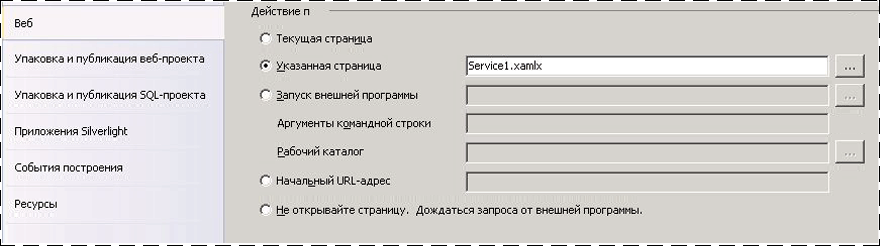
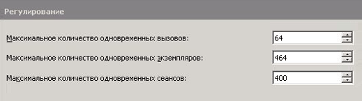
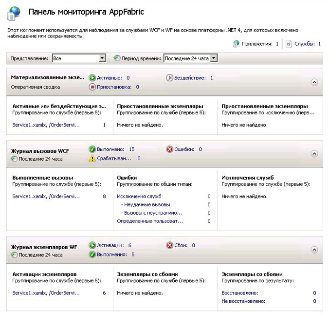
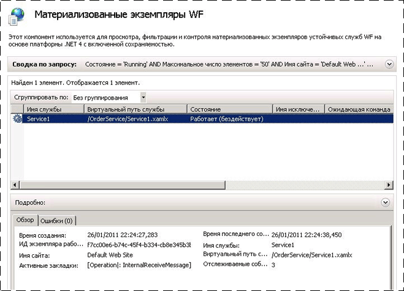

# Как разместить службу рабочего процесса с помощью Windows Server App Fabric
Размещение служб рабочих процессов в фабрике приложений аналогично их размещению в виртуальном каталоге служб IIS/WAS. Разница состоит лишь в предоставлении фабрикой приложений средств для развертывания, наблюдения и управления службами рабочих процессов. В этом разделе использует службу рабочего процесса, созданные в [Создание службы рабочего процесса долго выполняющихся](../../../../docs/framework/wcf/feature-details/creating-a-long-running-workflow-service.md). Указанный раздел содержит пошаговые инструкции по созданию службы рабочих процессов. В этом разделе объясняется, как разместить службу рабочих процессов с помощью фабрики приложений. [!INCLUDE[crabout](../../../../includes/crabout-md.md)]Windows Server App Fabric. в разделе [документации Windows Server App Fabric](http://go.microsoft.com/fwlink/?LinkID=193037&clcid=0x409). Перед выполнением описанных далее шагов убедитесь, что фабрика приложений Windows Server уже установлена.  Для этого откройте диспетчер служб IIS (inetmgr.exe), щелкните имя сервера в **подключений** просмотр сайтов и нажмите кнопку **веб-сайт по умолчанию**. В правой части экрана появится раздел под названием **App Fabric**. Если вы не видите этот раздел (он находится на верхней правой панели), значит фабрика приложений не установлена. [!INCLUDE[crabout](../../../../includes/crabout-md.md)]Установка Windows Server App Fabric. в разделе [Установка Windows Server App Fabric](http://go.microsoft.com/fwlink/?LinkId=193136).  
  
### Создание простой службы рабочих процессов  
  
1.  Откройте [!INCLUDE[vs_current_long](../../../../includes/vs-current-long-md.md)] и загрузите решение OrderProcessing, созданный в [Создание службы рабочего процесса долго выполняющихся](../../../../docs/framework/wcf/feature-details/creating-a-long-running-workflow-service.md) раздела.  
  
2.  Щелкните правой кнопкой мыши **OrderService** проект и выберите **свойства** и выберите **Web** вкладки.  
  
3.  В **действие при запуске** странице свойств выберите **определенную страницу** и в поле ввода введите Service1.xamlx.  
  
4.  В **серверы** странице свойств выберите **использовать локальный веб-сервер IIS** и введите следующий URL-адрес: `http://localhost/OrderService`.  
  
5.  Нажмите кнопку **создать виртуальный каталог** кнопки. При этом будет создан новый виртуальный каталог, а проект будет настроен для копирования необходимых файлов в этот каталог при сборке проекта.  Можно также вручную скопировать в этот виртуальный каталог XAMLX-файл, файл web.config и все необходимые библиотеки DLL.  
  
### Настройка службы рабочих процессов, размещенной в фабрике приложений Windows Server  
  
1.  Откройте диспетчер служб IIS (inetmgr.exe).  
  
2.  Перейдите в виртуальный каталог OrderService в **подключений** области.  
  
3.  Щелкните правой кнопкой мыши OrderService и выберите **управление службами WF WCF и**, **Настройка...** . **Настройка WCF и WF для приложения** диалоговое окно.  
  
4.  Выберите **Общие** вкладку, чтобы отобразить общие сведения о приложении, как показано на следующем снимке экрана.  
  
       
  
5.  Выберите **мониторинг** вкладки. Здесь показаны различные параметры наблюдения, как показано на следующем снимке экрана.  
  
       
  
     [!INCLUDE[crabout](../../../../includes/crabout-md.md)]Настройка наблюдение за службами рабочего процесса в фабрике приложений в разделе [настройке мониторинга с помощью App Fabric](http://go.microsoft.com/fwlink/?LinkId=193153).  
  
6.  Выберите **сохранение рабочего процесса** вкладки. Здесь можно настроить приложение для использования поставщика механизма сохраняемости по умолчанию фабрикой приложений, как показано на следующем снимке экрана.  
  
       
  
     [!INCLUDE[crabout](../../../../includes/crabout-md.md)]Настройка сохранение рабочего процесса в фабрике приложений Windows Server. в разделе [Настройка сохранение рабочего процесса в фабрике приложений](http://go.microsoft.com/fwlink/?LinkId=193148).  
  
7.  Выберите **Управление узлом рабочих процессов** вкладки. Здесь можно указать, когда должны выгружаться и сохраняться бездействующие службы рабочих процессов, как показано на следующем снимке экрана.  
  
       
  
     [!INCLUDE[crabout](../../../../includes/crabout-md.md)]рабочий процесс узла управления конфигурации см. в разделе [Настройка Управление узлом рабочих процессов в фабрике приложений](http://go.microsoft.com/fwlink/?LinkId=193151).  
  
8.  Выберите **автозапуска** вкладки. Здесь можно указать параметры автозапуска служб рабочих процессов в приложении, как показано на следующем снимке экрана.  
  
       
  
     [!INCLUDE[crabout](../../../../includes/crabout-md.md)]Настройка автоматического запуска в разделе [Настройка автоматического запуска с помощью App Fabric](http://go.microsoft.com/fwlink/?LinkId=193150).  
  
9. Выберите **регулирование** вкладки. Здесь можно настроить параметры регулирования для службы рабочих процессов, как показано на следующем снимке экрана.  
  
       
  
     [!INCLUDE[crabout](../../../../includes/crabout-md.md)]Настройка регулирования. в разделе [Настройка регулирования с App Fabric](http://go.microsoft.com/fwlink/?LinkId=193149).  
  
10. Выберите **безопасности** вкладки. Здесь можно настроить параметры безопасности для приложения, как показано на следующем снимке экрана.  
  
       
  
     [!INCLUDE[crabout](../../../../includes/crabout-md.md)]Настройка безопасности с помощью Windows Server App Fabric. в разделе [настройки безопасности с помощью App Fabric](http://go.microsoft.com/fwlink/?LinkId=193152).  
  
### Использование фабрики приложений Windows Server  
  
1.  Выполните построение решения, чтобы скопировать необходимые файлы в виртуальный каталог.  
  
2.  Щелкните правой кнопкой мыши проект OrderClient и выберите **отладки**, **запустить новый экземпляр** для запуска клиентского приложения.  
  
3.  Будет запущен клиент, и Visual Studio будет отображать **присоединения предупреждения безопасности** диалоговое окно, нажмите кнопку **не присоединяться** кнопки. При этом среда Visual Studio не будет присоединяться к процессу служб IIS для отладки.  
  
4.  Клиентское приложение немедленно вызовет службу рабочих процессов и перейдет в состояние ожидания. Служба рабочих процессов перейдет в состояние бездействия и будет сохранена. Чтобы это проверить, запустите диспетчер служб IIS (inetmgr.exe), перейдите к элементу OrderService в области «Соединения» и выберите его. Затем щелкните значок панели мониторинга фабрики приложений на панели справа. В разделе «Сохраненные экземпляры WF» можно видеть один сохраненный экземпляр службы рабочих процессов, как показано на следующем снимке экрана.  
  
       
  
     **Журнал экземпляра WF** выводит сведения о службе рабочего процесса, например количество активаций, число завершений экземпляров службы и количество экземпляров рабочих процессов с ошибками. Под активными и бездействующими экземплярами отображается ссылка, перейдя по которой можно просмотреть дополнительные сведения о бездействующих экземплярах рабочих процессов, как показано на следующем снимке экрана.  
  
       
  
     Дополнительные сведения о Windows Server App Fabric возможности и способы их использования см. [функции размещения Windows Server App Fabric](http://go.microsoft.com/fwlink/?LinkID=193143&clcid=0x409)  
  
## См. также  
 [Создание службы долго выполняющихся рабочих процессов](../../../../docs/framework/wcf/feature-details/creating-a-long-running-workflow-service.md)  
 [Функции размещения Windows Server App Fabric](http://go.microsoft.com/fwlink/?LinkId=193143)  
 [Установка Windows Server App Fabric](http://go.microsoft.com/fwlink/?LinkId=193136)  
 [Документации Windows Server App Fabric](http://go.microsoft.com/fwlink/?LinkID=193037&clcid=0x409)
