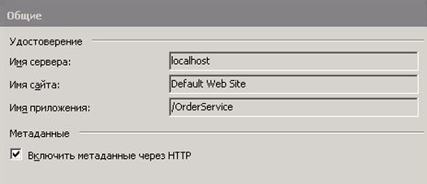
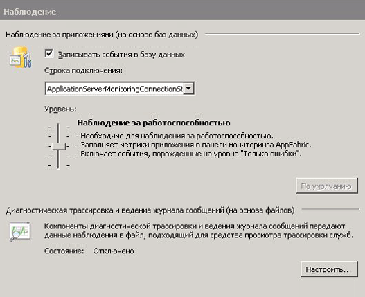
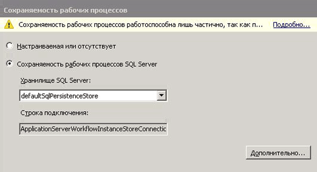
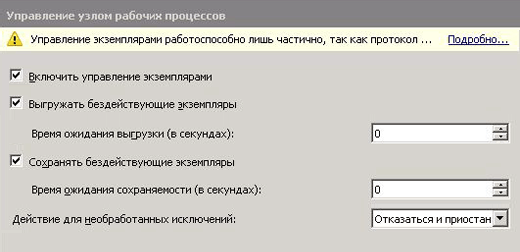
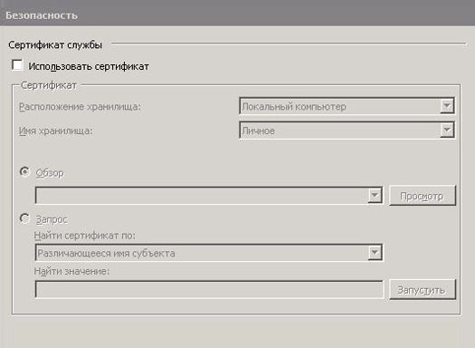

# Как разместить службу рабочего процесса с помощью Windows Server App Fabric

Размещение служб рабочих процессов в фабрике приложений аналогично их размещению в виртуальном каталоге служб IIS/WAS. Разница состоит лишь в предоставлении фабрикой приложений средств для развертывания, наблюдения и управления службами рабочих процессов. В этом разделе используется служба рабочего процесса, созданная при [создании длительно выполняющейся службы рабочего процесса](../../../../docs/framework/wcf/feature-details/creating-a-long-running-workflow-service.md). Указанный раздел содержит пошаговые инструкции по созданию службы рабочих процессов. В этом разделе объясняется, как разместить службу рабочих процессов с помощью фабрики приложений. Дополнительные сведения о Windows Server App Fabric см. в [документации по Windows Server App Fabric](https://docs.microsoft.com/previous-versions/appfabric/ff384253(v=azure.10)). Перед выполнением описанных далее шагов убедитесь, что фабрика приложений Windows Server уже установлена.  Для этого откройте службы IIS (inetmgr. exe), щелкните имя сервера в представлении **подключения** , щелкните сайты и выберите **веб-сайт по умолчанию**. В правой части экрана вы увидите раздел **App Fabric**. Если вы не видите этот раздел (он находится на верхней правой панели), значит фабрика приложений не установлена. Дополнительные сведения об установке Windows Server App Fabric см. в статье [Установка Windows Server App Fabric](https://docs.microsoft.com/previous-versions/appfabric/ee790960(v=azure.10)).  
  
### Создание простой службы рабочих процессов  
  
1. Откройте Visual Studio 2012 и загрузите решение OrderProcessing, созданное в разделе [Создание длительно выполняемой службы рабочих процессов](../../../../docs/framework/wcf/feature-details/creating-a-long-running-workflow-service.md) .  
  
2. Щелкните правой кнопкой мыши проект **ордерсервице** и выберите **свойства** и перейдите на вкладку **веб** .  
  
3. В разделе **действие при запуске** страницы свойств выберите **определенная страница** и введите Service1. xamlx в поле ввода.  
  
4. В разделе **серверы** страницы свойств выберите **использовать локальный веб-сервер IIS** и введите следующий URL-адрес: `http://localhost/OrderService`.  
  
5. Нажмите кнопку **создать виртуальный каталог** . При этом будет создан новый виртуальный каталог, а проект будет настроен для копирования необходимых файлов в этот каталог при сборке проекта.  Можно также вручную скопировать в этот виртуальный каталог XAMLX-файл, файл web.config и все необходимые библиотеки DLL.  
  
### Настройка службы рабочих процессов, размещенной в фабрике приложений Windows Server  
  
1. Откройте диспетчер служб IIS (inetmgr.exe).  
  
2. Перейдите в виртуальный каталог Ордерсервице на панели **подключения** .  
  
3. Щелкните правой кнопкой мыши Ордерсервице и выберите **Управление WCF и СЛУЖБАМИ WF**, **Настройка...** . Откроется диалоговое окно **Настройка WCF и WF для приложения** .  
  
4. Перейдите на вкладку **Общие** , чтобы отобразить общие сведения о приложении, как показано на следующем снимке экрана.  
  
       
  
5. Перейдите на вкладку **мониторинг** . Отобразятся различные параметры мониторинга, как показано на следующем снимке экрана.  
  
       
  
     Дополнительные сведения о настройке мониторинга службы рабочих процессов в структуре приложений см. в статье [Настройка мониторинга с помощью App Fabric](https://docs.microsoft.com/previous-versions/appfabric/ee677384(v=azure.10)).  
  
6. Перейдите на вкладку **Сохраняемость рабочего процесса** . Это позволяет настроить приложение для использования поставщика сохраняемости по умолчанию в структуре приложений, как показано на следующем снимке экрана.  
  
       
  
     Дополнительные сведения о настройке сохраняемости рабочих процессов в структуре приложений Windows Server см. [в статье Настройка сохраняемости рабочих процессов в структуре приложений](https://docs.microsoft.com/previous-versions/appfabric/ee677353(v=azure.10)).  
  
7. Перейдите на вкладку **Управление узлом рабочего процесса** . Это позволяет указать, когда следует выгружать неактивные экземпляры службы рабочего процесса и сохранять их, как показано на следующем снимке экрана.  
  
       
  
     Дополнительные сведения о конфигурации управления узлом рабочих процессов см. [в статье Настройка управления узлами рабочих процессов в App Fabric](https://docs.microsoft.com/previous-versions/appfabric/ff383424(v=azure.10)).  
  
8. Перейдите на вкладку **Автозапуск** . Это позволяет указать параметры автоматического запуска для служб рабочего процесса в приложении, как показано на следующем снимке экрана.  
  
       
  
     Дополнительные сведения о настройке автоматического запуска см. [в разделе Настройка автоматического запуска с помощью App Fabric](https://docs.microsoft.com/previous-versions/appfabric/ee677261(v=azure.10)).  
  
9. Перейдите на вкладку **регулирование** . Это позволяет настроить параметры регулирования для службы рабочего процесса, как показано на следующем снимке экрана.  
  
       
  
     Дополнительные сведения о настройке регулирования см. [в разделе Настройка регулирования с помощью App Fabric](https://docs.microsoft.com/previous-versions/appfabric/ee677261(v=azure.10)).  
  
10. Перейдите на вкладку **Безопасность** . Это позволяет настроить параметры безопасности для приложения, как показано на следующем снимке экрана.  
  
       
  
     Дополнительные сведения о настройке безопасности с помощью Windows Server App Fabric см. [в статье Настройка безопасности с помощью App Fabric](https://docs.microsoft.com/previous-versions/appfabric/ee677278(v=azure.10)).  
  
### Использование фабрики приложений Windows Server  
  
1. Выполните построение решения, чтобы скопировать необходимые файлы в виртуальный каталог.  
  
2. Щелкните правой кнопкой мыши проект Ордерклиент и выберите **Отладка**, **запустить новый экземпляр** , чтобы запустить клиентское приложение.  
  
3. Клиент будет запущен, и Visual Studio отобразит диалоговое окно **присоединить предупреждение безопасности** , нажав кнопку **не присоединить** . При этом среда Visual Studio не будет присоединяться к процессу служб IIS для отладки.  
  
4. Клиентское приложение немедленно вызовет службу рабочих процессов и перейдет в состояние ожидания. Служба рабочих процессов перейдет в состояние бездействия и будет сохранена. Чтобы это проверить, запустите диспетчер служб IIS (inetmgr.exe), перейдите к элементу OrderService в области «Соединения» и выберите его. Затем щелкните значок панели мониторинга фабрики приложений на панели справа. В разделе Материализованные экземпляры WF появится один сохраненный экземпляр службы рабочего процесса, как показано на следующем снимке экрана.  
  
       
  
     В **журнале экземпляров WF** содержится информация о службе рабочего процесса, например число активаций службы рабочих процессов, число завершений экземпляров службы рабочего процесса и количество экземпляров рабочих процессов с ошибками. В разделе активные или неактивные экземпляры появится ссылка, щелкнув ссылку, чтобы просмотреть дополнительные сведения об активных экземплярах рабочего процесса, как показано на следующем снимке экрана.  
  
       
  
     Дополнительные сведения о функциях Windows Server App Fabric и способах их использования см. в статье [функции размещения Windows Server App Fabric](https://docs.microsoft.com/previous-versions/appfabric/ee677189(v=azure.10)) .  
  
## См. также:

- [Создание службы долго выполняющегося рабочего процесса](../../../../docs/framework/wcf/feature-details/creating-a-long-running-workflow-service.md)
- [Функции размещения Windows Server App Fabric](https://docs.microsoft.com/previous-versions/appfabric/ee677189(v=azure.10))
- [Установка Windows Server App Fabric](https://docs.microsoft.com/previous-versions/appfabric/ee790960(v=azure.10))
- [Документация по Windows Server App Fabric](https://docs.microsoft.com/previous-versions/appfabric/ff384253(v=azure.10))
