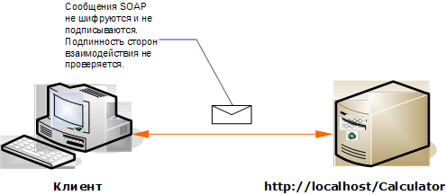

# <a name="internet-unsecured-client-and-service"></a><span data-ttu-id="69fda-102">Незащищенные интернет-клиент и служба</span><span class="sxs-lookup"><span data-stu-id="69fda-102">Internet Unsecured Client and Service</span></span>
<span data-ttu-id="69fda-103">В следующей иллюстрации показан пример открытых незащищенных клиента и службы [!INCLUDE[indigo1](../../../../includes/indigo1-md.md)].</span><span class="sxs-lookup"><span data-stu-id="69fda-103">The following illustration shows an example of a public, unsecured [!INCLUDE[indigo1](../../../../includes/indigo1-md.md)] client and service.</span></span>  
  
 <span data-ttu-id="69fda-104"></span><span class="sxs-lookup"><span data-stu-id="69fda-104"></span></span>  
  
|<span data-ttu-id="69fda-105">Характеристика</span><span class="sxs-lookup"><span data-stu-id="69fda-105">Characteristic</span></span>|<span data-ttu-id="69fda-106">Описание</span><span class="sxs-lookup"><span data-stu-id="69fda-106">Description</span></span>|  
|--------------------|-----------------|  
|<span data-ttu-id="69fda-107">Режим безопасности</span><span class="sxs-lookup"><span data-stu-id="69fda-107">Security Mode</span></span>|<span data-ttu-id="69fda-108">Нет</span><span class="sxs-lookup"><span data-stu-id="69fda-108">None</span></span>|  
|<span data-ttu-id="69fda-109">Transport</span><span class="sxs-lookup"><span data-stu-id="69fda-109">Transport</span></span>|<span data-ttu-id="69fda-110">HTTP</span><span class="sxs-lookup"><span data-stu-id="69fda-110">HTTP</span></span>|  
|<span data-ttu-id="69fda-111">Привязка</span><span class="sxs-lookup"><span data-stu-id="69fda-111">Binding</span></span>|<span data-ttu-id="69fda-112"><xref:System.ServiceModel.BasicHttpBinding>в коде или [ \<basicHttpBinding >](../../../../docs/framework/configure-apps/file-schema/wcf/basichttpbinding.md) элемент в конфигурации.</span><span class="sxs-lookup"><span data-stu-id="69fda-112"><xref:System.ServiceModel.BasicHttpBinding> in code, or the [\<basicHttpBinding>](../../../../docs/framework/configure-apps/file-schema/wcf/basichttpbinding.md) element in configuration.</span></span>|  
|<span data-ttu-id="69fda-113">Взаимодействие</span><span class="sxs-lookup"><span data-stu-id="69fda-113">Interoperability</span></span>|<span data-ttu-id="69fda-114">С существующими службами и клиентами веб-служб</span><span class="sxs-lookup"><span data-stu-id="69fda-114">With existing Web service clients and services</span></span>|  
|<span data-ttu-id="69fda-115">Аутентификация</span><span class="sxs-lookup"><span data-stu-id="69fda-115">Authentication</span></span>|<span data-ttu-id="69fda-116">Нет</span><span class="sxs-lookup"><span data-stu-id="69fda-116">None</span></span>|  
|<span data-ttu-id="69fda-117">Целостность</span><span class="sxs-lookup"><span data-stu-id="69fda-117">Integrity</span></span>|<span data-ttu-id="69fda-118">Нет</span><span class="sxs-lookup"><span data-stu-id="69fda-118">None</span></span>|  
|<span data-ttu-id="69fda-119">Конфиденциальность</span><span class="sxs-lookup"><span data-stu-id="69fda-119">Confidentiality</span></span>|<span data-ttu-id="69fda-120">Нет</span><span class="sxs-lookup"><span data-stu-id="69fda-120">None</span></span>|  
  
## <a name="service"></a><span data-ttu-id="69fda-121">Служба</span><span class="sxs-lookup"><span data-stu-id="69fda-121">Service</span></span>  
 <span data-ttu-id="69fda-122">Предполагается, что представленные ниже код и конфигурация выполняются независимо.</span><span class="sxs-lookup"><span data-stu-id="69fda-122">The following code and configuration are meant to run independently.</span></span> <span data-ttu-id="69fda-123">Выполните одно из следующих действий.</span><span class="sxs-lookup"><span data-stu-id="69fda-123">Do one of the following:</span></span>  
  
-   <span data-ttu-id="69fda-124">Создайте автономную службу, используя код без конфигурации.</span><span class="sxs-lookup"><span data-stu-id="69fda-124">Create a stand-alone service using the code with no configuration.</span></span>  
  
-   <span data-ttu-id="69fda-125">Создайте службу, используя предоставленную конфигурацию, но не определяйте конечные точки.</span><span class="sxs-lookup"><span data-stu-id="69fda-125">Create a service using the supplied configuration, but do not define any endpoints.</span></span>  
  
### <a name="code"></a><span data-ttu-id="69fda-126">Код</span><span class="sxs-lookup"><span data-stu-id="69fda-126">Code</span></span>  
 <span data-ttu-id="69fda-127">В следующем коде показано создание конечной точки без безопасности.</span><span class="sxs-lookup"><span data-stu-id="69fda-127">The following code shows how to create an endpoint with no security.</span></span> <span data-ttu-id="69fda-128">По умолчанию режим безопасности <xref:System.ServiceModel.BasicHttpBinding> задан режим <xref:System.ServiceModel.BasicHttpSecurityMode.None>.</span><span class="sxs-lookup"><span data-stu-id="69fda-128">By default, the <xref:System.ServiceModel.BasicHttpBinding> has the security mode set to <xref:System.ServiceModel.BasicHttpSecurityMode.None>.</span></span>  
  
 [!code-csharp[C_UnsecuredService#1](../../../../samples/snippets/csharp/VS_Snippets_CFX/c_unsecuredservice/cs/source.cs#1)]
 [!code-vb[C_UnsecuredService#1](../../../../samples/snippets/visualbasic/VS_Snippets_CFX/c_unsecuredservice/vb/source.vb#1)]  
  
### <a name="service-configuration"></a><span data-ttu-id="69fda-129">Конфигурация службы</span><span class="sxs-lookup"><span data-stu-id="69fda-129">Service Configuration</span></span>  
 <span data-ttu-id="69fda-130">В следующем коде настраивается та же конечная точка с использованием конфигурации.</span><span class="sxs-lookup"><span data-stu-id="69fda-130">The following code sets up the same endpoint using configuration.</span></span>  
  
```xml  
<?xml version="1.0" encoding="utf-8"?>  
<configuration>  
  <system.serviceModel>  
    <behaviors />  
    <services>  
      <service behaviorConfiguration="" name="ServiceModel.Calculator">  
        <endpoint address="http://localhost/Calculator"   
                  binding="basicHttpBinding"  
                  bindingConfiguration="Basic_Unsecured"   
                  name="BasicHttp_ICalculator"  
                  contract="ServiceModel.ICalculator" />  
      </service>  
    </services>  
    <bindings>  
      <basicHttpBinding>  
        <binding name="Basic_Unsecured" />  
      </basicHttpBinding>  
    </bindings>  
    <client />  
  </system.serviceModel>  
</configuration>  
```  
  
## <a name="client"></a><span data-ttu-id="69fda-131">Клиент</span><span class="sxs-lookup"><span data-stu-id="69fda-131">Client</span></span>  
 <span data-ttu-id="69fda-132">Предполагается, что представленные ниже код и конфигурация выполняются независимо.</span><span class="sxs-lookup"><span data-stu-id="69fda-132">The following code and configuration are meant to run independently.</span></span> <span data-ttu-id="69fda-133">Выполните одно из следующих действий.</span><span class="sxs-lookup"><span data-stu-id="69fda-133">Do one of the following:</span></span>  
  
-   <span data-ttu-id="69fda-134">Создайте автономный клиент, используя код (и код клиента).</span><span class="sxs-lookup"><span data-stu-id="69fda-134">Create a stand-alone client using the code (and client code).</span></span>  
  
-   <span data-ttu-id="69fda-135">Создайте клиент, который не определяет никаких адресов конечных точек.</span><span class="sxs-lookup"><span data-stu-id="69fda-135">Create a client that does not define any endpoint addresses.</span></span> <span data-ttu-id="69fda-136">Вместо этого используйте конструктор клиента, который принимает в качестве аргумента имя конфигурации.</span><span class="sxs-lookup"><span data-stu-id="69fda-136">Instead, use the client constructor that takes the configuration name as an argument.</span></span> <span data-ttu-id="69fda-137">Например:</span><span class="sxs-lookup"><span data-stu-id="69fda-137">For example:</span></span>  
  
     [!code-csharp[C_SecurityScenarios#0](../../../../samples/snippets/csharp/VS_Snippets_CFX/c_securityscenarios/cs/source.cs#0)]
     [!code-vb[C_SecurityScenarios#0](../../../../samples/snippets/visualbasic/VS_Snippets_CFX/c_securityscenarios/vb/source.vb#0)]  
  
### <a name="code"></a><span data-ttu-id="69fda-138">Код</span><span class="sxs-lookup"><span data-stu-id="69fda-138">Code</span></span>  
 <span data-ttu-id="69fda-139">Приведенный ниже код демонстрирует основной клиент [!INCLUDE[indigo2](../../../../includes/indigo2-md.md)], который имеет доступ к незащищенной конечной точке.</span><span class="sxs-lookup"><span data-stu-id="69fda-139">The following code shows a basic [!INCLUDE[indigo2](../../../../includes/indigo2-md.md)] client that accesses an unsecured endpoint.</span></span>  
  
 [!code-csharp[C_UnsecuredClient#1](../../../../samples/snippets/csharp/VS_Snippets_CFX/c_unsecuredclient/cs/source.cs#1)]
 [!code-vb[C_UnsecuredClient#1](../../../../samples/snippets/visualbasic/VS_Snippets_CFX/c_unsecuredclient/vb/source.vb#1)]  
  
### <a name="client-configuration"></a><span data-ttu-id="69fda-140">Конфигурация клиента</span><span class="sxs-lookup"><span data-stu-id="69fda-140">Client Configuration</span></span>  
 <span data-ttu-id="69fda-141">Следующий код служит для настройки клиента.</span><span class="sxs-lookup"><span data-stu-id="69fda-141">The following code configures the client.</span></span>  
  
```xml  
<?xml version="1.0" encoding="utf-8"?>  
<configuration>  
  <system.serviceModel>  
    <bindings>  
      <basicHttpBinding>  
        <binding name="BasicHttpBinding_ICalculator" >  
          <security mode="None">  
          </security>  
        </binding>  
      </basicHttpBinding>  
    </bindings>  
    <client>  
      <endpoint address="http://localhost/Calculator/Unsecured"  
          binding="basicHttpBinding"   
          bindingConfiguration="BasicHttpBinding_ICalculator"  
          contract="ICalculator"   
          name="BasicHttpBinding_ICalculator" />  
    </client>  
  </system.serviceModel>  
</configuration>  
```  
  
## <a name="see-also"></a><span data-ttu-id="69fda-142">См. также</span><span class="sxs-lookup"><span data-stu-id="69fda-142">See Also</span></span>  
 [<span data-ttu-id="69fda-143">Типовые сценарии безопасности</span><span class="sxs-lookup"><span data-stu-id="69fda-143">Common Security Scenarios</span></span>](../../../../docs/framework/wcf/feature-details/common-security-scenarios.md)  
 [<span data-ttu-id="69fda-144">Общие сведения о безопасности</span><span class="sxs-lookup"><span data-stu-id="69fda-144">Security Overview</span></span>](../../../../docs/framework/wcf/feature-details/security-overview.md)  
 [<span data-ttu-id="69fda-145">Модель безопасности для Windows Server App Fabric</span><span class="sxs-lookup"><span data-stu-id="69fda-145">Security Model for Windows Server App Fabric</span></span>](http://go.microsoft.com/fwlink/?LinkID=201279&clcid=0x409)
