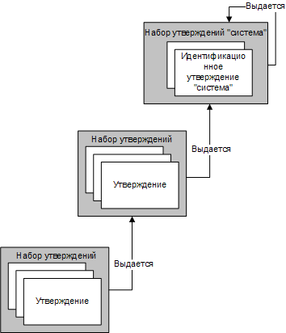
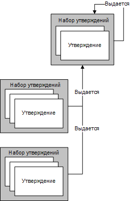
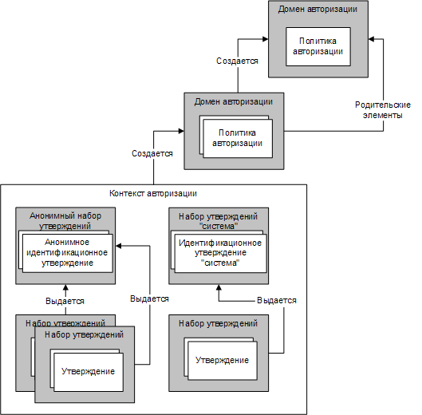

# Управление утверждениями и авторизацией с помощью модели удостоверенияManaging Claims and Authorization with the Identity Model
Авторизация - это процесс определения сущностей, имеющих право изменять, просматривать компьютерный ресурс или получать доступ к нему.Authorization is the process of determining which entities have permission to change, view, or otherwise access a computer resource. Например, в организации только менеджерам может быть разрешен доступ к файлам их сотрудников.For example, in a business, only managers may be allowed to access the files of their employees. Windows Communication Foundation (WCF) поддерживает два механизма выполнения авторизации.Windows Communication Foundation (WCF) supports two mechanisms for performing authorization processing. Первый механизм позволяет управлять авторизацией с помощью существующих конструкций среды CLR.The first mechanism enables you to control authorization using existing common language runtime (CLR) constructs. Второй — модель на основе утверждений, называется *модели удостоверения*.The second is a claims-based model known as the *Identity Model*. WCF использует модель удостоверения для создания утверждений из входящих сообщений; Классы модели удостоверения можно расширить для поддержки новых типов утверждений для пользовательских схем авторизации.WCF uses the Identity Model to create claims from incoming messages; Identity Model classes can be extended to support new claim types for custom authorization schemes. В этом разделе приводятся общие сведения об основных принципах программирования возможности "Модель удостоверения", а также перечисляются наиболее важные классы, используемые этой возможностью.This topic presents an overview of the major programming concepts of the Identity Model feature, as well as a listing of the most important classes the feature uses.  
  
## Сценарии модели удостоверенияIdentity Model Scenarios  
 Использование модели удостоверения представляется следующими сценариями.The following scenarios represent Identity Model use.  
  
### Сценарий 1. Поддержка идентификации, роли и утверждений о группахScenario 1: Supporting Identity, Role, and Group Claims  
 Пользователи отправляют сообщения в веб-службу.Users send messages to a Web service. Согласно требованиям управления доступом веб-службы, используются идентификация, роли или группы.The access control requirements of the Web service use identity, roles, or groups. Отправитель сообщения сопоставляется с рядом ролей или групп.The message sender is mapped to a set of roles or groups. Для выполнения проверок доступа используются сведения о роли или группе.Role or group information is used to perform access checks.  
  
### Сценарий 2. Поддержка полнофункциональных утвержденийScenario 2: Supporting Rich Claims  
 Пользователи отправляют сообщения в веб-службу.Users send messages to a Web service. Согласно требованиям управления доступом веб-службы, необходима модель с более широкими функциональными возможностями, чем модель с идентификацией, ролями или группами.The access control requirements of the Web service require a richer model than identity, roles, or groups. Имеет ли заданный пользователь доступ к конкретному защищенному ресурсу, определяется веб-службой с помощью модели, основанной на утверждениях с широкими функциональными возможностями.The Web service determines whether a given user has access to a particular protected resource using the rich claims-based model. Например, один пользователь может иметь доступ к конкретным сведениям, например о заработной плате, а другие пользователи - нет.For example, one user may be able to read particular information, such as salary information, that other users do not have access to.  
  
### Сценарий 3. Сопоставление несопоставимых утвержденийScenario 3: Mapping Disparate Claims  
 Пользователь отправляет сообщение в веб-службу.A user sends a message to a Web service. Пользователь может указать свои учетные данные несколькими разными способами: Сертификат X.509, маркера имени пользователя или маркера Kerberos.The user may specify their credentials in a number of different ways: X.509 certificate, user name token, or Kerberos token. Веб-служба должна выполнить одинаковые проверки управления доступом независимо от типа учетных данных пользователя.The Web service is required to perform access control checks in the same way, regardless of the user credential type. Если впоследствии будут поддерживаться дополнительные типы учетных данных, необходимо соответствующим образом расширить возможности системы.If additional credential types are supported over time, the system should evolve accordingly.  
  
### Сценарий 4. Определение доступа к нескольким ресурсамScenario 4: Determining Access to Multiple Resources  
 Веб-служба пытается получить доступ к нескольким ресурсам.A Web service attempts to access multiple resources. Служба определяет, к каким защищенным ресурсам имеет доступ заданный пользователь, сравнивая утверждения, связанные с этим пользователем, с утверждениями, необходимыми для доступа к ресурсу.The service determines which protected resources a given user has access to by comparing the claims associated with the user with the claims required to access the resource.  
  
## Термины модели удостоверенияIdentity Model Terms  
 Ниже определяются основные термины, используемые для описания концепций модели удостоверения.The following list defines key terms used to describe Identity Model concepts.  
  
 Политика авторизацииAuthorization policy  
 Набор правил сопоставления ряда входных утверждений с рядом выходных утверждений.A set of rules for mapping a set of input claims to a set of output claims. Оценка политики авторизации приводит к добавлению наборов утверждений в контекст оценки и впоследствии в контекст авторизации.Evaluating authorization policy results in claim sets being added to an evaluation context and subsequently an authorization context.  
  
 Контекст авторизацииAuthorization context  
 Ряд наборов утверждений и ноль или более свойств.A set of claim sets and zero or more properties. Результат оценки одной или нескольких политик авторизации.The result of evaluating one or more authorization policies.  
  
 УтверждениеClaim  
 Сочетание типа утверждения, права и значения.A combination of a claim type, right, and a value.  
  
 Набор утвержденийClaim set  
 Ряд утверждений, изданных конкретным издателем.A set of claims issued by a particular issuer.  
  
 Тип утвержденияClaim type  
 Вид утверждения.A kind of claim. Утверждения, определенные интерфейсом API модели удостоверения, являются свойствами класса <xref:System.IdentityModel.Claims.Claim.ClaimType%2A>.Claims defined by the Identity Model API are properties of the <xref:System.IdentityModel.Claims.Claim.ClaimType%2A> class. Примеры типов утверждений, обеспечиваемых системой: <xref:System.IdentityModel.Claims.ClaimTypes.Dns%2A>, <xref:System.IdentityModel.Claims.ClaimTypes.Email%2A>, <xref:System.IdentityModel.Claims.ClaimTypes.Hash%2A>, <xref:System.IdentityModel.Claims.ClaimTypes.Name%2A>, <xref:System.IdentityModel.Claims.ClaimTypes.Rsa%2A>, <xref:System.IdentityModel.Claims.ClaimTypes.Sid%2A>, <xref:System.IdentityModel.Claims.ClaimTypes.Spn%2A>, <xref:System.IdentityModel.Claims.ClaimTypes.System%2A>, <xref:System.IdentityModel.Claims.ClaimTypes.Thumbprint%2A>, <xref:System.IdentityModel.Claims.ClaimTypes.Uri%2A> и <xref:System.IdentityModel.Claims.ClaimTypes.X500DistinguishedName%2A>.Examples of system-provided claim types are <xref:System.IdentityModel.Claims.ClaimTypes.Dns%2A>, <xref:System.IdentityModel.Claims.ClaimTypes.Email%2A>, <xref:System.IdentityModel.Claims.ClaimTypes.Hash%2A>, <xref:System.IdentityModel.Claims.ClaimTypes.Name%2A>, <xref:System.IdentityModel.Claims.ClaimTypes.Rsa%2A>, <xref:System.IdentityModel.Claims.ClaimTypes.Sid%2A>, <xref:System.IdentityModel.Claims.ClaimTypes.Spn%2A>, <xref:System.IdentityModel.Claims.ClaimTypes.System%2A>, <xref:System.IdentityModel.Claims.ClaimTypes.Thumbprint%2A>, <xref:System.IdentityModel.Claims.ClaimTypes.Uri%2A>, and <xref:System.IdentityModel.Claims.ClaimTypes.X500DistinguishedName%2A>.  
  
 Контекст оценкиEvaluation context  
 Контекст, в котором оценивается политика авторизации.A context in which an authorization policy is evaluated. Содержит свойства и наборы утверждений.Contains properties and claim sets. По окончании оценки становится основой контекста авторизации.Becomes the basis of an authorization context once evaluation is complete.  
  
 Идентификационное утверждениеIdentity claim  
 Утверждение, правом которого является удостоверение.A claim whose right is identity.  
  
 ИздательIssuer  
 Набор утверждений, который содержит по крайней мере одно идентификационное утверждение и считается имеющим другой изданный набор утверждений.A claim set that contains at least one identity claim and is considered to have issued another claim set.  
  
 СвойстваProperties  
 Ряд сведений, связанных с контекстом оценки или контекстом авторизации.A set of information associated with an evaluation context or authorization context.  
  
 Защищенный ресурсProtected resource  
 Ресурс в системе, который может использоваться или обрабатываться или к которому может предоставляться доступ, только если удовлетворены определенные требования.Something in the system that can only be used, accessed, or otherwise manipulated if certain requirements are first met.  
  
 ПравыйRight  
 Возможность в отношении ресурса.A capability over a resource. Права, определенные интерфейсом API модели удостоверения, являются свойствами класса <xref:System.IdentityModel.Claims.Rights>.Rights defined by the Identity Model API are properties of the <xref:System.IdentityModel.Claims.Rights> class. Примеры прав, обеспечиваемых системой: <xref:System.IdentityModel.Claims.Rights.Identity%2A> и <xref:System.IdentityModel.Claims.Rights.PossessProperty%2A>.Examples of system-provided rights are <xref:System.IdentityModel.Claims.Rights.Identity%2A> and <xref:System.IdentityModel.Claims.Rights.PossessProperty%2A>.  
  
 ЗначениеValue  
 Некоторое значение, в отношении которого утверждается право.Something over which a right is claimed.  
  
## УтвержденияClaims  
 Модель удостоверения - это система, основанная на утверждениях.The Identity Model is a claims-based system. Утверждения описывают возможности, связанные с некоторой сущностью в системе, часто с пользователем этой системы.Claims describe the capabilities associated with some entity in the system, often a user of that system. Ряд утверждений, связанных с заданной сущностью, можно считать ключом.The set of claims associated with a given entity can be thought of as a key. Конкретные утверждения определяют форму этого ключа, подобную физическому ключу для открывания замка двери.The particular claims define the shape of that key, similar to a physical key used to open a lock in a door. Утверждения используются для получения доступа к ресурсам.Claims are used to gain access to resources. Доступ к заданному защищенному ресурсу определяется сравнением утверждений, необходимых для доступа к этому ресурсу, с утверждениями, связанными с сущностью, пытающейся получить доступ.Access to a given protected resource is determined by comparing the claims needed to access that resource with the claims associated with the entity attempting access.  
  
 Утверждение - это выражение права в отношении конкретного значения.A claim is the expression of a right with respect to a particular value. Правом может быть нечто вроде "Чтение", "Запись" или "Выполнение".A right could be something like "Read", "Write", or "Execute." Значением может быть база данных, файл, почтовый ящик или свойство.A value could be a database, a file, a mailbox, or a property. Утверждения также имеют тип утверждения.Claims also have a claim type. Сочетание типа утверждения и права обеспечивает механизм задания возможностей в отношении значения.The combination of claim type and right provides the mechanism for specifying capabilities with respect to the value. Например, утверждение типа «File» с правом «Read» в отношении значения «Biography.doc» указывает, что сущность, с которой связывается такое утверждение, имеет доступ для чтения к файлу Biography.doc. Утверждение типа «Name» с правом «PossessProperty» в отношении значения «Martin» указывает, что сущность, с которой связывается такое утверждение, обладает свойством Name со значением «Martin».For example, a claim of type "File", with right "Read" over the value "Biography.doc", indicates that the entity with which such a claim is associated has read access to the file Biography.doc. A claim of type "Name", with right "PossessProperty" over the value "Martin", indicates that the entity with which such a claim is associated possesses a Name property with the value "Martin".  
  
 Хотя различные типы утверждений и права определяются как часть модели удостоверения, система является расширяемой, позволяя различным системам, создаваемым в дополнение к инфраструктуре модели удостоверения, определять дополнительные типы утверждений и права согласно требованиям.Although various claim types and rights are defined as part of the Identity Model, the system is extensible, allowing the various systems, building on top of the Identity Model infrastructure, to define additional claim types and rights as required.  
  
### Идентификационные утвержденияIdentity Claims  
 Одно конкретное право является правом удостоверения.One particular right is that of identity. Утверждения, обладающие таким правом, создают оператор в отношении удостоверения сущности.Claims that possess this right make a statement about the identity of the entity. Например, утверждение типа «имя участника-пользователя» (UPN) со значением "someone@example.com" и правом удостоверения указывает конкретное удостоверение в определенном домене.For example, a claim of type "user principal name" (UPN) with a value of "someone@example.com" and a right of Identity indicates a particular identity in a particular domain.  
  
#### Идентификационное утверждение "система"System Identity Claim  
 Модель удостоверения определяет одно идентификационное утверждение: System.The Identity Model defines one identity claim: System. Идентификационное утверждение "система" указывает, что сущностью является текущее приложение или система.The System identity claim indicates that an entity is the current application or system.  
  
### Наборы утвержденийSets of Claims  
 Модель утверждений, представляющих удостоверение, важна, поскольку утверждения всегда издаются некоторой сущностью в системе, даже если эта сущность является в конечном счете некоторой "самостоятельной" концепцией.The model of claims that represent identity is important because claims are always issued by some entity in the system, even if that entity is ultimately some concept of "self". Утверждения группируются в виде набора, и каждый набор имеет издателя.Claims are grouped together as a set and each set has an issuer. Издатель - это просто набор утверждений.An issuer is just a set of claims. Такая рекурсивная связь должна в конечном счете завершиться, и любой набор утверждений может быть издателем сам для себя.Such a recursive relationship must eventually end and any claim set can be its own issuer.  
  
 На следующем рисунке приведен пример трех наборов утверждений, где издателем одного набора утверждений является другой набор утверждений, издателем которого, в свою очередь, является набор утверждений "система".The following figure shows an example of three sets of claims where one set of claims has, as its issuer, another set of claims, which in turn has the System claim set as its issuer. Следовательно, наборы утверждений образуют иерархию, которая может иметь произвольную глубину.Therefore, sets of claims form a hierarchy that may be arbitrarily deep.  
  
   
  
 Для нескольких наборов утверждений может использоваться один и тот же издающий набор утверждений, как показано на следующем рисунке.Multiple sets of claims may have the same issuing claim set, as illustrated in the following figure.  
  
   
  
 За исключением набора утверждений, который является издателем сам для себя, модель удостоверения не обеспечивает никакой поддержки образования цикла наборами утверждений.With the exception of a claim set that is its own issuer, the Identity Model does not provide any support for claim sets to form a loop. Таким образом, невозможно возникновение ситуации, когда набор утверждений A издается набором утверждений B, который сам издается набором утверждений A.Thus a situation where claim set A is issued by claim set B, which is itself issued by claim set A, can never arise. Кроме того, модель удостоверения не обеспечивает никакой поддержки наличия нескольких издателей для наборов утверждений.Also, the Identity Model does not provide any support for claim sets to have multiple issuers. Если два или более издателей должны издать заданный набор утверждений, необходимо использовать несколько наборов утверждений, каждый из которых содержит одни и те же утверждения, но имеет разных издателей.If two or more issuers must issue a given set of claims, then you must use multiple claim sets, each containing the same claims, but having different issuers.  
  
### Источники утвержденийThe Origin of Claims  
 Утверждения могут поступать из множества источников.Claims can come from a variety of sources. Одним из общих источников утверждений являются учетные данные, представляемые пользователем, например в виде части сообщения, отправляемого в веб-службу.One common source of claims is credentials presented by a user, for example as part of a message sent to a Web service. Система подтверждает такие утверждения, и они становятся частью набора утверждений, связанных с данным пользователем.The system validates such claims, and they become part of a set of claims associated with the user. Источниками утверждений могут также быть другие компоненты системы, включая операционную систему, сетевой стек, среду выполнения и приложение (но не только эти компоненты).Other system components may also be sources of claims, including, but not limited to, the operating system, the network stack, the run-time environment, or the application. Еще один возможный источник утверждений - удаленные службы.In addition, remote services may also be a source of claims.  
  
### Политики авторизацииAuthorization Policies  
 В модели удостоверения утверждения создаются в процессе оценки политики авторизации.In the Identity Model, claims are generated as part of the process of evaluating the authorization policy. Политика авторизации проверяет набор (возможно, пустой) существующих утверждений и может добавить дополнительные утверждения на основе уже имеющихся утверждений и дополнительных сведений при их наличии.An authorization policy examines the (possibly empty) set of existing claims and may choose to add additional claims based on the claims already present and additional information at its disposal. Это обеспечивает основу для сопоставления утверждений между собой.This provides the basis of mapping between claims. Наличие или отсутствие утверждений в системе влияет на поведение политики авторизации, касающееся добавления дополнительных утверждений.The presence or absence of claims in the system influences the behavior of an authorization policy with respect to whether it adds additional claims.  
  
 Например, пусть политика авторизации имеет доступ к базе данных, в которой содержатся дни рождения различных сущностей, использующих систему.For example, the authorization policy has access to a database that includes the birthdates of the various entities using the system. Политика авторизации использует эти сведения для добавления утверждения "Over18" в контекст.The authorization policy uses that information to add an "Over18" claim to the context. Обратите внимание, что это утверждение не раскрывает никаких сведений о сущности, кроме того факта, что ее возраст больше 18 лет.Note that this Over18 claim does not disclose any information about the entity other than the fact that it is over 18 years of age. Следует отметить, что интерпретация утверждения "Over18" зависит от понимания семантики этого утверждения.Note that interpretation of the 'Over18' claim depends on understanding the semantics of that claim. Политика авторизации, добавившая данное утверждение, понимает эту семантику на некотором уровне.The authorization policy that added the claim understands those semantics at some level. Код, который впоследствии проверяет утверждения, являющиеся результатом оценки политики, также информируется об этой семантике.Code that subsequently examines the claims that result from policy evaluation also be informed of those semantics.  
  
 Заданная политика авторизации может требовать, чтобы она оценивалась несколько раз, поскольку, так как другие политики авторизации добавляют утверждения, эта политика авторизации может добавить еще больше утверждений.A given authorization policy may require that it be evaluated multiple times because, as other authorization policies add claims, that authorization policy might add yet more claims. Модель удостоверения разработана для продолжения оценки до тех пор, пока в контекст больше не будет добавляться никаких утверждений любой из действующих политик авторизации.Identity Model is designed to continue evaluation until no more claims are added to the context by any of the authorization policies in force. Такая продолжающаяся оценка политик авторизации исключает необходимость принудительного установления конкретного порядка оценки политик авторизации; они могут оцениваться в любом порядке.This continued evaluation of authorization policies prevents the requirement to enforce any specific evaluation order with respect to authorization policies; they can be evaluated in any order. Например, если политика X добавляет утверждение Z, только если политика A добавила утверждение B, то если сначала оценивается политика X, она изначально не добавляет утверждение Z. Затем оценивается политика A и она добавляет утверждение B. После этого второй раз оценивается политика X и теперь она добавляет утверждение Z.For example, if policy X only adds Claim Z if policy A has added Claim B, then if X is evaluated first, it initially does not add the Claim Z. Subsequently, A is evaluated and adds Claim B. X is then evaluated a second time, and this time it adds Claim Z.  
  
 Заданная система может иметь много действующих политик авторизации.A given system may have many authorization policies in force.  
  
### Компьютер, создающий ключиA Key-Making Machine  
 Оценка группы связанных политик авторизации аналогична использованию компьютера, который создает ключи.Evaluating a group of associated authorization policies is like using a machine that makes keys. Выполняется оценка каждой политики авторизации и формируются наборы утверждений, создавая форму ключа.The authorization policies are each evaluated and sets of claims are generated, building up the shape of the key. По окончании создания формы ключа с помощью этой формы можно пытаться открывать некоторые замки.Once the shape of the key is completed, it can be used to try to open some locks. Форма ключа сохраняется в "контексте авторизации," создаваемом диспетчером авторизации.The shape of the key is stored in an "authorization context," which is created by an authorization manager.  
  
### Контекст авторизацииAuthorization Context  
 Диспетчер авторизации оценивает различные политики авторизации согласно описанию, результатом чего является контекст авторизации (ряд наборов утверждений и некоторые связанные свойства).An authorization manager evaluates the various authorization policies as described, and the result is an authorization context (a set of claim sets and some associated properties). Контекст авторизации может быть проверен, чтобы определить имеющиеся в нем утверждения, взаимосвязи между этими утверждениями (например, издание набора утверждений) и в конечном счете сравнить их с некоторыми требованиями, которым они должны соответствовать для доступа к ресурсу.The authorization context can be examined to determine what claims are present in that context, the relationships between those various claims (for example, the issuing claim set), and ultimately compare them against some requirements they must meet to access a resource.  
  
### ЗамкиLocks  
 Если контекст авторизации (набор утверждений) является ключом, требования, которые должны быть удовлетворены для предоставления доступа к конкретному защищенному ресурсу, составляют замок, которому этот ключ должен соответствовать.If an authorization context (a set of claims) is a key, then the requirements that must be satisfied to grant access to a particular protected resource constitute the lock that the key must fit. Модель удостоверения не формализует, как такие требования выражаются, но они (при условии основанного на утверждениях характера системы) включают сравнение утверждений в контексте авторизации с некоторым набором необходимых утверждений.Identity Model does not formalize how such requirements are expressed but they do, given the claim-based nature of the system, involve comparing the claims in the authorization context against some set of required claims.  
  
### РезюмеA Recap  
 Модель удостоверения основана на концепции утверждений.Identity Model is based around the concept of claims. Утверждения группируются в наборы и объединяются в контексте авторизации.Claims are grouped into sets and aggregated in an authorization context. Контекст авторизации содержит ряд утверждений и является результатом оценки одной или нескольких политик авторизации, связанных с диспетчером авторизации.An authorization context contains a set of claims and is the result of evaluating one or more authorization policies associated with an authorization manager. Эти наборы утверждений могут проверяться для выяснения, удовлетворены ли требования к доступу.These claim sets can be examined to determine if access requirements have been met. На следующем рисунке показаны взаимосвязи между этими концепциями модели удостоверения.The following figure shows the relationships between these various Identity Model concepts.  
  
   
  
## WCF и модель удостоверенияWCF and Identity Model  
 WCF использует инфраструктуре модели удостоверения в качестве основы для выполнения авторизации.WCF uses the Identity Model infrastructure as the basis for performing authorization. В WCF <xref:System.ServiceModel.Description.ServiceAuthorizationBehavior> позволяет указать *авторизации* политики как части службы.In WCF, the <xref:System.ServiceModel.Description.ServiceAuthorizationBehavior> class allows you to specify *authorization* policies as part of a service. Такие политики авторизации называются *внешних политик авторизации*, позволяя им выполнять обработку утверждений на основе локальной политики или взаимодействия с удаленной службой.Such authorization policies are known as *external authorization policies*, and they can perform claim processing based on local policy or by interaction with a remote service. Диспетчер авторизации, представленный <xref:System.ServiceModel.ServiceAuthorizationManager> класс оценивает внешние политики авторизации вместе с политиками авторизации, которые распознают различные типы (маркеры) учетных данных и заполняет так называемый  *контекст авторизации* утверждениями, соответствующими входящему сообщению.The authorization manager, represented by the <xref:System.ServiceModel.ServiceAuthorizationManager> class evaluates external authorization policies together with authorization policies that recognize the various credential types (tokens) and populates what is called an *authorization context* with the claims appropriate to an incoming message. Контекст авторизации представляется классом <xref:System.IdentityModel.Policy.AuthorizationContext>.The authorization context is represented by the <xref:System.IdentityModel.Policy.AuthorizationContext> class.  
  
## Программирование модели удостоверенияIdentity Model Programming  
 В приведенной ниже таблице описана объектная модель для программирования расширений модели удостоверения.The following table describes the object model used to program Identity Model extensions. Все указанные классы существуют в пространстве имен <xref:System.IdentityModel.Policy> или <xref:System.IdentityModel.Claims>.These classes all exist in either the <xref:System.IdentityModel.Policy> or the <xref:System.IdentityModel.Claims> namespaces.  
  
|КлассClass|ОписаниеDescription|  
|-----------|-----------------|  
|Компонент авторизацииAuthorization Component|Класс модели удостоверения, реализующий интерфейс <xref:System.IdentityModel.Policy.IAuthorizationComponent>.An Identity Model class that implements the <xref:System.IdentityModel.Policy.IAuthorizationComponent> interface.|  
|<xref:System.IdentityModel.Policy.IAuthorizationComponent>|Интерфейс, обеспечивающий единственное доступное только для чтения свойство строки: Идентификатор Значение этого свойства уникально для каждого экземпляра в системе, которая реализует данный интерфейс.An interface that provides a single read-only string property: Id. The value of this property is unique for each instance in the system that implements this interface.|  
|<xref:System.IdentityModel.Policy.AuthorizationContext>|*Компонент авторизации* , содержащий набор `ClaimSet` экземпляры с ноль или более свойств; результат оценки одной или нескольких политик авторизации.An *authorization component* that contains a set of `ClaimSet` instances with zero or more properties; the result of evaluating one or more Authorization Policies.|  
|<xref:System.IdentityModel.Claims.Claim>|Сочетание типа утверждения, права и значения.A combination of a claim type, right, and value. Компоненты права и значения ограничиваются типом утверждения.The right and value parts are constrained by the claim type.|  
|<xref:System.IdentityModel.Claims.ClaimSet>|Абстрактный базовый класс.An abstract base class. Коллекция экземпляров класса `Claim`.A collection of `Claim` instances.|  
|<xref:System.IdentityModel.Claims.DefaultClaimSet>|Запечатанный класс.A sealed class. Реализация класса `ClaimSet`.An implementation of the `ClaimSet` class.|  
|<xref:System.IdentityModel.Policy.EvaluationContext>|Абстрактный базовый класс.An abstract base class. Передается в политику авторизации во время оценки политики.Passed to an authorization policy during policy evaluation.|  
|<xref:System.IdentityModel.Policy.IAuthorizationPolicy>|Наследуемый от интерфейса `IAuthorizationComponent` и реализуемый классами политики авторизации.An interface derived from `IAuthorizationComponent` and implemented by authorization policy classes.|  
|<xref:System.IdentityModel.Claims.Rights>|Статический класс, содержащий заранее определенные значения права.A static class that contains predefined right values.|  
  
 Представленные ниже классы также используются для программирования модели удостоверения, но в пространствах имен <xref:System.IdentityModel.Policy> и <xref:System.IdentityModel.Claims> отсутствуют.The following classes are also used for Identity Model programming, but are not found in the <xref:System.IdentityModel.Policy> or <xref:System.IdentityModel.Claims> namespaces.  
  
|КлассClass|ОписаниеDescription|  
|-----------|-----------------|  
|<xref:System.ServiceModel.ServiceAuthorizationManager>|Класс, предоставляющий метод (<xref:System.ServiceModel.ServiceAuthorizationManager.CheckAccessCore%2A>) для выполнения проверок авторизации на основе утверждений для каждой операции в службе.A class that provides a method— <xref:System.ServiceModel.ServiceAuthorizationManager.CheckAccessCore%2A>—to perform claim-based authorization checks for each operation in a service. Необходимо выполнить наследование от этого класса и переопределить данный метод.You must derive from the class and override the method.|  
|<xref:System.ServiceModel.Description.ServiceAuthorizationBehavior>|Запечатанный класс, предоставляющий различные свойства, связанные с поведением службы, когда оно относится к авторизации.A sealed class that provides various properties related to the behavior of a service as it pertains to authorization.|  
|<xref:System.ServiceModel.ServiceSecurityContext>|Класс, предоставляющий контекст безопасности, включая контекст авторизации, для выполняющейся в данный момент (или подлежащей выполнению) операции.A class that provides security context, including authorization context, for the currently running (or about to be run) operation. Экземпляр этого класса является частью <xref:System.ServiceModel.OperationContext>.An instance of this class is part of the <xref:System.ServiceModel.OperationContext>.|  
  
### Важные членыSignificant Members  
 Представленные ниже члены обычно используются для создания новых типов утверждений.The following members are commonly used to create new claim types.  
  
|ЧленMember|ОписаниеDescription|  
|------------|-----------------|  
|<xref:System.ServiceModel.ServiceAuthorizationManager.CheckAccessCore%2A>|Производные классы реализуют этот метод для выполнения проверок доступа на основе утверждений до выполнения операций в службе.Derived classes implement this method to perform claim-based access checks prior to running operations in a service. При принятии решения по проверке доступа могут рассматриваться любые или все сведения в предоставленном контексте <xref:System.ServiceModel.OperationContext> или где-то в другом месте.Any and all information in the supplied <xref:System.ServiceModel.OperationContext>, or elsewhere, can be examined when making the access check decision. Если <xref:System.ServiceModel.ServiceAuthorizationManager.CheckAccessCore%2A> возвращает значение `true`, доступ предоставляется и разрешается выполнение операции.If <xref:System.ServiceModel.ServiceAuthorizationManager.CheckAccessCore%2A> returns `true`, then access is granted and the operation is allowed to run. Если `CheckAccessCore` возвращает значение `false`, доступ отклоняется и операция не выполняется.If `CheckAccessCore` returns `false`, then access is denied and the operation does not run. Пример см. в статье [Практическое руководство. Создание пользовательского диспетчера авторизации для службы](../../../../docs/framework/wcf/extending/how-to-create-a-custom-authorization-manager-for-a-service.md).For an example, see [How to: Create a Custom Authorization Manager for a Service](../../../../docs/framework/wcf/extending/how-to-create-a-custom-authorization-manager-for-a-service.md).|  
|<xref:System.ServiceModel.Description.ServiceAuthorizationBehavior.ServiceAuthorizationManager%2A>|Возвращает <xref:System.ServiceModel.ServiceAuthorizationManager> для службы.Returns the <xref:System.ServiceModel.ServiceAuthorizationManager> for the service. <xref:System.ServiceModel.ServiceAuthorizationManager> отвечает за принятие решений по авторизации.The <xref:System.ServiceModel.ServiceAuthorizationManager> is responsible for making authorization decisions.|  
|<xref:System.ServiceModel.Description.ServiceAuthorizationBehavior.ExternalAuthorizationPolicies%2A>|Коллекция пользовательских политик авторизации, заданных для службы.The collection of custom authorization policies specified for the service. Эти политики оцениваются в дополнение к политикам, связанным с учетными данными во входящих сообщениях.These policies are evaluated in addition to those policies associated with credentials in incoming messages.|  
  
## См. такжеSee also

- <xref:System.IdentityModel.Policy.AuthorizationContext>
- <xref:System.IdentityModel.Claims.Claim>
- <xref:System.IdentityModel.Policy.EvaluationContext>
- <xref:System.IdentityModel.Policy.IAuthorizationComponent>
- <xref:System.IdentityModel.Policy.IAuthorizationPolicy>
- <xref:System.IdentityModel.Claims.Rights>
- <xref:System.IdentityModel.Claims>
- <xref:System.IdentityModel.Policy>
- <xref:System.IdentityModel.Tokens>
- <xref:System.IdentityModel.Selectors>
- [Утверждения и маркерыClaims and Tokens](../../../../docs/framework/wcf/feature-details/claims-and-tokens.md)
- [Утверждения и запрет доступа к ресурсамClaims and Denying Access to Resources](../../../../docs/framework/wcf/feature-details/claims-and-denying-access-to-resources.md)
- [Создание утверждений и значения ресурсовClaim Creation and Resource Values](../../../../docs/framework/wcf/feature-details/claim-creation-and-resource-values.md)
- [Практическое руководство. Создание пользовательского утвержденияHow to: Create a Custom Claim](../../../../docs/framework/wcf/extending/how-to-create-a-custom-claim.md)
- [Практическое руководство. Сравнение утвержденийHow to: Compare Claims](../../../../docs/framework/wcf/extending/how-to-compare-claims.md)
- [Практическое руководство. Создание пользовательской политики авторизацииHow to: Create a Custom Authorization Policy](../../../../docs/framework/wcf/extending/how-to-create-a-custom-authorization-policy.md)
- [Практическое руководство. Создание пользовательского диспетчера авторизации для службыHow to: Create a Custom Authorization Manager for a Service](../../../../docs/framework/wcf/extending/how-to-create-a-custom-authorization-manager-for-a-service.md)
- [Общие сведения о безопасностиSecurity Overview](../../../../docs/framework/wcf/feature-details/security-overview.md)
- [АвторизацияAuthorization](../../../../docs/framework/wcf/feature-details/authorization-in-wcf.md)
