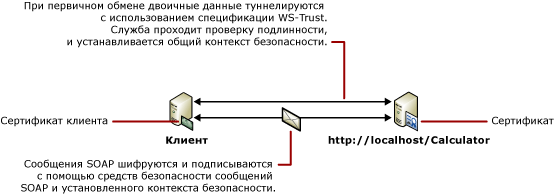

# <a name="message-security-with-a-certificate-client"></a>Безопасность сообщений при использовании клиентом сертификата
В следующем сценарии показаны клиент Windows Communication Foundation (WCF) и служба, защищенные с помощью режима безопасности сообщений. Проверка подлинности клиента и службы выполняется с помощью сертификатов. Дополнительные сведения см. в разделе [безопасности распределенных приложений](../../../../docs/framework/wcf/feature-details/distributed-application-security.md).  
  
 Пример приложения см. в разделе [сертификат безопасности сообщений](../../../../docs/framework/wcf/samples/message-security-certificate.md).  
  
   
  
|Характеристика|Описание|  
|--------------------|-----------------|  
|Режим безопасности|Сообщение|  
|Взаимодействие|Только WCF|  
|Проверка подлинности (сервера)|Использование сертификатов служб|  
|Проверка подлинности (клиента)|Использование сертификатов клиента|  
|Целостность|Да|  
|Конфиденциальность|Да|  
|Transport|HTTP|  
|Привязка|<xref:System.ServiceModel.WSHttpBinding>|  
  
## <a name="service"></a>Служба  
 Предполагается, что представленные ниже код и конфигурация выполняются независимо. Выполните одно из следующих действий.  
  
-   Создайте автономную службу, используя код без конфигурации.  
  
-   Создайте службу, используя предоставленную конфигурацию, но не определяйте конечные точки.  
  
### <a name="code"></a>Код  
 В следующем коде показано создание конечной точки службы, которая использует безопасность сообщений для установления защищенного контекста.  
  
 [!code-csharp[C_SecurityScenarios#10](../../../../samples/snippets/csharp/VS_Snippets_CFX/c_securityscenarios/cs/source.cs#10)]
 [!code-vb[C_SecurityScenarios#10](../../../../samples/snippets/visualbasic/VS_Snippets_CFX/c_securityscenarios/vb/source.vb#10)]  
  
### <a name="configuration"></a>Конфигурация  
 Вместо кода можно использовать следующую конфигурацию.  
  
```xml  
<?xml version="1.0" encoding="utf-8"?>  
<configuration>  
  <system.serviceModel>  
    <behaviors>  
      <serviceBehaviors>  
        <behavior name="ServiceCredentialsBehavior">  
          <serviceCredentials>  
            <serviceCertificate findValue="Contoso.com"  
                                x509FindType="FindBySubjectName" />  
          </serviceCredentials>  
        </behavior>  
      </serviceBehaviors>  
    </behaviors>  
    <services>  
      <service behaviorConfiguration="ServiceCredentialsBehavior"   
               name="ServiceModel.Calculator">  
        <endpoint address="http://localhost/Calculator"   
                  binding="wsHttpBinding"  
                  bindingConfiguration="MessageAndCerficiateClient"   
                  name="SecuredByClientCertificate"  
                  contract="ServiceModel.ICalculator" />  
      </service>  
    </services>  
    <bindings>  
      <wsHttpBinding>  
        <binding name="WSHttpBinding_ICalculator">  
          <security mode="Message">  
            <message clientCredentialType="Certificate" />  
          </security>  
        </binding>  
      </wsHttpBinding>  
    </bindings>  
    <client />  
  </system.serviceModel>  
</configuration>  
```  
  
## <a name="client"></a>Клиент  
 Предполагается, что представленные ниже код и конфигурация выполняются независимо. Выполните одно из следующих действий.  
  
-   Создайте автономный клиент, используя код (и код клиента).  
  
-   Создайте клиент, который не определяет никаких адресов конечных точек. Вместо этого используйте конструктор клиента, который принимает в качестве аргумента имя конфигурации. Например:  
  
     [!code-csharp[C_SecurityScenarios#0](../../../../samples/snippets/csharp/VS_Snippets_CFX/c_securityscenarios/cs/source.cs#0)]
     [!code-vb[C_SecurityScenarios#0](../../../../samples/snippets/visualbasic/VS_Snippets_CFX/c_securityscenarios/vb/source.vb#0)]  
  
### <a name="code"></a>Код  
 Следующий код служит для создания клиента. Привязка осуществляется к безопасности режима сообщений, и типу учетных данных клиента присваивается значение `Certificate`.  
  
 [!code-csharp[C_SecurityScenarios#17](../../../../samples/snippets/csharp/VS_Snippets_CFX/c_securityscenarios/cs/source.cs#17)]
 [!code-vb[C_SecurityScenarios#17](../../../../samples/snippets/visualbasic/VS_Snippets_CFX/c_securityscenarios/vb/source.vb#17)]  
  
### <a name="configuration"></a>Конфигурация  
 В следующей конфигурации задается сертификат клиента с помощью поведения конечной точки. Дополнительные сведения см. в разделе [Работа с сертификатами](../../../../docs/framework/wcf/feature-details/working-with-certificates.md). Данный код также использует <`identity`> для указания доменных имен (DNS) из удостоверения сервера ожидаемый элемент. Дополнительные сведения об удостоверении см. в разделе [службы удостоверений и проверки подлинности](../../../../docs/framework/wcf/feature-details/service-identity-and-authentication.md).  
  
```xml  
<?xml version="1.0" encoding="utf-8"?>  
<configuration>  
  <system.serviceModel>  
    <behaviors>  
      <endpointBehaviors>  
        <behavior name="endpointCredentialsBehavior">  
          <clientCredentials>  
            <clientCertificate findValue="Cohowinery.com"   
               storeLocation="LocalMachine"  
              x509FindType="FindBySubjectName" />  
          </clientCredentials>  
        </behavior>  
      </endpointBehaviors>  
    </behaviors>  
    <bindings>  
      <wsHttpBinding>  
        <binding name="WSHttpBinding_ICalculator" >  
          <security mode="Message">  
            <message clientCredentialType="Certificate" />  
          </security>  
        </binding>  
      </wsHttpBinding>  
    </bindings>  
    <client>  
      <endpoint address="http://machineName/Calculator"   
                behaviorConfiguration="endpointCredentialsBehavior"  
                binding="wsHttpBinding"  
                bindingConfiguration="WSHttpBinding_ICalculator"  
                contract="ICalculator"  
                name="WSHttpBinding_ICalculator">  
        <identity>  
          <dns value="Contoso.com" />  
        </identity>  
      </endpoint>  
    </client>  
  </system.serviceModel>  
</configuration>  
```  
  
## <a name="see-also"></a>См. также  
 [Общие сведения о безопасности](../../../../docs/framework/wcf/feature-details/security-overview.md)  
 [Идентификация и проверка подлинности службы](../../../../docs/framework/wcf/feature-details/service-identity-and-authentication.md)  
 [Работа с сертификатами](../../../../docs/framework/wcf/feature-details/working-with-certificates.md)  
 [Модель безопасности для Windows Server App Fabric](http://go.microsoft.com/fwlink/?LinkID=201279&clcid=0x409)
