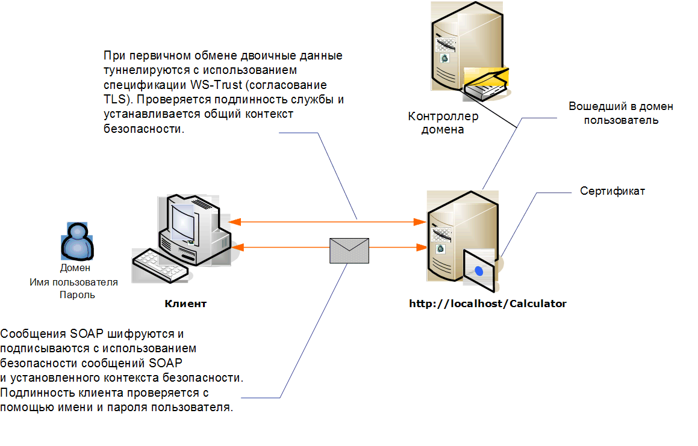

# <a name="message-security-with-a-user-name-client"></a><span data-ttu-id="04b72-102">Безопасность сообщений при использовании клиентом учетных данных пользователя</span><span class="sxs-lookup"><span data-stu-id="04b72-102">Message Security with a User Name Client</span></span>
<span data-ttu-id="04b72-103">Ниже показан службы Windows Communication Foundation (WCF) и клиента, защищены с помощью безопасности на уровне сообщений.</span><span class="sxs-lookup"><span data-stu-id="04b72-103">The following illustration shows an Windows Communication Foundation (WCF) service and client secured using message-level security.</span></span> <span data-ttu-id="04b72-104">Служба проходит проверку подлинности с использованием сертификата X.509.</span><span class="sxs-lookup"><span data-stu-id="04b72-104">The service is authenticated with an X.509 certificate.</span></span> <span data-ttu-id="04b72-105">Подлинность клиента проверяется с помощью имени и пароля пользователя.</span><span class="sxs-lookup"><span data-stu-id="04b72-105">The client authenticates using a user name and password.</span></span>  
  
 <span data-ttu-id="04b72-106">Образец приложения, см. в разделе [имя пользователя безопасности сообщения](../../../../docs/framework/wcf/samples/message-security-user-name.md).</span><span class="sxs-lookup"><span data-stu-id="04b72-106">For a sample application, see [Message Security User Name](../../../../docs/framework/wcf/samples/message-security-user-name.md).</span></span>  
  
 <span data-ttu-id="04b72-107"></span><span class="sxs-lookup"><span data-stu-id="04b72-107"></span></span>  
  
|<span data-ttu-id="04b72-108">Характеристика</span><span class="sxs-lookup"><span data-stu-id="04b72-108">Characteristic</span></span>|<span data-ttu-id="04b72-109">Описание</span><span class="sxs-lookup"><span data-stu-id="04b72-109">Description</span></span>|  
|--------------------|-----------------|  
|<span data-ttu-id="04b72-110">Режим безопасности</span><span class="sxs-lookup"><span data-stu-id="04b72-110">Security Mode</span></span>|<span data-ttu-id="04b72-111">Сообщение</span><span class="sxs-lookup"><span data-stu-id="04b72-111">Message</span></span>|  
|<span data-ttu-id="04b72-112">Взаимодействие</span><span class="sxs-lookup"><span data-stu-id="04b72-112">Interoperability</span></span>|<span data-ttu-id="04b72-113">Windows Communication Foundation (WCF) только</span><span class="sxs-lookup"><span data-stu-id="04b72-113">Windows Communication Foundation (WCF) only</span></span>|  
|<span data-ttu-id="04b72-114">Проверка подлинности (сервера)</span><span class="sxs-lookup"><span data-stu-id="04b72-114">Authentication (Server)</span></span>|<span data-ttu-id="04b72-115">Первоначальное согласование возможно только после проверки подлинности сервера</span><span class="sxs-lookup"><span data-stu-id="04b72-115">Initial negotiation requires server authentication</span></span>|  
|<span data-ttu-id="04b72-116">Проверка подлинности (клиента)</span><span class="sxs-lookup"><span data-stu-id="04b72-116">Authentication (Client)</span></span>|<span data-ttu-id="04b72-117">Имя пользователя/пароль</span><span class="sxs-lookup"><span data-stu-id="04b72-117">User name/password</span></span>|  
|<span data-ttu-id="04b72-118">Целостность</span><span class="sxs-lookup"><span data-stu-id="04b72-118">Integrity</span></span>|<span data-ttu-id="04b72-119">Да, используется общий контекст безопасности</span><span class="sxs-lookup"><span data-stu-id="04b72-119">Yes, using shared security context</span></span>|  
|<span data-ttu-id="04b72-120">Конфиденциальность</span><span class="sxs-lookup"><span data-stu-id="04b72-120">Confidentiality</span></span>|<span data-ttu-id="04b72-121">Да, используется общий контекст безопасности</span><span class="sxs-lookup"><span data-stu-id="04b72-121">Yes, using shared security context</span></span>|  
|<span data-ttu-id="04b72-122">Transport</span><span class="sxs-lookup"><span data-stu-id="04b72-122">Transport</span></span>|<span data-ttu-id="04b72-123">HTTP</span><span class="sxs-lookup"><span data-stu-id="04b72-123">HTTP</span></span>|  
|<span data-ttu-id="04b72-124">Привязка</span><span class="sxs-lookup"><span data-stu-id="04b72-124">Binding</span></span>|<xref:System.ServiceModel.WSHttpBinding>|  
  
## <a name="service"></a><span data-ttu-id="04b72-125">Служба</span><span class="sxs-lookup"><span data-stu-id="04b72-125">Service</span></span>  
 <span data-ttu-id="04b72-126">Предполагается, что представленные ниже код и конфигурация выполняются независимо.</span><span class="sxs-lookup"><span data-stu-id="04b72-126">The following code and configuration are meant to run independently.</span></span> <span data-ttu-id="04b72-127">Выполните одно из следующих действий.</span><span class="sxs-lookup"><span data-stu-id="04b72-127">Do one of the following:</span></span>  
  
-   <span data-ttu-id="04b72-128">Создайте автономную службу, используя код без конфигурации.</span><span class="sxs-lookup"><span data-stu-id="04b72-128">Create a stand-alone service using the code with no configuration.</span></span>  
  
-   <span data-ttu-id="04b72-129">Создайте службу, используя предоставленную конфигурацию, но не определяйте конечные точки.</span><span class="sxs-lookup"><span data-stu-id="04b72-129">Create a service using the supplied configuration, but do not define any endpoints.</span></span>  
  
### <a name="code"></a><span data-ttu-id="04b72-130">Код</span><span class="sxs-lookup"><span data-stu-id="04b72-130">Code</span></span>  
 <span data-ttu-id="04b72-131">В следующем коде показано, как создать конечную точку службы, которая использует безопасность сообщений.</span><span class="sxs-lookup"><span data-stu-id="04b72-131">The following code shows how to create a service endpoint that uses message security.</span></span>  
  
 [!code-csharp[C_SecurityScenarios#9](../../../../samples/snippets/csharp/VS_Snippets_CFX/c_securityscenarios/cs/source.cs#9)]
 [!code-vb[C_SecurityScenarios#9](../../../../samples/snippets/visualbasic/VS_Snippets_CFX/c_securityscenarios/vb/source.vb#9)]  
  
### <a name="configuration"></a><span data-ttu-id="04b72-132">Конфигурация</span><span class="sxs-lookup"><span data-stu-id="04b72-132">Configuration</span></span>  
 <span data-ttu-id="04b72-133">Вместо кода можно использовать следующую конфигурацию:</span><span class="sxs-lookup"><span data-stu-id="04b72-133">The following configuration can be used instead of the code:</span></span>  
  
```xml  
<?xml version="1.0" encoding="utf-8"?>  
<configuration>  
  <system.serviceModel>  
    <behaviors>  
      <serviceBehaviors>  
        <behavior name="ServiceCredentialsBehavior">  
          <serviceCredentials>  
            <serviceCertificate findValue="Contoso.com"   
                                storeLocation="LocalMachine"  
                                storeName="My"     
                                x509FindType="FindBySubjectName" />  
          </serviceCredentials>  
        </behavior>  
      </serviceBehaviors>  
    </behaviors>  
    <services>  
      <service behaviorConfiguration="ServiceCredentialsBehavior"  
               name="ServiceModel.Calculator">  
        <endpoint address="http://localhost/Calculator"  
                  binding="wsHttpBinding"  
                  bindingConfiguration="MessageAndUserName"  
                  name="SecuredByTransportEndpoint"  
                  contract="ServiceModel.ICalculator" />  
      </service>  
    </services>  
    <bindings>  
      <wsHttpBinding>  
        <binding name="MessageAndUserName">  
          <security mode="Message">              
            <message clientCredentialType="UserName" />  
          </security>  
        </binding>  
      </wsHttpBinding>  
    </bindings>  
    <client />  
  </system.serviceModel>  
</configuration>  
```  
  
## <a name="client"></a><span data-ttu-id="04b72-134">"Клиент";</span><span class="sxs-lookup"><span data-stu-id="04b72-134">Client</span></span>  
  
### <a name="code"></a><span data-ttu-id="04b72-135">Код</span><span class="sxs-lookup"><span data-stu-id="04b72-135">Code</span></span>  
 <span data-ttu-id="04b72-136">Следующий код служит для создания клиента.</span><span class="sxs-lookup"><span data-stu-id="04b72-136">The following code creates the client.</span></span> <span data-ttu-id="04b72-137">Привязка осуществляется к безопасности режима сообщений, и типу учетных данных клиента присваивается значение `UserName`.</span><span class="sxs-lookup"><span data-stu-id="04b72-137">The binding is to message mode security, and the client credential type is set to `UserName`.</span></span> <span data-ttu-id="04b72-138">Указать имя пользователя и пароль можно только с помощью кода (они не подлежат настройке).</span><span class="sxs-lookup"><span data-stu-id="04b72-138">The user name and password can only be specified using code (it is not configurable).</span></span> <span data-ttu-id="04b72-139">Здесь не показан код, который возвращает имя пользователя и пароль, потому что это происходит на уровне приложения.</span><span class="sxs-lookup"><span data-stu-id="04b72-139">The code to return the user name and password is not shown here because it must be done at the application level.</span></span> <span data-ttu-id="04b72-140">Например, диалоговое окно Windows Forms используется для того, чтобы запросить пользователя о данных.</span><span class="sxs-lookup"><span data-stu-id="04b72-140">For example, use a Windows Forms dialog box to query the user for the data.</span></span>  
  
 [!code-csharp[C_SecurityScenarios#16](../../../../samples/snippets/csharp/VS_Snippets_CFX/c_securityscenarios/cs/source.cs#16)]
 [!code-vb[C_SecurityScenarios#16](../../../../samples/snippets/visualbasic/VS_Snippets_CFX/c_securityscenarios/vb/source.vb#16)]  
  
### <a name="configuration"></a><span data-ttu-id="04b72-141">Конфигурация</span><span class="sxs-lookup"><span data-stu-id="04b72-141">Configuration</span></span>  
 <span data-ttu-id="04b72-142">Следующий код служит для настройки клиента.</span><span class="sxs-lookup"><span data-stu-id="04b72-142">The following code configures the client.</span></span> <span data-ttu-id="04b72-143">Привязка осуществляется к безопасности режима сообщений, и типу учетных данных клиента присваивается значение `UserName`.</span><span class="sxs-lookup"><span data-stu-id="04b72-143">The binding is to message mode security, and the client credential type is set to `UserName`.</span></span> <span data-ttu-id="04b72-144">Указать имя пользователя и пароль можно только с помощью кода (они не подлежат настройке).</span><span class="sxs-lookup"><span data-stu-id="04b72-144">The user name and password can only be specified using code (it is not configurable).</span></span>  
  
```xml  
<?xml version="1.0" encoding="utf-8"?>  
<configuration>  
  <system.serviceModel>  
    <bindings>  
      <wsHttpBinding>  
        <binding name="WSHttpBinding_ICalculator" >  
          <security mode="Message">  
            <message clientCredentialType="UserName" />  
          </security>  
        </binding>  
      </wsHttpBinding>  
    </bindings>  
    <client>  
      <endpoint address="http://machineName/Calculator"   
                binding="wsHttpBinding"  
                bindingConfiguration="WSHttpBinding_ICalculator"   
                contract="ICalculator"  
                name="WSHttpBinding_ICalculator">  
        <identity>  
          <dns value ="Contoso.com" />  
        </identity>  
      </endpoint>  
    </client>  
  </system.serviceModel>  
</configuration>  
```  
  
## <a name="see-also"></a><span data-ttu-id="04b72-145">См. также</span><span class="sxs-lookup"><span data-stu-id="04b72-145">See Also</span></span>  
 [<span data-ttu-id="04b72-146">Общие сведения о безопасности</span><span class="sxs-lookup"><span data-stu-id="04b72-146">Security Overview</span></span>](../../../../docs/framework/wcf/feature-details/security-overview.md)  
 [<span data-ttu-id="04b72-147">Безопасность сообщений с использованием имени пользователя</span><span class="sxs-lookup"><span data-stu-id="04b72-147">Message Security User Name</span></span>](../../../../docs/framework/wcf/samples/message-security-user-name.md)  
 [<span data-ttu-id="04b72-148">Идентификация и проверка подлинности службы</span><span class="sxs-lookup"><span data-stu-id="04b72-148">Service Identity and Authentication</span></span>](../../../../docs/framework/wcf/feature-details/service-identity-and-authentication.md)  
 [<span data-ttu-id="04b72-149">\<удостоверение ></span><span class="sxs-lookup"><span data-stu-id="04b72-149">\<identity></span></span>](../../../../docs/framework/configure-apps/file-schema/wcf/identity.md)  
 [<span data-ttu-id="04b72-150">Модель безопасности для Windows Server App Fabric</span><span class="sxs-lookup"><span data-stu-id="04b72-150">Security Model for Windows Server App Fabric</span></span>](https://go.microsoft.com/fwlink/?LinkID=201279&clcid=0x409)
