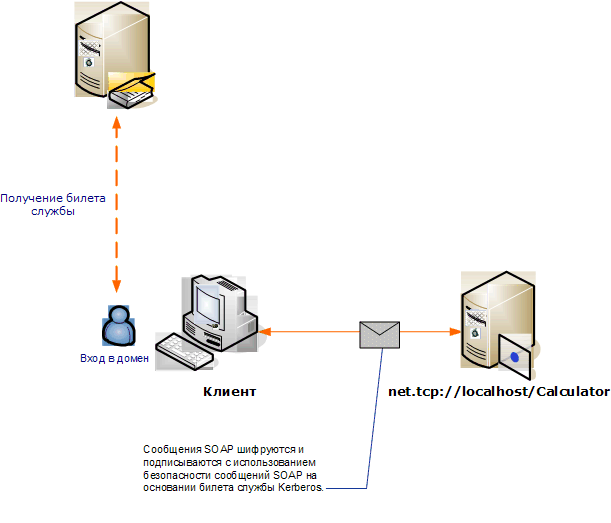

# <a name="message-security-with-a-windows-client-without-credential-negotiation"></a>Безопасность сообщений с использованием клиента Windows без согласования учетных данных

В следующем сценарии показан клиент Windows Communication Foundation (WCF) и служба, защищенные протоколом Kerberos.

Клиент и служба находятся в одном и том же домене или в доверенных доменах.

> [!NOTE]
> Разница между этим сценарием и [безопасностью сообщений с помощью клиента Windows](../../../../docs/framework/wcf/feature-details/message-security-with-a-windows-client.md) заключается в том, что этот сценарий не согласовывает учетные данные службы с службой до отправки сообщения приложения. И так как для этого требуется протокол Kerberos, для этого сценария необходима среда домена Windows.



|Характеристика|Описание|
|--------------------|-----------------|
|Режим безопасности|Message|
|Взаимодействие|Да, WS-Security с клиентами, совместимыми с профилем маркера Kerberos|
|Проверка подлинности (сервера)|Взаимная проверка подлинности сервера и клиента|
|Проверка подлинности (клиента)|Взаимная проверка подлинности сервера и клиента|
|Целостность|Да|
|Конфиденциальность|Да|
|Transport|HTTP|
|Привязка|<xref:System.ServiceModel.WSHttpBinding>|

## <a name="service"></a>Service

Предполагается, что представленные ниже код и конфигурация выполняются независимо. Выполните одно из следующих действий.

- Создайте автономную службу, используя код без конфигурации.

- Создайте службу, используя предоставленную конфигурацию, но не определяйте конечные точки.

### <a name="code"></a>Код

В следующем коде создается конечная точка службы, которая использует безопасность сообщений. Этот код отключает согласование учетных данных службы и установку маркера контекста безопасности (SCT).

> [!NOTE]
> Для использования типа учетных данных Windows без согласования учетная запись пользователя службы должна иметь доступ к имени участника-службы (SPN), зарегистрированному с доменом Active Directory. Для этого существуют два способа:

1. Используйте учетную запись `NetworkService` или `LocalSystem` для запуска службы. Поскольку эти учетные записи имеют доступ к имени участника-службы (SPN), установленному при присоединении компьютера к домену Active Directory, WCF автоматически создает соответствующий элемент SPN внутри конечной точки службы в метаданных службы (описание веб-служб Язык или WSDL).

2. Запустите службу из любой учетной записи домена Active Directory. В этом случае потребуется установить SPN для учетной записи домена. Это можно сделать, например, с помощью средства Setspn.exe. После создания имени SPN для учетной записи службы настройте WCF для публикации имени участника-службы на клиентах службы через ее метаданные (WSDL). Это можно сделать, настроив удостоверение конечной точки для предоставляемой конечной точки либо в файле конфигурации приложения, либо в коде. В следующем примере описывается программный способ публикации удостоверения.

Дополнительные сведения об именах участников-служб, протоколе Kerberos и Active Directory см. в статье [Техническая поддержка Kerberos для Windows](https://docs.microsoft.com/previous-versions/msp-n-p/ff649429(v=pandp.10)). Дополнительные сведения о идентификаторах конечных точек см. в разделе [режимы проверки подлинности SecurityBindingElement](../../../../docs/framework/wcf/feature-details/securitybindingelement-authentication-modes.md).

[!code-csharp[C_SecurityScenarios#12](../../../../samples/snippets/csharp/VS_Snippets_CFX/c_securityscenarios/cs/source.cs#12)]
[!code-vb[C_SecurityScenarios#12](../../../../samples/snippets/visualbasic/VS_Snippets_CFX/c_securityscenarios/vb/source.vb#12)]

### <a name="configuration"></a>Конфигурация

Вместо кода можно использовать следующую конфигурацию.

```xml
<?xml version="1.0" encoding="utf-8"?>
<configuration>
  <system.serviceModel>
    <behaviors />
    <services>
      <service behaviorConfiguration="" name="ServiceModel.Calculator">
        <endpoint address="http://localhost/Calculator"
                  binding="wsHttpBinding"
                  bindingConfiguration="KerberosBinding"
                  name="WSHttpBinding_ICalculator"
                  contract="ServiceModel.ICalculator"
                  listenUri="net.tcp://localhost/metadata" >
         <identity>
            <servicePrincipalName value="service_spn_name" />
         </identity>
        </endpoint>
      </service>
    </services>
    <bindings>
      <wsHttpBinding>
        <binding name="KerberosBinding">
          <security>
            <message negotiateServiceCredential="false"
                     establishSecurityContext="false" />
          </security>
        </binding>
      </wsHttpBinding>
    </bindings>
    <client />
  </system.serviceModel>
</configuration>
```

## <a name="client"></a>Клиент

Предполагается, что представленные ниже код и конфигурация выполняются независимо. Выполните одно из следующих действий.

- Создайте автономный клиент, используя код (и код клиента).

- Создайте клиент, который не определяет никаких адресов конечных точек. Вместо этого используйте конструктор клиента, который принимает в качестве аргумента имя конфигурации. Например:

  [!code-csharp[C_SecurityScenarios#0](../../../../samples/snippets/csharp/VS_Snippets_CFX/c_securityscenarios/cs/source.cs#0)]
  [!code-vb[C_SecurityScenarios#0](../../../../samples/snippets/visualbasic/VS_Snippets_CFX/c_securityscenarios/vb/source.vb#0)]

### <a name="code"></a>Код

Следующий код служит для настройки клиента. Для режима безопасности задано значение Message, типу учетных данных клиента присвоено значение Windows. Обратите внимание: свойствам <xref:System.ServiceModel.MessageSecurityOverHttp.NegotiateServiceCredential%2A> и <xref:System.ServiceModel.NonDualMessageSecurityOverHttp.EstablishSecurityContext%2A> задается значение `false`.

> [!NOTE]
> Для использования типа учетных данных Windows без согласования требуется настроить SPN учетной записи службы до начала обмена данными со службой. Клиент использует имя SPN, чтобы получить маркер Kerberos для проверки подлинности и обеспечения безопасности обмена данными со службой. В следующем образце показано, как настроить SPN службы для клиента. Если для создания клиента используется [средство служебной программы для метаданных ServiceModel (Svcutil. exe)](../../../../docs/framework/wcf/servicemodel-metadata-utility-tool-svcutil-exe.md) , то SPN службы будет автоматически распространяться на клиент из метаданных службы (WSDL), если метаданные службы содержат эти сведения. Дополнительные сведения о настройке службы для включения имени участника-службы в метаданные службы см. в подразделе "служба" Далее в этом разделе.
>
> Дополнительные сведения о SPN, Kerberos и Active Directory см. в статье [Техническая поддержка Kerberos для Windows](https://docs.microsoft.com/previous-versions/msp-n-p/ff649429(v=pandp.10)). Дополнительные сведения о удостоверениях конечных точек см. в разделе [SecurityBindingElement Authentication modes](../../../../docs/framework/wcf/feature-details/securitybindingelement-authentication-modes.md) .

[!code-csharp[C_SecurityScenarios#19](../../../../samples/snippets/csharp/VS_Snippets_CFX/c_securityscenarios/cs/source.cs#19)]
[!code-vb[C_SecurityScenarios#19](../../../../samples/snippets/visualbasic/VS_Snippets_CFX/c_securityscenarios/vb/source.vb#19)]

### <a name="configuration"></a>Конфигурация

Следующий код служит для настройки клиента. Обратите внимание, что элемент\<"переносить [>](../../../../docs/framework/configure-apps/file-schema/wcf/serviceprincipalname.md) " должен быть установлен в соответствии с именем SPN службы, зарегистрированным для учетной записи службы в домене Active Directory.

```xml
<?xml version="1.0" encoding="utf-8"?>
<configuration>
  <system.serviceModel>
    <bindings>
      <wsHttpBinding>
        <binding name="WSHttpBinding_ICalculator" >
          <security mode="Message">
            <message clientCredentialType="Windows"
                     negotiateServiceCredential="false"
                     establishSecurityContext="false" />
          </security>
        </binding>
      </wsHttpBinding>
    </bindings>
    <client>
      <endpoint address="http://localhost/Calculator"
                binding="wsHttpBinding"
                bindingConfiguration="WSHttpBinding_ICalculator"
                contract="ICalculator"
                name="WSHttpBinding_ICalculator">
        <identity>
          <servicePrincipalName value="service_spn_name" />
        </identity>
      </endpoint>
    </client>
  </system.serviceModel>
</configuration>
```

## <a name="see-also"></a>См. также:

- [Общие сведения о безопасности](../../../../docs/framework/wcf/feature-details/security-overview.md)
- [Идентификация и проверка подлинности службы](../../../../docs/framework/wcf/feature-details/service-identity-and-authentication.md)
- [Модель безопасности для Windows Server App Fabric](https://docs.microsoft.com/previous-versions/appfabric/ee677202(v=azure.10))
