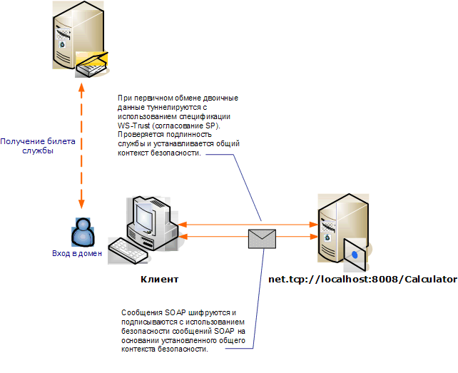

# <a name="message-security-with-a-windows-client"></a>Безопасность сообщений с клиентом Windows
В этом сценарии показан клиент Windows Communication Foundation (WCF) и сервер, защищенный режимом безопасности сообщений. Клиент и служба проходят проверку подлинности с использованием учетных данных Windows.  
  
   
  
|Характеристика|Описание|  
|--------------------|-----------------|  
|Режим безопасности|Message|  
|Взаимодействие|Только WCF|  
|Проверка подлинности (сервера)|Взаимная проверка подлинности сервера и клиента|  
|Проверка подлинности (клиента)|Взаимная проверка подлинности сервера и клиента|  
|Целостность|Да, используется общий контекст безопасности|  
|Конфиденциальность|Да, используется общий контекст безопасности|  
|Transport|NET.TCP|  
|Привязка|<xref:System.ServiceModel.NetTcpBinding>|  
  
## <a name="service"></a>Service  
 Предполагается, что представленные ниже код и конфигурация выполняются независимо. Выполните одно из следующих действий.  
  
- Создайте автономную службу, используя код без конфигурации.  
  
- Создайте службу, используя предоставленную конфигурацию, но не определяйте конечные точки.  
  
### <a name="code"></a>Код  
 В следующем коде показано создание конечной точки службы, которая использует безопасность сообщений для установления защищенного контекста с компьютером Windows.  
  
 [!code-csharp[C_SecurityScenarios#11](../../../../samples/snippets/csharp/VS_Snippets_CFX/c_securityscenarios/cs/source.cs#11)]
 [!code-vb[C_SecurityScenarios#11](../../../../samples/snippets/visualbasic/VS_Snippets_CFX/c_securityscenarios/vb/source.vb#11)]  
  
### <a name="configuration"></a>Конфигурация  
 Вместо кода для настройки службы можно использовать следующую конфигурацию:  
  
```xml  
<?xml version="1.0" encoding="utf-8"?>  
<configuration>  
  <system.serviceModel>  
    <services>  
      <service behaviorConfiguration=""  
               name="ServiceModel.Calculator">  
        <endpoint address="net.tcp://localhost:8008/Calculator"  
                  binding="netTcpBinding"  
                  bindingConfiguration="Windows"  
                  name="WindowsOverMessage"  
                  contract="ServiceModel.ICalculator" />  
      </service>  
    </services>  
    <bindings>  
      <netTcpBinding>  
        <binding name="Windows">  
          <security mode="Message">  
            <message clientCredentialType="Windows" />  
          </security>  
        </binding>  
      </netTcpBinding>  
    </bindings>  
    <client />  
  </system.serviceModel>  
</configuration>  
```  
  
## <a name="client"></a>Клиент  
 Предполагается, что представленные ниже код и конфигурация выполняются независимо. Выполните одно из следующих действий.  
  
- Создайте автономный клиент, используя код (и код клиента).  
  
- Создайте клиент, который не определяет никаких адресов конечных точек. Вместо этого используйте конструктор клиента, который принимает в качестве аргумента имя конфигурации. Например:  
  
     [!code-csharp[C_SecurityScenarios#0](../../../../samples/snippets/csharp/VS_Snippets_CFX/c_securityscenarios/cs/source.cs#0)]
     [!code-vb[C_SecurityScenarios#0](../../../../samples/snippets/visualbasic/VS_Snippets_CFX/c_securityscenarios/vb/source.vb#0)]  
  
### <a name="code"></a>Код  
 Следующий код служит для создания клиента. Привязка осуществляется к безопасности режима сообщений, и типу учетных данных клиента присваивается значение `Windows`.  
  
 [!code-csharp[C_SecurityScenarios#18](../../../../samples/snippets/csharp/VS_Snippets_CFX/c_securityscenarios/cs/source.cs#18)]
 [!code-vb[C_SecurityScenarios#18](../../../../samples/snippets/visualbasic/VS_Snippets_CFX/c_securityscenarios/vb/source.vb#18)]  
  
### <a name="configuration"></a>Конфигурация  
 Следующая конфигурация используется для задания свойств клиента.  
  
```xml  
<?xml version="1.0" encoding="utf-8"?>  
<configuration>  
  <system.serviceModel>  
    <bindings>  
      <netTcpBinding>  
        <binding name="NetTcpBinding_ICalculator" >  
         <security mode="Message">  
            <message clientCredentialType="Windows" />  
          </security>  
        </binding>  
      </netTcpBinding>  
    </bindings>  
    <client>  
      <endpoint address="net.tcp://machineName:8008/Calculator"   
                binding="netTcpBinding"  
                bindingConfiguration="NetTcpBinding_ICalculator"  
                contract="ICalculator"  
                name="NetTcpBinding_ICalculator">          
      </endpoint>  
    </client>  
  </system.serviceModel>  
</configuration>  
```  
  
## <a name="see-also"></a>См. также:

- [Общие сведения о безопасности](../../../../docs/framework/wcf/feature-details/security-overview.md)
- [Модель безопасности для Windows Server App Fabric](https://docs.microsoft.com/previous-versions/appfabric/ee677202(v=azure.10))
