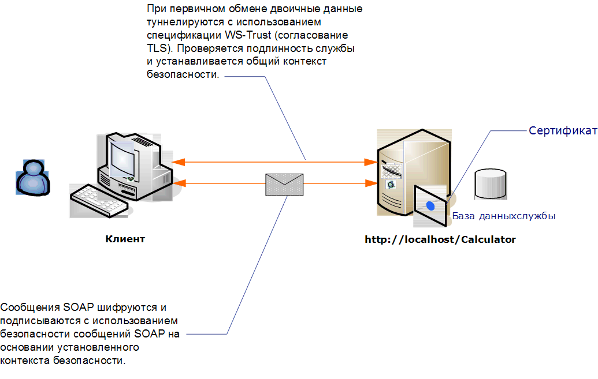

# <a name="message-security-with-an-anonymous-client"></a>Безопасность сообщений с анонимным клиентом

В следующем сценарии показан клиент и служба, защищенные с помощью защиты сообщений Windows Communication Foundation (WCF). Задача, поставленная при разработке, заключается в использовании безопасности сообщений, а не безопасности транспорта, чтобы в будущем возможно было использование более глубокой модели, использующей утверждения. Дополнительные сведения об использовании расширенных утверждений для авторизации см. [в статье Управление утверждениями и авторизацией с помощью модели удостоверений](../../../../docs/framework/wcf/feature-details/managing-claims-and-authorization-with-the-identity-model.md).

Пример приложения см. в разделе [безопасность сообщений анонимно](../../../../docs/framework/wcf/samples/message-security-anonymous.md).



|Характеристика|Описание|
|--------------------|-----------------|
|Режим безопасности|Message|
|Взаимодействие|Только WCF|
|Проверка подлинности (сервера)|Первоначальное согласование возможно только после проверки подлинности сервера, но не клиента|
|Проверка подлинности (клиента)|Нет|
|Целостность|Да, используется общий контекст безопасности|
|Конфиденциальность|Да, используется общий контекст безопасности|
|Transport|HTTP|

## <a name="service"></a>Service

Предполагается, что представленные ниже код и конфигурация выполняются независимо. Выполните одно из следующих действий.

- Создайте автономную службу, используя код без конфигурации.

- Создайте службу, используя предоставленную конфигурацию, но не определяйте конечные точки.

### <a name="code"></a>Код

В следующем коде показано, как создать конечную точку службы, которая использует безопасность сообщений.

[!code-csharp[C_SecurityScenarios#8](../../../../samples/snippets/csharp/VS_Snippets_CFX/c_securityscenarios/cs/source.cs#8)]
[!code-vb[C_SecurityScenarios#8](../../../../samples/snippets/visualbasic/VS_Snippets_CFX/c_securityscenarios/vb/source.vb#8)]

### <a name="configuration"></a>Конфигурация

Вместо кода можно использовать следующую конфигурацию. Элемент поведения службы используется для указания сертификата, который используется для проверки подлинности службы для клиента. Элемент службы должен задавать поведение с помощью атрибута `behaviorConfiguration`. Элемент привязки указывает, что типу учетных данных клиента присвоено значение `None`, позволяя анонимному клиенту использовать службу.

```xml
<?xml version="1.0" encoding="utf-8"?>
<configuration>
  <system.serviceModel>
    <behaviors>
      <serviceBehaviors>
        <behavior name="ServiceCredentialsBehavior">
          <serviceCredentials>
            <serviceCertificate findValue="contoso.com"
                                storeLocation="LocalMachine"
                                storeName="My" />
          </serviceCredentials>
        </behavior>
      </serviceBehaviors>
    </behaviors>
    <services>
      <service behaviorConfiguration="ServiceCredentialsBehavior"
               name="ServiceModel.Calculator">
        <endpoint address="http://localhost/Calculator"
                  binding="wsHttpBinding"
                  bindingConfiguration="WSHttpBinding_ICalculator"
                  name="CalculatorService"
                  contract="ServiceModel.ICalculator" />
      </service>
    </services>
    <bindings>
      <wsHttpBinding>
        <binding name="WSHttpBinding_ICalculator" >
          <security mode="Message">
            <message clientCredentialType="None" />
          </security>
        </binding>
      </wsHttpBinding>
    </bindings>
    <client />
  </system.serviceModel>
</configuration>
```

## <a name="client"></a>Клиент

Предполагается, что представленные ниже код и конфигурация выполняются независимо. Выполните одно из следующих действий.

- Создайте автономный клиент, используя код (и код клиента).

- Создайте клиент, который не определяет никаких адресов конечных точек. Вместо этого используйте конструктор клиента, который принимает в качестве аргумента имя конфигурации. Например:

    [!code-csharp[C_SecurityScenarios#0](../../../../samples/snippets/csharp/VS_Snippets_CFX/c_securityscenarios/cs/source.cs#0)]
    [!code-vb[C_SecurityScenarios#0](../../../../samples/snippets/visualbasic/VS_Snippets_CFX/c_securityscenarios/vb/source.vb#0)]

### <a name="code"></a>Код

В следующем примере кода создается экземпляр клиента. Привязка использует безопасность режима сообщений, и тип учетных данных клиента задан как None.

[!code-csharp[C_SecurityScenarios#15](../../../../samples/snippets/csharp/VS_Snippets_CFX/c_securityscenarios/cs/source.cs#15)]
[!code-vb[C_SecurityScenarios#15](../../../../samples/snippets/visualbasic/VS_Snippets_CFX/c_securityscenarios/vb/source.vb#15)]

### <a name="configuration"></a>Конфигурация

Следующий код служит для настройки клиента.

```xml
<?xml version="1.0" encoding="utf-8"?>
<configuration>
  <system.serviceModel>
    <bindings>
      <wsHttpBinding>
        <binding name="WSHttpBinding_ICalculator" >
          <security mode="Message">
            <message clientCredentialType="None" />
          </security>
        </binding>
      </wsHttpBinding>
    </bindings>
    <client>
      <endpoint address="http://machineName/Calculator"
        binding="wsHttpBinding"
        bindingConfiguration="WSHttpBinding_ICalculator"
        contract="ICalculator"
        name="WSHttpBinding_ICalculator">
        <identity>
          <dns value="contoso.com" />
        </identity>
      </endpoint>
    </client>
  </system.serviceModel>
</configuration>
```

## <a name="see-also"></a>См. также:

- [Общие сведения о безопасности](../../../../docs/framework/wcf/feature-details/security-overview.md)
- [Защита распределенных приложений](../../../../docs/framework/wcf/feature-details/distributed-application-security.md)
- [Безопасность сообщений с возможностью анонимного доступа](../../../../docs/framework/wcf/samples/message-security-anonymous.md)
- [Идентификация и проверка подлинности службы](../../../../docs/framework/wcf/feature-details/service-identity-and-authentication.md)
- [Модель безопасности для Windows Server App Fabric](https://docs.microsoft.com/previous-versions/appfabric/ee677202(v=azure.10))
