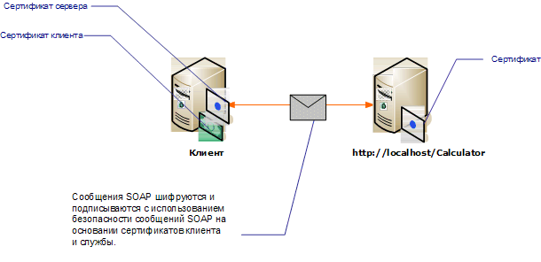

# <a name="message-security-with-mutual-certificates"></a><span data-ttu-id="c866e-102">Безопасность сообщений с использованием взаимных сертификатов</span><span class="sxs-lookup"><span data-stu-id="c866e-102">Message Security with Mutual Certificates</span></span>
<span data-ttu-id="c866e-103">В следующем сценарии показана служба Windows Communication Foundation (WCF) и клиент, защищенный с помощью режима безопасности сообщений.</span><span class="sxs-lookup"><span data-stu-id="c866e-103">The following scenario shows a Windows Communication Foundation (WCF) service and client secured using message security mode.</span></span> <span data-ttu-id="c866e-104">Проверка подлинности клиента и службы выполняется с помощью сертификатов.</span><span class="sxs-lookup"><span data-stu-id="c866e-104">The client and the service are authenticated with certificates.</span></span>  
  
 <span data-ttu-id="c866e-105">Данный сценарий поддерживает возможность взаимодействия, поскольку в нем используется WS-Security с профилем маркера сертификата X.509.</span><span class="sxs-lookup"><span data-stu-id="c866e-105">This scenario is interoperable because it uses WS-Security with the X.509 certificate token profile.</span></span>  
  
> [!NOTE]
> <span data-ttu-id="c866e-106">Данный сценарий не выполняет согласование сертификата службы.</span><span class="sxs-lookup"><span data-stu-id="c866e-106">This scenario does not perform negotiation of the service certificate.</span></span> <span data-ttu-id="c866e-107">Сертификат службы должен быть предоставлен клиенту перед началом любой связи.</span><span class="sxs-lookup"><span data-stu-id="c866e-107">The service certificate must be provided to the client in advance of any communication.</span></span> <span data-ttu-id="c866e-108">Сертификат сервера может быть распределен приложением или предоставлен во внеполосной связи.</span><span class="sxs-lookup"><span data-stu-id="c866e-108">The server certificate can be distributed with the application or provided in an out-of-band communication.</span></span>  
  
 <span data-ttu-id="c866e-109"></span><span class="sxs-lookup"><span data-stu-id="c866e-109"></span></span>  
  
|<span data-ttu-id="c866e-110">Характеристика</span><span class="sxs-lookup"><span data-stu-id="c866e-110">Characteristic</span></span>|<span data-ttu-id="c866e-111">Описание</span><span class="sxs-lookup"><span data-stu-id="c866e-111">Description</span></span>|  
|--------------------|-----------------|  
|<span data-ttu-id="c866e-112">Режим безопасности</span><span class="sxs-lookup"><span data-stu-id="c866e-112">Security Mode</span></span>|<span data-ttu-id="c866e-113">Сообщение</span><span class="sxs-lookup"><span data-stu-id="c866e-113">Message</span></span>|  
|<span data-ttu-id="c866e-114">Совместимость</span><span class="sxs-lookup"><span data-stu-id="c866e-114">Interoperability</span></span>|<span data-ttu-id="c866e-115">Да, с клиентами и службами, совместимыми с профилем маркера WS-Security и сертификата X.509.</span><span class="sxs-lookup"><span data-stu-id="c866e-115">Yes, with WS-Security and X.509 certificate token profile compatible clients and services.</span></span>|  
|<span data-ttu-id="c866e-116">Аутентификация</span><span class="sxs-lookup"><span data-stu-id="c866e-116">Authentication</span></span>|<span data-ttu-id="c866e-117">Взаимная проверка подлинности сервера и клиента.</span><span class="sxs-lookup"><span data-stu-id="c866e-117">Mutual authentication of the server and client.</span></span>|  
|<span data-ttu-id="c866e-118">Целостность</span><span class="sxs-lookup"><span data-stu-id="c866e-118">Integrity</span></span>|<span data-ttu-id="c866e-119">Да</span><span class="sxs-lookup"><span data-stu-id="c866e-119">Yes</span></span>|  
|<span data-ttu-id="c866e-120">Конфиденциальность</span><span class="sxs-lookup"><span data-stu-id="c866e-120">Confidentiality</span></span>|<span data-ttu-id="c866e-121">Да</span><span class="sxs-lookup"><span data-stu-id="c866e-121">Yes</span></span>|  
|<span data-ttu-id="c866e-122">Транспортировка</span><span class="sxs-lookup"><span data-stu-id="c866e-122">Transport</span></span>|<span data-ttu-id="c866e-123">HTTP</span><span class="sxs-lookup"><span data-stu-id="c866e-123">HTTP</span></span>|  
|<span data-ttu-id="c866e-124">Привязка</span><span class="sxs-lookup"><span data-stu-id="c866e-124">Binding</span></span>|<xref:System.ServiceModel.WSHttpBinding>|  
  
## <a name="service"></a><span data-ttu-id="c866e-125">Служба</span><span class="sxs-lookup"><span data-stu-id="c866e-125">Service</span></span>  
 <span data-ttu-id="c866e-126">Предполагается, что представленные ниже код и конфигурация выполняются независимо.</span><span class="sxs-lookup"><span data-stu-id="c866e-126">The following code and configuration are meant to run independently.</span></span> <span data-ttu-id="c866e-127">Выполните одно из следующих действий.</span><span class="sxs-lookup"><span data-stu-id="c866e-127">Do one of the following:</span></span>  
  
- <span data-ttu-id="c866e-128">Создайте автономную службу, используя код без конфигурации.</span><span class="sxs-lookup"><span data-stu-id="c866e-128">Create a stand-alone service using the code with no configuration.</span></span>  
  
- <span data-ttu-id="c866e-129">Создайте службу, используя предоставленную конфигурацию, но не определяйте конечные точки.</span><span class="sxs-lookup"><span data-stu-id="c866e-129">Create a service using the supplied configuration, but do not define any endpoints.</span></span>  
  
### <a name="code"></a><span data-ttu-id="c866e-130">Код</span><span class="sxs-lookup"><span data-stu-id="c866e-130">Code</span></span>  
 <span data-ttu-id="c866e-131">В следующем коде показано, как создать конечную точку службы, которая использует безопасность сообщений.</span><span class="sxs-lookup"><span data-stu-id="c866e-131">The following code shows creates a service endpoint that uses message security.</span></span> <span data-ttu-id="c866e-132">Служба требует прохождения проверки подлинности сертификата.</span><span class="sxs-lookup"><span data-stu-id="c866e-132">The service requires a certificate to authenticate itself.</span></span>  
  
 [!code-csharp[C_SecurityScenarios#13](../../../../samples/snippets/csharp/VS_Snippets_CFX/c_securityscenarios/cs/source.cs#13)]
 [!code-vb[C_SecurityScenarios#13](../../../../samples/snippets/visualbasic/VS_Snippets_CFX/c_securityscenarios/vb/source.vb#13)]  
  
### <a name="configuration"></a><span data-ttu-id="c866e-133">Конфигурация</span><span class="sxs-lookup"><span data-stu-id="c866e-133">Configuration</span></span>  
 <span data-ttu-id="c866e-134">Вместо кода для создания той же службы можно использовать следующую конфигурацию.</span><span class="sxs-lookup"><span data-stu-id="c866e-134">The following configuration can be used instead of the code to create the same service.</span></span>  
  
```xml  
<?xml version="1.0" encoding="utf-8"?>  
<configuration>  
  <system.serviceModel>  
    <behaviors>  
      <serviceBehaviors>  
        <behavior name="serviceCredentialBehavior">  
          <serviceCredentials>  
            <serviceCertificate findValue="Contoso.com"
                                storeLocation="LocalMachine"  
                                storeName="My"
                                x509FindType="FindBySubjectName" />  
          </serviceCredentials>  
        </behavior>  
      </serviceBehaviors>  
    </behaviors>  
    <services>  
      <service behaviorConfiguration="serviceCredentialBehavior"
               name="ServiceModel.Calculator">  
        <endpoint address="http://localhost/Calculator"
                  binding="wsHttpBinding"  
                  bindingConfiguration="InteropCertificateBinding"  
                  name="WSHttpBinding_ICalculator"  
                  contract="ServiceModel.ICalculator" />  
      </service>  
    </services>  
    <bindings>  
      <wsHttpBinding>  
        <binding name="InteropCertificateBinding">  
          <security mode="Message">  
            <message clientCredentialType="Certificate"  
                     negotiateServiceCredential="false"  
                     establishSecurityContext="false" />  
          </security>  
        </binding>  
      </wsHttpBinding>  
    </bindings>  
    <client />  
  </system.serviceModel>  
</configuration>  
```  
  
## <a name="client"></a><span data-ttu-id="c866e-135">клиент</span><span class="sxs-lookup"><span data-stu-id="c866e-135">Client</span></span>  
 <span data-ttu-id="c866e-136">Предполагается, что представленные ниже код и конфигурация выполняются независимо.</span><span class="sxs-lookup"><span data-stu-id="c866e-136">The following code and configuration are meant to run independently.</span></span> <span data-ttu-id="c866e-137">Выполните одно из следующих действий.</span><span class="sxs-lookup"><span data-stu-id="c866e-137">Do one of the following:</span></span>  
  
- <span data-ttu-id="c866e-138">Создайте автономный клиент, используя код (и код клиента).</span><span class="sxs-lookup"><span data-stu-id="c866e-138">Create a stand-alone client using the code (and client code).</span></span>  
  
- <span data-ttu-id="c866e-139">Создайте клиент, который не определяет никаких адресов конечных точек.</span><span class="sxs-lookup"><span data-stu-id="c866e-139">Create a client that does not define any endpoint addresses.</span></span> <span data-ttu-id="c866e-140">Вместо этого используйте конструктор клиента, который принимает в качестве аргумента имя конфигурации.</span><span class="sxs-lookup"><span data-stu-id="c866e-140">Instead, use the client constructor that takes the configuration name as an argument.</span></span> <span data-ttu-id="c866e-141">Пример:</span><span class="sxs-lookup"><span data-stu-id="c866e-141">For example:</span></span>  
  
     [!code-csharp[C_SecurityScenarios#0](../../../../samples/snippets/csharp/VS_Snippets_CFX/c_securityscenarios/cs/source.cs#0)]
     [!code-vb[C_SecurityScenarios#0](../../../../samples/snippets/visualbasic/VS_Snippets_CFX/c_securityscenarios/vb/source.vb#0)]  
  
### <a name="code"></a><span data-ttu-id="c866e-142">Код</span><span class="sxs-lookup"><span data-stu-id="c866e-142">Code</span></span>  
 <span data-ttu-id="c866e-143">Следующий код служит для создания клиента.</span><span class="sxs-lookup"><span data-stu-id="c866e-143">The following code creates the client.</span></span> <span data-ttu-id="c866e-144">Режим безопасности установлен в Message, и типу учетных данных клиента присвоено значение Certificate.</span><span class="sxs-lookup"><span data-stu-id="c866e-144">The security mode is set to Message, and the client credential type is set to Certificate.</span></span>  
  
 [!code-csharp[C_SecurityScenarios#20](../../../../samples/snippets/csharp/VS_Snippets_CFX/c_securityscenarios/cs/source.cs#20)]
 [!code-vb[C_SecurityScenarios#20](../../../../samples/snippets/visualbasic/VS_Snippets_CFX/c_securityscenarios/vb/source.vb#20)]  
  
### <a name="configuration"></a><span data-ttu-id="c866e-145">Конфигурация</span><span class="sxs-lookup"><span data-stu-id="c866e-145">Configuration</span></span>  
 <span data-ttu-id="c866e-146">Следующий код служит для настройки клиента.</span><span class="sxs-lookup"><span data-stu-id="c866e-146">The following configures the client.</span></span> <span data-ttu-id="c866e-147">Сертификат клиента должен быть указан с помощью [ \<>сертификата клиента. ](../../../../docs/framework/configure-apps/file-schema/wcf/clientcertificate-of-clientcredentials-element.md)</span><span class="sxs-lookup"><span data-stu-id="c866e-147">A client certificate must be specified using the [\<clientCertificate>](../../../../docs/framework/configure-apps/file-schema/wcf/clientcertificate-of-clientcredentials-element.md).</span></span> <span data-ttu-id="c866e-148">Кроме того, сертификат обслуживания указан с помощью [ \<>сертификата по умолчанию. ](../../../../docs/framework/configure-apps/file-schema/wcf/defaultcertificate-element.md)</span><span class="sxs-lookup"><span data-stu-id="c866e-148">Also, the service certificate is specified using the [\<defaultCertificate>](../../../../docs/framework/configure-apps/file-schema/wcf/defaultcertificate-element.md).</span></span>  
  
```xml  
<?xml version="1.0" encoding="utf-8"?>  
<configuration>  
  <system.serviceModel>  
    <behaviors>  
      <endpointBehaviors>  
        <behavior name="ClientCredentialsBehavior">  
          <clientCredentials>  
            <clientCertificate findValue="Cohowinery.com"
                 storeLocation="CurrentUser"  
                 storeName="My"  
                 x509FindType="FindBySubjectName" />  
            <serviceCertificate>  
              <defaultCertificate findValue="Contoso.com"
                                  storeLocation="CurrentUser"  
                                  storeName="TrustedPeople"  
                                  x509FindType="FindBySubjectName" />  
            </serviceCertificate>  
          </clientCredentials>  
        </behavior>  
      </endpointBehaviors>  
    </behaviors>  
    <bindings>  
      <wsHttpBinding>  
        <binding name="WSHttpBinding_ICalculator" >  
          <security mode="Message">  
            <message clientCredentialType="Certificate"
                     negotiateServiceCredential="false"  
                     establishSecurityContext="false" />  
          </security>  
        </binding>  
      </wsHttpBinding>  
    </bindings>  
    <client>  
      <endpoint address="http://machineName/Calculator"
                behaviorConfiguration="ClientCredentialsBehavior"  
                binding="wsHttpBinding"
                bindingConfiguration="WSHttpBinding_ICalculator"  
                contract="ICalculator"  
                name="WSHttpBinding_ICalculator">  
        <identity>  
          <certificate encodedValue="Encoded_Value_Not_Shown" />  
        </identity>  
      </endpoint>  
    </client>  
  </system.serviceModel>  
</configuration>  
```  
  
## <a name="see-also"></a><span data-ttu-id="c866e-149">См. также раздел</span><span class="sxs-lookup"><span data-stu-id="c866e-149">See also</span></span>

- [<span data-ttu-id="c866e-150">Обзор безопасности</span><span class="sxs-lookup"><span data-stu-id="c866e-150">Security Overview</span></span>](../../../../docs/framework/wcf/feature-details/security-overview.md)
- <span data-ttu-id="c866e-151">[Модель безопасности для Windows Server App Fabric](https://docs.microsoft.com/previous-versions/appfabric/ee677202(v=azure.10))</span><span class="sxs-lookup"><span data-stu-id="c866e-151">[Security Model for Windows Server App Fabric](https://docs.microsoft.com/previous-versions/appfabric/ee677202(v=azure.10))</span></span>
- <span data-ttu-id="c866e-152">[Как: Создание и установка временных сертификатов в WCF для транспортной безопасности во время разработки](https://docs.microsoft.com/previous-versions/msp-n-p/ff648498(v=pandp.10))</span><span class="sxs-lookup"><span data-stu-id="c866e-152">[How to: Create and Install Temporary Certificates in WCF for Transport Security During Development](https://docs.microsoft.com/previous-versions/msp-n-p/ff648498(v=pandp.10))</span></span>
