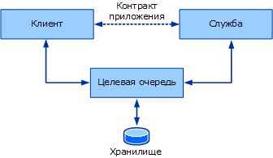
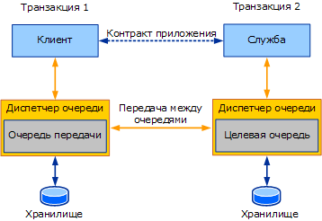

# Обзор очередейQueues overview

В этом разделе описаны общие и основные принципы, лежащие в основе взаимодействия с использованием очередей.This section introduces the general and core concepts behind queued communication. Последующие разделы вдаваться в подробности о том, как очереди концепции, описанные здесь проявляются в Windows Communication Foundation (WCF).Subsequent sections go into details about how the queuing concepts described here are manifested in Windows Communication Foundation (WCF).  
  
## Основные принципы очередейBasic Queuing Concepts  
 При разработке распределенного приложения важно выбрать правильный транспорт для связи между службами и клиентами.When designing a distributed application, choosing the right transport for communication between services and clients is important. Выбор транспорта определяется несколькими факторами.Several factors affect the kind of transport to use. Во-первых, выбор между транспортом очередей или прямым транспортом (как TCP или HTTP) определяется изоляцией между службой, клиентом и транспортом.One important factor—isolation between the service, the client, and the transport—determines use of a queued transport or a direct transport, such as TCP or HTTP. Особенностью прямых транспортов, таких как TCP или HTTP, является то, что связь останавливается при прекращении функционирования службы или клиента или сбое сети.Due to the nature of direct transports such as TCP and HTTP, communication stops altogether if the service or the client stop functioning or if the network fails. Приложение работает, только если служба, клиент и сеть выполняются одновременно.The service, the client, and the network must be running at the same time for the application to work. Транспорты очереди обеспечивают изоляцию, т. е. при сбое службы, клиента или каналов связи между ними клиент и служба могут продолжать функционировать.Queued transports provide isolation, which means that if the service or client fail or if communication links between them fail, the client and service can continue to function.  
  
 Очереди обеспечивают надежную связь даже в случае сбоя участников взаимодействия или неполадок в сети.Queues provide reliable communication even with failures in the communicating parties or the network. Очереди перенаправляют и доставляют сообщения, которыми обмениваются участники взаимодействия.Queues capture and deliver messages exchanged between the communicating parties. Как правило, очереди содержатся в хранилище, которое может быть неустойчивым и постоянным.Queues are typically backed by some kind of a store, which can be volatile or durable. Очереди хранят сообщения от клиента от имени службы, а затем переадресовывают эти сообщения службе.Queues store messages from a client on behalf of a service and later forward these messages to the service. Очереди с косвенным обращением обеспечивают гарантированную изоляцию от сбоев любого участника взаимодействия и поэтому являются предпочтительным механизмом связи в системах высокой доступности и отключенных службах.The indirection queues provide ensured isolation of failure by either party, thus making it the preferred communication mechanism for high-availability systems and disconnected services. Косвенное обращение обеспечивается ценой высокой задержки.The indirection comes with the cost of high latency. *Задержка* — это задержка времени между временем отправки сообщения клиентом и временем его получения службой.*Latency* is the time delay between the time the client sends a message and the time the service receives it. Это означает, что после отправки сообщения пользователь не знает, когда сообщение будет обработано.This means that once a message is sent, you do not know when that message may be processed. Большинство приложений с очередями справляются с высокой задержкой.Most queued applications cope with high latency. Следующая иллюстрация представляет концептуальную модель взаимодействия с использованием очередей.The following illustration shows a conceptual model of queued communication.  
  
   
  
 Концептуальная модель взаимодействия с использованием очередейQueued communication conceptual model  
  
 На практике очередь функционирует по принципу распределенности.In reality, the queue is a distributed concept. Очереди могут быть локальными для любого участника взаимодействия или удаленными для обоих участников.As such, they can be local to either party or remote to both parties. Как правило, очередь является локальной для службы.Typically, the queue is local to the service. В этом случае клиент не может рассчитывать на постоянную доступность подключения к удаленной очереди.In this configuration, the client cannot depend on connectivity to the remote queue to be constantly available. Аналогично, очередь должна быть доступной независимо от того, доступна ли служба, выполняющая чтение из очереди.Similarly, the queue must be available independent of the availability of the service reading from the queue. Диспетчер очередей управляет коллекцией очередей.A queue manager manages a collection of queues. Он несет ответственность за прием сообщений, отправленных в его очереди из других диспетчеров очередей.It is responsible for accepting messages sent to its queues from other queue managers. Также на диспетчера очередей возлагается ответственность за управление возможностью подключения к удаленным очередям и передачу сообщений этим удаленным очередям.It is also responsible for managing connectivity to remote queues and transferring messages to those remote queues. Чтобы обеспечить доступность очередей независимо от сбоев клиентского приложения или приложения служб, диспетчер очередей, как правило, выполняется как внешняя служба.To ensure availability of queues despite client or service application failures, the queue manager is typically run as an external service.  
  
 Когда клиент отправляет сообщение в очередь, он адресует сообщение целевой очереди, т. е. очереди, управляемой диспетчером очередей службы.When a client sends a message to a queue, it addresses the message to the target queue, which is the queue managed by the service's queue manager. Диспетчер очередей на стороне клиента отправляет сообщение в очередь передачи (очередь исходящих сообщений).The queue manager on the client sends the message to a transmission (or outgoing) queue. Очередь передачи - это очередь в диспетчере очередей клиента, которая хранит сообщения для передачи целевой очереди.The transmission queue is a queue on the client queue manager that stores messages for transmission to the target queue. Затем диспетчер очередей находит путь к диспетчеру очередей, владеющему целевой очередью, и передает ему сообщение.The queue manager then finds a path to the queue manager that owns the target queue and transfers the message to it. Для обеспечения надежной связи и во избежание потери данных диспетчеры очередей реализуют надежный протокол передачи.To ensure reliable communication, the queue managers implement a reliable transfer protocol to prevent data loss. Диспетчер очереди назначения принимает сообщения, адресованные принадлежащим ему целевым очередям, и хранит эти сообщения.The destination queue manager accepts messages addressed to the target queues it owns and stores the messages. Служба создает запросы на чтение из целевой очереди, после чего диспетчер очередей доставляет сообщение в приложение назначения.The service makes requests to read from the target queue, at which time the queue manager then delivers the message to the destination application. На следующем рисунке показана связь между четырьмя участниками.The following illustration shows communication between the four parties.  
  
   
  
 Взаимодействие с использованием очередей в типичном сценарии развертывания.Queued communication in a typical deployment scenario  
  
 Итак, диспетчер очередей обеспечивает необходимую изоляцию, чтобы сбои отправителя и получателя не влияли на фактическое взаимодействие.Thus, the queue manager provides the required isolation so that the sender and receiver can independently fail without affecting actual communication. Преимущество дополнительного косвенного обращения, обеспечиваемого очередями, также позволяет нескольким экземплярам приложения выполнять чтение из одной очереди, таким образом, при функционировании узлов по принципу фермы достигается большая пропускная способность.The benefit of extra indirection that queues provide also enables multiple application instances to read from the same queue, so that farming work among the nodes achieves higher throughput. Следовательно, очереди часто используются для повышения масштабируемости и пропускной способности.Therefore, it is not uncommon to see queues being used to achieve higher scale and throughput requirements.  
  
## Очереди и транзакцииQueues and Transactions  
 Транзакции позволяют группировать наборы операций, чтобы в случае сбоя одной операции происходил сбой всех операций.Transactions allow you to group a set of operations together so that if one operation fails, all of the operations fail. Примером того, как использовать транзакции, является то, когда человек использует банкомат для перевода $1000 со своего сберегательного счета на свой расчетный счет.An example of how to use transactions is when a person uses an ATM to transfer $1,000 from their savings account to their checking account. Для перемещения средств необходимо выполнить следующие операции.This entails the following operations:  
  
- Снятие 1 000 долларов со сберегательного счета.Withdrawing $1,000 from the savings account.  
  
- Внесение 1 000 долларов на текущий счет.Depositing $1,000 into the checking account.  
  
 Если первая операция завершается успешно (т. е. удается снять 1 000 долларов со сберегательного счета), а вторая - нет, 1 000 долларов теряется, так как сумма уже была снята со сберегательного счета.If the first operation succeeds and $1,000 is withdrawn from the savings account but the second operation fails, the $1,000 is lost because it has already been withdrawn from the savings account. Для поддержания действительного состояния счетов необходимо обеспечить сбой обеих операций при сбое одной из них.To keep the accounts in a valid state, if one operation fails, both operations must fail.  
  
 В транзакционном обмене сообщениями сообщения можно отправлять в очередь и получать сообщения из нее в рамках транзакции.In transactional messaging, messages can be sent to the queue and received from the queue under a transaction. Таким образом, если сообщение отправлено в рамках транзакции и происходит откат транзакции, результат такой же, как если бы сообщение никогда не было отправлено в очередь.Thus, if a message is sent in a transaction and the transaction is rolled back, then the outcome is as if the message had never been sent to the queue. Аналогично, если сообщение получено в рамках транзакции и происходит откат транзакции, результат такой же, как если бы сообщение никогда не было получено.Similarly if a message is received in a transaction and the transaction is rolled back, then the outcome is as if the message had never been received. Сообщение остается в очереди и доступно для чтения.The message remains in the queue to be read.  
  
 Из-за высокой задержки при отправке сообщения невозможно узнать, через какое время оно достигнет целевой очереди и сколько времени потребуется службе для обработки сообщения.Because of high latency, when you send a message you have no way of knowing how long it takes to reach its target queue, nor do you know how long it takes for the service to process the message. Поэтому нецелесообразно использовать одну транзакцию для отправки, получения и последующей обработки сообщения.Because of this, you do not want to use a single transaction to send the message, receive the message, and then process the message. В этом случае создается транзакция, которая остается незафиксированной в течение неопределенного промежутка времени.This creates a transaction that is not committed for an indeterminate amount of time. При взаимодействии клиента и службы через очередь с использованием транзакции в процессе участвуют две транзакции: одна - на стороне клиента, другая - на стороне службы.When a client and service communicate through a queue using a transaction, two transactions are involved: one on the client and one on the service. На следующем рисунке показаны границы транзакции при стандартном взаимодействии с использованием очередей.The following illustration shows the transaction boundaries in typical queued communication.  
  
   
  
 Взаимодействие с использованием очередей и отдельными транзакциями для сбора и доставкиQueued communication showing separate transactions for capture and delivery  
  
 Клиентская транзакция обрабатывает и отправляет сообщение.The client transaction processes and sends the message. После фиксирования транзакции сообщение попадает в очередь передачи.When the transaction is committed, the message is in the transmission queue. На стороне службы транзакция выполняет чтение сообщения из целевой очереди, обрабатывает сообщение и фиксирует транзакцию.On the service, the transaction reads the message from the target queue, processes the message, and then commits the transaction. В случае ошибки во время обработки происходит откат сообщения и его размещение в целевой очереди.If an error occurs during the processing, the message is rolled back and placed in the target queue.  
  
## Асинхронное взаимодействие с использованием очередейAsynchronous Communication Using Queues  
 Очереди предоставляют асинхронные средства взаимодействия.Queues provide an asynchronous means of communication. Приложения, отправляющие сообщения с использованием очередей, не могут ожидать получения и обработки сообщения принимающим приложением из-за высокой задержки, введенной диспетчером очередей.Applications that send messages using queues cannot wait for the message to be received and processed by the receiver because of high latency introduced by the queue manager. Сообщения могут оставаться в очереди гораздо дольше, чем предполагалось приложением.Messages can remain in the queue for a far longer time than the application intended. Чтобы избежать этого, приложение может задать сообщению значение срока жизни.To avoid this, the application can specify a Time-To-Live value on the message. Это значение задает, как долго сообщение должно оставаться в очереди передачи.This value specifies how long the message should remain in the transmission queue. Если данное временное значение превышено, а сообщение не отправлено в целевую очередь, оно может быть передано в очередь недоставленных сообщений.If this time value is exceeded, and the message still has not been sent to the target queue, the message can be transferred to a dead-letter queue.  
  
 При отправке сообщения отправителем, возврат из операции отправки подразумевает, что сообщение только что было доставлено в очередь передачи на стороне отправителя.When the sender sends a message, the return from the send operation implies that the message only made it to the transmission queue on the sender. Следовательно, в случае сбоя доставки сообщения в целевую очередь отправляющее приложение не может немедленно узнать об этом.As such, if there is a failure in getting the message to the target queue, the sending application cannot know about it immediately. Фиксирование таких сбоев возможно благодаря передаче недоставленного сообщения в очередь недоставленных сообщений.To take note of such failures, the failed message is transferred to a dead-letter queue.  
  
 Любую ошибку (например, недостижение сообщением целевой очереди или истечение срока жизни сообщения) необходимо обрабатывать отдельно.Any error, such as a message failing to reach the target queue or the Time-To-Live expiring, must be processed separately. Следовательно, приложения с использованием очередей часто создают два набора логики.It is not uncommon, therefore, for queued applications to write two sets of logic:  
  
- Стандартная логика отправки и получения сообщений клиентом и службой.The normal client and service logic of sending and receiving messages.  
  
- Компенсирующая логика для обработки сообщений, при передаче или доставке которых произошел сбой.Compensation logic to handle messages from the failed transmission or delivery.  
  
 Эти принципы рассматриваются в следующих подразделах.The following sections discuss these concepts.  
  
## Программирование очереди недоставленных сообщенийDead-Letter Queue Programming  
 В очередях недоставленных сообщений содержатся сообщения, которые по различным причинам не попали в целевую очередь.Dead-letter queues contain messages that failed to reach the target queue for various reasons. Причины могут быть самыми разнообразными - от истечения срока жизни сообщения до возникновения проблем с подключением, из-за которых не удалось передать сообщение в целевую очередь.The reasons can range from expired messages to connectivity issues preventing transfer of the message to the target queue.  
  
 Как правило, приложение может выполнить чтение сообщений из общесистемной очереди недоставленных сообщений, определить, на каком именно этапе произошла ошибка, и предпринять необходимые меры, например исправить ошибки и отправить сообщение повторно, либо отметить произошедший сбой.Typically, an application can read messages from a system-wide dead-letter queue, determine what went wrong, and take appropriate action, such as correcting the errors and resending the message or taking note of it.  
  
## Программирование очереди подозрительных сообщенийPoison Message Queue Programming  
 После попадания сообщения в целевую очередь может несколько раз произойти сбой в обработке сообщения службой.After a message makes it to the target queue, the service may repeatedly fail to process the message. Например, приложение, которое выполняет чтение сообщения из очереди в рамках транзакции и обновляет базу данных, может обнаружить, что база данных временно отключена.For example, an application reading a message from the queue under a transaction and updating a database may find the database temporarily disconnected. В этом случае происходит откат транзакции, создание новой транзакции и повторное прочтение сообщения из очереди.In this case, the transaction is rolled back, a new transaction is created, and the message is reread from the queue. Вторая попытка может завершиться успешно или с ошибкой.A second attempt may succeed or fail. В некоторых случаях в зависимости от причины ошибки может несколько раз произойти сбой при попытке доставки сообщения в приложение.In some cases, depending on the cause of the error, the message may repeatedly fail delivery to the application. В этом случае сообщение считается «подозрительным».In this case, the message is deemed as "poison." Такие сообщения перемещаются в очередь подозрительных сообщений, которая может быть прочитана приложением для обработки подозрительных сообщений.Such messages are moved to a poison queue that can be read by a poison-handling application.  
  
## См. также разделSee also

- [Очереди в WCFQueuing in WCF](../../../../docs/framework/wcf/feature-details/queuing-in-wcf.md)
- [Сеансы и очередиSessions and Queues](../../../../docs/framework/wcf/samples/sessions-and-queues.md)
- [Очереди недоставленных сообщенийDead Letter Queues](../../../../docs/framework/wcf/samples/dead-letter-queues.md)
- [Неустойчивое взаимодействие с использованием очередиVolatile Queued Communication](../../../../docs/framework/wcf/samples/volatile-queued-communication.md)
- [Отправка сообщений из приложения Windows Communication Foundation в приложение MSMQWindows Communication Foundation to Message Queuing](../../../../docs/framework/wcf/samples/wcf-to-message-queuing.md)
- [Установка системы очередей сообщений (MSMQ)Installing Message Queuing (MSMQ)](../../../../docs/framework/wcf/samples/installing-message-queuing-msmq.md)
- [Передача сообщений из приложения MSMQ в приложение Windows Communication FoundationMessage Queuing to Windows Communication Foundation](../../../../docs/framework/wcf/samples/message-queuing-to-wcf.md)
- [Безопасность сообщений при использовании очереди сообщенийMessage Security over Message Queuing](../../../../docs/framework/wcf/samples/message-security-over-message-queuing.md)
