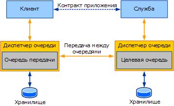

# Конечные точки служб и адресация очереди
В этом разделе рассматриваются принципы обращения клиентов к службам, выполняющим чтение из очередей, и сопоставления конечных точек служб с очередями. Как напоминание, на следующем рисунке показано классическое развертывание приложения, помещенного в очередь Windows Communication Foundation (WCF).  
  
   
  
 Чтобы отправить службе сообщение, клиент адресует это сообщение целевой очереди. Чтобы прочитать сообщение из очереди, служба задает целевую очередь в качестве своего адреса прослушивания. Адресация в WCF основана на универсальном коде ресурсов (URI), тогда как имена очередей сообщений (MSMQ) не основаны на универсальном коде ресурса (URI). Поэтому важно понимать, как обращаться к очередям, созданным в MSMQ, с помощью WCF.  
  
## Адресация к очереди сообщений MSMQ  
 В MSMQ очереди обозначаются с помощью путей и имен форматов. Путь указывает имя узла и `QueueName`. Также можно добавить `Private$` между именем узла и `QueueName`, чтобы указать частную очередь, не опубликованную в службе каталогов Active Directory.  
  
 Пути сопоставляются с "Форматнамес" для определения дополнительных аспектов адреса, включая протокол маршрутизации и передачи диспетчера очереди. Диспетчер очередей поддерживает два протокола передачи данных: собственный протокол MSMQ и протокол SRMP.  
  
 Дополнительные сведения о пути MSMQ и именах форматов см. в статье [об очередях сообщений](https://docs.microsoft.com/previous-versions/windows/desktop/legacy/ms706032(v=vs.85)).  
  
## NetMsmqBinding и адресация к службе  
 При адресации сообщения службе выбирается схема из URI (в зависимости от транспорта, используемого для передачи данных). Каждый транспорт в WCF имеет уникальную схему. Схема должна отражать тип транспорта, используемого для передачи данных. Например: net.tcp, net.pipe, HTTP и т. п.  
  
 Транспорт MSMQ в WCF предоставляет схему net. MSMQ. Любое сообщение, адресованное с помощью схемы net.msmq, отправляется с помощью `NetMsmqBinding` через транспортный канал очередей MSMQ.  
  
 Адресация очереди в WCF основана на следующем шаблоне:  
  
 NET. msmq://\<*имя узла*>/[частный/] \<*queue-Name*>  
  
 Здесь:  
  
- \<*host-name*> — это имя компьютера, на котором размещена целевая очередь.  
  
- [private] - необязательный элемент. Используется при адресации к целевой очереди, которая является частной. При адресации к общей очереди не допускается указывать «private». Обратите внимание, что, в отличие от путей MSMQ, в форме URI WCF отсутствует "$".  
  
- \<*Queue-name*> — это имя очереди. Имя очереди также может относиться к вложенной очереди. Таким словами, \<*Queue-name*> = \<*имя-очереди*> [; *вложенное имя очереди*].  
  
 Пример 1. Для адресации к частной очереди PurchaseOrders, размещенной на компьютере abc.adatum.com, универсальный код ресурса (URI) будет таким: net.msmq://abc.adatum.com/private/PurchaseOrders.  
  
 Пример 2. Для адресации к общей очереди AccountsPayable, размещенной на компьютере def.adatum.com, универсальный код ресурса (URI) будет таким: net.msmq://def.adatum.com/AccountsPayable.  
  
 Адрес очереди используется прослушивателем как код URI прослушивания, из которого выполняется чтение сообщений. Другими словами, адрес очереди подобен порту прослушивания сокета TCP.  
  
 Конечная точка, выполняющая чтение из очереди, должна указывать адрес очереди с помощью указанной выше схемы при открывании узла службы (ServiceHost). Примеры см. в разделе [Привязка к сети MSMQ](../../../../docs/framework/wcf/samples/net-msmq-binding.md).  
  
### Несколько контрактов в очереди  
 Сообщения в очереди могут реализовывать различные контракты. В данном случае для успешного чтения и обработки сообщений особенно важно, чтобы выполнялось одно из следующих требований:  
  
- Укажите конечную точку для службы, реализующей все контракты. Этот способ является рекомендуемым.  
  
- Укажите несколько конечных точек с различными контрактами, но убедитесь, что во всех конечных точках используется один и тот же объект `NetMsmqBinding`. Логика отправки сообщений в модели ServiceModel использует тот же цикл обработки сообщений, считывающий сообщения из транспортного канала для отправки, что в конечном итоге приводит к демультиплексированию сообщений на различные конечные точки на основе контракта. Для пары «URI прослушивания/привязка» создается цикл обработки сообщений. Адрес очереди используется прослушивателем в очереди как URI прослушивания. Использование одного объекта привязки всеми конечными точками обеспечивает использование одного цикла обработки сообщений для чтения сообщения и его демультиплексирования на соответствующие конечные точки на основе контракта.  
  
### Обмен сообщениями SRMP  
 Как указано выше, можно использовать протокол SRMP для передачи между очередями. Этот прием обычно используется, когда транспорт HTTP передает сообщения между очередью передачи и целевой очередью.  
  
 Чтобы воспользоваться протоколом SRMP, адресуйте сообщения с помощью схемы URI net.msmq, как указано выше, и укажите один из двух протоколов (SRMP или защищенный SRMP) в свойстве `QueueTransferProtocol` элемента `NetMsmqBinding`.  
  
 Указать свойство `QueueTransferProtocol` можно только при отправке. Оно указывает, какой именно протокол передачи между очередями используется клиентом.  
  
### Использование Active Directory  
 В очереди сообщений MSMQ предусмотрена поддержка интеграции с Active Directory. Чтобы установить MSMQ с интеграцией с Active Directory, компьютер должен быть частью домена Windows. Active Directory используется для публикации очередей для обнаружения; Такие очереди называются *публичными очередями*. При адресации к очереди можно разрешить ее (т. е. узнать ее идентификатор) с помощью Active Directory. Это похоже на разрешение IP-адреса сетевого имени с помощью службы доменных имен (DNS). Свойство `UseActiveDirectory` элемента `NetMsmqBinding` принадлежит к типу Boolean и указывает, должен ли канал в очереди использовать Active Directory для разрешения URI очереди. По умолчанию для этого свойства установлено значение `false`. Если свойству `UseActiveDirectory` задано значение `true`, то канал в очереди преобразует URI вида net.msmq:// в имя формата с помощью Active Directory.  
  
 Свойство `UseActiveDirectory` имеет значение только для клиента, отправляющего сообщение, поскольку оно используется для разрешения адреса очереди при отправке сообщений.  
  
### Сопоставление URI net.msmq именам форматов MSMQ  
 Канал в очереди обрабатывает сопоставление предоставленного ему имени URI net.msmq именам форматов MSMQ. В следующей таблице приведены общие правила их сопоставления.  
  
|Адрес очереди WCF, основанный на URI|Используется свойство Active Directory|Свойство протокола передачи между очередями|Результирующие имена форматов MSMQ|  
|----------------------------------|-----------------------------------|--------------------------------------|---------------------------------|  
|NET. msmq://\<Machine-Name >/привате/АБК|False (по умолчанию)|Native (по умолчанию)|DIRECT=OS:имя_компьютера\private$\abc|  
|NET. msmq://\<Machine-Name >/привате/АБК|Ложь|SRMP|DIRECT =http://machine/msmq/private $/АБК|  
|NET. msmq://\<Machine-Name >/привате/АБК|Да|машинный код;|PUBLIC=guid (идентификатор GUID очереди)|  
  
### Чтение сообщений из очереди недоставленных сообщений или из очереди подозрительных сообщений  
 Для чтения сообщений из очереди подозрительных сообщений, являющейся вложенной очередью целевой очереди, откройте `ServiceHost`, указав адрес вложенной очереди.  
  
 Пример. Служба, считывающая из очереди подозрительных сообщений частной очереди PurchaseOrders с локального компьютера обращается по адресу net.msmq://localhost/private/PurchaseOrders;poison.  
  
 Для чтения сообщений из системной очереди недоставленных транзакционных сообщений код URI должен иметь следующий вид: net.msmq://localhost/system$;DeadXact.  
  
 Для чтения сообщений из системной очереди недоставленных нетранзакционных сообщений код URI должен иметь следующий вид: net.msmq://localhost/system$;DeadLetter.  
  
 При использовании пользовательской очереди недоставленных сообщений обратите внимание, что эта очередь должна находиться на локальном компьютере. Таким образом, код URI очереди недоставленных сообщений быть только таким:  
  
 NET. msmq://ЛОКАЛХОСТ/[Private/] \<*пользовательской недоставленной > Queue-Name*.  
  
 Служба WCF проверяет, что все получаемые сообщения были адресованы в конкретную очередь, в которой она прослушивается. Если очередь назначения сообщения не соответствует очереди, в которой оно содержится, служба не обрабатывает сообщение. Если служба прослушивает очередь недоставленных сообщений, эту проблему необходимо решить обязательно, поскольку сообщения в такой очереди всегда адресованы в другое расположение. Для чтения сообщений из очереди недоставленных или подозрительных сообщений необходимо использовать `ServiceBehavior` и параметр <xref:System.ServiceModel.AddressFilterMode.Any>. Пример см. в разделе [очереди недоставленных сообщений](../../../../docs/framework/wcf/samples/dead-letter-queues.md).  
  
## MsmqIntegrationBinding и адресация к службе  
 `MsmqIntegrationBinding` используется для обмена информацией с традиционными приложениями MSMQ. Чтобы упростить взаимодействие с существующим приложением MSMQ, WCF поддерживает только адресацию имени формата. Таким образом, сообщения, отправленные с помощью этой привязки, должны соответствовать следующей схеме URI:  
  
 msmq.formatname:\<*MSMQ-format-name*>>  
  
 Имя MSMQ-format-name указывается в формате MSMQ в статье [об очереди сообщений](https://docs.microsoft.com/previous-versions/windows/desktop/legacy/ms706032(v=vs.85)).  
  
 Обратите внимание, что можно использовать только прямые имена форматов, а также открытые и закрытые имена форматов (требуется интеграция Active Directory) при получении сообщений из очереди с помощью `MsmqIntegrationBinding`. Впрочем, рекомендуется использовать прямые имена форматов. Например, в Windows Vista использование любого другого имени формата вызывает ошибку, так как система пытается открыть подочередь, которую можно открыть только с помощью прямого имени формата.  
  
 При адресации к SRMP с помощью `MsmqIntegrationBinding` не требуется добавлять /msmq/ к прямому имени формата для отправки с помощью служб IIS. Например: при обращении к очереди ABC с помощью протокола SRMP вместо DIRECT =http://adatum.com/msmq/private $/АБК следует использовать DIRECT =http://adatum.com/private $/АБК.  
  
 Обратите внимание, что нельзя использовать адресацию net.msmq:// вместе с `MsmqIntegrationBinding`. Так как `MsmqIntegrationBinding` поддерживает адресацию имен в формате MSMQ в свободной форме, можно использовать службу WCF, которая использует эту привязку для использования функций многоадресной рассылки и списков рассылки в MSMQ. Единственное исключение: необходимо указать `CustomDeadLetterQueue` при использовании `MsmqIntegrationBinding`. Требуемая форма: net.msmq://, как и при указании с помощью `NetMsmqBinding`.  
  
## См. также:

- [Размещение веб-узлов в приложении, использующем очереди](../../../../docs/framework/wcf/feature-details/web-hosting-a-queued-application.md)
