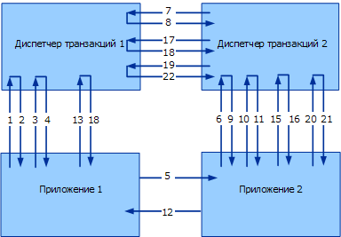

# <a name="transaction-protocols-version-10"></a><span data-ttu-id="0448f-102">Протоколы транзакций версии 1.0</span><span class="sxs-lookup"><span data-stu-id="0448f-102">Transaction Protocols version 1.0</span></span>
[!INCLUDE[indigo1](../../../../includes/indigo1-md.md)]<span data-ttu-id="0448f-103"> версии 1 реализует версию 1.0 протоколов WS-Atomic Transaction и WS-Coordination.</span><span class="sxs-lookup"><span data-stu-id="0448f-103"> version 1 implements version 1.0 of the WS-Atomic Transaction and WS-Coordination protocols.</span></span> [!INCLUDE[crabout](../../../../includes/crabout-md.md)]<span data-ttu-id="0448f-104">версии 1.1, в разделе [протоколов транзакций](../../../../docs/framework/wcf/feature-details/transaction-protocols.md).</span><span class="sxs-lookup"><span data-stu-id="0448f-104"> version 1.1, see [Transaction Protocols](../../../../docs/framework/wcf/feature-details/transaction-protocols.md).</span></span>  
  
|<span data-ttu-id="0448f-105">Спецификация/документ</span><span class="sxs-lookup"><span data-stu-id="0448f-105">Specification/Document</span></span>|<span data-ttu-id="0448f-106">Ссылка</span><span class="sxs-lookup"><span data-stu-id="0448f-106">Link</span></span>|  
|-----------------------------|----------|  
|<span data-ttu-id="0448f-107">WS-Coordination</span><span class="sxs-lookup"><span data-stu-id="0448f-107">WS-Coordination</span></span>|<span data-ttu-id="0448f-108">http://msdn.microsoft.com/ws/2005/08/ws-coordination/</span><span class="sxs-lookup"><span data-stu-id="0448f-108">http://msdn.microsoft.com/ws/2005/08/ws-coordination/</span></span>|  
|<span data-ttu-id="0448f-109">WS-AtomicTransaction</span><span class="sxs-lookup"><span data-stu-id="0448f-109">WS-AtomicTransaction</span></span>|<span data-ttu-id="0448f-110">http://msdn.microsoft.com/ws/2005/08/ws-atomictransaction/</span><span class="sxs-lookup"><span data-stu-id="0448f-110">http://msdn.microsoft.com/ws/2005/08/ws-atomictransaction/</span></span>|  
  
 <span data-ttu-id="0448f-111">Согласно этим спецификациям протоколов, требуется взаимодействие на двух уровнях: между приложениями и между диспетчерами транзакций (см. следующий рисунок).</span><span class="sxs-lookup"><span data-stu-id="0448f-111">Interoperability on these protocol specifications is required at two levels: between applications and between transaction managers (see the following figure).</span></span> <span data-ttu-id="0448f-112">В спецификациях подробно описываются форматы сообщений и обмен сообщениями для обоих уровней взаимодействия.</span><span class="sxs-lookup"><span data-stu-id="0448f-112">Specifications describe in great detail the message formats and message exchange for both interoperability levels.</span></span> <span data-ttu-id="0448f-113">При обмене между приложениями применяются определенные средства обеспечения безопасности, надежности и методы кодирования, как и при обычном обмене в пределах сообщения.</span><span class="sxs-lookup"><span data-stu-id="0448f-113">Certain security, reliability, and encodings for application-to-application exchange apply as they do for regular application exchange.</span></span> <span data-ttu-id="0448f-114">Однако для успешного взаимодействия между диспетчерами транзакций требуется соглашение по конкретной привязке, поскольку она обычно не настраивается пользователем.</span><span class="sxs-lookup"><span data-stu-id="0448f-114">However, successful interoperability between transaction managers requires agreement on the particular binding, because it is usually not configured by the user.</span></span>  
  
 <span data-ttu-id="0448f-115">В этом разделе описываются состав спецификации протокола WS-Atomic Transaction (WS-AT) со средствами безопасности, а также безопасная привязка, используемая для обмена данными между диспетчерами транзакций.</span><span class="sxs-lookup"><span data-stu-id="0448f-115">This topic describes a composition of the WS-Atomic Transaction (WS-AT) specification with security and describes the secure binding used for communication between transaction managers.</span></span> <span data-ttu-id="0448f-116">Подход, описанный в этом документе, успешно протестирован с другими реализациями протоколов WS-AT и WS-Coordination, включая IBM, IONA, Sun Microsystems и пр.</span><span class="sxs-lookup"><span data-stu-id="0448f-116">The approach described in this document has been successfully tested with other implementations of WS-AT and WS-Coordination including IBM, IONA, Sun Microsystems, and others.</span></span>  
  
 <span data-ttu-id="0448f-117">На следующем рисунке показано взаимодействие между двумя диспетчерами транзакций (диспетчером транзакций 1 и диспетчером транзакций 2) и двумя приложениями (приложением 1 и приложением 2).</span><span class="sxs-lookup"><span data-stu-id="0448f-117">The following figure depicts the interoperability between two transaction managers, Transaction Manager 1 and Transaction Manager 2, and two applications, Application 1 and Application 2.</span></span>  
  
 <span data-ttu-id="0448f-118"></span><span class="sxs-lookup"><span data-stu-id="0448f-118"></span></span>  
  
 <span data-ttu-id="0448f-119">Рассмотрим типовой сценарий WS-Coordination/WS-Atomic Transaction с одним инициатором (I) и одним участником (P).</span><span class="sxs-lookup"><span data-stu-id="0448f-119">Consider a typical WS-Coordination/WS-Atomic Transaction scenario with one Initiator (I) and one Participant (P).</span></span> <span data-ttu-id="0448f-120">И инициатор, и участник имеют диспетчеры транзакций (ITM и PTM, соответственно).</span><span class="sxs-lookup"><span data-stu-id="0448f-120">Both Initiator and Participant have Transaction Managers, (ITM and PTM, respectively).</span></span> <span data-ttu-id="0448f-121">Двухфазная фиксация обозначается в этом разделе как 2PC.</span><span class="sxs-lookup"><span data-stu-id="0448f-121">Two-phase commit is referred to as 2PC in this topic.</span></span>  
  
|||  
|-|-|  
|<span data-ttu-id="0448f-122">1. CreateCoordinationContext</span><span class="sxs-lookup"><span data-stu-id="0448f-122">1. CreateCoordinationContext</span></span>|<span data-ttu-id="0448f-123">12. Ответ на сообщение приложения</span><span class="sxs-lookup"><span data-stu-id="0448f-123">12. Application Message Response</span></span>|  
|<span data-ttu-id="0448f-124">2. CreateCoordinationContextResponse</span><span class="sxs-lookup"><span data-stu-id="0448f-124">2. CreateCoordinationContextResponse</span></span>|<span data-ttu-id="0448f-125">13. Commit (завершение)</span><span class="sxs-lookup"><span data-stu-id="0448f-125">13. Commit (Completion)</span></span>|  
|<span data-ttu-id="0448f-126">3. Register (завершение)</span><span class="sxs-lookup"><span data-stu-id="0448f-126">3. Register (Completion)</span></span>|<span data-ttu-id="0448f-127">14. Prepare (2PC)</span><span class="sxs-lookup"><span data-stu-id="0448f-127">14. Prepare (2PC)</span></span>|  
|<span data-ttu-id="0448f-128">4. RegisterResponse</span><span class="sxs-lookup"><span data-stu-id="0448f-128">4. RegisterResponse</span></span>|<span data-ttu-id="0448f-129">15. Prepare (2PC)</span><span class="sxs-lookup"><span data-stu-id="0448f-129">15. Prepare (2PC)</span></span>|  
|<span data-ttu-id="0448f-130">5. Сообщение приложения</span><span class="sxs-lookup"><span data-stu-id="0448f-130">5. Application Message</span></span>|<span data-ttu-id="0448f-131">16. Prepared (2PC)</span><span class="sxs-lookup"><span data-stu-id="0448f-131">16. Prepared (2PC)</span></span>|  
|<span data-ttu-id="0448f-132">6. CreateCoordinationContext с контекстом</span><span class="sxs-lookup"><span data-stu-id="0448f-132">6. CreateCoordinationContext with Context</span></span>|<span data-ttu-id="0448f-133">17. Prepared (2PC)</span><span class="sxs-lookup"><span data-stu-id="0448f-133">17. Prepared (2PC)</span></span>|  
|<span data-ttu-id="0448f-134">7. Register (устойчивое)</span><span class="sxs-lookup"><span data-stu-id="0448f-134">7. Register (Durable)</span></span>|<span data-ttu-id="0448f-135">18. Committed (завершение)</span><span class="sxs-lookup"><span data-stu-id="0448f-135">18. Committed (Completion)</span></span>|  
|<span data-ttu-id="0448f-136">8. RegisterResponse</span><span class="sxs-lookup"><span data-stu-id="0448f-136">8. RegisterResponse</span></span>|<span data-ttu-id="0448f-137">19. Commit (2PC)</span><span class="sxs-lookup"><span data-stu-id="0448f-137">19. Commit (2PC)</span></span>|  
|<span data-ttu-id="0448f-138">9. CreateCoordinationContextResponse</span><span class="sxs-lookup"><span data-stu-id="0448f-138">9. CreateCoordinationContextResponse</span></span>|<span data-ttu-id="0448f-139">20. Commit (2PC)</span><span class="sxs-lookup"><span data-stu-id="0448f-139">20. Commit (2PC)</span></span>|  
|<span data-ttu-id="0448f-140">10. Register (устойчивое)</span><span class="sxs-lookup"><span data-stu-id="0448f-140">10. Register (Durable)</span></span>|<span data-ttu-id="0448f-141">21. Committed (2PC)</span><span class="sxs-lookup"><span data-stu-id="0448f-141">21. Committed (2PC)</span></span>|  
|<span data-ttu-id="0448f-142">11. RegisterResponse</span><span class="sxs-lookup"><span data-stu-id="0448f-142">11. RegisterResponse</span></span>|<span data-ttu-id="0448f-143">22. Committed (2PC)</span><span class="sxs-lookup"><span data-stu-id="0448f-143">22. Committed (2PC)</span></span>|  
  
 <span data-ttu-id="0448f-144">В этом документе описываются состав спецификации протокола WS-AtomicTransaction со средствами безопасности, а также безопасная привязка, используемая для взаимодействия между диспетчерами транзакций.</span><span class="sxs-lookup"><span data-stu-id="0448f-144">This document describes a composition of the WS-AtomicTransaction specification with security and describes the secure binding used for communication between transaction managers.</span></span> <span data-ttu-id="0448f-145">Подход, описанный в этом документе, успешно протестирован с другими реализациями протоколов WS-AT и WS-Coordination.</span><span class="sxs-lookup"><span data-stu-id="0448f-145">The approach described in this document has been successfully tested with other implementations of WS-AT and WS-Coordination.</span></span>  
  
 <span data-ttu-id="0448f-146">На рисунке и в таблице представлены четыре класса сообщений с точки зрения безопасности:</span><span class="sxs-lookup"><span data-stu-id="0448f-146">The figure and table illustrate four classes of messages from the viewpoint of security:</span></span>  
  
-   <span data-ttu-id="0448f-147">сообщения активации (CreateCoordinationContext и CreateCoordinationContextResponse);</span><span class="sxs-lookup"><span data-stu-id="0448f-147">Activation messages (CreateCoordinationContext and CreateCoordinationContextResponse).</span></span>  
  
-   <span data-ttu-id="0448f-148">сообщения регистрации (Register и RegisterResponse);</span><span class="sxs-lookup"><span data-stu-id="0448f-148">Registration messages (Register and RegisterResponse)</span></span>  
  
-   <span data-ttu-id="0448f-149">протокольные сообщения (Prepare, Rollback, Commit, Aborted и т. д.);</span><span class="sxs-lookup"><span data-stu-id="0448f-149">Protocol messages (Prepare, Rollback, Commit, Aborted, and so on).</span></span>  
  
-   <span data-ttu-id="0448f-150">сообщения приложений.</span><span class="sxs-lookup"><span data-stu-id="0448f-150">Application messages.</span></span>  
  
 <span data-ttu-id="0448f-151">Первые три класса сообщений считаются сообщениями диспетчера транзакций и их конфигурация привязки описывается в разделе "Обмен сообщениями приложений" ниже в данном разделе.</span><span class="sxs-lookup"><span data-stu-id="0448f-151">The first three message classes are considered Transaction Manager messages and their binding configuration is described in the "Application Message Exchange" later in this topic.</span></span> <span data-ttu-id="0448f-152">Четвертый класс сообщений - это сообщения, передаваемые между приложениями, которые описываются в разделе "Примеры сообщений" ниже в данном разделе.</span><span class="sxs-lookup"><span data-stu-id="0448f-152">The fourth class of message is application to application messages and is described in the "Message Examples" section later in this topic.</span></span> <span data-ttu-id="0448f-153">В этом разделе описываются привязки протокола, используемые системой [!INCLUDE[indigo2](../../../../includes/indigo2-md.md)] для каждого из этих классов.</span><span class="sxs-lookup"><span data-stu-id="0448f-153">This section describes the protocol bindings used for each of these classes by [!INCLUDE[indigo2](../../../../includes/indigo2-md.md)].</span></span>  
  
 <span data-ttu-id="0448f-154">Во всем данном документе используются следующие пространства имен XML и связанные с ними префиксы.</span><span class="sxs-lookup"><span data-stu-id="0448f-154">The following XML Namespaces and associated prefixes are used throughout this document.</span></span>  
  
|<span data-ttu-id="0448f-155">Префикс</span><span class="sxs-lookup"><span data-stu-id="0448f-155">Prefix</span></span>|<span data-ttu-id="0448f-156">Универсальный код ресурса (URI) пространства имен</span><span class="sxs-lookup"><span data-stu-id="0448f-156">Namespace URI</span></span>|  
|------------|-------------------|  
|<span data-ttu-id="0448f-157">s11</span><span class="sxs-lookup"><span data-stu-id="0448f-157">s11</span></span>|<span data-ttu-id="0448f-158">http://schemas.xmlsoap.org/soap/envelope</span><span class="sxs-lookup"><span data-stu-id="0448f-158">http://schemas.xmlsoap.org/soap/envelope</span></span>|  
|<span data-ttu-id="0448f-159">wsa</span><span class="sxs-lookup"><span data-stu-id="0448f-159">wsa</span></span>|<span data-ttu-id="0448f-160">http://www.w3.org/2004/08/Addressing</span><span class="sxs-lookup"><span data-stu-id="0448f-160">http://www.w3.org/2004/08/addressing</span></span>|  
|<span data-ttu-id="0448f-161">wscoor</span><span class="sxs-lookup"><span data-stu-id="0448f-161">wscoor</span></span>|<span data-ttu-id="0448f-162">http://schemas.xmlsoap.org/ws/2004/10/wscoor</span><span class="sxs-lookup"><span data-stu-id="0448f-162">http://schemas.xmlsoap.org/ws/2004/10/wscoor</span></span>|  
|<span data-ttu-id="0448f-163">wsat</span><span class="sxs-lookup"><span data-stu-id="0448f-163">wsat</span></span>|<span data-ttu-id="0448f-164">http://schemas.xmlsoap.org/ws/2004/10/wsat</span><span class="sxs-lookup"><span data-stu-id="0448f-164">http://schemas.xmlsoap.org/ws/2004/10/wsat</span></span>|  
|<span data-ttu-id="0448f-165">t</span><span class="sxs-lookup"><span data-stu-id="0448f-165">t</span></span>|<span data-ttu-id="0448f-166">http://schemas.xmlsoap.org/ws/2005/02/trust</span><span class="sxs-lookup"><span data-stu-id="0448f-166">http://schemas.xmlsoap.org/ws/2005/02/trust</span></span>|  
|<span data-ttu-id="0448f-167">o</span><span class="sxs-lookup"><span data-stu-id="0448f-167">o</span></span>|<span data-ttu-id="0448f-168">http://docs.oasis-open.org/wss/2004/01/oasis-200401-wss-wssecurity-secext-1.0.xsd</span><span class="sxs-lookup"><span data-stu-id="0448f-168">http://docs.oasis-open.org/wss/2004/01/oasis-200401-wss-wssecurity-secext-1.0.xsd</span></span>|  
|<span data-ttu-id="0448f-169">xsd</span><span class="sxs-lookup"><span data-stu-id="0448f-169">xsd</span></span>|<span data-ttu-id="0448f-170">http://www.w3.org/2001/XMLSchema</span><span class="sxs-lookup"><span data-stu-id="0448f-170">http://www.w3.org/2001/XMLSchema</span></span>|  
  
## <a name="transaction-manager-bindings"></a><span data-ttu-id="0448f-171">Привязки диспетчеров транзакций</span><span class="sxs-lookup"><span data-stu-id="0448f-171">Transaction Manager Bindings</span></span>  
 <span data-ttu-id="0448f-172">R1001: для обмена сообщениями протоколов WS-Atomic Transaction и WS-Coordination диспетчеры транзакций должны использовать SOAP 1.1 и WS-Addressing 2004/08.</span><span class="sxs-lookup"><span data-stu-id="0448f-172">R1001: Transaction Managers must use SOAP 1.1 and WS-Addressing 2004/08 for WS-Atomic Transaction and WS-Coordination message exchanges.</span></span>  
  
 <span data-ttu-id="0448f-173">Сообщения приложений не ограничиваются этими привязками и описываются ниже.</span><span class="sxs-lookup"><span data-stu-id="0448f-173">Application messages are not constrained to these bindings and are described later.</span></span>  
  
### <a name="transaction-manager-https-binding"></a><span data-ttu-id="0448f-174">Привязка HTTPS диспетчера транзакций</span><span class="sxs-lookup"><span data-stu-id="0448f-174">Transaction Manager HTTPS Binding</span></span>  
 <span data-ttu-id="0448f-175">Для обеспечения безопасности и установления доверия между каждой парой "отправитель-получатель" в дереве транзакций привязка HTTPS диспетчера транзакций полагается только на механизм безопасности транспорта.</span><span class="sxs-lookup"><span data-stu-id="0448f-175">The transaction manager HTTPS binding relies solely on transport security to achieve security and establish trust between each sender-receiver pair in the transaction tree.</span></span>  
  
#### <a name="https-transport-configuration"></a><span data-ttu-id="0448f-176">Конфигурация транспорта HTTPS</span><span class="sxs-lookup"><span data-stu-id="0448f-176">HTTPS Transport Configuration</span></span>  
 <span data-ttu-id="0448f-177">Для установления идентификации диспетчера транзакций используются сертификаты X.509.</span><span class="sxs-lookup"><span data-stu-id="0448f-177">X.509 certificates are used to establish Transaction Manager Identity.</span></span> <span data-ttu-id="0448f-178">Проверка подлинности клиента и сервера является обязательной, а авторизация клиента и сервера зависит от реализации:</span><span class="sxs-lookup"><span data-stu-id="0448f-178">Client/server authentication is required, and client/server authorization is left as an implementation detail:</span></span>  
  
-   <span data-ttu-id="0448f-179">R1111: сертификаты X.509, представляемые по линии связи, должны иметь имя субъекта, соответствующее полному доменному имени исходного компьютера;</span><span class="sxs-lookup"><span data-stu-id="0448f-179">R1111: X.509 certificates presented over the wire must have a subject name that matches the fully qualified domain name (FQDN) of the originating machine.</span></span>  
  
-   <span data-ttu-id="0448f-180">B1112: для успешного выполнения проверок имени субъекта X.509 между каждой парой "отправитель-получатель" в системе должна работать служба DNS.</span><span class="sxs-lookup"><span data-stu-id="0448f-180">B1112: DNS must be functional between each sender-receiver pair in the system for X.509 subject name checks to succeed.</span></span>  
  
#### <a name="activation-and-registration-binding-configuration"></a><span data-ttu-id="0448f-181">Конфигурация привязки активации и регистрации</span><span class="sxs-lookup"><span data-stu-id="0448f-181">Activation and Registration Binding Configuration</span></span>  
 [!INCLUDE[indigo2](../../../../includes/indigo2-md.md)]<span data-ttu-id="0448f-182"> требует дуплексной привязки "запрос-ответ" с корреляцией по протоколу HTTPS.</span><span class="sxs-lookup"><span data-stu-id="0448f-182"> requires request/reply duplex binding with correlation over HTTPS.</span></span> <span data-ttu-id="0448f-183">(Дополнительные сведения о корреляции и описание шаблонов обмена сообщениями "запрос-ответ" см. в разделе 8 спецификации WS-Atomic Transaction.)</span><span class="sxs-lookup"><span data-stu-id="0448f-183">(For more information about correlation and descriptions of the request/reply message exchange patterns, see WS-Atomic Transaction, Section 8.)</span></span>  
  
#### <a name="2pc-protocol-binding-configuration"></a><span data-ttu-id="0448f-184">Конфигурация привязки протокола 2PC</span><span class="sxs-lookup"><span data-stu-id="0448f-184">2PC Protocol Binding Configuration</span></span>  
 [!INCLUDE[indigo2](../../../../includes/indigo2-md.md)]<span data-ttu-id="0448f-185"> поддерживает однонаправленную (датаграммную) передачу сообщений по протоколу HTTPS.</span><span class="sxs-lookup"><span data-stu-id="0448f-185"> supports one-way (datagram) messages over HTTPS.</span></span> <span data-ttu-id="0448f-186">Корреляция между сообщениями зависит от реализации.</span><span class="sxs-lookup"><span data-stu-id="0448f-186">Correlation among the messages is left as an implementation detail.</span></span>  
  
 <span data-ttu-id="0448f-187">B2131: Реализации должны поддерживать `wsa:ReferenceParameters` как описано в WS-Addressing для обеспечения корреляции [!INCLUDE[indigo2](../../../../includes/indigo2-md.md)]элемента сообщений 2PC.</span><span class="sxs-lookup"><span data-stu-id="0448f-187">B2131: Implementations must support `wsa:ReferenceParameters` as described in WS-Addressing to achieve correlation of [!INCLUDE[indigo2](../../../../includes/indigo2-md.md)]’s 2PC messages.</span></span>  
  
### <a name="transaction-manager-mixed-security-binding"></a><span data-ttu-id="0448f-188">Привязка безопасности диспетчера транзакций смешанного режима</span><span class="sxs-lookup"><span data-stu-id="0448f-188">Transaction Manager Mixed Security Binding</span></span>  
 <span data-ttu-id="0448f-189">Это альтернативная привязка, использующим безопасность транспорта в сочетании с моделью маркера, выдаваемого WS-Coordination для установления идентификации (смешанного режима).</span><span class="sxs-lookup"><span data-stu-id="0448f-189">This is an alternate (mixed mode) binding that uses transport security combined with the  WS-Coordination Issued Token model for identity establishment purposes.</span></span>  <span data-ttu-id="0448f-190">В двух привязках отличаются только элементы "Активация" и "Регистрация".</span><span class="sxs-lookup"><span data-stu-id="0448f-190">Activation and Registration are the only elements that differ between the two bindings.</span></span>  
  
#### <a name="https-transport-configuration"></a><span data-ttu-id="0448f-191">Конфигурация транспорта HTTPS</span><span class="sxs-lookup"><span data-stu-id="0448f-191">HTTPS Transport Configuration</span></span>  
 <span data-ttu-id="0448f-192">Для установления идентификации диспетчера транзакций используются сертификаты X.509.</span><span class="sxs-lookup"><span data-stu-id="0448f-192">X.509 certificates are used to establish Transaction Manager Identity.</span></span> <span data-ttu-id="0448f-193">Проверка подлинности клиента и сервера является обязательной, а авторизация клиента и сервера зависит от реализации.</span><span class="sxs-lookup"><span data-stu-id="0448f-193">Client/Server authentication is required, and client/server authorization is left as an implementation detail.</span></span>  
  
#### <a name="activation-message-binding-configuration"></a><span data-ttu-id="0448f-194">Конфигурация привязки сообщений активации</span><span class="sxs-lookup"><span data-stu-id="0448f-194">Activation Message Binding Configuration</span></span>  
 <span data-ttu-id="0448f-195">Сообщения активации обычно не участвуют во взаимодействии, поскольку они, как правило, передаются между приложением и его локальным диспетчером транзакций.</span><span class="sxs-lookup"><span data-stu-id="0448f-195">Activation Messages usually do not participate in interoperability because they typically occur between an application and its local Transaction Manager.</span></span>  
  
 <span data-ttu-id="0448f-196">B1221: [!INCLUDE[indigo2](../../../../includes/indigo2-md.md)] использует двусторонняя привязка HTTPS (описано в [протоколы обмена сообщениями](../../../../docs/framework/wcf/feature-details/messaging-protocols.md)) для сообщения активации.</span><span class="sxs-lookup"><span data-stu-id="0448f-196">B1221: [!INCLUDE[indigo2](../../../../includes/indigo2-md.md)] uses duplex HTTPS binding (described in [Messaging Protocols](../../../../docs/framework/wcf/feature-details/messaging-protocols.md)) for Activation messages.</span></span> <span data-ttu-id="0448f-197">Сообщения запроса и ответа коррелируются с помощью WS-Addressing 2004/08.</span><span class="sxs-lookup"><span data-stu-id="0448f-197">Request and Reply messages are correlated using WS-Addressing 2004/08.</span></span>  
  
 <span data-ttu-id="0448f-198">В разделе 8 спецификации WS-Atomic Transaction приводятся дополнительные сведения о корреляции и шаблонах обмена сообщениями.</span><span class="sxs-lookup"><span data-stu-id="0448f-198">WS-Atomic Transaction specification, Section 8, describes further details about correlation and the message exchange patterns.</span></span>  
  
-   <span data-ttu-id="0448f-199">R1222: при получении сообщения `CreateCoordinationContext` координатор должен выдать маркер `SecurityContextToken` со связанным с ним паролем `STx`.</span><span class="sxs-lookup"><span data-stu-id="0448f-199">R1222: Upon receiving a `CreateCoordinationContext`, the Coordinator must issue a `SecurityContextToken` with associated secret `STx`.</span></span> <span data-ttu-id="0448f-200">Этот маркер возвращается в заголовке `t:IssuedTokens` согласно спецификации WS-Trust.</span><span class="sxs-lookup"><span data-stu-id="0448f-200">This token is returned inside a `t:IssuedTokens` header following WS-Trust specification.</span></span>  
  
-   <span data-ttu-id="0448f-201">R1223: если активация происходит в пределах существующего контекста координации, в сообщении `t:IssuedTokens` должен передаваться заголовок `SecurityContextToken` с маркером `CreateCoordinationContext`, связанным с существующим контекстом.</span><span class="sxs-lookup"><span data-stu-id="0448f-201">R1223: If Activation occurs within an existing Coordination Context, the `t:IssuedTokens` header with the `SecurityContextToken` associated with existing Context must flow on the `CreateCoordinationContext` message.</span></span>  
  
 <span data-ttu-id="0448f-202">Новый `t:IssuedTokens` заголовок должно создаваться для присоединения к исходящему `wscoor:CreateCoordinationContextResponse` сообщения.</span><span class="sxs-lookup"><span data-stu-id="0448f-202">A new `t:IssuedTokens` header should be generated for attaching to the outgoing `wscoor:CreateCoordinationContextResponse` message.</span></span>  
  
#### <a name="registration-message-binding-configuration"></a><span data-ttu-id="0448f-203">Конфигурация привязки сообщений регистрации</span><span class="sxs-lookup"><span data-stu-id="0448f-203">Registration Message Binding Configuration</span></span>  
 <span data-ttu-id="0448f-204">B1231: [!INCLUDE[indigo2](../../../../includes/indigo2-md.md)] использует двусторонняя привязка HTTPS (описано в [протоколы обмена сообщениями](../../../../docs/framework/wcf/feature-details/messaging-protocols.md)).</span><span class="sxs-lookup"><span data-stu-id="0448f-204">B1231: [!INCLUDE[indigo2](../../../../includes/indigo2-md.md)] uses duplex HTTPS binding (described in [Messaging Protocols](../../../../docs/framework/wcf/feature-details/messaging-protocols.md)).</span></span> <span data-ttu-id="0448f-205">Сообщения запроса и ответа коррелируются с помощью WS-Addressing 2004/08.</span><span class="sxs-lookup"><span data-stu-id="0448f-205">Request and Reply messages are correlated using WS-Addressing 2004/08.</span></span>  
  
 <span data-ttu-id="0448f-206">В разделе 8 спецификации WS-AtomicTransaction приводятся дополнительные сведения о корреляции и описание шаблонов обмена сообщениями.</span><span class="sxs-lookup"><span data-stu-id="0448f-206">WS-AtomicTransaction, Section 8, describes further details about correlation and descriptions of the message exchange patterns.</span></span>  
  
 <span data-ttu-id="0448f-207">R1232: Исходящие `wscoor:Register` сообщений необходимо использовать `IssuedTokenOverTransport` описывается режим проверки подлинности в [протоколы WS-Security](../../../../docs/framework/wcf/feature-details/security-protocols.md).</span><span class="sxs-lookup"><span data-stu-id="0448f-207">R1232: Outgoing `wscoor:Register` messages must use the `IssuedTokenOverTransport` authentication mode described in [Security Protocols](../../../../docs/framework/wcf/feature-details/security-protocols.md).</span></span>  
  
 <span data-ttu-id="0448f-208">`wsse:Timestamp` Элемент должен быть подписан с помощью `SecurityContextToken``STx` выдан.</span><span class="sxs-lookup"><span data-stu-id="0448f-208">The `wsse:Timestamp` element must be signed using the `SecurityContextToken``STx` issued.</span></span> <span data-ttu-id="0448f-209">Эта подпись является доказательством владения маркером, связанным с конкретной транзакцией, и используется для проверки подлинности зачисления участника в транзакцию.</span><span class="sxs-lookup"><span data-stu-id="0448f-209">This signature is a proof of possession of the token associated with particular transaction and is used to authenticate a participant enlisting in the transaction.</span></span> <span data-ttu-id="0448f-210">Сообщение RegistrationResponse отправляется обратно по протоколу HTTPS.</span><span class="sxs-lookup"><span data-stu-id="0448f-210">The RegistrationResponse message is sent back over HTTPS.</span></span>  
  
#### <a name="2pc-protocol-binding-configuration"></a><span data-ttu-id="0448f-211">Конфигурация привязки протокола 2PC</span><span class="sxs-lookup"><span data-stu-id="0448f-211">2PC Protocol Binding Configuration</span></span>  
 [!INCLUDE[indigo2](../../../../includes/indigo2-md.md)]<span data-ttu-id="0448f-212"> поддерживает однонаправленную (датаграммную) передачу сообщений по протоколу HTTPS.</span><span class="sxs-lookup"><span data-stu-id="0448f-212"> supports one-way (datagram) messages over HTTPS.</span></span> <span data-ttu-id="0448f-213">Корреляция между сообщениями зависит от реализации.</span><span class="sxs-lookup"><span data-stu-id="0448f-213">Correlation among the messages is left as an implementation detail.</span></span>  
  
 <span data-ttu-id="0448f-214">B2131: Реализации должны поддерживать `wsa:ReferenceParameters` как описано в WS-Addressing для обеспечения корреляции [!INCLUDE[indigo2](../../../../includes/indigo2-md.md)]элемента сообщений 2PC.</span><span class="sxs-lookup"><span data-stu-id="0448f-214">B2131: Implementations must support `wsa:ReferenceParameters` as described in WS-Addressing to achieve correlation of [!INCLUDE[indigo2](../../../../includes/indigo2-md.md)]’s 2PC messages.</span></span>  
  
## <a name="application-message-exchange"></a><span data-ttu-id="0448f-215">Обмен сообщениями приложений</span><span class="sxs-lookup"><span data-stu-id="0448f-215">Application Message Exchange</span></span>  
 <span data-ttu-id="0448f-216">Для сообщений, передаваемых между приложениями, приложения могут использовать любую привязку, если она удовлетворяет следующим требованиям безопасности.</span><span class="sxs-lookup"><span data-stu-id="0448f-216">Applications are free to use any particular binding for application-to-application messages, as long as the binding meets the following security requirements:</span></span>  
  
-   <span data-ttu-id="0448f-217">R2001: заголовок сообщений, передаваемых между приложениями, должен содержать заголовок `t:IssuedTokens` наряду с `CoordinationContext`.</span><span class="sxs-lookup"><span data-stu-id="0448f-217">R2001: Application-to-application messages must flow the `t:IssuedTokens` header along with the `CoordinationContext` in the header of the message.</span></span>  
  
-   <span data-ttu-id="0448f-218">R2002: необходимо обеспечение целостности и конфиденциальности `t:IssuedToken`.</span><span class="sxs-lookup"><span data-stu-id="0448f-218">R2002: Integrity and confidentiality of `t:IssuedToken` must be provided.</span></span>  
  
 <span data-ttu-id="0448f-219">Заголовок `CoordinationContext` содержит `wscoor:Identifier`.</span><span class="sxs-lookup"><span data-stu-id="0448f-219">The `CoordinationContext` header contains `wscoor:Identifier`.</span></span> <span data-ttu-id="0448f-220">Хотя определение `xsd:AnyURI` допускает использование и абсолютных, и относительных универсальных кодов ресурсов (URI), [!INCLUDE[indigo2](../../../../includes/indigo2-md.md)] поддерживает только идентификаторы `wscoor:Identifiers`, являющиеся абсолютными URI.</span><span class="sxs-lookup"><span data-stu-id="0448f-220">While the definition of `xsd:AnyURI` allows the use of both absolute and relative URIs, [!INCLUDE[indigo2](../../../../includes/indigo2-md.md)] supports only `wscoor:Identifiers`, which are absolute URIs.</span></span>  
  
 <span data-ttu-id="0448f-221">Если идентификатор `wscoor:Identifier` контекста `wscoor:CoordinationContext` является относительным универсальным кодом ресурса (URI), из транзакционных служб [!INCLUDE[indigo2](../../../../includes/indigo2-md.md)] будут возвращаться сбои.</span><span class="sxs-lookup"><span data-stu-id="0448f-221">If the `wscoor:Identifier` of the `wscoor:CoordinationContext` is a relative URI, faults will be returned from transactional [!INCLUDE[indigo2](../../../../includes/indigo2-md.md)] services.</span></span>  
  
## <a name="message-examples"></a><span data-ttu-id="0448f-222">Примеры сообщений</span><span class="sxs-lookup"><span data-stu-id="0448f-222">Message Examples</span></span>  
  
### <a name="createcoordinationcontext-requestresponse-messages"></a><span data-ttu-id="0448f-223">Сообщения запроса и ответа CreateCoordinationContext</span><span class="sxs-lookup"><span data-stu-id="0448f-223">CreateCoordinationContext Request/Response Messages</span></span>  
 <span data-ttu-id="0448f-224">Следующие сообщения соответствуют шаблону "запрос-ответ".</span><span class="sxs-lookup"><span data-stu-id="0448f-224">The following messages follow a request/response pattern.</span></span>  
  
#### <a name="createcoordinationcontext"></a><span data-ttu-id="0448f-225">CreateCoordinationContext</span><span class="sxs-lookup"><span data-stu-id="0448f-225">CreateCoordinationContext</span></span>  
  
```xml  
<s:Envelope>  
  <s:Header>  
    <a:Action>http://.../ws/2004/10/wscoor/CreateCoordinationContext</Action>  
    <a:MessageID>urn:uuid:069f5104-fd88-4264-9f99-60032a82854e</MessageID>  
    <a:ReplyTo>  
      <Address>https://...</a:Address>  
    </a:ReplyTo>  
    <a:To>https://...</a:To>  
    <wsse:Security>  
      <u:Timestamp>  
        <wsu:Created>2005-12-15T23:36:09.921Z</u:Created>  
        <wsu:Expires>2005-12-15T23:41:09.921Z</u:Expires>  
      </u:Timestamp>  
    </wsse:Security>  
  </s:Header>  
  <s:Body xmlns:s="http://schemas.xmlsoap.org/soap/envelope/">  
    <wscoor:CreateCoordinationContext>  
      <wscoor:CoordinationType>...</wscoor:CoordinationType>  
    </wscoor:CreateCoordinationContext>  
  </s:Body>  
</s11:Envelope>  
```  
  
#### <a name="createcoordinationcontextresponse"></a><span data-ttu-id="0448f-226">CreateCoordinationContextResponse</span><span class="sxs-lookup"><span data-stu-id="0448f-226">CreateCoordinationContextResponse</span></span>  
  
```xml  
<s:Envelope>  
  <!-- Data below is shown in the clear for  
       illustration purposes only. -->  
  <s:Header>  
    <a:Action>./ws/2004/10/wscoor/CreateCoordinationContextResponse </a:Action>  
    <a:RelatesTo>urn:uuid:069f5104-fd88-4264-9f99-60032a82854e</a:RelatesTo>  
    <a:To s:mustUnderstand="1">https://... </a:To>  
    <t:IssuedTokens>  
 <wst:RequestSecurityTokenResponse     
    xmlns:wsse="http://docs.oasis-open.org/wss/2004/01/oasis-200401-wss-wssecurity-secext-1.0.xsd"  
    xmlns:wssu="http://docs.oasis-open.org/wss/2004/01/oasis-200401-wss-wssecurity-utility-1.0.xsd"   
    xmlns:wst="http://schemas.xmlsoap.org/ws/2005/02/trust"  
    xmlns:wsc="http://schemas.xmlsoap.org/ws/2005/02/sc"  
    xmlns:wsp="http://schemas.xmlsoap.org/ws/2004/09/policy">  
    <wst:TokenType>http://schemas.xmlsoap.org/ws/2005/02/sc/sct</wst:TokenType>  
    <wst:RequestedSecurityToken>  
      <wsc:SecurityContextToken>  
        <wssu:Identifier>  
          http://fabrikam123.com/SCTi  
        </wssu:Identifier>  
      </wsc:SecurityContextToken>   
    </wst:RequestedSecurityToken>  
    <wsp:AppliesTo>  
        http://fabrikam123.com/CCi  
    </wsp:AppliesTo>    
    <wst:RequestedAttachedReference>  
      <wsse:SecurityTokenReference >  
        <wsse:Reference   
           ValueType="http://schemas.xmlsoap.org/ws/2005/02/sc/sct"  
           URI="http://fabrikam123.com/SCTi"/>  
      </wsse:SecurityTokenReference>  
    </wst:RequestedAttachedReference>  
    <wst:RequestedUnattachedReference>  
      <wsse:SecurityTokenReference>  
        <wsse:Reference   
          ValueType="http://schemas.xmlsoap.org/ws/2005/02/sc/sct"  
          URI="http://fabrikam123.com/SCTi"/>  
      </wsse:SecurityTokenReference>  
    </wst:RequestedUnattachedReference>  
    <wst:RequestedProofToken>  
      <wst:BinarySecret   
        Type="http://schemas.xmlsoap.org/ws/2005/02/trust/SymmetricKey">  
        <!-- base64 encoded value -->  
      </wst:BinarySecret>  
    </wst:RequestedProofToken>  
    <wst:Lifetime>  
      <wssu:Created>2005-10-24T20:19:26.526Z</wssu:Created>  
      <wssu:Expires>2005-10-25T06:24:26.526Z</wssu:Expires>  
    </wst:Lifetime>  
    <wst:KeySize>256</wst:KeySize>  
</wst:RequestSecurityTokenResponse>  
    </t:IssuedTokens>  
    <o:Security xmlns:o="http://docs.oasis-open.org/wss/2004/01/oasis-200401-wss-wssecurity-secext-1.0.xsd">  
      <u:Timestamp u:Id="_0">  
        <u:Created>2005-12-15T23:36:12.015Z</u:Created>  
        <u:Expires>2005-12-15T23:41:12.015Z</u:Expires>  
      </u:Timestamp>  
    </o:Security>  
  </s:Header>  
  <s:Body>  
    <wscoor:CreateCoordinationContextResponse>  
      <wscoor:CoordinationContext>  
        <wscoor:Identifier>  
     http://fabrikam123.com/CCi  
      </wscoor:Identifier>  
        <wscoor:Expires>...</wscoor:Expires>  
        <wscoor:CoordinationType>...</wscoor:CoordinationType>  
        <wscoor:RegistrationService>  
          <a:Address>https://...</a:Address>  
          <a:ReferenceParameters>  
             ...  
          </a:ReferenceParameters>  
        </wscoor:RegistrationService>  
      </wscoor:CoordinationContext>  
    </wscoor:CreateCoordinationContextResponse>  
  </s:Body>  
</s:Envelope>  
```  
  
### <a name="registration-messages"></a><span data-ttu-id="0448f-227">Сообщения регистрации</span><span class="sxs-lookup"><span data-stu-id="0448f-227">Registration Messages</span></span>  
 <span data-ttu-id="0448f-228">Следующие сообщения являются сообщениями регистрации.</span><span class="sxs-lookup"><span data-stu-id="0448f-228">The following messages are registration messages.</span></span>  
  
#### <a name="register"></a><span data-ttu-id="0448f-229">Регистровое</span><span class="sxs-lookup"><span data-stu-id="0448f-229">Register</span></span>  
  
```xml  
<s:Envelope>  
  <s:Header>  
    <a:Action>http://schemas.xmlsoap.org/ws/2004/10/wscoor/Register</a:Action>  
    <a:MessageID>urn:uuid:ed418b86-a75e-4aea-9d4e-a5d0cb5c088e</a:MessageID>  
    <a:ReplyTo>  
      <a:Address>https://...</a:Address>        
    </a:ReplyTo>  
    <a:To>https://...</a:To>  
    <wsse:Security   
      s:mustUnderstand="1"   
      xmlns:wsse="http://docs.oasis-open.org/wss/2004/01/oasis-200401-wss-wssecurity-secext-1.0.xsd"  
      xmlns:wssu="http://docs.oasis-open.org/wss/2004/01/oasis-200401-wss-wssecurity-utility-1.0.xsd">  
      <wssu:Timestamp wssu:Id="_0" >  
        <wssu:Created>2005-12-15T23:36:13.827Z</wssu:Created>  
        <wssu:Expires>2005-12-15T23:41:13.827Z</wssu:Expires>  
      </wssu:Timestamp>  
      <wsc:SecurityContextToken>  
      <wssu:Identifier>  
          http://fabrikam123.com/SCTi  
      </wssu:Identifier>  
      </wsc:SecurityContextToken>  
      <!-- supporting signature over the timestamp -->  
      <wsse:Signature xmlns:ds="http://www.w3.org/2000/09/xmldsig#">  
        <ds:SignedInfo>  
          <ds:CanonicalizationMethod Algorithm="http://www.w3.org/2001/10/xml-exc-c14n#"/>  
          <ds:SignatureMethod Algorithm="http://www.w3.org/2000/09/xmldsig#hmac-sha1"/>  
          <ds:Reference URI="#_0">  
            <ds:Transforms>  
              <ds:Transform Algorithm="http://www.w3.org/2001/10/xml-exc-c14n#"/>  
            </ds:Transforms>  
            <ds:DigestMethod Algorithm="http://www.w3.org/2000/09/xmldsig#sha1"/>  
            <ds:DigestValue>  
              alRzyhjLgoUOYoh8cx4n75eTcUk=  
            </ds:DigestValue>  
          </ds:Reference>  
        </ds:SignedInfo>  
        <ds:SignatureValue>YZYjnVvSOVasAQqQxaaviTSWtqI=</ds:SignatureValue>  
        <ds:KeyInfo>  
          <wsse:SecurityTokenReference  
            xmlns:wsse="http://docs.oasis-open.org/wss/2004/01/oasis-200401-wss-wssecurity-secext-1.0.xsd">  
            <wsse:Reference   
              URI="http://fabrikam123.com/SCTi"/>  
          </wsse:SecurityTokenReference>  
        </ds:KeyInfo>  
      </wsse:Signature>  
    </wsse:Security>  
  </s:Header>  
  <s:Body xmlns:s="http://schemas.xmlsoap.org/soap/envelope/">  
    <wscoor:Register>  
      <wscoor:ProtocolIdentifier>...</wscoor:ProtocolIdentifier>  
      <wscoor:ParticipantProtocolService>  
        <a:Address>https://... </a:Address>  
      </wscoor:ParticipantProtocolService>  
    </wscoor:Register>  
  </s:Body>  
</s:Envelope>  
```  
  
#### <a name="register-response"></a><span data-ttu-id="0448f-230">Register Response</span><span class="sxs-lookup"><span data-stu-id="0448f-230">Register Response</span></span>  
  
```xml  
<s:Envelope>  
  <s:Header>  
    <a:Action>  
      http://schemas.xmlsoap.org/ws/2004/10/wscoor/RegisterResponse  
    </a:Action>  
    <a:MessageID>urn:uuid:ed418b86-a75e-4aea-9d4e-a5d0cb5c088d</a:MessageID>  
    <a:RelatesTo>  
      urn:uuid:ed418b86-a75e-4aea-9d4e-a5d0cb5c088e        
    </a:RelatesTo>  
    <a:To>https://...</a:To>  
    <wsse:Security   
      s:mustUnderstand="1"   
      xmlns:wsse="http://docs.oasis-open.org/wss/2004/01/oasis-200401-wss-wssecurity-secext-1.0.xsd"  
      xmlns:wssu="http://docs.oasis-open.org/wss/2004/01/oasis-200401-wss-wssecurity-utility-1.0.xsd">  
      <wssu:Timestamp>  
        <wssu:Created>2005-12-15T23:36:13.827Z</wssu:Created>  
        <wssu:Expires>2005-12-15T23:41:13.827Z</wssu:Expires>  
      </wssu:Timestamp>  
    </wsse:Security>  
  </s:Header>  
  <s:Body xmlns:s="http://schemas.xmlsoap.org/soap/envelope/">  
    <wscoor:RegisterResponse>  
      <wscoor:CoordinatorProtocolService>  
        <a:Address>https://...</a:Address>  
        <a:ReferenceParameters>  
          ...  
        </a:ReferenceParameters>  
      </wscoor:CoordinatorProtocolService>  
    </wscoor:RegisterResponse>  
  </s:Body>  
</s:Envelope>  
```  
  
### <a name="two-phase-commit-protocol-messages"></a><span data-ttu-id="0448f-231">Сообщения протокола двухфазной фиксации</span><span class="sxs-lookup"><span data-stu-id="0448f-231">Two Phase Commit Protocol Messages</span></span>  
 <span data-ttu-id="0448f-232">Следующее сообщение относится к протоколу двухфазной фиксации (2PC).</span><span class="sxs-lookup"><span data-stu-id="0448f-232">The following message relates to the two-phase commit (2PC) protocol.</span></span>  
  
#### <a name="commit"></a><span data-ttu-id="0448f-233">Фиксация</span><span class="sxs-lookup"><span data-stu-id="0448f-233">Commit</span></span>  
  
```xml  
<s:Envelope>  
  <s:Header>  
    <a:Action>http://.../ws/2004/10/wsat/Commit</a:Action>  
    <a:To>https://...</a:To>  
    <wsse:Security   
      s:mustUnderstand="1"   
      xmlns:wsse="http://docs.oasis-open.org/wss/2004/01/oasis-200401-wss-wssecurity-secext-1.0.xsd"  
      xmlns:wssu="http://docs.oasis-open.org/wss/2004/01/oasis-200401-wss-wssecurity-utility-1.0.xsd">  
      <wssu:Timestamp wssu:Id="_0" >  
        <wssu:Created>2005-12-15T23:36:13.827Z</wssu:Created>  
        <wssu:Expires>2005-12-15T23:41:13.827Z</wssu:Expires>  
      </wssu:Timestamp>  
   </wsse:Security>  
  </s:Header>  
  <s:Body xmlns:s="http://schemas.xmlsoap.org/soap/envelope/">  
    <wsat:Commit />  
  </s:Body>  
</s:Envelope>  
```  
  
### <a name="application-messages"></a><span data-ttu-id="0448f-234">Сообщения приложений</span><span class="sxs-lookup"><span data-stu-id="0448f-234">Application Messages</span></span>  
 <span data-ttu-id="0448f-235">Следующие сообщения являются сообщениями приложений.</span><span class="sxs-lookup"><span data-stu-id="0448f-235">The following messages are application messages.</span></span>  
  
#### <a name="application-message-request"></a><span data-ttu-id="0448f-236">Сообщение приложения - запрос</span><span class="sxs-lookup"><span data-stu-id="0448f-236">Application message-Request</span></span>  
  
```xml  
<s:Envelope>  
  <s:Header>  
<!-- Addressing headers, all signed-->  
    <wsse:Security s:mustUnderstand="1">  
      <wssu:Timestamp wssu:Id="timestamp">   
        <wssu:Created>2005-10-25T06:29:18.703Z</wssu:Created>  
        <wssu:Expires>2005-10-25T06:34:18.703Z</wssu:Expires>  
      </wssu:Timestamp>  
      <wsse:BinarySecurityToken   
          wssu:Id="IA_Certificate"   
          ValueType="...#X509v3"   
          EncodingType="...#Base64Binary">  
        <!-- IA certificate -->  
      </wsse:BinarySecurityToken>  
      <e:EncryptedKey Id="encrypted_key">  
            <!-- ephemeral key encrypted for PA certificate -->    
        <e:ReferenceList xmlns:e="http://www.w3.org/2001/04/xmlenc#">  
          <e:DataReference URI="#encrypted_body"/>  
          <e:DataReference URI="#encrypted_CCi"/>  
          <e:DataReference URI="#encrypted_issuedtokens"/>  
        </e:ReferenceList>  
      </e:EncryptedKey>  
      <Signature xmlns="http://www.w3.org/2000/09/xmldsig#">  
        <!-- signature over Addressing headers, Timestamp, and Body -->  
      </Signature>  
    </wsse:Security>  
    <wsse11:EncryptedHeader >  
     <!-- encrypted wscoor:CoordinationContext header containing CCi -->  
    </wsse11:EncryptedHeader>  
    <wsse11:EncryptedHeader   
      <!-- encrypted wst:IssuedTokens header containing SCTi -->  
      <!-- wst:IssuedTokens header is taken verbatim from message #2 above, omitted for brevity -->  
    </wsse11:EncryptedHeader>  
  </s:Header>  
  <s:Body wssu:Id="body">  
    <!-- encrypted content of the Body element of the application message -->      
    <e:EncryptedData Id="encrypted_body"   
           Type="http://www.w3.org/2001/04/xmlenc#Content"   
           xmlns:e="http://www.w3.org/2001/04/xmlenc#">  
...  
    </e:EncryptedData>  
  </s:Body>  
</s:Envelope>  
```
