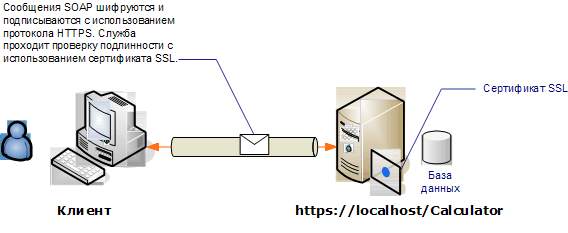

# <a name="transport-security-with-an-anonymous-client"></a><span data-ttu-id="4503b-102">Безопасность транспорта с анонимным клиентом</span><span class="sxs-lookup"><span data-stu-id="4503b-102">Transport security with an anonymous client</span></span>

<span data-ttu-id="4503b-103">Этот сценарий Windows Communication Foundation (WCF) использует безопасность транспорта (HTTPS) для обеспечения конфиденциальности и целостности.</span><span class="sxs-lookup"><span data-stu-id="4503b-103">This Windows Communication Foundation (WCF) scenario uses transport security (HTTPS) to ensure confidentiality and integrity.</span></span> <span data-ttu-id="4503b-104">Сервер должен пройти проверку подлинности с использованием сертификата SSL, и клиенты должны доверять сертификату сервера.</span><span class="sxs-lookup"><span data-stu-id="4503b-104">The server must be authenticated with a Secure Sockets Layer (SSL) certificate, and the clients must trust the server's certificate.</span></span> <span data-ttu-id="4503b-105">Проверка подлинности клиента не выполняется никаким механизмом и, следовательно, клиент является анонимным.</span><span class="sxs-lookup"><span data-stu-id="4503b-105">The client is not authenticated by any mechanism and is, therefore, anonymous.</span></span>

<span data-ttu-id="4503b-106">Пример приложения см. в разделе [WS Transport Security](../samples/ws-transport-security.md).</span><span class="sxs-lookup"><span data-stu-id="4503b-106">For a sample application, see [WS Transport Security](../samples/ws-transport-security.md).</span></span> <span data-ttu-id="4503b-107">Дополнительные сведения о безопасности транспорта см. в статье [Общие сведения о безопасности транспорта](transport-security-overview.md).</span><span class="sxs-lookup"><span data-stu-id="4503b-107">For more information about transport security, see [Transport Security Overview](transport-security-overview.md).</span></span>

<span data-ttu-id="4503b-108">Дополнительные сведения об использовании сертификата со службой см. в разделе [Работа с](working-with-certificates.md) сертификатами и [инструкции. Настройка порта с помощью SSL-сертификата](how-to-configure-a-port-with-an-ssl-certificate.md).</span><span class="sxs-lookup"><span data-stu-id="4503b-108">For more information about using a certificate with a service, see [Working with Certificates](working-with-certificates.md) and [How to: Configure a Port with an SSL Certificate](how-to-configure-a-port-with-an-ssl-certificate.md).</span></span>



|<span data-ttu-id="4503b-110">Характеристика</span><span class="sxs-lookup"><span data-stu-id="4503b-110">Characteristic</span></span>|<span data-ttu-id="4503b-111">Описание</span><span class="sxs-lookup"><span data-stu-id="4503b-111">Description</span></span>|
|--------------------|-----------------|
|<span data-ttu-id="4503b-112">Режим безопасности</span><span class="sxs-lookup"><span data-stu-id="4503b-112">Security Mode</span></span>|<span data-ttu-id="4503b-113">Transport</span><span class="sxs-lookup"><span data-stu-id="4503b-113">Transport</span></span>|
|<span data-ttu-id="4503b-114">Взаимодействие</span><span class="sxs-lookup"><span data-stu-id="4503b-114">Interoperability</span></span>|<span data-ttu-id="4503b-115">С существующими веб-службами и клиентами</span><span class="sxs-lookup"><span data-stu-id="4503b-115">With existing Web services and clients</span></span>|
|<span data-ttu-id="4503b-116">Проверка подлинности (сервера)</span><span class="sxs-lookup"><span data-stu-id="4503b-116">Authentication (Server)</span></span><br /><br /> <span data-ttu-id="4503b-117">Проверка подлинности (клиента)</span><span class="sxs-lookup"><span data-stu-id="4503b-117">Authentication (Client)</span></span>|<span data-ttu-id="4503b-118">Да</span><span class="sxs-lookup"><span data-stu-id="4503b-118">Yes</span></span><br /><br /> <span data-ttu-id="4503b-119">Уровень приложения (без поддержки WCF)</span><span class="sxs-lookup"><span data-stu-id="4503b-119">Application level (no WCF support)</span></span>|
|<span data-ttu-id="4503b-120">Целостность</span><span class="sxs-lookup"><span data-stu-id="4503b-120">Integrity</span></span>|<span data-ttu-id="4503b-121">Да</span><span class="sxs-lookup"><span data-stu-id="4503b-121">Yes</span></span>|
|<span data-ttu-id="4503b-122">Конфиденциальность</span><span class="sxs-lookup"><span data-stu-id="4503b-122">Confidentiality</span></span>|<span data-ttu-id="4503b-123">Да</span><span class="sxs-lookup"><span data-stu-id="4503b-123">Yes</span></span>|
|<span data-ttu-id="4503b-124">Transport</span><span class="sxs-lookup"><span data-stu-id="4503b-124">Transport</span></span>|<span data-ttu-id="4503b-125">HTTPS</span><span class="sxs-lookup"><span data-stu-id="4503b-125">HTTPS</span></span>|
|<span data-ttu-id="4503b-126">Привязка</span><span class="sxs-lookup"><span data-stu-id="4503b-126">Binding</span></span>|<xref:System.ServiceModel.WSHttpBinding>|

## <a name="service"></a><span data-ttu-id="4503b-127">Service</span><span class="sxs-lookup"><span data-stu-id="4503b-127">Service</span></span>

<span data-ttu-id="4503b-128">Предполагается, что представленные ниже код и конфигурация выполняются независимо.</span><span class="sxs-lookup"><span data-stu-id="4503b-128">The following code and configuration are meant to run independently.</span></span> <span data-ttu-id="4503b-129">Выполните одно из следующих действий.</span><span class="sxs-lookup"><span data-stu-id="4503b-129">Do one of the following:</span></span>

- <span data-ttu-id="4503b-130">Создайте автономную службу, используя код без конфигурации.</span><span class="sxs-lookup"><span data-stu-id="4503b-130">Create a stand-alone service using the code with no configuration.</span></span>

- <span data-ttu-id="4503b-131">Создайте службу, используя предоставленную конфигурацию, но не определяйте конечные точки.</span><span class="sxs-lookup"><span data-stu-id="4503b-131">Create a service using the supplied configuration, but do not define any endpoints.</span></span>

### <a name="code"></a><span data-ttu-id="4503b-132">Код</span><span class="sxs-lookup"><span data-stu-id="4503b-132">Code</span></span>

<span data-ttu-id="4503b-133">В следующем коде показано создание конечной точки с использованием безопасности транспорта:</span><span class="sxs-lookup"><span data-stu-id="4503b-133">The following code shows how to create an endpoint using transport security:</span></span>

[!code-csharp[c_SecurityScenarios#5](~/samples/snippets/csharp/VS_Snippets_CFX/c_securityscenarios/cs/source.cs#5)]
[!code-vb[c_SecurityScenarios#5](~/samples/snippets/visualbasic/VS_Snippets_CFX/c_securityscenarios/vb/source.vb#5)]

### <a name="configuration"></a><span data-ttu-id="4503b-134">Конфигурация</span><span class="sxs-lookup"><span data-stu-id="4503b-134">Configuration</span></span>

<span data-ttu-id="4503b-135">В следующем коде настраивается та же конечная точка с использованием конфигурации.</span><span class="sxs-lookup"><span data-stu-id="4503b-135">The following code sets up the same endpoint using configuration.</span></span> <span data-ttu-id="4503b-136">Проверка подлинности клиента не выполняется никаким механизмом и, следовательно, клиент является анонимным.</span><span class="sxs-lookup"><span data-stu-id="4503b-136">The client is not authenticated by any mechanism, and is therefore anonymous.</span></span>

```xml
<?xml version="1.0" encoding="utf-8"?>
<configuration>
  <system.serviceModel>
    <services>
      <service name="ServiceModel.Calculator">
        <endpoint address="https://localhost/Calculator"
                  binding="wsHttpBinding"
                  bindingConfiguration="WSHttpBinding_ICalculator"
                  name="SecuredByTransportEndpoint"
                  contract="ServiceModel.ICalculator" />
      </service>
    </services>
    <bindings>
      <wsHttpBinding>
        <binding name="WSHttpBinding_ICalculator">
          <security mode="Transport">
            <transport clientCredentialType="None" />
          </security>
        </binding>
      </wsHttpBinding>
    </bindings>
    <client />
  </system.serviceModel>
</configuration>
```

## <a name="client"></a><span data-ttu-id="4503b-137">Клиент</span><span class="sxs-lookup"><span data-stu-id="4503b-137">Client</span></span>

<span data-ttu-id="4503b-138">Предполагается, что представленные ниже код и конфигурация выполняются независимо.</span><span class="sxs-lookup"><span data-stu-id="4503b-138">The following code and configuration are meant to run independently.</span></span> <span data-ttu-id="4503b-139">Выполните одно из следующих действий.</span><span class="sxs-lookup"><span data-stu-id="4503b-139">Do one of the following:</span></span>

- <span data-ttu-id="4503b-140">Создайте автономный клиент, используя код (и код клиента).</span><span class="sxs-lookup"><span data-stu-id="4503b-140">Create a stand-alone client using the code (and client code).</span></span>

- <span data-ttu-id="4503b-141">Создайте клиент, который не определяет никаких адресов конечных точек.</span><span class="sxs-lookup"><span data-stu-id="4503b-141">Create a client that does not define any endpoint addresses.</span></span> <span data-ttu-id="4503b-142">Вместо этого используйте конструктор клиента, который принимает в качестве аргумента имя конфигурации.</span><span class="sxs-lookup"><span data-stu-id="4503b-142">Instead, use the client constructor that takes the configuration name as an argument.</span></span> <span data-ttu-id="4503b-143">Например:</span><span class="sxs-lookup"><span data-stu-id="4503b-143">For example:</span></span>

     [!code-csharp[C_SecurityScenarios#0](~/samples/snippets/csharp/VS_Snippets_CFX/c_securityscenarios/cs/source.cs#0)]
     [!code-vb[C_SecurityScenarios#0](~/samples/snippets/visualbasic/VS_Snippets_CFX/c_securityscenarios/vb/source.vb#0)]

### <a name="code"></a><span data-ttu-id="4503b-144">Код</span><span class="sxs-lookup"><span data-stu-id="4503b-144">Code</span></span>

[!code-csharp[c_SecurityScenarios#6](~/samples/snippets/csharp/VS_Snippets_CFX/c_securityscenarios/cs/source.cs#6)]
[!code-vb[c_SecurityScenarios#6](~/samples/snippets/visualbasic/VS_Snippets_CFX/c_securityscenarios/vb/source.vb#6)]

### <a name="configuration"></a><span data-ttu-id="4503b-145">Конфигурация</span><span class="sxs-lookup"><span data-stu-id="4503b-145">Configuration</span></span>

<span data-ttu-id="4503b-146">Вместо кода для настройки службы можно использовать следующую конфигурацию.</span><span class="sxs-lookup"><span data-stu-id="4503b-146">The following configuration can be used instead of the code to set up the service.</span></span>

```xml
<configuration>
  <system.serviceModel>
    <bindings>
      <wsHttpBinding>
        <binding name="WSHttpBinding_ICalculator" >
          <security mode="Transport">
            <transport clientCredentialType="None" />
          </security>
        </binding>
      </wsHttpBinding>
    </bindings>
    <client>
      <endpoint address="https://machineName/Calculator"
                binding="wsHttpBinding"
                bindingConfiguration="WSHttpBinding_ICalculator"
                contract="ICalculator"
                name="WSHttpBinding_ICalculator" />
    </client>
  </system.serviceModel>
</configuration>
```

## <a name="see-also"></a><span data-ttu-id="4503b-147">См. также:</span><span class="sxs-lookup"><span data-stu-id="4503b-147">See also</span></span>

- [<span data-ttu-id="4503b-148">Общие сведения о безопасности</span><span class="sxs-lookup"><span data-stu-id="4503b-148">Security Overview</span></span>](security-overview.md)
- [<span data-ttu-id="4503b-149">Безопасность транспорта WS</span><span class="sxs-lookup"><span data-stu-id="4503b-149">WS Transport Security</span></span>](../samples/ws-transport-security.md)
- [<span data-ttu-id="4503b-150">Общие сведения о безопасности транспорта</span><span class="sxs-lookup"><span data-stu-id="4503b-150">Transport Security Overview</span></span>](transport-security-overview.md)
- <span data-ttu-id="4503b-151">[Модель безопасности для Windows Server App Fabric](https://docs.microsoft.com/previous-versions/appfabric/ee677202(v=azure.10))</span><span class="sxs-lookup"><span data-stu-id="4503b-151">[Security Model for Windows Server App Fabric](https://docs.microsoft.com/previous-versions/appfabric/ee677202(v=azure.10))</span></span>
