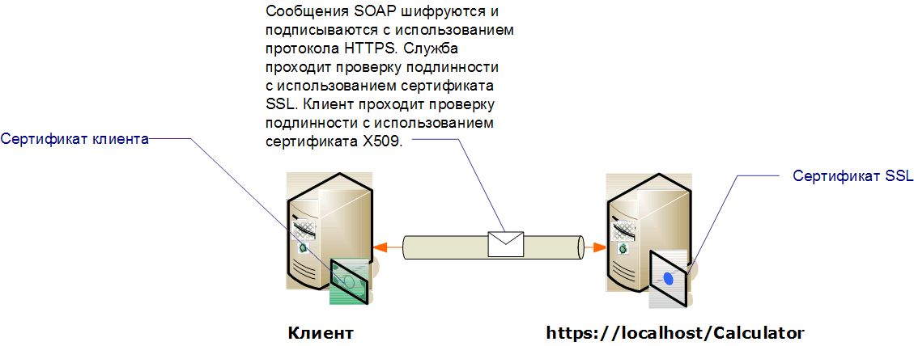

# <a name="transport-security-with-certificate-authentication"></a><span data-ttu-id="b6f0d-102">Безопасность транспорта с проверкой подлинности с использованием сертификатов</span><span class="sxs-lookup"><span data-stu-id="b6f0d-102">Transport Security with Certificate Authentication</span></span>

<span data-ttu-id="b6f0d-103">В этой статье рассматривается использование сертификатов X. 509 для проверки подлинности сервера и клиента при использовании безопасности транспорта.</span><span class="sxs-lookup"><span data-stu-id="b6f0d-103">This article discusses using X.509 certificates for server and client authentication when using transport security.</span></span> <span data-ttu-id="b6f0d-104">Дополнительные сведения о сертификатах X.509 см. в разделе [Сертификаты открытого ключа X.509](/windows/desktop/SecCertEnroll/about-x-509-public-key-certificates).</span><span class="sxs-lookup"><span data-stu-id="b6f0d-104">For more information about X.509 certificates see [X.509 Public Key Certificates](/windows/desktop/SecCertEnroll/about-x-509-public-key-certificates).</span></span> <span data-ttu-id="b6f0d-105">Сертификаты должны выдаваться центром сертификации, который часто является сторонним издателем сертификатов.</span><span class="sxs-lookup"><span data-stu-id="b6f0d-105">Certificates must be issued by a certification authority, which is often a third-party issuer of certificates.</span></span> <span data-ttu-id="b6f0d-106">В домене Windows Server для выдачи сертификатов клиентским компьютерам домена можно использовать службу сертификации Active Directory.</span><span class="sxs-lookup"><span data-stu-id="b6f0d-106">On a Windows Server domain, Active Directory Certificate Services can be used to issue certificates to client computers on the domain.</span></span> <span data-ttu-id="b6f0d-107">В этом сценарии служба размещена в службах IIS, которые используют протокол SSL.</span><span class="sxs-lookup"><span data-stu-id="b6f0d-107">In this scenario, the service is hosted under Internet Information Services (IIS) which is configured with Secure Sockets Layer (SSL).</span></span> <span data-ttu-id="b6f0d-108">В службе задано использование сертификата SSL (X.509), чтобы клиенты могли проверять подлинность сервера.</span><span class="sxs-lookup"><span data-stu-id="b6f0d-108">The service is configured with an SSL (X.509) certificate to allow clients to verify the identity of the server.</span></span> <span data-ttu-id="b6f0d-109">В клиенте также задано использование сертификата X.509, что позволяет службе проверять подлинность клиента.</span><span class="sxs-lookup"><span data-stu-id="b6f0d-109">The client is also configured with an X.509 certificate that allows the service to verify the identity of the client.</span></span> <span data-ttu-id="b6f0d-110">Клиент должен доверять сертификату сервера, а сервер ― сертификату клиента.</span><span class="sxs-lookup"><span data-stu-id="b6f0d-110">The server’s certificate must be trusted by the client and the client’s certificate must be trusted by the server.</span></span> <span data-ttu-id="b6f0d-111">Фактический механизм, с помощью которого служба и клиент проверяют удостоверение другого пользователя, выходит за рамки этой статьи.</span><span class="sxs-lookup"><span data-stu-id="b6f0d-111">The actual mechanics of how the service and client verifies each other’s identity is beyond the scope of this article.</span></span> <span data-ttu-id="b6f0d-112">Дополнительные сведения см. в статье [Цифровая подпись](https://en.wikipedia.org/wiki/Digital_signature) в Википедии.</span><span class="sxs-lookup"><span data-stu-id="b6f0d-112">For more information, see [Digital Signature](https://en.wikipedia.org/wiki/Digital_signature) on Wikipedia.</span></span>
  
 <span data-ttu-id="b6f0d-113">В этом сценарии реализуется шаблон обмена сообщениями «запрос-ответ», показанный на следующей схеме.</span><span class="sxs-lookup"><span data-stu-id="b6f0d-113">This scenario implements a request/reply message pattern as illustrated by the following diagram.</span></span>  
  
 <span data-ttu-id="b6f0d-114"></span><span class="sxs-lookup"><span data-stu-id="b6f0d-114"></span></span>  
  
 <span data-ttu-id="b6f0d-115">Дополнительные сведения об использовании сертификата со службой см. в разделе [Работа с](../../../../docs/framework/wcf/feature-details/working-with-certificates.md) сертификатами и [инструкции. Настройка порта с помощью SSL-сертификата](../../../../docs/framework/wcf/feature-details/how-to-configure-a-port-with-an-ssl-certificate.md).</span><span class="sxs-lookup"><span data-stu-id="b6f0d-115">For more information about using a certificate with a service, see [Working with Certificates](../../../../docs/framework/wcf/feature-details/working-with-certificates.md) and [How to: Configure a Port with an SSL Certificate](../../../../docs/framework/wcf/feature-details/how-to-configure-a-port-with-an-ssl-certificate.md).</span></span> <span data-ttu-id="b6f0d-116">В следующей таблице описываются различные особенности этого сценария.</span><span class="sxs-lookup"><span data-stu-id="b6f0d-116">The following table describes the various characteristics of the scenario.</span></span>  
  
|<span data-ttu-id="b6f0d-117">Характеристика</span><span class="sxs-lookup"><span data-stu-id="b6f0d-117">Characteristic</span></span>|<span data-ttu-id="b6f0d-118">Описание</span><span class="sxs-lookup"><span data-stu-id="b6f0d-118">Description</span></span>|  
|--------------------|-----------------|  
|<span data-ttu-id="b6f0d-119">Режим безопасности</span><span class="sxs-lookup"><span data-stu-id="b6f0d-119">Security Mode</span></span>|<span data-ttu-id="b6f0d-120">Transport</span><span class="sxs-lookup"><span data-stu-id="b6f0d-120">Transport</span></span>|  
|<span data-ttu-id="b6f0d-121">Взаимодействие</span><span class="sxs-lookup"><span data-stu-id="b6f0d-121">Interoperability</span></span>|<span data-ttu-id="b6f0d-122">С существующими службами и клиентами веб-служб.</span><span class="sxs-lookup"><span data-stu-id="b6f0d-122">With existing Web service clients and services.</span></span>|  
|<span data-ttu-id="b6f0d-123">Проверка подлинности (сервера)</span><span class="sxs-lookup"><span data-stu-id="b6f0d-123">Authentication (Server)</span></span><br /><br /> <span data-ttu-id="b6f0d-124">Проверка подлинности (клиента)</span><span class="sxs-lookup"><span data-stu-id="b6f0d-124">Authentication (Client)</span></span>|<span data-ttu-id="b6f0d-125">Да (с использованием SSL-сертификата)</span><span class="sxs-lookup"><span data-stu-id="b6f0d-125">Yes (using an SSL certificate)</span></span><br /><br /> <span data-ttu-id="b6f0d-126">Да (с использованием сертификата X.509)</span><span class="sxs-lookup"><span data-stu-id="b6f0d-126">Yes (using an X.509 certificate)</span></span>|  
|<span data-ttu-id="b6f0d-127">Целостность данных</span><span class="sxs-lookup"><span data-stu-id="b6f0d-127">Data Integrity</span></span>|<span data-ttu-id="b6f0d-128">Да</span><span class="sxs-lookup"><span data-stu-id="b6f0d-128">Yes</span></span>|  
|<span data-ttu-id="b6f0d-129">Конфиденциальность данных</span><span class="sxs-lookup"><span data-stu-id="b6f0d-129">Data Confidentiality</span></span>|<span data-ttu-id="b6f0d-130">Да</span><span class="sxs-lookup"><span data-stu-id="b6f0d-130">Yes</span></span>|  
|<span data-ttu-id="b6f0d-131">Transport</span><span class="sxs-lookup"><span data-stu-id="b6f0d-131">Transport</span></span>|<span data-ttu-id="b6f0d-132">HTTPS</span><span class="sxs-lookup"><span data-stu-id="b6f0d-132">HTTPS</span></span>|  
|<span data-ttu-id="b6f0d-133">Привязка</span><span class="sxs-lookup"><span data-stu-id="b6f0d-133">Binding</span></span>|<xref:System.ServiceModel.WSHttpBinding>|  
  
## <a name="configure-the-service"></a><span data-ttu-id="b6f0d-134">Настройка службы</span><span class="sxs-lookup"><span data-stu-id="b6f0d-134">Configure the Service</span></span>  
 <span data-ttu-id="b6f0d-135">Поскольку в этом сценарии служба размещается в службах IIS, он настраивается с помощью файла web.config.</span><span class="sxs-lookup"><span data-stu-id="b6f0d-135">Since the service in this scenario is hosted under IIS, it is configured with a web.config file.</span></span> <span data-ttu-id="b6f0d-136">В следующем примере содержимого файла web.config показано, как настроить в <xref:System.ServiceModel.WSHttpBinding> использование безопасности транспорта и учетных данных клиента X.509.</span><span class="sxs-lookup"><span data-stu-id="b6f0d-136">The following web.config shows how to configure the <xref:System.ServiceModel.WSHttpBinding> to use transport security and X.509 client credentials.</span></span>  
  
```xml  
<configuration>  
  <system.serviceModel>  
    <protocolMapping>  
      <add scheme="https" binding="wsHttpBinding" />  
    </protocolMapping>  
    <bindings>  
      <wsHttpBinding>  
        <!-- configure wsHttp binding with Transport security mode and clientCredentialType as Certificate -->  
        <binding>  
          <security mode="Transport">  
            <transport clientCredentialType="Certificate"/>              
          </security>  
        </binding>  
      </wsHttpBinding>  
    </bindings>  
    <!--For debugging purposes set the includeExceptionDetailInFaults attribute to true-->  
    <behaviors>  
      <serviceBehaviors>  
        <behavior>            
           <serviceDebug includeExceptionDetailInFaults="True" />  
        </behavior>  
      </serviceBehaviors>  
    </behaviors>  
  </system.serviceModel>  
</configuration>  
```  
  
## <a name="configure-the-client"></a><span data-ttu-id="b6f0d-137">Настройка клиента</span><span class="sxs-lookup"><span data-stu-id="b6f0d-137">Configure the Client</span></span>  
 <span data-ttu-id="b6f0d-138">Настроить клиент можно в коде или в файле app.config.</span><span class="sxs-lookup"><span data-stu-id="b6f0d-138">The client can be configured in code or in an app.config file.</span></span> <span data-ttu-id="b6f0d-139">В следующем примере показано, как настроить клиент в коде.</span><span class="sxs-lookup"><span data-stu-id="b6f0d-139">The following example shows how to configure the client in code.</span></span>  
  
```csharp
// Create the binding.  
var myBinding = new WSHttpBinding();  
myBinding.Security.Mode = SecurityMode.Transport;  
myBinding.Security.Transport.ClientCredentialType =  
   HttpClientCredentialType.Certificate;  
  
// Create the endpoint address. Note that the machine name   
// must match the subject or DNS field of the X.509 certificate  
// used to authenticate the service.   
var ea = new  
   EndpointAddress("https://localhost/CalculatorService/service.svc");  
  
// Create the client. The code for the calculator   
// client is not shown here. See the sample applications  
// for examples of the calculator code.  
var cc =  
   new CalculatorClient(myBinding, ea);  
  
// The client must specify a certificate trusted by the server.  
cc.ClientCredentials.ClientCertificate.SetCertificate(  
    StoreLocation.CurrentUser,  
    StoreName.My,  
    X509FindType.FindBySubjectName,  
    "contoso.com");  
  
// Begin using the client.  
Console.WriteLine(cc.Add(100, 1111));  
//...  
cc.Close();  
```  
  
 <span data-ttu-id="b6f0d-140">Также можно настроить клиент в файле App.config, как показано в следующем примере:</span><span class="sxs-lookup"><span data-stu-id="b6f0d-140">Alternatively you can configure the client in an App.config file as shown in the following example:</span></span>  
  
```xml  
<configuration>  
  <system.serviceModel>  
    <client>  
      <!-- this endpoint has an https: address -->  
      <endpoint address=" https://localhost/CalculatorService/service.svc "   
                behaviorConfiguration="endpointCredentialBehavior"  
                binding="wsHttpBinding"   
                bindingConfiguration="Binding1"   
                contract="Microsoft.Samples.TransportSecurity.ICalculator"/>  
    </client>  
    <behaviors>  
      <endpointBehaviors>  
        <behavior name="endpointCredentialBehavior">  
          <clientCredentials>  
            <clientCertificate findValue="contoso.com"  
                               storeLocation="CurrentUser"  
                               storeName="My"  
                               x509FindType="FindBySubjectName" />  
          </clientCredentials>  
        </behavior>  
      </endpointBehaviors>  
    </behaviors>  
    <bindings>  
      <wsHttpBinding>  
        <!-- configure wsHttpbinding with Transport security mode  
                   and clientCredentialType as Certificate -->  
        <binding name="Binding1">  
          <security mode="Transport">  
            <transport clientCredentialType="Certificate"/>  
          </security>  
        </binding>  
      </wsHttpBinding>  
    </bindings>  
  </system.serviceModel>  
  
<startup><supportedRuntime version="v4.0" sku=".NETFramework,Version=v4.0"/></startup></configuration>  
```  
  
## <a name="see-also"></a><span data-ttu-id="b6f0d-141">См. также:</span><span class="sxs-lookup"><span data-stu-id="b6f0d-141">See also</span></span>

- [<span data-ttu-id="b6f0d-142">Общие сведения о безопасности</span><span class="sxs-lookup"><span data-stu-id="b6f0d-142">Security Overview</span></span>](../../../../docs/framework/wcf/feature-details/security-overview.md)
- <span data-ttu-id="b6f0d-143">[Модель безопасности для Windows Server App Fabric](https://docs.microsoft.com/previous-versions/appfabric/ee677202(v=azure.10))</span><span class="sxs-lookup"><span data-stu-id="b6f0d-143">[Security Model for Windows Server App Fabric](https://docs.microsoft.com/previous-versions/appfabric/ee677202(v=azure.10))</span></span>
