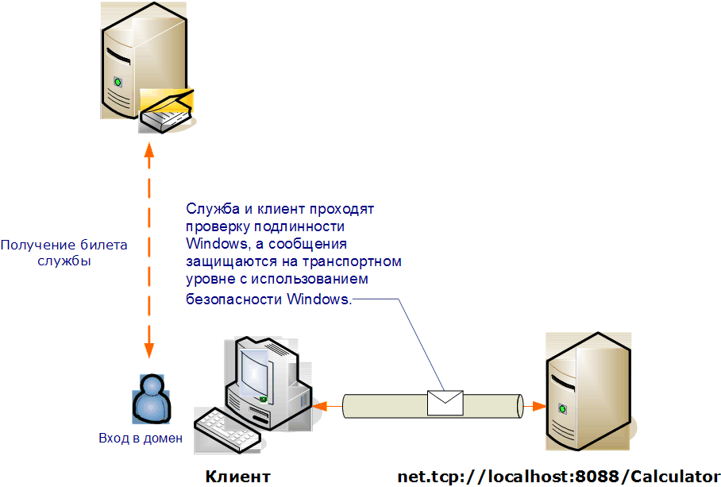

# <a name="transport-security-with-windows-authentication"></a><span data-ttu-id="f0b8a-102">Безопасность транспорта с проверкой подлинности Windows</span><span class="sxs-lookup"><span data-stu-id="f0b8a-102">Transport Security with Windows Authentication</span></span>
<span data-ttu-id="f0b8a-103">В следующем сценарии показаны клиент Windows Communication Foundation (WCF) и служба, защищенные механизмом безопасности Windows.</span><span class="sxs-lookup"><span data-stu-id="f0b8a-103">The following scenario shows a Windows Communication Foundation (WCF) client and service secured by Windows security.</span></span> <span data-ttu-id="f0b8a-104">Дополнительные сведения о программировании см. в разделе [как: Защита службы с учетными данными Windows](../../../../docs/framework/wcf/how-to-secure-a-service-with-windows-credentials.md).</span><span class="sxs-lookup"><span data-stu-id="f0b8a-104">For more information about programming, see [How to: Secure a Service with Windows Credentials](../../../../docs/framework/wcf/how-to-secure-a-service-with-windows-credentials.md).</span></span>  
  
 <span data-ttu-id="f0b8a-105">Веб-служба интрасети отображает информацию о персонале.</span><span class="sxs-lookup"><span data-stu-id="f0b8a-105">An intranet Web service displays human resources information.</span></span> <span data-ttu-id="f0b8a-106">Клиентом является приложение Windows Forms.</span><span class="sxs-lookup"><span data-stu-id="f0b8a-106">The client is a Windows Form application.</span></span> <span data-ttu-id="f0b8a-107">Приложение развернуто на домене с защищающем его контроллером Kerberos.</span><span class="sxs-lookup"><span data-stu-id="f0b8a-107">The application is deployed in a domain with a Kerberos controller securing the domain.</span></span>  
  
 <span data-ttu-id="f0b8a-108"></span><span class="sxs-lookup"><span data-stu-id="f0b8a-108"></span></span>  
  
|<span data-ttu-id="f0b8a-109">Характеристика</span><span class="sxs-lookup"><span data-stu-id="f0b8a-109">Characteristic</span></span>|<span data-ttu-id="f0b8a-110">Описание</span><span class="sxs-lookup"><span data-stu-id="f0b8a-110">Description</span></span>|  
|--------------------|-----------------|  
|<span data-ttu-id="f0b8a-111">Режим безопасности</span><span class="sxs-lookup"><span data-stu-id="f0b8a-111">Security Mode</span></span>|<span data-ttu-id="f0b8a-112">Transport</span><span class="sxs-lookup"><span data-stu-id="f0b8a-112">Transport</span></span>|  
|<span data-ttu-id="f0b8a-113">Взаимодействие</span><span class="sxs-lookup"><span data-stu-id="f0b8a-113">Interoperability</span></span>|<span data-ttu-id="f0b8a-114">Только WCF</span><span class="sxs-lookup"><span data-stu-id="f0b8a-114">WCF only</span></span>|  
|<span data-ttu-id="f0b8a-115">Проверка подлинности (сервера)</span><span class="sxs-lookup"><span data-stu-id="f0b8a-115">Authentication (Server)</span></span><br /><br /> <span data-ttu-id="f0b8a-116">Проверка подлинности (клиента)</span><span class="sxs-lookup"><span data-stu-id="f0b8a-116">Authentication (Client)</span></span>|<span data-ttu-id="f0b8a-117">Да (при помощи встроенной проверки подлинности Windows)</span><span class="sxs-lookup"><span data-stu-id="f0b8a-117">Yes (using Windows integrated authentication)</span></span><br /><br /> <span data-ttu-id="f0b8a-118">Да (при помощи встроенной проверки подлинности Windows)</span><span class="sxs-lookup"><span data-stu-id="f0b8a-118">Yes (using Windows integrated authentication)</span></span>|  
|<span data-ttu-id="f0b8a-119">Целостность</span><span class="sxs-lookup"><span data-stu-id="f0b8a-119">Integrity</span></span>|<span data-ttu-id="f0b8a-120">Да</span><span class="sxs-lookup"><span data-stu-id="f0b8a-120">Yes</span></span>|  
|<span data-ttu-id="f0b8a-121">Конфиденциальность</span><span class="sxs-lookup"><span data-stu-id="f0b8a-121">Confidentiality</span></span>|<span data-ttu-id="f0b8a-122">Да</span><span class="sxs-lookup"><span data-stu-id="f0b8a-122">Yes</span></span>|  
|<span data-ttu-id="f0b8a-123">Transport</span><span class="sxs-lookup"><span data-stu-id="f0b8a-123">Transport</span></span>|<span data-ttu-id="f0b8a-124">NET.TCP</span><span class="sxs-lookup"><span data-stu-id="f0b8a-124">NET.TCP</span></span>|  
|<span data-ttu-id="f0b8a-125">Привязка</span><span class="sxs-lookup"><span data-stu-id="f0b8a-125">Binding</span></span>|<xref:System.ServiceModel.NetTcpBinding>|  
  
## <a name="service"></a><span data-ttu-id="f0b8a-126">Служба</span><span class="sxs-lookup"><span data-stu-id="f0b8a-126">Service</span></span>  
 <span data-ttu-id="f0b8a-127">Предполагается, что представленные ниже код и конфигурация выполняются независимо.</span><span class="sxs-lookup"><span data-stu-id="f0b8a-127">The following code and configuration are meant to run independently.</span></span> <span data-ttu-id="f0b8a-128">Выполните одно из следующих действий.</span><span class="sxs-lookup"><span data-stu-id="f0b8a-128">Do one of the following:</span></span>  
  
-   <span data-ttu-id="f0b8a-129">Создайте автономную службу, используя код без конфигурации.</span><span class="sxs-lookup"><span data-stu-id="f0b8a-129">Create a stand-alone service using the code with no configuration.</span></span>  
  
-   <span data-ttu-id="f0b8a-130">Создайте службу, используя предоставленную конфигурацию, но не определяйте конечные точки.</span><span class="sxs-lookup"><span data-stu-id="f0b8a-130">Create a service using the supplied configuration, but do not define any endpoints.</span></span>  
  
### <a name="code"></a><span data-ttu-id="f0b8a-131">Код</span><span class="sxs-lookup"><span data-stu-id="f0b8a-131">Code</span></span>  
 <span data-ttu-id="f0b8a-132">В следующем коде показано, как создать конечную точку службы, которая использует безопасность Windows.</span><span class="sxs-lookup"><span data-stu-id="f0b8a-132">The following code shows how to create a service endpoint that uses a Windows security.</span></span>  
  
 [!code-csharp[C_SecurityScenarios#3](../../../../samples/snippets/csharp/VS_Snippets_CFX/c_securityscenarios/cs/source.cs#3)]
 [!code-vb[C_SecurityScenarios#3](../../../../samples/snippets/visualbasic/VS_Snippets_CFX/c_securityscenarios/vb/source.vb#3)]  
  
### <a name="configuration"></a><span data-ttu-id="f0b8a-133">Конфигурация</span><span class="sxs-lookup"><span data-stu-id="f0b8a-133">Configuration</span></span>  
 <span data-ttu-id="f0b8a-134">Вместо кода для настройки конечной точки службы можно использовать следующую конфигурацию.</span><span class="sxs-lookup"><span data-stu-id="f0b8a-134">The following configuration can be used instead of the code to set up the service endpoint:</span></span>  
  
```xml  
<?xml version="1.0" encoding="utf-8"?>  
<configuration>  
  <system.serviceModel>  
    <behaviors />  
    <services>  
      <service behaviorConfiguration="" name="ServiceModel.Calculator">  
        <endpoint address="net.tcp://localhost:8008/Calculator"   
                  binding="netTcpBinding"  
          bindingConfiguration="WindowsClientOverTcp"   
                  name="WindowsClientOverTcp"  
                  contract="ServiceModel.ICalculator" />  
      </service>  
    </services>  
    <bindings>  
      <netTcpBinding>  
        <binding name="WindowsClientOverTcp">  
          <security mode="Transport">  
            <transport clientCredentialType="Windows" />  
          </security>  
        </binding>  
      </netTcpBinding>  
    </bindings>  
    <client />  
  </system.serviceModel>  
</configuration>  
```  
  
## <a name="client"></a><span data-ttu-id="f0b8a-135">"Клиент";</span><span class="sxs-lookup"><span data-stu-id="f0b8a-135">Client</span></span>  
 <span data-ttu-id="f0b8a-136">Предполагается, что представленные ниже код и конфигурация выполняются независимо.</span><span class="sxs-lookup"><span data-stu-id="f0b8a-136">The following code and configuration are meant to run independently.</span></span> <span data-ttu-id="f0b8a-137">Выполните одно из следующих действий.</span><span class="sxs-lookup"><span data-stu-id="f0b8a-137">Do one of the following:</span></span>  
  
-   <span data-ttu-id="f0b8a-138">Создайте автономный клиент, используя код (и код клиента).</span><span class="sxs-lookup"><span data-stu-id="f0b8a-138">Create a stand-alone client using the code (and client code).</span></span>  
  
-   <span data-ttu-id="f0b8a-139">Создайте клиент, который не определяет никаких адресов конечных точек.</span><span class="sxs-lookup"><span data-stu-id="f0b8a-139">Create a client that does not define any endpoint addresses.</span></span> <span data-ttu-id="f0b8a-140">Вместо этого используйте конструктор клиента, который принимает в качестве аргумента имя конфигурации.</span><span class="sxs-lookup"><span data-stu-id="f0b8a-140">Instead, use the client constructor that takes the configuration name as an argument.</span></span> <span data-ttu-id="f0b8a-141">Например:</span><span class="sxs-lookup"><span data-stu-id="f0b8a-141">For example:</span></span>  
  
     [!code-csharp[C_SecurityScenarios#0](../../../../samples/snippets/csharp/VS_Snippets_CFX/c_securityscenarios/cs/source.cs#0)]
     [!code-vb[C_SecurityScenarios#0](../../../../samples/snippets/visualbasic/VS_Snippets_CFX/c_securityscenarios/vb/source.vb#0)]  
  
### <a name="code"></a><span data-ttu-id="f0b8a-142">Код</span><span class="sxs-lookup"><span data-stu-id="f0b8a-142">Code</span></span>  
 <span data-ttu-id="f0b8a-143">Следующий код служит для создания клиента.</span><span class="sxs-lookup"><span data-stu-id="f0b8a-143">The following code creates the client.</span></span> <span data-ttu-id="f0b8a-144">Привязка настроена на использование безопасности транспортного режима с транспортом TCP, с типом учетных данных клиента, установленных на Windows.</span><span class="sxs-lookup"><span data-stu-id="f0b8a-144">The binding is configured to use the Transport mode security, with the TCP transport, with the client credential type set to Windows.</span></span>  
  
 [!code-csharp[C_SecurityScenarios#4](../../../../samples/snippets/csharp/VS_Snippets_CFX/c_securityscenarios/cs/source.cs#4)]
 [!code-vb[C_SecurityScenarios#4](../../../../samples/snippets/visualbasic/VS_Snippets_CFX/c_securityscenarios/vb/source.vb#4)]  
  
### <a name="configuration"></a><span data-ttu-id="f0b8a-145">Конфигурация</span><span class="sxs-lookup"><span data-stu-id="f0b8a-145">Configuration</span></span>  
 <span data-ttu-id="f0b8a-146">Вместо кода для создания клиента можно использовать следующую конфигурацию.</span><span class="sxs-lookup"><span data-stu-id="f0b8a-146">The following configuration can be used instead of the code to create the client.</span></span>  
  
```xml  
<?xml version="1.0" encoding="utf-8"?>  
<configuration>  
  <system.serviceModel>  
    <bindings>  
      <netTcpBinding>  
        <binding name="NetTcpBinding_ICalculator" >  
          <security mode="Transport">  
            <transport clientCredentialType="Windows" />  
          </security>  
        </binding>  
      </netTcpBinding>  
    </bindings>  
    <client>  
      <endpoint address="net.tcp://localhost:8008/Calculator"   
                binding="netTcpBinding"            
                bindingConfiguration="NetTcpBinding_ICalculator"   
                contract="ICalculator"  
                name="NetTcpBinding_ICalculator">  
      </endpoint>  
    </client>  
  </system.serviceModel>  
</configuration>  
```  
  
## <a name="see-also"></a><span data-ttu-id="f0b8a-147">См. также</span><span class="sxs-lookup"><span data-stu-id="f0b8a-147">See Also</span></span>  
 [<span data-ttu-id="f0b8a-148">Общие сведения о безопасности</span><span class="sxs-lookup"><span data-stu-id="f0b8a-148">Security Overview</span></span>](../../../../docs/framework/wcf/feature-details/security-overview.md)  
 [<span data-ttu-id="f0b8a-149">Практическое руководство. Защита службы с использованием учетных данных Windows</span><span class="sxs-lookup"><span data-stu-id="f0b8a-149">How to: Secure a Service with Windows Credentials</span></span>](../../../../docs/framework/wcf/how-to-secure-a-service-with-windows-credentials.md)  
 [<span data-ttu-id="f0b8a-150">Модель безопасности для Windows Server App Fabric</span><span class="sxs-lookup"><span data-stu-id="f0b8a-150">Security Model for Windows Server App Fabric</span></span>](https://go.microsoft.com/fwlink/?LinkID=201279&clcid=0x409)
