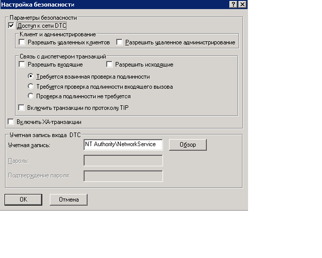

# <a name="troubleshooting-queued-messaging"></a><span data-ttu-id="e6b76-102">Устранение неполадок обмена сообщениями с использованием очередей</span><span class="sxs-lookup"><span data-stu-id="e6b76-102">Troubleshooting Queued Messaging</span></span>

<span data-ttu-id="e6b76-103">В этом разделе содержатся часто задаваемые вопросы и Справка по устранению неполадок при использовании очередей в Windows Communication Foundation (WCF).</span><span class="sxs-lookup"><span data-stu-id="e6b76-103">This section contains common questions and troubleshooting help for using queues in Windows Communication Foundation (WCF).</span></span>

## <a name="common-questions"></a><span data-ttu-id="e6b76-104">Наиболее распространенные вопросы</span><span class="sxs-lookup"><span data-stu-id="e6b76-104">Common Questions</span></span>

<span data-ttu-id="e6b76-105">**Вопрос.** Я использовал WCF Beta 1 и установил исправление MSMQ.</span><span class="sxs-lookup"><span data-stu-id="e6b76-105">**Q:** I used WCF Beta 1 and I installed the MSMQ hotfix.</span></span> <span data-ttu-id="e6b76-106">Требуется ли удалять исправление?</span><span class="sxs-lookup"><span data-stu-id="e6b76-106">Do I need to remove the hotfix?</span></span>

<span data-ttu-id="e6b76-107">**О.** Да.</span><span class="sxs-lookup"><span data-stu-id="e6b76-107">**A:** Yes.</span></span> <span data-ttu-id="e6b76-108">Это исправление больше не поддерживается.</span><span class="sxs-lookup"><span data-stu-id="e6b76-108">This hotfix is no longer supported.</span></span> <span data-ttu-id="e6b76-109">Теперь WCF работает с MSMQ без необходимости исправления.</span><span class="sxs-lookup"><span data-stu-id="e6b76-109">WCF now works on MSMQ without a hotfix requirement.</span></span>

<span data-ttu-id="e6b76-110">**Вопрос.** Существует две привязки для MSMQ: <xref:System.ServiceModel.NetMsmqBinding> и <xref:System.ServiceModel.MsmqIntegration.MsmqIntegrationBinding>.</span><span class="sxs-lookup"><span data-stu-id="e6b76-110">**Q:** There are two bindings for MSMQ: <xref:System.ServiceModel.NetMsmqBinding> and <xref:System.ServiceModel.MsmqIntegration.MsmqIntegrationBinding>.</span></span> <span data-ttu-id="e6b76-111">Какую необходимо использовать и когда?</span><span class="sxs-lookup"><span data-stu-id="e6b76-111">What should I use and when?</span></span>

<span data-ttu-id="e6b76-112">Ответ **.** Используйте <xref:System.ServiceModel.NetMsmqBinding>, если вы хотите использовать MSMQ в качестве транспорта для обмена данными между двумя приложениями WCF в очереди.</span><span class="sxs-lookup"><span data-stu-id="e6b76-112">**A:** Use the <xref:System.ServiceModel.NetMsmqBinding> when you want to use MSMQ as a transport for queued communication between two WCF applications.</span></span> <span data-ttu-id="e6b76-113">Используйте <xref:System.ServiceModel.MsmqIntegration.MsmqIntegrationBinding>, если вы хотите использовать существующие приложения MSMQ для взаимодействия с новыми приложениями WCF.</span><span class="sxs-lookup"><span data-stu-id="e6b76-113">Use the <xref:System.ServiceModel.MsmqIntegration.MsmqIntegrationBinding> when you want to use existing MSMQ applications to communicate with new WCF applications.</span></span>

<span data-ttu-id="e6b76-114">**Вопрос.** Нужно ли обновлять MSMQ для использования привязок <xref:System.ServiceModel.NetMsmqBinding> и `MsmqIntegration`?</span><span class="sxs-lookup"><span data-stu-id="e6b76-114">**Q:** Do I have to upgrade MSMQ to use the <xref:System.ServiceModel.NetMsmqBinding> and `MsmqIntegration` bindings?</span></span>

<span data-ttu-id="e6b76-115">**Ответ.** Нет.</span><span class="sxs-lookup"><span data-stu-id="e6b76-115">**A:** No.</span></span> <span data-ttu-id="e6b76-116">Обе привязки работают с MSMQ 3,0 на [!INCLUDE[wxp](../../../../includes/wxp-md.md)] и Windows Server 2003.</span><span class="sxs-lookup"><span data-stu-id="e6b76-116">Both bindings work with MSMQ 3.0 on [!INCLUDE[wxp](../../../../includes/wxp-md.md)] and Windows Server 2003.</span></span> <span data-ttu-id="e6b76-117">Некоторые функции привязок становятся доступными при обновлении до MSMQ 4,0 в Windows Vista.</span><span class="sxs-lookup"><span data-stu-id="e6b76-117">Certain features of the bindings become available when you upgrade to MSMQ 4.0 in Windows Vista.</span></span>

<span data-ttu-id="e6b76-118">**Вопрос.** Какие функции привязок <xref:System.ServiceModel.NetMsmqBinding> и <xref:System.ServiceModel.MsmqIntegration.MsmqIntegrationBinding> доступны в MSMQ 4,0, но не в MSMQ 3,0?</span><span class="sxs-lookup"><span data-stu-id="e6b76-118">**Q:** What features of the <xref:System.ServiceModel.NetMsmqBinding> and <xref:System.ServiceModel.MsmqIntegration.MsmqIntegrationBinding> bindings are available in MSMQ 4.0 but not in MSMQ 3.0?</span></span>

<span data-ttu-id="e6b76-119">Ответ **.** Следующие функции доступны в MSMQ 4,0, но не в MSMQ 3,0:</span><span class="sxs-lookup"><span data-stu-id="e6b76-119">**A:** The following features are available in MSMQ 4.0 but not in MSMQ 3.0:</span></span>

- <span data-ttu-id="e6b76-120">Пользовательская очередь недоставленных сообщений поддерживается только в MSMQ 4.0.</span><span class="sxs-lookup"><span data-stu-id="e6b76-120">Custom dead-letter queue is supported only on MSMQ 4.0.</span></span>

- <span data-ttu-id="e6b76-121">MSMQ 3.0 и 4.0 обрабатывают опасные сообщения по-разному.</span><span class="sxs-lookup"><span data-stu-id="e6b76-121">MSMQ 3.0 and 4.0 handle poison messages differently.</span></span>

- <span data-ttu-id="e6b76-122">Удаленные чтения в транзакциях поддерживаются только MSMQ 4.0.</span><span class="sxs-lookup"><span data-stu-id="e6b76-122">Only MSMQ 4.0 supports remote transacted read.</span></span>

<span data-ttu-id="e6b76-123">Дополнительные сведения см. в разделе [различия в возможностях очередей в Windows Vista, Windows Server 2003 и Windows XP](../../../../docs/framework/wcf/feature-details/diff-in-queue-in-vista-server-2003-windows-xp.md).</span><span class="sxs-lookup"><span data-stu-id="e6b76-123">For more information, see [Differences in Queuing Features in Windows Vista, Windows Server 2003, and Windows XP](../../../../docs/framework/wcf/feature-details/diff-in-queue-in-vista-server-2003-windows-xp.md).</span></span>

<span data-ttu-id="e6b76-124">**Вопрос.** Можно ли использовать MSMQ 3,0 на одной стороне связи с очередями и MSMQ 4,0 на другой стороне?</span><span class="sxs-lookup"><span data-stu-id="e6b76-124">**Q:** Can I use MSMQ 3.0 on one side of a queued communication and MSMQ 4.0 on the other side?</span></span>

<span data-ttu-id="e6b76-125">**О.** Да.</span><span class="sxs-lookup"><span data-stu-id="e6b76-125">**A:** Yes.</span></span>

<span data-ttu-id="e6b76-126">**Вопрос.** Я хочу интегрировать существующие приложения MSMQ с новыми клиентами или серверами WCF.</span><span class="sxs-lookup"><span data-stu-id="e6b76-126">**Q:** I want to integrate existing MSMQ applications with new WCF clients or servers.</span></span> <span data-ttu-id="e6b76-127">Требуются ли обновления для обеих сторон инфраструктуры MSMQ?</span><span class="sxs-lookup"><span data-stu-id="e6b76-127">Do I need to upgrade both sides of my MSMQ infrastructure?</span></span>

<span data-ttu-id="e6b76-128">**Ответ.** Нет.</span><span class="sxs-lookup"><span data-stu-id="e6b76-128">**A:** No.</span></span> <span data-ttu-id="e6b76-129">Для обеих сторон обновление до MSMQ 4.0 не требуется.</span><span class="sxs-lookup"><span data-stu-id="e6b76-129">You do not have to upgrade to MSMQ 4.0 on either side.</span></span>

## <a name="troubleshooting"></a><span data-ttu-id="e6b76-130">Диагностика</span><span class="sxs-lookup"><span data-stu-id="e6b76-130">Troubleshooting</span></span>

<span data-ttu-id="e6b76-131">Данный раздел содержит ответы на вопросы, связанные с устранением распространенных неполадок.</span><span class="sxs-lookup"><span data-stu-id="e6b76-131">This section contains answers to most common troubleshooting issues.</span></span> <span data-ttu-id="e6b76-132">Некоторые вопросы, являющиеся известными ограничениями, описаны также в заметках о выпуске.</span><span class="sxs-lookup"><span data-stu-id="e6b76-132">Some issues that are known limitations are also described in the release notes.</span></span>

<span data-ttu-id="e6b76-133">**Вопрос.** Я пытаюсь использовать частную очередь и получаю следующее исключение: `System.InvalidOperationException`: недопустимый URL-адрес.</span><span class="sxs-lookup"><span data-stu-id="e6b76-133">**Q:** I am trying to use a private queue and I get the following exception: `System.InvalidOperationException`: The URL is invalid.</span></span> <span data-ttu-id="e6b76-134">URL-адрес очереди не может содержать символ "$".</span><span class="sxs-lookup"><span data-stu-id="e6b76-134">The URL for the queue cannot contain the '$' character.</span></span> <span data-ttu-id="e6b76-135">Используйте синтаксис net.msmq://machine/private/queueName, чтобы адресовать частную очередь.</span><span class="sxs-lookup"><span data-stu-id="e6b76-135">Use the syntax in net.msmq://machine/private/queueName to address a private queue.</span></span>

<span data-ttu-id="e6b76-136">Ответ **.** Проверьте универсальный код ресурса (URI) очереди в конфигурации и коде.</span><span class="sxs-lookup"><span data-stu-id="e6b76-136">**A:** Please check the queue Uniform Resource Identifier (URI) in your configuration and code.</span></span> <span data-ttu-id="e6b76-137">Не используйте символ "$" в универсальном коде ресурса (URI).</span><span class="sxs-lookup"><span data-stu-id="e6b76-137">Do not use the "$" character in the URI.</span></span> <span data-ttu-id="e6b76-138">Например, чтобы адресовать частную очередь с именем OrdersQueue, задайте следующий универсальный код ресурса (URI): net.msmq://localhost/private/ordersQueue.</span><span class="sxs-lookup"><span data-stu-id="e6b76-138">For example, to address a private queue named OrdersQueue, specify the URI as net.msmq://localhost/private/ordersQueue.</span></span>

<span data-ttu-id="e6b76-139">**Вопрос.** Вызов `ServiceHost.Open()` в моем приложении, находящихся в очереди, вызывает следующее исключение: `System.ArgumentException`: базовый адрес не может содержать строку запроса URI.</span><span class="sxs-lookup"><span data-stu-id="e6b76-139">**Q:** Calling `ServiceHost.Open()` on my queued application throws the following exception: `System.ArgumentException`: A base address cannot contain a URI query string.</span></span> <span data-ttu-id="e6b76-140">Почему?</span><span class="sxs-lookup"><span data-stu-id="e6b76-140">Why?</span></span>

<span data-ttu-id="e6b76-141">Ответ **.** Проверьте URI очереди в файле конфигурации и в коде.</span><span class="sxs-lookup"><span data-stu-id="e6b76-141">**A:** Check the queue URI in your configuration file and in your code.</span></span> <span data-ttu-id="e6b76-142">Хотя очереди MSMQ поддерживают использование символа "?", универсальные коды ресурсов (URI) интерпретируют этот символ как начало строки запроса.</span><span class="sxs-lookup"><span data-stu-id="e6b76-142">While MSMQ queues support the use of the '?' character, URIs interpret this character as the beginning of a string query.</span></span> <span data-ttu-id="e6b76-143">Чтобы избежать этого, не используйте символ "?" в именах очередей.</span><span class="sxs-lookup"><span data-stu-id="e6b76-143">To avoid this issue, use queue names that do not contain '?' characters.</span></span>

<span data-ttu-id="e6b76-144">**Вопрос.** Моя отправка завершилась успехом, но на получателе не вызвана операция службы.</span><span class="sxs-lookup"><span data-stu-id="e6b76-144">**Q:** My send succeeded but no service operation is invoked on the receiver.</span></span> <span data-ttu-id="e6b76-145">Почему?</span><span class="sxs-lookup"><span data-stu-id="e6b76-145">Why?</span></span>

<span data-ttu-id="e6b76-146">Ответ **.** Чтобы определить ответ, обратитесь к следующему контрольному списку:</span><span class="sxs-lookup"><span data-stu-id="e6b76-146">**A:** To determine the answer, work through the following check list:</span></span>

- <span data-ttu-id="e6b76-147">Проверьте, совместимы ли требования транзакционной очереди с заданными гарантиями.</span><span class="sxs-lookup"><span data-stu-id="e6b76-147">Check that the transactional queue requirements are compatible with the assurances specified.</span></span> <span data-ttu-id="e6b76-148">Обратите внимание на следующие принципы.</span><span class="sxs-lookup"><span data-stu-id="e6b76-148">Note the following principles:</span></span>

  - <span data-ttu-id="e6b76-149">Устойчивые сообщения (датаграммы и сеансы) можно отправить с "только один раз" (<xref:System.ServiceModel.MsmqBindingBase.ExactlyOnce%2A> = `true`) только в транзакционную очередь.</span><span class="sxs-lookup"><span data-stu-id="e6b76-149">You can send durable messages (datagrams and sessions) with "exactly once" assurances (<xref:System.ServiceModel.MsmqBindingBase.ExactlyOnce%2A> = `true`) only to a transactional queue.</span></span>

  - <span data-ttu-id="e6b76-150">Сеансы можно отправлять только с гарантиями доставки точно по одному разу.</span><span class="sxs-lookup"><span data-stu-id="e6b76-150">You can send sessions only with "exactly once" assurances.</span></span>

  - <span data-ttu-id="e6b76-151">Необходимо, чтобы в сеансе транзакция получала сообщения из транзакционной очереди.</span><span class="sxs-lookup"><span data-stu-id="e6b76-151">A transaction is required to receive messages in a session from a transactional queue.</span></span>

  - <span data-ttu-id="e6b76-152">Вы можете отправлять или получать временные или устойчивые сообщения (только датаграммы) без гарантии (<xref:System.ServiceModel.MsmqBindingBase.ExactlyOnce%2A> = `false`) только в нетранзакционную очередь.</span><span class="sxs-lookup"><span data-stu-id="e6b76-152">You can send or receive volatile or durable messages (datagrams only) with no assurances (<xref:System.ServiceModel.MsmqBindingBase.ExactlyOnce%2A> = `false`) only to a non-transactional queue.</span></span>

- <span data-ttu-id="e6b76-153">Проверьте очередь недоставленных писем.</span><span class="sxs-lookup"><span data-stu-id="e6b76-153">Check the dead-letter queue.</span></span> <span data-ttu-id="e6b76-154">Если в этой очереди есть сообщения, определите причину, по которой они не были доставлены.</span><span class="sxs-lookup"><span data-stu-id="e6b76-154">If you find the messages there, determine why they were not delivered.</span></span>

- <span data-ttu-id="e6b76-155">Проверьте очереди исходящих сообщений на наличие проблем с подключением и адресацией.</span><span class="sxs-lookup"><span data-stu-id="e6b76-155">Check the outgoing queues for connectivity or addressing problems.</span></span>

<span data-ttu-id="e6b76-156">**Вопрос.** Я указал пользовательскую очередь недоставленных сообщений, но когда я запускаю приложение отправителя, я получаю исключение, что либо очередь недоставленных сообщений не найдена, либо у отправляющего приложения нет разрешения на доступ к очереди недоставленных сообщений.</span><span class="sxs-lookup"><span data-stu-id="e6b76-156">**Q:** I have specified a custom dead-letter queue, but when I start the sender application, I get an exception that either the dead-letter queue is not found, or the sending application has no permission to the dead-letter queue.</span></span> <span data-ttu-id="e6b76-157">Что происходит?</span><span class="sxs-lookup"><span data-stu-id="e6b76-157">Why is this happening?</span></span>

<span data-ttu-id="e6b76-158">Ответ **.** Пользовательский URI очереди недоставленных сообщений должен включать в первый сегмент "localhost" или имя компьютера, например очередь NET. msmq://ЛОКАЛХОСТ/привате/мяппдеад-Леттер.</span><span class="sxs-lookup"><span data-stu-id="e6b76-158">**A:** The custom dead-letter queue URI must include a "localhost" or the computer name in the first segment, for example, net.msmq://localhost/private/myAppdead-letter queue.</span></span>

<span data-ttu-id="e6b76-159">**Вопрос.** Нужно ли всегда определять пользовательскую очередь недоставленных сообщений или очередь недоставленных сообщений по умолчанию?</span><span class="sxs-lookup"><span data-stu-id="e6b76-159">**Q:** Is it always necessary to define a custom dead-letter queue, or is there a default dead-letter queue?</span></span>

<span data-ttu-id="e6b76-160">Ответ **.** Если гарантии «только один раз» (<xref:System.ServiceModel.MsmqBindingBase.ExactlyOnce%2A> = `true`) и если не указать пользовательскую очередь недоставленных сообщений, по умолчанию используется транзакционная очередь недоставленных сообщений на уровне системы.</span><span class="sxs-lookup"><span data-stu-id="e6b76-160">**A:** If assurances are "exactly once" (<xref:System.ServiceModel.MsmqBindingBase.ExactlyOnce%2A> = `true`), and if you do not specify a custom dead-letter queue, the default is a system-wide transactional dead-letter queue.</span></span>

<span data-ttu-id="e6b76-161">Если параметр "гарантии" имеет значение "нет" (<xref:System.ServiceModel.MsmqBindingBase.ExactlyOnce%2A> = `false`), по умолчанию это не функция очереди недоставленных сообщений.</span><span class="sxs-lookup"><span data-stu-id="e6b76-161">If assurances are none (<xref:System.ServiceModel.MsmqBindingBase.ExactlyOnce%2A> = `false`), then the default is no dead-letter queue functionality.</span></span>

<span data-ttu-id="e6b76-162">**Вопрос.** Моя служба создает исключение в SvcHost. Open с сообщением «EndpointListener требования не могут быть удовлетворены Листенерфактори».</span><span class="sxs-lookup"><span data-stu-id="e6b76-162">**Q:** My service throws on SvcHost.Open with a message "EndpointListener requirements cannot be met by the ListenerFactory".</span></span> <span data-ttu-id="e6b76-163">Почему?</span><span class="sxs-lookup"><span data-stu-id="e6b76-163">Why?</span></span>

<span data-ttu-id="e6b76-164">А.</span><span class="sxs-lookup"><span data-stu-id="e6b76-164">A.</span></span> <span data-ttu-id="e6b76-165">Проверьте контракт службы.</span><span class="sxs-lookup"><span data-stu-id="e6b76-165">Check your service contract.</span></span> <span data-ttu-id="e6b76-166">Возможно, вы забыли поставить "IsOneWay =`true`" во все операции службы.</span><span class="sxs-lookup"><span data-stu-id="e6b76-166">You may have forgotten to put "IsOneWay=`true`" on all the service operations.</span></span> <span data-ttu-id="e6b76-167">Очереди поддерживают только односторонние операции службы.</span><span class="sxs-lookup"><span data-stu-id="e6b76-167">Queues support only one-way service operations.</span></span>

<span data-ttu-id="e6b76-168">**Вопрос.** В очереди есть сообщения, но не вызвана операция службы.</span><span class="sxs-lookup"><span data-stu-id="e6b76-168">**Q:** There are messages in the queue but no service operation is invoked.</span></span> <span data-ttu-id="e6b76-169">В чем суть проблемы?</span><span class="sxs-lookup"><span data-stu-id="e6b76-169">What is the problem?</span></span>

<span data-ttu-id="e6b76-170">Ответ **.** Определение сбоя узла службы.</span><span class="sxs-lookup"><span data-stu-id="e6b76-170">**A:** Determine if your service host is faulted.</span></span> <span data-ttu-id="e6b76-171">Убедиться в этом можно, просмотрев трассировку или реализовав `IErrorHandler`.</span><span class="sxs-lookup"><span data-stu-id="e6b76-171">You can check by looking at the trace or implementing `IErrorHandler`.</span></span> <span data-ttu-id="e6b76-172">По умолчанию сбой узла службы происходит при обнаружении подозрительного сообщения.</span><span class="sxs-lookup"><span data-stu-id="e6b76-172">Service host faults, by default, if a poison message is detected.</span></span>

<span data-ttu-id="e6b76-173">**Вопрос.** В очереди есть сообщения, но служба, размещенная в очереди, не активируется.</span><span class="sxs-lookup"><span data-stu-id="e6b76-173">**Q:** There are messages in the queue but my Web-hosted queued service is not getting activated.</span></span> <span data-ttu-id="e6b76-174">Почему?</span><span class="sxs-lookup"><span data-stu-id="e6b76-174">Why?</span></span>

<span data-ttu-id="e6b76-175">Ответ **.** Наиболее распространенная причина — разрешения.</span><span class="sxs-lookup"><span data-stu-id="e6b76-175">**A:** The most common reason is permissions.</span></span>

1. <span data-ttu-id="e6b76-176">Убедитесь в том, что выполняется процесс `NetMsmqActivator` и удостоверению процесса `NetMsmqActivator` предоставлено разрешение на чтение и поиск для данной очереди.</span><span class="sxs-lookup"><span data-stu-id="e6b76-176">Ensure that the `NetMsmqActivator` process is running and the identity of the `NetMsmqActivator` process is given read and seek permission on the queue.</span></span>

2. <span data-ttu-id="e6b76-177">Если процесс `NetMsmqActivator` отслеживает очереди на удаленном компьютере, убедитесь в том, что `NetMsmqActivator` не выполняется с маркером ограниченного доступа.</span><span class="sxs-lookup"><span data-stu-id="e6b76-177">If the `NetMsmqActivator` is monitoring queues on a remote machine, ensure that `NetMsmqActivator` does not run under a restricted token.</span></span> <span data-ttu-id="e6b76-178">Чтобы выполнить процесс `NetMsmqActivator` с маркером неограниченного доступа, используется следующий код.</span><span class="sxs-lookup"><span data-stu-id="e6b76-178">To run the `NetMsmqActivator` with an unrestricted token:</span></span>

    ```console
    sc sidtype NetMsmqActivator unrestricted
    ```

<span data-ttu-id="e6b76-179">Для проблем с веб-узлом, не связанными с безопасностью, см. [веб-узел, в котором размещено приложение в очереди](../../../../docs/framework/wcf/feature-details/web-hosting-a-queued-application.md).</span><span class="sxs-lookup"><span data-stu-id="e6b76-179">For non-security related Web host issues refer to: [Web Hosting a Queued Application](../../../../docs/framework/wcf/feature-details/web-hosting-a-queued-application.md).</span></span>

<span data-ttu-id="e6b76-180">**Вопрос.** Каков самый простой способ доступа к сеансам?</span><span class="sxs-lookup"><span data-stu-id="e6b76-180">**Q:** What is the easiest way to access sessions?</span></span>

<span data-ttu-id="e6b76-181">Ответ **.** Задать Автозаполнение =`true` для операции, которая соответствует последнему сообщению в сеансе, и задать Автозаполнение =`false` для всех оставшихся операций службы.</span><span class="sxs-lookup"><span data-stu-id="e6b76-181">**A:** Set AutoComplete=`true` on the operation that corresponds to the last message in the session, and set AutoComplete=`false` on all remaining service operations.</span></span>

<span data-ttu-id="e6b76-182">**Вопрос.** Где можно найти ответы на часто задаваемые вопросы по MSMQ?</span><span class="sxs-lookup"><span data-stu-id="e6b76-182">**Q:** Where can I find answers to common questions on MSMQ?</span></span>

<span data-ttu-id="e6b76-183">Ответ **.** Дополнительные сведения об MSMQ см. в [статье очередь сообщений Майкрософт](https://go.microsoft.com/fwlink/?LinkId=87810).</span><span class="sxs-lookup"><span data-stu-id="e6b76-183">**A:** For more information about MSMQ, see [Microsoft Message Queuing](https://go.microsoft.com/fwlink/?LinkId=87810).</span></span>

<span data-ttu-id="e6b76-184">**Вопрос.** Почему моя служба создает `ProtocolException` при чтении из очереди, содержащей сообщения, помещенные в очередь, и на датаграммы, помещенные в очередь?</span><span class="sxs-lookup"><span data-stu-id="e6b76-184">**Q:** Why does my service throw a `ProtocolException` when reading from a queue that contains both queued session messages and queued datagram messages?</span></span>

<span data-ttu-id="e6b76-185">Ответ **.** Существует фундаментальное различие в способе обмена сообщениями сеанса в очереди и сообщениями с датаграммами в очереди.</span><span class="sxs-lookup"><span data-stu-id="e6b76-185">**A:** There is a fundamental difference in the way queued session messages and queued datagram messages are composed.</span></span> <span data-ttu-id="e6b76-186">Вследствие этого, служба, ожидающая чтения сообщения сеанса из очереди не может получить сообщение датаграммы из очереди, а служба, ожидающая чтения сообщения датаграммы из очереди не может получить сообщения сеанса.</span><span class="sxs-lookup"><span data-stu-id="e6b76-186">Because of this, a service that is expecting to read a queued session message cannot receive a queued datagram message and a service expecting to read a queued datagram message cannot receive a session message.</span></span> <span data-ttu-id="e6b76-187">При попытке чтения сообщений обоих типов из одной очереди будет получено следующее исключение.</span><span class="sxs-lookup"><span data-stu-id="e6b76-187">Attempting to read both types of messages from the same queue throws the following exception:</span></span>

```console
System.ServiceModel.MsmqPoisonMessageException: The transport channel detected a poison message. This occurred because the message exceeded the maximum number of delivery attempts or because the channel detected a fundamental problem with the message. The inner exception may contain additional information.
---> System.ServiceModel.ProtocolException: An incoming MSMQ message contained invalid or unexpected .NET Message Framing information in its body. The message cannot be received. Ensure that the sender is using a compatible service contract with a matching SessionMode.
```

<span data-ttu-id="e6b76-188">Системная очередь недоставленных сообщений, а также любая пользовательская очередь недоставленных сообщений особенно чувствительна к этой проблеме, если приложение отправляет с одного компьютера как сообщения сеанса в очереди, так и сообщения датаграммы.</span><span class="sxs-lookup"><span data-stu-id="e6b76-188">The system dead-letter queue, as well as any custom dead-letter queue, is particularly susceptible to this issue if an application sends both queued session messages and queued datagram messages from the same computer.</span></span> <span data-ttu-id="e6b76-189">Если сообщение не удается отправить, оно перемещается в очередь недоставленных сообщений.</span><span class="sxs-lookup"><span data-stu-id="e6b76-189">If a message cannot be sent successfully, it is moved to the dead-letter queue.</span></span> <span data-ttu-id="e6b76-190">При этих обстоятельствах в очереди недоставленных сообщений могут быть как сообщения сеанса, так и сообщения датаграмм.</span><span class="sxs-lookup"><span data-stu-id="e6b76-190">Under these circumstances, it is possible to have both session and datagram messages in the dead-letter queue.</span></span> <span data-ttu-id="e6b76-191">При чтении из очереди во время выполнения отсутствует возможность разделения двух типов сообщений, поэтому приложения не должны отправлять сообщения сеанса в очереди и сообщения датаграмм в очереди с одного компьютера.</span><span class="sxs-lookup"><span data-stu-id="e6b76-191">There is no way to separate both types of messages at runtime when reading from a queue, therefore, applications should not send both queued session messages and queued datagram messages from the same computer.</span></span>

### <a name="msmq-integration-specific-troubleshooting"></a><span data-ttu-id="e6b76-192">Интеграция MSMQ: устранение конкретных неполадок</span><span class="sxs-lookup"><span data-stu-id="e6b76-192">MSMQ Integration: Specific Troubleshooting</span></span>

<span data-ttu-id="e6b76-193">**Вопрос.** При отправке сообщения или открытии узла службы появляется сообщение об ошибке, показывающее, что схема неверна.</span><span class="sxs-lookup"><span data-stu-id="e6b76-193">**Q:** When I send a message, or when I open the service host, I get an error that indicates the scheme is wrong.</span></span> <span data-ttu-id="e6b76-194">Почему?</span><span class="sxs-lookup"><span data-stu-id="e6b76-194">Why?</span></span>

<span data-ttu-id="e6b76-195">Ответ **.** При использовании привязки интеграции MSMQ необходимо использовать схему MSMQ. formatname.</span><span class="sxs-lookup"><span data-stu-id="e6b76-195">**A:** When you use the MSMQ integration binding, you must use the msmq.formatname scheme.</span></span> <span data-ttu-id="e6b76-196">Например, msmq.formatname:DIRECT=OS:.\private$\OrdersQueue.</span><span class="sxs-lookup"><span data-stu-id="e6b76-196">For example, msmq.formatname:DIRECT=OS:.\private$\OrdersQueue.</span></span> <span data-ttu-id="e6b76-197">Однако если задана пользовательская очередь недоставленных сообщений, необходимо использовать схему net.msmq.</span><span class="sxs-lookup"><span data-stu-id="e6b76-197">But when you specify the custom dead-letter queue, you must use the net.msmq scheme.</span></span>

<span data-ttu-id="e6b76-198">**Вопрос.** При использовании имени открытого или закрытого формата и открытии узла службы в Windows Vista появляется сообщение об ошибке.</span><span class="sxs-lookup"><span data-stu-id="e6b76-198">**Q:** When I use a public or private format name and open the service host on Windows Vista, I get an error.</span></span> <span data-ttu-id="e6b76-199">Почему?</span><span class="sxs-lookup"><span data-stu-id="e6b76-199">Why?</span></span>

<span data-ttu-id="e6b76-200">Ответ **.** Канал интеграции WCF в Windows Vista проверяет, можно ли открыть вложенную очередь для основной очереди приложения для обработки подозрительных сообщений.</span><span class="sxs-lookup"><span data-stu-id="e6b76-200">**A:** The WCF integration channel on Windows Vista checks to see if a sub-queue can be opened for the main application queue for handling poison messages.</span></span> <span data-ttu-id="e6b76-201">Имя вложенной очереди является производным от универсального кода ресурса (URI) msmq.formatname, передаваемого прослушивателю.</span><span class="sxs-lookup"><span data-stu-id="e6b76-201">The sub-queue name is derived from an msmq.formatname URI passed to the listener.</span></span> <span data-ttu-id="e6b76-202">Имя вложенной очереди в MSMQ может быть только непосредственным именем формата.</span><span class="sxs-lookup"><span data-stu-id="e6b76-202">The sub-queue name in MSMQ can only be a direct format name.</span></span> <span data-ttu-id="e6b76-203">Из-за этого возникает ошибка.</span><span class="sxs-lookup"><span data-stu-id="e6b76-203">So you see the error.</span></span> <span data-ttu-id="e6b76-204">Измените URI очереди на непосредственное имя формата.</span><span class="sxs-lookup"><span data-stu-id="e6b76-204">Change the queue URI to a direct format name.</span></span>

<span data-ttu-id="e6b76-205">**Вопрос.** При получении сообщения от приложения MSMQ оно находится в очереди и не считывается принимающим приложением WCF.</span><span class="sxs-lookup"><span data-stu-id="e6b76-205">**Q:** When receiving a message from an MSMQ application, the message sits in the queue and is not read by the receiving WCF application.</span></span> <span data-ttu-id="e6b76-206">Почему?</span><span class="sxs-lookup"><span data-stu-id="e6b76-206">Why?</span></span>

<span data-ttu-id="e6b76-207">Ответ **.** Проверьте, есть ли у сообщения текст.</span><span class="sxs-lookup"><span data-stu-id="e6b76-207">**A:** Check to see whether the message has a body.</span></span> <span data-ttu-id="e6b76-208">Если в сообщении отсутствует тело, канал интеграции MSMQ игнорирует его.</span><span class="sxs-lookup"><span data-stu-id="e6b76-208">If the message has no body, the MSMQ integration channel ignores the message.</span></span> <span data-ttu-id="e6b76-209">Реализуйте интерфейс `IErrorHandler`, чтобы получать уведомления об исключениях, и проверьте трассировки.</span><span class="sxs-lookup"><span data-stu-id="e6b76-209">Implement `IErrorHandler` to be notified of exceptions and check the traces.</span></span>

### <a name="security-related-troubleshooting"></a><span data-ttu-id="e6b76-210">Устранение неполадок, связанных с безопасностью</span><span class="sxs-lookup"><span data-stu-id="e6b76-210">Security-Related Troubleshooting</span></span>

<span data-ttu-id="e6b76-211">**Вопрос.** При запуске примера, использующего привязку по умолчанию в режиме рабочей группы, сообщения могут отправляться, но никогда не получаются получателем.</span><span class="sxs-lookup"><span data-stu-id="e6b76-211">**Q:** When I run the sample that uses a default binding in workgroup mode, messages seem to get sent but are never received by the receiver.</span></span>

<span data-ttu-id="e6b76-212">Ответ **.** По умолчанию сообщения подписываются с помощью внутреннего сертификата MSMQ, для которого требуется служба Active Directory Directory.</span><span class="sxs-lookup"><span data-stu-id="e6b76-212">**A:** By default, messages are signed using an MSMQ internal certificate that requires the Active Directory directory service.</span></span> <span data-ttu-id="e6b76-213">В режиме рабочей группы происходит сбой подписи сообщения, так как служба каталогов Active Directory недоступна.</span><span class="sxs-lookup"><span data-stu-id="e6b76-213">In workgroup mode, because Active Directory is not available, signing the message fails.</span></span> <span data-ttu-id="e6b76-214">Таким образом, в очереди недоставленных сообщений и причинах сбоя, например "Неправильная подпись", указывается.</span><span class="sxs-lookup"><span data-stu-id="e6b76-214">So the message lands in the dead-letter queue and failure cause, such as "Bad signature", is indicated.</span></span>

<span data-ttu-id="e6b76-215">Чтобы обойти эту проблему, можно отключить систему безопасности.</span><span class="sxs-lookup"><span data-stu-id="e6b76-215">The workaround is to turn off security.</span></span> <span data-ttu-id="e6b76-216">Это можно сделать, установив <xref:System.ServiceModel.NetMsmqSecurity.Mode%2A> = <xref:System.ServiceModel.NetMsmqSecurityMode.None>, чтобы сделать ее работоспособной в режиме рабочей группы.</span><span class="sxs-lookup"><span data-stu-id="e6b76-216">This is done by setting <xref:System.ServiceModel.NetMsmqSecurity.Mode%2A> = <xref:System.ServiceModel.NetMsmqSecurityMode.None> to make it work in workgroup mode.</span></span>

<span data-ttu-id="e6b76-217">Как вариант можно получить <xref:System.ServiceModel.MsmqTransportSecurity> из свойства <xref:System.ServiceModel.NetMsmqSecurity.Transport%2A> и присвоить ему значение <xref:System.ServiceModel.MsmqAuthenticationMode.Certificate>, а затем задать сертификат клиента.</span><span class="sxs-lookup"><span data-stu-id="e6b76-217">Another workaround is to get the <xref:System.ServiceModel.MsmqTransportSecurity> from the <xref:System.ServiceModel.NetMsmqSecurity.Transport%2A> property and set it to <xref:System.ServiceModel.MsmqAuthenticationMode.Certificate>, and set the client certificate.</span></span>

<span data-ttu-id="e6b76-218">Еще одним обходным путем является установка MSMQ с интеграцией Active Directory.</span><span class="sxs-lookup"><span data-stu-id="e6b76-218">Yet another workaround is to install MSMQ with Active Directory integration.</span></span>

<span data-ttu-id="e6b76-219">**Вопрос.** При отправке сообщения с привязкой по умолчанию (включена безопасность транспорта) в Active Directory в очередь я получаю сообщение "внутренний сертификат не найден".</span><span class="sxs-lookup"><span data-stu-id="e6b76-219">**Q:** When I send a message with default binding (transport security turned on) in Active Directory to a queue, I get an "internal certificate not found" message.</span></span> <span data-ttu-id="e6b76-220">Как устранить эту проблему?</span><span class="sxs-lookup"><span data-stu-id="e6b76-220">How do I fix this?</span></span>

<span data-ttu-id="e6b76-221">Ответ **.** Это означает, что сертификат в Active Directory для отправителя должен быть продлен.</span><span class="sxs-lookup"><span data-stu-id="e6b76-221">**A:** This means that the certificate in Active Directory for the sender must be renewed.</span></span> <span data-ttu-id="e6b76-222">Для этого откройте **Панель управления**, **Администрирование**, **Управление компьютером**, щелкните правой кнопкой мыши **MSMQ**и выберите пункт **Свойства**.</span><span class="sxs-lookup"><span data-stu-id="e6b76-222">To do so, open **Control Panel**, **Administrative Tools**, **Computer Management**, right-click **MSMQ**, and select **Properties**.</span></span> <span data-ttu-id="e6b76-223">Выберите вкладку **сертификат пользователя** и нажмите кнопку **продлить** .</span><span class="sxs-lookup"><span data-stu-id="e6b76-223">Select the **User Certificate** tab and click the **Renew** button.</span></span>

<span data-ttu-id="e6b76-224">**Вопрос.** Когда я отправил сообщение с помощью <xref:System.ServiceModel.MsmqAuthenticationMode.Certificate> и указали сертификат для использования, я получаю сообщение "Недопустимый сертификат".</span><span class="sxs-lookup"><span data-stu-id="e6b76-224">**Q:** When I send a message using <xref:System.ServiceModel.MsmqAuthenticationMode.Certificate> and specify the certificate to use, I get an "Invalid certificate" message.</span></span> <span data-ttu-id="e6b76-225">Как устранить эту проблему?</span><span class="sxs-lookup"><span data-stu-id="e6b76-225">How do I fix this?</span></span>

<span data-ttu-id="e6b76-226">Ответ **.** Нельзя использовать хранилище сертификатов локального компьютера с режимом сертификата.</span><span class="sxs-lookup"><span data-stu-id="e6b76-226">**A:** You cannot use a local machine certificate store with certificate mode.</span></span> <span data-ttu-id="e6b76-227">Необходимо скопировать сертификат из хранилища сертификатов компьютера в хранилище текущего пользователя с помощью оснастки сертификатов.</span><span class="sxs-lookup"><span data-stu-id="e6b76-227">You have to copy the certificate from the machine certificate store to the current user store using the Certificate snap-in.</span></span> <span data-ttu-id="e6b76-228">Чтобы получить оснастку сертификатов, выполните следующие действия.</span><span class="sxs-lookup"><span data-stu-id="e6b76-228">To get the Certificate snap-in:</span></span>

1. <span data-ttu-id="e6b76-229">Нажмите кнопку **Пуск**, выберите пункт **выполнить**, введите `mmc`и нажмите кнопку **ОК**.</span><span class="sxs-lookup"><span data-stu-id="e6b76-229">Click **Start**, select **Run**, type `mmc`, and click **OK**.</span></span>

2. <span data-ttu-id="e6b76-230">В **консоли управления (MMC**) откройте меню **файл** и выберите **Добавить или удалить оснастку**.</span><span class="sxs-lookup"><span data-stu-id="e6b76-230">In the **Microsoft Management Console**, open the **File** menu and select **Add/Remove Snap-in**.</span></span>

3. <span data-ttu-id="e6b76-231">В диалоговом окне " **Добавление или удаление оснастки** " нажмите кнопку " **Добавить** ".</span><span class="sxs-lookup"><span data-stu-id="e6b76-231">In the **Add/Remove Snap-in** dialog box, click the **Add** button.</span></span>

4. <span data-ttu-id="e6b76-232">В диалоговом окне **Добавить изолированную оснастку** выберите Сертификаты и нажмите кнопку **Добавить**.</span><span class="sxs-lookup"><span data-stu-id="e6b76-232">In the **Add Standalone Snap-in** dialog box, select Certificates and click **Add**.</span></span>

5. <span data-ttu-id="e6b76-233">В диалоговом окне Оснастка " **Сертификаты** " выберите **Моя учетная запись пользователя** и нажмите кнопку **Готово**.</span><span class="sxs-lookup"><span data-stu-id="e6b76-233">In the **Certificates** snap-in dialog box, select **My user account,** and click **Finish**.</span></span>

6. <span data-ttu-id="e6b76-234">Затем добавьте вторую оснастку сертификатов, выполнив предыдущие действия, но на этот раз выберите **учетная запись компьютера** и нажмите кнопку **Далее**.</span><span class="sxs-lookup"><span data-stu-id="e6b76-234">Next, add a second Certificates snap-in using the previous steps, but this time select **Computer account** and click **Next**.</span></span>

7. <span data-ttu-id="e6b76-235">Выберите **Локальный компьютер**, а затем нажмите кнопку **Готово**.</span><span class="sxs-lookup"><span data-stu-id="e6b76-235">Select **Local Computer** and click **Finish**.</span></span> <span data-ttu-id="e6b76-236">Теперь сертификаты можно перетаскивать из хранилища сертификатов компьютера в хранилище текущего пользователя.</span><span class="sxs-lookup"><span data-stu-id="e6b76-236">You can now drag and drop certificates from the machine certificate store to the current user store.</span></span>

<span data-ttu-id="e6b76-237">**Вопрос.** Когда моя служба считывает данные из очереди на другом компьютере в режиме рабочей группы, я получаю исключение "доступ запрещен".</span><span class="sxs-lookup"><span data-stu-id="e6b76-237">**Q:** When my service reads from a queue on another computer in workgroup mode, I get an "access denied" exception.</span></span>

<span data-ttu-id="e6b76-238">Ответ **.** В режиме рабочей группы для удаленного приложения, чтобы получить доступ к очереди, приложение должно иметь разрешение на доступ к очереди.</span><span class="sxs-lookup"><span data-stu-id="e6b76-238">**A:** In workgroup mode, for a remote application to gain access to the queue, the application must have permission to access the queue.</span></span> <span data-ttu-id="e6b76-239">Добавьте анонимный вход в список управления доступом (ACL) очереди и предоставьте ему разрешение на чтение.</span><span class="sxs-lookup"><span data-stu-id="e6b76-239">Add "Anonymous login" to the queue's access control list (ACL) and give it read permission.</span></span>

<span data-ttu-id="e6b76-240">**Вопрос.** Если клиент сетевой службы (или любой клиент, не имеющий учетной записи домена) отправляет сообщение в очереди, происходит сбой отправки с недопустимым сертификатом.</span><span class="sxs-lookup"><span data-stu-id="e6b76-240">**Q:** When a network service client (or any client that does not have a domain account) sends a queued message, the send fails with an invalid certificate.</span></span> <span data-ttu-id="e6b76-241">Как устранить эту проблему?</span><span class="sxs-lookup"><span data-stu-id="e6b76-241">How do I fix this?</span></span>

<span data-ttu-id="e6b76-242">Ответ **.** Проверьте конфигурацию привязки.</span><span class="sxs-lookup"><span data-stu-id="e6b76-242">**A:** Check the binding configuration.</span></span> <span data-ttu-id="e6b76-243">В привязке по умолчанию включена безопасность транспорта MSMQ для подписи сообщения.</span><span class="sxs-lookup"><span data-stu-id="e6b76-243">The default binding has MSMQ transport security turned on to sign the message.</span></span> <span data-ttu-id="e6b76-244">Отключите ее.</span><span class="sxs-lookup"><span data-stu-id="e6b76-244">Turn it off.</span></span>

### <a name="remote-transacted-receives"></a><span data-ttu-id="e6b76-245">Удаленное получение транзакций</span><span class="sxs-lookup"><span data-stu-id="e6b76-245">Remote Transacted Receives</span></span>

<span data-ttu-id="e6b76-246">**Вопрос.** Если у меня есть очередь на компьютере а и служба WCF, считывающая сообщения из очереди на компьютере б (сценарий удаленного приема транзакций), сообщения не считываются из очереди.</span><span class="sxs-lookup"><span data-stu-id="e6b76-246">**Q:** When I have a queue on machine A, and a WCF service that reads messages from a queue on machine B (the remote transacted receive scenario), messages are not read from the queue.</span></span> <span data-ttu-id="e6b76-247">Сведения трассировки указывают на сбой получения с сообщением "не удается импортировать транзакцию".</span><span class="sxs-lookup"><span data-stu-id="e6b76-247">Tracing information indicates the receive failed with the message "Transaction cannot be imported."</span></span> <span data-ttu-id="e6b76-248">Как решить эту проблему?</span><span class="sxs-lookup"><span data-stu-id="e6b76-248">What can I do to fix this?</span></span>

<span data-ttu-id="e6b76-249">Ответ **.** Существует три возможных причины этого.</span><span class="sxs-lookup"><span data-stu-id="e6b76-249">**A:** There are three possible reasons for this:</span></span>

- <span data-ttu-id="e6b76-250">В режиме домена для удаленного получения транзакций требуется доступ к сети координатора распределенных транзакций (Майкрософт) (MSDTC).</span><span class="sxs-lookup"><span data-stu-id="e6b76-250">If you are in domain mode, remote transacted receive requires Microsoft Distributed Transaction Coordinator (MSDTC) network access.</span></span> <span data-ttu-id="e6b76-251">Его можно включить с помощью **компонента "Добавление и удаление компонентов**".</span><span class="sxs-lookup"><span data-stu-id="e6b76-251">You can enable this using **Add/Remove Components**.</span></span>

  

- <span data-ttu-id="e6b76-253">Проверьте режим проверки подлинности для взаимодействия с диспетчером транзакций.</span><span class="sxs-lookup"><span data-stu-id="e6b76-253">Check the authentication mode for communicating with the transaction manager.</span></span> <span data-ttu-id="e6b76-254">Если вы используете режим рабочей группы, необходимо выбрать параметр "не требуется проверка подлинности".</span><span class="sxs-lookup"><span data-stu-id="e6b76-254">If you are in workgroup mode, "No Authentication Required" must be selected.</span></span> <span data-ttu-id="e6b76-255">Если вы используете режим домена, необходимо выбрать "требуется взаимная проверка подлинности".</span><span class="sxs-lookup"><span data-stu-id="e6b76-255">If you are in domain mode, then "Mutual Authentication Required" must be selected.</span></span>

  <span data-ttu-id="e6b76-256"></span><span class="sxs-lookup"><span data-stu-id="e6b76-256"></span></span>

- <span data-ttu-id="e6b76-257">Убедитесь, что служба MSDTC находится в списке исключений в параметрах **брандмауэра подключения к Интернету** .</span><span class="sxs-lookup"><span data-stu-id="e6b76-257">Make sure that MSDTC is in the list of exceptions in the **Internet Connection Firewall** settings.</span></span>

- <span data-ttu-id="e6b76-258">Убедитесь, что используется Windows Vista.</span><span class="sxs-lookup"><span data-stu-id="e6b76-258">Ensure that you are using Windows Vista.</span></span> <span data-ttu-id="e6b76-259">MSMQ в Windows Vista поддерживает удаленное чтение транзакций.</span><span class="sxs-lookup"><span data-stu-id="e6b76-259">MSMQ on Windows Vista supports remote transacted read.</span></span> <span data-ttu-id="e6b76-260">MSMQ в более ранних версиях Windows не поддерживает удаленное чтение в транзакциях.</span><span class="sxs-lookup"><span data-stu-id="e6b76-260">MSMQ on earlier Windows releases does not support remote transacted read.</span></span>

<span data-ttu-id="e6b76-261">**Вопрос.** Если служба считывается из очереди в качестве сетевой службы, например, на веб-узле, почему при чтении из очереди возникает исключение "доступ запрещен"?</span><span class="sxs-lookup"><span data-stu-id="e6b76-261">**Q:** When the service reading from the queue is a network service, for example, in a Web host, why do I get an access-denied exception is raised when reading from the queue?</span></span>

<span data-ttu-id="e6b76-262">Ответ **.** Доступ для чтения сетевой службы должен быть добавлен к списку ACL очереди, чтобы сетевая служба могла выполнять чтение из очереди.</span><span class="sxs-lookup"><span data-stu-id="e6b76-262">**A:** Network service read access must be added to the queue ACL to ensure that a network service can read from the queue.</span></span>

<span data-ttu-id="e6b76-263">**Вопрос.** Можно ли использовать службу активации MSMQ для активации приложений на основе сообщений в очереди на удаленном компьютере?</span><span class="sxs-lookup"><span data-stu-id="e6b76-263">**Q:** Can I use the MSMQ activation service to activate applications based on messages in a queue on a remote machine?</span></span>

<span data-ttu-id="e6b76-264">**О.** Да.</span><span class="sxs-lookup"><span data-stu-id="e6b76-264">**A:** Yes.</span></span> <span data-ttu-id="e6b76-265">Для этого необходимо настроить службу активации MSMQ для выполнения в качестве сетевой службы, а также добавить доступ сетевой службы к очереди на удаленном компьютере.</span><span class="sxs-lookup"><span data-stu-id="e6b76-265">To do this, you must configure the MSMQ activation service to run as a network service, and add network service access to the queue on the remote machine.</span></span>

## <a name="using-custom-msmq-bindings-with-receivecontext-enabled"></a><span data-ttu-id="e6b76-266">Использование пользовательских привязок MSMQ с включенным ReceiveContext</span><span class="sxs-lookup"><span data-stu-id="e6b76-266">Using Custom MSMQ Bindings with ReceiveContext Enabled</span></span>

<span data-ttu-id="e6b76-267">При использовании пользовательских привязок MSMQ с включенным <xref:System.ServiceModel.Channels.ReceiveContext> для обработки входящего сообщения будет использоваться поток из пула потоков, поскольку собственная MSMQ не поддерживает завершение ввода-вывода для асинхронного получения <xref:System.ServiceModel.Channels.ReceiveContext>.</span><span class="sxs-lookup"><span data-stu-id="e6b76-267">When using a custom MSMQ binding with <xref:System.ServiceModel.Channels.ReceiveContext> enabled processing an incoming message will use a thread pool thread because native MSMQ does not support I/O completion for asynchronous <xref:System.ServiceModel.Channels.ReceiveContext> receives.</span></span> <span data-ttu-id="e6b76-268">Причина этого в том, что при обработке такого сообщения для <xref:System.ServiceModel.Channels.ReceiveContext> используются внутренние транзакции, а MSMQ не поддерживает асинхронной обработки.</span><span class="sxs-lookup"><span data-stu-id="e6b76-268">This is because processing such a message uses internal transactions for <xref:System.ServiceModel.Channels.ReceiveContext> and MSMQ does not support asynchronous processing.</span></span> <span data-ttu-id="e6b76-269">Эту проблему можно обойти, добавив <xref:System.ServiceModel.Description.SynchronousReceiveBehavior> к конечной точке для принудительной асинхронной обработки или установив для параметра <xref:System.ServiceModel.Description.DispatcherSynchronizationBehavior.MaxPendingReceives%2A> значение 1.</span><span class="sxs-lookup"><span data-stu-id="e6b76-269">To work around this issue you can add a <xref:System.ServiceModel.Description.SynchronousReceiveBehavior> to the endpoint to force synchronous processing or set <xref:System.ServiceModel.Description.DispatcherSynchronizationBehavior.MaxPendingReceives%2A> to 1.</span></span>
