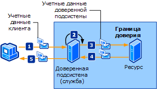

# <a name="trusted-subsystem"></a>Доверенная подсистема
Клиент обращается к одной или нескольким веб-службам, распределенным по сети. Веб-службы устроены так, что доступ к дополнительным ресурсам (таким как базы данных или другие веб-службы) инкапсулируется в бизнес-логике веб-службы. Эти ресурсы должны быть защищены от несанкционированного доступа. На следующем рисунке показан процесс доверенной подсистемы.  
  
   
  
 Показанный на рисунке процесс доверенной подсистемы пошагово описан ниже.  
  
1. Клиент отправляет запрос (вместе с учетными данными) доверенной подсистеме.  
  
2. Доверенная подсистема проверяет подлинность пользователя и авторизует его.  
  
3. Доверенная подсистема отправляет сообщение запроса удаленному ресурсу. Этот запрос сопровождается учетными данными доверенной подсистемы (или учетной записи службы, от имени которой выполняется процесс доверенной подсистемы).  
  
4. Внутренний ресурс проверяет подлинность доверенной подсистемы и авторизует ее. Затем он обрабатывает запрос и отправляет ответ доверенной подсистеме.  
  
5. Доверенная подсистема обрабатывает ответ и отправляет свой ответ клиенту.  
  
|Характеристика|Описание|  
|--------------------|-----------------|  
|Режим безопасности|Message|  
|Взаимодействие|Только Windows Communication Foundation (WCF).|  
|Проверка подлинности (служба)|Служба маркеров безопасности проверяет подлинность клиентов и авторизует их.|  
|Проверка подлинности (клиент)|Доверенная подсистема проверяет подлинность клиента, а ресурс проверяет подлинность службы доверенной подсистемы.|  
|Целостность|Да|  
|Конфиденциальность|Да|  
|Transport|HTTP между клиентом и службой доверенной подсистемы.<br /><br /> NET.TCP между службой доверенной подсистемы и ресурсом (внутренней службой).|  
|Привязка|<xref:System.ServiceModel.WSHttpBinding> и <xref:System.ServiceModel.NetTcpBinding>[\<wsFederationHttpBinding >](../../../../docs/framework/configure-apps/file-schema/wcf/wsfederationhttpbinding.md)|  
  
## <a name="resource-back-end-service"></a>Ресурс (внутренняя служба)  
  
### <a name="code"></a>Код  
 В следующем коде показано, как создать конечную точку службы для ресурса, работающую в режиме безопасности транспорта по транспортному протоколу TCP.  
  
 [!code-csharp[TrustedSubSystemsResource#1](../../../../samples/snippets/csharp/VS_Snippets_CFX/trustedsubsystemsresource/cs/source.cs#1)]
 [!code-vb[TrustedSubSystemsResource#1](../../../../samples/snippets/visualbasic/VS_Snippets_CFX/trustedsubsystemsresource/vb/source.vb#1)]  
  
### <a name="configuration"></a>Конфигурация  
 В следующей конфигурации настраивается та же конечная точка с использованием конфигурации.  
  
```xml  
<?xml version="1.0" encoding="utf-8" ?>  
<configuration>  
  <system.serviceModel>  
    <services>  
      <service name="Microsoft.ServiceModel.Samples.BackendService"  
               behaviorConfiguration="BackendServiceBehavior">  
        <endpoint address="net.tcp://localhost.com:8001/BackendService"  
                  binding="customBinding"  
                  bindingConfiguration="Binding1"  
                  contract="Microsoft.ServiceModel.Samples.ICalculator"/>  
      </service>  
    </services>  
    <bindings>  
      <customBinding>  
        <binding name="Binding1">  
          <security authenticationMode="UserNameOverTransport"/>  
          <windowsStreamSecurity/>  
          <tcpTransport/>  
        </binding>  
      </customBinding>  
    </bindings>  
    <behaviors>  
      <serviceBehaviors>  
        <behavior name="BackendServiceBehavior">  
          <serviceCredentials>  
            <userNameAuthentication userNamePasswordValidationMode="Custom"  
                                    customUserNamePasswordValidatorType="Microsoft.ServiceModel.Samples.MyUserNamePasswordValidator, BackendService"/>  
          </serviceCredentials>  
        </behavior>  
      </serviceBehaviors>  
    </behaviors>  
  </system.serviceModel>  
</configuration>  
```  
  
## <a name="trusted-subsystem"></a>Доверенная подсистема  
  
### <a name="code"></a>Код  
 В следующем коде показано, как создать конечную точку службы для доверенной подсистемы, работающую в режиме безопасности сообщения по транспортному протоколу HTTP и использующую для проверки подлинности имя пользователя и пароль.  
  
 [!code-csharp[TrustedSubSystems#1](../../../../samples/snippets/csharp/VS_Snippets_CFX/trustedsubsystems/cs/source.cs#1)]
 [!code-vb[TrustedSubSystems#1](../../../../samples/snippets/visualbasic/VS_Snippets_CFX/trustedsubsystems/vb/source.vb#1)]  
  
 В следующем коде показана служба в доверенной подсистеме, которая обменивается данными с внутренней службой в режиме безопасности транспорта по транспортному протоколу TCP.  
  
 [!code-csharp[TrustedSubSystems#2](../../../../samples/snippets/csharp/VS_Snippets_CFX/trustedsubsystems/cs/source.cs#2)]
 [!code-vb[TrustedSubSystems#2](../../../../samples/snippets/visualbasic/VS_Snippets_CFX/trustedsubsystems/vb/source.vb#2)]  
  
### <a name="configuration"></a>Конфигурация  
 В следующей конфигурации настраивается та же конечная точка с использованием конфигурации. Обратите внимание на две привязки: одна защищает службу, размещенную в доверенной подсистеме, а вторая обеспечивает обмен данными между доверенной подсистемой и внутренней службой.  
  
```xml  
<?xml version="1.0" encoding="utf-8" ?>  
<configuration>  
  <system.serviceModel>  
    <services>  
      <service name="Microsoft.ServiceModel.Samples.FacadeService"  
               behaviorConfiguration="FacadeServiceBehavior">  
        <host>  
          <baseAddresses>  
            <add baseAddress="http://localhost:8000/FacadeService"/>  
          </baseAddresses>  
        </host>  
        <endpoint address="http://localhost:8000/FacadeService"  
                  binding="wsHttpBinding"  
                  bindingConfiguration="Binding1"  
                  contract="Microsoft.ServiceModel.Samples.ICalculator"/>  
      </service>  
    </services>  
    <client>  
      <endpoint name=""   
                address="net.tcp://contoso.com:8001/BackendService"  
                binding="customBinding"  
                bindingConfiguration="ClientBinding"  
                contract="Microsoft.ServiceModel.Samples.ICalculator"/>  
    </client>  
    <bindings>  
      <wsHttpBinding>  
        <binding name="Binding1">  
          <security mode="Message">  
            <message clientCredentialType="UserName"/>  
          </security>  
        </binding>  
      </wsHttpBinding>  
      <customBinding>  
        <binding name="ClientBinding">  
          <security authenticationMode="UserNameOverTransport"/>  
          <windowsStreamSecurity/>  
          <tcpTransport/>  
        </binding>  
      </customBinding>  
    </bindings>  
    <behaviors>  
      <serviceBehaviors>  
        <behavior name="FacadeServiceBehavior">  
          <serviceMetadata httpGetEnabled="True"/>  
          <serviceCredentials>  
            <serviceCertificate findValue="Contoso.com"  
                                storeLocation="LocalMachine"  
                                storeName="My"  
                                x509FindType="FindBySubjectName" />  
            <userNameAuthentication userNamePasswordValidationMode="Custom"  
                                    customUserNamePasswordValidatorType="Microsoft.ServiceModel.Samples.MyUserNamePasswordValidator, FacadeService"/>  
          </serviceCredentials>  
        </behavior>  
      </serviceBehaviors>  
    </behaviors>  
  </system.serviceModel>  
</configuration>  
```  
  
## <a name="client"></a>Клиент  
  
### <a name="code"></a>Код  
 В следующем коде показано, как создать клиент, обменивающийся данными с доверенной подсистемой в режиме безопасности сообщения по протоколу HTTP и использующий для проверки подлинности имя пользователя и пароль.  
  
 [!code-csharp[TrustedSubSystemsClient#1](../../../../samples/snippets/csharp/VS_Snippets_CFX/trustedsubsystemsclient/cs/source.cs#1)]
 [!code-vb[TrustedSubSystemsClient#1](../../../../samples/snippets/visualbasic/VS_Snippets_CFX/trustedsubsystemsclient/vb/source.vb#1)]  
  
### <a name="configuration"></a>Конфигурация  
 Следующий код служит для настройки клиента для использования режима безопасности сообщений по протоколу HTTP, а также имени пользователя и пароля для проверки подлинности. Указать имя пользователя и пароль можно только с помощью кода (они не подлежат настройке).  
  
```xml  
<?xml version="1.0" encoding="utf-8" ?>  
<configuration>  
  <system.serviceModel>  
    <client>  
        <endpoint name=""   
                  address="http://www.cohowinery.com:8000/FacadeService"  
                  binding="wsHttpBinding"  
                  bindingConfiguration="Binding1"  
                  behaviorConfiguration="ClientUserNameBehavior"  
                  contract="Microsoft.ServiceModel.Samples.ICalculator"/>  
    </client>  
    <bindings>  
      <wsHttpBinding>  
        <binding name="Binding1">  
          <security mode="Message">  
            <message clientCredentialType="UserName"/>  
          </security>  
        </binding>  
      </wsHttpBinding>  
    </bindings>  
    <behaviors>  
      <endpointBehaviors>  
        <behavior name="ClientUserNameBehavior">  
          <clientCredentials>  
            <serviceCertificate>  
              <authentication certificateValidationMode="PeerOrChainTrust"/>  
            </serviceCertificate>  
          </clientCredentials>  
        </behavior>  
      </endpointBehaviors>  
    </behaviors>  
  </system.serviceModel>  
</configuration>  
```  
  
## <a name="see-also"></a>См. также:

- [Общие сведения о безопасности](../../../../docs/framework/wcf/feature-details/security-overview.md)
- [Модель безопасности для Windows Server App Fabric](https://docs.microsoft.com/previous-versions/appfabric/ee677202(v=azure.10))
