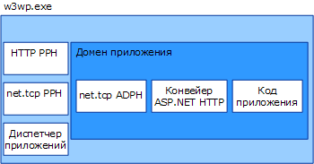

# <a name="was-activation-architecture"></a><span data-ttu-id="a25ef-102">Архитектура активации WAS</span><span class="sxs-lookup"><span data-stu-id="a25ef-102">WAS Activation Architecture</span></span>
<span data-ttu-id="a25ef-103">В настоящем разделе перечисляются и обсуждаются компоненты службы активации процесса Windows (также известной как WAS).</span><span class="sxs-lookup"><span data-stu-id="a25ef-103">This topic itemizes and discusses the components of the Windows Process Activation Service (also known as WAS).</span></span>  
  
## <a name="activation-components"></a><span data-ttu-id="a25ef-104">Компоненты активации</span><span class="sxs-lookup"><span data-stu-id="a25ef-104">Activation Components</span></span>  
 <span data-ttu-id="a25ef-105">Служба WAS состоит из нескольких архитектурных компонентов.</span><span class="sxs-lookup"><span data-stu-id="a25ef-105">WAS consists of several architectural components:</span></span>  
  
-   <span data-ttu-id="a25ef-106">Адаптеры прослушивателя.</span><span class="sxs-lookup"><span data-stu-id="a25ef-106">Listener adapters.</span></span> <span data-ttu-id="a25ef-107">Службы Windows, получающие сообщения по определенным сетевым протоколам и взаимодействующие со службой WAS для маршрутизации входящих сообщений к правильным рабочим процессам.</span><span class="sxs-lookup"><span data-stu-id="a25ef-107">Windows services that receive messages on specific network protocols and communicate with WAS to route incoming messages to the correct worker process.</span></span>  
  
-   <span data-ttu-id="a25ef-108">WAS.</span><span class="sxs-lookup"><span data-stu-id="a25ef-108">WAS.</span></span> <span data-ttu-id="a25ef-109">Служба Windows, управляющая созданием и временем существования рабочих процессов.</span><span class="sxs-lookup"><span data-stu-id="a25ef-109">The Windows service that manages the creation and lifetime of worker processes.</span></span>  
  
-   <span data-ttu-id="a25ef-110">Универсальный исполняемый файл рабочего процесса (w3wp.exe).</span><span class="sxs-lookup"><span data-stu-id="a25ef-110">The generic worker process executable (w3wp.exe).</span></span>  
  
-   <span data-ttu-id="a25ef-111">Диспетчер приложений.</span><span class="sxs-lookup"><span data-stu-id="a25ef-111">Application manager.</span></span> <span data-ttu-id="a25ef-112">Управляет созданием и временем существования доменов приложений, в которых размещаются приложения внутри рабочих процессов.</span><span class="sxs-lookup"><span data-stu-id="a25ef-112">Manages the creation and lifetime of application domains that host applications within the worker process.</span></span>  
  
-   <span data-ttu-id="a25ef-113">Обработчики протоколов.</span><span class="sxs-lookup"><span data-stu-id="a25ef-113">Protocol handlers.</span></span> <span data-ttu-id="a25ef-114">Специфичные для протоколов компоненты, которые запускаются в рабочем процессе и управляют взаимодействием между рабочим процессом и отдельными адаптерами прослушивателя.</span><span class="sxs-lookup"><span data-stu-id="a25ef-114">Protocol-specific components that run in the worker process and manage communication between the worker process and the individual listener adapters.</span></span> <span data-ttu-id="a25ef-115">Существуют обработчики протоколов двух типов: обработчики протоколов процесса и обработчики протоколов домена приложения.</span><span class="sxs-lookup"><span data-stu-id="a25ef-115">Two types of protocol handlers exist: process protocol handlers and AppDomain protocol handlers.</span></span>  
  
 <span data-ttu-id="a25ef-116">Когда служба WAS активирует экземпляр рабочего процесса, она загружает требуемые обработчики протоколов процесса в рабочей процесс и использует диспетчер приложения для создания домена приложения, в котором будет размещено это приложение.</span><span class="sxs-lookup"><span data-stu-id="a25ef-116">When WAS activates a worker process instance, it loads the process protocol handlers required into the worker process and uses the application manager to create an application domain to host the application.</span></span> <span data-ttu-id="a25ef-117">Домен приложения загружает код приложения, а также обработчики протоколов домена приложения, которые требуются для используемых приложением сетевых протоколов.</span><span class="sxs-lookup"><span data-stu-id="a25ef-117">The application domain loads the application’s code as well as the AppDomain protocol handlers that the network protocols used by the application require.</span></span>  
  
 <span data-ttu-id="a25ef-118"></span><span class="sxs-lookup"><span data-stu-id="a25ef-118"></span></span>  
  
### <a name="listener-adapters"></a><span data-ttu-id="a25ef-119">Адаптеры прослушивателя</span><span class="sxs-lookup"><span data-stu-id="a25ef-119">Listener Adapters</span></span>  
 <span data-ttu-id="a25ef-120">Адаптеры прослушивателя - это отдельные службы Windows, реализующие логику сетевого взаимодействия, используемую для приема сообщений по сетевому протоколу, по которому они ожидают передачи данных.</span><span class="sxs-lookup"><span data-stu-id="a25ef-120">Listener adapters are individual Windows services that implement the network communication logic used to receive messages using the network protocol on which they listen.</span></span> <span data-ttu-id="a25ef-121">В следующей таблице перечислены адаптеры прослушивателя для протоколов [!INCLUDE[indigo1](../../../../includes/indigo1-md.md)].</span><span class="sxs-lookup"><span data-stu-id="a25ef-121">The following table lists the listener adapters for [!INCLUDE[indigo1](../../../../includes/indigo1-md.md)] protocols.</span></span>  
  
|<span data-ttu-id="a25ef-122">Имя службы адаптера прослушивателя</span><span class="sxs-lookup"><span data-stu-id="a25ef-122">Listener adapter service name</span></span>|<span data-ttu-id="a25ef-123">Протокол</span><span class="sxs-lookup"><span data-stu-id="a25ef-123">Protocol</span></span>|<span data-ttu-id="a25ef-124">Примечания</span><span class="sxs-lookup"><span data-stu-id="a25ef-124">Notes</span></span>|  
|-----------------------------------|--------------|-----------|  
|<span data-ttu-id="a25ef-125">W3SVC</span><span class="sxs-lookup"><span data-stu-id="a25ef-125">W3SVC</span></span>|<span data-ttu-id="a25ef-126">http</span><span class="sxs-lookup"><span data-stu-id="a25ef-126">http</span></span>|<span data-ttu-id="a25ef-127">Общий компонент, обеспечивающий активацию HTTP для IIS 7.0 и [!INCLUDE[indigo2](../../../../includes/indigo2-md.md)].</span><span class="sxs-lookup"><span data-stu-id="a25ef-127">Common component that provides HTTP activation for both IIS 7.0 and [!INCLUDE[indigo2](../../../../includes/indigo2-md.md)].</span></span>|  
|<span data-ttu-id="a25ef-128">NetTcpActivator</span><span class="sxs-lookup"><span data-stu-id="a25ef-128">NetTcpActivator</span></span>|<span data-ttu-id="a25ef-129">net.tcp</span><span class="sxs-lookup"><span data-stu-id="a25ef-129">net.tcp</span></span>|<span data-ttu-id="a25ef-130">Зависит от службы NetTcpPortSharing.</span><span class="sxs-lookup"><span data-stu-id="a25ef-130">Depends on the NetTcpPortSharing service.</span></span>|  
|<span data-ttu-id="a25ef-131">NetPipeActivator</span><span class="sxs-lookup"><span data-stu-id="a25ef-131">NetPipeActivator</span></span>|<span data-ttu-id="a25ef-132">net.pipe</span><span class="sxs-lookup"><span data-stu-id="a25ef-132">net.pipe</span></span>||  
|<span data-ttu-id="a25ef-133">NetMsmqActivator</span><span class="sxs-lookup"><span data-stu-id="a25ef-133">NetMsmqActivator</span></span>|<span data-ttu-id="a25ef-134">net.msmq</span><span class="sxs-lookup"><span data-stu-id="a25ef-134">net.msmq</span></span>|<span data-ttu-id="a25ef-135">Для использования с приложениями очереди сообщений, основанными на [!INCLUDE[indigo2](../../../../includes/indigo2-md.md)].</span><span class="sxs-lookup"><span data-stu-id="a25ef-135">For use with [!INCLUDE[indigo2](../../../../includes/indigo2-md.md)]-based Message Queuing applications.</span></span>|  
|<span data-ttu-id="a25ef-136">NetMsmqActivator</span><span class="sxs-lookup"><span data-stu-id="a25ef-136">NetMsmqActivator</span></span>|<span data-ttu-id="a25ef-137">msmq.formatname</span><span class="sxs-lookup"><span data-stu-id="a25ef-137">msmq.formatname</span></span>|<span data-ttu-id="a25ef-138">Обеспечивает обратную совместимость с существующими приложениями очереди сообщений.</span><span class="sxs-lookup"><span data-stu-id="a25ef-138">Provides backwards compatibility with existing Message Queuing applications.</span></span>|  
  
 <span data-ttu-id="a25ef-139">Адаптеры прослушивателя для отдельных протоколов регистрируются во время установки в файле applicationHost.config, как показано в следующем примере XML.</span><span class="sxs-lookup"><span data-stu-id="a25ef-139">Listener adapters for specific protocols are registered during installation in the applicationHost.config file, as shown in the following XML example.</span></span>  
  
```xml  
<system.applicationHost>  
    <listenerAdapters>  
        <add name="http" />  
        <add name="net.tcp"   
          identity="S-1-5-80-3579033775-2824656752-1522793541-1960352512-462907086" />  
         <add name="net.pipe"   
           identity="S-1-5-80-2943419899-937267781-4189664001-1229628381-3982115073" />  
          <add name="net.msmq"   
            identity="S-1-5-80-89244771-1762554971-1007993102-348796144-2203111529" />  
           <add name="msmq.formatname"   
             identity="S-1-5-80-89244771-1762554971-1007993102-348796144-2203111529" />  
    </listenerAdapters>  
</system.applicationHost>  
```  
  
### <a name="protocol-handlers"></a><span data-ttu-id="a25ef-140">Обработчики протоколов</span><span class="sxs-lookup"><span data-stu-id="a25ef-140">Protocol Handlers</span></span>  
 <span data-ttu-id="a25ef-141">Обработчики протоколов процесса и домена приложения для конкретных протоколов регистрируются в файле Web.config на уровне компьютера.</span><span class="sxs-lookup"><span data-stu-id="a25ef-141">Process and AppDomain protocol handlers for specific protocols are registered in the machine-level Web.config file.</span></span>  
  
```xml  
<system.web>  
   <protocols>  
      <add name="net.tcp"   
        processHandlerType=  
         "System.ServiceModel.WasHosting.TcpProcessProtocolHandler"  
        appDomainHandlerType=  
         "System.ServiceModel.WasHosting.TcpAppDomainProtocolHandler"  
        validate="false" />  
      <add name="net.pipe"   
        processHandlerType=  
         "System.ServiceModel.WasHosting.NamedPipeProcessProtocolHandler"  
          appDomainHandlerType=  
           "System.ServiceModel.WasHosting.NamedPipeAppDomainProtocolHandler"/>  
      <add name="net.msmq"  
        processHandlerType=  
         "System.ServiceModel.WasHosting.MsmqProcessProtocolHandler"  
        appDomainHandlerType=  
         "System.ServiceModel.WasHosting.MsmqAppDomainProtocolHandler"  
        validate="false" />  
   </protocols>  
</system.web>  
```  
  
## <a name="see-also"></a><span data-ttu-id="a25ef-142">См. также</span><span class="sxs-lookup"><span data-stu-id="a25ef-142">See Also</span></span>  
 [<span data-ttu-id="a25ef-143">Настройка WAS для использования с WCF</span><span class="sxs-lookup"><span data-stu-id="a25ef-143">Configuring WAS for Use with WCF</span></span>](../../../../docs/framework/wcf/feature-details/configuring-the-wpa--service-for-use-with-wcf.md)  
 [<span data-ttu-id="a25ef-144">Функции размещения Windows Server App Fabric</span><span class="sxs-lookup"><span data-stu-id="a25ef-144">Windows Server App Fabric Hosting Features</span></span>](http://go.microsoft.com/fwlink/?LinkId=201276)
