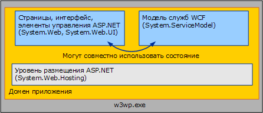

# <a name="wcf-services-and-aspnet"></a><span data-ttu-id="aa288-102">Службы WCF и ASP.NET</span><span class="sxs-lookup"><span data-stu-id="aa288-102">WCF Services and ASP.NET</span></span>
<span data-ttu-id="aa288-103">В данном разделе описано параллельное размещение служб [!INCLUDE[indigo1](../../../../includes/indigo1-md.md)] и ASP.NET и их размещение в режиме совместимости ASP.NET.</span><span class="sxs-lookup"><span data-stu-id="aa288-103">This topic discusses hosting [!INCLUDE[indigo1](../../../../includes/indigo1-md.md)] services side-by-side with ASP.NET and hosting them in ASP.NET compatibility mode.</span></span>  
  
## <a name="hosting-wcf-side-by-side-with-aspnet"></a><span data-ttu-id="aa288-104">Параллельное размещение WCF и ASP.NET</span><span class="sxs-lookup"><span data-stu-id="aa288-104">Hosting WCF Side-by-Side with ASP.NET</span></span>  
 <span data-ttu-id="aa288-105">Службы [!INCLUDE[indigo2](../../../../includes/indigo2-md.md)], размещенные в службах IIS, могут располагаться на страницах .ASPX и в веб-службах ASMX внутри одного общего домена приложения.</span><span class="sxs-lookup"><span data-stu-id="aa288-105">[!INCLUDE[indigo2](../../../../includes/indigo2-md.md)] services hosted in Internet Information Services (IIS) can be located with .ASPX pages and ASMX Web services inside of a single, common Application Domain.</span></span> <span data-ttu-id="aa288-106">Платформа ASP.NET предоставляет общие службы инфраструктуры, такие как управление доменом приложения и динамическая компиляция как в [!INCLUDE[indigo2](../../../../includes/indigo2-md.md)], так и в среде выполнения HTTP ASP.NET.</span><span class="sxs-lookup"><span data-stu-id="aa288-106">ASP.NET provides common infrastructure services such as AppDomain management and dynamic compilation for both [!INCLUDE[indigo2](../../../../includes/indigo2-md.md)] and the ASP.NET HTTP runtime.</span></span> <span data-ttu-id="aa288-107">Конфигурацией по умолчанию для [!INCLUDE[indigo2](../../../../includes/indigo2-md.md)] является параллельное размещение с ASP.NET.</span><span class="sxs-lookup"><span data-stu-id="aa288-107">The default configuration for [!INCLUDE[indigo2](../../../../includes/indigo2-md.md)] is side-by-side with ASP.NET.</span></span>  
  
 <span data-ttu-id="aa288-108"></span><span class="sxs-lookup"><span data-stu-id="aa288-108"></span></span>  
  
 <span data-ttu-id="aa288-109">Среда выполнения HTTP ASP.NET обрабатывает запросы ASP.NET, но не участвует в обработке запросов, предназначенных для служб [!INCLUDE[indigo2](../../../../includes/indigo2-md.md)], несмотря на то что эти службы размещены в том же домене приложения, что и содержимое ASP.NET.</span><span class="sxs-lookup"><span data-stu-id="aa288-109">The ASP.NET HTTP runtime handles ASP.NET requests but does not participate in the processing of requests destined for [!INCLUDE[indigo2](../../../../includes/indigo2-md.md)] services, even though these services are hosted in the same AppDomain as is the ASP.NET content.</span></span> <span data-ttu-id="aa288-110">Вместо этого модель службы [!INCLUDE[indigo2](../../../../includes/indigo2-md.md)] перехватывает сообщения, адресованные службам [!INCLUDE[indigo2](../../../../includes/indigo2-md.md)], и направляет их через стек каналов или транспортный стек [!INCLUDE[indigo2](../../../../includes/indigo2-md.md)].</span><span class="sxs-lookup"><span data-stu-id="aa288-110">Instead, the [!INCLUDE[indigo2](../../../../includes/indigo2-md.md)] Service Model intercepts messages addressed to [!INCLUDE[indigo2](../../../../includes/indigo2-md.md)] services and routes them through the [!INCLUDE[indigo2](../../../../includes/indigo2-md.md)] transport/channel stack.</span></span>  
  
 <span data-ttu-id="aa288-111">Результаты использования параллельной модели представлены ниже.</span><span class="sxs-lookup"><span data-stu-id="aa288-111">The results of the side-by-side model are as follows:</span></span>  
  
-   <span data-ttu-id="aa288-112">ASP.NET и службы [!INCLUDE[indigo2](../../../../includes/indigo2-md.md)] могут совместно использовать состояние домена приложения.</span><span class="sxs-lookup"><span data-stu-id="aa288-112">ASP.NET and [!INCLUDE[indigo2](../../../../includes/indigo2-md.md)] services can share AppDomain state.</span></span> <span data-ttu-id="aa288-113">Поскольку две платформы могут совместно существовать в одном домене приложения, [!INCLUDE[indigo2](../../../../includes/indigo2-md.md)] также может использовать состояние домена приложения совместно с платформой ASP.NET (включая статические переменные, события и т. д.)</span><span class="sxs-lookup"><span data-stu-id="aa288-113">Because the two frameworks can coexist in the same AppDomain, [!INCLUDE[indigo2](../../../../includes/indigo2-md.md)] can also share AppDomain state with ASP.NET (including static variables, events, and so on).</span></span>  
  
-   <span data-ttu-id="aa288-114">Службы [!INCLUDE[indigo2](../../../../includes/indigo2-md.md)] работают согласованно, независимо от среды размещения и транспорта.</span><span class="sxs-lookup"><span data-stu-id="aa288-114">[!INCLUDE[indigo2](../../../../includes/indigo2-md.md)] services behave consistently, independent of hosting environment and transport.</span></span> <span data-ttu-id="aa288-115">Среда выполнения HTTP ASP.NET преднамеренно связана со средой размещения IIS/ASP.NET и обменом данных по протоколу HTTP.</span><span class="sxs-lookup"><span data-stu-id="aa288-115">The ASP.NET HTTP runtime is intentionally coupled to the IIS/ASP.NET hosting environment and HTTP communication.</span></span> <span data-ttu-id="aa288-116">И наоборот, [!INCLUDE[indigo2](../../../../includes/indigo2-md.md)] создана для согласованной работы в разных средах размещения ([!INCLUDE[indigo2](../../../../includes/indigo2-md.md)] работает согласованно как в пределах, так и за пределами IIS) и с использованием разных транспортов (служба, размещенная в IIS 7.0 и более поздних версий, работает согласованно во всех предоставляемых конечных точках, даже если некоторые из этих конечных точек используют протоколы, отличные от HTTP).</span><span class="sxs-lookup"><span data-stu-id="aa288-116">Conversely, [!INCLUDE[indigo2](../../../../includes/indigo2-md.md)] is designed to behave consistently across hosting environments ([!INCLUDE[indigo2](../../../../includes/indigo2-md.md)] behaves consistently both inside and outside of IIS) and across transport (a service hosted in IIS 7.0 and later has consistent behavior across all endpoints it exposes, even if some of those endpoints use protocols other than HTTP).</span></span>  
  
-   <span data-ttu-id="aa288-117">В пределах домена приложения функции, реализуемые средой выполнения HTTP, применяются к содержимому ASP.NET, но не к [!INCLUDE[indigo2](../../../../includes/indigo2-md.md)].</span><span class="sxs-lookup"><span data-stu-id="aa288-117">Within an AppDomain, features implemented by the HTTP runtime apply to ASP.NET content but not to [!INCLUDE[indigo2](../../../../includes/indigo2-md.md)].</span></span> <span data-ttu-id="aa288-118">Многие функции платформы приложений ASP.NET, характерные для HTTP, не применяются к службам [!INCLUDE[indigo2](../../../../includes/indigo2-md.md)], размещенным в пределах домена приложения с содержимым ASP.NET.</span><span class="sxs-lookup"><span data-stu-id="aa288-118">Many HTTP-specific features of the ASP.NET application platform do not apply to [!INCLUDE[indigo2](../../../../includes/indigo2-md.md)] Services hosted inside of an AppDomain that contains ASP.NET content.</span></span> <span data-ttu-id="aa288-119">В примеры этих функций входит следующее.</span><span class="sxs-lookup"><span data-stu-id="aa288-119">Examples of these features include the following:</span></span>  
  
    -   <span data-ttu-id="aa288-120">HttpContext. Свойство <xref:System.Web.HttpContext.Current%2A> всегда имеет значение `null`, если доступ осуществляется из службы [!INCLUDE[indigo2](../../../../includes/indigo2-md.md)].</span><span class="sxs-lookup"><span data-stu-id="aa288-120">HttpContext: <xref:System.Web.HttpContext.Current%2A> is always `null` when accessed from within a [!INCLUDE[indigo2](../../../../includes/indigo2-md.md)] service.</span></span> <span data-ttu-id="aa288-121">Используйте <!--zz <xref:System.ServiceModel.OperationContext.Current.RequestContext>--> `RequestContext` вместо него.</span><span class="sxs-lookup"><span data-stu-id="aa288-121">Use <!--zz <xref:System.ServiceModel.OperationContext.Current.RequestContext>--> `RequestContext` instead.</span></span>  
  
    -   <span data-ttu-id="aa288-122">Авторизация на основе файла. Модель безопасности [!INCLUDE[indigo2](../../../../includes/indigo2-md.md)] не допускает применения списка управления доступом (ACL) к SVC-файлу службы при решении того, авторизирован ли запрос службы.</span><span class="sxs-lookup"><span data-stu-id="aa288-122">File-based authorization: The [!INCLUDE[indigo2](../../../../includes/indigo2-md.md)] security model does not allow for the access control list (ACL) applied to the .svc file of the service when deciding if a service request is authorized.</span></span>  
  
    -   <span data-ttu-id="aa288-123">Авторизация на основе конфигурации URL-адреса: Аналогичным образом [!INCLUDE[indigo2](../../../../includes/indigo2-md.md)] модель безопасности не соответствует правилам авторизации на основе URL-адрес, указанный в System.Web \<авторизации > элемента конфигурации.</span><span class="sxs-lookup"><span data-stu-id="aa288-123">Configuration-based URL Authorization: Similarly, the [!INCLUDE[indigo2](../../../../includes/indigo2-md.md)] security model does not adhere to any URL-based authorization rules specified in System.Web’s \<authorization> configuration element.</span></span> <span data-ttu-id="aa288-124">Эти параметры игнорируются для запросов [!INCLUDE[indigo2](../../../../includes/indigo2-md.md)], если служба находится в пространстве URL-адреса, защищенного правилами авторизации URL-адреса платформы ASP.NET.</span><span class="sxs-lookup"><span data-stu-id="aa288-124">These settings are ignored for [!INCLUDE[indigo2](../../../../includes/indigo2-md.md)] requests if a service resides in a URL space secured by ASP.NET’s URL authorization rules.</span></span>  
  
    -   <span data-ttu-id="aa288-125">Расширяемость HttpModule. Инфраструктура размещения [!INCLUDE[indigo2](../../../../includes/indigo2-md.md)] перехватывает запросы [!INCLUDE[indigo2](../../../../includes/indigo2-md.md)], когда возникает событие <xref:System.Web.HttpApplication.PostAuthenticateRequest>, и не возвращает обработку в конвейер HTTP ASP.NET.</span><span class="sxs-lookup"><span data-stu-id="aa288-125">HttpModule extensibility: The [!INCLUDE[indigo2](../../../../includes/indigo2-md.md)] hosting infrastructure intercepts [!INCLUDE[indigo2](../../../../includes/indigo2-md.md)] requests when the <xref:System.Web.HttpApplication.PostAuthenticateRequest> event is raised and does not return processing to the ASP.NET HTTP pipeline.</span></span> <span data-ttu-id="aa288-126">Модули, закодированные на перехват запросов на более поздних стадиях конвейера, не перехватывают запросы [!INCLUDE[indigo2](../../../../includes/indigo2-md.md)].</span><span class="sxs-lookup"><span data-stu-id="aa288-126">Modules that are coded to intercept requests at later stages of the pipeline do not intercept [!INCLUDE[indigo2](../../../../includes/indigo2-md.md)] requests.</span></span>  
  
    -   <span data-ttu-id="aa288-127">Олицетворение ASP.NET: по умолчанию [!INCLUDE[indigo2](../../../../includes/indigo2-md.md)] запрашивает всегда выполняется как идентификация процесса IIS, даже если ASP.NET устанавливается для включения олицетворения с помощью System.Web \<identity impersonate = «true» / > параметра конфигурации.</span><span class="sxs-lookup"><span data-stu-id="aa288-127">ASP.NET impersonation: By default, [!INCLUDE[indigo2](../../../../includes/indigo2-md.md)] requests always runs as the IIS process identity, even if ASP.NET is set to enable impersonation using System.Web’s \<identity impersonate="true" /> configuration option.</span></span>  
  
 <span data-ttu-id="aa288-128">Эти ограничения применяются только к службам [!INCLUDE[indigo2](../../../../includes/indigo2-md.md)], размещенным в приложении IIS.</span><span class="sxs-lookup"><span data-stu-id="aa288-128">These restrictions apply only to [!INCLUDE[indigo2](../../../../includes/indigo2-md.md)] services hosted in IIS application.</span></span> <span data-ttu-id="aa288-129">На поведение содержимого ASP.NET не влияет наличие [!INCLUDE[indigo2](../../../../includes/indigo2-md.md)].</span><span class="sxs-lookup"><span data-stu-id="aa288-129">The behavior of ASP.NET content is not affected by the presence of [!INCLUDE[indigo2](../../../../includes/indigo2-md.md)].</span></span>  
  
 <span data-ttu-id="aa288-130">В приложениях [!INCLUDE[indigo2](../../../../includes/indigo2-md.md)], требующих функциональность, традиционно предоставляемую конвейером HTTP, следует рассмотреть возможность использования эквивалентов [!INCLUDE[indigo2](../../../../includes/indigo2-md.md)], независимых от среды размещения и транспорта.</span><span class="sxs-lookup"><span data-stu-id="aa288-130">[!INCLUDE[indigo2](../../../../includes/indigo2-md.md)] applications that require functionality traditionally provided by the HTTP pipeline should consider using the [!INCLUDE[indigo2](../../../../includes/indigo2-md.md)] equivalents, which are host and transport independent:</span></span>  
  
-   <span data-ttu-id="aa288-131"><xref:System.ServiceModel.OperationContext> вместо <xref:System.Web.HttpContext>.</span><span class="sxs-lookup"><span data-stu-id="aa288-131"><xref:System.ServiceModel.OperationContext> instead of <xref:System.Web.HttpContext>.</span></span>  
  
-   <span data-ttu-id="aa288-132"><xref:System.ServiceModel.Description.ServiceAuthorizationBehavior> вместо авторизации на основе файла или URL-адреса ASP.NET.</span><span class="sxs-lookup"><span data-stu-id="aa288-132"><xref:System.ServiceModel.Description.ServiceAuthorizationBehavior> instead of ASP.NET’s File/URL Authorization.</span></span>  
  
-   <span data-ttu-id="aa288-133"><xref:System.ServiceModel.Dispatcher.IDispatchMessageInspector> или пользовательские многоуровневые каналы вместо HTTP-модулей.</span><span class="sxs-lookup"><span data-stu-id="aa288-133"><xref:System.ServiceModel.Dispatcher.IDispatchMessageInspector> or custom layered channels instead of HTTP modules.</span></span>  
  
-   <span data-ttu-id="aa288-134">Олицетворение для каждой операции с использованием [!INCLUDE[indigo2](../../../../includes/indigo2-md.md)] вместо олицетворения System.Web.</span><span class="sxs-lookup"><span data-stu-id="aa288-134">Impersonation for each operation using [!INCLUDE[indigo2](../../../../includes/indigo2-md.md)] instead of System.Web impersonation.</span></span>  
  
 <span data-ttu-id="aa288-135">Также можно рассмотреть выполнение служб в режиме совместимости ASP.NET [!INCLUDE[indigo2](../../../../includes/indigo2-md.md)].</span><span class="sxs-lookup"><span data-stu-id="aa288-135">Alternatively, you can consider running your services in [!INCLUDE[indigo2](../../../../includes/indigo2-md.md)]’s ASP.NET compatibility mode.</span></span>  
  
## <a name="hosting-wcf-services-in-aspnet-compatibility-mode"></a><span data-ttu-id="aa288-136">Размещение служб WCF в режиме совместимости ASP.NET</span><span class="sxs-lookup"><span data-stu-id="aa288-136">Hosting WCF Services in ASP.NET Compatibility Mode</span></span>  
 <span data-ttu-id="aa288-137">Несмотря на то что модель [!INCLUDE[indigo2](../../../../includes/indigo2-md.md)] создана для согласованной работы в разных средах размещения и с использованием разных транспортов, часто применяются сценарии, в которых приложению не требуется такая степень гибкости.</span><span class="sxs-lookup"><span data-stu-id="aa288-137">Although the [!INCLUDE[indigo2](../../../../includes/indigo2-md.md)] model is designed to behave consistently across hosting environments and transports, there are often scenarios where an application does not require this degree of flexibility.</span></span> <span data-ttu-id="aa288-138">Режим совместимости ASP.NET [!INCLUDE[indigo2](../../../../includes/indigo2-md.md)] подходит для сценариев, в которых не требуется возможность размещения за пределами IIS или взаимодействие по протоколам, отличным от HTTP, но в которых используются все функции платформы веб-приложений ASP.NET.</span><span class="sxs-lookup"><span data-stu-id="aa288-138">[!INCLUDE[indigo2](../../../../includes/indigo2-md.md)]’s ASP.NET compatibility mode is suitable for scenarios that do not require the ability to host outside of IIS or to communicate over protocols other than HTTP, but that use all of features of the ASP.NET Web application platform.</span></span>  
  
 <span data-ttu-id="aa288-139">В отличие от параллельной конфигурации по умолчанию, в которой инфраструктура размещения [!INCLUDE[indigo2](../../../../includes/indigo2-md.md)] перехватывает сообщения [!INCLUDE[indigo2](../../../../includes/indigo2-md.md)] и направляет их из конвейера HTTP, службы [!INCLUDE[indigo2](../../../../includes/indigo2-md.md)], выполняемые в режиме совместимости ASP.NET, принимают полное участие в жизненном цикле HTTP-запроса ASP.NET.</span><span class="sxs-lookup"><span data-stu-id="aa288-139">Unlike the default side-by-side configuration, where the [!INCLUDE[indigo2](../../../../includes/indigo2-md.md)] hosting infrastructure intercepts [!INCLUDE[indigo2](../../../../includes/indigo2-md.md)] messages and routes them out of the HTTP pipeline, [!INCLUDE[indigo2](../../../../includes/indigo2-md.md)] services running in ASP.NET Compatibility Mode participate fully in the ASP.NET HTTP request lifecycle.</span></span> <span data-ttu-id="aa288-140">В режиме совместимости службы [!INCLUDE[indigo2](../../../../includes/indigo2-md.md)] используют конвейер HTTP через реализацию <xref:System.Web.IHttpHandler> подобно тому, как выполняется обработка запросов для страниц ASPX и веб-служб ASMX.</span><span class="sxs-lookup"><span data-stu-id="aa288-140">In compatibility mode, [!INCLUDE[indigo2](../../../../includes/indigo2-md.md)] services use the HTTP pipeline through an <xref:System.Web.IHttpHandler> implementation, similar to the way requests for ASPX pages and ASMX Web services are handled.</span></span> <span data-ttu-id="aa288-141">В результате [!INCLUDE[indigo2](../../../../includes/indigo2-md.md)] работает аналогично ASMX в отношении следующих функций ASP.NET.</span><span class="sxs-lookup"><span data-stu-id="aa288-141">As a result, [!INCLUDE[indigo2](../../../../includes/indigo2-md.md)] behaves identically to ASMX with respect to the following ASP.NET features:</span></span>  
  
-   <span data-ttu-id="aa288-142">Службы <xref:System.Web.HttpContext>: [!INCLUDE[indigo2](../../../../includes/indigo2-md.md)], выполняемые в режиме совместимости ASP.NET, могут получать доступ к свойству <xref:System.Web.HttpContext.Current%2A> и связанному с ним состоянию.</span><span class="sxs-lookup"><span data-stu-id="aa288-142"><xref:System.Web.HttpContext>: [!INCLUDE[indigo2](../../../../includes/indigo2-md.md)] services running in ASP.NET Compatibility Mode can access <xref:System.Web.HttpContext.Current%2A> and its associated state.</span></span>  
  
-   <span data-ttu-id="aa288-143">Авторизация на основе файла. Службы [!INCLUDE[indigo2](../../../../includes/indigo2-md.md)], выполняемые в режиме совместимости ASP.NET, можно защитить, прикрепив к файлу .svc службы системный список управления доступом к файлу (ACL).</span><span class="sxs-lookup"><span data-stu-id="aa288-143">File-based authorization: [!INCLUDE[indigo2](../../../../includes/indigo2-md.md)] services running in ASP.NET compatibility mode can be secure by attaching file system access control lists (ACLs) to the service’s .svc file.</span></span>  
  
-   <span data-ttu-id="aa288-144">Настраиваемая авторизация URL-адреса. Правила авторизации URL-адреса ASP.NET применяются к запросам [!INCLUDE[indigo2](../../../../includes/indigo2-md.md)], если служба [!INCLUDE[indigo2](../../../../includes/indigo2-md.md)] выполняется в режиме совместимости ASP.NET.</span><span class="sxs-lookup"><span data-stu-id="aa288-144">Configurable URL authorization: ASP.NET’s URL authorization rules are enforced for [!INCLUDE[indigo2](../../../../includes/indigo2-md.md)] requests when the [!INCLUDE[indigo2](../../../../includes/indigo2-md.md)] service is running in ASP.NET Compatibility Mode.</span></span>  
  
-   <span data-ttu-id="aa288-145">Расширяемость <xref:System.Web.HttpModuleCollection>. Поскольку службы [!INCLUDE[indigo2](../../../../includes/indigo2-md.md)], выполняемые в режиме совместимости ASP.NET, принимают полное участие в жизненном цикле HTTP-запроса ASP.NET, любой HTTP-модуль, настроенный в конвейере HTTP, может выполнять операции с запросами [!INCLUDE[indigo2](../../../../includes/indigo2-md.md)] как перед вызовом службы, так и после него.</span><span class="sxs-lookup"><span data-stu-id="aa288-145"><xref:System.Web.HttpModuleCollection> extensibility: Because [!INCLUDE[indigo2](../../../../includes/indigo2-md.md)] services running in ASP.NET Compatibility Mode participate fully in the ASP.NET HTTP request lifecycle, any HTTP module configured in the HTTP pipeline is able to operate on [!INCLUDE[indigo2](../../../../includes/indigo2-md.md)] requests both before and after service invocation.</span></span>  
  
-   <span data-ttu-id="aa288-146">Олицетворение ASP.NET. Службы [!INCLUDE[indigo2](../../../../includes/indigo2-md.md)] выполняются с использованием текущей идентификации олицетворяемого потока ASP.NET, которая может отличаться от идентификации процесса IIS, если для этого приложения включено олицетворение ASP.NET.</span><span class="sxs-lookup"><span data-stu-id="aa288-146">ASP.NET Impersonation: [!INCLUDE[indigo2](../../../../includes/indigo2-md.md)] services run using the current identity of the ASP.NET impersonated thread, which may be different than the IIS process identity if ASP.NET impersonation has been enabled for the application.</span></span> <span data-ttu-id="aa288-147">Если для определенной операции службы включено и олицетворение ASP.NET, и олицетворение [!INCLUDE[indigo2](../../../../includes/indigo2-md.md)], реализация службы в конечном счете выполняется с использованием идентификации, полученной от [!INCLUDE[indigo2](../../../../includes/indigo2-md.md)].</span><span class="sxs-lookup"><span data-stu-id="aa288-147">If ASP.NET impersonation and [!INCLUDE[indigo2](../../../../includes/indigo2-md.md)] impersonation are both enabled for a particular service operation, the service implementation ultimately runs using the identity obtained from [!INCLUDE[indigo2](../../../../includes/indigo2-md.md)].</span></span>  
  
 <span data-ttu-id="aa288-148">Режим совместимости ASP.NET [!INCLUDE[indigo2](../../../../includes/indigo2-md.md)] включается на уровне приложения с помощью следующей конфигурации (расположенной в файле Web.config приложения.)</span><span class="sxs-lookup"><span data-stu-id="aa288-148">[!INCLUDE[indigo2](../../../../includes/indigo2-md.md)]’s ASP.NET compatibility mode is enabled at the application level through the following configuration (located in the application’s Web.config file):</span></span>  
  
```xml  
<system.serviceModel>  
    <serviceHostingEnvironment aspNetCompatibilityEnabled="true" />  
</system.serviceModel>  
```  
  
 <span data-ttu-id="aa288-149">Это значение по умолчанию для «`true`», если не указан.</span><span class="sxs-lookup"><span data-stu-id="aa288-149">This value defaults to "`true`" if not specified.</span></span> <span data-ttu-id="aa288-150">Установка этого значения равным «`false`» указывает, что все [!INCLUDE[indigo2](../../../../includes/indigo2-md.md)] служб, работающих в приложении не будет выполняться в режиме совместимости с ASP.NET.</span><span class="sxs-lookup"><span data-stu-id="aa288-150">Setting this value to "`false`" indicates that all [!INCLUDE[indigo2](../../../../includes/indigo2-md.md)] services running in the application will not run in ASP.NET Compatibility Mode.</span></span>  
  
 <span data-ttu-id="aa288-151">Поскольку режим совместимости ASP.NET подразумевает семантику обработки запросов, существенно отличающуюся от [!INCLUDE[indigo2](../../../../includes/indigo2-md.md)] по умолчанию, в реализации отдельных служб имеется возможность управления тем, выполняются ли они внутри приложения, для которого включен режим совместимости ASP.NET.</span><span class="sxs-lookup"><span data-stu-id="aa288-151">Because ASP.NET Compatibility Mode implies request processing semantics that are fundamentally different from the [!INCLUDE[indigo2](../../../../includes/indigo2-md.md)] default, individual service implementations have the ability to control whether they run inside of an application for which ASP.NET Compatibility Mode has been enabled.</span></span> <span data-ttu-id="aa288-152">Службы могут использовать атрибут <xref:System.ServiceModel.Activation.AspNetCompatibilityRequirementsAttribute> для указания, поддерживают ли они режим совместимости ASP.NET.</span><span class="sxs-lookup"><span data-stu-id="aa288-152">Services can use the <xref:System.ServiceModel.Activation.AspNetCompatibilityRequirementsAttribute> to indicate whether they support ASP.NET Compatibility Mode.</span></span> <span data-ttu-id="aa288-153">По умолчанию атрибут имеет значение <xref:System.ServiceModel.Activation.AspNetCompatibilityRequirementsMode.Allowed>.</span><span class="sxs-lookup"><span data-stu-id="aa288-153">The default value for this attribute is <xref:System.ServiceModel.Activation.AspNetCompatibilityRequirementsMode.Allowed>.</span></span>  
  
 `[AspNetCompatibilityRequirements(RequirementsMode = AspNetCompatibilityRequirementsMode.Allowed)]`  
  
 `public class CalculatorService : ICalculatorSession`  
  
 `{//Implement calculator service methods.}`  
  
 <span data-ttu-id="aa288-154">В следующей таблице показано взаимодействие параметра режима совместимости на уровне приложения с заданным уровнем поддержки отдельной службы.</span><span class="sxs-lookup"><span data-stu-id="aa288-154">The following table illustrates how the application-wide compatibility mode setting interacts with the individual service’s stated level of support:</span></span>  
  
|<span data-ttu-id="aa288-155">Параметр режима совместимости на уровне приложения</span><span class="sxs-lookup"><span data-stu-id="aa288-155">Application-wide Compatibility Mode setting</span></span>|<span data-ttu-id="aa288-156">[AspNetCompatibilityRequirementsMode]</span><span class="sxs-lookup"><span data-stu-id="aa288-156">[AspNetCompatibilityRequirementsMode]</span></span><br /><br /> <span data-ttu-id="aa288-157">Параметр</span><span class="sxs-lookup"><span data-stu-id="aa288-157">Setting</span></span>|<span data-ttu-id="aa288-158">Полученный результат</span><span class="sxs-lookup"><span data-stu-id="aa288-158">Observed Result</span></span>|  
|--------------------------------------------------|---------------------------------------------------------|---------------------|  
|<span data-ttu-id="aa288-159">aspNetCompatibilityEnabled = "`true`"</span><span class="sxs-lookup"><span data-stu-id="aa288-159">aspNetCompatibilityEnabled = "`true`"</span></span>|<xref:System.ServiceModel.Activation.AspNetCompatibilityRequirementsMode.Required>|<span data-ttu-id="aa288-160">Служба включается успешно.</span><span class="sxs-lookup"><span data-stu-id="aa288-160">Service activates successfully.</span></span>|  
|<span data-ttu-id="aa288-161">aspNetCompatibilityEnabled = "`true`"</span><span class="sxs-lookup"><span data-stu-id="aa288-161">aspNetCompatibilityEnabled = "`true`"</span></span>|<xref:System.ServiceModel.Activation.AspNetCompatibilityRequirementsMode.Allowed>|<span data-ttu-id="aa288-162">Служба включается успешно.</span><span class="sxs-lookup"><span data-stu-id="aa288-162">Service activates successfully.</span></span>|  
|<span data-ttu-id="aa288-163">aspNetCompatibilityEnabled = "`true`"</span><span class="sxs-lookup"><span data-stu-id="aa288-163">aspNetCompatibilityEnabled = "`true`"</span></span>|<xref:System.ServiceModel.Activation.AspNetCompatibilityRequirementsMode.NotAllowed>|<span data-ttu-id="aa288-164">При получении службой сообщения возникает ошибка активации.</span><span class="sxs-lookup"><span data-stu-id="aa288-164">An activation error occurs when the service receives a message.</span></span>|  
|<span data-ttu-id="aa288-165">aspNetCompatibilityEnabled = "`false`"</span><span class="sxs-lookup"><span data-stu-id="aa288-165">aspNetCompatibilityEnabled = "`false`"</span></span>|<xref:System.ServiceModel.Activation.AspNetCompatibilityRequirementsMode.Required>|<span data-ttu-id="aa288-166">При получении службой сообщения возникает ошибка активации.</span><span class="sxs-lookup"><span data-stu-id="aa288-166">An activation error occurs when the service receives a message.</span></span>|  
|<span data-ttu-id="aa288-167">aspNetCompatibilityEnabled = "`false`"</span><span class="sxs-lookup"><span data-stu-id="aa288-167">aspNetCompatibilityEnabled = "`false`"</span></span>|<xref:System.ServiceModel.Activation.AspNetCompatibilityRequirementsMode.Allowed>|<span data-ttu-id="aa288-168">Служба включается успешно.</span><span class="sxs-lookup"><span data-stu-id="aa288-168">Service activates successfully.</span></span>|  
|<span data-ttu-id="aa288-169">aspNetCompatibilityEnabled = "`false`"</span><span class="sxs-lookup"><span data-stu-id="aa288-169">aspNetCompatibilityEnabled = "`false`"</span></span>|<xref:System.ServiceModel.Activation.AspNetCompatibilityRequirementsMode.NotAllowed>|<span data-ttu-id="aa288-170">Служба включается успешно.</span><span class="sxs-lookup"><span data-stu-id="aa288-170">Service activates successfully.</span></span>|  
  
> [!NOTE]
>  <span data-ttu-id="aa288-171">IIS 7.0 и WAS позволяют службам [!INCLUDE[indigo2](../../../../includes/indigo2-md.md)] взаимодействовать по протоколам, отличным от HTTP.</span><span class="sxs-lookup"><span data-stu-id="aa288-171">IIS 7.0 and WAS allows [!INCLUDE[indigo2](../../../../includes/indigo2-md.md)] services to communicate over protocols other than HTTP.</span></span> <span data-ttu-id="aa288-172">Однако службам [!INCLUDE[indigo2](../../../../includes/indigo2-md.md)], выполняемым в приложениях с включенным режимом совместимости ASP.NET, не разрешено предоставлять конечные точки, работающие по протоколу, отличному от HTTP.</span><span class="sxs-lookup"><span data-stu-id="aa288-172">However, [!INCLUDE[indigo2](../../../../includes/indigo2-md.md)] services running in applications that have enabled ASP.NET compatibility mode are not permitted to expose non-HTTP endpoints.</span></span> <span data-ttu-id="aa288-173">В такой конфигурации создается исключение активации, когда служба получает первое сообщение.</span><span class="sxs-lookup"><span data-stu-id="aa288-173">Such a configuration generates an activation exception when the service receives its first message.</span></span>  
  
 <span data-ttu-id="aa288-174">Дополнительные сведения о включении режим совместимости с ASP.NET для [!INCLUDE[indigo2](../../../../includes/indigo2-md.md)] службы, см. <xref:System.ServiceModel.Activation.AspNetCompatibilityRequirementsMode> и [совместимости с ASP.NET](../../../../docs/framework/wcf/samples/aspnet-compatibility.md) образца.</span><span class="sxs-lookup"><span data-stu-id="aa288-174">For more information about enabling ASP.NET compatibility mode for [!INCLUDE[indigo2](../../../../includes/indigo2-md.md)] services, see <xref:System.ServiceModel.Activation.AspNetCompatibilityRequirementsMode> and the [ASP.NET Compatibility](../../../../docs/framework/wcf/samples/aspnet-compatibility.md) sample.</span></span>  
  
## <a name="see-also"></a><span data-ttu-id="aa288-175">См. также</span><span class="sxs-lookup"><span data-stu-id="aa288-175">See Also</span></span>  
 <xref:System.ServiceModel.Activation.AspNetCompatibilityRequirementsAttribute>  
 [<span data-ttu-id="aa288-176">Функции размещения Windows Server App Fabric</span><span class="sxs-lookup"><span data-stu-id="aa288-176">Windows Server App Fabric Hosting Features</span></span>](http://go.microsoft.com/fwlink/?LinkId=201276)
