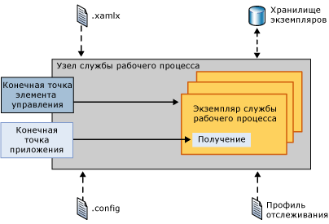
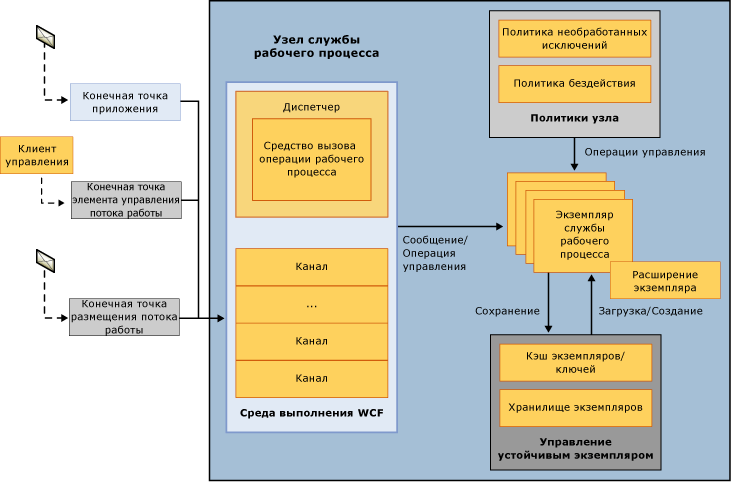
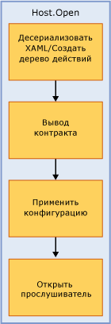
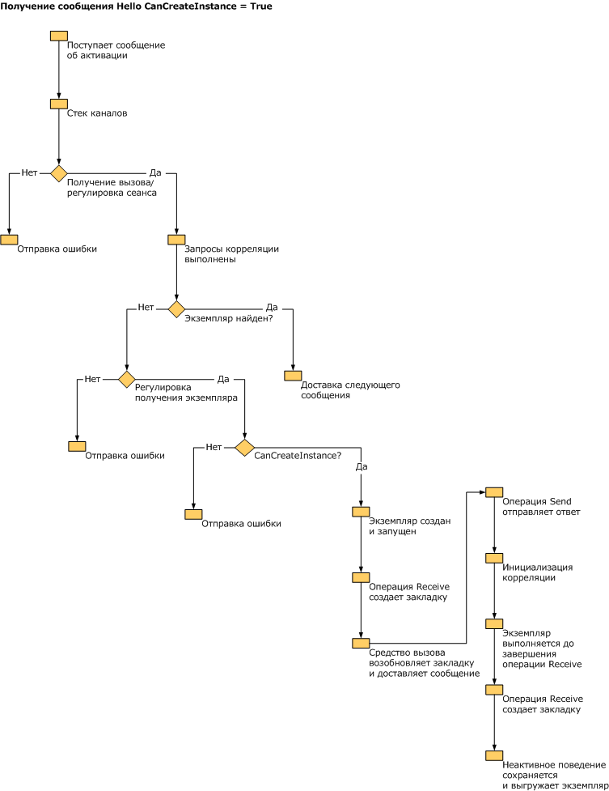

# Внутренние особенности размещения службы рабочего процесса
Объект <xref:System.ServiceModel.WorkflowServiceHost> предоставляет возможность размещения служб рабочего процесса. Он отвечает за прослушивание входящих сообщений и перенаправление их соответствующему экземпляру службы рабочего процесса, управляет выгрузкой и сохранением бездействующих рабочих процессов, а также выполняет другие функции. В этом разделе описано, как объект WorkflowServiceHost обрабатывает входящие сообщения.  
  
## Обзор WorkflowServiceHost  
 Класс <xref:System.ServiceModel.WorkflowServiceHost> используется для размещения служб рабочего процесса. Он прослушивает входящие сообщения и перенаправляет их соответствующему экземпляру службы рабочих процессов, создавая при необходимости новые экземпляры или загружая существующие из долговременного хранилища.  На следующей схеме показаны общие принципы работы класса <xref:System.ServiceModel.WorkflowServiceHost>.  
  
   
  
 Из схемы видно, что объект <xref:System.ServiceModel.WorkflowServiceHost> загружает определения служб рабочих процессов из XAMLX-файлов, а сведения о конфигурации из файла конфигурации. Кроме того, он загружает конфигурацию отслеживания из профиля отслеживания. <xref:System.ServiceModel.WorkflowServiceHost> предоставляет конечную точку управления рабочим процессом, которая позволяет отправлять экземплярам рабочих процессов команды управления.  Дополнительные сведения см. [конечной точки управления рабочего процесса](../../../../docs/framework/wcf/feature-details/workflow-control-endpoint.md) и [образец конечной точки управления рабочего процесса](../../../../docs/framework/windows-workflow-foundation/samples/workflow-management-endpoint-sample.md).  
  
 Объект <xref:System.ServiceModel.WorkflowServiceHost> предоставляет также конечные точки приложений, которые прослушивают входящие сообщения приложений. При поступлении входящего сообщения оно перенаправляется соответствующему экземпляру службы рабочих процессов (если он в данный момент загружен). При необходимости создается новый экземпляр рабочего процесса. Если имеется сохраненный экземпляр, он загружается из хранилища.  
  
## Подробные сведения о классе WorkflowServiceHost  
 На следующей схеме немного более подробно показано, как класс <xref:System.ServiceModel.WorkflowServiceHost> обрабатывает сообщения.  
  
   
  
 На схеме изображены три различные конечные точки: конечная точка приложения, конечная точка управления рабочим процессом и конечная точка размещения рабочего процесса. Конечная точка приложения получает сообщения, связанные с конкретным экземпляром рабочего процесса. Конечная точка управления рабочим процессом прослушивает команды управления. Конечная точка размещения рабочего процесса прослушивает сообщения, при поступлении которых объект <xref:System.ServiceModel.WorkflowServiceHost> загружает и выполняет рабочие процессы, не относящиеся к службе. Как показано на схеме, все сообщения обрабатываются средой выполнения WCF.  Регулирование экземпляра службы рабочих процессов осуществляется с помощью свойства <xref:System.ServiceModel.Description.ServiceThrottlingBehavior.MaxConcurrentInstances%2A>. Это свойство ограничивает количество одновременно функционирующих экземпляров службы рабочих процессов. После превышения этого ограничения все дополнительные запросы на создание новых экземпляров службы рабочего процесса или на активацию постоянных экземпляров службы заносятся в очередь. Поставленные в очередь запросы обрабатываются в последовательном порядке без учета того, являются ли они запросами к новому экземпляру или к работающему, постоянному экземпляру. Загруженные сведения о политике узла определяют, что происходит с необработанными исключениями, а также задают порядок выгрузки и сохранения бездействующих служб Workflow Services. [!INCLUDE[crabout](../../../../includes/crabout-md.md)]см. в этих разделах [как: Настройка поведения рабочего процесса необработанное исключение с помощью WorkflowServiceHost](../../../../docs/framework/wcf/feature-details/config-workflow-unhandled-exception-workflowservicehost.md) и [как: Настройка простоя поведения с помощью WorkflowServiceHost](../../../../docs/framework/wcf/feature-details/how-to-configure-idle-behavior-with-workflowservicehost.md). Экземпляры рабочих процессов сохраняются в соответствии с политиками узла размещения и повторно загружаются при необходимости. Дополнительные сведения о сохраняемости рабочего процесса см.: [как: Настройка сохраняемости с WorkflowServiceHost](../../../../docs/framework/wcf/feature-details/how-to-configure-persistence-with-workflowservicehost.md), [Создание службы рабочего процесса долго выполняющихся](../../../../docs/framework/wcf/feature-details/creating-a-long-running-workflow-service.md), и [сохранение рабочего процесса ](../../../../docs/framework/windows-workflow-foundation/workflow-persistence.md).  
  
 На следующем рисунке показано, что происходит при вызове метода WorkflowServiceHost.Open.  
  
   
  
 Рабочий процесс загружается из XAML, и создается дерево действий. Объект <xref:System.ServiceModel.WorkflowServiceHost> проходит по дереву действий и создает описание службы. К узлу размещения применяются параметры конфигурации. По завершении этих действий узел начинает прослушивать входящие сообщения.  
  
 На следующем рисунке показано, что делает объект <xref:System.ServiceModel.WorkflowServiceHost> при получении сообщения, привязанного к действию Receive, если его свойство CanCreateInstance имеет значение `true`.  
  
   
  
 Сообщение поступает и обрабатывается стеком каналов WCF. Производится проверка ограничений, и выполняются запросы корреляции. Если сообщение привязано к существующему экземпляру, производится его доставка. Если необходимо создать новый экземпляр, производится проверка свойства CanCreateInstance действия Receive. Если оно имеет значение true, создается новый экземпляр, которому и перенаправляется сообщение.  
  
 На следующем рисунке показано, что делает объект <xref:System.ServiceModel.WorkflowServiceHost> при получении сообщения, привязанного к действию Receive, если его свойство CanCreateInstance имеет значение false.  
  
   
  
 Сообщение поступает и обрабатывается стеком каналов WCF. Производится проверка ограничений, и выполняются запросы корреляции. Сообщение привязывается к существующему экземпляру (так как свойство CanCreateInstance имеет значение false), для чего экземпляр загружается из хранилища, возобновляется закладка и выполняется рабочий процесс.  
  
> [!WARNING]
>  Открытие узла размещения служб рабочих процессов завершится с ошибкой, если SQL Server настроен для прослушивания только по протоколу NamedPipe.  
  
## См. также  
 [Службы рабочих процессов](../../../../docs/framework/wcf/feature-details/workflow-services.md)  
 [Размещение служб рабочего процесса](../../../../docs/framework/wcf/feature-details/hosting-workflow-services.md)  
 [Конечная точка управления рабочим процессом](../../../../docs/framework/wcf/feature-details/workflow-control-endpoint.md)  
 [Образец конечной точки управления рабочего процесса](../../../../docs/framework/windows-workflow-foundation/samples/workflow-management-endpoint-sample.md)  
 [Как: Настройка рабочего процесса поведение необработанного исключения с помощью WorkflowServiceHost](../../../../docs/framework/wcf/feature-details/config-workflow-unhandled-exception-workflowservicehost.md)  
 [Создание службы долго выполняющихся рабочих процессов](../../../../docs/framework/wcf/feature-details/creating-a-long-running-workflow-service.md)  
 [Сохраняемость рабочих процессов](../../../../docs/framework/windows-workflow-foundation/workflow-persistence.md)
