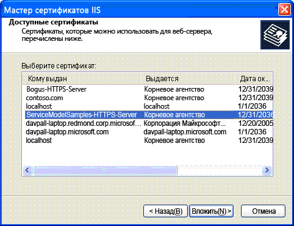

# <a name="internet-information-services-iis-server-certificate-installation-instructions"></a>Инструкции по установке сертификата сервера в службах IIS
Чтобы запускать примеры, которые безопасным образом взаимодействуют со службами IIS, необходимо создать и установить сертификат сервера.  
  
## <a name="step-1-creating-certificates"></a>Шаг 1. Создание сертификатов  
 Чтобы создать сертификат для компьютера, откройте Командная строка разработчика для Visual Studio с правами администратора и запустите Setup. bat, который включен в каждый из примеров, использующих безопасное взаимодействие с IIS. Перед запуском пакетного файла убедитесь, что путь включает папку, содержащую программу Makecert.exe. Следующая команда служит для создания сертификата в файле Setup.bat.  
  
```  
makecert -sr LocalMachine -ss My -n CN=ServiceModelSamples-HTTPS-Server -sky exchange -sk ServiceModelSamples-HTTPS-Key  
```  
  
## <a name="step-2-installing-certificates"></a>Шаг 2. Установка сертификатов  
 Шаги, необходимые для установки созданных сертификатов, зависят от используемой версии IIS.  
  
#### <a name="to-install-iis-on-iis-51-windows-xp-and-iis-60-windows-server-2003"></a>Установка IIS в IIS 5.1 (Windows XP) и IIS 6.0 (Windows Server 2003)  
  
1. Откройте оснастку консоли MMC диспетчера служб IIS.  
  
2. Щелкните правой кнопкой мыши веб-сайт по умолчанию и выберите пункт **Свойства**.  
  
3. Перейдите на вкладку **Безопасность каталога** .  
  
4. Нажмите кнопку **сертификат сервера** . Будет запущен мастер сертификатов веб-сервера.  
  
5. Завершите работу мастера. Выберите назначение сертификата. Из отображаемого списка сертификатов выберите сертификат ServiceModelSamples-HTTPS-Server.  
  
       
  
6. Проверьте доступ к службе в браузере с помощью адреса `https://localhost/servicemodelsamples/service.svc`HTTPS.  
  
#### <a name="if-ssl-was-previously-configured-by-using-httpcfgexe"></a>Если до этого был настроен протокол SSL с помощью Httpcfg.exe  
  
1. С помощью программы Makecert.exe (или запустив файл Setup.bat) создайте сертификат сервера.  
  
2. Запустите диспетчер IIS и установите сертификат в соответствии с описанными выше действиями.  
  
3. Добавьте следующую строку кода в клиентскую программу.  
  
> [!IMPORTANT]
>  Этот код необходим только для тестовых сертификатов, наподобие созданных с помощью Makecert.exe. Для кода производственного назначения это делать не рекомендуется.  
  
```  
PermissiveCertificatePolicy.Enact("CN=ServiceModelSamples-HTTPS-Server");  
```  
  
#### <a name="to-install-iis-on-iis-70-windows-vista-and-windows-server-2008"></a>Установка IIS в IIS 7.0 (Windows Vista и Windows Server 2008)  
  
1. В меню **Пуск** выберите пункт **выполнить**, а затем введите **inetmgr** , чтобы открыть оснастку MMC службы IIS (IIS).  
  
2. Щелкните правой кнопкой мыши **веб-сайт по умолчанию** и выберите **изменить привязки...**  
  
3. Нажмите кнопку " **Добавить** " в диалоговом окне " **привязки сайта** ".  
  
4. В раскрывающемся списке **Тип** выберите **HTTPS** .  
  
5. Выберите **servicemodelsamples-HTTPS-Server** из раскрывающегося списка **SSL-сертификат** и нажмите кнопку **ОК**.  
  
6. Проверьте доступ к службе в браузере с помощью адреса `https://localhost/servicemodelsamples/service.svc`HTTPS.  
  
> [!NOTE]
> Поскольку только что установленный тестовый сертификат не является доверенным сертификатом, при переходе по локальным веб-адресам, защищенным с помощью этого сертификата, могут появиться дополнительные предупреждения системы безопасности Internet Explorer.  
  
## <a name="removing-certificates"></a>Удаление сертификатов  
  
- Выполните с помощью диспетчера служб IIS действия, описанные выше, но вместо добавления сертификата или привязки удалите их.  
  
- Удалите сертификат компьютера с помощью следующей команды.  
  
    ```  
    httpcfg delete ssl -i 0.0.0.0:443  
    ```
