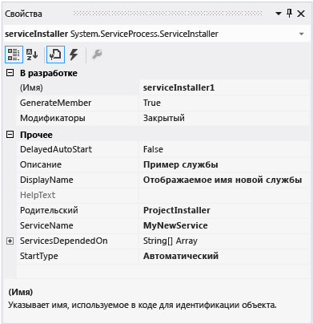
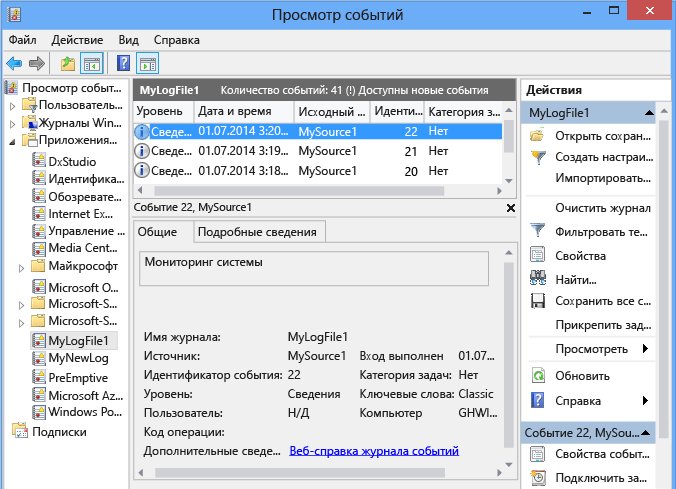

# <a name="walkthrough-creating-a-windows-service-application-in-the-component-designer"></a><span data-ttu-id="334da-102">Пошаговое руководство. Создание приложения служб Windows в конструкторе компонентов</span><span class="sxs-lookup"><span data-stu-id="334da-102">Walkthrough: Creating a Windows Service Application in the Component Designer</span></span>
<span data-ttu-id="334da-103">В этой статье описывается процедура создания простого приложения службы Windows в Visual Studio, которое записывает сообщения в журнал событий.</span><span class="sxs-lookup"><span data-stu-id="334da-103">This article demonstrates how to create a simple Windows Service application in Visual Studio that writes messages to an event log.</span></span> <span data-ttu-id="334da-104">Ниже приведены основные шаги, которые необходимо выполнить для создания и использования службы.</span><span class="sxs-lookup"><span data-stu-id="334da-104">Here are the basic steps that you perform to create and use your service:</span></span>  
  
1.  <span data-ttu-id="334da-105">[Создание службы](#BK_CreateProject) с помощью шаблона проекта **службы Windows** и выполните необходимую настройку.</span><span class="sxs-lookup"><span data-stu-id="334da-105">[Creating a Service](#BK_CreateProject) by using the **Windows Service** project template, and configure it.</span></span> <span data-ttu-id="334da-106">Этот шаблон создает класс, производный от класса <xref:System.ServiceProcess.ServiceBase?displayProperty=nameWithType>, и формирует основную часть кода службы, например код, необходимый для ее запуска.</span><span class="sxs-lookup"><span data-stu-id="334da-106">This template creates a class for you that inherits from <xref:System.ServiceProcess.ServiceBase?displayProperty=nameWithType> and writes much of the basic service code, such as the code to start the service.</span></span>  
  
2.  <span data-ttu-id="334da-107">[Добавление компонентов в службу](#BK_WriteCode) для процедур <xref:System.ServiceProcess.ServiceBase.OnStart%2A> и <xref:System.ServiceProcess.ServiceBase.OnStop%2A> и переопределите все прочие методы по мере необходимости.</span><span class="sxs-lookup"><span data-stu-id="334da-107">[Adding Features to the Service](#BK_WriteCode) for the <xref:System.ServiceProcess.ServiceBase.OnStart%2A> and <xref:System.ServiceProcess.ServiceBase.OnStop%2A> procedures, and override any other methods that you want to redefine.</span></span>  
  
3.  <span data-ttu-id="334da-108">[Установка состояния службы](#BK_SetStatus).</span><span class="sxs-lookup"><span data-stu-id="334da-108">[Setting Service Status](#BK_SetStatus).</span></span> <span data-ttu-id="334da-109">По умолчанию службы, созданные с помощью метода <xref:System.ServiceProcess.ServiceBase?displayProperty=nameWithType>, реализуют только подмножество доступных флагов состояния.</span><span class="sxs-lookup"><span data-stu-id="334da-109">By default, services created with <xref:System.ServiceProcess.ServiceBase?displayProperty=nameWithType> implement only a subset of the available status flags.</span></span> <span data-ttu-id="334da-110">Если операции запуска, приостановки или остановки службы выполняются медленно, то можно реализовать значения состояния, например, "Ожидание запуска" или "Ожидание остановки", которые указывают, что служба выполняет операцию.</span><span class="sxs-lookup"><span data-stu-id="334da-110">If your service takes a long time to start up, pause, or stop, you can implement status values such as Start Pending or Stop Pending to indicate that it's working on an operation.</span></span>  
  
4.  <span data-ttu-id="334da-111">[Добавление установщиков в службу](#BK_AddInstallers) для приложения службы.</span><span class="sxs-lookup"><span data-stu-id="334da-111">[Adding Installers to the Service](#BK_AddInstallers) for your service application.</span></span>  
  
5.  <span data-ttu-id="334da-112">(Необязательно.) [Установка параметров запуска](#BK_StartupParameters), задайте аргументы запуска по умолчанию и разрешите пользователям переопределять параметры по умолчанию, когда они запускают вашу службу вручную.</span><span class="sxs-lookup"><span data-stu-id="334da-112">(Optional) [Set Startup Parameters](#BK_StartupParameters), specify default startup arguments, and enable users to override default settings when they start your service manually.</span></span>  
  
6.  <span data-ttu-id="334da-113">[Создание службы](#BK_Build).</span><span class="sxs-lookup"><span data-stu-id="334da-113">[Building the Service](#BK_Build).</span></span>  
  
7.  <span data-ttu-id="334da-114">[Установка службы](#BK_Install) на локальном компьютере.</span><span class="sxs-lookup"><span data-stu-id="334da-114">[Installing the Service](#BK_Install) on the local machine.</span></span>  
  
8.  <span data-ttu-id="334da-115">Откройте диспетчер управления службами Windows и [Запуск и выполнение службы](#BK_StartService).</span><span class="sxs-lookup"><span data-stu-id="334da-115">Access the Windows Service Control Manager and [Starting and Running the Service](#BK_StartService).</span></span>  
  
9. <span data-ttu-id="334da-116">[Удаление службы Windows](#BK_Uninstall).</span><span class="sxs-lookup"><span data-stu-id="334da-116">[Uninstalling a Windows Service](#BK_Uninstall).</span></span>  
  
> [!WARNING]
>  <span data-ttu-id="334da-117">Шаблон проекта служб Windows, необходимый для этого пошагового руководства, недоступен в выпуске Visual Studio Express.</span><span class="sxs-lookup"><span data-stu-id="334da-117">The Windows Services project template that is required for this walkthrough is not available in the Express edition of Visual Studio.</span></span>  
  
 [!INCLUDE[note_settings_general](../../../includes/note-settings-general-md.md)]  
  
<a name="BK_CreateProject"></a>   
## <a name="creating-a-service"></a><span data-ttu-id="334da-118">Создание службы</span><span class="sxs-lookup"><span data-stu-id="334da-118">Creating a Service</span></span>  
 <span data-ttu-id="334da-119">Для начала необходимо создать проект и установить значения, необходимые для правильной работы службы.</span><span class="sxs-lookup"><span data-stu-id="334da-119">To begin, you create the project and set values that are required for the service to function correctly.</span></span>  
  
#### <a name="to-create-and-configure-your-service"></a><span data-ttu-id="334da-120">Чтобы создать и настроить службу, выполните следующие действия:</span><span class="sxs-lookup"><span data-stu-id="334da-120">To create and configure your service</span></span>  
  
1.  <span data-ttu-id="334da-121">В Visual Studio в строке меню выберите **Файл**, **Создать**, **Проект**.</span><span class="sxs-lookup"><span data-stu-id="334da-121">In Visual Studio, on the menu bar, choose **File**, **New**, **Project**.</span></span>  
  
     <span data-ttu-id="334da-122">Откроется диалоговое окно **Новый проект** .</span><span class="sxs-lookup"><span data-stu-id="334da-122">The **New Project** dialog box opens.</span></span>  
  
2.  <span data-ttu-id="334da-123">В списке шаблонов проектов Visual Basic или Visual C# выберите **Служба Windows**и присвойте проекту имя **MyNewService**.</span><span class="sxs-lookup"><span data-stu-id="334da-123">In the list of Visual Basic or Visual C# project templates, choose **Windows Service**, and name the project **MyNewService**.</span></span> <span data-ttu-id="334da-124">Нажмите кнопку **ОК**.</span><span class="sxs-lookup"><span data-stu-id="334da-124">Choose **OK**.</span></span>  
  
     <span data-ttu-id="334da-125">Шаблон проекта автоматически добавит класс компонента с именем `Service1`, наследуемый от <xref:System.ServiceProcess.ServiceBase?displayProperty=nameWithType>.</span><span class="sxs-lookup"><span data-stu-id="334da-125">The project template automatically adds a component class named `Service1` that inherits from <xref:System.ServiceProcess.ServiceBase?displayProperty=nameWithType>.</span></span>  
  
3.  <span data-ttu-id="334da-126">В меню **Правка** выберите **Найти и заменить**, **Найти в файлах** (сочетание клавиш: Ctrl+Shift+F).</span><span class="sxs-lookup"><span data-stu-id="334da-126">On the **Edit** menu, choose **Find and Replace**, **Find in Files** (Keyboard: Ctrl+Shift+F).</span></span> <span data-ttu-id="334da-127">Замените все вхождения службы `Service1` на `MyNewService`.</span><span class="sxs-lookup"><span data-stu-id="334da-127">Change all occurrences of `Service1` to `MyNewService`.</span></span> <span data-ttu-id="334da-128">Вы найдете экземпляры в Service1.cs, Program.cs и Service1.Designer.cs (или их эквивалентах .vb).</span><span class="sxs-lookup"><span data-stu-id="334da-128">You’ll find instances in Service1.cs, Program.cs, and Service1.Designer.cs (or their .vb equivalents).</span></span>  
  
4.  <span data-ttu-id="334da-129">В окне **Свойства** для **Service1.cs [Design]** или **Service1.vb [Design]** установите для <xref:System.ServiceProcess.ServiceBase.ServiceName%2A> и свойства **(Имя)** для `Service1` значение **MyNewService**, если это еще не сделано.</span><span class="sxs-lookup"><span data-stu-id="334da-129">In the **Properties** window for **Service1.cs [Design]** or **Service1.vb [Design]**, set the <xref:System.ServiceProcess.ServiceBase.ServiceName%2A> and the **(Name)** property for `Service1` to **MyNewService**, if it's not already set.</span></span>  
  
5.  <span data-ttu-id="334da-130">В обозревателе решений переименуйте **Service1.cs** в **MyNewService.cs**или **Service1.vb** в **MyNewService.vb**.</span><span class="sxs-lookup"><span data-stu-id="334da-130">In Solution Explorer, rename **Service1.cs** to **MyNewService.cs**, or **Service1.vb** to **MyNewService.vb**.</span></span>  
  
<a name="BK_WriteCode"></a>   
## <a name="adding-features-to-the-service"></a><span data-ttu-id="334da-131">Добавление компонентов в службу</span><span class="sxs-lookup"><span data-stu-id="334da-131">Adding Features to the Service</span></span>  
 <span data-ttu-id="334da-132">В этом разделе к службе Windows будет добавлен настраиваемый журнал событий.</span><span class="sxs-lookup"><span data-stu-id="334da-132">In this section, you add a custom event log to the Windows service.</span></span> <span data-ttu-id="334da-133">Журналы событий никак не связаны со службами Windows.</span><span class="sxs-lookup"><span data-stu-id="334da-133">Event logs are not associated in any way with Windows services.</span></span> <span data-ttu-id="334da-134">Компонент <xref:System.Diagnostics.EventLog> используется здесь как пример типа компонента, который можно добавить в службу Windows.</span><span class="sxs-lookup"><span data-stu-id="334da-134">Here the <xref:System.Diagnostics.EventLog> component is used as an example of the type of component you could add to a Windows service.</span></span>  
  
#### <a name="to-add-custom-event-log-functionality-to-your-service"></a><span data-ttu-id="334da-135">Чтобы добавить к службе функцию работы с настраиваемым журналом событий, выполните следующие действия:</span><span class="sxs-lookup"><span data-stu-id="334da-135">To add custom event log functionality to your service</span></span>  
  
1.  <span data-ttu-id="334da-136">В окне **Обозреватель решений**откройте контекстное меню для элемента **MyNewService.cs** или **MyNewService.vb**и выберите **Конструктор представлений**.</span><span class="sxs-lookup"><span data-stu-id="334da-136">In **Solution Explorer**, open the context menu for **MyNewService.cs** or **MyNewService.vb**, and then choose **View Designer**.</span></span>  
  
2.  <span data-ttu-id="334da-137">Из раздела **Компоненты** **панели элементов**перетащите в окно конструктора компонент <xref:System.Diagnostics.EventLog> .</span><span class="sxs-lookup"><span data-stu-id="334da-137">From the **Components** section of the **Toolbox**, drag an <xref:System.Diagnostics.EventLog> component to the designer.</span></span>  
  
3.  <span data-ttu-id="334da-138">В окне **Обозреватель решений**откройте контекстное меню для элемента **MyNewService.cs** или **MyNewService.vb**и выберите **Просмотр кода**.</span><span class="sxs-lookup"><span data-stu-id="334da-138">In **Solution Explorer**, open the context menu for **MyNewService.cs** or **MyNewService.vb**, and then choose **View Code**.</span></span>  
  
4.  <span data-ttu-id="334da-139">Добавьте объявление для объекта **eventLog** в классе `MyNewService` сразу после строки, которая объявляет переменную `components` :</span><span class="sxs-lookup"><span data-stu-id="334da-139">Add a declaration for the **eventLog** object in the `MyNewService` class, right after the line that declares the `components` variable:</span></span>  
  
     [!code-csharp[VbRadconService#16](../../../samples/snippets/csharp/VS_Snippets_VBCSharp/VbRadconService/CS/MyNewService.cs#16)]
     [!code-vb[VbRadconService#16](../../../samples/snippets/visualbasic/VS_Snippets_VBCSharp/VbRadconService/VB/MyNewService.vb#16)]  
  
5.  <span data-ttu-id="334da-140">Добавьте или измените конструктор, чтобы определить настраиваемый журнал событий:</span><span class="sxs-lookup"><span data-stu-id="334da-140">Add or edit the constructor to define a custom event log:</span></span>  
  
     [!code-csharp[VbRadconService#2](../../../samples/snippets/csharp/VS_Snippets_VBCSharp/VbRadconService/CS/MyNewService.cs#2)]
     [!code-vb[VbRadconService#2](../../../samples/snippets/visualbasic/VS_Snippets_VBCSharp/VbRadconService/VB/MyNewService.vb#2)]  
  
#### <a name="to-define-what-occurs-when-the-service-starts"></a><span data-ttu-id="334da-141">Чтобы задать поведение службы при запуске, выполните следующие действия:</span><span class="sxs-lookup"><span data-stu-id="334da-141">To define what occurs when the service starts</span></span>  
  
-   <span data-ttu-id="334da-142">В редакторе кода найдите метод <xref:System.ServiceProcess.ServiceBase.OnStart%2A> , который был автоматически переопределен при создании проекта, и замените код следующим содержимым.</span><span class="sxs-lookup"><span data-stu-id="334da-142">In the Code Editor, locate the <xref:System.ServiceProcess.ServiceBase.OnStart%2A> method that was automatically overridden when you created the project, and replace the code with the following.</span></span> <span data-ttu-id="334da-143">При этом при запуске службы в журнал событий будет добавлена запись:</span><span class="sxs-lookup"><span data-stu-id="334da-143">This adds an entry to the event log when the service starts running:</span></span>  
  
     [!code-csharp[VbRadconService#3](../../../samples/snippets/csharp/VS_Snippets_VBCSharp/VbRadconService/CS/MyNewService.cs#3)]
     [!code-vb[VbRadconService#3](../../../samples/snippets/visualbasic/VS_Snippets_VBCSharp/VbRadconService/VB/MyNewService.vb#3)]  
  
     <span data-ttu-id="334da-144">Приложение службы предполагает длительное время выполнения, поэтому оно обычно опрашивает или отслеживает что-либо в системе.</span><span class="sxs-lookup"><span data-stu-id="334da-144">A service application is designed to be long-running, so it usually polls or monitors something in the system.</span></span> <span data-ttu-id="334da-145">Отслеживание настраивается в методе <xref:System.ServiceProcess.ServiceBase.OnStart%2A> .</span><span class="sxs-lookup"><span data-stu-id="334da-145">The monitoring is set up in the <xref:System.ServiceProcess.ServiceBase.OnStart%2A> method.</span></span> <span data-ttu-id="334da-146">Тем не менее, метод <xref:System.ServiceProcess.ServiceBase.OnStart%2A> не отвечает за фактическое отслеживание.</span><span class="sxs-lookup"><span data-stu-id="334da-146">However, <xref:System.ServiceProcess.ServiceBase.OnStart%2A> doesn’t actually do the monitoring.</span></span> <span data-ttu-id="334da-147">После начала работы службы метод <xref:System.ServiceProcess.ServiceBase.OnStart%2A> должен возвращать управление операционной системе.</span><span class="sxs-lookup"><span data-stu-id="334da-147">The <xref:System.ServiceProcess.ServiceBase.OnStart%2A> method must return to the operating system after the service's operation has begun.</span></span> <span data-ttu-id="334da-148">Он не должен уходить в бесконечный цикл или блокироваться.</span><span class="sxs-lookup"><span data-stu-id="334da-148">It must not loop forever or block.</span></span> <span data-ttu-id="334da-149">Для простого механизма опроса можно использовать компонент <xref:System.Timers.Timer?displayProperty=nameWithType> следующим образом: в методе <xref:System.ServiceProcess.ServiceBase.OnStart%2A> задайте параметры компонента, а затем установите для свойства <xref:System.Timers.Timer.Enabled%2A> значение `true`.</span><span class="sxs-lookup"><span data-stu-id="334da-149">To set up a simple polling mechanism, you can use the <xref:System.Timers.Timer?displayProperty=nameWithType> component as follows: In the <xref:System.ServiceProcess.ServiceBase.OnStart%2A> method, set parameters on the component, and then set the <xref:System.Timers.Timer.Enabled%2A> property to `true`.</span></span> <span data-ttu-id="334da-150">Таймер периодическую генерирует события в вашем коде, при возникновении которых служба сможет выполнять отслеживание.</span><span class="sxs-lookup"><span data-stu-id="334da-150">The timer raises events in your code periodically, at which time your service could do its monitoring.</span></span> <span data-ttu-id="334da-151">Для этого можно использовать следующий код:</span><span class="sxs-lookup"><span data-stu-id="334da-151">You can use the following code to do this:</span></span>  
  
    ```csharp  
    // Set up a timer to trigger every minute.  
    System.Timers.Timer timer = new System.Timers.Timer();  
    timer.Interval = 60000; // 60 seconds  
    timer.Elapsed += new System.Timers.ElapsedEventHandler(this.OnTimer);  
    timer.Start();  
    ```  
  
    ```vb  
    ' Set up a timer to trigger every minute.  
    Dim timer As System.Timers.Timer = New System.Timers.Timer()  
    timer.Interval = 60000 ' 60 seconds  
    AddHandler timer.Elapsed, AddressOf Me.OnTimer  
    timer.Start()  
    ```  
     <span data-ttu-id="334da-152">Добавьте в класс переменную-член.</span><span class="sxs-lookup"><span data-stu-id="334da-152">Add a member variable to the class.</span></span> <span data-ttu-id="334da-153">Она будет содержать идентификатор следующего события, которое будет записано в журнал событий.</span><span class="sxs-lookup"><span data-stu-id="334da-153">It will contain the identifier of the next event to write into the event log.</span></span>

    ```csharp
    private int eventId = 1;
    ```

    ```vb
    Private eventId As Integer = 1
    ```

     <span data-ttu-id="334da-154">Добавьте код для обработки события таймера:</span><span class="sxs-lookup"><span data-stu-id="334da-154">Add code to handle the timer event:</span></span>  
  
    ```csharp  
    public void OnTimer(object sender, System.Timers.ElapsedEventArgs args)  
    {  
        // TODO: Insert monitoring activities here.  
        eventLog1.WriteEntry("Monitoring the System", EventLogEntryType.Information, eventId++);  
    }  
    ```  
  
    ```vb  
    Private Sub OnTimer(sender As Object, e As Timers.ElapsedEventArgs)  
        ' TODO: Insert monitoring activities here.  
        eventLog1.WriteEntry("Monitoring the System", EventLogEntryType.Information, eventId)  
        eventId = eventId + 1  
    End Sub  
    ```  
  
     <span data-ttu-id="334da-155">Задачи можно выполнять с помощью фоновых рабочих потоков, а не выполнять всю работу в основном потоке.</span><span class="sxs-lookup"><span data-stu-id="334da-155">You might want to perform tasks by using background worker threads instead of running all your work on the main thread.</span></span> <span data-ttu-id="334da-156">См. пример на справочной странице <xref:System.ServiceProcess.ServiceBase?displayProperty=nameWithType>.</span><span class="sxs-lookup"><span data-stu-id="334da-156">For an example of this, see the <xref:System.ServiceProcess.ServiceBase?displayProperty=nameWithType> reference page.</span></span>  
  
#### <a name="to-define-what-occurs-when-the-service-is-stopped"></a><span data-ttu-id="334da-157">Чтобы задать поведение службы при остановке, выполните следующие действия:</span><span class="sxs-lookup"><span data-stu-id="334da-157">To define what occurs when the service is stopped</span></span>  
  
-   <span data-ttu-id="334da-158">Замените код для метода <xref:System.ServiceProcess.ServiceBase.OnStop%2A> на следующее.</span><span class="sxs-lookup"><span data-stu-id="334da-158">Replace the code for the <xref:System.ServiceProcess.ServiceBase.OnStop%2A> method with the following.</span></span> <span data-ttu-id="334da-159">При этом при остановке службы в журнал событий будет добавлена запись:</span><span class="sxs-lookup"><span data-stu-id="334da-159">This adds an entry to the event log when the service is stopped:</span></span>  
  
     [!code-csharp[VbRadconService#4](../../../samples/snippets/csharp/VS_Snippets_VBCSharp/VbRadconService/CS/MyNewService.cs#4)]
     [!code-vb[VbRadconService#4](../../../samples/snippets/visualbasic/VS_Snippets_VBCSharp/VbRadconService/VB/MyNewService.vb#4)]  
  
 <span data-ttu-id="334da-160">В следующем разделе можно переопределить методы <xref:System.ServiceProcess.ServiceBase.OnPause%2A>, <xref:System.ServiceProcess.ServiceBase.OnContinue%2A>и <xref:System.ServiceProcess.ServiceBase.OnShutdown%2A> для выбора дополнительной обработки для своего компонента.</span><span class="sxs-lookup"><span data-stu-id="334da-160">In the next section, you can override the <xref:System.ServiceProcess.ServiceBase.OnPause%2A>, <xref:System.ServiceProcess.ServiceBase.OnContinue%2A>, and <xref:System.ServiceProcess.ServiceBase.OnShutdown%2A> methods to define additional processing for your component.</span></span>  
  
#### <a name="to-define-other-actions-for-the-service"></a><span data-ttu-id="334da-161">Чтобы задать поведение службы в прочих случаях, выполните следующие действия:</span><span class="sxs-lookup"><span data-stu-id="334da-161">To define other actions for the service</span></span>  
  
-   <span data-ttu-id="334da-162">Найдите метод, который требуется для работы, и переопределите его требуемым образом.</span><span class="sxs-lookup"><span data-stu-id="334da-162">Locate the method that you want to handle, and override it to define what you want to occur.</span></span>  
  
     <span data-ttu-id="334da-163">Следующий код показывает, как можно переопределить метод <xref:System.ServiceProcess.ServiceBase.OnContinue%2A> :</span><span class="sxs-lookup"><span data-stu-id="334da-163">The following code shows how you can override the <xref:System.ServiceProcess.ServiceBase.OnContinue%2A> method:</span></span>  
  
     [!code-csharp[VbRadconService#5](../../../samples/snippets/csharp/VS_Snippets_VBCSharp/VbRadconService/CS/MyNewService.cs#5)]
     [!code-vb[VbRadconService#5](../../../samples/snippets/visualbasic/VS_Snippets_VBCSharp/VbRadconService/VB/MyNewService.vb#5)]  
  
 <span data-ttu-id="334da-164">Когда служба Windows устанавливается классом <xref:System.Configuration.Install.Installer> , должны выполняться некоторые специализированные действия.</span><span class="sxs-lookup"><span data-stu-id="334da-164">Some custom actions have to occur when a Windows service is installed by the <xref:System.Configuration.Install.Installer> class.</span></span> <span data-ttu-id="334da-165">С помощью Visual Studio для службы Windows можно специально создавать подобные установщики и добавлять их в проект.</span><span class="sxs-lookup"><span data-stu-id="334da-165">Visual Studio can create these installers specifically for a Windows service and add them to your project.</span></span>  
  
<a name="BK_SetStatus"></a>   
## <a name="setting-service-status"></a><span data-ttu-id="334da-166">Установка состояния службы</span><span class="sxs-lookup"><span data-stu-id="334da-166">Setting Service Status</span></span>  
 <span data-ttu-id="334da-167">Службы сообщают о своем состоянии диспетчеру управления службами, чтобы пользователи могли определить, работает ли служба корректно.</span><span class="sxs-lookup"><span data-stu-id="334da-167">Services report their status to the Service Control Manager, so that users can tell whether a service is functioning correctly.</span></span> <span data-ttu-id="334da-168">По умолчанию, службы, которые наследуют из <xref:System.ServiceProcess.ServiceBase> , сообщают ограниченный набор параметров состояния, включая "Остановлена", Приостановлена" и "Выполняется".</span><span class="sxs-lookup"><span data-stu-id="334da-168">By default, services that inherit from <xref:System.ServiceProcess.ServiceBase> report a limited set of status settings, including Stopped, Paused, and Running.</span></span> <span data-ttu-id="334da-169">Если служба сразу не запускается, то может быть полезно обеспечить индикацию состояния "Ожидание запуска".</span><span class="sxs-lookup"><span data-stu-id="334da-169">If a service takes a little while to start up, it might be helpful to report a Start Pending status.</span></span> <span data-ttu-id="334da-170">Параметры состояния ожидания запуска и ожидания остановки также можно реализовать путем добавления кода, вызывающего функцию Windows [SetServiceStatus](/windows/desktop/api/winsvc/nf-winsvc-setservicestatus).</span><span class="sxs-lookup"><span data-stu-id="334da-170">You can also implement the Start Pending and Stop Pending status settings by adding code that calls into the Windows [SetServiceStatus function](/windows/desktop/api/winsvc/nf-winsvc-setservicestatus).</span></span>  
  
#### <a name="to-implement-service-pending-status"></a><span data-ttu-id="334da-171">Реализация состояния ожидания службы</span><span class="sxs-lookup"><span data-stu-id="334da-171">To implement service pending status</span></span>  
  
1.  <span data-ttu-id="334da-172">Добавьте оператор `using` или объявление `Imports` в пространство имен <xref:System.Runtime.InteropServices?displayProperty=nameWithType> в файле MyNewService.cs или MyNewService.vb:</span><span class="sxs-lookup"><span data-stu-id="334da-172">Add a `using` statement or `Imports` declaration to the <xref:System.Runtime.InteropServices?displayProperty=nameWithType> namespace in the MyNewService.cs or MyNewService.vb file:</span></span>  
  
    ```csharp  
    using System.Runtime.InteropServices;  
    ```  
  
    ```vb  
    Imports System.Runtime.InteropServices  
    ```  
  
2.  <span data-ttu-id="334da-173">Добавьте следующий код в файл MyNewService.cs для объявления значений `ServiceState` и добавления структуры для состояния, которая будет использоваться при вызове неуправляемого кода:</span><span class="sxs-lookup"><span data-stu-id="334da-173">Add the following code to MyNewService.cs to declare the `ServiceState` values and to add a structure for the status, which you'll use in a platform invoke call:</span></span>  
  
    ```csharp  
    public enum ServiceState  
      {  
          SERVICE_STOPPED = 0x00000001,  
          SERVICE_START_PENDING = 0x00000002,  
          SERVICE_STOP_PENDING = 0x00000003,  
          SERVICE_RUNNING = 0x00000004,  
          SERVICE_CONTINUE_PENDING = 0x00000005,  
          SERVICE_PAUSE_PENDING = 0x00000006,  
          SERVICE_PAUSED = 0x00000007,  
      }  
  
      [StructLayout(LayoutKind.Sequential)]  
      public struct ServiceStatus  
      {  
          public int dwServiceType;  
          public ServiceState dwCurrentState;  
          public int dwControlsAccepted;  
          public int dwWin32ExitCode;  
          public int dwServiceSpecificExitCode;  
          public int dwCheckPoint;  
          public int dwWaitHint;  
      };  
    ```  
  
    ```vb  
    Public Enum ServiceState  
        SERVICE_STOPPED = 1  
        SERVICE_START_PENDING = 2  
        SERVICE_STOP_PENDING = 3  
        SERVICE_RUNNING = 4  
        SERVICE_CONTINUE_PENDING = 5  
        SERVICE_PAUSE_PENDING = 6  
        SERVICE_PAUSED = 7  
    End Enum  
  
    <StructLayout(LayoutKind.Sequential)>  
    Public Structure ServiceStatus  
        Public dwServiceType As Long  
        Public dwCurrentState As ServiceState  
        Public dwControlsAccepted As Long  
        Public dwWin32ExitCode As Long  
        Public dwServiceSpecificExitCode As Long  
        Public dwCheckPoint As Long  
        Public dwWaitHint As Long  
    End Structure  
    ```  
  
3.  <span data-ttu-id="334da-174">Теперь в классе `MyNewService` объявите [функцию SetServiceStatus](/windows/desktop/api/winsvc/nf-winsvc-setservicestatus) с помощью вызова неуправляемого кода:</span><span class="sxs-lookup"><span data-stu-id="334da-174">Now, in the `MyNewService` class, declare the [SetServiceStatus function](/windows/desktop/api/winsvc/nf-winsvc-setservicestatus) by using platform invoke:</span></span>  
  
    ```csharp  
    [DllImport("advapi32.dll", SetLastError=true)]  
            private static extern bool SetServiceStatus(IntPtr handle, ref ServiceStatus serviceStatus);  
    ```  
  
    ```vb  
    Declare Auto Function SetServiceStatus Lib "advapi32.dll" (ByVal handle As IntPtr, ByRef serviceStatus As ServiceStatus) As Boolean  
    ```  
  
4.  <span data-ttu-id="334da-175">Для реализации состояния ожидания запуска добавьте следующий код в начало метода <xref:System.ServiceProcess.ServiceBase.OnStart%2A> :</span><span class="sxs-lookup"><span data-stu-id="334da-175">To implement the Start Pending status, add the following code to the beginning of the <xref:System.ServiceProcess.ServiceBase.OnStart%2A> method:</span></span>  
  
    ```csharp  
    // Update the service state to Start Pending.  
    ServiceStatus serviceStatus = new ServiceStatus();  
    serviceStatus.dwCurrentState = ServiceState.SERVICE_START_PENDING;  
    serviceStatus.dwWaitHint = 100000;  
    SetServiceStatus(this.ServiceHandle, ref serviceStatus);  
    ```  
  
    ```vb  
    ' Update the service state to Start Pending.  
    Dim serviceStatus As ServiceStatus = New ServiceStatus()  
    serviceStatus.dwCurrentState = ServiceState.SERVICE_START_PENDING  
    serviceStatus.dwWaitHint = 100000  
    SetServiceStatus(Me.ServiceHandle, serviceStatus)  
    ```  
  
5.  <span data-ttu-id="334da-176">Для присвоения состоянию значения "Запуск" добавьте код в конце метода <xref:System.ServiceProcess.ServiceBase.OnStart%2A> .</span><span class="sxs-lookup"><span data-stu-id="334da-176">Add code to set the status to Running at the end of the <xref:System.ServiceProcess.ServiceBase.OnStart%2A> method.</span></span>  
  
    ```csharp
    // Update the service state to Running.  
    serviceStatus.dwCurrentState = ServiceState.SERVICE_RUNNING;  
    SetServiceStatus(this.ServiceHandle, ref serviceStatus);  
    ```  
  
    ```vb  
    ' Update the service state to Running.  
    serviceStatus.dwCurrentState = ServiceState.SERVICE_RUNNING  
    SetServiceStatus(Me.ServiceHandle, serviceStatus)  
    ```  
  
6.  <span data-ttu-id="334da-177">(Необязательно) Повторите данную процедуру для метода <xref:System.ServiceProcess.ServiceBase.OnStop%2A> .</span><span class="sxs-lookup"><span data-stu-id="334da-177">(Optional) Repeat this procedure for the <xref:System.ServiceProcess.ServiceBase.OnStop%2A> method.</span></span>  
  
> [!CAUTION]
>  <span data-ttu-id="334da-178">[Диспетчер служб](/windows/desktop/Services/service-control-manager) использует члены `dwWaitHint` и `dwCheckpoint` [структуры SERVICE_STATUS](/windows/desktop/api/winsvc/ns-winsvc-_service_status), чтобы определить время, в течение которого нужно ожидать запуск или завершение работы службы Windows.</span><span class="sxs-lookup"><span data-stu-id="334da-178">The [Service Control Manager](/windows/desktop/Services/service-control-manager) uses the `dwWaitHint` and `dwCheckpoint` members of the [SERVICE_STATUS structure](/windows/desktop/api/winsvc/ns-winsvc-_service_status) to determine how much time to wait for a Windows Service to start or shut down.</span></span> <span data-ttu-id="334da-179">Если ваши методы <xref:System.ServiceProcess.ServiceBase.OnStart%2A> и <xref:System.ServiceProcess.ServiceBase.OnStop%2A> выполняются долго, ваша служба может запросить больше времени, повторно вызвав функцию [SetServiceStatus](/windows/desktop/api/winsvc/nf-winsvc-setservicestatus) с увеличенным значением `dwCheckPoint`.</span><span class="sxs-lookup"><span data-stu-id="334da-179">If your <xref:System.ServiceProcess.ServiceBase.OnStart%2A> and <xref:System.ServiceProcess.ServiceBase.OnStop%2A> methods run long, your service can request more time by calling [SetServiceStatus](/windows/desktop/api/winsvc/nf-winsvc-setservicestatus) again with an incremented `dwCheckPoint` value.</span></span>  
  
<a name="BK_AddInstallers"></a>   
## <a name="adding-installers-to-the-service"></a><span data-ttu-id="334da-180">Добавление установщиков в службу</span><span class="sxs-lookup"><span data-stu-id="334da-180">Adding Installers to the Service</span></span>  
 <span data-ttu-id="334da-181">Перед запуском службы Windows ее необходимо установить (при этом служба будет зарегистрирована с помощью диспетчера управления службами.</span><span class="sxs-lookup"><span data-stu-id="334da-181">Before you can run a Windows Service, you need to install it, which registers it with the Service Control Manager.</span></span> <span data-ttu-id="334da-182">В проект можно добавить установщики, которые обрабатывают  сведения о регистрации.</span><span class="sxs-lookup"><span data-stu-id="334da-182">You can add installers to your project that handle the registration details.</span></span>  
  
#### <a name="to-create-the-installers-for-your-service"></a><span data-ttu-id="334da-183">Чтобы создать установщики для службы, выполните следующие действия:</span><span class="sxs-lookup"><span data-stu-id="334da-183">To create the installers for your service</span></span>  
  
1.  <span data-ttu-id="334da-184">В окне **Обозреватель решений**откройте контекстное меню для элемента **MyNewService.cs** или **MyNewService.vb**и выберите **Конструктор представлений**.</span><span class="sxs-lookup"><span data-stu-id="334da-184">In **Solution Explorer**, open the context menu for **MyNewService.cs** or **MyNewService.vb**, and then choose **View Designer**.</span></span>  
  
2.  <span data-ttu-id="334da-185">Щелкните фон конструктора, чтобы выбрать саму службу, а не какой-либо из ее элементов.</span><span class="sxs-lookup"><span data-stu-id="334da-185">Click the background of the designer to select the service itself, instead of any of its contents.</span></span>  
  
3.  <span data-ttu-id="334da-186">Откройте контекстное меню в окне конструктора (в случае применения указательного устройства щелкните правой кнопкой мыши внутри окна) и нажмите **Добавить установщик**.</span><span class="sxs-lookup"><span data-stu-id="334da-186">Open the context menu for the designer window (if you’re using a pointing device, right-click inside the window), and then choose **Add Installer**.</span></span>  
  
     <span data-ttu-id="334da-187">По умолчанию в проект добавляется класс компонента, содержащий два установщика.</span><span class="sxs-lookup"><span data-stu-id="334da-187">By default, a component class that contains two installers is added to your project.</span></span> <span data-ttu-id="334da-188">Компоненту присваивается имя **ProjectInstaller**, а содержащиеся в нем установщики предназначаются для установки службы и связанного со службой процесса.</span><span class="sxs-lookup"><span data-stu-id="334da-188">The component is named **ProjectInstaller**, and the installers it contains are the installer for your service and the installer for the service's associated process.</span></span>  
  
4.  <span data-ttu-id="334da-189">В представлении **Конструктор** для **ProjectInstaller**выберите **serviceInstaller1** для проекта Visual C# или **ServiceInstaller1** для проекта Visual Basic.</span><span class="sxs-lookup"><span data-stu-id="334da-189">In **Design** view for **ProjectInstaller**, choose **serviceInstaller1** for a Visual C# project, or **ServiceInstaller1** for a Visual Basic project.</span></span>  
  
5.  <span data-ttu-id="334da-190">Убедитесь, что в окне **Свойства** свойство <xref:System.ServiceProcess.ServiceInstaller.ServiceName%2A> имеет значение **MyNewService**.</span><span class="sxs-lookup"><span data-stu-id="334da-190">In the **Properties** window, make sure the <xref:System.ServiceProcess.ServiceInstaller.ServiceName%2A> property is set to **MyNewService**.</span></span>  
  
6.  <span data-ttu-id="334da-191">Введите для свойства **Описание** какой нибудь текст, например, "Пример службы".</span><span class="sxs-lookup"><span data-stu-id="334da-191">Set the **Description** property to some text, such as "A sample service".</span></span> <span data-ttu-id="334da-192">Этот текст отображается в окне «Службы» и помогает пользователю идентифицировать службу, а также и понять, для чего она используется.</span><span class="sxs-lookup"><span data-stu-id="334da-192">This text appears in the Services window and helps the user identify the service and understand what it’s used for.</span></span>  
  
7.  <span data-ttu-id="334da-193">Введите для свойства <xref:System.ServiceProcess.ServiceInstaller.DisplayName%2A> текст, который будет отображаться в окне «Службы» в столбце **Имя** .</span><span class="sxs-lookup"><span data-stu-id="334da-193">Set the <xref:System.ServiceProcess.ServiceInstaller.DisplayName%2A> property to the text that you want to appear in the Services window in the **Name** column.</span></span> <span data-ttu-id="334da-194">Например, можно ввести «Отображаемое имя MyNewService».</span><span class="sxs-lookup"><span data-stu-id="334da-194">For example, you can enter "MyNewService Display Name".</span></span> <span data-ttu-id="334da-195">Это имя может отличаться от значения свойства <xref:System.ServiceProcess.ServiceInstaller.ServiceName%2A> , которое представляет собой имя, используемое в системе (например, если для запуска своей службы вы используете команду `net start` ).</span><span class="sxs-lookup"><span data-stu-id="334da-195">This name can be different from the <xref:System.ServiceProcess.ServiceInstaller.ServiceName%2A> property, which is the name used by the system (for example, when you use the `net start` command to start your service).</span></span>  
  
8.  <span data-ttu-id="334da-196">Задайте для свойства <xref:System.ServiceProcess.ServiceInstaller.StartType%2A> значение <xref:System.ServiceProcess.ServiceStartMode.Automatic>.</span><span class="sxs-lookup"><span data-stu-id="334da-196">Set the <xref:System.ServiceProcess.ServiceInstaller.StartType%2A> property to <xref:System.ServiceProcess.ServiceStartMode.Automatic>.</span></span>  
  
     <span data-ttu-id="334da-197"></span><span class="sxs-lookup"><span data-stu-id="334da-197"></span></span>  
  
9. <span data-ttu-id="334da-198">В конструкторе щелкните **serviceProcessInstaller1** для проекта Visual C# или **ServiceProcessInstaller1** для проекта Visual Basic.</span><span class="sxs-lookup"><span data-stu-id="334da-198">In the designer, choose **serviceProcessInstaller1** for a Visual C# project, or **ServiceProcessInstaller1** for a Visual Basic project.</span></span> <span data-ttu-id="334da-199">Задайте для свойства <xref:System.ServiceProcess.ServiceProcessInstaller.Account%2A> значение <xref:System.ServiceProcess.ServiceAccount.LocalSystem>.</span><span class="sxs-lookup"><span data-stu-id="334da-199">Set the <xref:System.ServiceProcess.ServiceProcessInstaller.Account%2A> property to <xref:System.ServiceProcess.ServiceAccount.LocalSystem>.</span></span> <span data-ttu-id="334da-200">Это приведет к установке и выполнению службы с использованием локальной учетной записи служб.</span><span class="sxs-lookup"><span data-stu-id="334da-200">This will cause the service to be installed and to run on a local service account.</span></span>  
  
    > [!IMPORTANT]
    >  <span data-ttu-id="334da-201">У учетной записи <xref:System.ServiceProcess.ServiceAccount.LocalSystem> имеется множество разрешений, включая разрешение на запись в журнал событий.</span><span class="sxs-lookup"><span data-stu-id="334da-201">The <xref:System.ServiceProcess.ServiceAccount.LocalSystem> account has broad permissions, including the ability to write to the event log.</span></span> <span data-ttu-id="334da-202">Эту учетную запись следует использовать с осторожностью, поскольку это может увеличить риск атак с помощью вредоносных программ.</span><span class="sxs-lookup"><span data-stu-id="334da-202">Use this account with caution, because it might increase your risk of attacks from malicious software.</span></span> <span data-ttu-id="334da-203">Для других задач следует рассмотреть возможность использования учетной записи <xref:System.ServiceProcess.ServiceAccount.LocalService>, которая аналогична учетной записи непривилегированного пользователя локального компьютера. Удаленным серверам при этом передаются учетные данные анонимного пользователя.</span><span class="sxs-lookup"><span data-stu-id="334da-203">For other tasks, consider using the <xref:System.ServiceProcess.ServiceAccount.LocalService> account, which acts as a non-privileged user on the local computer and presents anonymous credentials to any remote server.</span></span> <span data-ttu-id="334da-204">В этом примере произойдет ошибка, если вы попытаетесь использовать учетную запись <xref:System.ServiceProcess.ServiceAccount.LocalService>, так как для нее требуется разрешение на запись в журнал событий.</span><span class="sxs-lookup"><span data-stu-id="334da-204">This example fails if you try to use the <xref:System.ServiceProcess.ServiceAccount.LocalService> account, because it needs permission to write to the event log.</span></span>  
  
     <span data-ttu-id="334da-205">Дополнительные сведения об установщиках см. в разделе [How to: Add Installers to Your Service Application](../../../docs/framework/windows-services/how-to-add-installers-to-your-service-application.md).</span><span class="sxs-lookup"><span data-stu-id="334da-205">For more information about installers, see [How to: Add Installers to Your Service Application](../../../docs/framework/windows-services/how-to-add-installers-to-your-service-application.md).</span></span>  
  
<a name="BK_StartupParameters"></a>   
## <a name="set-startup-parameters"></a><span data-ttu-id="334da-206">Установка параметров запуска</span><span class="sxs-lookup"><span data-stu-id="334da-206">Set Startup Parameters</span></span>  
 <span data-ttu-id="334da-207">Служба Windows, как и любой другой исполняемый файл, может принимать аргументы командной строки или параметры запуска.</span><span class="sxs-lookup"><span data-stu-id="334da-207">A Windows Service, like any other executable, can accept command-line arguments, or startup parameters.</span></span> <span data-ttu-id="334da-208">При добавлении кода в параметры запуска процесса пользователи могут запускать свою службу со своими собственными специальными параметрами с помощью окна "Службы" на панели управления Windows.</span><span class="sxs-lookup"><span data-stu-id="334da-208">When you add code to process startup parameters, users can start your service with their own custom startup parameters by using the Services window in the Windows Control Panel.</span></span> <span data-ttu-id="334da-209">Тем не менее, эти параметры запуска не сохраняются при следующем запуске службы.</span><span class="sxs-lookup"><span data-stu-id="334da-209">However, these startup parameters are not persisted the next time the service starts.</span></span> <span data-ttu-id="334da-210">Чтобы окончательно задать параметры запуска, их можно указать в реестре, как показано в данной процедуре.</span><span class="sxs-lookup"><span data-stu-id="334da-210">To set startup parameters permanently, you can set them in the registry, as shown in this procedure.</span></span>  
  
> [!NOTE]
>  <span data-ttu-id="334da-211">Прежде чем добавить параметры запуска, убедитесь, что это наилучший способ передачи информации в службу.</span><span class="sxs-lookup"><span data-stu-id="334da-211">Before you decide to add startup parameters, consider whether that is the best way to pass information to your service.</span></span> <span data-ttu-id="334da-212">Хотя параметры запуска просты при использовании и синтаксическом анализе, и пользователи могут легко их переопределять, для пользователей их поиск и применение может оказаться затрудненным (без документации).</span><span class="sxs-lookup"><span data-stu-id="334da-212">Although startup parameters are easy to use and to parse, and users can easily override them, they might be harder for users to discover and use without documentation.</span></span> <span data-ttu-id="334da-213">Как правило, если для вашей службы требуется всего несколько параметров запуска, то целесообразно использовать реестр или файл конфигурации.</span><span class="sxs-lookup"><span data-stu-id="334da-213">Generally, if your service requires more than just a few startup parameters, you should consider using the registry or a configuration file instead.</span></span> <span data-ttu-id="334da-214">Каждая служба Windows имеет запись в реестре в разделе HKLM\System\CurrentControlSet\services.</span><span class="sxs-lookup"><span data-stu-id="334da-214">Every Windows Service has an entry in the registry under HKLM\System\CurrentControlSet\services.</span></span> <span data-ttu-id="334da-215">Для хранения информации, к которой может обращаться ваша служба, в разделе ключа службы можно использовать подраздел **Параметры** .</span><span class="sxs-lookup"><span data-stu-id="334da-215">Under the service's key, you can use the **Parameters** subkey to store information that your service can access.</span></span> <span data-ttu-id="334da-216">Файлы конфигурации приложения для службы Windows можно использовать так же, как и для программ других типов.</span><span class="sxs-lookup"><span data-stu-id="334da-216">You can use application configuration files for a Windows Service the same way you do for other types of programs.</span></span> <span data-ttu-id="334da-217">Пример кода см. в разделе <xref:System.Configuration.ConfigurationManager.AppSettings%2A>.</span><span class="sxs-lookup"><span data-stu-id="334da-217">For example code, see <xref:System.Configuration.ConfigurationManager.AppSettings%2A>.</span></span>  
  
#### <a name="adding-startup-parameters"></a><span data-ttu-id="334da-218">Добавление параметров запуска</span><span class="sxs-lookup"><span data-stu-id="334da-218">Adding startup parameters</span></span>  
  
1.  <span data-ttu-id="334da-219">В методе `Main` метода в файле Program.cs или в MyNewService.Designer.vb добавьте аргумент для командной строки:</span><span class="sxs-lookup"><span data-stu-id="334da-219">In the `Main` method in Program.cs or in MyNewService.Designer.vb, add an argument for the command line:</span></span>  
  
```csharp  
static void Main(string[] args)
{
    ServiceBase[] ServicesToRun = new ServiceBase[] { new MyNewService(args) };
    ServiceBase.Run(ServicesToRun);
}
```  
  
```vb
Shared Sub Main(ByVal cmdArgs() As String)
    Dim ServicesToRun() As System.ServiceProcess.ServiceBase = New System.ServiceProcess.ServiceBase() {New MyNewServiceVB(cmdArgs)}
    System.ServiceProcess.ServiceBase.Run(ServicesToRun)
End Sub
```  
  
2.  <span data-ttu-id="334da-220">Измените конструктор `MyNewService` следующим образом:</span><span class="sxs-lookup"><span data-stu-id="334da-220">Change the `MyNewService` constructor as follows:</span></span>  
  
```csharp  
public MyNewService(string[] args)
{
    InitializeComponent();
    string eventSourceName = "MySource";
    string logName = "MyNewLog";
    if (args.Count() > 0) 
    {
        eventSourceName = args[0];
    }
    if (args.Count() > 1)
    {
        logName = args[1];
    }
    eventLog1 = new System.Diagnostics.EventLog();
    if (!System.Diagnostics.EventLog.SourceExists(eventSourceName))
    {
        System.Diagnostics.EventLog.CreateEventSource(eventSourceName, logName);
    }
    eventLog1.Source = eventSourceName;
    eventLog1.Log = logName;        
}
```  
  
```vb  
Public Sub New(ByVal cmdArgs() As String)
    InitializeComponent()
    Dim eventSourceName As String = "MySource"
    Dim logName As String = "MyNewLog"
    If (cmdArgs.Count() > 0) Then
        eventSourceName = cmdArgs(0)
    End If
    If (cmdArgs.Count() > 1) Then
        logName = cmdArgs(1)
    End If
    eventLog1 = New System.Diagnostics.EventLog()
    If (Not System.Diagnostics.EventLog.SourceExists(eventSourceName)) Then
        System.Diagnostics.EventLog.CreateEventSource(eventSourceName, logName)
    End If
    eventLog1.Source = eventSourceName
    eventLog1.Log = logName
End Sub  
```  
  
<span data-ttu-id="334da-221">Этот код задает имя источника события и журнала в соответствии с заданными параметрами запуска или использует значения по умолчанию, если никакие аргументы не заданы.</span><span class="sxs-lookup"><span data-stu-id="334da-221">This code sets the event source and log name according to the supplied startup parameters, or uses default values if no arguments are supplied.</span></span>  
  
3. <span data-ttu-id="334da-222">Чтобы задать аргументы командной строки, добавьте следующий код в класс `ProjectInstaller` в файле ProjectInstaller.cs или ProjectInstaller.vb:</span><span class="sxs-lookup"><span data-stu-id="334da-222">To specify the command-line arguments, add the following code to the `ProjectInstaller` class in ProjectInstaller.cs or ProjectInstaller.vb:</span></span>  
  
```csharp  
protected override void OnBeforeInstall(IDictionary savedState)
{
    string parameter = "MySource1\" \"MyLogFile1";
    Context.Parameters["assemblypath"] = "\"" + Context.Parameters["assemblypath"] + "\" \"" + parameter + "\"";
    base.OnBeforeInstall(savedState);
}
```

```vb  
Protected Overrides Sub OnBeforeInstall(ByVal savedState As IDictionary)
    Dim parameter As String = "MySource1"" ""MyLogFile1"
    Context.Parameters("assemblypath") = """" + Context.Parameters("assemblypath") + """ """ + parameter + """"
    MyBase.OnBeforeInstall(savedState)
End Sub  
```  
  
<span data-ttu-id="334da-223">Этот код изменяет раздел реестра **ImagePath** , который обычно содержит полный путь к исполняемому файлу для службы Windows, путем добавления значений параметров по умолчанию.</span><span class="sxs-lookup"><span data-stu-id="334da-223">This code modifies the **ImagePath** registry key, which typically contains the full path to the executable for the Windows Service, by adding the default parameter values.</span></span> <span data-ttu-id="334da-224">Для корректного запуска службы путь (а также каждый параметр) должен быть заключен в кавычки.</span><span class="sxs-lookup"><span data-stu-id="334da-224">The quotation marks around the path (and around each individual parameter) are required for the service to start up correctly.</span></span> <span data-ttu-id="334da-225">Для изменения параметров запуска службы Windows пользователи могут изменять параметры, заданные в разделе реестра **ImagePath** , хотя, лучше всего изменять их программно и предоставлять функциональную возможность пользователям понятным способом (например, в программе управления или настройки).</span><span class="sxs-lookup"><span data-stu-id="334da-225">To change the startup parameters for this Windows Service, users can change the parameters given in the **ImagePath** registry key, although the better way is to change it programmatically and expose the functionality to users in a friendly way (for example, in a management or configuration utility).</span></span>  
  
<a name="BK_Build"></a>   
## <a name="building-the-service"></a><span data-ttu-id="334da-226">Создание службы</span><span class="sxs-lookup"><span data-stu-id="334da-226">Building the Service</span></span>  
  
#### <a name="to-build-your-service-project"></a><span data-ttu-id="334da-227">Чтобы построить проект службы, выполните следующие действия:</span><span class="sxs-lookup"><span data-stu-id="334da-227">To build your service project</span></span>  
  
1.  <span data-ttu-id="334da-228">В **Обозревателе решений**откройте контекстное меню для своего проекта и выберите **Свойства**.</span><span class="sxs-lookup"><span data-stu-id="334da-228">In **Solution Explorer**, open the context menu for your project, and then choose **Properties**.</span></span> <span data-ttu-id="334da-229">Появляются страницы свойств для проекта.</span><span class="sxs-lookup"><span data-stu-id="334da-229">The property pages for your project  appear.</span></span>  
  
2.  <span data-ttu-id="334da-230">На вкладке "Приложение" в списке **Автоматически запускаемый объект** выберите **MyNewService.Program**.</span><span class="sxs-lookup"><span data-stu-id="334da-230">On the Application tab, in the **Startup object** list, choose **MyNewService.Program**.</span></span>  
  
3.  <span data-ttu-id="334da-231">В **Обозревателе решений**откройте контекстное меню проекта, а затем выберите **Построить** для построения проекта (сочетание клавиш: Ctrl+Shift+B).</span><span class="sxs-lookup"><span data-stu-id="334da-231">In **Solution Explorer**, open the context menu for your project, and then choose **Build** to build the project (Keyboard: Ctrl+Shift+B).</span></span>  
  
<a name="BK_Install"></a>   
## <a name="installing-the-service"></a><span data-ttu-id="334da-232">Установка службы</span><span class="sxs-lookup"><span data-stu-id="334da-232">Installing the Service</span></span>  
 <span data-ttu-id="334da-233">После создания службы Windows ее можно установить.</span><span class="sxs-lookup"><span data-stu-id="334da-233">Now that you've built the Windows service, you can install it.</span></span> <span data-ttu-id="334da-234">Чтобы установить службу Windows, необходимо иметь разрешения администратора на то компьютере, на котором выполняется установка.</span><span class="sxs-lookup"><span data-stu-id="334da-234">To install a Windows service, you must have administrative credentials on the computer on which you're installing it.</span></span>  
  
#### <a name="to-install-a-windows-service"></a><span data-ttu-id="334da-235">Установка службы Windows</span><span class="sxs-lookup"><span data-stu-id="334da-235">To install a Windows Service</span></span>  
  
1.  <span data-ttu-id="334da-236">В Windows 7 и Windows Server откройте **Командная строка разработчика** в разделе **Инструменты Visual Studio** в меню **Пуск** .</span><span class="sxs-lookup"><span data-stu-id="334da-236">In Windows 7 and Windows Server, open the **Developer Command Prompt** under **Visual Studio Tools** in the **Start** menu.</span></span> <span data-ttu-id="334da-237">В Windows 8 или Windows 8.1 выберите **Инструменты Visual Studio** на экране **Пуск** , а затем запустите командную строку разработчика с правами администратора.</span><span class="sxs-lookup"><span data-stu-id="334da-237">In Windows 8 or Windows 8.1, choose the **Visual Studio Tools** tile on the **Start** screen, and then run Developer Command Prompt with administrative credentials.</span></span> <span data-ttu-id="334da-238">(Если вы используете мышь, щелкните правой кнопкой мыши **Командная строка разработчика**и выберите **Запуск от имени администратора**.)</span><span class="sxs-lookup"><span data-stu-id="334da-238">(If you’re using a mouse, right-click on **Developer Command Prompt**, and then choose **Run as Administrator**.)</span></span>  
  
2.  <span data-ttu-id="334da-239">В окне "Командная строка" откройте папку, содержащую выходные данные проекта.</span><span class="sxs-lookup"><span data-stu-id="334da-239">In the Command Prompt window, navigate to the folder that contains your project's output.</span></span> <span data-ttu-id="334da-240">Например, в папке "Мои документы" перейдите в папку "Visual Studio 2013\Projects\MyNewService\bin\Debug".</span><span class="sxs-lookup"><span data-stu-id="334da-240">For example, under your My Documents folder, navigate to Visual Studio 2013\Projects\MyNewService\bin\Debug.</span></span>  
  
3.  <span data-ttu-id="334da-241">Введите следующую команду:</span><span class="sxs-lookup"><span data-stu-id="334da-241">Enter the following command:</span></span>  
  
    ```  
    installutil.exe MyNewService.exe  
    ```  
  
     <span data-ttu-id="334da-242">Если служба установлена успешно, installutil.exe сообщит об успешном завершении работы.</span><span class="sxs-lookup"><span data-stu-id="334da-242">If the service installs successfully, installutil.exe will report success.</span></span> <span data-ttu-id="334da-243">Если система не может найти файл InstallUtil.exe, убедитесь, что он существует на вашем компьютере.</span><span class="sxs-lookup"><span data-stu-id="334da-243">If the system could not find InstallUtil.exe, make sure that it exists on your computer.</span></span> <span data-ttu-id="334da-244">Этот инструмент устанавливается с помощью платформы .NET Framework в папку `%WINDIR%\Microsoft.NET\Framework[64]\`*framework_version*.</span><span class="sxs-lookup"><span data-stu-id="334da-244">This tool is installed with the .NET Framework to the folder `%WINDIR%\Microsoft.NET\Framework[64]\`*framework_version*.</span></span> <span data-ttu-id="334da-245">Например, путь по умолчанию для 32-разрядной версии платформы .NET Framework 4, 4.5, 4.5.1 и 4.5.2 — `C:\Windows\Microsoft.NET\Framework\v4.0.30319\InstallUtil.exe`.</span><span class="sxs-lookup"><span data-stu-id="334da-245">For example, the default path for the 32-bit version of the .NET Framework 4, 4.5, 4.5.1, and 4.5.2 is `C:\Windows\Microsoft.NET\Framework\v4.0.30319\InstallUtil.exe`.</span></span>  
  
     <span data-ttu-id="334da-246">Если процесс installutil.exe сообщает о сбое, проверьте журнал установки, чтобы выяснить причину.</span><span class="sxs-lookup"><span data-stu-id="334da-246">If the installutil.exe process reports failure, check the install log to find out why.</span></span> <span data-ttu-id="334da-247">По умолчанию журнал находится в той же папке, что и исполняемый файл службы.</span><span class="sxs-lookup"><span data-stu-id="334da-247">By default the log is in the same folder as the service executable.</span></span> <span data-ttu-id="334da-248">Установка может завершиться сбоем, если в классе `ProjectInstaller` отсутствует класс <xref:System.ComponentModel.RunInstallerAttribute>, для атрибута не задано значение `true` или для класса `ProjectInstaller` не задано свойство `public`.</span><span class="sxs-lookup"><span data-stu-id="334da-248">The installation can fail if  the <xref:System.ComponentModel.RunInstallerAttribute> Class is not present on the `ProjectInstaller` class, or else the attribute is not set to `true`, or else the `ProjectInstaller` class is not `public`.</span></span>  
  
     <span data-ttu-id="334da-249">Для получения дополнительной информации см. [How to: Install and Uninstall Services](../../../docs/framework/windows-services/how-to-install-and-uninstall-services.md).</span><span class="sxs-lookup"><span data-stu-id="334da-249">For more information, see [How to: Install and Uninstall Services](../../../docs/framework/windows-services/how-to-install-and-uninstall-services.md).</span></span>  
  
<a name="BK_StartService"></a>   
## <a name="starting-and-running-the-service"></a><span data-ttu-id="334da-250">Запуск и выполнение службы</span><span class="sxs-lookup"><span data-stu-id="334da-250">Starting and Running the Service</span></span>  
  
#### <a name="to-start-and-stop-your-service"></a><span data-ttu-id="334da-251">Чтобы запустить или остановить службу, выполните следующие действия:</span><span class="sxs-lookup"><span data-stu-id="334da-251">To start and stop your service</span></span>  
  
1.  <span data-ttu-id="334da-252">В Windows откройте **начальный** экран или меню **Пуск** и введите `services.msc`.</span><span class="sxs-lookup"><span data-stu-id="334da-252">In Windows, open the **Start** screen or **Start** menu, and type `services.msc`.</span></span>  
  
     <span data-ttu-id="334da-253">В окне **Службы** должна появиться служба **MyNewService** .</span><span class="sxs-lookup"><span data-stu-id="334da-253">You should now see **MyNewService** listed in the **Services** window.</span></span>  
  
     <span data-ttu-id="334da-254"></span><span class="sxs-lookup"><span data-stu-id="334da-254"></span></span>  
  
2.  <span data-ttu-id="334da-255">В окне **Службы** откройте контекстное меню службы и нажмите **Пуск**.</span><span class="sxs-lookup"><span data-stu-id="334da-255">In the **Services** window, open the shortcut menu for your service, and then choose **Start**.</span></span>  
  
3.  <span data-ttu-id="334da-256">Откройте контекстное меню службы и щелкните **Остановить**.</span><span class="sxs-lookup"><span data-stu-id="334da-256">Open the shortcut menu for the service, and then choose **Stop**.</span></span>  
  
4.  <span data-ttu-id="334da-257">(Необязательно.) Для запуска и остановки службы в командной строке можно использовать команды `net start``ServiceName` и `net stop``ServiceName` .</span><span class="sxs-lookup"><span data-stu-id="334da-257">(Optional) From the command line, you can use the commands `net start``ServiceName` and `net stop``ServiceName` to start and stop your service.</span></span>  
  
#### <a name="to-verify-the-event-log-output-of-your-service"></a><span data-ttu-id="334da-258">Чтобы проверить формирование журнала событий службы, выполните следующие действия:</span><span class="sxs-lookup"><span data-stu-id="334da-258">To verify the event log output of your service</span></span>  
  
1.  <span data-ttu-id="334da-259">В Visual Studio откройте **Обозреватель серверов** (сочетание клавиш: Ctrl+Alt+S) и найдите узел **Журналы событий** для локального компьютера.</span><span class="sxs-lookup"><span data-stu-id="334da-259">In Visual Studio, open **Server Explorer** (Keyboard: Ctrl+Alt+S), and access the **Event Logs** node for the local computer.</span></span>  
  
2.  <span data-ttu-id="334da-260">Найдите список для **MyNewLog** (или **MyLogFile1**, если для добавления аргументов командной строки вы использовали необязательную процедуру) и разверните его.</span><span class="sxs-lookup"><span data-stu-id="334da-260">Locate the listing for **MyNewLog** (or **MyLogFile1**, if you used the optional procedure to add command-line arguments) and expand it.</span></span> <span data-ttu-id="334da-261">Вы должны увидеть записи для двух действий (запуск и остановка), которые выполнила ваша служба.</span><span class="sxs-lookup"><span data-stu-id="334da-261">You should see entries for the two actions (start and stop) your service has performed.</span></span>  
  
     <span data-ttu-id="334da-262"></span><span class="sxs-lookup"><span data-stu-id="334da-262"></span></span>  
  
<a name="BK_Uninstall"></a>   
## <a name="uninstalling-a-windows-service"></a><span data-ttu-id="334da-263">Удаление службы Windows</span><span class="sxs-lookup"><span data-stu-id="334da-263">Uninstalling a Windows Service</span></span>  
  
#### <a name="to-uninstall-your-service"></a><span data-ttu-id="334da-264">Чтобы удалить службу, выполните следующие действия:</span><span class="sxs-lookup"><span data-stu-id="334da-264">To uninstall your service</span></span>  
  
1.  <span data-ttu-id="334da-265">Откройте командную строку разработчика с учетными данными администратора.</span><span class="sxs-lookup"><span data-stu-id="334da-265">Open a developer command prompt with administrative credentials.</span></span>  
  
2.  <span data-ttu-id="334da-266">В окне "Командная строка" откройте папку, содержащую выходные данные проекта.</span><span class="sxs-lookup"><span data-stu-id="334da-266">In the Command Prompt window, navigate to the folder that contains your project's output.</span></span> <span data-ttu-id="334da-267">Например, в папке "Мои документы" перейдите в папку "Visual Studio 2013\Projects\MyNewService\bin\Debug".</span><span class="sxs-lookup"><span data-stu-id="334da-267">For example, under your My Documents folder, navigate to Visual Studio 2013\Projects\MyNewService\bin\Debug.</span></span>  
  
3.  <span data-ttu-id="334da-268">Введите следующую команду:</span><span class="sxs-lookup"><span data-stu-id="334da-268">Enter the following command:</span></span>  
  
    ```  
    installutil.exe /u MyNewService.exe  
    ```  
  
     <span data-ttu-id="334da-269">Если служба удалена успешно, installutil.exe сообщит об этом.</span><span class="sxs-lookup"><span data-stu-id="334da-269">If the service uninstalls successfully, installutil.exe will report that your service was successfully removed.</span></span> <span data-ttu-id="334da-270">Для получения дополнительной информации см. [How to: Install and Uninstall Services](../../../docs/framework/windows-services/how-to-install-and-uninstall-services.md).</span><span class="sxs-lookup"><span data-stu-id="334da-270">For more information, see [How to: Install and Uninstall Services](../../../docs/framework/windows-services/how-to-install-and-uninstall-services.md).</span></span>  
  
## <a name="next-steps"></a><span data-ttu-id="334da-271">Следующие шаги</span><span class="sxs-lookup"><span data-stu-id="334da-271">Next Steps</span></span>  
 <span data-ttu-id="334da-272">Можно создать автономную программу установки, которую могут использовать другие пользователи для установки вашей службы Windows, но для этого потребуется выполнить дополнительные операции.</span><span class="sxs-lookup"><span data-stu-id="334da-272">You can create a standalone setup program that others can use to install your Windows service, but it requires additional steps.</span></span> <span data-ttu-id="334da-273">ClickOnce не поддерживает службы Windows, поэтому вы не сможете использовать мастер публикации.</span><span class="sxs-lookup"><span data-stu-id="334da-273">ClickOnce doesn't support Windows services, so you can't use the Publish Wizard.</span></span> <span data-ttu-id="334da-274">Можно использовать полный выпуск InstallShield, который не предоставляется корпорацией Майкрософт.</span><span class="sxs-lookup"><span data-stu-id="334da-274">You can use a full edition of InstallShield, which Microsoft doesn't provide.</span></span> <span data-ttu-id="334da-275">Дополнительные сведения об InstallShield см. в разделе [InstallShield Limited Edition](/visualstudio/deployment/installshield-limited-edition).</span><span class="sxs-lookup"><span data-stu-id="334da-275">For more information about InstallShield, see [InstallShield Limited Edition](/visualstudio/deployment/installshield-limited-edition).</span></span> <span data-ttu-id="334da-276">Для создания установщика службы Windows также можно использовать [Набор инструментов XML установщика Windows](https://go.microsoft.com/fwlink/?LinkId=249067).</span><span class="sxs-lookup"><span data-stu-id="334da-276">You can also use the [Windows Installer XML Toolset](https://go.microsoft.com/fwlink/?LinkId=249067) to create an installer for a Windows service.</span></span>  
  
 <span data-ttu-id="334da-277">Кроме того, можно изучить возможности компонента <xref:System.ServiceProcess.ServiceController> , который позволяет отправлять команды в установленную службу.</span><span class="sxs-lookup"><span data-stu-id="334da-277">You might explore the use of a <xref:System.ServiceProcess.ServiceController> component, which enables you to send commands to the service you have installed.</span></span>  
  
 <span data-ttu-id="334da-278">Для создания журнала событий при установке приложения можно воспользоваться установщиком, а не создавать журнал после запуска приложения.</span><span class="sxs-lookup"><span data-stu-id="334da-278">You can use an installer to create an event log when the application is installed instead of creating the event log when the application runs.</span></span> <span data-ttu-id="334da-279">Кроме того, в этом случае журнал событий будет удален установщиком при удалении приложения.</span><span class="sxs-lookup"><span data-stu-id="334da-279">Additionally, the event log will be deleted by the installer when the application is uninstalled.</span></span> <span data-ttu-id="334da-280">Дополнительные сведения см. на странице <xref:System.Diagnostics.EventLogInstaller> .</span><span class="sxs-lookup"><span data-stu-id="334da-280">For more information, see the <xref:System.Diagnostics.EventLogInstaller> reference page.</span></span>  
  
## <a name="see-also"></a><span data-ttu-id="334da-281">См. также</span><span class="sxs-lookup"><span data-stu-id="334da-281">See Also</span></span>  
 [<span data-ttu-id="334da-282">Приложения служб Windows</span><span class="sxs-lookup"><span data-stu-id="334da-282">Windows Service Applications</span></span>](../../../docs/framework/windows-services/index.md)  
 [<span data-ttu-id="334da-283">Знакомство с приложениями служб Windows</span><span class="sxs-lookup"><span data-stu-id="334da-283">Introduction to Windows Service Applications</span></span>](../../../docs/framework/windows-services/introduction-to-windows-service-applications.md)  
 [<span data-ttu-id="334da-284">Практическое руководство. Отладка приложений служб Windows</span><span class="sxs-lookup"><span data-stu-id="334da-284">How to: Debug Windows Service Applications</span></span>](../../../docs/framework/windows-services/how-to-debug-windows-service-applications.md)  
 [<span data-ttu-id="334da-285">Службы (Windows)</span><span class="sxs-lookup"><span data-stu-id="334da-285">Services (Windows)</span></span>](https://msdn.microsoft.com/library/windows/desktop/ms685141.aspx)
