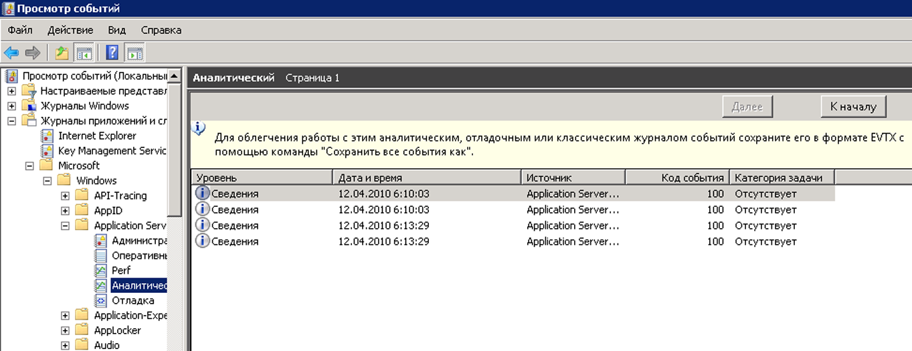

# <a name="configuring-tracking-for-a-workflow"></a><span data-ttu-id="ed8ee-102">Настройка отслеживания рабочего процесса</span><span class="sxs-lookup"><span data-stu-id="ed8ee-102">Configuring Tracking for a Workflow</span></span>
<span data-ttu-id="ed8ee-103">Рабочий процесс может выполняться тремя способами.</span><span class="sxs-lookup"><span data-stu-id="ed8ee-103">A workflow can execute in three ways:</span></span>  
  
-   <span data-ttu-id="ed8ee-104">Размещаться в <xref:System.ServiceModel.Activities.WorkflowServiceHost></span><span class="sxs-lookup"><span data-stu-id="ed8ee-104">Hosted in <xref:System.ServiceModel.Activities.WorkflowServiceHost></span></span>  
  
-   <span data-ttu-id="ed8ee-105">Выполняться в виде приложения <xref:System.Activities.WorkflowApplication>.</span><span class="sxs-lookup"><span data-stu-id="ed8ee-105">Executed as a <xref:System.Activities.WorkflowApplication></span></span>  
  
-   <span data-ttu-id="ed8ee-106">Выполняться напрямую с использованием <xref:System.Activities.WorkflowInvoker></span><span class="sxs-lookup"><span data-stu-id="ed8ee-106">Executed directly using <xref:System.Activities.WorkflowInvoker></span></span>  
  
 <span data-ttu-id="ed8ee-107">В зависимости от выбранного варианта размещения рабочего процесса участник отслеживания может быть добавлен как посредством кода, так и через файл конфигурации.</span><span class="sxs-lookup"><span data-stu-id="ed8ee-107">Depending on the workflow hosting option, a tracking participant can be added either through code or through a configuration file.</span></span> <span data-ttu-id="ed8ee-108">В этом разделе описывается, как настроить отслеживание посредством добавления участника отслеживания в <xref:System.Activities.WorkflowApplication> и в <xref:System.ServiceModel.Activities.WorkflowServiceHost>, и как включить режим отслеживания с помощью <xref:System.Activities.WorkflowInvoker>.</span><span class="sxs-lookup"><span data-stu-id="ed8ee-108">This topic describes how tracking is configured by adding a tracking participant to a <xref:System.Activities.WorkflowApplication> and to a <xref:System.ServiceModel.Activities.WorkflowServiceHost>, and how to enable tracking when using <xref:System.Activities.WorkflowInvoker>.</span></span>  
  
## <a name="configuring-workflow-application-tracking"></a><span data-ttu-id="ed8ee-109">Настройка отслеживания приложений рабочих процессов</span><span class="sxs-lookup"><span data-stu-id="ed8ee-109">Configuring Workflow Application Tracking</span></span>  
 <span data-ttu-id="ed8ee-110">Запустить рабочий процесс можно с использованием приложения <xref:System.Activities.WorkflowApplication>.</span><span class="sxs-lookup"><span data-stu-id="ed8ee-110">A workflow can run using the <xref:System.Activities.WorkflowApplication> class.</span></span> <span data-ttu-id="ed8ee-111">В этом разделе показывается, как настраивается отслеживание для приложения рабочего процесса [!INCLUDE[netfx_current_long](../../../includes/netfx-current-long-md.md)] путем добавления участника отслеживания в узел рабочего процесса <xref:System.Activities.WorkflowApplication>.</span><span class="sxs-lookup"><span data-stu-id="ed8ee-111">This topic demonstrates how tracking is configured for a [!INCLUDE[netfx_current_long](../../../includes/netfx-current-long-md.md)] workflow application by adding a tracking participant to the <xref:System.Activities.WorkflowApplication> workflow host.</span></span> <span data-ttu-id="ed8ee-112">В этом случае рабочий процесс выполняется как приложение рабочего процесса.</span><span class="sxs-lookup"><span data-stu-id="ed8ee-112">In this case, the workflow runs as a workflow application.</span></span> <span data-ttu-id="ed8ee-113">Приложение рабочего процесса можно настроить посредством кода (без использования файла конфигурации), представляющего собой резидентный EXE-файл, использующий класс <xref:System.Activities.WorkflowApplication>.</span><span class="sxs-lookup"><span data-stu-id="ed8ee-113">You configure a workflow application through code (rather than by using a configuration file), which is a self-hosted .exe file using the <xref:System.Activities.WorkflowApplication> class.</span></span> <span data-ttu-id="ed8ee-114">Участник отслеживания добавляется как расширение для экземпляра <xref:System.Activities.WorkflowApplication>.</span><span class="sxs-lookup"><span data-stu-id="ed8ee-114">The tracking participant is added as an extension to the <xref:System.Activities.WorkflowApplication> instance.</span></span> <span data-ttu-id="ed8ee-115">Это выполняется путем добавления <xref:System.Activities.Tracking.TrackingParticipant> в коллекцию расширений для экземпляра WorkflowApplication.</span><span class="sxs-lookup"><span data-stu-id="ed8ee-115">This is done by adding the <xref:System.Activities.Tracking.TrackingParticipant> to the extensions collection for the WorkflowApplication instance.</span></span>  
  
 <span data-ttu-id="ed8ee-116">Для приложения рабочего процесса можно добавить расширение поведения <xref:System.Activities.Tracking.EtwTrackingParticipant>, как это показано в следующем коде.</span><span class="sxs-lookup"><span data-stu-id="ed8ee-116">For a workflow application, you can add the <xref:System.Activities.Tracking.EtwTrackingParticipant> behavior extension as shown in the following code.</span></span>  
  
```csharp  
LogActivity activity = new LogActivity();  
  
WorkflowApplication instance = new WorkflowApplication(activity);  
EtwTrackingParticipant trackingParticipant =  
    new EtwTrackingParticipant  
{  
  
        TrackingProfile = new TrackingProfile  
           {  
               Name = "SampleTrackingProfile",  
               ActivityDefinitionId = "ProcessOrder",  
               Queries = new WorkflowInstanceQuery  
               {  
                  States = { "*" }  
              }  
          }  
       };  
instance.Extensions.Add(trackingParticipant);  
```  
  
### <a name="configuring-workflow-service-tracking"></a><span data-ttu-id="ed8ee-117">Настройка отслеживания службы рабочего процесса</span><span class="sxs-lookup"><span data-stu-id="ed8ee-117">Configuring Workflow Service Tracking</span></span>  
 <span data-ttu-id="ed8ee-118">Рабочий процесс может быть предоставлен как служба WCF при размещении в <xref:System.ServiceModel.Activities.WorkflowServiceHost> узла службы.</span><span class="sxs-lookup"><span data-stu-id="ed8ee-118">A workflow can be exposed as a WCF service when hosted in the <xref:System.ServiceModel.Activities.WorkflowServiceHost> service host.</span></span> <span data-ttu-id="ed8ee-119">Класс <xref:System.ServiceModel.Activities.WorkflowServiceHost> является специализированной реализацией класса ServiceHost библиотеки .NET для службы на основе рабочих процессов.</span><span class="sxs-lookup"><span data-stu-id="ed8ee-119"><xref:System.ServiceModel.Activities.WorkflowServiceHost> is a specialized .NET ServiceHost implementation for a workflow-based service.</span></span> <span data-ttu-id="ed8ee-120">В этом разделе описывается настройка отслеживания для службы рабочего процесса [!INCLUDE[netfx_current_short](../../../includes/netfx-current-short-md.md)], выполняющейся в <xref:System.ServiceModel.Activities.WorkflowServiceHost>.</span><span class="sxs-lookup"><span data-stu-id="ed8ee-120">This section explains how to configure tracking for a [!INCLUDE[netfx_current_short](../../../includes/netfx-current-short-md.md)] workflow service running in <xref:System.ServiceModel.Activities.WorkflowServiceHost>.</span></span> <span data-ttu-id="ed8ee-121">Его настройка осуществляется с использованием файла Web.config (для служб, размещаемых на веб-сервере) или файла App.config (для служб, размещаемых в автономном приложении, например, в консольном приложении) посредством определения поведения службы или задания кода путем добавления поведения, связанного с отслеживанием, в коллекцию <xref:System.ServiceModel.Description.ServiceDescription.Behaviors%2A> для узла службы.</span><span class="sxs-lookup"><span data-stu-id="ed8ee-121">It is configured through a Web.config file (for a Web-hosted service) or an App.config file (for a service hosted in a stand-alone application, such as a console application) by specifying a service behavior or through code by adding a tracking-specific behavior to the <xref:System.ServiceModel.Description.ServiceDescription.Behaviors%2A> collection for the service host.</span></span>  
  
 <span data-ttu-id="ed8ee-122">Для службы рабочего процесса, размещенной в <xref:System.ServiceModel.WorkflowServiceHost>, можно добавить <xref:System.Activities.Tracking.EtwTrackingParticipant> с использованием элемента <`behavior`> в файле конфигурации, как это показано в следующем примере.</span><span class="sxs-lookup"><span data-stu-id="ed8ee-122">For a workflow service hosted in <xref:System.ServiceModel.WorkflowServiceHost>, you can add the <xref:System.Activities.Tracking.EtwTrackingParticipant> using the <`behavior`> element in a configuration file, as shown in the following example.</span></span>  
  
```xml  
<behaviors>  
   <serviceBehaviors>  
        <behavior>  
          <etwTracking profileName="Sample Tracking Profile" />  
        </behavior>              
   </serviceBehaviors>  
<behaviors>  
```  
  
 <span data-ttu-id="ed8ee-123">Также для службы рабочего процесса, размещенной в <xref:System.ServiceModel.WorkflowServiceHost>, можно добавить расширение поведения <xref:System.Activities.Tracking.EtwTrackingParticipant> посредством кода.</span><span class="sxs-lookup"><span data-stu-id="ed8ee-123">Alternatively, for a workflow service hosted in <xref:System.ServiceModel.WorkflowServiceHost>, you can add the <xref:System.Activities.Tracking.EtwTrackingParticipant> behavior extension through code.</span></span> <span data-ttu-id="ed8ee-124">Для добавления пользовательского участника отслеживания создайте новое расширение поведения и добавьте его в <xref:System.ServiceModel.ServiceHost>, как это показано в следующем примере кода.</span><span class="sxs-lookup"><span data-stu-id="ed8ee-124">To add a custom tracking participant, create a new behavior extension and add it to the <xref:System.ServiceModel.ServiceHost> as shown in the following example code.</span></span>  
  
> [!NOTE]
>  <span data-ttu-id="ed8ee-125">Если вы хотите увидеть образец кода, демонстрирующий способы создания пользовательского элемента поведения, добавляющего пользовательского участника отслеживания, см. раздел [отслеживания](../../../docs/framework/windows-workflow-foundation/samples/tracking.md) примеры.</span><span class="sxs-lookup"><span data-stu-id="ed8ee-125">If you want to view sample code that shows how to create a custom behavior element that adds a custom tracking participant, refer to the [Tracking](../../../docs/framework/windows-workflow-foundation/samples/tracking.md) samples.</span></span>  
  
```  
ServiceHost svcHost = new ServiceHost(typeof(WorkflowService), new   
                                 Uri("http://localhost:8001/Sample"));  
EtwTrackingBehavior trackingBehavior =   
    new EtwTrackingBehavior  
    {  
        ProfileName = "Sample Tracking Profile"  
    };  
svcHost.Description.Behaviors.Add(trackingBehavior);  
svcHost.Open();  
```  
  
 <span data-ttu-id="ed8ee-126">Участник отслеживания добавляется к узлу службы рабочего процесса, как расширение поведения.</span><span class="sxs-lookup"><span data-stu-id="ed8ee-126">The tracking participant is added to the workflow service host as an extension to the behavior.</span></span>  
  
 <span data-ttu-id="ed8ee-127">В образце кода ниже показано считывание профиля отслеживания из файла конфигурации.</span><span class="sxs-lookup"><span data-stu-id="ed8ee-127">This sample code below shows how to read a tracking profile from configuration file.</span></span>  
  
```  
TrackingProfile GetProfile(string profileName, string displayName)  
        {  
            TrackingProfile trackingProfile = null;  
            TrackingSection trackingSection = (TrackingSection)WebConfigurationManager.GetSection("system.serviceModel/tracking");  
            if (trackingSection == null)   
            {  
                return null;  
            }  
  
            if (profileName == null)   
            {  
                profileName = "";  
            }  
  
            //Find the profile with the specified profile name in the list of profile found in config  
            var match = from p in new List<TrackingProfile>(trackingSection.TrackingProfiles)  
                        where (p.Name == profileName) && ((p.ActivityDefinitionId == displayName) || (p.ActivityDefinitionId == "*"))  
                        select p;  
  
            if (match.Count() == 0)  
            {  
                //return an empty profile  
                trackingProfile = new TrackingProfile()  
                {  
                    ActivityDefinitionId = displayName  
                };  
  
            }  
            else  
            {  
                trackingProfile = match.First();  
            }  
  
            return trackingProfile;  
```  
  
 <span data-ttu-id="ed8ee-128">В образце кода ниже показано добавление профиля отслеживания к узлу рабочего процесса.</span><span class="sxs-lookup"><span data-stu-id="ed8ee-128">This sample code shows how to add a tracking profile to a workflow host.</span></span>  
  
```  
WorkflowServiceHost workflowServiceHost = serviceHostBase as WorkflowServiceHost;  
if (null != workflowServiceHost)  
{  
              string workflowDisplayName = workflowServiceHost.Activity.DisplayName;  
               TrackingProfile trackingProfile = GetProfile(this.profileName, workflowDisplayName);  
                workflowServiceHost.WorkflowExtensions.Add(()  => new EtwTrackingParticipant  {  
               TrackingProfile = trackingProfile  
                        });  
 }  
```  
  
> [!NOTE]
>  <span data-ttu-id="ed8ee-129">Дополнительные сведения о профилях отслеживания см. [профили отслеживания](https://go.microsoft.com/fwlink/?LinkId=201310).</span><span class="sxs-lookup"><span data-stu-id="ed8ee-129">For more information on tracking profiles, refer to [Tracking Profiles](https://go.microsoft.com/fwlink/?LinkId=201310).</span></span>  
  
### <a name="configuring-tracking-using-workflowinvoker"></a><span data-ttu-id="ed8ee-130">Конфигурирование отслеживания с помощью WorkflowInvoker</span><span class="sxs-lookup"><span data-stu-id="ed8ee-130">Configuring tracking using WorkflowInvoker</span></span>  
 <span data-ttu-id="ed8ee-131">Чтобы сконфигурировать отслеживание для рабочего процесса, выполняемого с использованием <xref:System.Activities.WorkflowInvoker>, в экземпляр <xref:System.Activities.WorkflowInvoker> добавляется поставщик отслеживания.</span><span class="sxs-lookup"><span data-stu-id="ed8ee-131">To configure tracking for a workflow executed using <xref:System.Activities.WorkflowInvoker>, add the tracking provider as an extension to a <xref:System.Activities.WorkflowInvoker> instance.</span></span> <span data-ttu-id="ed8ee-132">Следующий пример кода взят из [настраиваемое отслеживание](../../../docs/framework/windows-workflow-foundation/samples/custom-tracking.md) образца.</span><span class="sxs-lookup"><span data-stu-id="ed8ee-132">The following code example is from the [Custom Tracking](../../../docs/framework/windows-workflow-foundation/samples/custom-tracking.md) sample.</span></span>  
  
```  
WorkflowInvoker invoker = new WorkflowInvoker(BuildSampleWorkflow());  
invoker.Extensions.Add(customTrackingParticipant);  
invoker.Invoke();  
```  
  
### <a name="viewing-tracking-records-in-event-viewer"></a><span data-ttu-id="ed8ee-133">Просмотр записей отслеживания в обозревателе событий</span><span class="sxs-lookup"><span data-stu-id="ed8ee-133">Viewing tracking records in Event Viewer</span></span>  
 <span data-ttu-id="ed8ee-134">Особый интерес представляют два журнала средства просмотра при отслеживании выполнения WF - аналитический журнал и журнал отладки.</span><span class="sxs-lookup"><span data-stu-id="ed8ee-134">There are two Event Viewer logs of particular interest to view when tracking WF execution - the Analytic log and the Debug log.</span></span> <span data-ttu-id="ed8ee-135">Оба журнала находятся в узле Microsoft&#124;Windows&#124;узел сервер приложений-приложения.</span><span class="sxs-lookup"><span data-stu-id="ed8ee-135">Both reside under the Microsoft&#124;Windows&#124;Application Server-Applications node.</span></span>  <span data-ttu-id="ed8ee-136">В этом разделе журналы содержат события из одного приложения, а не события, влияющие на всю систему.</span><span class="sxs-lookup"><span data-stu-id="ed8ee-136">Logs within this section contain events from a single application rather than events that have an impact on the entire system.</span></span>  
  
 <span data-ttu-id="ed8ee-137">События трассировки отладки записываются в журнал отладки.</span><span class="sxs-lookup"><span data-stu-id="ed8ee-137">Debug trace events are written to the Debug Log.</span></span> <span data-ttu-id="ed8ee-138">Для получения событий трассировки отладки WF в средстве просмотра включите журнал отладки.</span><span class="sxs-lookup"><span data-stu-id="ed8ee-138">To collect WF debug trace events in the Event Viewer, enable the Debug Log.</span></span>  
  
1.  <span data-ttu-id="ed8ee-139">Чтобы открыть средство просмотра событий, нажмите кнопку **запустить**, а затем нажмите кнопку **запуска.**</span><span class="sxs-lookup"><span data-stu-id="ed8ee-139">To open Event Viewer, click **Start**, and then click **Run.**</span></span> <span data-ttu-id="ed8ee-140">В диалоговом окне выполнения введите `eventvwr`.</span><span class="sxs-lookup"><span data-stu-id="ed8ee-140">In the Run dialog, type `eventvwr`.</span></span>  
  
2.  <span data-ttu-id="ed8ee-141">В диалоговом окне просмотра событий разверните **журналы приложений и служб** узла.</span><span class="sxs-lookup"><span data-stu-id="ed8ee-141">In the Event Viewer dialog, expand the **Applications and Services Logs** node.</span></span>  
  
3.  <span data-ttu-id="ed8ee-142">Разверните **Microsoft**, **Windows**, и **Application Server-Applications** узлов.</span><span class="sxs-lookup"><span data-stu-id="ed8ee-142">Expand the **Microsoft**, **Windows**, and **Application Server-Applications** nodes.</span></span>  
  
4.  <span data-ttu-id="ed8ee-143">Щелкните правой кнопкой мыши **Отладка** узле **Application Server-Applications** узел и выберите **включить журнал**.</span><span class="sxs-lookup"><span data-stu-id="ed8ee-143">Right-click the **Debug** node under the **Application Server-Applications** node, and select **Enable Log**.</span></span>  
  
5.  <span data-ttu-id="ed8ee-144">Чтобы сформировать события трассировки, запустите приложение с включенной функцией трассировки.</span><span class="sxs-lookup"><span data-stu-id="ed8ee-144">Execute your tracing-enabled application to generate tracing events.</span></span>  
  
6.  <span data-ttu-id="ed8ee-145">Щелкните правой кнопкой мыши **Отладка** узел и выберите **обновления.**</span><span class="sxs-lookup"><span data-stu-id="ed8ee-145">Right-click the **Debug** node and select **Refresh.**</span></span> <span data-ttu-id="ed8ee-146">На центральную панель будут выведены события трассировки.</span><span class="sxs-lookup"><span data-stu-id="ed8ee-146">Tracing events should be visible in the center pane.</span></span>  
  
 <span data-ttu-id="ed8ee-147">WF 4 предоставляет участника отслеживания, который пишет записи трассировки в сеанс ETW (средство трассировки событий для Windows).</span><span class="sxs-lookup"><span data-stu-id="ed8ee-147">WF 4 provides a tracking participant that writes tracking records to an ETW (Event Tracing for Windows) session.</span></span> <span data-ttu-id="ed8ee-148">Для подписки на записи отслеживания в участнике отслеживания трассировка событий Windows задается профиль отслеживания.</span><span class="sxs-lookup"><span data-stu-id="ed8ee-148">The ETW tracking participant is configured with a tracking profile to subscribe to tracking records.</span></span>  <span data-ttu-id="ed8ee-149">Если включено отслеживание ошибок, записи отслеживания создаются в трассировке событий Windows.</span><span class="sxs-lookup"><span data-stu-id="ed8ee-149">When tracking is enabled, errors tracking records are emitted to ETW.</span></span> <span data-ttu-id="ed8ee-150">События трассировки событий Windows (в диапазоне 100–113), соответствующие событиям отслеживания, выпущенным участником отслеживания трассировки событий Windows, записываются в аналитический журнал.</span><span class="sxs-lookup"><span data-stu-id="ed8ee-150">ETW tracking events (between the range of 100-113) corresponding to the tracking events emitted by the ETW tracking participant are written to the Analytic Log.</span></span>  
  
 <span data-ttu-id="ed8ee-151">Чтобы просмотреть записи отслеживания, выполните следующие действия.</span><span class="sxs-lookup"><span data-stu-id="ed8ee-151">To view tracking records, follow these steps.</span></span>  
  
1.  <span data-ttu-id="ed8ee-152">Чтобы открыть средство просмотра событий, нажмите кнопку **запустить**, а затем нажмите кнопку **запуска.**</span><span class="sxs-lookup"><span data-stu-id="ed8ee-152">To open Event Viewer, click **Start**, and then click **Run.**</span></span> <span data-ttu-id="ed8ee-153">В диалоговом окне выполнения введите `eventvwr`.</span><span class="sxs-lookup"><span data-stu-id="ed8ee-153">In the Run dialog, type `eventvwr`.</span></span>  
  
2.  <span data-ttu-id="ed8ee-154">В диалоговом окне просмотра событий разверните **журналы приложений и служб** узла.</span><span class="sxs-lookup"><span data-stu-id="ed8ee-154">In the Event Viewer dialog, expand the **Applications and Services Logs** node.</span></span>  
  
3.  <span data-ttu-id="ed8ee-155">Разверните **Microsoft**, **Windows**, и **Application Server-Applications** узлов.</span><span class="sxs-lookup"><span data-stu-id="ed8ee-155">Expand the **Microsoft**, **Windows**, and **Application Server-Applications** nodes.</span></span>  
  
4.  <span data-ttu-id="ed8ee-156">Щелкните правой кнопкой мыши **аналитический** узле **Application Server-Applications** узел и выберите **включить журнал**.</span><span class="sxs-lookup"><span data-stu-id="ed8ee-156">Right-click the **Analytic** node under the **Application Server-Applications** node, and select **Enable Log**.</span></span>  
  
5.  <span data-ttu-id="ed8ee-157">Чтобы сформировать записи отслеживания, запустите приложение с включенной функцией отслеживания.</span><span class="sxs-lookup"><span data-stu-id="ed8ee-157">Execute your tracking-enabled application to generate tracking records.</span></span>  
  
6.  <span data-ttu-id="ed8ee-158">Щелкните правой кнопкой мыши **аналитический** узел и выберите **обновления.**</span><span class="sxs-lookup"><span data-stu-id="ed8ee-158">Right-click the **Analytic** node and select **Refresh.**</span></span> <span data-ttu-id="ed8ee-159">В центральную область будут выведены записи отслеживания.</span><span class="sxs-lookup"><span data-stu-id="ed8ee-159">Tracking records should be visible in the center pane.</span></span>  
  
 <span data-ttu-id="ed8ee-160">На следующем изображении показано, как отображаются события отслеживания в обозревателе событий.</span><span class="sxs-lookup"><span data-stu-id="ed8ee-160">The following image shows tracking events in the event viewer.</span></span>  
  
 <span data-ttu-id="ed8ee-161"></span><span class="sxs-lookup"><span data-stu-id="ed8ee-161"></span></span>  
  
### <a name="registering-an-application-specific-provider-id"></a><span data-ttu-id="ed8ee-162">Регистрация идентификатора поставщика конкретного приложения</span><span class="sxs-lookup"><span data-stu-id="ed8ee-162">Registering an application-specific provider ID</span></span>  
 <span data-ttu-id="ed8ee-163">Если сведения о событии нужно заносить в журнал конкретного приложения, для регистрации манифеста нового поставщика необходимо выполнить следующие действия.</span><span class="sxs-lookup"><span data-stu-id="ed8ee-163">If events need to be written to a specific application log, follow these steps to register the new provider manifest.</span></span>  
  
1.  <span data-ttu-id="ed8ee-164">Укажите идентификатор поставщика в файле конфигурации приложения.</span><span class="sxs-lookup"><span data-stu-id="ed8ee-164">Declare the provider ID in the application configuration file.</span></span>  
  
    ```xml  
    <system.serviceModel>  
        <diagnostics etwProviderId="2720e974-9fe9-477a-bb60-81fe3bf91eec"/>  
    </system.serviceModel>  
    ```  
  
2.  <span data-ttu-id="ed8ee-165">Скопируйте файл манифеста из %windir%\Microsoft.NET\Framework\\< последнюю версию [!INCLUDE[netfx_current_short](../../../includes/netfx-current-short-md.md)]> \Microsoft.Windows.ApplicationServer.Applications.man во временную папку и переименуйте его в Microsoft.Windows.ApplicationServer.Applications_Provider1.man</span><span class="sxs-lookup"><span data-stu-id="ed8ee-165">Copy the manifest file from %windir%\Microsoft.NET\Framework\\<latest version of [!INCLUDE[netfx_current_short](../../../includes/netfx-current-short-md.md)]>\Microsoft.Windows.ApplicationServer.Applications.man to a temporary location, and rename it to Microsoft.Windows.ApplicationServer.Applications_Provider1.man</span></span>  
  
3.  <span data-ttu-id="ed8ee-166">Замените идентификатор GUID в файле манифеста на новый идентификатор.</span><span class="sxs-lookup"><span data-stu-id="ed8ee-166">Change the GUID in the manifest file to the new GUID.</span></span>  
  
    ```xml  
    <provider name="Microsoft-Windows-Application Server-Applications" guid="{2720e974-9fe9-477a-bb60-81fe3bf91eec}"  
    ```  
  
4.  <span data-ttu-id="ed8ee-167">Если вы не хотите удалять поставщик по умолчанию, измените имя поставщика.</span><span class="sxs-lookup"><span data-stu-id="ed8ee-167">Change the provider name if you do not want to uninstall the default provider.</span></span>  
  
    ```xml  
    <provider name="Microsoft-Windows-Application Server-Applications" guid="{2720e974-9fe9-477a-bb60-81fe3bf91eec}"  
    ```  
  
5.  <span data-ttu-id="ed8ee-168">Если на предыдущем шаге имя поставщика было изменено, измените имена каналов в файле манифеста на имя нового поставщика.</span><span class="sxs-lookup"><span data-stu-id="ed8ee-168">If you changed the provider name in the previous step, change the channel names in the manifest file to the new provider name.</span></span>  
  
    ```xml  
    <channel name="Microsoft-Windows-Application Server-Applications_Provider1/Admin" chid="ADMIN_CHANNEL" symbol="ADMIN_CHANNEL" type="Admin" enabled="false" isolation="Application" message="$(string.MICROSOFT_WINDOWS_APPLICATIONSERVER_APPLICATIONS.channel.ADMIN_CHANNEL.message)" />  
    <channel name="Microsoft-Windows-Application Server-Applications_Provider1/Operational" chid="OPERATIONAL_CHANNEL" symbol="OPERATIONAL_CHANNEL" type="Operational" enabled="false" isolation="Application" message="$(string.MICROSOFT_WINDOWS_APPLICATIONSERVER_APPLICATIONS.channel.OPERATIONAL_CHANNEL.message)" />  
    <channel name="Microsoft-Windows-Application Server-Applications_Provider1/Analytic" chid="ANALYTIC_CHANNEL" symbol="ANALYTIC_CHANNEL" type="Analytic" enabled="false" isolation="Application" message="$(string.MICROSOFT_WINDOWS_APPLICATIONSERVER_APPLICATIONS.channel.ANALYTIC_CHANNEL.message)" />  
    <channel name="Microsoft-Windows-Application Server-Applications_Provider1/Debug" chid="DEBUG_CHANNEL" symbol="DEBUG_CHANNEL" type="Debug" enabled="false" isolation="Application" message="$(string.MICROSOFT_WINDOWS_APPLICATIONSERVER_APPLICATIONS.channel.DEBUG_CHANNEL.message)" />  
    <channel name="Microsoft-Windows-Application Server-Applications_Provider1/Perf" chid="PERF_CHANNEL" symbol="PERF_CHANNEL" type="Analytic" enabled="false" isolation="Application" message="$(string.MICROSOFT_WINDOWS_APPLICATIONSERVER_APPLICATIONS.channel.PERF_CHANNEL.message)" />  
    ```  
  
6.  <span data-ttu-id="ed8ee-169">Сформируйте DLL-библиотеку ресурсов, выполнив следующие действия.</span><span class="sxs-lookup"><span data-stu-id="ed8ee-169">Generate the resource DLL by following these steps.</span></span>  
  
    1.  <span data-ttu-id="ed8ee-170">Установите пакет Windows SDK.</span><span class="sxs-lookup"><span data-stu-id="ed8ee-170">Install the Windows SDK.</span></span> <span data-ttu-id="ed8ee-171">Пакет SDK Windows входит компилятор сообщений ([mc.exe](https://go.microsoft.com/fwlink/?LinkId=184606)) и компилятор ресурсов ([rc.exe](https://go.microsoft.com/fwlink/?LinkId=184605)).</span><span class="sxs-lookup"><span data-stu-id="ed8ee-171">The Windows SDK includes the message compiler ([mc.exe](https://go.microsoft.com/fwlink/?LinkId=184606)) and resource compiler ([rc.exe](https://go.microsoft.com/fwlink/?LinkId=184605)).</span></span>  
  
    2.  <span data-ttu-id="ed8ee-172">В командной строке Windows SDK примените команду run mc.exe к новому файлу манифеста.</span><span class="sxs-lookup"><span data-stu-id="ed8ee-172">In a Windows SDK command prompt, run mc.exe on the new manifest file.</span></span>  
  
        ```  
        mc.exe Microsoft.Windows.ApplicationServer.Applications_Provider1.man  
        ```  
  
    3.  <span data-ttu-id="ed8ee-173">Примените команду rc.exe к файлу ресурсов, сформированному на предыдущем шаге.</span><span class="sxs-lookup"><span data-stu-id="ed8ee-173">Run rc.exe on the resource file generated in the previous step.</span></span>  
  
        ```  
        rc.exe  Microsoft.Windows.ApplicationServer.Applications_Provider1.rc  
        ```  
  
    4.  <span data-ttu-id="ed8ee-174">Создайте пустой файл CS с именем NewProviderReg.cs.</span><span class="sxs-lookup"><span data-stu-id="ed8ee-174">Create an empty cs file called NewProviderReg.cs.</span></span>  
  
    5.  <span data-ttu-id="ed8ee-175">Создайте DLL-библиотеку ресурсов с помощью компилятора C#.</span><span class="sxs-lookup"><span data-stu-id="ed8ee-175">Create a resource DLL using the C# compiler.</span></span>  
  
        ```  
        csc /target:library /win32res:Microsoft.Windows.ApplicationServer.Applications_Provider1.res NewProviderReg.cs /out:Microsoft.Windows.ApplicationServer.Applications_Provider1.dll  
        ```  
  
    6.  <span data-ttu-id="ed8ee-176">Измените имя dll-библиотеки ресурсов и сообщений в файле манифеста с `Microsoft.Windows.ApplicationServer.Applications.Provider1.man` на новое имя dll.</span><span class="sxs-lookup"><span data-stu-id="ed8ee-176">Change the resource and message dl namel in the manifest file from `Microsoft.Windows.ApplicationServer.Applications.Provider1.man` to the new dll name.</span></span>  
  
        ```xml  
        <provider name="Microsoft-Windows-Application Server-Applications_Provider1" guid="{2720e974-9fe9-477a-bb60-81fe3bf91eec}" symbol="Microsoft_Windows_ApplicationServer_ApplicationEvents" resourceFileName="<dll directory>\Microsoft.Windows.ApplicationServer.Applications_Provider1.dll" messageFileName="<dll directory>\Microsoft.Windows.ApplicationServer.Applications_Provider1.dll">  
        ```  
  
    7.  <span data-ttu-id="ed8ee-177">Используйте [wevtutil](https://go.microsoft.com/fwlink/?LinkId=184608) для регистрации манифеста.</span><span class="sxs-lookup"><span data-stu-id="ed8ee-177">Use [wevtutil](https://go.microsoft.com/fwlink/?LinkId=184608) to register the manifest.</span></span>  
  
        ```  
        wevtutil im Microsoft.Windows.ApplicationServer.Applications_Provider1.man  
        ```  
  
## <a name="see-also"></a><span data-ttu-id="ed8ee-178">См. также</span><span class="sxs-lookup"><span data-stu-id="ed8ee-178">See Also</span></span>  
 [<span data-ttu-id="ed8ee-179">Мониторинг Windows Server App Fabric</span><span class="sxs-lookup"><span data-stu-id="ed8ee-179">Windows Server App Fabric Monitoring</span></span>](https://go.microsoft.com/fwlink/?LinkId=201273)  
 [<span data-ttu-id="ed8ee-180">Мониторинг приложений с помощью фабрики приложения</span><span class="sxs-lookup"><span data-stu-id="ed8ee-180">Monitoring Applications with App Fabric</span></span>](https://go.microsoft.com/fwlink/?LinkId=201275)
