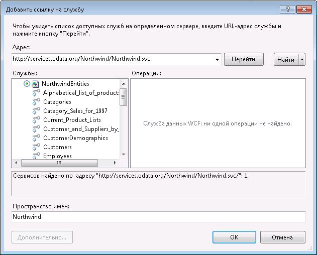

# Использование каналов OData из рабочего процесса
Службы WCF Data Services являются компонентом [!INCLUDE[dnprdnshort](../../../includes/dnprdnshort-md.md)] , который позволяет создавать службы, использующие протокол Open Data Protocol (OData) для передачи и получения данных через Интернет или интрасеть с помощью семантики передачи репрезентативного состояния (REST). OData предоставляет доступ к данным в виде ресурсов, которые адресуются по URI. Со службами данных, основанными на OData, может взаимодействовать любое приложение, которое способно отправить HTTP-запрос и обработать канал OData, возвращаемый службой данных. Кроме того, службы данных WCF включают в себя клиентские библиотеки, расширяющие программные возможности для доступа к каналам OData из приложений [!INCLUDE[dnprdnshort](../../../includes/dnprdnshort-md.md)] . В этом разделе представлены общие сведения об использовании каналов OData в рабочем процессе как с клиентскими библиотеками, так и без них.  
  
## Использование образца службы OData «Борей»  
 В примерах в этом разделе используется образец службы данных Northwind в [ http://services.odata.org/Northwind/Northwind.svc/ ](http://go.microsoft.com/fwlink/?LinkID=187426). Эта служба поставляется в составе [пакета SDK OData](http://go.microsoft.com/fwlink/?LinkID=185248) и предоставляет доступ только для чтения к образцу базы данных "Борей". Если необходим доступ для чтения или локальная служба данных WCF, то можно выполнить действия, описанные в [кратком руководстве по службам данных WCF](http://go.microsoft.com/fwlink/?LinkID=131076) , чтобы создать локальную службу OData, обеспечивающую доступ к базе данных "Борей". При выполнении инструкций, описанных в кратком руководстве, необходимо заменить локальный URI на тот, который указан в коде в этом разделе.  
  
## Использование каналов OData с применением клиентских библиотек  
 В состав служб данных WCF входят клиентские библиотеки, обеспечивающие возможность использования каналов OData из [!INCLUDE[dnprdnshort](../../../includes/dnprdnshort-md.md)] и клиентских приложений. Эти библиотеки упрощают отправку и получение сообщений HTTP. Кроме того, они преобразуют полезные данные сообщений в объекты CLR, представляющие данные сущностей. Клиентские библиотеки содержат два базовых класса: <xref:System.Data.Services.Client.DataServiceContext> и <xref:System.Data.Services.Client.DataServiceQuery%601>. Эти классы позволяют отправлять запросы к службе данных и работать с возвращенными данными сущностей как с объектами CLR. В этом разделе описаны два подхода к созданию действий, в которых используются клиентские библиотеки.  
  
### Добавление ссылки на службу данных WCF  
 Чтобы сформировать клиентские библиотеки «Борей», можно в диалоговом окне **Добавление ссылки на службу** в среде [!INCLUDE[vs_current_long](../../../includes/vs-current-long-md.md)] добавить ссылку на службу OData «Борей».  
  
   
  
 Обратите внимание, что эта служба не предоставляет доступ к операциям службы, а в списке **Службы** имеются элементы, представляющие сущности, предоставляемые службой данных «Борей». При добавлении ссылки на службу для этих сущностей будут созданы классы, которые будут использоваться в клиентском коде. В примерах в этом разделе для выполнения запросов используются эти классы, а также `NorthwindEntities` .  
  
> [!NOTE]
>  Дополнительные сведения см. в разделе [Создание клиентской библиотеки службы данных (службы данных WCF)](http://go.microsoft.com/fwlink/?LinkID=191611).  
  
### Использование асинхронных методов  
 Для разрешения возможных проблем с задержками, которые могут произойти при обращении к ресурсам через Интернет, рекомендуется производить обращения к службам данных WCF асинхронно. Библиотеки клиента служб данных WCF включают в себя асинхронные методы для вызова запросов, и Windows Workflow Foundation (WF) предоставляет <xref:System.Activities.AsyncCodeActivity> класс для создания асинхронных действий. Можно написать действия, производные от<xref:System.Activities.AsyncCodeActivity> , чтобы пользоваться всеми преимуществами классов [!INCLUDE[dnprdnshort](../../../includes/dnprdnshort-md.md)] с асинхронными методами, или код, выполняемый асинхронно, можно поместить в метод и вызывать с помощью делегата. В этом разделе приводятся два примера действия, являющегося производным от <xref:System.Activities.AsyncCodeActivity> , - одно из них использует асинхронные методы клиентских библиотек служб данных WCF, а второе - делегат.  
  
> [!NOTE]
>  Дополнительные сведения см. в разделе [асинхронные операции (службы данных WCF)](http://go.microsoft.com/fwlink/?LinkId=193396) и [создание асинхронных действий](../../../docs/framework/windows-workflow-foundation/creating-asynchronous-activities-in-wf.md).  
  
### Использование асинхронных методов клиентских библиотек  
 Класс <xref:System.Data.Services.Client.DataServiceQuery%601> предусматривает методы <xref:System.Data.Services.Client.DataServiceQuery%601.BeginExecute%2A> и <xref:System.Data.Services.Client.DataServiceQuery%601.EndExecute%2A> для асинхронных запросов службы OData. Эти методы могут быть вызваны из переопределений <xref:System.Activities.AsyncCodeActivity.BeginExecute%2A> и <xref:System.Activities.AsyncCodeActivity.EndExecute%2A> класса, производного от <xref:System.Activities.AsyncCodeActivity> . Когда переопределение <xref:System.Activities.AsyncCodeActivity> <xref:System.Activities.AsyncCodeActivity.BeginExecute%2A> возвращает управление, рабочий процесс может перейти в состояние простоя (при этом он не будет сохранен), а после завершения асинхронных операций <xref:System.Activities.AsyncCodeActivity.EndExecute%2A> вызывается средой выполнения.  
  
 В следующем примере действие `OrdersByCustomer` определено с двумя входными аргументами. Аргумент `CustomerId` представляет клиента, для которого необходимо вернуть заказы, а аргумент `ServiceUri` - URI службы OData, которой будет отправлен запрос. Поскольку действие является производным от `AsyncCodeActivity<IEnumerable<Order>>` , имеется также выходной аргумент <xref:System.Activities.Activity%601.Result%2A> , который служит для возврата результатов запроса. Переопределение <xref:System.Activities.AsyncCodeActivity.BeginExecute%2A> создает запрос LINQ, выбирающий все заказы указанного клиента. Запрос указывается как <xref:System.Activities.AsyncCodeActivityContext.UserState%2A> переданного <xref:System.Activities.AsyncCodeActivityContext>, а затем вызывается метод запроса <xref:System.Data.Services.Client.DataServiceQuery%601.BeginExecute%2A> . Обратите внимание, что обратный вызов и состояние, передаваемые в <xref:System.Data.Services.Client.DataServiceQuery%601.BeginExecute%2A> запроса, представляют собой обратный вызов и состояние, переданные методу действия <xref:System.Activities.AsyncCodeActivity.BeginExecute%2A> . После завершения обработки запроса вызывается метод действия <xref:System.Activities.AsyncCodeActivity.EndExecute%2A> . Запрос извлекается из <xref:System.Activities.AsyncCodeActivityContext.UserState%2A>, а затем вызывается метод запроса <xref:System.Data.Services.Client.DataServiceQuery%601.EndExecute%2A> . Метод возвращает <xref:System.Collections.Generic.IEnumerable%601> указанного типа сущности, в данном случае - `Order`. Поскольку `IEnumerable<Order>` является универсальным типом <xref:System.Activities.AsyncCodeActivity%601>, этот `IEnumerable` задается как <xref:System.Activities.Activity%601.Result%2A> <xref:System.Activities.OutArgument%601> действия.  
  
 [!code-csharp[CFX_WCFDataServicesActivityExample#100](../../../samples/snippets/csharp/VS_Snippets_CFX/CFX_WCFDataServicesActivityExample/cs/Program.cs#100)]  
  
 В следующем примере действие `OrdersByCustomer` вызывает список заказов для указанного клиента, а затем действие <xref:System.Activities.Statements.ForEach%601> выполняет перечисление заказов в результате и отображает на консоли данные всех заказов.  
  
 [!code-csharp[CFX_WCFDataServicesActivityExample#10](../../../samples/snippets/csharp/VS_Snippets_CFX/CFX_WCFDataServicesActivityExample/cs/Program.cs#10)]  
  
 При вызове этого рабочего процесса на консоли отображаются следующие данные.  
  
 **Вызов службы данных WCF...**  
**8/25/1997**   
**10/3/1997**   
**10/13/1997**   
**1/15/1998**   
**3/16/1998**   
**4/9/1998**    
> [!NOTE]
>  Если не удалось установить соединение с сервером, то будет вызвано исключение, аналогичное следующему:  
>   
>  Необработанное исключение: System.InvalidOperationException: во время обработки запроса произошла ошибка. ---> System.Net.WebException: не удалось подключиться к удаленному серверу ---> System.Net.Sockets.SocketException: сбой попытки подключения, так как через определенный период времени не был получен отклик от объекта, с которым выполняется попытка подключения, или сбой подключения, так как не удалось получить отклик от подключенного узла.  
  
 Если требуется дополнительная обработка данных в результате запроса, то ее можно выполнить в переопределении действия <xref:System.Activities.AsyncCodeActivity%601.EndExecute%2A> . Методы <xref:System.Activities.AsyncCodeActivity%601.BeginExecute%2A> и <xref:System.Activities.AsyncCodeActivity%601.EndExecute%2A> вызываются потоком рабочего процесса, при этом весь код в этих переопределениях не выполняется асинхронно. Если дополнительная обработка требует большого количества ресурсов, выполняется длительное время или результаты запроса отображаются с разбиением на страницы, то рекомендуется реализовать подход, описанный в предыдущем разделе, где для асинхронного выполнения запроса и дополнительной обработки используется делегат.  
  
### Использование делегатов  
 Помимо вызова асинхронного метода класса [!INCLUDE[dnprdnshort](../../../includes/dnprdnshort-md.md)] , действие на основе <xref:System.Activities.AsyncCodeActivity>может также использоваться для определения асинхронной логики в одном из этих методов. Этот метод указывается с помощью делегата в переопределении действия <xref:System.Activities.AsyncCodeActivity.BeginExecute%2A> . Когда метод возвращает управление, среда выполнения вызывает переопределения действия <xref:System.Activities.AsyncCodeActivity.EndExecute%2A> . При вызове службы OData из рабочего процесса этот метод можно использовать для запроса к службе и выполнения дополнительной обработки.  
  
 В следующем примере определяется действие `ListCustomers` . Это действие отправляет запрос к образцу службы данных «Борей» и возвращает список `List<Customer>` , содержащий всех клиентов в базе данных «Борей». Асинхронные операции выполняются методом `GetCustomers` . Этот метод отправляет запрос к службе для всех клиентов, а затем копирует их в `List<Customer>`. После этого выполняется проверка для подтверждения разбиения на страницы результатов. Если результаты разбиты на страницы, то отправляется запрос к службе для получения следующей страницы результатов, они добавляются к списку и эти операции выполняются до получения всех данных клиентов.  
  
> [!NOTE]
>  [!INCLUDE[crabout](../../../includes/crabout-md.md)] разбиении на страницы в службах данных WCF см. в разделе. [Практическое руководство. Загрузка результатов, разбитых на страницы (службы данных WCF)](http://go.microsoft.com/fwlink/?LinkId=193452).  
  
 После добавления всех клиентов возвращается список. Метод `GetCustomers` указывается в переопределении действия <xref:System.Activities.AsyncCodeActivity.BeginExecute%2A> . Поскольку у метода имеется возвращаемое значение, то для его указания создается `Func<string, List<Customer>>` .  
  
> [!NOTE]
>  Если метод, выполняющий асинхронные операции, не имеет возвращаемого значения, то используется <xref:System.Action> вместо <!--zz <xref:System.Func> --> `System.Func`. Примеры создания асинхронного образца с использованием обоих методов см. в разделе [создание асинхронных действий](../../../docs/framework/windows-workflow-foundation/creating-asynchronous-activities-in-wf.md).  
  
 Этот <!--zz <xref:System.Func> --> `System.Func` назначается <xref:System.Activities.AsyncCodeActivityContext.UserState%2A>, а затем вызывается `BeginInvoke` . Поскольку у вызываемого метода отсутствует доступ к среде аргументов действия, значение аргумента `ServiceUri` передается в качестве первого параметра вместе с обратным вызовом и состоянием, переданными в <xref:System.Activities.AsyncCodeActivity.BeginExecute%2A>. Когда метод `GetCustomers` возвращает управление, среда выполнения вызывает <xref:System.Activities.AsyncCodeActivity.EndExecute%2A>. Код в <xref:System.Activities.AsyncCodeActivity.EndExecute%2A> вызывает делегат из <xref:System.Activities.AsyncCodeActivityContext.UserState%2A>, вызывает `EndInvoke`и возвращает результат, который является списком клиентов, возвращаемым из метода `GetCustomers` .  
  
 [!code-csharp[CFX_WCFDataServicesActivityExample#200](../../../samples/snippets/csharp/VS_Snippets_CFX/CFX_WCFDataServicesActivityExample/cs/Program.cs#200)]  
  
 В следующем примере действие `ListCustomers` вызывает список клиентов, а затем действие <xref:System.Activities.Statements.ForEach%601> выполняет их перечисление и отображает на консоли название компании и имя контактного лица для всех клиентов.  
  
 [!code-csharp[CFX_WCFDataServicesActivityExample#20](../../../samples/snippets/csharp/VS_Snippets_CFX/CFX_WCFDataServicesActivityExample/cs/Program.cs#20)]  
  
 При вызове этого рабочего процесса на консоли отображаются следующие данные. Поскольку в результате этого запроса указывается несколько клиентов, ниже отображена только часть результатов.  
  
 **Вызов службы данных WCF...**  
**Alfreds Futterkiste, контакт: Мария Андерс (Maria Anders)**   
**Ana Trujillo Emparedados y helados, контакт: Ана Труджило (Ana Trujillo)**   
**Antonio Moreno Taquería, контакт: Антонио Морено (Antonio Moreno)**   
**Around the Horn, контакт: Томас Харди (Thomas Hardy)**   
**Berglunds snabbköp, контакт: Кристина Берглунд (Christina Berglund)**   
**...**    
## Использование каналов OData без использования клиентских библиотек  
 OData предоставляет доступ к данным в виде ресурсов, которые адресуются по URI. При использовании клиентских библиотек эти URI создаются автоматически, но при этом клиентские библиотеки использовать не обязательно. При необходимости доступ к службам OData можно получить напрямую без использования клиентских библиотек. Если клиентские библиотеки не используются, то местоположение службы и необходимые данные указываются в URI, а получение результатов производится через HTTP-запрос. После этого необработанные данные можно обработать или использовать необходимым способом. Помимо других способов, результаты запроса OData можно вызвать с помощью класса <xref:System.Net.WebClient> . В данном примере извлекается имя контактного лица клиента, представленного ключом «ALFKI».  
  
 [!code-csharp[CFX_WCFDataServicesActivityExample#2](../../../samples/snippets/csharp/VS_Snippets_CFX/CFX_WCFDataServicesActivityExample/cs/Program.cs#2)]  
  
 При выполнении этого кода на консоль выводятся следующие данные.  
  
 **Возвращенные необработанные данные:**  
**\<? версия xml = «1.0» encoding = «utf-8» standalone = «yes»? >**   
**\<ContactName xmlns =»http://schemas.microsoft.com/ado/2007/08/dataservices«> Maria Anders\</ContactName >** в рабочем процессе код из этого примера может быть включен в <xref:System.Activities.CodeActivity.Execute%2A> переопределение <xref:System.Activities.CodeActivity>-на основе пользовательского действия, но одинаковыми функциональные возможности можно также с помощью <xref:System.Activities.Expressions.InvokeMethod%601> действия. Действие <xref:System.Activities.Expressions.InvokeMethod%601> позволяет создателю рабочего процесса вызывать статические методы и методы экземпляра класса. Кроме того, поддерживается асинхронный вызов указанного метода. В следующем примере действие <xref:System.Activities.Expressions.InvokeMethod%601> настраивается для вызова метода <xref:System.Net.WebClient.DownloadString%2A> класса <xref:System.Net.WebClient> и возвращает список клиентов.  
  
 [!code-csharp[CFX_WCFDataServicesActivityExample#3](../../../samples/snippets/csharp/VS_Snippets_CFX/CFX_WCFDataServicesActivityExample/cs/Program.cs#3)]  
  
 Метод<xref:System.Activities.Expressions.InvokeMethod%601> может быть как статическим, так и методом экземпляра класса. Поскольку <xref:System.Net.WebClient.DownloadString%2A> - метод экземпляра класса <xref:System.Net.WebClient> , определяется новый экземпляр класса <xref:System.Net.WebClient> для <xref:System.Activities.Expressions.InvokeMethod%601.TargetObject%2A>. `DownloadString` определяется как <xref:System.Activities.Expressions.InvokeMethod%601.MethodName%2A>, универсальный код ресурса (URI), содержащий запрос, определяется в коллекции <xref:System.Activities.Expressions.InvokeMethod%601.Parameters%2A> , и значению <xref:System.Activities.Activity%601.Result%2A> присваивается возвращаемое значение. Значение <xref:System.Activities.Expressions.InvokeMethod%601.RunAsynchronously%2A> задается равным `true`, и это указывает на асинхронный вызов метода относительно рабочего процесса. В следующем примере создается рабочий процесс, который с помощью действия <xref:System.Activities.Expressions.InvokeMethod%601> запрашивает у образца службы данных «Борей» список заказов указанного клиента, после чего полученные данные выводятся на консоль.  
  
 [!code-csharp[CFX_WCFDataServicesActivityExample#1](../../../samples/snippets/csharp/VS_Snippets_CFX/CFX_WCFDataServicesActivityExample/cs/Program.cs#1)]  
  
 При вызове этого рабочего процесса на консоль выводятся следующие данные. Поскольку запрос возвращает несколько заказов, ниже показана только часть результатов.  
  
 **Вызов службы данных WCF...**  
**Возвращенные необработанные данные:**   
**\<? версия xml = «1.0» encoding = «utf-8» standalone = «yes»? >**   
**\<веб-канала**   
 **XML: Base =»http://services.odata.org/Northwind/Northwind.svc/"**  
 **xmlns:d =»http://schemas.microsoft.com/ado/2007/08/dataservices"**  
 **xmlns:m =»http://schemas.microsoft.com/ado/2007/08/dataservices/metadata"**  
 **xmlns =»http://www.w3.org/2005/Atom«>**  
 **\<Тип Title = «text» > заказы \< /title >**  
 **\<Идентификатор >http://services.odata.org/Northwind/Northwind.svc/Customers(«ALFKI») и упорядочивает\</id >**  
 **\<Обновить > 2010-05-19T19:37:07Z\</ обновить >**  
 **\<связать rel = «self» title = «Orders» href = «Orders» / >**  
 **\<запись >**  
 **\<Идентификатор >http://services.odata.org/Northwind/Northwind.svc/Orders(10643)\</id >**  
 **\<Тип Title = «text» > \< /title >**  
 **\<Обновить > 2010-05-19T19:37:07Z\</ обновить >**  
 **\<Автор >**  
 **\<имя / >**  
 **\</ author >**  
 **\<связать rel = «edit» title = «Order» href="Orders(10643)» / >**  
 **\<связать rel =»http://schemas.microsoft.com/ado/2007/08/dataservices/related/Customer"**  
 **Тип =» приложения/atom + xml; введите = запись» title = «Customer» href = «Заказы (10643) или клиента» / >**  
**...**  В этом примере представлен один метод, который разработчики приложений рабочих процессов могут использовать для работы с необработанными данными, полученными от службы OData. [!INCLUDE[crabout](../../../includes/crabout-md.md)] доступе к службам данных WCF с использованием URI см. в разделах [Доступ к ресурсам службы данных (службы данных WCF)](http://go.microsoft.com/fwlink/?LinkId=193397) и [OData: URI Conventions (OData: соглашения по URI)](http://go.microsoft.com/fwlink/?LinkId=185564).
