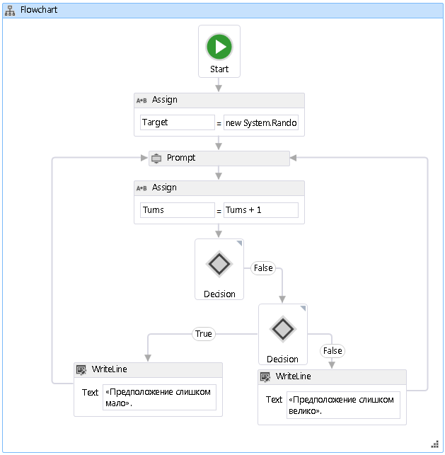

# <a name="how-to-create-a-flowchart-workflow"></a><span data-ttu-id="f6f89-102">Практическое руководство. Создание рабочего процесса c блок-схемой</span><span class="sxs-lookup"><span data-stu-id="f6f89-102">How to: Create a Flowchart Workflow</span></span>
<span data-ttu-id="f6f89-103">Рабочие процессы могут создаваться как из встроенных, так и из пользовательских действий.</span><span class="sxs-lookup"><span data-stu-id="f6f89-103">Workflows can be constructed from built-in activities as well as from custom activities.</span></span> <span data-ttu-id="f6f89-104">В этом разделе действия по созданию рабочего процесса, который использует как встроенные действия, например <xref:System.Activities.Statements.Flowchart> действия и пользовательские действия из предыдущего [как: Создание действия](how-to-create-an-activity.md) раздела.</span><span class="sxs-lookup"><span data-stu-id="f6f89-104">This topic steps through creating a workflow that uses both built-in activities such as the <xref:System.Activities.Statements.Flowchart> activity, and the custom activities from the previous [How to: Create an Activity](how-to-create-an-activity.md) topic.</span></span> <span data-ttu-id="f6f89-105">Рабочий процесс моделирует игру по угадыванию числа.</span><span class="sxs-lookup"><span data-stu-id="f6f89-105">The workflow models a number guessing game.</span></span>  
  
> [!NOTE]
>  <span data-ttu-id="f6f89-106">Каждый раздел в учебнике «Приступая к работе» построен на основе предыдущих разделов.</span><span class="sxs-lookup"><span data-stu-id="f6f89-106">Each topic in the Getting Started tutorial depends on the previous topics.</span></span> <span data-ttu-id="f6f89-107">Для изучения этого раздела, необходимо сначала выполнить [как: Создание действия](how-to-create-an-activity.md).</span><span class="sxs-lookup"><span data-stu-id="f6f89-107">To complete this topic, you must first complete [How to: Create an Activity](how-to-create-an-activity.md).</span></span>  
  
> [!NOTE]
>  <span data-ttu-id="f6f89-108">Чтобы скачать завершенную версию учебника, см. раздел [Windows Workflow Foundation (WF45), учебник "Приступая к работе"](https://go.microsoft.com/fwlink/?LinkID=248976).</span><span class="sxs-lookup"><span data-stu-id="f6f89-108">To download a completed version of the tutorial, see [Windows Workflow Foundation (WF45) - Getting Started Tutorial](https://go.microsoft.com/fwlink/?LinkID=248976).</span></span>  
  
### <a name="to-create-the-workflow"></a><span data-ttu-id="f6f89-109">Создание рабочего процесса</span><span class="sxs-lookup"><span data-stu-id="f6f89-109">To create the workflow</span></span>  
  
1. <span data-ttu-id="f6f89-110">Щелкните правой кнопкой мыши **NumberGuessWorkflowActivities** в **обозревателе решений** и выберите **добавить**, **новый элемент**.</span><span class="sxs-lookup"><span data-stu-id="f6f89-110">Right-click **NumberGuessWorkflowActivities** in **Solution Explorer** and select **Add**, **New Item**.</span></span>  
  
2. <span data-ttu-id="f6f89-111">В **установленные**, **общих элементов** выберите **рабочего процесса**.</span><span class="sxs-lookup"><span data-stu-id="f6f89-111">In the **Installed**, **Common Items** node, select **Workflow**.</span></span> <span data-ttu-id="f6f89-112">Выберите **действия** из **рабочего процесса** списка.</span><span class="sxs-lookup"><span data-stu-id="f6f89-112">Select **Activity** from the **Workflow** list.</span></span>  
  
3. <span data-ttu-id="f6f89-113">Тип `FlowchartNumberGuessWorkflow` в **имя** поле и нажмите кнопку **добавить**.</span><span class="sxs-lookup"><span data-stu-id="f6f89-113">Type `FlowchartNumberGuessWorkflow` into the **Name** box and click **Add**.</span></span>  
  
4. <span data-ttu-id="f6f89-114">Перетащите **блок-схема** действия из **блок-схема** раздел **элементов** и сбросьте его в **Перетащите сюда действие** метки на область конструктора рабочих процессов.</span><span class="sxs-lookup"><span data-stu-id="f6f89-114">Drag a **Flowchart** activity from the **Flowchart** section of the **Toolbox** and drop it onto the **Drop activity here** label on the workflow design surface.</span></span>  
  
### <a name="to-create-the-workflow-variables-and-arguments"></a><span data-ttu-id="f6f89-115">Создание переменных и аргументов рабочего процесса</span><span class="sxs-lookup"><span data-stu-id="f6f89-115">To create the workflow variables and arguments</span></span>  
  
1. <span data-ttu-id="f6f89-116">Дважды щелкните **FlowchartNumberGuessWorkflow.xaml** в **обозревателе решений** для отображения рабочего процесса в конструкторе, если он еще не отображается.</span><span class="sxs-lookup"><span data-stu-id="f6f89-116">Double-click **FlowchartNumberGuessWorkflow.xaml** in **Solution Explorer** to display the workflow in the designer, if it is not already displayed.</span></span>  
  
2. <span data-ttu-id="f6f89-117">Нажмите кнопку **аргументы** в нижнем левом углу конструктора рабочих процессов для отображения **аргументы** области.</span><span class="sxs-lookup"><span data-stu-id="f6f89-117">Click **Arguments** in the lower-left side of the workflow designer to display the **Arguments** pane.</span></span>  
  
3. <span data-ttu-id="f6f89-118">Нажмите кнопку **создать аргумент**.</span><span class="sxs-lookup"><span data-stu-id="f6f89-118">Click **Create Argument**.</span></span>  
  
4. <span data-ttu-id="f6f89-119">Тип `MaxNumber` в **имя** выберите **в** из **направление** стрелку раскрывающегося списка выберите **Int32** из **Тип аргумента** стрелку раскрывающегося списка и нажмите клавишу ВВОД, чтобы сохранить аргумент.</span><span class="sxs-lookup"><span data-stu-id="f6f89-119">Type `MaxNumber` into the **Name** box, select **In** from the **Direction** drop-down list, select **Int32** from the **Argument type** drop-down list, and then press ENTER to save the argument.</span></span>  
  
5. <span data-ttu-id="f6f89-120">Нажмите кнопку **создать аргумент**.</span><span class="sxs-lookup"><span data-stu-id="f6f89-120">Click **Create Argument**.</span></span>  
  
6. <span data-ttu-id="f6f89-121">Тип `Turns` в **имя** поле, которое расположено ниже только что добавленного `MaxNumber` аргумента выберите **Out** из **направление** стрелку раскрывающегося списка, выберите  **Int32** из **тип аргумента** стрелку раскрывающегося списка и нажмите клавишу ВВОД.</span><span class="sxs-lookup"><span data-stu-id="f6f89-121">Type `Turns` into the **Name** box that is below the newly added `MaxNumber` argument, select **Out** from the **Direction** drop-down list, select **Int32** from the **Argument type** drop-down list, and then press ENTER.</span></span>  
  
7. <span data-ttu-id="f6f89-122">Нажмите кнопку **аргументы** в нижнем левом углу конструктора действий, чтобы закрыть **аргументы** области.</span><span class="sxs-lookup"><span data-stu-id="f6f89-122">Click **Arguments** in the lower-left side of the activity designer to close the **Arguments** pane.</span></span>  
  
8. <span data-ttu-id="f6f89-123">Нажмите кнопку **переменных** в нижнем левом углу конструктора рабочих процессов для отображения **переменных** области.</span><span class="sxs-lookup"><span data-stu-id="f6f89-123">Click **Variables** in the lower-left side of the workflow designer to display the **Variables** pane.</span></span>  
  
9. <span data-ttu-id="f6f89-124">Нажмите кнопку **создать переменную**.</span><span class="sxs-lookup"><span data-stu-id="f6f89-124">Click **Create Variable**.</span></span>  
  
    > [!TIP]
    >  <span data-ttu-id="f6f89-125">Если не **создать переменную** поле отображается, щелкните <xref:System.Activities.Statements.Flowchart> действия в области конструктора рабочих процессов, чтобы выбрать его.</span><span class="sxs-lookup"><span data-stu-id="f6f89-125">If no **Create Variable** box is displayed, click the <xref:System.Activities.Statements.Flowchart> activity on the workflow designer surface to select it.</span></span>  
  
10. <span data-ttu-id="f6f89-126">Тип `Guess` в **имя** выберите **Int32** из **тип переменной** стрелку раскрывающегося списка и нажмите клавишу ВВОД, чтобы сохранить переменную.</span><span class="sxs-lookup"><span data-stu-id="f6f89-126">Type `Guess` into the **Name** box, select **Int32** from the **Variable type** drop-down list, and then press ENTER to save the variable.</span></span>  
  
11. <span data-ttu-id="f6f89-127">Нажмите кнопку **создать переменную**.</span><span class="sxs-lookup"><span data-stu-id="f6f89-127">Click **Create Variable**.</span></span>  
  
12. <span data-ttu-id="f6f89-128">Тип `Target` в **имя** выберите **Int32** из **тип переменной** стрелку раскрывающегося списка и нажмите клавишу ВВОД, чтобы сохранить переменную.</span><span class="sxs-lookup"><span data-stu-id="f6f89-128">Type `Target` into the **Name** box, select **Int32** from the **Variable type** drop-down list, and then press ENTER to save the variable.</span></span>  
  
13. <span data-ttu-id="f6f89-129">Нажмите кнопку **переменных** в нижнем левом углу конструктора действий, чтобы закрыть **переменных** области.</span><span class="sxs-lookup"><span data-stu-id="f6f89-129">Click **Variables** in the lower-left side of the activity designer to close the **Variables** pane.</span></span>  
  
### <a name="to-add-the-workflow-activities"></a><span data-ttu-id="f6f89-130">Добавление действий рабочего процесса</span><span class="sxs-lookup"><span data-stu-id="f6f89-130">To add the workflow activities</span></span>  
  
1. <span data-ttu-id="f6f89-131">Перетащите **назначить** действия из **примитивы** раздел **элементов** и наведите его на **запустить** узла, который находится в верхней части Блок-схема.</span><span class="sxs-lookup"><span data-stu-id="f6f89-131">Drag an **Assign** activity from the **Primitives** section of the **Toolbox** and hover it over the **Start** node, which is at the top of the flowchart.</span></span> <span data-ttu-id="f6f89-132">При **назначить** действия находится над **запустить** узел, появятся три треугольника вокруг **запустить** узла.</span><span class="sxs-lookup"><span data-stu-id="f6f89-132">When the **Assign** activity is over the **Start** node, three triangles will appear around the **Start** node.</span></span> <span data-ttu-id="f6f89-133">DROP **назначить** действия на треугольник непосредственно под **запустить** узла.</span><span class="sxs-lookup"><span data-stu-id="f6f89-133">Drop the **Assign** activity on the triangle that is directly below the **Start** node.</span></span> <span data-ttu-id="f6f89-134">Это будет связан с двумя элементами друг с другом и обозначает **назначить** действие в качестве первого действия в блок-схеме.</span><span class="sxs-lookup"><span data-stu-id="f6f89-134">This will link the two items together and designates the **Assign** activity as the first activity in the flowchart.</span></span>  
  
    > [!NOTE]
    >  <span data-ttu-id="f6f89-135">Действия можно также указывать в качестве начального действия в рабочем процессе, вручную связав их с действием в начальном узле.</span><span class="sxs-lookup"><span data-stu-id="f6f89-135">Activities can also be indicated as the starting activity in the workflow by manually linking them activity to the start node.</span></span> <span data-ttu-id="f6f89-136">Для этого наведите указатель мыши **запустить** узел, щелкните один из прямоугольников, появляющихся при наведении указателя мыши **запустить** узел и перетащите соединительная линию до нужного действия и поместите его на один из прямоугольников, появляющихся.</span><span class="sxs-lookup"><span data-stu-id="f6f89-136">To do this, hover the mouse over the **Start** node, click one of the rectangles that appear when the mouse is over the **Start** node, and drag the connecting line down to the desired activity and drop it on one of the rectangles that appear.</span></span> <span data-ttu-id="f6f89-137">Также можно указать действие в качестве начального действия, щелкнув правой кнопкой мыши ИТ и выбрав **задайте в качестве начального узла**.</span><span class="sxs-lookup"><span data-stu-id="f6f89-137">You can also designate an activity as the starting activity by right-clicking the it and choosing **Set as Start Node**.</span></span>  
  
2. <span data-ttu-id="f6f89-138">Тип `Target` в **для** поле и следующее выражение в **введите выражение C#** или **введите выражение VB** поле.</span><span class="sxs-lookup"><span data-stu-id="f6f89-138">Type `Target` into the **To** box and the following expression into the **Enter a C# Expression** or **Enter a VB expression** box.</span></span>  
  
    ```vb  
    New System.Random().Next(1, MaxNumber + 1)  
    ```  
  
    ```csharp  
    new System.Random().Next(1, MaxNumber + 1)  
    ```  
  
    > [!TIP]
    >  <span data-ttu-id="f6f89-139">Если **элементов** окно не отображается, выберите **элементов** из **представление** меню.</span><span class="sxs-lookup"><span data-stu-id="f6f89-139">If the **Toolbox** window is not displayed, select **Toolbox** from the **View** menu.</span></span>  
  
3. <span data-ttu-id="f6f89-140">Перетащите **Prompt** действия из **NumberGuessWorkflowActivities** раздел **элементов**, поместите его под **назначить** действия из предыдущего шага и подключите **Prompt** действие **назначить** действия.</span><span class="sxs-lookup"><span data-stu-id="f6f89-140">Drag a **Prompt** activity from the **NumberGuessWorkflowActivities** section of the **Toolbox**, drop it below the **Assign** activity from the previous step, and connect the **Prompt** activity to the **Assign** activity.</span></span> <span data-ttu-id="f6f89-141">Соединить два действия можно тремя способами.</span><span class="sxs-lookup"><span data-stu-id="f6f89-141">There are three ways to connect the two activities.</span></span> <span data-ttu-id="f6f89-142">Первый способ — подключить их при сбросе **Prompt** действия в рабочем процессе.</span><span class="sxs-lookup"><span data-stu-id="f6f89-142">The first way is to connect them as you drop the **Prompt** activity on the workflow.</span></span> <span data-ttu-id="f6f89-143">Перетаскивая **Prompt** действия в рабочий процесс, наведите его на **назначить** действие и сбросьте его в одном из четырех треугольников, отображающихся **Prompt** Действие находится над **назначить** действия.</span><span class="sxs-lookup"><span data-stu-id="f6f89-143">As you are dragging the **Prompt** activity to the workflow, hover it over the **Assign** activity and drop it onto one of the four triangles that appear when the **Prompt** activity is over the **Assign** activity.</span></span> <span data-ttu-id="f6f89-144">Второй способ — сбросить **Prompt** действия в рабочий процесс в нужном месте.</span><span class="sxs-lookup"><span data-stu-id="f6f89-144">The second way is to drop the **Prompt** activity onto the workflow at the desired location.</span></span> <span data-ttu-id="f6f89-145">Затем наведите указатель мыши **назначить** действия и перетащите один из прямоугольников, появляющихся вниз до **Prompt** действия.</span><span class="sxs-lookup"><span data-stu-id="f6f89-145">Then, hover the mouse over the **Assign** activity and drag one of the rectangles that appears down to the **Prompt** activity.</span></span> <span data-ttu-id="f6f89-146">Перетащите указатель мыши, чтобы соединительная линия от **назначить** соединилась с одним из прямоугольников **Prompt** действия, а затем отпустите кнопку мыши.</span><span class="sxs-lookup"><span data-stu-id="f6f89-146">Drag the mouse so that the connecting line from the **Assign** activity connects to one of the rectangles of the **Prompt** activity, and then release the mouse button.</span></span> <span data-ttu-id="f6f89-147">Третий способ – это очень похоже на первый способ, но вместо перетаскивания **Prompt** действия из **элементов**, перетащите его из своего расположения в области конструктора рабочих процессов, наведите его на  **Назначить** действие и поместите его в одном из появившихся треугольников.</span><span class="sxs-lookup"><span data-stu-id="f6f89-147">The third way is very similar to the first way, except that instead of dragging the **Prompt** activity from the **Toolbox**, you drag it from its location on the workflow design surface, hover it over the **Assign** activity, and drop it onto one of the triangles that appears.</span></span>  
  
4. <span data-ttu-id="f6f89-148">В **окно "Свойства"** для **Prompt** действия, тип `"EnterGuess"` кавычек в **BookmarkName** поле значения свойства.</span><span class="sxs-lookup"><span data-stu-id="f6f89-148">In the **Properties Window** for the **Prompt** activity, type `"EnterGuess"` including the quotes into the **BookmarkName** property value box.</span></span> <span data-ttu-id="f6f89-149">Тип `Guess` в **результат** поле значения свойства и введите следующее выражение в **текст** «свойство».</span><span class="sxs-lookup"><span data-stu-id="f6f89-149">Type `Guess` into the **Result** property value box, and type the following expression into the **Text** property box.</span></span>  
  
    ```vb  
    "Please enter a number between 1 and " & MaxNumber  
    ```  
  
    ```csharp  
    "Please enter a number between 1 and " + MaxNumber  
    ```  
  
    > [!TIP]
    >  <span data-ttu-id="f6f89-150">Если **окно "Свойства"** не отображается, выберите **окно "Свойства"** из **представление** меню.</span><span class="sxs-lookup"><span data-stu-id="f6f89-150">If the **Properties Window** is not displayed, select **Properties Window** from the **View** menu.</span></span>  
  
5. <span data-ttu-id="f6f89-151">Перетащите **назначить** действия из **примитивы** раздел **элементов** и соедините его с помощью одного из методов, описанных в предыдущем шаге, чтобы оно было под  **Prompt** действия.</span><span class="sxs-lookup"><span data-stu-id="f6f89-151">Drag an **Assign** activity from the **Primitives** section of the **Toolbox** and connect it using one of the methods described in the previous step so that it is below the **Prompt** activity.</span></span>  
  
6. <span data-ttu-id="f6f89-152">Тип `Turns` в **для** поле и `Turns + 1` в **введите выражение C#** или **введите выражение VB** поле.</span><span class="sxs-lookup"><span data-stu-id="f6f89-152">Type `Turns` into the **To** box and `Turns + 1` into the **Enter a C# expression**  or **Enter a VB expression** box.</span></span>  
  
7. <span data-ttu-id="f6f89-153">Перетащите **FlowDecision** из **блок-схема** раздел **элементов** и соедините его **назначить** действия.</span><span class="sxs-lookup"><span data-stu-id="f6f89-153">Drag a **FlowDecision** from the **Flowchart** section of the **Toolbox** and connect it below the **Assign** activity.</span></span> <span data-ttu-id="f6f89-154">В **окно "Свойства"**, введите следующее выражение в **условие** поле значения свойства.</span><span class="sxs-lookup"><span data-stu-id="f6f89-154">In the **Properties Window**, type the following expression into the **Condition** property value box.</span></span>  
  
    ```vb  
    Guess = Target  
    ```  
  
    ```csharp  
    Guess == Target  
    ```  
  
8. <span data-ttu-id="f6f89-155">Перетащите еще один **FlowDecision** действия из **элементов** и поместите его под первым.</span><span class="sxs-lookup"><span data-stu-id="f6f89-155">Drag another **FlowDecision** activity from the **Toolbox** and drop it below the first one.</span></span> <span data-ttu-id="f6f89-156">Соедините два действия путем перетаскивания из прямоугольника с пометкой **False** вверху **FlowDecision** действия в прямоугольник, в верхней части второго **FlowDecision**действия.</span><span class="sxs-lookup"><span data-stu-id="f6f89-156">Connect the two activities by dragging from the rectangle that is labeled **False** on the top **FlowDecision** activity to the rectangle at the top of the second **FlowDecision** activity.</span></span>  
  
    > [!TIP]
    >  <span data-ttu-id="f6f89-157">Если вы не видите **True** и **False** метки на **FlowDecision**, наведите указатель мыши **FlowDecision**.</span><span class="sxs-lookup"><span data-stu-id="f6f89-157">If you do not see the **True** and **False** labels on the **FlowDecision**, hover the mouse over the **FlowDecision**.</span></span>  
  
9. <span data-ttu-id="f6f89-158">Нажмите вторую кнопку **FlowDecision** действия, чтобы выбрать его.</span><span class="sxs-lookup"><span data-stu-id="f6f89-158">Click the second **FlowDecision** activity to select it.</span></span> <span data-ttu-id="f6f89-159">В **окно "Свойства"**, введите следующее выражение в **условие** поле значения свойства.</span><span class="sxs-lookup"><span data-stu-id="f6f89-159">In the **Properties Window**, type the following expression into the **Condition** property value box.</span></span>  
  
    ```
    Guess < Target  
    ```  
  
10. <span data-ttu-id="f6f89-160">Перетащите два **WriteLine** действия из **примитивы** раздел **элементов** и сбросьте их так, чтобы они рядом друг с другом под двумя **FlowDecision**  действий.</span><span class="sxs-lookup"><span data-stu-id="f6f89-160">Drag two **WriteLine** activities from the **Primitives** section of the **Toolbox** and drop them so that they are side by side below the two **FlowDecision** activities.</span></span> <span data-ttu-id="f6f89-161">Подключение **True** нижнего действия **FlowDecision** действия с самым левым **WriteLine** действия и **False** действие Крайний правый **WriteLine** действия.</span><span class="sxs-lookup"><span data-stu-id="f6f89-161">Connect the **True** action of the bottom **FlowDecision** activity to the leftmost **WriteLine** activity, and the **False** action to the rightmost **WriteLine** activity.</span></span>  
  
11. <span data-ttu-id="f6f89-162">Щелкните самое левое **WriteLine** действия, чтобы выбрать его и введите следующее выражение в **текст** поле значения свойства **окно "Свойства"**.</span><span class="sxs-lookup"><span data-stu-id="f6f89-162">Click the leftmost **WriteLine** activity to select it, and type the following expression into the **Text** property value box in the **Properties Window**.</span></span>  
  
    ```
    "Your guess is too low."  
    ```  
  
12. <span data-ttu-id="f6f89-163">Подключение **WriteLine** левую часть **Prompt** действия, расположенного над ним.</span><span class="sxs-lookup"><span data-stu-id="f6f89-163">Connect the **WriteLine** to the left side of the **Prompt** activity that is above it.</span></span>  
  
13. <span data-ttu-id="f6f89-164">Щелкните самое правое **WriteLine** действия, чтобы выбрать его и введите следующее выражение в **текст** поле значения свойства **окно "Свойства"**.</span><span class="sxs-lookup"><span data-stu-id="f6f89-164">Click the rightmost **WriteLine** activity to select it, and type the following expression into the **Text** property value box in the **Properties Window**.</span></span>  
  
    ```
    "Your guess is too high."  
    ```  
  
14. <span data-ttu-id="f6f89-165">Подключение **WriteLine** действий в правой части **Prompt** над ним действия.</span><span class="sxs-lookup"><span data-stu-id="f6f89-165">Connect the **WriteLine** activity to the right side of the **Prompt** activity above it.</span></span>  
  
     <span data-ttu-id="f6f89-166">В следующем примере показан завершенный рабочий процесс.</span><span class="sxs-lookup"><span data-stu-id="f6f89-166">The following example illustrates the completed workflow.</span></span>  
  
     <span data-ttu-id="f6f89-167"></span><span class="sxs-lookup"><span data-stu-id="f6f89-167"></span></span>  
  
### <a name="to-build-the-workflow"></a><span data-ttu-id="f6f89-168">Построение рабочего процесса</span><span class="sxs-lookup"><span data-stu-id="f6f89-168">To build the workflow</span></span>  
  
1. <span data-ttu-id="f6f89-169">Чтобы построить решение, нажмите CTRL+SHIFT+B.</span><span class="sxs-lookup"><span data-stu-id="f6f89-169">Press CTRL+SHIFT+B to build the solution.</span></span>  
  
     <span data-ttu-id="f6f89-170">Для указания о том, как запустить рабочий процесс, см. следующий раздел, [как: Запуск рабочего процесса](how-to-run-a-workflow.md).</span><span class="sxs-lookup"><span data-stu-id="f6f89-170">For instructions on how to run the workflow, please see the next topic, [How to: Run a Workflow](how-to-run-a-workflow.md).</span></span> <span data-ttu-id="f6f89-171">Если вы уже выполнили [как: Запуск рабочего процесса](how-to-run-a-workflow.md) шаг с другим стилем рабочего процесса и планируете запустить его с помощью рабочего процесса блок-схема, начиная с этого шага, сразу перейти к [построение и запуск приложения](how-to-run-a-workflow.md#BKMK_ToRunTheApplication) раздел [как: Запуск рабочего процесса](how-to-run-a-workflow.md).</span><span class="sxs-lookup"><span data-stu-id="f6f89-171">If you have already completed the [How to: Run a Workflow](how-to-run-a-workflow.md) step with a different style of workflow and wish to run it using the flowchart workflow from this step, skip ahead to the [To build and run the application](how-to-run-a-workflow.md#BKMK_ToRunTheApplication) section of [How to: Run a Workflow](how-to-run-a-workflow.md).</span></span>  
  
## <a name="see-also"></a><span data-ttu-id="f6f89-172">См. также</span><span class="sxs-lookup"><span data-stu-id="f6f89-172">See also</span></span>

- <xref:System.Activities.Statements.Flowchart>
- <xref:System.Activities.Statements.FlowDecision>
- [<span data-ttu-id="f6f89-173">Программирование в Windows Workflow Foundation</span><span class="sxs-lookup"><span data-stu-id="f6f89-173">Windows Workflow Foundation Programming</span></span>](programming.md)
- [<span data-ttu-id="f6f89-174">Разработка рабочих процессов</span><span class="sxs-lookup"><span data-stu-id="f6f89-174">Designing Workflows</span></span>](designing-workflows.md)
- [<span data-ttu-id="f6f89-175">Учебник по началу работы</span><span class="sxs-lookup"><span data-stu-id="f6f89-175">Getting Started Tutorial</span></span>](getting-started-tutorial.md)
- [<span data-ttu-id="f6f89-176">Практическое руководство. Создание действия</span><span class="sxs-lookup"><span data-stu-id="f6f89-176">How to: Create an Activity</span></span>](how-to-create-an-activity.md)
- [<span data-ttu-id="f6f89-177">Практическое руководство. Запуск рабочего процесса</span><span class="sxs-lookup"><span data-stu-id="f6f89-177">How to: Run a Workflow</span></span>](how-to-run-a-workflow.md)
