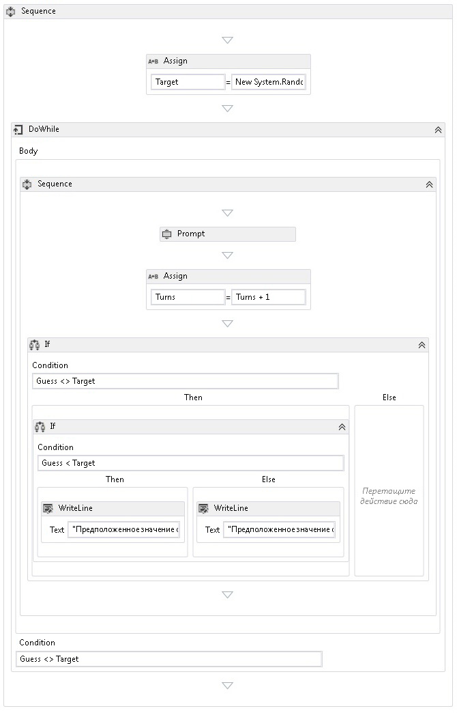

# Как создать последовательный рабочий процесс
Рабочие процессы могут создаваться как из встроенных, так и из пользовательских действий.В этом разделе рассматривается последовательность создания рабочего процесса, который использует как встроенные действия \(например, действие <xref:System.Activities.Statements.Sequence>\), так и пользовательские действия из предыдущего раздела [Как создать действие](../../../docs/framework/windows-workflow-foundation//how-to-create-an-activity.md).Рабочий процесс моделирует игру по угадыванию числа.  
  
> [!NOTE]
>  Каждый раздел в учебнике «Приступая к работе» построен на основе предыдущих разделов.Для изучения этого раздела необходимо сначала пройти раздел [Как создать действие](../../../docs/framework/windows-workflow-foundation//how-to-create-an-activity.md).  
  
> [!NOTE]
>  Чтобы загрузить завершенную версию учебника, см. раздел [Windows Workflow Foundation \(WF45\), учебник «Приступая к работе»](http://go.microsoft.com/fwlink/?LinkID=248976).  
  
### Создание рабочего процесса  
  
1.  Щелкните правой кнопкой мыши **NumberGuessWorkflowActivities** в окне **Обозреватель решений** и выберите **Добавить**, **Новый элемент**.  
  
2.  В узле **Установленные**, **Общие элементы** выберите **Рабочий процесс**.Выберите **Действие** в списке **Рабочий процесс**.  
  
3.  В поле **Имя** введите `SequentialNumberGuessWorkflow` и нажмите кнопку **Добавить**.  
  
4.  Перетащите действие **Sequence** из раздела **Поток управления** в **области элементов** и переместите его на метку **Перетащите действие сюда** в рабочей области конструктора рабочих процессов.  
  
### Создание переменных и аргументов рабочего процесса  
  
1.  Дважды щелкните **SequentialNumberGuessWorkflow.xaml** в **обозревателе решений**, чтобы отобразить рабочий процесс в конструкторе \(если он еще не отображается\).  
  
2.  Нажмите кнопку **Аргументы** в нижнем левом углу конструктора рабочих процессов, чтобы показать область **Аргументы**.  
  
3.  Нажмите кнопку **Создать аргумент**.  
  
4.  В поле **Имя** введите `MaxNumber`, в раскрывающемся списке **Направление** выберите значение **Входной**, выберите **Int32** в раскрывающемся списке **Тип аргумента**, а затем нажмите клавишу ВВОД, чтобы сохранить аргумент.  
  
5.  Нажмите кнопку **Создать аргумент**.  
  
6.  В поле **Имя** под только что добавленным аргументом `MaxNumber` введите `Turns`, в раскрывающемся списке **Направление** выберите значение **Выходной**, выберите тип **Int32** в раскрывающемся списке **Тип аргумента**, а затем нажмите клавишу ВВОД.  
  
7.  Нажмите кнопку **Аргументы** в левом нижнем углу конструктора действий, чтобы закрыть область **Аргументы**.  
  
8.  Нажмите кнопку **Переменные** в нижнем левом углу конструктора рабочих процессов, чтобы показать область **Переменные**.  
  
9. Нажмите кнопку **Создать переменную**.  
  
    > [!TIP]
    >  Если поле **Создать переменную** не отображается, щелкните действие **Sequence** в области конструктора рабочих процессов, чтобы его выбрать.  
  
10. В поле **Имя** введите `Guess`, в раскрывающемся списке **Тип переменной** выберите **Int32**, а затем нажмите клавишу ВВОД, чтобы сохранить переменную.  
  
11. Нажмите кнопку **Создать переменную**.  
  
12. В поле **Имя** введите `Target`, в раскрывающемся списке **Тип переменной** выберите **Int32**, а затем нажмите клавишу ВВОД, чтобы сохранить переменную.  
  
13. Нажмите кнопку **Переменные** в нижнем левом углу конструктора действий, чтобы закрыть область **Переменные**.  
  
### Добавление действий рабочего процесса  
  
1.  Перетащите действие **Assign** из раздела **Примитивы** панели **Область элементов** на действие **Sequence**.Введите `Target` в поле **Назначение** и следующее выражение в поле **Введите выражение C\#** или **Введите выражение VB**.  
  
    ```vb  
    New System.Random().Next(1, MaxNumber + 1)  
    ```  
  
    ```csharp  
    new System.Random().Next(1, MaxNumber + 1)  
    ```  
  
    > [!TIP]
    >  Если окно **Область элементов** не отображается, в меню **Вид** выберите пункт **Область элементов**.  
  
2.  Перетащите действие **DoWhile** из раздела **Поток управленияобласти элементов** и разместите его в рабочем процессе, чтобы оно было под действием **Assign**.  
  
3.  Введите следующее выражение в поле значения свойства **Условие** действия **DoWhile**.  
  
    ```vb  
    Guess <> Target  
    ```  
  
    ```csharp  
    Guess != Target  
    ```  
  
     Действие <xref:System.Activities.Statements.DoWhile> выполняет дочерние действия, а затем выполняет оценку своего условия <xref:System.Activities.Statements.DoWhile.Condition%2A>.Если <xref:System.Activities.Statements.DoWhile.Condition%2A> имеет значение `True`, то действия в <xref:System.Activities.Statements.DoWhile> выполняются повторно.В этом примере проверяется догадка пользователя и <xref:System.Activities.Statements.DoWhile> продолжается до тех пор, пока догадка не будет правильной.  
  
4.  Перетащите действие **Prompt** из раздела **NumberGuessWorkflowActivitiesобласти элементов** и поместите его в действие **DoWhile** из предыдущего шага.  
  
5.  В **окне свойств** действия **Prompt** введите `"EnterGuess"` \(включая кавычки\) в поле **BookmarkName**.Введите `Guess` в поле значения свойства **Result** и введите следующее выражение в поле свойства **Text**.  
  
    ```vb  
    "Please enter a number between 1 and " & MaxNumber  
    ```  
  
    ```csharp  
    "Please enter a number between 1 and " + MaxNumber  
    ```  
  
    > [!TIP]
    >  Если окно **Свойства** не отображается, выберите пункт **Окно свойств** в меню **Вид**.  
  
6.  Перетащите действие **Assign** из раздела **Примитивыобласти элементов** и поместите его в действие **DoWhile** так, чтобы оно следовало за действием **Prompt**.  
  
    > [!NOTE]
    >  При размещении действия **Assign** обратите внимание, что конструктор рабочих процессов автоматически добавляет действие **Sequence**, куда помещается действие **Prompt** и созданное действие **Assign**.  
  
7.  Введите `Turns` в поле **Назначение** и `Turns + 1` в поле **Введите выражение C\#** или **Введите выражение VB**.  
  
8.  Перетащите действие **If** из раздела **Поток управления** панели **Область элементов** в действие **Sequence**, чтобы оно было расположено за вновь добавленным действием **Assign**.  
  
9. Введите следующее выражение в поле значения свойства **Условие** действия **If**.  
  
    ```vb  
    Guess <> Target  
    ```  
  
    ```csharp  
    Guess != Target  
    ```  
  
10. Перетащите еще одно действие **If** из раздела **Поток управленияобласти элементов** и поместите его в разделе **Then** первого действия **If**.  
  
11. Введите следующее выражение в поле значения свойства **Условие** вновь добавленного действия **If**.  
  
    ```vb-c#  
    Guess < Target  
    ```  
  
12. Перетащите два действия **WriteLine** из раздела **Примитивыобласти элементов** и разместите их так, чтобы одно находилось в разделе **Then** добавленного действия **If**, а другое — в разделе **Else**.  
  
13. Щелкните действие **WriteLine** в разделе **Тогда**, чтобы выбрать его, и введите следующее выражение в поле значения свойства **Текст**.  
  
    ```vb  
    "Your guess is too low."  
    ```  
  
14. Щелкните действие **WriteLine** в разделе **Иначе**, чтобы выбрать его, и введите следующее выражение в поле значения свойства **Текст**.  
  
    ```vb  
    "Your guess is too high."  
    ```  
  
     В следующем примере показан завершенный рабочий процесс.  
  
       
  
### Построение рабочего процесса  
  
1.  Чтобы построить решение, нажмите CTRL\+SHIFT\+B.  
  
     Указания по запуску рабочего процесса см. в следующем разделе [Как запустить рабочий процесс](../../../docs/framework/windows-workflow-foundation//how-to-run-a-workflow.md).Если вы уже завершили шаг [Как запустить рабочий процесс](../../../docs/framework/windows-workflow-foundation//how-to-run-a-workflow.md) с другим стилем рабочего процесса и планируете запустить его, используя рабочий процесс последовательности \(начиная с этого шага\), перейдите к разделу [Сборка и запуск приложения](../../../docs/framework/windows-workflow-foundation//how-to-run-a-workflow.md#BKMK_ToRunTheApplication) в [Как запустить рабочий процесс](../../../docs/framework/windows-workflow-foundation//how-to-run-a-workflow.md).  
  
## См. также  
 <xref:System.Activities.Statements.Flowchart>   
 <xref:System.Activities.Statements.FlowDecision>   
 [Программирование в Windows Workflow Foundation](../../../docs/framework/windows-workflow-foundation//programming.md)   
 [Разработка рабочих процессов](../../../docs/framework/windows-workflow-foundation//designing-workflows.md)   
 [Учебник по началу работы](../../../docs/framework/windows-workflow-foundation//getting-started-tutorial.md)   
 [Как создать действие](../../../docs/framework/windows-workflow-foundation//how-to-create-an-activity.md)   
 [Как запустить рабочий процесс](../../../docs/framework/windows-workflow-foundation//how-to-run-a-workflow.md)