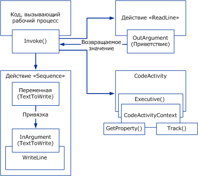

# Общие сведения о Windows Workflow
Рабочий процесс представляет собой набор элементарных единиц, которые называются *действия* , хранятся в виде модели, описывающей реальный процесс. Рабочие процессы позволяют описывать порядок выполнения этапов краткосрочных и долгосрочных работ, а также зависимости между этими этапами. Работа проходит по модели от начала и до конца, а действия могут выполняться как людьми, так и системными функциями.  
  
## Среда выполнения рабочих процессов  
 Каждый работающий экземпляр рабочего процесса создается и обслуживается внутрипроцессной подсистемой среды выполнения, с которой ведущий процесс взаимодействует с помощью одного из следующих инструментов:  
  
-   <xref:System.Activities.WorkflowInvoker>, который вызывает рабочий процесс как метод.  
  
-   <xref:System.Activities.WorkflowApplication> для явного управления выполнением одного экземпляра рабочего процесса.  
  
-   <xref:System.ServiceModel.WorkflowServiceHost> для взаимодействия с помощью сообщений в многоэкземплярных сценариях.  
  
 Каждый из этих классов является оболочкой для среды выполнения основной операции, представленной как объект <xref:System.Activities.ActivityInstance>, ответственный за выполнение операции. В домене приложения может быть несколько объектов <xref:System.Activities.ActivityInstance>, работающих параллельно.  
  
 Каждый из трех предыдущих объектов взаимодействия узлов создается из дерева операций, называемого программой рабочего процесса. С помощью этих типов или настраиваемого узла, которая служит оболочкой для <xref:System.Activities.ActivityInstance>, можно выполнять рабочие процессы внутри любого процесса Windows, включая консольные приложения, приложения на основе форм, службы Windows, [!INCLUDE[vstecasp](../../../includes/vstecasp-md.md)] веб-сайты и Windows Communication Foundation () Службы WCF).  
  
   
Компоненты рабочего процесса в хост-процессе  
  
## Взаимодействие между компонентами рабочего процесса  
 На следующей диаграмме показано взаимодействие компонентов рабочего процесса.  
  
   
  
 На предыдущей диаграмме используется метод <xref:System.Activities.WorkflowInvoker.Invoke%2A> класса <xref:System.Activities.WorkflowInvoker> для вызова нескольких экземпляров рабочего процесса. <xref:System.Activities.WorkflowInvoker> используется для упрощенных рабочих процессов, не требующих управления с сервера. Рабочие же процессы, требующие управления с сервера (например, возобновление <xref:System.Activities.Bookmark>), должны выполняться с помощью <xref:System.Activities.WorkflowApplication.Run%2A>. Чтобы вызвать экземпляр рабочего процесса, не обязательно ждать завершения другого. Среда выполнения допускает одновременное выполнение нескольких экземпляров рабочего процесса.  Вызываются следующие рабочие процессы:  
  
-   Действие <xref:System.Activities.Statements.Sequence>, содержащее дочернее действие <xref:System.Activities.Statements.WriteLine>. Переменная <xref:System.Activities.Variable> родительского действия привязана к <xref:System.Activities.InArgument> дочернего действия. Дополнительные сведения о переменных, аргументов и привязки в разделе [переменных и аргументов](../../../docs/framework/windows-workflow-foundation/variables-and-arguments.md).  
  
-   Настраиваемое действие `ReadLine`. <xref:System.Activities.OutArgument> действия `ReadLine` возвращается в вызывающий метод <xref:System.Activities.WorkflowInvoker.Invoke%2A>.  
  
-   Настраиваемое действие, происходящее от абстрактного класса <xref:System.Activities.CodeActivity>. <xref:System.Activities.CodeActivity> может обращаться к функциям среды выполнения (например, к отслеживанию и свойствам) с помощью <xref:System.Activities.CodeActivityContext>, доступного в качестве параметра метода <xref:System.Activities.CodeActivity.Execute%2A>. Дополнительные сведения об этих функциях времени выполнения см. в разделе [отслеживание и трассировка рабочих процессов](../../../docs/framework/windows-workflow-foundation/workflow-tracking-and-tracing.md) и [свойства выполнения рабочего процесса](../../../docs/framework/windows-workflow-foundation/workflow-execution-properties.md).  
  
## См. также  
 [BizTalk Server 2006 или WF? Выбор средства правой рабочего процесса для проекта](http://go.microsoft.com/fwlink/?LinkId=154901)
