# Производительность Windows Workflow Foundation 4
Дастин Метцгар \(Dustin Metzgar\)  
  
 Уэнлонг Донг \(Wenlong Dong\)  
  
 Корпорация Майкрософт \(Microsoft Corporation\), сентябрь 2010 г.  
  
 В состав Microsoft [!INCLUDE[netfx40_long](../../../includes/netfx40-long-md.md)] входит сильно исправленная версия [!INCLUDE[wf](../../../includes/wf-md.md)] с серьезными доработками в плане производительности.В этой версии имеются значительные изменения по сравнению с предыдущими версиями [!INCLUDE[wf1](../../../includes/wf1-md.md)], поставляемыми в составе платформы .NET Framework 3.0 и [!INCLUDE[netfx35_short](../../../includes/netfx35-short-md.md)].Переработка множества аспектов от ядра модели программирования и среды выполнения до инструментария позволила значительно повысить производительность и удобство использования.В этом разделе описаны важные характеристики производительности этих версий по сравнению с аналогичными характеристиками предыдущей версии.  
  
 Производительность компонентов отдельных рабочих процессов повысилась за счет разницы в скорости выполнения операций умножения между WF3 и WF4.Это сокращает разрыв между службами [!INCLUDE[indigo1](../../../includes/indigo1-md.md)] с написанием кода вручную и службами рабочего процесса [!INCLUDE[indigo2](../../../includes/indigo2-md.md)].Время ожидания рабочего процесса в WF4 значительно сократилось.Производительность сохранения данных повысилась в 2,5–3,0 раза.Заметно снизились издержки при наблюдении за работоспособностью при отслеживании рабочего процесса.Все это делает применение WF4 в приложениях или переход на эту платформу очень привлекательным.  
  
## Терминология  
 Версия [!INCLUDE[wf1](../../../includes/wf1-md.md)], появившаяся в [!INCLUDE[netfx40_short](../../../includes/netfx40-short-md.md)], далее по тексту именуется WF4.[!INCLUDE[wf1](../../../includes/wf1-md.md)] появилась в .Net 3.0 и содержит ряд небольших изменений [!INCLUDE[netfx35_short](../../../includes/netfx35-short-md.md)] с пакетом обновления 1 \(SP1\).Версия [!INCLUDE[netfx35_short](../../../includes/netfx35-short-md.md)] платформы Workflow Foundation далее по тексту именуется WF3.WF3 поставляется в составе [!INCLUDE[netfx40_short](../../../includes/netfx40-short-md.md)] параллельно с WF4.[!INCLUDE[crabout](../../../includes/crabout-md.md)] переносе артефактов WF3 на WF4 см. в разделе [Руководство по миграции в Windows Workflow Foundation 4](http://go.microsoft.com/fwlink/?LinkID=153313)  
  
 [!INCLUDE[indigo1](../../../includes/indigo1-md.md)] является единой моделью программирования \(Майкрософт\) для построения ориентированных на службы приложений.Этот компонент впервые появился в составе .Net 3.0 вместе с WF3 и теперь является одним из ключевых компонентов платформы [!INCLUDE[dnprdnshort](../../../includes/dnprdnshort-md.md)].  
  
 Windows Server AppFabric — это набор интегрированных технологий, которые упрощают построение, масштабирование и управление составными и веб\-приложениями, работающими под управлением IIS.В состав этого продукта входят средства для наблюдения за службами и рабочими процессами и управления ими.[!INCLUDE[crdefault](../../../includes/crdefault-md.md)][Windows Server AppFabric](http://msdn.microsoft.com/windowsserver/ee695849.aspx)  
  
## Цели  
 Цель этого раздела — показать характеристики производительности WF4 с данными для различных сценариев.Здесь также предоставлено подробное сравнение WF4 с WF3, которое отражает улучшения, появившиеся в новой версии.Сценарии и данные, представленные в этой статье, определяют базовые затраты различных аспектов WF4 и WF3.Эти данные помогут разобраться с характеристиками производительности WF4 и могут оказаться полезными при планировании перехода с WF3 на WF4 или использовании WF4 при разработке новых приложений.Однако выводы на основе сведений, представленных в этой статье, следует делать с осторожностью.Производительность приложения составного рабочего процесса в большой степени зависит от его реализации и способа интеграции различных компонентов.Для определения параметров производительности каждого приложения необходимо проведение измерений.  
  
## Общие сведения о повышении производительности WF4  
 При проектировании и разработке WF4 были реализованы меры для повышения производительности и масштабируемости, которые описаны в следующих разделах.  
  
### Среда выполнения WF  
 В основе среды выполнения [!INCLUDE[wf1](../../../includes/wf1-md.md)] лежит асинхронный планировщик, который управляет выполнением действий рабочего процесса.Он обеспечивает эффективную, предсказуемую среду выполнения для действия.Среда содержит строго определенный контракт для запуска, продолжения, завершения, отмены, обработки исключений и прогнозируемую потоковую модель.  
  
 Планировщик среды выполнения WF4 более эффективен по сравнению с WF3.В нем используется тот же пул потоков ввода\-вывода, что и в [!INCLUDE[indigo2](../../../includes/indigo2-md.md)], который очень эффективен при выполнении пакетных рабочих элементов.Внутренняя очередь рабочих элементов оптимизирована для самых распространенных шаблонов использования.Среда выполнения WF4 также обеспечивает значительно облегченное управление состоянием выполнения с минимальной степенью синхронизации и логикой обработки событий, тогда как в WF3 это делается с помощью громоздкой регистрации событий и их вызова для выполнения сложной синхронизации при смене состояний.  
  
### Хранение и поток данных  
 В WF3 данные, связанные с действием, моделируется через свойства зависимостей, которые реализуются типом <xref:System.Windows.DependencyProperty>.В [!INCLUDE[avalon1](../../../includes/avalon1-md.md)] появился шаблон свойств зависимостей.В целом этот шаблон стал более гибким и обеспечивает простоту привязки данных и другие функции пользовательского интерфейса.Однако при этом требуется объявление свойств как статических полей в определении рабочего процесса.Когда среда выполнения [!INCLUDE[wf1](../../../includes/wf1-md.md)] устанавливает или возвращает значения свойств, задействуется громоздкая логика поиска.  
  
 В WF4 используются прозрачные правила видимости, которые значительно повышают эффективность обработки данных в рабочем процессе.При этом данные, хранимые внутри действия, отделяются от данных, проходящих через границы действия, за счет разделения двух понятий: переменные и аргументы.Применение прозрачной иерархической видимости для переменных и аргументов типа In, Out и InOut значительно снижает сложность работы с данными в действиях. Кроме того, автоматически обеспечивается жизненный цикл данных.В аргументах действий имеются строгие определения сигнатур.Простой проверкой действия можно определить, какие данные оно ожидает получить и какие данные будут получены в результате выполнения.  
  
 В WF3 инициализация действий происходила в момент создания рабочего процесса.В WF 4 действия инициализируются только при выполнении соответствующих действий.Это позволяет упростить жизненный цикл действия, не выполняя операции Initialize и Uninitialize при создании нового экземпляра рабочего процесса, что также повышает производительность.  
  
### Поток управления  
 Как и любой другой язык программирования, [!INCLUDE[wf1](../../../includes/wf1-md.md)] обеспечивает поддержку потока управления выполнением для определений рабочих процессов. Для этого предусмотрен целый набор действий управления выполнением для последовательностей, циклов, ветвления и других операций.В WF3, когда возникала необходимость в повторном выполнении некоторого действия, создавался новый контекст выполнения <xref:System.Workflow.ComponentModel.ActivityExecutionContext>, затем действие клонировалось через громоздкую логику сериализации и десериализации на основе объекта <xref:System.Runtime.Serialization.Formatters.Binary.BinaryFormatter>.Как правило, производительность циклических потоков управления была ниже, чем при выполнении последовательности действий.  
  
 В WF4 это делается несколько иначе.Берется шаблон действия, и создается новый объект ActivityInstance, который затем добавляется в очередь планировщика.Эта процедура заключается всего лишь в явном создании объекта и благодаря этому значительно облегчена.  
  
### Асинхронное программирование  
 Как правило, у приложений производительность и масштабируемость выше при асинхронном программировании долго выполняющихся операций, блокирующих работу остального кода, например операций ввода\-вывода или распределенных вычислений.В WF4 предусмотрена поддержка асинхронной работы через базовые типы действий <xref:System.Activities.AsyncCodeActivity>, <xref:System.Activities.AsyncCodeActivity%601>.Среда выполнения обеспечивает собственную поддержку асинхронных действий и поэтому может автоматически перевести экземпляр в зону несохраняемости до окончания асинхронной обработки.От этих типов могут наследоваться пользовательские действия, выполняющие асинхронную обработку без удержания потока планировщика рабочего процесса и не блокируя другие действия, которые могут работать параллельно.  
  
### Обмен сообщениями  
 Первоначально в WF3 была очень ограниченная поддержка передачи сообщений через внешние события или вызов веб\-служб.В платформе .Net 3.5 рабочие процессы могли быть реализованы в качестве клиентов [!INCLUDE[indigo2](../../../includes/indigo2-md.md)] или доступны как службы [!INCLUDE[indigo2](../../../includes/indigo2-md.md)] через <xref:System.Workflow.Activities.SendActivity> и <xref:System.Workflow.Activities.ReceiveActivity>.В WF4 понятие программирования на основе событий рабочих процессов получило дальнейшее развитие за счет более тесной интеграции логики передачи сообщений [!INCLUDE[indigo2](../../../includes/indigo2-md.md)] в WF.  
  
 Конвейер унифицированной обработки сообщений, предусмотренный в [!INCLUDE[indigo2](../../../includes/indigo2-md.md)] на платформе .Net 4, помогает службам WF4 значительно повысить производительность и масштабируемость по сравнению с WF3.Кроме того, WF4 обеспечивает более широкую поддержку программирования передачи сообщений за счет использования модели сложных шаблонов обмена сообщениями \(MEP\).Разработчик может выбрать либо типизированный контракт службы, который обеспечивает простоту программирования, либо нетипизированный, который избавляет от ресурсоемкой сериализации и поэтому дает более высокую производительность.Поддержка кэширования канала на стороне клиента с помощью класса <xref:System.ServiceModel.Activities.SendMessageChannelCache> в WF4 дает возможность разработчикам создавать быстро работающие приложения с минимальными усилиями.[!INCLUDE[crdefault](../../../includes/crdefault-md.md)][Изменение уровней совместного использования кэша для действий «Send»](../../../docs/framework/wcf/feature-details/changing-the-cache-sharing-levels-for-send-activities.md).  
  
### Декларативное программирование  
 WF4 обеспечивает платформу для простого и прозрачного декларативного программирования для моделирования бизнес\-процессов и служб.Модель программирования поддерживает полностью декларативное создание действий без побочного кода, что в значительной степени упрощает создание рабочих процессов.В [!INCLUDE[netfx40_short](../../../includes/netfx40-short-md.md)] платформа декларативного программирования на основе XAML унифицирована в рамках единой сборки System.Xaml.dll и поддерживает как WPF, так и WF.  
  
 В WF4 на основе XAML выполняется истинная декларативность, которая позволяет полностью выполнить определение рабочего процесса в разметке XML, действия и типы которой отражаются в .NET.Этого было трудно добиться в WF3, где использовался формат XOML без включения фонового кода пользовательской логики.Новый стек XAML в .Net 4 имеет гораздо более высокую производительность сериализации\-десериализации артефактов рабочих процессов, делая декларативное программирование более целостным и привлекательным.  
  
### Конструктор рабочих процессов  
 Поддержка полностью декларативного программирования для WF4 очевидным образом предъявляет более высокие требования к производительности на стадии конструирования при обработке больших рабочих процессов.Конструктор рабочих процессов в WF4 гораздо лучше масштабируется во время работы с большими рабочими процессами, чем конструктор для WF3.Имея поддержку виртуализации пользовательского интерфейса, конструктор легко, в течение нескольких секунд, загружает большие проекты, содержащие тысячи действий. В WF3 это было практически невозможно.  
  
## Сравнения производительности на уровне компонентов  
 В этом разделе содержатся данные по прямому сравнению отдельных действий в рабочих процессах WF3 и WF4.Такие важнейшие аспекты, как сохраняемость, значительно более глубоко влияют на производительность, чем отдельные компоненты действий.Повышение производительности работы отдельных компонентов в WF4 достаточно важно, поскольку теперь скорость их работы сравнима с логикой, закодированной вручную.Пример этого описан в следующем разделе: «Сценарий композиции служб».  
  
### Настройка среды  
 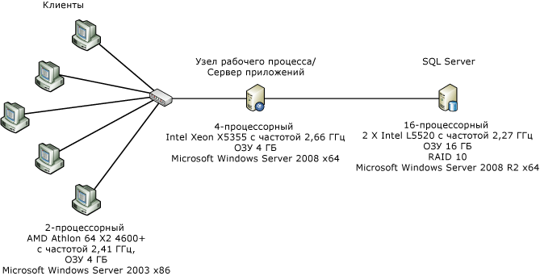  
  
 На приведенном выше рисунке показана конфигурация компьютера для измерения производительности на уровне компонентов.Одиночный сервер и пять клиентов соединены через один сетевой интерфейс Ethernet 1 Гбит\/с.Для простоты измерений на сервере настроено использование одного двухпроцессорного или четырехпроцессорного ядра под управлением Windows Server 2008 x86.Загрузка ЦП поддерживалась на уровне, близком к 100%.  
  
### Сведения о тесте  
 <xref:System.Workflow.Activities.CodeActivity> является простейшим из действий, которые могут быть использованы в рабочем процессе WF3.Действие вызывает метод с фоновым кодом, в котором разработчик размещает свой код.В WF4 нет прямого аналога действия <xref:System.Workflow.Activities.CodeActivity>, обеспечивающего такие же возможности.Обратите внимание, что в WF4 имеется базовый класс <xref:System.Activities.CodeActivity>, который никак не связан с классом <xref:System.Workflow.Activities.CodeActivity> в WF3.Создателям рабочих процессов рекомендуется создавать пользовательские действия и разрабатывать рабочие процессы только на XAML.В приведенных ниже тестах действие `Comment` используется вместо пустого <xref:System.Workflow.Activities.CodeActivity> в рабочих процессах WF4.Действие `Comment` содержит следующий код:  
  
```  
[ContentProperty("Body")]  
    public sealed class Comment : CodeActivity  
    {  
        public Comment()  
            : base()  
        {  
        }  
  
        [DefaultValue(null)]  
        public Activity Body  
        {  
            get;  
            set;  
        }  
  
        protected override void Execute(CodeActivityContext context)  
        {  
        }  
    }  
  
```  
  
### Пустой рабочий процесс  
 В этом тесте используется последовательный рабочий процесс без вложенных действий.  
  
### Одно действие  
 Последовательный рабочий процесс, содержащий одно вложенное действие.В случае WF3 это действие <xref:System.Workflow.Activities.CodeActivity>, не содержащее кода, либо действие `Comment` в случае WF4.  
  
### Цикл while на 1000 итераций  
 Последовательный рабочий процесс содержит одно действие <xref:System.Activities.Statements.While> с одним вложенным действием в цикле, в котором ничего не делается.  
  
### Сравнение действий Replicator и ParallelForEach  
 Действие <xref:System.Workflow.Activities.ReplicatorActivity> в WF3 имеет последовательный и параллельный режимы выполнения.В последовательном режиме производительность действия аналогична производительности <xref:System.Workflow.Activities.WhileActivity>.Действие <xref:System.Workflow.Activities.ReplicatorActivity> лучше всего подходит для параллельного выполнения.Аналогом этого действия в WF4 является <xref:System.Activities.Statements.ParallelForEach>.  
  
 На следующей схеме показаны рабочие процессы, используемые в данном тесте.Рабочий процесс WF3 слева, а рабочий процесс WF4 справа.  
  
 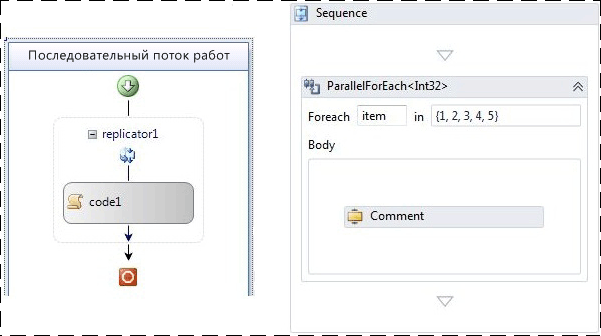  
  
### Последовательный рабочий процесс с пятью действиями  
 Этот тест показывает эффект последовательного выполнения нескольких действий.В последовательности пять действий.  
  
### Область транзакции  
 Тест области транзакции немного отличается от других тестов в том плане, что новый экземпляр рабочего процесса не создается в каждой итерации.Вместо этого рабочий процесс структурирован в виде цикла, в котором содержится <xref:System.Activities.Statements.TransactionScope>, содержащий одно действие, которое не работает.Каждый запуск пакета из 50 итераций в цикле while продолжается как одна операция.  
  
### Компенсация  
 Рабочий процесс WF3 содержит единственное компенсируемое действие `WorkScope`.Это действие просто реализует интерфейс <xref:System.Workflow.ComponentModel.ICompensatableActivity>:  
  
```  
class WorkScope :   
        CompositeActivity, ICompensatableActivity  
    {  
        public WorkScope() : base() { }  
  
        public WorkScope(string name)  
        {  
            this.Name = name;  
        }  
  
        public ActivityExecutionStatus Compensate(  
            ActivityExecutionContext executionContext)  
        {  
            return ActivityExecutionStatus.Closed;  
        }  
    }  
```  
  
 Обработчик ошибок настраивается на действие `WorkScope`. Рабочий процесс WF4 настолько же упрощен.<xref:System.Activities.Statements.CompensableActivity> имеет основной код и обработчик компенсации.Далее в последовательности выполняется явная компенсация.Действие текста и действие обработчика компенсации — пустые реализации:  
  
```  
public sealed class CompensableActivityEmptyCompensation : CodeActivity  
    {  
        public CompensableActivityEmptyCompensation()  
            : base() { }  
  
        public Activity Body { get; set; }  
  
        protected override void Execute(CodeActivityContext context) { }  
    }  
    public sealed class CompensableActivityEmptyBody : CodeActivity  
    {  
        public CompensableActivityEmptyBody()  
            : base() { }  
  
        public Activity Body { get; set; }  
  
        protected override void Execute(CodeActivityContext context) { }  
    }  
  
```  
  
 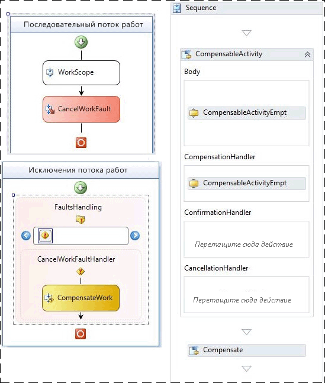  
  
 Рис 2. Базовые рабочие процессы компенсации WF3 \(слева\) и WF4 \(справа\)  
  
### Результаты теста производительности  
 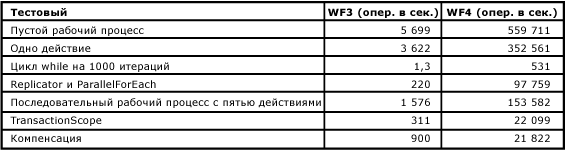  
  
 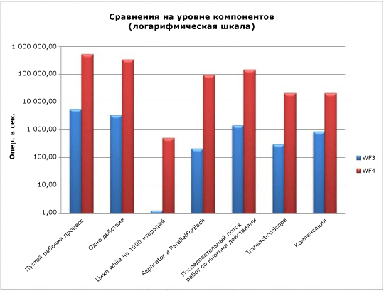  
  
 Все тесты измеряются в рабочих процессах в секунду, за исключением теста области транзакции.Исходя из вышесказанного, производительность среды выполнения [!INCLUDE[wf1](../../../includes/wf1-md.md)] улучшилась в равной мере в разных областях, особенно в тех, где требуется многократное выполнение одного и того же действия \(например, в цикле\).  
  
## Сценарий композиции служб  
 Как показано в предыдущем разделе «Сравнение производительности на уровне компонентов», в WF4 значительно уменьшены накладные расходы по сравнению с WF3.Службы рабочих процессов [!INCLUDE[indigo2](../../../includes/indigo2-md.md)] теперь почти соответствуют производительности кодируемых вручную служб [!INCLUDE[indigo2](../../../includes/indigo2-md.md)], но по\-прежнему имеют все преимущества среды выполнения [!INCLUDE[wf1](../../../includes/wf1-md.md)].Данный тестовый сценарий сравнивает службу [!INCLUDE[indigo2](../../../includes/indigo2-md.md)] со службой рабочих процессов [!INCLUDE[indigo2](../../../includes/indigo2-md.md)] в WF4.  
  
### Служба интернет\-магазина  
 Одной из сильных сторон [!INCLUDE[wf2](../../../includes/wf2-md.md)] является способность создания составных процессов на основе нескольких служб.Например, имеется служба интернет\-магазина, которая координирует два вызова служб при размещении заказа.На первом этапе производится проверка заказа с помощью службы проверки заказа.На втором этапе производится заполнение заказа с помощью службы склада.  
  
 Обе серверные службы — проверки заказа и склада — одинаковы в обоих тестах.Изменяющийся компонент — служба интернет\-магазина, которая выполняет координацию.В первом случае служба кодируется вручную как служба [!INCLUDE[indigo2](../../../includes/indigo2-md.md)].Во втором случае она написана как служба рабочего процесса [!INCLUDE[indigo2](../../../includes/indigo2-md.md)] в WF4.Функции, относящиеся к [!INCLUDE[wf1](../../../includes/wf1-md.md)], например отслеживание сохраняемости, для этого теста будут отключены.  
  
### Среда  
   
  
 Клиентские запросы поступают к службе интернет\-магазина по протоколу HTTP от множества компьютеров.Все три службы размещены на одном компьютере.Транспортный уровень между службой интернет\-магазина и серверными службами — TCP или HTTP.Измерения операций производятся по числу обработанных вызовов `PurchaseOrder` к службе интернет\-магазина.Пул каналов — новая возможность, появившаяся в WF4.В [!INCLUDE[indigo2](../../../includes/indigo2-md.md)] часть пула этого тестового канала не поставляется в готовом для использования виде, поэтому в службе интернет\-магазина используется простая реализация пула, написанная вручную.  
  
### Производительность  
 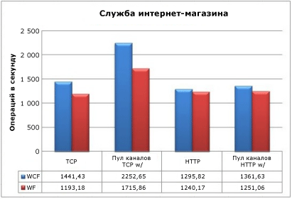  
  
 Соединение с серверными службами по протоколу TCP без пула каналов приведет к тому, что пропускная способность службы [!INCLUDE[wf1](../../../includes/wf1-md.md)] снизится на 17,2 %.При наличии пула каналов снижение составит около 23,8 %.Для протокола HTTP эффект будет намного меньше: 4,3 % без пула и 8,1 % с пулом.Также важно отметить, что наличие пула каналов дает мало преимуществ при использовании HTTP.  
  
 Хотя среда выполнения WF4 вызывает некоторые издержки по сравнению со службами [!INCLUDE[indigo2](../../../includes/indigo2-md.md)], в этом тесте будет рассматриваться худший случай.Две серверные службы в этом тесте выполняют очень небольшую работу.В реальном полнофункциональном сценарии эти службы будут выполнять более ресурсоемкие операции — обращаться к базе данных, что делает нагрузку на транспортный слой менее важной.Это и новые функции, которые доступны в WF4, превращает Workflow Foundation в отличный выбор при создании служб координации.  
  
## Важные замечания о производительности  
 Все функциональные области в этом разделе, за исключением взаимодействия, сильно изменились в WF4 по сравнению с WF3.Это оказало влияние как на конструирование приложений рабочих процессов, так и на производительность.  
  
#### Задержки активации рабочего процесса  
 В приложении службы рабочего процесса [!INCLUDE[indigo2](../../../includes/indigo2-md.md)] задержка при запуске нового или загрузке существующего рабочего процесса является важной, так как она может заблокировать выполнение.В данном проверочном варианте производится измерение узла WF3 XOML в сравнении с узлом WF4 XAMLX в типичном сценарии.  
  
##### Настройка среды  
 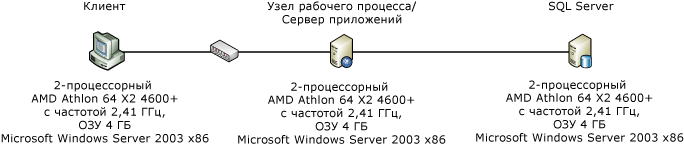  
  
##### Настройка теста  
 В данном сценарии клиентский компьютер обращается к службе рабочего процесса [!INCLUDE[indigo2](../../../includes/indigo2-md.md)] с помощью корреляции на основе контекста.Корреляция контекста требует специальной привязки контекста и использует заголовок контекста или файл cookie для связывания сообщений с нужным экземпляром рабочего процесса.С точки зрения производительности преимущество заключается в том, что идентификатор корреляции располагается в заголовке сообщения, поэтому не требуется синтаксический анализ его текста.[!INCLUDE[crabout](../../../includes/crabout-md.md)] об использовании корреляции контекста см. раздел [Корреляция обмена контекстом](../../../docs/framework/wcf/feature-details/context-exchange-correlation.md)  
  
 Служба создаст новый рабочий процесс с запросом и отправит ответ немедленно, чтобы измерение задержки не включало в себя время, затрачиваемое на выполнение рабочего процесса.Рабочий процесс WF3 представляет собой XOML с фоновым кодом, а рабочий процесс WF4 полностью описан на XAML.Рабочий процесс WF4 выглядит следующим образом:  
  
 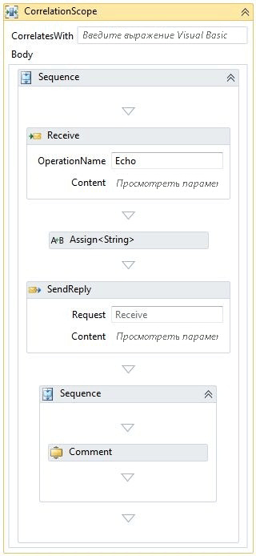  
  
 Действие <xref:System.ServiceModel.Activities.Receive> создает экземпляр рабочего процесса.Значение, переданное в полученном сообщении, повторяется в ответном сообщении.Последовательность после ответа содержит оставшуюся часть рабочего процесса.В приведенном выше примере показано только одно действие комментария.Число действий комментариев изменено, чтобы имитировать сложный рабочий процесс.Действие комментария эквивалентно действию WF3 <xref:System.Workflow.Activities.CodeActivity>, которое ничего не делает.[!INCLUDE[crabout](../../../includes/crabout-md.md)] действии комментария см. в подразделе «Сравнение производительности на уровне компонентов» выше в данной статье.  
  
##### Результаты теста  
 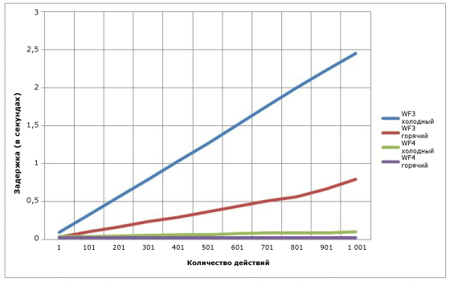  
  
 Рис 3. Задержка при холодном и теплом запуске службы рабочего процесса WCF  
  
 На приведенной выше диаграмме «холодный» относится к случаю, когда не существует объекта <xref:System.ServiceModel.WorkflowServiceHost> для указанного рабочего процесса.Другими словами, «холодная» задержка — это когда рабочий процесс используется в первый раз и для его компиляции нужен XOML или XAML.«Теплая» задержка — это время, необходимое для создания нового экземпляра рабочего процесса, когда его тип уже скомпилирован.При использовании WF4 сложность рабочего процесса почти не влияет на результат, но при использовании WF3 линейно возрастает.  
  
#### Пропускная способность корреляции  
 В WF4 появилась новая функция корреляции на основе содержимого.В WF3 реализована только корреляция на основе контекста.Она может быть выполнена только через специальные привязки каналов [!INCLUDE[indigo2](../../../includes/indigo2-md.md)].Идентификатор рабочего потока при использовании этих привязок вставляется в заголовок сообщения.Среда выполнение WF3 может определить рабочий процесс только по этому идентификатору.В корреляции на основе содержимого автор рабочего процесса может получить ключ корреляции на основе релевантных данных, например по номеру счета или идентификатору клиента.[!INCLUDE[crabout](../../../includes/crabout-md.md)] корреляции на основе содержимого см. в разделе [Корреляция по содержимому](../../../docs/framework/wcf/feature-details/content-based-correlation.md).  
  
 Корреляция на основе контекста работает быстрее, так как ее ключ находится в заголовке.Поэтому его можно считать из сообщения без десериализации и копирования сообщения.В корреляции на основе содержимого ключ хранится в теле сообщения.Его получение производится через выражение XPath.Затраты на такую обработку зависят от размера сообщения, глубины расположения ключа в нем и от числа ключей.Данный тест сравнивает корреляцию на основе содержимого и на основе контекста, а также показывает снижение производительности при использовании нескольких ключей.  
  
#### Настройка среды  
   
  
#### Настройка теста  
 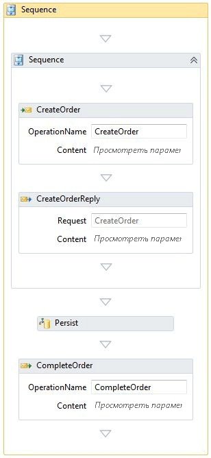  
  
 Рабочий процесс, показанный выше, совпадает с тем, что использовался выше в подразделе «Сохраняемость».Для тестов корреляции без сохраняемости в среде выполнения поставщик сохраняемости не устанавливается.Корреляция происходит в двух методах: CreateOrder и CompleteOrder.  
  
#### Результаты теста  
 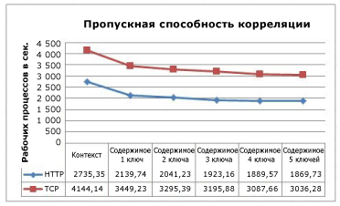  
  
 Этот график показывает снижение производительности в зависимости от количества ключей, используемых в корреляции на основе содержимого.Сходство кривых для TCP и HTTP указывает на издержки, связанные с этими протоколами.  
  
#### Корреляция с сохраняемостью  
 В сохраняемом рабочем процессе при корреляции на основе содержимого нагрузка на ЦП переносится со среды выполнения рабочего процесса на базу данных SQL.Хранимые процедуры поставщика сохраняемости SQL выполняют действия по подбору ключей при поиске соответствующего рабочего процесса.  
  
 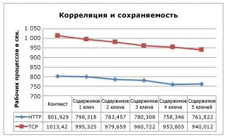  
  
 Корреляция на основе контекста работает быстрее, чем корреляция на основе содержимого.Чаще, однако, на производительность влияет сохраняемость, а не корреляция.  
  
### Пропускная способность сложного рабочего процесса  
 Сложность процесса определяется не только по количеству действий.Составные действия могут содержать несколько дочерних элементов, а те, в свою очередь, также могут быть составными действиями.Увеличение числа уровней вложенности приводит к увеличению числа действий, находящихся в состоянии выполнения в текущий момент, а также используемых переменных.Этот тест сравнивает пропускную способность WF4 при выполнении сложных рабочих процессов по сравнению с WF3.  
  
### Настройка теста  
 Эти тесты проводились на 4\-процессорном компьютере Intel Xeon X5355 с частотой 2,66 ГГц и 4 ГБ памяти под управлением Windows Server 2008 x64.Код теста запускался в одном процессе с потоком на ядро, что позволяет добиться 100 % загрузки ЦП.  
  
 У рабочих процессов, созданных для этого теста, есть две основные переменные: глубина и число действий в каждой из последовательностей.Каждый уровень вложенности включает параллельные действия, циклы, решения, присваивания и последовательности.В приведенном ниже конструкторе WF4 изображена блок\-схема верхнего уровня.Каждое действие блок\-схемы похоже на основную блок\-схему.Возможно, для отображения этого рабочего процесса удобно будет использовать фрактал, где глубина будет ограничена параметрами теста.  
  
 Количество действий в данном тесте определяется глубиной и числом действий в последовательности.Следующее уравнение вычисляет число действий в тесте для WF4:  
  
   
  
 Счетчик действий в тесте для WF3 можно вычислить с помощью несколько другого уравнения, поскольку там имеется лишняя последовательность:  
  
   
  
 где «d» — глубина, а «a» — число действий в последовательности.Логика этих формул заключается в том, что первая константа, умноженная на «a», — это номер последовательности, а вторая константа — постоянное число действий на текущем уровне.В каждой блок\-схеме имеется три дочерних действия.На нижнем уровне вложенности эти блок\-схемы пусты, но на других уровнях они представляют собой копии основной блок\-схемы.Число действий в определении рабочего процесса для каждой вариации теста приведено в следующей таблице.  
  
   
  
 Число действий в определении рабочего процесса резко увеличивается с каждым новым уровнем вложенности.Однако в экземпляре данного рабочего процесса выполняется только один путь к каждой точке принятия решений, поэтому фактически выполняется лишь небольшое подмножество действий.  
  
 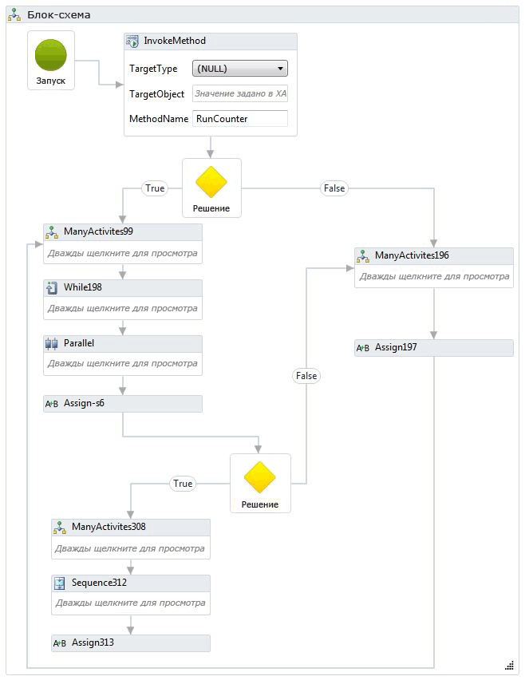  
  
 Эквивалентный рабочий процесс создан для WF3.В области конструирования конструктора WF3 показан весь рабочий процесс целиком, поэтому он слишком велик для отображения в этом разделе.Ниже приведен фрагмент рабочего процесса.  
  
   
  
 Для использования вложенности в крайних случаях в составе этого теста есть другой рабочий процесс, содержащий 100 вложенных последовательностей.Самая внутренняя последовательность содержит один `Comment` или <xref:System.Workflow.Activities.CodeActivity>.  
  
 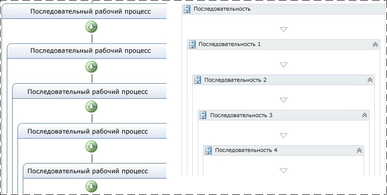  
  
 Отслеживание и сохраняемость в этом тесте не используются.  
  
### Результаты теста  
 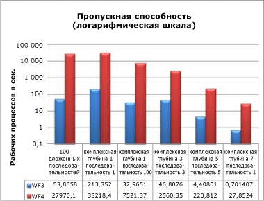  
  
 Даже в сложных рабочих процессах, содержащих множество действий и уровней вложенности, результаты производительности согласуются с показателями пропускной способности, приведенными выше в этой статье.Пропускная способность WF4 на порядок выше и сравнима с логарифмической шкалой.  
  
### Память  
 Издержки памяти Windows Workflow Foundation измеряются в двух ключевых областях: сложность рабочих процессов и число их определений.Измерения памяти производились на рабочей станции под управлением 64\-разрядной версии Windows 7.Существует множество способов получить размер рабочего набора — счетчики производительности, опрос Environment.WorkingSet или использование средства наподобие VMMap от [VMMap](http://technet.microsoft.com/sysinternals/dd535533.aspx).Для получения и проверки результатов каждого из тестов использовалось сочетание методов.  
  
### Тест сложности рабочего процесса  
 Тест сложности рабочего процесса определяет разницу рабочих наборов в зависимости от сложности рабочего процесса.Помимо сложных рабочих процессов, которые использовались в предыдущем подразделе, добавлены новые вариации, чтобы реализовать два базовых случая: рабочий процесс с единственным действием и последовательность из 1000 действий.Для этих тестов рабочие процессы инициализировались и выполнялись последовательно в цикле в течение минуты.Каждая вариация теста запускалась трижды. При этом регистрировались средние данные по трем запускам.  
  
 Для двух новых базовых тестов рабочие процессы выглядят следующим образом:  
  
 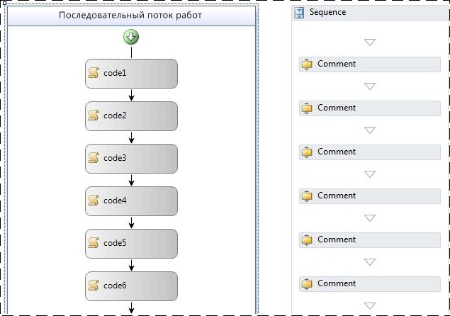  
  
 В рабочем процессе WF3, показанном выше, использованы пустые действия <xref:System.Workflow.Activities.CodeActivity>.В приведенном выше рабочем процессе для WF4 используются действия `Comment`.Действие `Comment` описано в подразделе «Сравнение производительности на уровне компонентов» выше в данной статье.  
  
 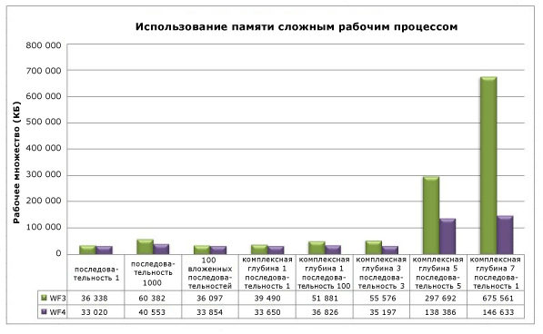  
  
 Один из очевидных трендов, которые можно заметить в этом графике, — вложенность оказывает минимальный эффект на использование памяти как в WF3, так и в WF4.В наибольшей степени на использование памяти влияет число действий в рабочем процессе.Исходя из данных последовательности 1000, различия между последовательностью 5 с глубиной сложности 5 и последовательностью 1 с глубиной сложности 7, очевидно, что, когда количество элементов действий приближается к нескольким тысячам, увеличение использования памяти повышается более заметно.В крайнем случае \(глубина 7 последовательности 1\), где имеется около 29 тысяч действий, WF4 занимает почти на 79 % меньше памяти, чем WF3.  
  
### Тест нескольких определений рабочих процессов  
 Измерение памяти, занимаемой определением рабочего процесса, разделено на два отдельных теста, поскольку существуют разные доступные варианты размещения в WF3 и WF4.Тесты выполняются иначе, чем тест сложности рабочего процесса, поскольку данный рабочий процесс создается и выполняется только один раз для каждого определения.Это обусловлено тем, что определение рабочего процесса и его узел остаются в памяти в течение жизненного цикла домена приложений.Память, занятая запущенным экземпляром рабочего процесса, будет очищена при следующей сборке мусора.Руководство по миграции для WF4 содержит более подробные сведения о возможности размещения.[!INCLUDE[crdefault](../../../includes/crdefault-md.md)][Рецепты миграции WF: размещение рабочего процесса](http://go.microsoft.com/fwlink/?LinkID=153313).  
  
 Создание множества определений рабочих процессов для данного теста можно выполнить несколькими разными способами.Например, можно создать код для формирования набора из 1000 рабочих процессов, различающихся только именем, и сохранить их в отдельных файлах.Такой подход был сделан для теста размещения в консоли.В WF3 для запуска определений рабочих процессов использовался класс <xref:System.Workflow.Runtime.WorkflowRuntime>.В WF4 можно либо с помощью <xref:System.Activities.WorkflowApplication> создать отдельный экземпляр рабочего процесса, либо непосредственно использовать <xref:System.Activities.WorkflowInvoker> для запуска действия аналогично вызову метода.<xref:System.Activities.WorkflowApplication> — это ведущее приложение для одиночного экземпляра рабочего процесса, которое по возможностям ближе всего соответствует <xref:System.Workflow.Runtime.WorkflowRuntime>, поэтому он использовался в данном тесте.  
  
 При размещении рабочих процессов в IIS можно с помощью <xref:System.Web.Hosting.VirtualPathProvider> создать новый <xref:System.ServiceModel.WorkflowServiceHost> вместо формирования всех файлов XAMLX или XOML.<xref:System.Web.Hosting.VirtualPathProvider> обрабатывает входящий запрос и выдает в ответ «виртуальный файл», который может быть загружен из базы данных или, как в данном случае, сформирован на ходу.Поэтому нет необходимости создавать 1000 физических файлов.  
  
 Определения рабочих процессов, используемые в тесте консоли, были простыми последовательными рабочими процессами, содержащими одно действие.Единичное действие было пустым действием <xref:System.Workflow.Activities.CodeActivity> в случае WF3 и действием `Comment` в случае WF4.При размещении в IIS использовались рабочие процессы, которые запускаются при получении сообщения и завершаются при отправке ответа:  
  
 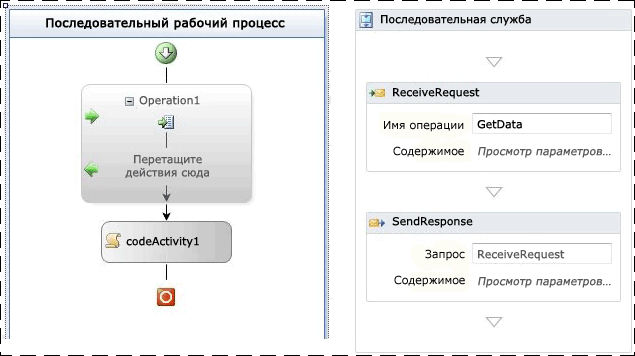  
  
 Рис. 4. Рабочий процесс WF3 с ReceiveActivity и рабочий процесс WF4 с шаблоном «запрос\-ответ»  
  
 В следующей таблице показана дельта рабочего набора между единственным определением рабочего процесса и 1001 определением.  
  
|Варианты размещения|Дельта рабочего множества для WF3|Дельта рабочего множества для WF4|  
|-------------------------|---------------------------------------|---------------------------------------|  
|Рабочие процессы, размещаемые в консольном приложении|18 МБ|9 МБ|  
|Службы рабочих процессов, размещаемые в IIS|446 МБ|364 МБ|  
  
 При размещении определения рабочего процесса в IIS будет занято больше памяти из\-за необходимости хранения <xref:System.ServiceModel.WorkflowServiceHost>, подробных артефактов службы [!INCLUDE[indigo2](../../../includes/indigo2-md.md)] и логики обработки сообщений, связанной с узлом.  
  
 Для размещения в консольном приложении рабочие процессы WF3 реализованы в коде, а не в XOML.В WF4 по умолчанию используется XAML.Код XAML хранится в сборке как внедренный ресурс и компилируется во время выполнения при необходимости обеспечения реализации рабочего процесса.Есть некоторые издержки, связанные с этим процессом.Чтобы адекватно сравнить WF3 и WF4, вместо XAML были использованы рабочие процессы в коде.Ниже показан пример одного из рабочих процессов WF4.  
  
```  
public class Workflow1 : Activity  
{  
    protected override Func<Activity> Implementation  
    {  
        get  
        {  
            return new Func<Activity>(() =>  
            {  
                return new Sequence  
                {  
                    Activities = {  
                        new Comment()  
                    }  
                };  
            });  
        }  
        set  
        {  
            base.Implementation = value;  
        }  
    }  
}  
  
```  
  
 Существует множество других факторов, которые могут повлиять на потребление памяти.Тот же совет относится и ко всем управляемым программам.В среде размещения в IIS объект <xref:System.ServiceModel.WorkflowServiceHost>, созданный для определения рабочего процесса, остается в памяти до перезапуска пула приложений.Это следует учитывать при написании расширений.Кроме того, лучше не пользоваться глобальными переменными \(областью действия которых является весь рабочий процесс\) и при возможности ограничивать область видимость переменных.  
  
## Службы среды выполнения рабочих процессов  
  
### Сохраняемость  
 И WF3 и WF4 поставляются с поставщиком сохраняемости SQL.Поставщик сохраняемости SQL в WF3 — это простая реализация, которая сериализует экземпляр рабочего процесса и сохраняет его в большом двоичном объекте.В этом смысле производительность поставщика в большой степени зависит от размера экземпляра рабочего процесса.В WF3 размер экземпляра может вырасти по разным причинам, как обсуждалось ранее в этом документе.Многие клиенты решают отказаться от использования поставщика сохраняемости SQL, устанавливаемого по умолчанию, так как сохранение сериализованного экземпляра в базе данных не дает доступа к состоянию рабочего процесса.Чтобы найти конкретный рабочий процесс, не зная его идентификатора, приходится выполнять десериализацию каждого сохраненного экземпляра и просматривать его содержимое.Многие разработчики предпочитают создавать собственные поставщики сохраняемости, чтобы обойти это препятствие.  
  
 В поставщике сохраняемости SQL в WF4 предпринята попытка решить некоторые из этих проблем.В таблицах сохраняемости доступна некоторая дополнительная информация, например активные закладки и свойства с возможностью продвижения.Функция корреляции на основе содержимого, появившаяся в WF4, не очень эффективна при сохраняемости SQL в стиле WF3, что приводит к необходимости внесения некоторых изменений в организацию сохраняемых экземпляров рабочих процессов.Это усложняет задачу поставщика сохраняемости и приводит к повышению нагрузки на базу данных.  
  
### Настройка среды  
   
  
### Настройка теста  
 Поставщик сохраняемости SQL в WF4 работает быстрее, чем поставщик в WF3, даже после оптимизации набора функций и обработки параллелизма.Чтобы продемонстрировать это, ниже сравниваются два рабочих процесса, которые выполняют по сути одинаковые операции в WF3 и WF4.  
  
 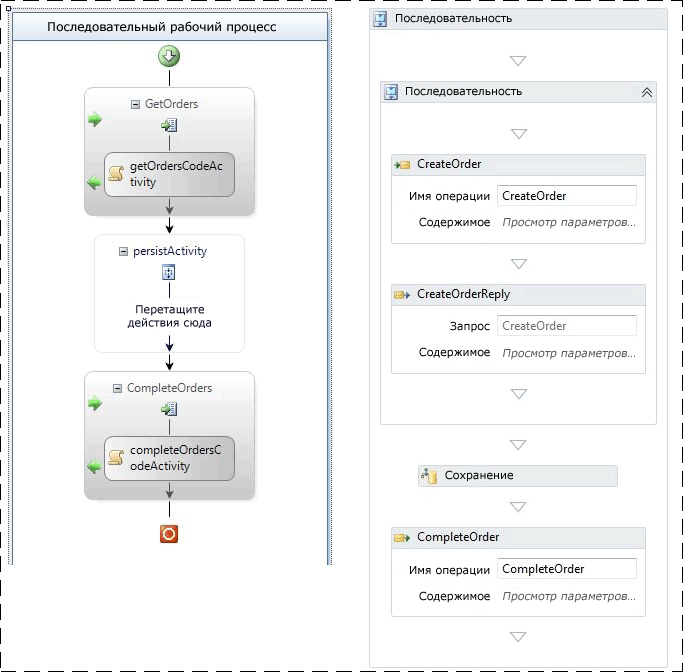  
  
 Рис. 5. Сохраняемый рабочий процесс в WF3 \(слева\) и WF4 \(справа\)  
  
 Оба рабочих процесса создаются при получении сообщения.После отправки первого ответа рабочие процессы сохраняются.В случае WF3 для сохранения используется пустой объект <xref:System.Workflow.ComponentModel.TransactionScopeActivity>.Чтобы добиться того же эффекта в WF3, можно пометить действие как «сохранять при закрытии». Второе, коррелирующее, сообщение завершает рабочий процесс.Рабочие процессы сохраняются, но не выгружаются.  
  
### Результаты теста  
 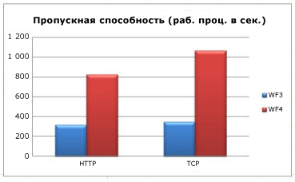  
  
 Когда транспортом между клиентом и средним уровнем является HTTP, сохраняемость в WF4 показывает улучшение в 2,6 раза.Транспорт TCP обеспечивает повышение этого коэффициента до 3,0 раза.Во всех случаях нагрузка на ЦП на среднем уровне — 98 % и выше.Причина повышения пропускной способности WF4 — более быстрая работа среды выполнения.Размер сериализованного экземпляра в обоих случаях невелик и поэтому не играет существенной роли в данном случае.  
  
 Рабочие процессы WF3 и WF4 в данном тесте используют действие для явного указания момента сохранения.Это дает преимущество — сохранение рабочего процесса без его выгрузки.В WF3 сохранение можно выполнить также с помощью функции <xref:System.ServiceModel.Activities.Description.WorkflowIdleBehavior.TimeToUnload%2A>, но тогда экземпляр рабочего процесса будет выгружен из памяти.Если разработчик, использующий WF3, хочет убедиться в сохранении рабочего процесса в какой\-либо точке, то ему необходимо либо изменить определение рабочего процесса, либо позаботиться о выгрузке и повторной загрузке экземпляра рабочего процесса.С помощью новой функции в WF4 это можно сделать без выгрузки: <xref:System.ServiceModel.Activities.Description.WorkflowIdleBehavior.TimeToPersist%2A>.Эта функция позволяет сохранить экземпляр рабочего процесса в фоновом режиме, но оставить в памяти до того момента, пока не будет достигнуто пороговое значение <xref:System.ServiceModel.Activities.Description.WorkflowIdleBehavior.TimeToUnload%2A> или не будет возобновлено выполнение.  
  
 Обратите внимание, что поставщик сохраняемости SQL в WF4 выполняет больше работы на уровне базы данных.База данных SQL может стать узким местом, поэтому важно отслеживать нагрузку на ЦП и дисковую подсистему на этом уровне.При выполнении теста производительности приложений рабочих процессов обязательно включите в базе данных SQL следующие счетчики производительности:  
  
-   PhysicalDisk\\%Disk Read Time  
  
-   PhysicalDisk\\% Disk Time  
  
-   PhysicalDisk\\% Disk Write Time  
  
-   PhysicalDisk\\% Avg.Disk Queue Length  
  
-   PhysicalDisk\\Avg.Disk Read Queue Length  
  
-   PhysicalDisk\\Avg.Disk Write Queue Length  
  
-   PhysicalDisk\\Current Disk Queue Length  
  
-   Processor Information\\% Processor Time  
  
-   SQLServer:Latches\\Average Latch Wait Time \(ms\)  
  
-   SQLServer:Latches\\Latch Waits\/sec  
  
### Отслеживание  
 Для отслеживания хода выполнения рабочего процесса можно воспользоваться трассировкой рабочего процесса.Информация, содержащаяся в событиях трассировки, определяется его профилем.Чем сложнее профиль трассировки, тем выше ее ресурсоемкость.  
  
 В состав WF3 входит служба трассировки на основе SQL.Она может работать в пакетном и непакетном режимах.В непакетном режиме события трассировки записываются напрямую в базу данных.В пакетном режиме они накапливаются в том же пакете, что и состояние экземпляра рабочего процесса.Пакетный режим характеризуется более высокой производительностью для широкого выбора применений.Однако пакетный режим может оказать отрицательное влияние на производительность в том случае, если рабочий процесс выполняет множество действий без сохранения и производится трассировка этих действий.Такое часто случается в циклах, и лучший способ избежать этого — укрупнение циклов с включением в них точек сохранения.Появление в цикле точки сохранения может отрицательно сказаться на производительности, поэтому здесь важно чувство меры.  
  
 В состав WF4 служба трассировки на основе SQL не входит.Регистрацию трассировочных сведений в SQL лучше реализовать на сервере приложений, чем встраивать в [!INCLUDE[dnprdnshort](../../../includes/dnprdnshort-md.md)].Поэтому трассировку SQL теперь обрабатывает AppFabric.Готовый поставщик трассировки в WF4 создан на основе средства отслеживания трассировки событий Windows \(ETW\).  
  
 Трассировка событий Windows — встроенная в Windows система обработки событий, которая работает на уровне ядра и имеет низкий уровень задержек.В ней реализована модель «поставщик\-потребитель», поэтому при трассировке событий нагрузка на систему возникает только в том случае, когда существует реальный потребитель.Помимо событий уровня ядра \(использование процессора, диска, памяти и сети\), многие приложения также задействуют трассировку событий Windows.События трассировки событий Windows обладают более мощными возможностями, чем счетчики производительности, поскольку события могут быть настроены приложением.Событие может содержать текст, например идентификатор рабочего процесса или информационное сообщение.Кроме того, события делятся на категории по битовым маскам и поэтому потребление подмножества событий оказывает меньшее влияние на производительность, чем захват всего потока событий.  
  
 Подход, предусматривающий использование для трассировки событий Windows вместо SQL, обеспечивает следующие преимущества.  
  
-   Сбор событий трассировки можно выделить в отдельный процесс.Это дает огромную гибкость при выборе способа их регистрации.  
  
-   События трассировки событий Windows легко сочетаются с событиями Windows [!INCLUDE[indigo2](../../../includes/indigo2-md.md)] и любыми другими поставщиками ETW, включая поставщик SQL Server или поставщик ядра.  
  
-   Автору рабочего процесса не нужно вносить в него изменения, чтобы адаптировать к конкретной реализации трассировки, например к службе трассировки SQL для WF3 в пакетном режиме.  
  
-   Администратор может включать и выключать трассировку без перезапуска хост\-процесса.  
  
 Выигрыш в производительности для отслеживания трассировки событий Windows имеет и обратную сторону.События трассировки событий Windows могут быть потеряны, если система испытывает критическую нехватку ресурсов.Обработка событий не означает блокировку нормального выполнения программы, поэтому доставка всех событий трассировки событий Windows всем подписчикам не гарантируется.Поэтому трассировка событий Windows отлично подходит для наблюдения за работоспособностью системы, но непригодна для аудита.  
  
 Хотя в WF4 нет поставщика трассировки SQL, он есть в AppFabric.Методика трассировки SQL, реализованная в AppFabric, предусматривает подписку на события трассировки событий Windows с помощью службы Windows, когда события накапливаются в пакеты и записываются в таблицу SQL, рассчитанную на быструю вставку.Отдельное задание забирает данные из этой таблицы и формирует на их основе таблицы отчетов, которые можно просмотреть на панели мониторинга AppFabric.Это означает, что пакеты событий трассировки обрабатываются независимо от рабочего процесса, из которого они поступили, поэтому не нужно ждать точки сохранения.  
  
 События трассировки событий Windows могут регистрироваться с помощью таких средств, как logman или xperf.Компактный файл ETL можно просмотреть с помощью такого средства, как xperfview, или преобразовать в более удобочитаемый формат, например XML, с помощью tracerpt.В WF3 единственная возможность получения событий трассировки без базы данных SQL — создание пользовательской службы трассировки.[!INCLUDE[crabout](../../../includes/crabout-md.md)] трассировке событий Windows см. в разделах [Службы WCF и средство отслеживания событий для Windows](../../../docs/framework/wcf/samples/wcf-services-and-event-tracing-for-windows.md) и [Средство отслеживания событий для Windows](http://msdn.microsoft.com/library/ff190903.aspx\)).  
  
 Включение отслеживания рабочих процессов может по\-разному отразиться на производительности.В приведенном ниже тесте в качестве потребителя событий трассировки событий Windows используется средство logman, которое записывает их в файл ETL.Затраты на трассировку SQL в AppFabric выходят за рамки данной статьи.В этом тесте показан базовый профиль трассировки, также используемый в AppFabric.Кроме того, включены затраты трассировки только для событий мониторинга работоспособности.Эти события удобно использовать для диагностики проблем и определения средней пропускной способности системы.  
  
### Настройка среды  
   
  
### Результаты теста  
 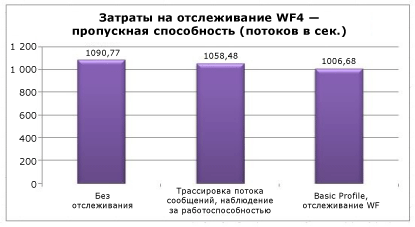  
  
 Наблюдение за работоспособностью занимает примерно 3 % пропускной способности.Затраты на обслуживание базового профиля — около 8 %.  
  
## Interop  
 WF4 представляет собой почти полностью переписанный [!INCLUDE[wf1](../../../includes/wf1-md.md)], поэтому рабочие процессы и действия WF3 не являются непосредственно совместимыми c WF4.Многие клиенты, давно перешедшие на [!INCLUDE[wf2](../../../includes/wf2-md.md)], уже имеют собственные или сторонние определения рабочих процессов и пользовательских действий для WF3.Одним из способов облегчить переход на WF4 является использование действия Interop, которое способно выполнять действия WF3 в рабочих процессах WF4.Рекомендуется использовать действие <xref:System.Activities.Statements.Interop> только при необходимости.[!INCLUDE[crabout](../../../includes/crabout-md.md)] переходе на WF4 см. в [руководстве по миграции в WF4](http://go.microsoft.com/fwlink/?LinkID=153313).  
  
### Настройка среды  
   
  
### Результаты теста  
 В следующей таблице показаны результаты выполнения рабочего процесса, содержащего пять последовательных действий в различных конфигурациях.  
  
|Тест|Пропускная способность \(рабочих процессов\/сек\)|  
|----------|-------------------------------------------------------|  
|Последовательность WF3 в среде выполнения WF3|1,576|  
|Последовательность WF3 в среде выполнения WF4 через действие Interop|2,745|  
|Последовательность WF4|153,582|  
  
 Имеется заметное повышение производительности при использовании Interop по сравнению с простым WF3.Тем не менее по сравнению с действиями WF4 повышение незначительно.  
  
## Резюме  
 Крупные вложения в повышение производительности для WF4 окупаются во многих важных областях.Производительность отдельных компонентов рабочих процессов в WF4 в ряде случаев в сотни раз выше, чем в WF3, благодаря более экономной среде выполнения [!INCLUDE[wf1](../../../includes/wf1-md.md)].Показатели задержки также значительно лучше.Это означает, что издержки при использовании [!INCLUDE[wf1](../../../includes/wf1-md.md)] по сравнению со службами координации [!INCLUDE[indigo2](../../../includes/indigo2-md.md)], написанными вручную, не очень сильно отличаются. При этом имеется также преимущество использования [!INCLUDE[wf1](../../../includes/wf1-md.md)].Производительность сохранения данных повысилась в 2,5–3,0 раза.Наблюдение за работоспособностью при применении трассировки рабочего процесса имеет очень малые издержки.Для тех, кто планирует переход с WF3 на WF4, имеется широкий выбор руководств по миграции.Все это делает WF4 привлекательным выбором для написания сложных приложений.  
  
## Благодарности  
 Выражаем огромную благодарность следующим участникам и рецензентам за их усилия:  
  
-   Леон Велицки \(Leon Welicki\), корпорация Майкрософт  
  
-   Ричард Квецински \(Ryszard Kwiecinski\), корпорация Майкрософт  
  
-   Эмиль Велинов \(Emil Velinov\), корпорация Майкрософт  
  
-   Нэйт Тэлберт \(Nate Talbert\), корпорация Майкрософт  
  
-   Боб Шмидт \(Bob Schmidt\), корпорация Майкрософт  
  
-   Штефан Батрес \(Stefan Batres\), корпорация Майкрософт